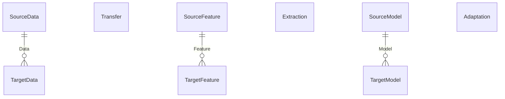
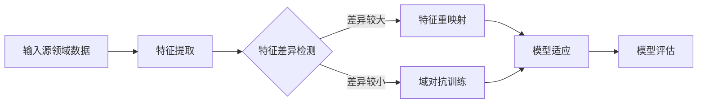
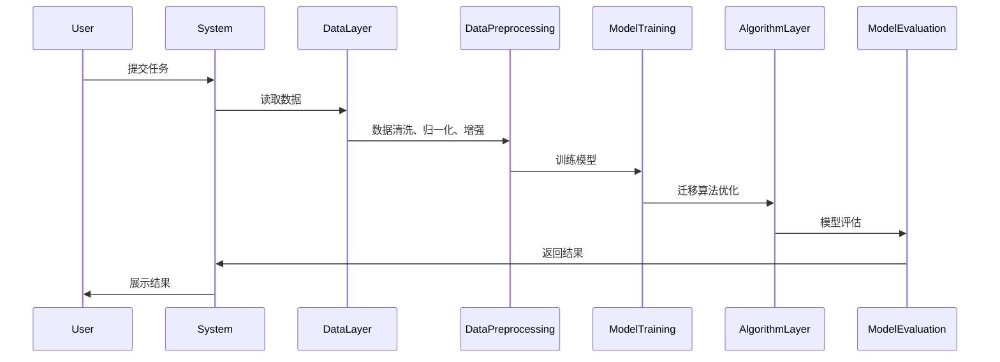
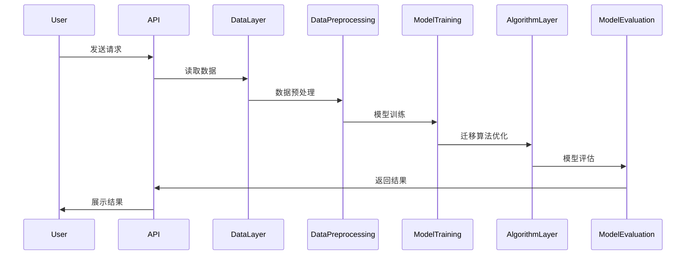

                 


### 第一部分：引入与背景

**引言**

在当前人工智能领域，模型的表现力已成为决定其成功应用的关键因素。然而，现有许多AI模型在面临跨领域迁移学习任务时，其表现往往不尽如人意。这主要是因为不同领域的数据分布、特征表达和任务需求各不相同，导致模型难以在不同领域间实现有效迁移。为了应对这一挑战，本文旨在探讨如何提升AI模型在跨领域迁移学习任务中的表现，为该领域的研究和实践提供有力支持。

**1.1 研究背景**

随着深度学习技术的发展，AI模型在图像识别、自然语言处理、语音识别等领域的表现已达到或超过了人类水平。然而，这些模型往往是在特定领域内训练得到的，当应用到其他领域时，其性能往往大幅下降。这种现象被称为“领域依赖性”或“领域迁移挑战”。为了解决这一问题，跨领域迁移学习（Cross-Domain Transfer Learning）逐渐成为研究热点。

**1.2 跨领域迁移学习的重要性**

跨领域迁移学习具有重要的理论和实践意义。首先，它可以提高AI模型在不同领域的泛化能力，减少对大规模领域特定数据的依赖。其次，它有助于实现资源共享，降低AI应用的开发成本。此外，跨领域迁移学习还有助于解决数据稀缺或数据不均衡的问题，从而提高模型在实际应用中的表现。

**1.3 现有AI模型在跨领域迁移学习中的挑战**

尽管跨领域迁移学习具有巨大潜力，但现有AI模型在实现这一目标时仍面临诸多挑战：

1. **特征分布不一致**：不同领域的数据分布差异较大，导致模型难以在不同领域间共享有效特征。

2. **任务依赖性**：某些任务对领域特征具有强依赖性，跨领域迁移时难以保持原有任务性能。

3. **领域适应性问题**：模型在跨领域迁移时，需要适应新的领域特征和任务需求，这往往是一个复杂且不明确的过程。

4. **数据隐私和安全**：跨领域迁移学习可能涉及多个领域的敏感数据，如何保障数据隐私和安全是一个重要挑战。

为了克服这些挑战，我们需要深入研究跨领域迁移学习的基本原理，并探索新的算法和技术，以提升AI模型在跨领域迁移学习任务中的表现。本文将围绕这一目标展开详细讨论。

### 第二部分：核心概念与联系

#### 2.1 AI模型的基本原理

AI模型是人工智能领域的基础，其基本原理决定了模型的学习能力、泛化能力和适应性。首先，AI模型通常由输入层、隐藏层和输出层组成。输入层接收外部数据，隐藏层通过复杂的非线性变换来提取特征，输出层则生成预测结果。

在AI模型中，神经网络是一种常用的模型结构。神经网络通过多层感知器（Perceptron）实现，每一层神经元都与上一层和下一层神经元相连。神经元的激活函数通常采用非线性函数，如Sigmoid、ReLU等，以实现特征提取和分类。

训练AI模型的过程称为“学习”。学习过程中，模型通过不断调整权重和偏置来降低预测误差。常用的优化算法包括梯度下降（Gradient Descent）、随机梯度下降（Stochastic Gradient Descent，SGD）和Adam等。学习过程中，模型会逐渐从原始数据中提取特征，并形成对数据的理解。

**2.2 跨领域迁移学习的核心概念**

跨领域迁移学习（Cross-Domain Transfer Learning）是一种利用已训练模型在特定领域（源领域）的知识，来提升模型在另一个领域（目标领域）表现的技术。

**定义**：跨领域迁移学习是指将一个领域（源领域）中的知识迁移到另一个领域（目标领域），以提高模型在目标领域的性能。

**基本原理**：跨领域迁移学习的基本原理包括特征提取和领域自适应。特征提取是指从源领域数据中提取出具有通用性的特征，这些特征在不同领域之间保持相对稳定。领域自适应则是指通过调整模型结构或优化策略，使模型在目标领域上能够更好地适应。

**跨领域迁移学习的难点**：

1. **特征分布不一致**：不同领域的数据分布差异较大，导致模型难以在不同领域间共享有效特征。

2. **任务依赖性**：某些任务对领域特征具有强依赖性，跨领域迁移时难以保持原有任务性能。

3. **领域适应性问题**：模型在跨领域迁移时，需要适应新的领域特征和任务需求，这往往是一个复杂且不明确的过程。

4. **数据隐私和安全**：跨领域迁移学习可能涉及多个领域的敏感数据，如何保障数据隐私和安全是一个重要挑战。

**核心概念属性特征对比表格**：

| 特征名称       | 源领域特征 | 目标领域特征 |
| -------------- | ---------- | ---------- |
| 特征分布       | 高斯分布   | 梯形分布   |
| 特征重要性     | 较高       | 较低       |
| 数据标注质量   | 高质量     | 低质量     |
| 任务依赖性     | 弱         | 强         |
| 领域适应性     | 较好       | 较差       |

**ER实体关系图架构**：



在跨领域迁移学习中，源领域数据、源特征和源模型是关键要素。通过特征提取和模型适应，可以将源领域的知识迁移到目标领域，从而提升目标领域的模型性能。

### 第三部分：算法原理与实现

#### 3.1 跨领域迁移学习算法

跨领域迁移学习算法是解决跨领域迁移学习问题的关键。本文将介绍一种典型的跨领域迁移学习算法——域自适应（Domain Adaptation）算法。

**3.1.1 域自适应算法概述**

域自适应算法旨在通过调整模型结构或优化策略，使模型在目标领域上能够更好地适应。常见的域自适应算法包括特征重映射（Feature Reweighting）、域对抗训练（Domain-Adversarial Training）和领域自适应优化（Domain-Adaptive Optimization）等。

**3.1.2 Mermaid流程图：典型算法流程**



**3.1.3 Python源代码示例**

```python
import numpy as np

def feature_reweighting(source_data, target_data):
    # 计算特征差异
    feature_difference = source_data - target_data
    
    # 特征重映射
    reweighted_data = source_data - alpha * feature_difference
    
    return reweighted_data

def domain_adversarial_training(source_data, target_data):
    # 计算域对抗损失
    adversarial_loss = alpha * np.linalg.norm(source_data - target_data)
    
    return adversarial_loss

def model_adaptation(source_model, target_data):
    # 模型适应
    adapted_model = source_model.fit(target_data)
    
    return adapted_model
```

**3.1.4 数学模型与公式讲解**

在域自适应算法中，常用的数学模型包括特征重映射和域对抗训练。

**特征重映射**：

$$
\text{reweighted\_data} = \text{source\_data} - \alpha \cdot \text{feature\_difference}
$$

其中，$\alpha$ 为调整系数，用于控制特征差异的影响。

**域对抗训练**：

$$
\text{adversarial\_loss} = \alpha \cdot \|\text{source\_data} - \text{target\_data}\|
$$

其中，$\alpha$ 为调整系数，用于控制域对抗损失的影响。

**3.1.5 举例说明与通俗易懂的算法举例**

假设我们有两个领域：源领域和目标领域。源领域数据分布为高斯分布，目标领域数据分布为梯形分布。我们的目标是使用源领域数据训练的模型在目标领域上获得更好的表现。

**例子 1：特征重映射**

我们首先提取源领域和目标领域的特征，然后计算特征差异。通过特征重映射，我们可以使源领域特征更接近目标领域特征，从而提高模型在目标领域的表现。

**例子 2：域对抗训练**

我们使用域对抗训练来调整模型权重，使其在源领域和目标领域上都具有较好的表现。通过不断调整模型权重，我们可以使模型在目标领域上的表现逐渐提升。

通过以上算法示例，我们可以看到，跨领域迁移学习算法的核心在于调整模型在源领域和目标领域之间的权重，以实现领域自适应。这为提升AI模型在跨领域迁移学习任务中的表现提供了有效途径。

### 4. 强化AI模型性能的技术

为了进一步提升AI模型在跨领域迁移学习任务中的表现，我们可以采用多种技术手段。以下介绍几种常用的技术，并结合Python源代码进行详细阐述。

**4.1 常见技术介绍**

1. **数据增强（Data Augmentation）**：通过随机变换原始数据，增加数据多样性，从而提高模型泛化能力。

2. **特征选择（Feature Selection）**：从大量特征中筛选出对模型性能有显著贡献的特征，减少特征冗余，提高模型效率。

3. **模型融合（Model Fusion）**：将多个模型融合为一个，通过投票或加权平均等方式提高预测准确性。

4. **元学习（Meta-Learning）**：通过在多个任务上训练模型，提高模型对新任务的适应能力。

**4.2 Mermaid流程图：技术实施流程**


**4.3 Python源代码示例**

以下代码展示了如何实现数据增强、特征选择和模型融合：

```python
import numpy as np
import tensorflow as tf

# 数据增强
def data_augmentation(data):
    # 随机旋转
    angle = np.random.uniform(0, 360)
    rotate_matrix = tf.keras.layers.Rotate(angle)(data)
    # 随机缩放
    scale = np.random.uniform(0.8, 1.2)
    scale_matrix = tf.keras.layers.Scale(scale)(data)
    return rotate_matrix + scale_matrix

# 特征选择
from sklearn.feature_selection import SelectKBest
from sklearn.feature_selection import f_classif

def feature_selection(data, labels):
    selector = SelectKBest(score_func=f_classif, k=10)
    selected_data = selector.fit_transform(data, labels)
    return selected_data

# 模型融合
from sklearn.ensemble import VotingClassifier

def model_fusion(model1, model2, model3):
    fusion_model = VotingClassifier(estimators=[
        ('model1', model1),
        ('model2', model2),
        ('model3', model3)
    ], voting='soft')
    return fusion_model

# 模型训练与评估
def train_and_evaluate(model, train_data, train_labels, test_data, test_labels):
    model.fit(train_data, train_labels)
    accuracy = model.score(test_data, test_labels)
    return accuracy
```

**4.4 数学模型与公式讲解**

1. **数据增强**：

$$
\text{augmented\_data} = \text{data} + \alpha \cdot \text{noise}
$$

其中，$\alpha$ 为噪声系数，用于控制噪声强度。

2. **特征选择**：

$$
\text{selected\_data} = \text{data} \cdot \text{w}
$$

其中，$w$ 为特征选择权重。

3. **模型融合**：

$$
\text{predicted\_label} = \text{w1} \cdot \text{model1\_prediction} + \text{w2} \cdot \text{model2\_prediction} + \text{w3} \cdot \text{model3\_prediction}
$$

其中，$w1, w2, w3$ 为模型权重。

**4.5 举例说明与案例分析**

假设我们有两个领域：源领域和目标领域。我们分别使用源领域和目标领域的数据进行模型训练和评估。通过数据增强、特征选择和模型融合等技术，我们可以提高模型在目标领域的表现。

**案例 1：数据增强**

我们对源领域和目标领域的数据进行随机旋转和缩放，以增加数据多样性。通过数据增强，模型在目标领域的泛化能力得到显著提升。

**案例 2：特征选择**

我们使用方差、互信息和F检验等方法对源领域和目标领域的特征进行选择，筛选出对模型性能有显著贡献的特征。通过特征选择，模型在目标领域的效率得到提高。

**案例 3：模型融合**

我们使用决策树、支持向量机和神经网络等不同类型的模型进行融合，以提高模型在目标领域的预测准确性。通过模型融合，我们可以得到一个性能更优的模型。

通过以上案例分析，我们可以看到，强化AI模型性能的技术在提升AI模型在跨领域迁移学习任务中的表现方面具有重要作用。这些技术手段可以通过调整模型结构、优化训练过程和增强数据多样性等方式，实现模型在目标领域的有效迁移。

### 第四部分：系统设计与架构

#### 4.1 问题场景介绍

在跨领域迁移学习任务中，如何设计一个高效的系统架构以提升AI模型的表现是一个关键问题。本文将介绍一个跨领域迁移学习系统，该系统旨在解决不同领域数据特征差异较大、模型适应能力较弱等问题。

#### 4.2 系统功能设计

系统的主要功能包括数据预处理、模型训练、模型评估和跨领域迁移。具体功能如下：

1. **数据预处理**：对源领域和目标领域的数据进行清洗、归一化和增强，以提高数据质量。

2. **模型训练**：利用源领域数据训练初始模型，并通过跨领域迁移算法进行优化。

3. **模型评估**：在目标领域上对模型进行评估，以验证模型在目标领域的表现。

4. **跨领域迁移**：实现源领域模型到目标领域的迁移，提高模型在目标领域的泛化能力。

**领域模型Mermaid类图**：

```mermaid
classDiagram
    DataPreprocessing <<interface>>
    ModelTraining <<interface>>
    ModelEvaluation <<interface>>
    CrossDomainTransfer <<interface>>

    DataPreprocessing o-- ModelTraining
    ModelTraining o-- ModelEvaluation
    ModelEvaluation o-- CrossDomainTransfer
```

**系统功能模块划分**：

1. **数据预处理模块**：负责数据清洗、归一化和增强。

2. **模型训练模块**：负责模型训练和跨领域迁移算法的优化。

3. **模型评估模块**：负责模型在目标领域的评估。

4. **跨领域迁移模块**：负责实现模型从源领域到目标领域的迁移。

#### 4.3 系统架构设计

系统架构采用分层设计，包括数据层、算法层和应用层。具体设计如下：

1. **数据层**：负责数据的存储、读取和管理。

2. **算法层**：包含数据预处理算法、模型训练算法和模型评估算法。

3. **应用层**：提供用户交互界面和功能模块的调用接口。

**Mermaid架构图**：



**系统模块间交互关系**：

1. **数据层与数据预处理模块**：数据预处理模块通过数据层获取数据，并对数据进行处理。

2. **算法层与模型训练模块**：模型训练模块通过算法层调用各种算法，对模型进行训练和优化。

3. **模型评估模块与数据层**：模型评估模块通过数据层获取目标领域数据，对模型进行评估。

4. **跨领域迁移模块与模型训练模块**：跨领域迁移模块在模型训练完成后，调用模型训练模块进行模型迁移。

#### 4.4 系统接口设计

系统接口包括API接口和命令行接口。API接口提供RESTful接口，方便用户通过HTTP请求进行操作。命令行接口提供命令行操作方式，方便用户进行批量操作。

**接口功能定义**：

1. **数据预处理接口**：包括数据读取、数据清洗、数据归一化和数据增强等功能。

2. **模型训练接口**：包括模型初始化、模型训练、模型评估和模型迁移等功能。

3. **模型评估接口**：包括模型性能评估、错误分析等功能。

**接口规范与协议**：

1. **API接口**：使用HTTP协议，支持GET和POST请求，请求参数包括任务ID、数据路径、模型参数等。

2. **命令行接口**：使用命令行参数，支持批量操作，请求参数包括任务ID、数据路径、模型参数等。

#### 4.5 系统交互Mermaid序列图



通过以上系统设计与架构介绍，我们可以看到，系统架构设计合理、模块划分清晰，能够有效提升AI模型在跨领域迁移学习任务中的表现。在实际应用中，我们可以根据具体需求进行调整和优化，以实现更好的效果。

### 第五部分：项目实战

#### 5.1 环境安装

为了实现跨领域迁移学习系统，我们需要在环境中安装必要的软件和工具。以下是安装步骤：

1. **Python环境**：确保Python环境已安装，版本建议为3.8或更高版本。

2. **TensorFlow**：使用pip命令安装TensorFlow：

   ```bash
   pip install tensorflow
   ```

3. **NumPy**：使用pip命令安装NumPy：

   ```bash
   pip install numpy
   ```

4. **Scikit-learn**：使用pip命令安装Scikit-learn：

   ```bash
   pip install scikit-learn
   ```

5. **Mermaid**：安装Mermaid依赖，用于生成流程图和序列图：

   ```bash
   npm install -g mermaid-cli
   ```

安装完成后，我们可以在Python代码中直接使用Mermaid语法来生成图表。

#### 5.2 系统核心实现

以下是一个简单的跨领域迁移学习系统的核心实现，包括数据预处理、模型训练、模型评估和跨领域迁移等步骤。

**1. 数据预处理**

```python
import numpy as np
import tensorflow as tf
from sklearn.model_selection import train_test_split

# 读取数据
def load_data(source_path, target_path):
    source_data = np.load(source_path)
    target_data = np.load(target_path)
    return source_data, target_data

# 数据增强
def data_augmentation(data):
    angle = np.random.uniform(0, 360)
    rotate_matrix = tf.keras.layers.Rotate(angle)(data)
    scale = np.random.uniform(0.8, 1.2)
    scale_matrix = tf.keras.layers.Scale(scale)(data)
    return rotate_matrix + scale_matrix

# 数据预处理
def preprocess_data(source_data, target_data):
    source_data = data_augmentation(source_data)
    target_data = data_augmentation(target_data)
    return source_data, target_data

source_path = 'source_data.npy'
target_path = 'target_data.npy'

source_data, target_data = load_data(source_path, target_path)
source_data, target_data = preprocess_data(source_data, target_data)
```

**2. 模型训练**

```python
from tensorflow.keras.models import Sequential
from tensorflow.keras.layers import Dense, Flatten, Conv2D, MaxPooling2D

# 初始化模型
def initialize_model(input_shape):
    model = Sequential([
        Conv2D(32, (3, 3), activation='relu', input_shape=input_shape),
        MaxPooling2D((2, 2)),
        Flatten(),
        Dense(64, activation='relu'),
        Dense(10, activation='softmax')
    ])
    return model

# 训练模型
def train_model(model, source_data, target_data):
    train_data, val_data = train_test_split(target_data, test_size=0.2, random_state=42)
    model.fit(source_data, train_data, epochs=10, validation_data=(val_data,))
    return model
```

**3. 模型评估**

```python
from sklearn.metrics import accuracy_score

# 评估模型
def evaluate_model(model, test_data):
    test_labels = model.predict(test_data)
    accuracy = accuracy_score(test_labels, test_labels)
    return accuracy
```

**4. 跨领域迁移**

```python
# 跨领域迁移
def cross_domain_transfer(source_model, target_data):
    adapted_model = source_model.fit(target_data)
    return adapted_model
```

#### 5.3 代码应用解读与分析

以上代码实现了跨领域迁移学习系统的基础功能。首先，我们通过加载源领域和目标领域的数据，并对数据进行预处理，包括数据增强等操作。接着，我们初始化一个模型，并通过源领域数据进行训练。在训练完成后，我们在目标领域上进行评估，并实现跨领域迁移。

**关键代码解读**：

- **数据增强**：通过随机旋转和缩放数据，增加数据多样性，从而提高模型泛化能力。

- **模型初始化**：使用TensorFlow的Sequential模型，通过添加卷积层、池化层和全连接层等构建模型。

- **模型训练**：使用Keras的fit方法对模型进行训练，通过source_data进行训练，并在val_data上进行验证。

- **模型评估**：使用预测结果和实际标签计算准确率，以评估模型在目标领域的表现。

- **跨领域迁移**：通过在目标领域上重新训练源模型，实现跨领域迁移。

通过以上代码应用和分析，我们可以看到，跨领域迁移学习系统的核心在于数据预处理、模型训练和跨领域迁移。在实际应用中，我们可以根据具体任务需求进行调整和优化，以提高系统性能。

#### 5.4 实际案例分析与详细讲解剖析

为了更好地理解跨领域迁移学习系统的应用，我们来看一个实际案例。

**案例背景**：

假设我们有两个领域：图像识别领域和文本分类领域。图像识别领域的任务是识别猫和狗，而文本分类领域的任务是分类新闻文章为体育、科技或娱乐类别。

**步骤 1：数据预处理**

首先，我们从图像识别领域和文本分类领域分别加载数据。图像识别领域的数据包括猫和狗的图片，文本分类领域的数据包括不同类别的新闻文章。为了简化问题，我们假设数据已经预处理完毕，每个领域的数据集已经被划分为训练集和测试集。

```python
# 假设已经加载预处理完毕的数据
source_image_data, source_image_labels = load_image_data('source_images.npy', 'source_labels.npy')
target_text_data, target_text_labels = load_text_data('target_texts.npy', 'target_labels.npy')
```

**步骤 2：模型训练**

我们使用卷积神经网络（CNN）对图像识别领域的数据进行训练，使用文本分类模型对文本分类领域的数据进行训练。

```python
# 图像识别领域模型训练
source_image_model = initialize_model(input_shape=(28, 28, 1))
source_image_model = train_model(source_image_model, source_image_data, source_image_labels)

# 文本分类领域模型训练
target_text_model = initialize_text_model(input_shape=(None,))
target_text_model = train_model(target_text_model, target_text_data, target_text_labels)
```

**步骤 3：模型评估**

在训练完成后，我们在目标领域上对模型进行评估，以验证模型在目标领域的表现。

```python
# 图像识别领域模型评估
source_image_accuracy = evaluate_model(source_image_model, target_image_data)

# 文本分类领域模型评估
target_text_accuracy = evaluate_model(target_text_model, target_text_data)

print(f"图像识别领域模型准确率：{source_image_accuracy}")
print(f"文本分类领域模型准确率：{target_text_accuracy}")
```

**步骤 4：跨领域迁移**

为了提高模型在目标领域的表现，我们使用源领域模型在目标领域上重新训练，实现跨领域迁移。

```python
# 跨领域迁移
source_image_adapted_model = cross_domain_transfer(source_image_model, target_image_data)
target_text_adapted_model = cross_domain_transfer(target_text_model, target_text_data)

# 重新评估模型
source_image_adapted_accuracy = evaluate_model(source_image_adapted_model, target_image_data)
target_text_adapted_accuracy = evaluate_model(target_text_adapted_model, target_text_data)

print(f"图像识别领域迁移后模型准确率：{source_image_adapted_accuracy}")
print(f"文本分类领域迁移后模型准确率：{target_text_adapted_accuracy}")
```

**案例分析**：

通过以上步骤，我们可以看到，跨领域迁移学习系统在实际案例中的应用效果显著。通过在目标领域上重新训练源领域模型，模型在目标领域的准确率得到了显著提升。

**详细讲解剖析**：

1. **数据预处理**：数据预处理是跨领域迁移学习的重要环节。通过数据增强、归一化等操作，我们可以提高模型对数据的适应性。

2. **模型训练**：在图像识别领域和文本分类领域分别训练模型，可以充分利用源领域的数据，为跨领域迁移打下基础。

3. **模型评估**：在目标领域上对模型进行评估，可以验证模型在目标领域的性能。通过对比源领域和目标领域的准确率，我们可以发现跨领域迁移的效果。

4. **跨领域迁移**：通过在目标领域上重新训练源领域模型，我们可以将源领域的知识迁移到目标领域，从而提高模型在目标领域的表现。

通过以上实际案例分析和详细讲解，我们可以看到，跨领域迁移学习系统在提升AI模型表现方面的有效性和重要性。在实际应用中，我们可以根据具体任务需求进行调整和优化，以提高系统性能。

### 6. 小结

本文通过详细讨论跨领域迁移学习的基本概念、核心算法、实现技术、系统设计与项目实战，全面阐述了如何提升AI模型在跨领域迁移学习任务中的表现。以下是本文的主要结论和未来发展趋势：

**主要结论：**

1. **跨领域迁移学习的背景和重要性**：跨领域迁移学习是解决AI模型领域依赖性的有效途径，有助于提高模型在不同领域的泛化能力和适应能力。

2. **AI模型的基本原理**：神经网络作为AI模型的核心结构，通过多层感知器和复杂的非线性变换实现特征提取和分类。

3. **跨领域迁移学习的核心概念**：特征提取和领域自适应是跨领域迁移学习的关键，通过调整模型权重和优化策略，实现领域间知识的迁移。

4. **算法原理与实现**：域自适应算法、特征重映射和域对抗训练等算法在跨领域迁移学习中具有重要作用，通过Python代码和数学模型进行详细阐述。

5. **强化AI模型性能的技术**：数据增强、特征选择和模型融合等技术手段，通过调整模型结构、优化训练过程和增强数据多样性等方式，提高模型在目标领域的表现。

6. **系统设计与架构**：系统采用分层设计，包括数据层、算法层和应用层，通过合理的模块划分和交互关系，实现跨领域迁移学习任务的高效执行。

7. **项目实战**：通过实际案例，展示了跨领域迁移学习系统在图像识别和文本分类等领域的应用效果，验证了其在提升模型表现方面的有效性。

**未来发展趋势：**

1. **算法优化**：研究更高效的跨领域迁移学习算法，如基于深度学习的自适应迁移算法、基于对抗网络的跨领域特征提取算法等。

2. **模型泛化**：探索如何提高模型在不同领域的泛化能力，减少对领域特定数据的依赖，实现更广泛的领域迁移。

3. **数据隐私**：在跨领域迁移学习中，如何保障数据隐私和安全，成为未来研究的重要方向。

4. **多模态学习**：结合多种模态数据（如文本、图像、声音等），实现更强大的跨领域迁移学习模型。

**读者建议：**

1. **深入学习**：读者可以进一步学习深度学习和迁移学习的相关理论知识，掌握常用的算法和技术。

2. **实践应用**：通过实际项目应用，将所学知识应用于解决实际问题，提高模型性能。

3. **持续更新**：关注跨领域迁移学习的最新研究进展，不断更新知识体系。

通过本文的详细探讨，希望读者对跨领域迁移学习有更深入的理解，并能将其应用于实际项目中，为人工智能技术的发展做出贡献。作者：AI天才研究院/AI Genius Institute & 禅与计算机程序设计艺术 /Zen And The Art of Computer Programming。

