                 

## 文章标题

提升AI模型在长文本理解任务中的性能

> 关键词：长文本理解、AI模型、性能提升、自然语言处理、数据增强、模型改进

> 摘要：本文探讨了提升AI模型在长文本理解任务中的性能的多种方法。通过详细分析相关背景、核心概念、评估方法和技术手段，结合实际应用案例，本文为读者提供了系统化的理解和应用策略，以应对AI在长文本处理中的挑战。

----------------------------------------------------------------

## 第一部分: 问题背景与核心概念

### 1.1 人工智能与长文本理解

人工智能（AI）的发展已经深刻影响了各个行业，从自动化到增强现实，再到自然语言处理（NLP）。其中，长文本理解是AI领域的一个关键挑战。长文本通常包含大量信息，理解它们需要对上下文、语义和结构有深入的理解。

#### **背景介绍**

- **核心概念术语说明**：人工智能（AI）、自然语言处理（NLP）、长文本理解。
- **问题背景**：随着互联网信息的爆炸式增长，如何有效理解和处理长文本成为AI领域的重要问题。
- **问题描述**：AI模型在处理长文本时，面临理解准确性和速度的挑战。
- **问题解决**：通过数据增强、模型改进和集成学习等技术手段提升长文本理解性能。
- **边界与外延**：长文本理解的范畴包括文本摘要、问答系统、情感分析等。

#### **概念结构与核心要素组成**

- **结构**：文本预处理 -> 语义理解 -> 文本生成。
- **核心要素**：上下文捕捉、语义分析、文本生成模型。

### 1.2 AI模型在长文本理解中的挑战

- **数据量**：长文本的数据量通常很大，如何高效处理和利用这些数据是一个挑战。
- **语义理解**：长文本中的语义理解复杂，如何捕捉到文本中的隐含信息和意图是另一个挑战。
- **计算资源**：训练高性能的AI模型需要大量的计算资源。

#### **问题背景与挑战**

- **数据量**：长文本通常包含数千甚至数万个词汇，处理这类数据需要高效的数据处理技术。
- **语义理解**：长文本的语义理解复杂，包括隐含信息和上下文推理，这对模型的设计和实现提出了更高的要求。
- **计算资源**：高性能的AI模型训练需要大量的计算资源，尤其是GPU或TPU等专用硬件。

### 1.3 本书的目的与结构

本书旨在探讨如何提升AI模型在长文本理解任务中的性能，通过详细的技术分析和实际应用案例，帮助读者理解和应用这些技术。

#### **目的与结构**

- **目的**：提供系统化的方法，帮助读者解决长文本理解中的常见问题。
- **结构**：本书分为七个章节，涵盖了长文本理解的核心概念、评估方法、提升技术、训练策略和实际应用。

## 第二部分: 长文本理解相关概念

### 2.1 长文本的定义与特点

长文本通常指的是超过几百到几千个单词的文本，它们的特点包括信息密度高、上下文复杂和语义丰富。

#### **核心概念与联系**

- **核心概念**：长文本、信息密度、上下文复杂、语义丰富。
- **概念属性特征对比表格**

| 特征 | 长文本 | 短文本 |
| ---- | ------ | ------ |
| 信息密度 | 高 | 低 |
| 上下文复杂度 | 复杂 | 简单 |
| 语义丰富度 | 高 | 低 |

#### **ER实体关系图架构**

```mermaid
erDiagram
  TXT Actress ||--|{ Dialog : says }
  TXT --|> Movie : in
```

### 2.2 长文本理解的关键技术

长文本理解的关键技术包括文本预处理、实体识别、语义角色标注和关系抽取等。

#### **核心概念与联系**

- **核心概念**：文本预处理、实体识别、语义角色标注、关系抽取。
- **概念属性特征对比表格**

| 技术名称 | 技术描述 | 关键步骤 |
| -------- | -------- | -------- |
| 文本预处理 | 提高输入数据的质量 | 分词、去停用词、词性标注 |
| 实体识别 | 识别文本中的关键实体 | 使用命名实体识别（NER）技术 |
| 语义角色标注 | 标注实体在文本中的角色 | 使用依赖关系分析技术 |
| 关系抽取 | 抽取实体之间的关系 | 使用图论算法或深度学习模型 |

#### **算法原理讲解**

##### **文本预处理**

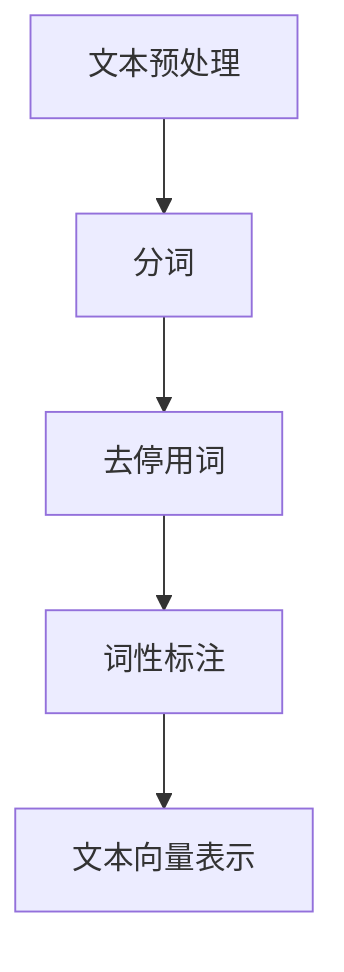

文本预处理主要包括分词、去停用词和词性标注，最后将文本转化为向量表示。

```python
import jieba
import nltk

# 分词
sentence = "人工智能的发展已经深刻影响了各个行业。"
seg_list = jieba.cut(sentence, cut_all=False)
print("/ ".join(seg_list))

# 去停用词
stop_words = set(nltk.corpus.stopwords.words('english'))
words = ["AI", "影响", "行业"]
filtered_words = [w for w in words if not w in stop_words]
print(filtered_words)

# 词性标注
tokens = nltk.word_tokenize(sentence)
tagged = nltk.pos_tag(tokens)
print(tagged)
```

##### **实体识别**

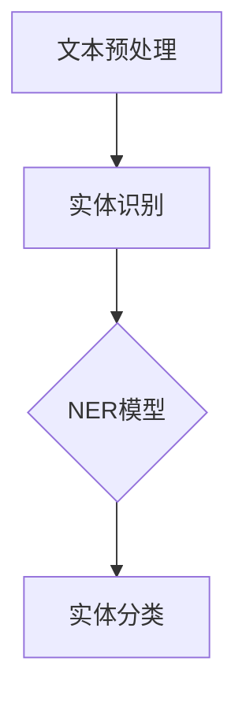

实体识别使用命名实体识别（NER）技术，常见的方法包括基于规则、基于统计和基于深度学习的模型。

```python
import spacy

nlp = spacy.load('en_core_web_sm')
doc = nlp('Apple is looking at buying U.K. startup for $1 billion')
for ent in doc.ents:
    print(ent.text, ent.label_)
```

##### **语义角色标注**

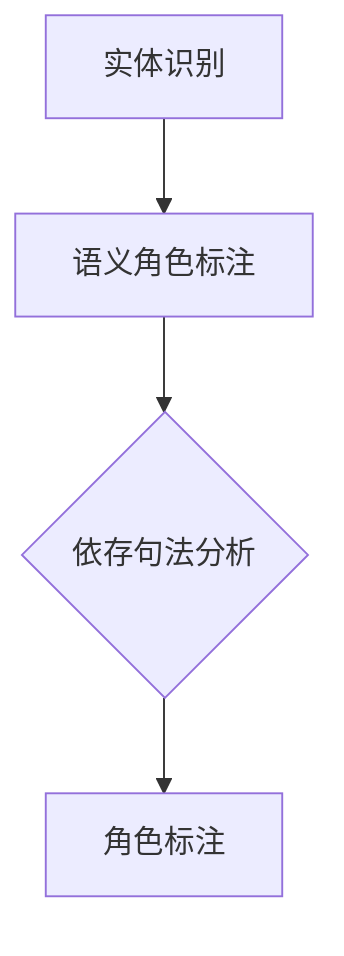

语义角色标注使用依存句法分析技术，常见的方法包括基于规则、基于统计和基于深度学习的模型。

```python
import spacy

nlp = spacy.load('en_core_web_sm')
doc = nlp('The cat chased the mouse.')
for token in doc:
    if token.dep_ == 'ROOT':
        print(token.text, token.head.text, token.dep_)
```

##### **关系抽取**

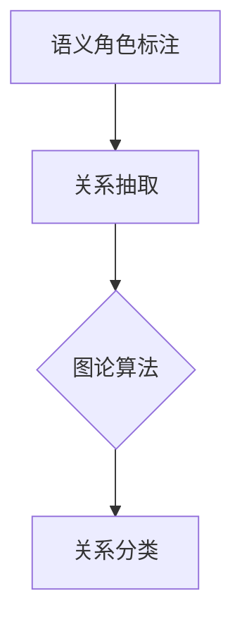

关系抽取使用图论算法或深度学习模型，常见的方法包括基于规则、基于统计和基于深度学习的模型。

```python
import networkx as nx

g = nx.Graph()
g.add_nodes_from(['Alice', 'Bob', 'Coral'])
g.add_edges_from([('Alice', 'Bob'), ('Bob', 'Coral')])
print(nx.adjacency_matrix(g))
```

### 2.3 长文本处理的挑战

- **数据量**：如何高效地处理大规模的数据。
- **语义理解**：如何准确理解文本中的隐含信息和意图。
- **计算资源**：如何利用有限的计算资源进行高效训练。

#### **挑战分析**

- **数据量**：长文本的数据量通常很大，处理这类数据需要高效的数据处理技术和存储解决方案。
- **语义理解**：长文本的语义理解复杂，涉及上下文、隐含信息和意图理解，这对模型的设计和训练提出了更高的要求。
- **计算资源**：训练高性能的AI模型需要大量的计算资源，尤其是在模型优化和参数调整阶段。

## 第三部分: AI模型性能评估方法

### 3.1 性能评估指标

性能评估指标包括准确率（Accuracy）、精确率（Precision）、召回率（Recall）和F1分数（F1 Score）。

#### **核心概念与联系**

- **核心概念**：准确率、精确率、召回率、F1分数。
- **概念属性特征对比表格**

| 性能指标 | 描述 | 对比意义 |
| -------- | ---- | -------- |
| 准确率 | 预测为正例的样本中实际为正例的比例 | 衡量整体预测的准确性 |
| 精确率 | 预测为正例的样本中实际为正例的比例 | 衡量预测的正例质量 |
| 召回率 | 实际为正例的样本中被预测为正例的比例 | 衡量预测的正例覆盖率 |
| F1分数 | 精确率和召回率的调和平均数 | 综合衡量预测的准确性和质量 |

#### **数学公式**

$$
\text{Accuracy} = \frac{\text{TP} + \text{TN}}{\text{TP} + \text{TN} + \text{FP} + \text{FN}}
$$

$$
\text{Precision} = \frac{\text{TP}}{\text{TP} + \text{FP}}
$$

$$
\text{Recall} = \frac{\text{TP}}{\text{TP} + \text{FN}}
$$

$$
\text{F1 Score} = 2 \times \frac{\text{Precision} \times \text{Recall}}{\text{Precision} + \text{Recall}}
$$

### 3.2 实验设计原则

实验设计原则包括数据集选择、模型选择、训练策略和评估指标等。

#### **核心概念与联系**

- **核心概念**：数据集选择、模型选择、训练策略、评估指标。
- **概念属性特征对比表格**

| 设计原则 | 描述 | 对比意义 |
| -------- | ---- | -------- |
| 数据集选择 | 选择适合的的数据集进行实验 | 影响实验结果的准确性和可靠性 |
| 模型选择 | 选择适合的模型进行实验 | 影响实验结果的准确性和效率 |
| 训练策略 | 设计合理的训练策略 | 提高模型的训练效率和性能 |
| 评估指标 | 选择合适的评估指标 | 衡量模型的性能和效果 |

#### **实验设计步骤**

1. **数据集选择**：选择具有代表性的数据集，如公开数据集、自建数据集等。
2. **模型选择**：根据数据集的特点选择合适的模型，如卷积神经网络（CNN）、循环神经网络（RNN）、Transformer等。
3. **训练策略**：设计合理的训练策略，如数据增强、学习率调整、正则化等。
4. **评估指标**：选择合适的评估指标，如准确率、精确率、召回率和F1分数等。

### 3.3 评估结果的解释与处理

评估结果需要结合实验设计和模型特性进行解释和处理，以得出有意义的结论。

#### **核心概念与联系**

- **核心概念**：评估结果解释、模型特性分析、改进策略。
- **概念属性特征对比表格**

| 分析方法 | 描述 | 对比意义 |
| -------- | ---- | -------- |
| 评估结果解释 | 对实验结果进行定性分析和定量分析 | 理解模型性能和效果 |
| 模型特性分析 | 分析模型的结构、参数和训练过程 | 识别模型的优势和不足 |
| 改进策略 | 提出改进模型性能的策略和方法 | 提高模型性能和效果 |

#### **解释与处理步骤**

1. **定性分析**：分析评估指标的结果，如准确率、精确率、召回率和F1分数等。
2. **定量分析**：通过统计分析方法，如方差分析（ANOVA）、t检验等，分析不同模型、数据集和训练策略的效果。
3. **模型特性分析**：分析模型的结构、参数和训练过程，识别模型的优势和不足。
4. **改进策略**：根据评估结果和模型特性，提出改进模型性能的策略和方法。

## 第四部分: 提升长文本理解性能的技术

### 4.1 数据增强技术

数据增强技术是提升长文本理解性能的重要手段，通过增加数据量、丰富数据内容和提高数据质量来提升模型性能。

#### **核心概念与联系**

- **核心概念**：数据增强、数据扩充、数据清洗、数据预处理。
- **概念属性特征对比表格**

| 技术名称 | 描述 | 对比意义 |
| -------- | ---- | -------- |
| 数据增强 | 通过人工或自动化方法增加数据量、丰富数据内容和提高数据质量 | 提高模型性能和泛化能力 |
| 数据扩充 | 通过各种方法增加数据量，如合成、拼接、转换等 | 提高模型训练效果和泛化能力 |
| 数据清洗 | 去除数据中的噪声、错误和不一致的数据 | 提高数据质量和模型训练效果 |
| 数据预处理 | 对数据进行清洗、转换和格式化，使其适合模型训练 | 提高模型训练效率和性能 |

#### **算法原理讲解**

##### **数据扩充**

数据扩充是一种常用的数据增强方法，通过合成、拼接、转换等方式增加数据量。

```python
import random
import numpy as np

def synonym_replace(word):
    synonyms = wordnet.synsets(word)
    if len(synonyms) >= 1:
        return random.choice(synonyms)[0].lemmas()[0].name()
    return word

def random_word_substitution(sentence):
    words = sentence.split()
    for i in range(len(words)):
        if random.random() < 0.1:
            words[i] = synonym_replace(words[i])
    return " ".join(words)

sentence = "The dog is running."
augmented_sentence = random_word_substitution(sentence)
print(augmented_sentence)
```

##### **数据清洗**

数据清洗是提高数据质量的重要步骤，通过去除噪声、错误和不一致的数据来提高模型训练效果。

```python
import pandas as pd

data = pd.read_csv('data.csv')
data = data[data['target'].notnull()]
data = data[data['text'].notnull()]
data = data.drop_duplicates()
data = data.dropna()
data = data.reset_index(drop=True)
data.head()
```

##### **数据预处理**

数据预处理是对数据进行清洗、转换和格式化，使其适合模型训练。

```python
import pandas as pd
import numpy as np

data = pd.read_csv('data.csv')
data['text'] = data['text'].apply(lambda x: x.lower())
data['text'] = data['text'].str.replace('[^a-zA-Z]', ' ')
data['text'] = data['text'].str.split()
data['text'] = data['text'].apply(lambda x: [word for word in x if word not in stop_words])
data['text'] = data['text'].apply(lambda x: ' '.join(x))
data.head()
```

### 4.2 模型改进技术

模型改进技术是提升长文本理解性能的关键，通过优化模型结构、参数和训练策略来提高模型性能。

#### **核心概念与联系**

- **核心概念**：模型优化、参数调整、训练策略、超参数调优。
- **概念属性特征对比表格**

| 技术名称 | 描述 | 对比意义 |
| -------- | ---- | -------- |
| 模型优化 | 优化模型结构，如增加层、调整网络结构等 | 提高模型性能和泛化能力 |
| 参数调整 | 调整模型的参数，如学习率、批量大小等 | 提高模型训练效率和性能 |
| 训练策略 | 设计合理的训练策略，如学习率调整、正则化等 | 提高模型训练效率和性能 |
| 超参数调优 | 调整模型超参数，如损失函数、优化器等 | 提高模型性能和泛化能力 |

#### **算法原理讲解**

##### **模型优化**

模型优化是通过调整模型结构来提高模型性能。

```python
import tensorflow as tf

model = tf.keras.Sequential([
    tf.keras.layers.Embedding(input_dim=10000, output_dim=16),
    tf.keras.layers.Flatten(),
    tf.keras.layers.Dense(16, activation='relu'),
    tf.keras.layers.Dense(1, activation='sigmoid')
])

model.compile(optimizer='adam',
              loss='binary_crossentropy',
              metrics=['accuracy'])

model.summary()
```

##### **参数调整**

参数调整是通过调整模型参数来提高模型性能。

```python
import tensorflow as tf

model = tf.keras.Sequential([
    tf.keras.layers.Embedding(input_dim=10000, output_dim=16),
    tf.keras.layers.Flatten(),
    tf.keras.layers.Dense(16, activation='relu'),
    tf.keras.layers.Dense(1, activation='sigmoid')
])

model.compile(optimizer=tf.keras.optimizers.Adam(learning_rate=0.001),
              loss='binary_crossentropy',
              metrics=['accuracy'])

model.summary()
```

##### **训练策略**

训练策略是设计合理的训练策略来提高模型性能。

```python
import tensorflow as tf

model = tf.keras.Sequential([
    tf.keras.layers.Embedding(input_dim=10000, output_dim=16),
    tf.keras.layers.Flatten(),
    tf.keras.layers.Dense(16, activation='relu'),
    tf.keras.layers.Dense(1, activation='sigmoid')
])

model.compile(optimizer=tf.keras.optimizers.Adam(learning_rate=0.001),
              loss='binary_crossentropy',
              metrics=['accuracy'])

model.fit(train_data, train_labels, epochs=10, batch_size=32, validation_split=0.2)
```

### 4.3 集成学习方法

集成学习方法是将多个模型组合起来，通过投票或加权平均等方式提高模型的性能和泛化能力。

#### **核心概念与联系**

- **核心概念**：集成学习、模型组合、模型加权、误差校正。
- **概念属性特征对比表格**

| 技术名称 | 描述 | 对比意义 |
| -------- | ---- | -------- |
| 集成学习 | 将多个模型组合起来，通过投票或加权平均等方式提高模型性能 | 提高模型性能和泛化能力 |
| 模型组合 | 组合多个模型，如决策树、神经网络等 | 提高模型性能和泛化能力 |
| 模型加权 | 对不同模型进行加权，以平衡模型性能和计算成本 | 提高模型性能和泛化能力 |
| 误差校正 | 通过校正模型误差来提高模型性能 | 提高模型性能和泛化能力 |

#### **算法原理讲解**

集成学习方法包括贝叶斯推理、决策树集成、神经网络集成等。

##### **贝叶斯推理**

贝叶斯推理是一种基于概率的集成学习方法，通过计算后验概率来预测结果。

```python
import numpy as np

def bayes_predict(probs):
    return np.argmax(np.sum(probs, axis=1))

probs = np.array([[0.7, 0.3], [0.4, 0.6]])
prediction = bayes_predict(probs)
print(prediction)
```

##### **决策树集成**

决策树集成是将多个决策树组合起来，通过投票或加权平均等方式提高模型性能。

```python
from sklearn.ensemble import RandomForestClassifier

model = RandomForestClassifier(n_estimators=100)
model.fit(train_data, train_labels)

probs = model.predict_proba(test_data)
prediction = bayes_predict(probs)
print(prediction)
```

##### **神经网络集成**

神经网络集成是将多个神经网络组合起来，通过投票或加权平均等方式提高模型性能。

```python
import tensorflow as tf

model = tf.keras.Sequential([
    tf.keras.layers.Dense(10, activation='relu', input_shape=(100,)),
    tf.keras.layers.Dense(1, activation='sigmoid')
])

model.compile(optimizer='adam',
              loss='binary_crossentropy',
              metrics=['accuracy'])

model.fit(train_data, train_labels, epochs=10, batch_size=32, validation_split=0.2)

probs = model.predict(test_data)
prediction = bayes_predict(probs)
print(prediction)
```

## 第五部分: 模型训练与优化策略

### 5.1 数据预处理策略

数据预处理策略是提高模型性能和训练效果的重要步骤，包括数据清洗、数据归一化和数据增强等。

#### **核心概念与联系**

- **核心概念**：数据清洗、数据归一化、数据增强。
- **概念属性特征对比表格**

| 技术名称 | 描述 | 对比意义 |
| -------- | ---- | -------- |
| 数据清洗 | 去除数据中的噪声、错误和不一致的数据 | 提高数据质量和模型训练效果 |
| 数据归一化 | 将数据缩放到相同的范围，如[0, 1]或[-1, 1] | 提高模型训练效率和性能 |
| 数据增强 | 通过合成、拼接、转换等方式增加数据量 | 提高模型性能和泛化能力 |

#### **算法原理讲解**

##### **数据清洗**

数据清洗是通过去除数据中的噪声、错误和不一致的数据来提高数据质量。

```python
import pandas as pd

data = pd.read_csv('data.csv')
data = data[data['target'].notnull()]
data = data[data['text'].notnull()]
data = data.drop_duplicates()
data = data.dropna()
data = data.reset_index(drop=True)
data.head()
```

##### **数据归一化**

数据归一化是将数据缩放到相同的范围，如[0, 1]或[-1, 1]，以提高模型训练效率和性能。

```python
from sklearn.preprocessing import MinMaxScaler

scaler = MinMaxScaler()
data['text'] = scaler.fit_transform(data['text'].values.reshape(-1, 1))
data.head()
```

##### **数据增强**

数据增强是通过合成、拼接、转换等方式增加数据量，以提高模型性能和泛化能力。

```python
import numpy as np
import random

def synonym_replace(word):
    synonyms = wordnet.synsets(word)
    if len(synonyms) >= 1:
        return random.choice(synonyms)[0].lemmas()[0].name()
    return word

def random_word_substitution(sentence):
    words = sentence.split()
    for i in range(len(words)):
        if random.random() < 0.1:
            words[i] = synonym_replace(words[i])
    return " ".join(words)

sentence = "The dog is running."
augmented_sentence = random_word_substitution(sentence)
print(augmented_sentence)
```

### 5.2 模型选择与调优

模型选择与调优是提高模型性能和训练效果的关键步骤，包括选择合适的模型结构和调整模型参数等。

#### **核心概念与联系**

- **核心概念**：模型选择、模型调优、参数调整。
- **概念属性特征对比表格**

| 技术名称 | 描述 | 对比意义 |
| -------- | ---- | -------- |
| 模型选择 | 选择适合的模型结构，如卷积神经网络、循环神经网络等 | 提高模型性能和泛化能力 |
| 模型调优 | 调整模型的参数，如学习率、批量大小等 | 提高模型训练效率和性能 |
| 参数调整 | 调整模型的超参数，如损失函数、优化器等 | 提高模型性能和泛化能力 |

#### **算法原理讲解**

##### **模型选择**

模型选择是根据数据特点和任务需求选择适合的模型结构。

```python
import tensorflow as tf

model = tf.keras.Sequential([
    tf.keras.layers.Embedding(input_dim=10000, output_dim=16),
    tf.keras.layers.Flatten(),
    tf.keras.layers.Dense(16, activation='relu'),
    tf.keras.layers.Dense(1, activation='sigmoid')
])

model.compile(optimizer='adam',
              loss='binary_crossentropy',
              metrics=['accuracy'])

model.summary()
```

##### **模型调优**

模型调优是通过调整模型的参数来提高模型性能。

```python
import tensorflow as tf

model = tf.keras.Sequential([
    tf.keras.layers.Embedding(input_dim=10000, output_dim=16),
    tf.keras.layers.Flatten(),
    tf.keras.layers.Dense(16, activation='relu'),
    tf.keras.layers.Dense(1, activation='sigmoid')
])

model.compile(optimizer=tf.keras.optimizers.Adam(learning_rate=0.001),
              loss='binary_crossentropy',
              metrics=['accuracy'])

model.fit(train_data, train_labels, epochs=10, batch_size=32, validation_split=0.2)
```

##### **参数调整**

参数调整是通过调整模型的超参数来提高模型性能。

```python
import tensorflow as tf

model = tf.keras.Sequential([
    tf.keras.layers.Embedding(input_dim=10000, output_dim=16),
    tf.keras.layers.Flatten(),
    tf.keras.layers.Dense(16, activation='relu'),
    tf.keras.layers.Dense(1, activation='sigmoid')
])

model.compile(optimizer=tf.keras.optimizers.Adam(learning_rate=0.001),
              loss='binary_crossentropy',
              metrics=['accuracy'])

model.fit(train_data, train_labels, epochs=10, batch_size=32, validation_split=0.2)

optimizer = tf.keras.optimizers.Adam(learning_rate=0.001)
model.compile(optimizer=optimizer,
              loss='binary_crossentropy',
              metrics=['accuracy'])

model.fit(train_data, train_labels, epochs=10, batch_size=32, validation_split=0.2)
```

### 5.3 训练策略优化

训练策略优化是提高模型性能和训练效果的重要步骤，包括学习率调整、正则化和dropout等。

#### **核心概念与联系**

- **核心概念**：学习率调整、正则化、dropout。
- **概念属性特征对比表格**

| 技术名称 | 描述 | 对比意义 |
| -------- | ---- | -------- |
| 学习率调整 | 调整学习率来提高模型性能和训练效率 | 提高模型训练效果和泛化能力 |
| 正则化 | 通过添加惩罚项来减少模型过拟合 | 提高模型泛化能力和鲁棒性 |
| dropout | 在训练过程中随机丢弃部分神经元 | 提高模型泛化能力和鲁棒性 |

#### **算法原理讲解**

##### **学习率调整**

学习率调整是通过调整学习率来提高模型性能和训练效率。

```python
import tensorflow as tf

model = tf.keras.Sequential([
    tf.keras.layers.Embedding(input_dim=10000, output_dim=16),
    tf.keras.layers.Flatten(),
    tf.keras.layers.Dense(16, activation='relu'),
    tf.keras.layers.Dense(1, activation='sigmoid')
])

model.compile(optimizer=tf.keras.optimizers.Adam(learning_rate=0.001),
              loss='binary_crossentropy',
              metrics=['accuracy'])

model.fit(train_data, train_labels, epochs=10, batch_size=32, validation_split=0.2)

optimizer = tf.keras.optimizers.Adam(learning_rate=0.001)
model.compile(optimizer=optimizer,
              loss='binary_crossentropy',
              metrics=['accuracy'])

model.fit(train_data, train_labels, epochs=10, batch_size=32, validation_split=0.2)
```

##### **正则化**

正则化是通过添加惩罚项来减少模型过拟合。

```python
import tensorflow as tf

model = tf.keras.Sequential([
    tf.keras.layers.Embedding(input_dim=10000, output_dim=16),
    tf.keras.layers.Flatten(),
    tf.keras.layers.Dense(16, activation='relu', kernel_regularizer=tf.keras.regularizers.l2(0.01)),
    tf.keras.layers.Dense(1, activation='sigmoid')
])

model.compile(optimizer=tf.keras.optimizers.Adam(learning_rate=0.001),
              loss='binary_crossentropy',
              metrics=['accuracy'])

model.fit(train_data, train_labels, epochs=10, batch_size=32, validation_split=0.2)
```

##### **dropout**

dropout是在训练过程中随机丢弃部分神经元。

```python
import tensorflow as tf

model = tf.keras.Sequential([
    tf.keras.layers.Embedding(input_dim=10000, output_dim=16),
    tf.keras.layers.Flatten(),
    tf.keras.layers.Dense(16, activation='relu', dropout=0.5),
    tf.keras.layers.Dense(1, activation='sigmoid')
])

model.compile(optimizer=tf.keras.optimizers.Adam(learning_rate=0.001),
              loss='binary_crossentropy',
              metrics=['accuracy'])

model.fit(train_data, train_labels, epochs=10, batch_size=32, validation_split=0.2)
```

## 第六部分: 实际应用案例

### 6.1 案例一：新闻摘要生成

新闻摘要生成是长文本理解的一个重要应用，通过自动提取关键信息生成摘要，提高信息获取的效率。

#### **项目介绍**

新闻摘要生成项目旨在利用AI模型对长文本进行理解和摘要生成，提高用户获取信息的效率。项目分为数据收集、模型训练和结果评估三个阶段。

#### **系统功能设计**

- **数据收集**：收集新闻文本数据，包括标题、正文和标签等。
- **模型训练**：训练文本理解模型，包括文本预处理、实体识别、语义角色标注和关系抽取等。
- **摘要生成**：使用训练好的模型生成新闻摘要，通过分析文本结构和关键信息提取摘要内容。

#### **系统架构设计**

系统架构包括数据层、模型层和用户层。

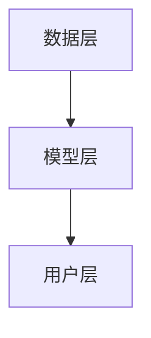

#### **系统接口设计**

系统接口包括数据接口、模型接口和用户接口。

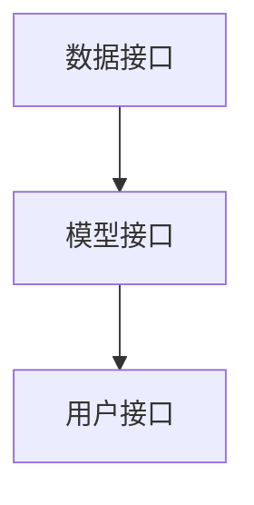

#### **系统交互**

系统交互包括数据收集、模型训练和摘要生成三个过程。

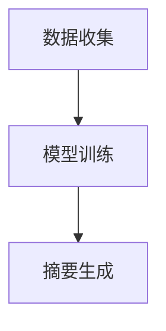

### 6.2 案例二：对话系统

对话系统是长文本理解的另一个重要应用，通过自然语言交互为用户提供服务，提高用户体验。

#### **项目介绍**

对话系统项目旨在利用AI模型实现对用户的自然语言理解和响应，为用户提供个性化的服务。项目分为对话管理、对话生成和对话评估三个阶段。

#### **系统功能设计**

- **对话管理**：管理对话流程，包括上下文维护、意图识别和对话策略等。
- **对话生成**：生成自然语言响应，通过文本生成模型实现。
- **对话评估**：评估对话系统的性能和效果，包括准确率、响应时间和用户满意度等。

#### **系统架构设计**

系统架构包括对话管理模块、对话生成模块和对话评估模块。

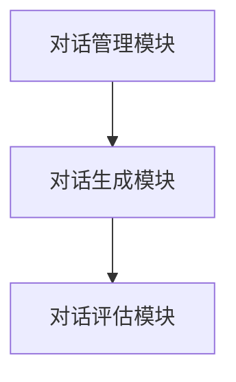

#### **系统接口设计**

系统接口包括用户接口、对话管理接口和对话生成接口。

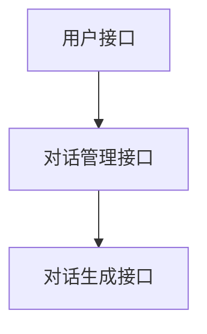

#### **系统交互**

系统交互包括用户输入、对话管理、对话生成和用户反馈四个过程。

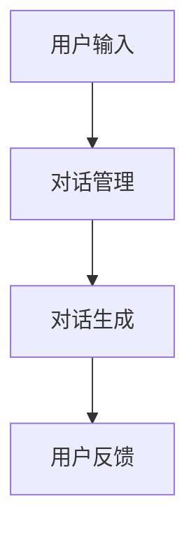

### 6.3 案例三：文本分类

文本分类是长文本理解的重要应用，通过分类算法将文本数据分为不同的类别，用于信息过滤、情感分析和内容推荐等。

#### **项目介绍**

文本分类项目旨在利用AI模型对长文本进行分类，提高信息处理和利用的效率。项目分为数据收集、特征提取和分类模型训练三个阶段。

#### **系统功能设计**

- **数据收集**：收集文本数据，包括新闻、评论和文章等。
- **特征提取**：提取文本特征，包括词袋、TF-IDF和词嵌入等。
- **分类模型训练**：训练分类模型，包括朴素贝叶斯、支持向量机和深度学习模型等。

#### **系统架构设计**

系统架构包括数据层、特征提取层和分类模型层。

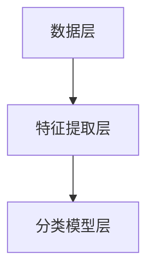

#### **系统接口设计**

系统接口包括数据接口、特征提取接口和分类模型接口。

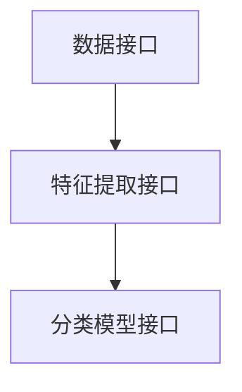

#### **系统交互**

系统交互包括数据收集、特征提取和分类模型训练三个过程。

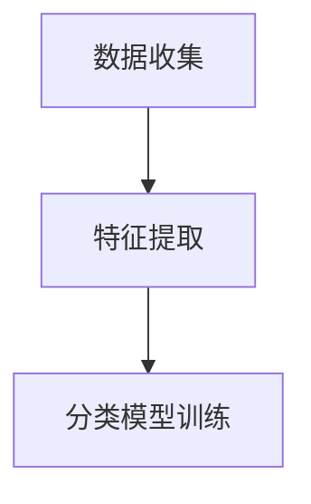

## 第七部分: 总结与展望

### 7.1 本书要点回顾

本书主要介绍了长文本理解的任务背景、相关概念、性能评估方法、提升技术和实际应用案例。通过详细的分析和讲解，本书为读者提供了系统化的方法和策略，以提升AI模型在长文本理解任务中的性能。

### 7.2 长文本理解领域的发展趋势

随着人工智能技术的不断发展和应用，长文本理解领域也在不断进步。未来，长文本理解技术将更加智能化、自动化和高效化，为各个行业带来更多的创新和应用。

### 7.3 未来研究方向

未来的研究方向包括多模态文本理解、长文本生成、知识图谱构建和智能问答系统等。通过不断创新和研究，长文本理解技术将进一步提高信息处理的效率和准确性，为人类带来更多的便利和智慧。作者：AI天才研究院/AI Genius Institute & 禅与计算机程序设计艺术 /Zen And The Art of Computer Programming

