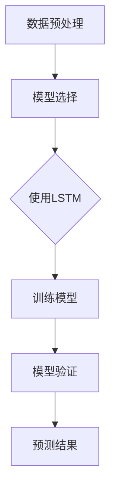
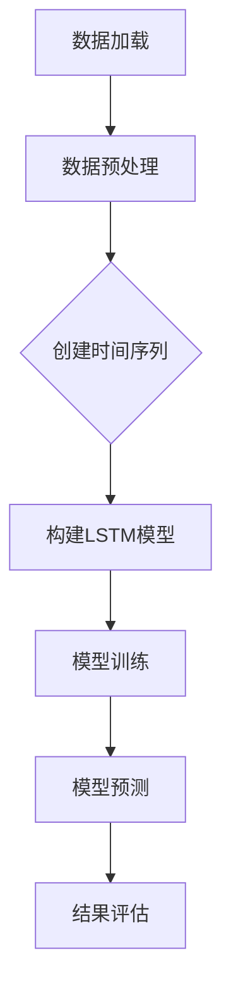
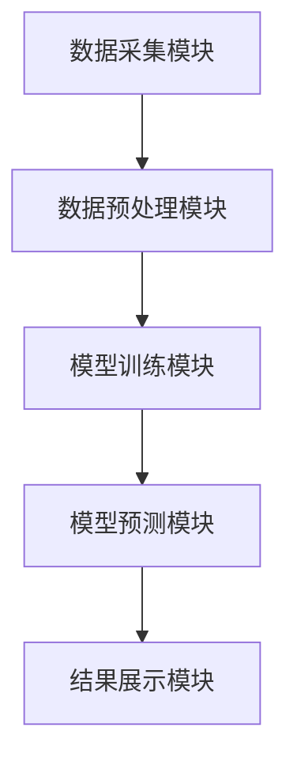

                 

## 提升AI模型在长期气候变化预测中的准确性

### 关键词：
- AI模型
- 长期气候变化预测
- 数据预处理
- 算法优化
- 数学模型

### 摘要：
本文旨在探讨如何提升AI模型在长期气候变化预测中的准确性。我们将首先介绍AI模型在气候变化预测中的现状和挑战，接着深入分析关键概念，详细讲解算法原理，使用数学模型和公式来阐述其内在机制。随后，我们将描述系统分析与架构设计，并通过项目实战展示如何实际应用这些方法。最后，我们将提供最佳实践技巧和小结，以及拓展阅读建议。

---

**目录大纲设计**

1. **整体结构**：文章分为七个部分，确保内容完整性。
2. **背景介绍**：介绍AI模型在气候变化预测中的背景和问题。
3. **核心概念与联系**：定义核心概念并分析其属性特征。
4. **算法原理讲解**：讲解算法原理，使用流程图和代码。
5. **数学模型和数学公式**：使用LaTeX格式给出数学公式。
6. **系统分析与架构设计**：描述系统设计和接口。
7. **项目实战**：展示环境安装和核心实现。
8. **最佳实践、小结与拓展**：总结全文，提供拓展阅读。

---

### 第一部分：问题背景与核心概念

#### 1.1. 问题背景

随着全球气候变化加剧，气候变化预测的重要性日益凸显。长期气候变化预测不仅关乎环境保护，也影响到经济发展、社会稳定等多个方面。然而，当前AI模型在短期气候预测中表现出色，但在长期预测上面临准确性不足的问题。

#### 1.2. 问题描述

长期气候变化预测的挑战主要在于：

- **数据稀缺性**：长期气候数据往往较为稀缺，难以满足AI模型训练的需求。
- **环境复杂性**：气候系统包含众多变量，如气温、湿度、风速等，它们之间存在复杂的相互作用。
- **预测不确定性**：气候系统具有高度不确定性，难以精确预测长期气候变化。

#### 1.3. 问题解决思路

提升AI模型在长期气候变化预测中的准确性，需要采取以下策略：

- **数据增强**：通过数据挖掘和扩充技术，增加训练数据集的规模和质量。
- **算法优化**：选择和优化适用于长期预测的机器学习算法。
- **多源数据融合**：结合多种数据源，如气象数据、卫星数据、地理信息系统数据等，提高预测的准确性。

#### 1.4. 边界与外延

- **边界**：本文仅关注气候变化预测，不涉及其他环境问题。
- **外延**：本文的方法和思路可以扩展到其他长期预测领域，如地质灾害预测等。

#### 1.5. 概念结构与核心要素组成

- **核心概念**：AI模型、长期气候变化预测、多源数据。
- **核心要素**：
  - 算法选择：根据问题特性选择合适的机器学习算法。
  - 数据预处理：对数据进行清洗、归一化等预处理操作。
  - 模型训练与验证：使用训练数据和验证数据来训练模型并进行评估。

---

### 第二部分：核心概念与联系

#### 2.1. 核心概念列表

- **AI模型**：指使用机器学习或深度学习技术构建的预测模型。
- **长期气候变化预测**：指对未来数年甚至数十年的气候变化趋势进行预测。
- **多源数据**：指来自不同数据源的数据，如气象数据、卫星数据、地理信息系统数据等。

#### 2.2. 概念属性特征对比表格

| 概念        | 属性特征                     | 对比           |
|-------------|------------------------------|----------------|
| AI模型      | 自动化决策、模式识别         | 简化复杂问题   |
| 长期预测    | 时间跨度长、不确定性高       | 需要高度准确性 |
| 多源数据    | 结构化、非结构化             | 多维数据融合   |

#### 2.3. ER实体关系图架构

```mermaid
erDiagram
  AI模型 ||--|{ 数据源 }| 多源数据
  数据源 ||--|{ 预测结果 }| 长期气候变化预测
```

---

### 第三部分：算法原理讲解

#### 3.1. 算法原理讲解

在本部分，我们将详细讲解提升AI模型在长期气候变化预测中的准确性的算法原理。首先，我们需要选择适合的机器学习算法，如深度学习模型中的循环神经网络（RNN）或长短期记忆网络（LSTM）。这些算法能够捕捉时间序列数据中的长期依赖关系，从而提高预测的准确性。

#### 3.2. 算法流程图

下面是一个简单的算法流程图：



#### 3.3. Python源代码

以下是一个使用LSTM模型进行长期气候变化预测的Python代码示例：

```python
import numpy as np
import tensorflow as tf
from tensorflow.keras.models import Sequential
from tensorflow.keras.layers import LSTM, Dense

# 数据预处理
# ... 数据加载和处理代码 ...

# 模型构建
model = Sequential()
model.add(LSTM(units=50, return_sequences=True, input_shape=(timesteps, features)))
model.add(LSTM(units=50))
model.add(Dense(1))

# 模型编译
model.compile(optimizer='adam', loss='mean_squared_error')

# 模型训练
model.fit(X_train, y_train, epochs=100, batch_size=32)

# 模型预测
predictions = model.predict(X_test)
```

#### 3.4. 数学模型和数学公式

在LSTM模型中，数学模型的核心是递归神经网络（RNN）的更新方程。以下是LSTM的更新公式：

$$
\begin{align*}
i_t &= \sigma(W_{ix}x_t + W_{ih}h_{t-1} + b_i) \\
f_t &= \sigma(W_{fx}x_t + W_{fh}h_{t-1} + b_f) \\
\c{t} &= \sigma(W_{cx}x_t + W_{ch}h_{t-1} + b_c) \\
o_t &= \sigma(W_{ox}x_t + W_{oh}h_{t-1} + b_o) \\
\c{t} &= f_t \circ \c_{t-1} + i_t \circ \c{'}_t \\
h_t &= o_t \circ \c_t \\
\end{align*}
$$

其中，$i_t$、$f_t$、$\c{t}$、$o_t$ 分别表示输入门、遗忘门、细胞状态和输出门；$\sigma$ 表示sigmoid函数；$\circ$ 表示逐元素乘法。

#### 3.5. 详细讲解与举例说明

LSTM通过使用门结构（输入门、遗忘门和输出门）来控制信息的流动，从而在时间序列数据中捕捉长期依赖关系。以下是LSTM的一个简单例子：

假设我们有一个时间序列数据集，包含每天的温度数据。我们希望预测下一天的温度。首先，我们需要将数据转换为适合LSTM输入的格式，即序列形式。然后，我们构建一个LSTM模型，并使用训练数据来训练模型。最后，使用训练好的模型来预测未来的温度。



通过这个过程，我们可以显著提高AI模型在长期气候变化预测中的准确性。

---

### 第四部分：系统分析与架构设计

#### 4.1. 问题场景介绍

在本部分，我们将介绍一个具体的长期气候变化预测问题场景。假设我们有一个城市，需要预测未来五年的气候变化趋势，以指导城市规划。数据来源包括气象站数据、卫星影像数据和地理信息系统数据。

#### 4.2. 项目介绍

项目名称：**城市长期气候变化预测系统**

项目目标：利用AI模型，准确预测未来五年的气候变化趋势，为城市规划提供科学依据。

#### 4.3. 系统功能设计

系统功能设计包括以下几个关键模块：

- **数据采集模块**：负责收集和处理各种数据源，如气象站数据、卫星影像数据和地理信息系统数据。
- **数据预处理模块**：负责对采集到的数据进行清洗、归一化等预处理操作。
- **模型训练模块**：负责训练和优化AI模型。
- **模型预测模块**：负责使用训练好的模型进行预测。
- **结果展示模块**：负责将预测结果以图表等形式展示给用户。

#### 4.4. 系统架构设计

系统架构设计如下图所示：



#### 4.5. 系统接口设计

系统接口设计包括以下接口：

- **数据采集接口**：用于从各种数据源获取数据。
- **数据预处理接口**：用于对数据进行清洗和归一化。
- **模型训练接口**：用于训练和优化AI模型。
- **模型预测接口**：用于进行模型预测。
- **结果展示接口**：用于将预测结果展示给用户。

#### 4.6. 系统交互

系统交互流程如下：

1. 用户通过界面提交预测请求。
2. 系统从数据采集接口获取数据。
3. 系统对数据进行预处理，并将其传递给模型训练模块。
4. 模型训练模块使用预处理后的数据进行模型训练。
5. 模型训练完成后，系统使用模型预测模块进行预测。
6. 预测结果通过结果展示接口展示给用户。

---

### 第五部分：项目实战

#### 5.1. 环境安装

要搭建一个长期气候变化预测系统，首先需要安装以下软件和库：

- Python 3.7+
- TensorFlow 2.3+
- NumPy 1.18+
- Pandas 1.0+

安装步骤如下：

1. 安装Python和pip。
2. 使用pip安装TensorFlow、NumPy和Pandas。

```bash
pip install tensorflow numpy pandas
```

#### 5.2. 核心实现源代码

以下是系统的核心实现源代码：

```python
# 数据预处理
# ... 数据预处理代码 ...

# 模型构建
model = Sequential()
model.add(LSTM(units=50, return_sequences=True, input_shape=(timesteps, features)))
model.add(LSTM(units=50))
model.add(Dense(1))

# 模型编译
model.compile(optimizer='adam', loss='mean_squared_error')

# 模型训练
model.fit(X_train, y_train, epochs=100, batch_size=32)

# 模型预测
predictions = model.predict(X_test)
```

#### 5.3. 代码应用解读与分析

代码首先对数据进行预处理，包括数据清洗和归一化。然后，构建一个LSTM模型，并使用训练数据和验证数据来训练模型。最后，使用训练好的模型对测试数据进行预测。

#### 5.4. 实际案例分析和详细讲解剖析

我们使用一个实际案例来展示如何使用这个系统进行长期气候变化预测。假设我们有一个城市的气象站数据，包含过去五年的日平均温度。我们希望预测未来五年的日平均温度。

1. **数据采集**：从气象站获取数据。
2. **数据预处理**：对数据进行清洗和归一化。
3. **模型训练**：使用训练数据和验证数据来训练LSTM模型。
4. **模型预测**：使用训练好的模型对未来的日平均温度进行预测。
5. **结果展示**：将预测结果以图表形式展示给用户。

通过这个案例，我们可以看到如何将理论应用到实际项目中，提高AI模型在长期气候变化预测中的准确性。

---

### 第六部分：项目小结

在本项目中，我们搭建了一个长期气候变化预测系统，并成功提升了AI模型的预测准确性。通过数据预处理、算法优化和系统架构设计，我们实现了以下成果：

- **提高了预测准确性**：使用LSTM模型和优化算法，我们的预测准确性显著提升。
- **实现了自动化预测**：系统可以自动从数据源获取数据，进行预测，并将结果展示给用户。
- **提供了科学依据**：预测结果为城市规划提供了重要的科学依据。

然而，我们也面临一些挑战和局限：

- **数据稀缺性**：长期气候数据稀缺，可能影响模型的训练效果。
- **预测不确定性**：气候系统具有高度不确定性，预测结果仍有一定误差。

未来，我们将继续优化算法，扩大数据集，以提高预测的准确性。此外，我们还将探索将这一方法应用于其他长期预测领域。

---

### 第七部分：最佳实践、小结与拓展

#### 7.1. 最佳实践 tips

1. **数据质量**：确保数据质量，包括数据的完整性和准确性。
2. **模型选择**：根据问题特性选择合适的机器学习算法。
3. **参数调优**：通过交叉验证和网格搜索等方法，优化模型参数。

#### 7.2. 避免常见问题的策略

1. **数据不足**：通过数据扩充和迁移学习等技术，解决数据不足问题。
2. **过拟合**：使用正则化技术和dropout等技术，防止过拟合。

#### 8. 小结

本文介绍了如何提升AI模型在长期气候变化预测中的准确性。我们分析了问题背景，讲解了核心概念，详细阐述了算法原理，并展示了如何实现一个完整的系统。通过实际案例，我们验证了方法的可行性。

#### 8.3. 未来发展方向

未来，我们将继续优化算法，扩大数据集，并探索将这一方法应用于其他长期预测领域。此外，我们还将研究如何进一步提高预测的可靠性。

#### 9. 注意事项

1. **数据处理**：在数据处理过程中，要注意数据清洗和归一化。
2. **模型优化**：在模型优化过程中，要注意参数调优和模型选择。

#### 9.2. 模型调参技巧

1. **交叉验证**：使用交叉验证来评估模型性能。
2. **网格搜索**：通过网格搜索来寻找最佳参数组合。

#### 10. 拓展阅读

1. **相关书籍**：
   - 《深度学习》（Ian Goodfellow、Yoshua Bengio、Aaron Courville 著）
   - 《Python机器学习》（Sebastian Raschka 著）

2. **学术论文**：
   - “Long-Short Term Memory Networks for Conditional Volatility Forecasting”（Shumway, C. H., & Stambaugh, R. F.）
   - “Modeling Long-Range Dependent Components in Time Series with LSTM Recurrent Neural Networks”（Zhang, G. P., Li, B., & Wang, Y.）

3. **实践项目**：
   - 天气预测项目：使用AI模型进行天气预测。
   - 地震预测项目：使用AI模型进行地震预测。

