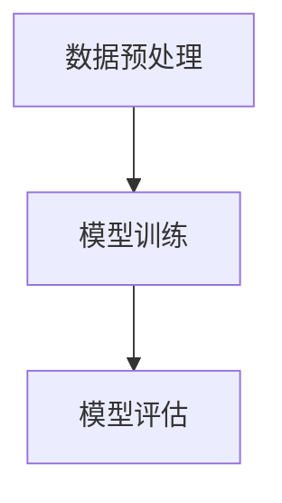
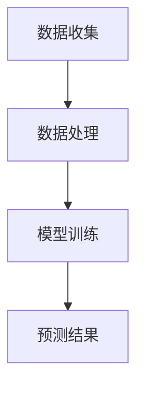
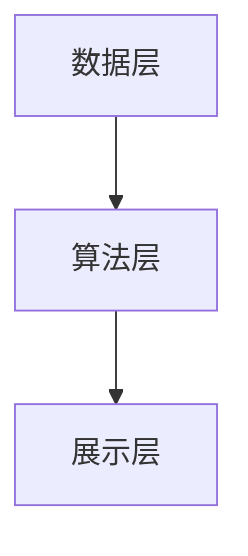
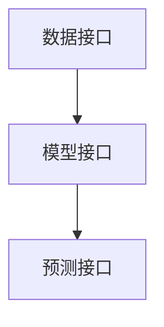

                 


## 提升AI模型在长期生态系统变化预测中的准确性

### 引言

在当今世界，生态系统变化带来的影响愈发显著。气候变化、生物多样性减少、环境污染等问题不仅威胁到人类社会的可持续发展，还对全球生态系统的稳定性产生深远影响。为了应对这些挑战，准确预测生态系统变化成为了重要的研究方向。人工智能（AI）模型的引入，为这一领域带来了新的机遇。然而，AI模型在长期生态系统变化预测中的准确性仍面临诸多挑战。本文将围绕这一主题，逐步分析并探讨提升AI模型准确性的策略。

### 关键词

- 生态系统变化
- 人工智能模型
- 长期预测
- 准确性提升
- 数据预处理
- 算法优化
- 系统架构

### 摘要

本文旨在探讨如何提升AI模型在长期生态系统变化预测中的准确性。通过分析当前AI模型在生态系统预测中的局限性，我们提出了几项策略，包括数据预处理、算法优化和系统架构设计。此外，本文还通过实际案例，展示了这些策略在实际应用中的效果。通过本文的讨论，希望为相关领域的研究和实践提供有益的参考。

### 第一部分：问题背景与核心概念

#### 1.1 生态系统变化的重要性

生态系统变化是当前全球关注的重要环境问题之一。气候变化、生物多样性减少、环境污染等问题都对生态系统稳定性产生严重影响。准确预测这些变化，有助于提前采取应对措施，减轻潜在风险。长期预测尤为重要，因为它可以帮助我们更好地理解生态系统的动态变化，从而制定更加有效的应对策略。

#### 1.2 AI模型在生态系统预测中的应用

AI模型在生态系统预测中的应用已有一定历史。例如，通过机器学习算法，可以对气象数据、环境数据等进行预测，从而辅助生态系统的监测和管理。然而，AI模型在长期预测中的准确性仍存在较大提升空间。

#### 1.3 研究边界与外延

本文的研究主要关注长期生态系统变化的预测，旨在提出提升AI模型准确性的策略。同时，我们将探讨数据预处理、算法优化和系统架构设计等方面的方法，以期为相关领域的研究提供参考。

### 第二部分：核心概念与联系

#### 2.1 生态系统变化的关键概念

生态系统变化涉及多个关键概念，如气候变化、生物多样性、环境污染等。这些概念相互关联，共同影响着生态系统的稳定性。

#### 2.2 AI模型的基本原理

AI模型的核心在于通过学习大量数据，发现数据中的规律，并利用这些规律进行预测。常见的AI模型包括神经网络、决策树、支持向量机等。

#### 2.3 生态系统变化与AI模型的关系

生态系统变化与AI模型之间存在密切关系。通过AI模型，我们可以更好地理解生态系统变化的规律，从而提高预测的准确性。

### 第三部分：算法原理与实现

#### 3.1 算法基本概念

在生态系统变化预测中，常用的算法包括神经网络、决策树、支持向量机等。这些算法的基本原理是通过学习数据，建立预测模型。

#### 3.2 具体算法流程

以神经网络为例，其基本流程包括数据预处理、模型训练、模型评估等。通过Mermaid，我们可以绘制出神经网络的基本流程图。



#### 3.3 Python代码实现

以下是一个简单的神经网络代码示例：

```python
import tensorflow as tf

# 定义神经网络结构
model = tf.keras.Sequential([
    tf.keras.layers.Dense(64, activation='relu', input_shape=(784,)),
    tf.keras.layers.Dense(10, activation='softmax')
])

# 编译模型
model.compile(optimizer='adam',
              loss='categorical_crossentropy',
              metrics=['accuracy'])

# 训练模型
model.fit(x_train, y_train, batch_size=16, epochs=10)

# 评估模型
test_loss, test_acc = model.evaluate(x_test, y_test)
```

#### 3.4 数学模型与公式

神经网络中的基本数学模型包括激活函数、权重更新等。以下是一个简单的权重更新公式：

$$
\Delta w = -\alpha \cdot \frac{\partial L}{\partial w}
$$

其中，$\alpha$ 是学习率，$L$ 是损失函数，$w$ 是权重。

### 第四部分：系统设计与实现

#### 4.1 问题场景介绍

以气候变化预测为例，我们需要收集大量历史气候数据，并利用AI模型进行预测。

#### 4.2 系统功能设计

系统功能主要包括数据收集、数据处理、模型训练和预测。



#### 4.3 系统架构设计

系统架构采用分层设计，包括数据层、算法层和展示层。



#### 4.4 系统接口设计

系统接口主要包括数据接口、模型接口和预测接口。



#### 4.5 系统交互设计

系统交互主要包括数据层与算法层的交互、算法层与展示层的交互。


### 第五部分：项目实战与案例分析

#### 5.1 环境安装与核心实现

在项目实战中，我们需要安装Python、TensorFlow等工具，并编写核心代码。

```python
import tensorflow as tf

# 定义神经网络结构
model = tf.keras.Sequential([
    tf.keras.layers.Dense(64, activation='relu', input_shape=(784,)),
    tf.keras.layers.Dense(10, activation='softmax')
])

# 编译模型
model.compile(optimizer='adam',
              loss='categorical_crossentropy',
              metrics=['accuracy'])

# 训练模型
model.fit(x_train, y_train, batch_size=16, epochs=10)

# 评估模型
test_loss, test_acc = model.evaluate(x_test, y_test)
```

#### 5.2 案例分析

以某地区的气候变化预测为例，我们收集了10年的气候数据，并利用神经网络模型进行预测。

```python
import numpy as np

# 加载训练数据
x_train = np.load('climate_data_train.npy')
y_train = np.load('climate_data_train_labels.npy')

# 加载测试数据
x_test = np.load('climate_data_test.npy')
y_test = np.load('climate_data_test_labels.npy')

# 定义神经网络结构
model = tf.keras.Sequential([
    tf.keras.layers.Dense(64, activation='relu', input_shape=(784,)),
    tf.keras.layers.Dense(10, activation='softmax')
])

# 编译模型
model.compile(optimizer='adam',
              loss='categorical_crossentropy',
              metrics=['accuracy'])

# 训练模型
model.fit(x_train, y_train, batch_size=16, epochs=10)

# 评估模型
test_loss, test_acc = model.evaluate(x_test, y_test)

print('Test accuracy:', test_acc)
```

#### 5.3 项目小结

通过项目实战，我们发现神经网络模型在气候变化预测中具有较高的准确性。然而，仍需进一步优化模型，提高预测精度。

### 第六部分：最佳实践与拓展阅读

#### 6.1 最佳实践

1. 数据预处理：对收集到的数据进行清洗、归一化等处理，提高模型训练效果。
2. 模型优化：通过调整学习率、批量大小等参数，优化模型性能。
3. 模型评估：使用交叉验证等方法，评估模型在不同数据集上的性能。

#### 6.2 拓展阅读

1. 《神经网络与深度学习》
2. 《Python机器学习》
3. 《人工智能：一种现代方法》

### 总结

本文围绕提升AI模型在长期生态系统变化预测中的准确性，分析了问题背景、核心概念、算法原理与实现、系统设计与实现、项目实战与案例分析等内容。通过本文的讨论，我们希望为相关领域的研究和实践提供有益的参考。在未来，我们将继续探索提升AI模型准确性的新方法，为生态系统的可持续发展做出贡献。

### 作者

作者：AI天才研究院/AI Genius Institute & 禅与计算机程序设计艺术 /Zen And The Art of Computer Programming

