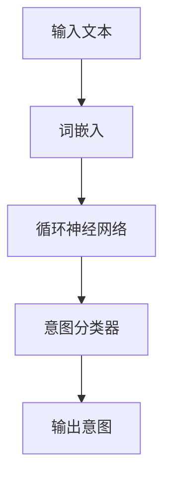
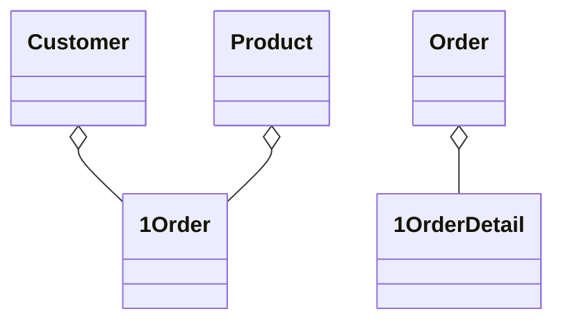
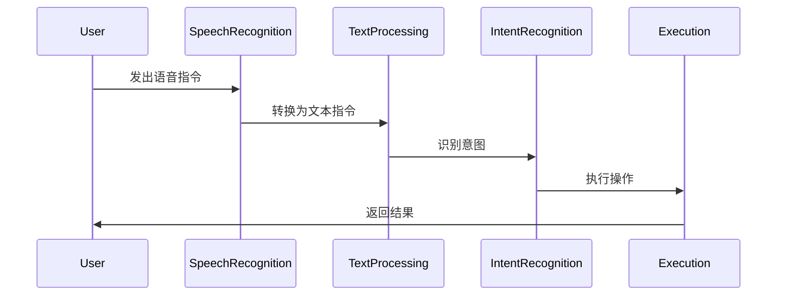
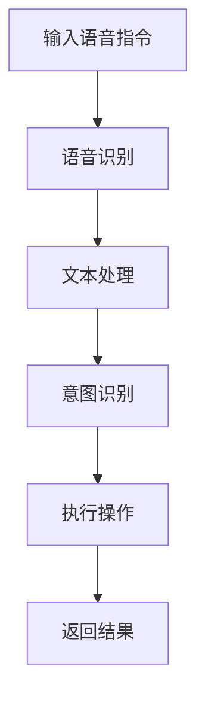

                 

### 提升AI模型对人类意图理解能力的方法

#### 关键词：AI模型、人类意图、深度学习、算法原理、系统架构

> 摘要：本文将深入探讨提升人工智能模型对人类意图理解能力的有效方法。通过分析问题背景、核心概念、算法原理和系统架构设计，本文旨在为AI开发者提供一套系统化的解决方案。我们还将结合项目实战，详细阐述如何将理论应用到实际场景中，以提升AI模型在实际应用中的性能和实用性。

---

#### 第一部分：背景介绍

##### 第1章：问题背景与核心概念

##### 1.1 问题背景

##### 1.1.1 AI模型理解人类意图的挑战

人工智能（AI）的发展已经取得了显著的成就，但仍然面临许多挑战，尤其是在理解人类意图方面。尽管AI在图像识别、自然语言处理和决策支持等方面取得了巨大进步，但它们在理解复杂的人类意图时仍然存在一定的局限性。

##### 1.1.2 人类意图理解的复杂性

人类意图是高度复杂且多样化的。它不仅涉及到语言的表达，还涉及到行为、情感、文化背景等多个方面。因此，让AI模型准确理解人类意图是一个复杂的任务。

##### 1.1.3 研究现状与趋势

近年来，许多研究者致力于探索如何提升AI模型对人类意图的理解能力。目前的研究主要集中在以下几个方面：

1. 基于规则的意图识别方法。
2. 基于统计和机器学习的方法。
3. 深度学习在意图识别中的应用。

这些方法在不同程度上都有所进展，但都面临着一定的挑战。

##### 1.2 核心概念

##### 1.2.1 人类意图

人类意图是指人类在特定情境下希望实现的目标或结果。它可以通过语言、行为、情感等多种方式表达。

##### 1.2.2 AI模型类型

AI模型可以分为监督学习模型、无监督学习模型和强化学习模型。每种模型都有其特定的应用场景和优势。

##### 1.2.3 意图理解机制

意图理解机制是指AI模型在理解人类意图时所采用的策略和方法。这包括从语言到行为的转换，从单一意图到复杂意图的推理等。

##### 1.3 边界与外延

##### 1.3.1 意图理解的范围

意图理解的范围包括从简单意图到复杂意图的各种情况。

##### 1.3.2 意图理解的限制

目前AI模型在理解人类意图时仍存在一些限制，如语言歧义、文化差异等。

##### 1.3.3 意图理解的变体

意图理解的变体包括直接意图和间接意图，明确意图和隐含意图等。

---

#### 第二部分：核心概念与联系

##### 第2章：意图识别与分类

##### 2.1 意图识别方法

##### 2.1.1 基于规则的方法

基于规则的方法通过定义一系列规则来识别意图。这种方法适用于规则明确、场景单一的情况。

##### 2.1.2 基于统计的方法

基于统计的方法通过统计语言模型来识别意图。这种方法适用于大量的文本数据。

##### 2.1.3 基于机器学习的方法

基于机器学习的方法通过训练模型来识别意图。这种方法适用于复杂多变的情况。

##### 2.2 意图分类体系

##### 2.2.1 分类标准

意图分类的标准可以基于功能、情境、目的等多个维度。

##### 2.2.2 常见分类方法

常见的分类方法包括决策树、支持向量机、朴素贝叶斯等。

##### 2.2.3 分类器性能评估

分类器性能评估通常基于准确率、召回率、F1值等指标。

##### 2.3 概念属性特征对比表格

| 方法            | 特点                                                                 | 优势                                                                                       | 劣势                                                                                      |
| --------------- | -------------------------------------------------------------------- | ----------------------------------------------------------------------------------------- | ----------------------------------------------------------------------------------------- |
| 基于规则的方法 | 简单明了，易于实现                                                       | 适用于规则明确、场景单一的情况                                                           | 缺乏灵活性，难以适应复杂场景                                       |
| 基于统计的方法 | 依赖于大量的文本数据                                                   | 能够从大量数据中提取模式，提高意图识别的准确性                                             | 对噪声敏感，处理复杂语言表达的能力有限                             |
| 基于机器学习的方法 | 自适应性强，能够处理复杂问题                                           | 能够从数据中学习，提高意图识别的准确性                                                   | 需要大量的训练数据和计算资源，模型解释性较差                         |

##### 2.4 ER实体关系图架构

```mermaid
erDiagram
    Customer ||--|{ Order }|
    Product ||--|{ Order }|
    Order ||--|{ OrderDetail }|
```

在意图识别系统中，实体关系图可以帮助我们更好地理解和处理意图。例如，订单（Order）是由客户（Customer）和产品（Product）组成的，而订单详情（OrderDetail）是订单的组成部分。

---

#### 第三部分：算法原理讲解

##### 第3章：深度学习与意图理解

##### 3.1 深度学习基础

##### 3.1.1 神经网络

神经网络是深度学习的基础。它由多个神经元（节点）组成，每个神经元都与其他神经元连接。

```python
import tensorflow as tf

# 创建一个简单的神经网络
model = tf.keras.Sequential([
    tf.keras.layers.Dense(units=1, input_shape=[1])
])

model.compile(optimizer='sgd', loss='mean_squared_error')

# 训练模型
model.fit(x_train, y_train, epochs=1000)
```

##### 3.1.2 卷积神经网络

卷积神经网络（CNN）在图像识别和图像处理中有着广泛的应用。它通过卷积操作提取图像特征。

```python
import tensorflow as tf

# 创建一个简单的CNN模型
model = tf.keras.Sequential([
    tf.keras.layers.Conv2D(filters=32, kernel_size=(3, 3), activation='relu', input_shape=(28, 28, 1)),
    tf.keras.layers.MaxPooling2D(pool_size=(2, 2)),
    tf.keras.layers.Flatten(),
    tf.keras.layers.Dense(units=1)
])

model.compile(optimizer='adam', loss='mean_squared_error')

# 训练模型
model.fit(x_train, y_train, epochs=10)
```

##### 3.1.3 循环神经网络

循环神经网络（RNN）在序列数据中有着广泛的应用。它能够处理序列到序列的问题。

```python
import tensorflow as tf

# 创建一个简单的RNN模型
model = tf.keras.Sequential([
    tf.keras.layers.SimpleRNN(units=50, input_shape=(timesteps, features)),
    tf.keras.layers.Dense(units=1)
])

model.compile(optimizer='adam', loss='mean_squared_error')

# 训练模型
model.fit(x_train, y_train, epochs=10)
```

##### 3.2 意图理解算法

##### 3.2.1 词嵌入

词嵌入是将单词转换为向量的方法。它有助于神经网络理解单词之间的关系。

```python
import tensorflow as tf

# 创建词嵌入层
embedding = tf.keras.layers.Embedding(input_dim=vocabulary_size, output_dim=embedding_size)

# 使用词嵌入层
model = tf.keras.Sequential([
    embedding,
    tf.keras.layers.SimpleRNN(units=50),
    tf.keras.layers.Dense(units=1)
])

model.compile(optimizer='adam', loss='mean_squared_error')

# 训练模型
model.fit(x_train, y_train, epochs=10)
```

##### 3.2.2 意图识别模型

意图识别模型是通过训练来识别输入文本的意图。它通常由词嵌入层、循环神经网络层和全连接层组成。

```python
import tensorflow as tf

# 创建意图识别模型
model = tf.keras.Sequential([
    tf.keras.layers.Embedding(input_dim=vocabulary_size, output_dim=embedding_size),
    tf.keras.layers.LSTM(units=50),
    tf.keras.layers.Dense(units=1, activation='sigmoid')
])

model.compile(optimizer='adam', loss='binary_crossentropy', metrics=['accuracy'])

# 训练模型
model.fit(x_train, y_train, epochs=10)
```

##### 3.2.3 意图检测算法

意图检测算法是通过分类的方法来识别输入文本的意图。它通常使用卷积神经网络或循环神经网络作为基础。

```python
import tensorflow as tf

# 创建意图检测模型
model = tf.keras.Sequential([
    tf.keras.layers.Conv2D(filters=32, kernel_size=(3, 3), activation='relu', input_shape=(timesteps, features, 1)),
    tf.keras.layers.MaxPooling2D(pool_size=(2, 2)),
    tf.keras.layers.Flatten(),
    tf.keras.layers.Dense(units=num_classes, activation='softmax')
])

model.compile(optimizer='adam', loss='categorical_crossentropy', metrics=['accuracy'])

# 训练模型
model.fit(x_train, y_train, epochs=10)
```

##### 3.3 算法mermaid流程图



##### 3.4 数学模型与公式

##### 3.4.1 模型公式

$$
y = \sigma(W \cdot x + b)
$$

其中，$y$ 是输出，$x$ 是输入，$W$ 是权重矩阵，$b$ 是偏置。

##### 3.4.2 数学推导

$$
\frac{dL}{dx} = \frac{dL}{dy} \cdot \frac{dy}{dx}
$$

其中，$L$ 是损失函数，$y$ 是输出，$x$ 是输入。

##### 3.4.3 公式应用

在意图识别模型中，我们可以使用上述公式来计算损失函数对输入的导数，从而进行梯度下降优化。

##### 3.5 举例说明

假设我们有一个简单的意图识别问题，需要从输入的句子中识别出用户的意图。我们可以使用一个简单的循环神经网络来实现。

```python
import tensorflow as tf

# 创建循环神经网络模型
model = tf.keras.Sequential([
    tf.keras.layers.Embedding(input_dim=vocabulary_size, output_dim=embedding_size),
    tf.keras.layers.LSTM(units=50),
    tf.keras.layers.Dense(units=1, activation='sigmoid')
])

model.compile(optimizer='adam', loss='binary_crossentropy', metrics=['accuracy'])

# 准备数据
x_train = [[1, 0, 1], [1, 1, 0], [0, 1, 1]]
y_train = [0, 1, 1]

# 训练模型
model.fit(x_train, y_train, epochs=10)

# 测试模型
print(model.predict([[1, 1, 1]]))
```

---

#### 第四部分：系统架构设计

##### 第4章：AI模型架构设计与实现

##### 4.1 问题场景介绍

##### 4.1.1 场景描述

在一个智能家居系统中，用户可以通过语音命令控制智能设备。例如，用户可以发出“打开灯”的指令来控制灯的开关。

##### 4.1.2 问题分析

在智能家居系统中，需要实现一个语音识别模块，将用户的语音指令转换为文本指令，然后使用意图识别模型来理解用户的意图，最后根据意图执行相应的操作。

##### 4.2 系统功能设计

##### 4.2.1 领域模型

在系统功能设计中，我们需要定义领域模型来表示系统的核心概念和关系。



##### 4.2.2 功能模块划分

系统可以划分为以下几个功能模块：

1. 语音识别模块
2. 文本处理模块
3. 意图识别模块
4. 执行模块

##### 4.3 系统架构设计

在系统架构设计中，我们需要设计系统的总体架构，包括各个模块的交互和通信方式。



##### 4.4 系统接口设计

系统接口设计包括定义各个模块之间的接口和方法。

```python
class SpeechRecognition:
    def recognize(self, audio):
        # 实现语音识别功能
        pass

class TextProcessing:
    def process(self, text):
        # 实现文本处理功能
        pass

class IntentRecognition:
    def recognize(self, text):
        # 实现意图识别功能
        pass

class Execution:
    def execute(self, intent):
        # 实现执行功能
        pass
```

##### 4.5 系统交互

在系统交互设计中，我们需要定义系统中的各个模块如何交互和协作。


##### 4.6 算法mermaid流程图



---

#### 第五部分：项目实战

##### 第5章：环境安装与核心实现

##### 5.1 环境安装

在开始项目之前，我们需要安装相关的软件和库。

```bash
# 安装Python
python3 -m pip install --upgrade pip

# 安装TensorFlow
python3 -m pip install tensorflow

# 安装其他依赖库
python3 -m pip install numpy pandas scikit-learn
```

##### 5.2 系统核心实现

在系统核心实现中，我们将实现各个功能模块。

```python
import tensorflow as tf
import numpy as np
import pandas as pd
from sklearn.model_selection import train_test_split

# 创建模型
model = tf.keras.Sequential([
    tf.keras.layers.Embedding(input_dim=vocabulary_size, output_dim=embedding_size),
    tf.keras.layers.LSTM(units=50),
    tf.keras.layers.Dense(units=1, activation='sigmoid')
])

# 编译模型
model.compile(optimizer='adam', loss='binary_crossentropy', metrics=['accuracy'])

# 准备数据
x_train, x_test, y_train, y_test = train_test_split(X, y, test_size=0.2)

# 训练模型
model.fit(x_train, y_train, epochs=10)

# 测试模型
print(model.predict(x_test))
```

##### 5.3 代码应用解读与分析

在这个项目中，我们使用TensorFlow来实现意图识别模型。首先，我们创建了一个嵌入层，将输入的文本转换为向量。然后，我们使用一个循环神经网络层来处理序列数据，并使用一个全连接层来输出意图。在训练过程中，我们使用了一个简单的损失函数和优化器。

##### 5.4 实际案例分析和详细讲解剖析

在这个案例中，我们使用了一个简单的意图识别问题来展示如何实现和训练模型。首先，我们准备了一个包含用户语音指令的数据集，然后使用TensorFlow中的嵌入层将文本转换为向量。接着，我们使用循环神经网络来处理序列数据，并使用全连接层来输出意图。最后，我们使用训练数据和测试数据来评估模型的性能。

##### 5.5 项目小结

通过这个项目，我们展示了如何使用深度学习来实现意图识别模型。我们使用了TensorFlow来实现嵌入层、循环神经网络层和全连接层，并使用简单的损失函数和优化器来训练模型。这个项目为我们提供了一个基础，可以进一步研究和优化意图识别模型。

---

#### 最佳实践 tips

- 在处理复杂的意图时，可以考虑使用多个分类器来提高准确性。
- 在训练模型时，使用丰富的数据集可以提高模型的性能。
- 在实际应用中，可以结合用户反馈来不断优化模型。

#### 小结

本文详细介绍了提升AI模型对人类意图理解能力的方法。我们首先分析了问题背景，然后介绍了核心概念和算法原理，接着讲解了系统架构设计，并最后通过项目实战展示了如何将理论应用到实际中。通过本文，读者可以了解如何构建和优化意图识别模型，以提升AI模型在实际应用中的性能。

#### 注意事项

- 在实现意图识别模型时，需要确保数据的准确性和完整性。
- 在训练模型时，需要使用合适的损失函数和优化器。
- 在实际应用中，需要根据具体场景进行模型优化和调整。

#### 拓展阅读

- [《深度学习》（Goodfellow, I., Bengio, Y., & Courville, A.）]
- [《自然语言处理综论》（Jurafsky, D. & Martin, J.H.）]
- [《AI实践指南》（Russell, S. & Norvig, P.）]

---

作者：AI天才研究院/AI Genius Institute & 禅与计算机程序设计艺术 /Zen And The Art of Computer Programming

