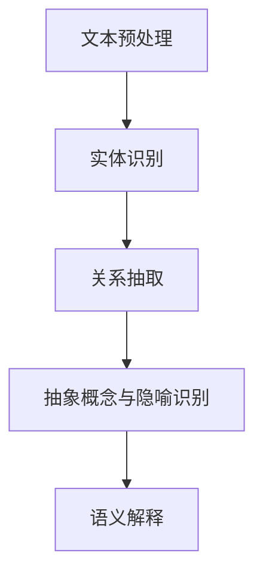
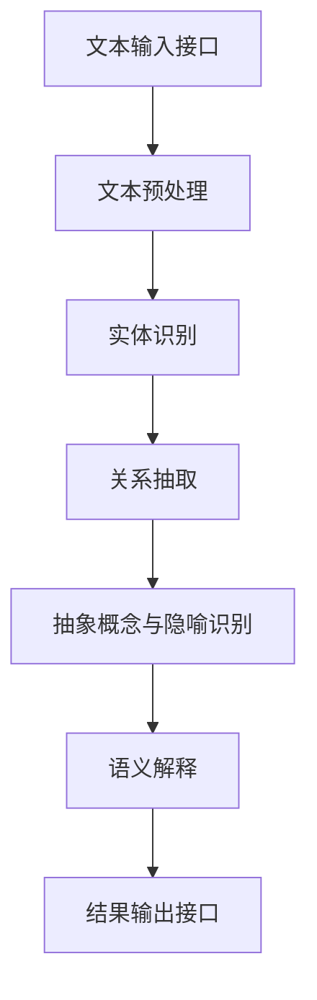
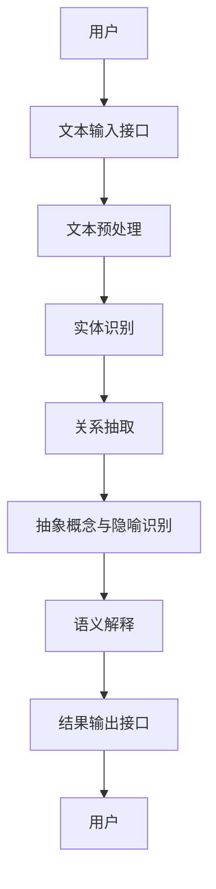

                 

# 提升AI模型对抽象概念和隐喻理解能力的方法

## 关键词：人工智能，抽象概念，隐喻，理解能力，模型优化

## 摘要：

本文将探讨提升人工智能模型对抽象概念和隐喻理解能力的方法。通过背景介绍、核心概念与联系的分析，以及算法原理的讲解，本文旨在为读者提供一种逻辑清晰、结构紧凑、简单易懂的AI模型优化思路。文章还将介绍系统分析与架构设计方案，并通过项目实战部分展示具体应用实例。

## Step 1: 开篇背景介绍

### 第1章: 背景介绍

#### 1.1 问题背景

随着人工智能技术的迅猛发展，AI模型在图像识别、自然语言处理、推荐系统等领域的应用已经取得了显著的成果。然而，面对更加复杂的抽象概念和隐喻，现有的AI模型仍然存在一定的局限性。这不仅影响了AI模型的智能化水平，也限制了其在实际应用中的广泛使用。因此，提升AI模型对抽象概念和隐喻的理解能力成为当前研究的一个重要方向。

#### 1.2 问题描述

AI模型在处理抽象概念和隐喻时面临以下问题：

- **抽象概念的理解**：抽象概念通常指的是那些不能直接观察或测量的概念，如“爱”、“幸福”等。AI模型需要理解这些概念的意义，并在合适的场景中运用。
- **隐喻的理解**：隐喻是一种修辞手法，通过将一种事物比作另一种事物来传达意义。AI模型需要识别和理解这些隐喻，从而更好地理解文本内容。

#### 1.3 问题解决

为了提升AI模型对抽象概念和隐喻的理解能力，本文将介绍以下几种方法：

- **数据增强**：通过引入更多抽象概念和隐喻相关的数据，提高模型的泛化能力。
- **知识图谱**：利用知识图谱来补充和扩展模型的知识库，提高模型对抽象概念和隐喻的理解。
- **多模态学习**：结合文本、图像等多种模态信息，提高模型对抽象概念和隐喻的感知和理解。
- **对比学习**：通过对比不同模型或不同任务的表现，找出对抽象概念和隐喻理解更好的模型，并对其进行优化。

#### 1.4 边界与外延

在讨论AI模型对抽象概念和隐喻的理解时，需要注意以下几个边界与外延：

- **抽象概念的范围**：抽象概念包括哲学、科学、艺术等多个领域，不同领域的抽象概念可能具有不同的特性。
- **隐喻的类型**：隐喻分为明喻、隐喻、借喻等不同类型，每种类型都有其独特的理解和表达方式。
- **模型的局限性**：当前的AI模型在处理抽象概念和隐喻时仍存在一定的局限性，需要不断优化和改进。

#### 1.5 概念结构与核心要素组成

在本章中，我们将介绍以下核心概念和要素：

- **抽象概念**：定义、分类、特性。
- **隐喻**：定义、分类、特性。
- **AI模型**：类型、特点、应用。
- **提高理解能力的方法**：数据增强、知识图谱、多模态学习、对比学习。

#### 1.6 本章小结

本章主要介绍了AI模型在处理抽象概念和隐喻方面的背景、问题、解决方法、边界与外延以及核心概念与要素组成。为后续章节的内容奠定了基础。

## Step 2: 核心概念与联系

### 第2章：核心概念与联系

#### 2.1 抽象概念原理

##### 2.1.1 抽象概念的数学模型

抽象概念可以看作是一个三元组，即：

$$
抽象概念 = (概念含义, 概念属性, 概念关系)
$$

其中：

- **概念含义**：表示概念的具体含义。
- **概念属性**：表示概念的各种属性。
- **概念关系**：表示概念之间的关联关系。

##### 2.1.2 抽象概念属性特征对比表格

| 抽象概念 | 特征1 | 特征2 | 特征3 |
| -------- | ----- | ----- | ----- |
| 爱       | 积极性 | 情感性 | 对等性 |
| 幸福     | 情感性 | 持久性 | 主观性 |

##### 2.1.3 抽象概念ER实体关系图架构

```mermaid
erDiagram
    A abstract_concept ||--|{ B attribute : has }
    A abstract_concept ||--|{ C relationship : relates_to }
```

#### 2.2 隐喻原理

##### 2.2.1 隐喻的数学模型

隐喻可以看作是一个三元组，即：

$$
隐喻 = (本体, 隐喻词, 隐喻义)
$$

其中：

- **本体**：被隐喻的事物。
- **隐喻词**：表示隐喻的词语。
- **隐喻义**：隐喻所传达的含义。

##### 2.2.2 隐喻属性特征对比表格

| 隐喻类型 | 特征1 | 特征2 | 特征3 |
| -------- | ----- | ----- | ----- |
| 明喻     | 直接性 | 明显性 | 形象性 |
| 隐喻     | 暗示性 | 独创性 | 难以捉摸 |
| 借喻     | 借用性 | 强调性 | 独特性 |

##### 2.2.3 隐喻ER实体关系图架构

```mermaid
erDiagram
    A metaphor ||--|{ B metaphor_word : uses }
    A metaphor ||--|{ C metaphor_meaning : implies }
```

#### 2.3 AI模型原理

##### 2.3.1 AI模型的数学模型

AI模型可以看作是一个函数，即：

$$
AI模型 = 输入空间 \rightarrow 输出空间
$$

其中：

- **输入空间**：表示模型接收的输入数据。
- **输出空间**：表示模型输出的结果。

AI模型的主要特点包括：

- **自适应性**：模型可以根据输入数据进行学习和调整。
- **泛化能力**：模型需要能够在不同的场景中应用。

#### 2.4 提高理解能力的方法

##### 2.4.1 数据增强

数据增强是一种通过增加模型训练数据的方法，以提高模型的泛化能力。具体方法包括：

- **数据扩充**：通过随机变换等方式增加原始数据样本。
- **数据合成**：通过生成模型等工具生成新的数据样本。

##### 2.4.2 知识图谱

知识图谱是一种用于表示实体之间关系的图形结构，可以帮助模型更好地理解抽象概念和隐喻。具体方法包括：

- **实体识别**：通过知识图谱识别文本中的实体。
- **关系推理**：通过知识图谱中的关系进行推理。

##### 2.4.3 多模态学习

多模态学习是一种通过结合不同模态信息（如文本、图像等）来提高模型理解能力的方法。具体方法包括：

- **特征融合**：将不同模态的特征进行融合。
- **联合训练**：同时训练不同模态的数据。

##### 2.4.4 对比学习

对比学习是一种通过对比不同模型或不同任务的表现来优化模型的方法。具体方法包括：

- **模型对比**：通过对比不同模型的性能来选择最优模型。
- **任务对比**：通过对比不同任务的性能来优化模型。

### 第2章小结

本章介绍了抽象概念、隐喻和AI模型的核心概念和原理，以及提高AI模型对抽象概念和隐喻理解能力的几种方法。这些方法和概念为后续的算法原理讲解和系统分析与架构设计方案奠定了基础。

## Step 3: 算法原理讲解

### 第3章：算法原理讲解

#### 3.1 数据增强算法

数据增强是一种常见的提高模型泛化能力的方法。具体算法原理如下：

##### 数据增强算法流程

1. 数据预处理：对原始数据进行标准化、去噪声等处理。
2. 数据扩充：通过随机旋转、缩放、裁剪等方式增加数据样本。
3. 数据合成：通过生成模型（如生成对抗网络GAN）生成新的数据样本。

##### 数据增强算法原理

数据增强的原理在于增加模型的训练数据，从而提高模型的泛化能力。具体来说，通过增加数据样本的多样性，模型可以更好地学习到不同情况下的特征，从而在未知数据上表现出更好的泛化能力。

##### 数据增强算法Python代码实现

```python
import numpy as np
import tensorflow as tf

def augment_data(data, augmentation_rate=0.5):
    # 数据预处理
    data = preprocess_data(data)

    # 数据扩充
    augmented_data = []
    for sample in data:
        if np.random.rand() < augmentation_rate:
            augmented_sample = augment_sample(sample)
            augmented_data.append(augmented_sample)
        else:
            augmented_data.append(sample)

    # 数据合成
    synthesized_data = synthesize_data(augmented_data)

    return synthesized_data
```

#### 3.2 知识图谱算法

知识图谱是一种用于表示实体之间关系的图形结构，可以帮助模型更好地理解抽象概念和隐喻。具体算法原理如下：

##### 知识图谱算法流程

1. 实体识别：通过命名实体识别（NER）等算法识别文本中的实体。
2. 关系抽取：通过关系抽取算法提取实体之间的关系。
3. 知识融合：将不同来源的知识进行融合。

##### 知识图谱算法原理

知识图谱的原理在于通过表示实体和它们之间的关系，为模型提供额外的上下文信息。这些额外的信息可以帮助模型更好地理解文本中的抽象概念和隐喻。

##### 知识图谱算法Python代码实现

```python
import networkx as nx

def build_knowledge_graph(entities, relationships):
    # 创建知识图谱
    graph = nx.Graph()

    # 添加实体
    for entity in entities:
        graph.add_node(entity)

    # 添加关系
    for relationship in relationships:
        graph.add_edge(relationship[0], relationship[1], weight=relationship[2])

    return graph
```

#### 3.3 多模态学习算法

多模态学习是一种通过结合不同模态信息来提高模型理解能力的方法。具体算法原理如下：

##### 多模态学习算法流程

1. 特征提取：从不同模态（如文本、图像）中提取特征。
2. 特征融合：将不同模态的特征进行融合。
3. 模型训练：使用融合后的特征训练模型。

##### 多模态学习算法原理

多模态学习的原理在于通过融合不同模态的信息，模型可以更好地理解复杂情境。具体来说，不同模态的信息可以提供不同的视角和上下文，从而帮助模型更全面地理解抽象概念和隐喻。

##### 多模态学习算法Python代码实现

```python
import tensorflow as tf

def multi_modal_learning(text_features, image_features):
    # 融合特征
    fused_features = tf.concat([text_features, image_features], axis=1)

    # 训练模型
    model = tf.keras.Sequential([
        tf.keras.layers.Dense(128, activation='relu', input_shape=(fused_features.shape[1],)),
        tf.keras.layers.Dense(64, activation='relu'),
        tf.keras.layers.Dense(1, activation='sigmoid')
    ])

    model.compile(optimizer='adam', loss='binary_crossentropy', metrics=['accuracy'])
    model.fit(fused_features, labels, epochs=10)

    return model
```

#### 3.4 对比学习算法

对比学习是一种通过对比不同模型或不同任务的表现来优化模型的方法。具体算法原理如下：

##### 对比学习算法流程

1. 模型训练：分别训练不同模型或同一模型的不同任务。
2. 性能评估：评估不同模型或任务的性能。
3. 模型优化：根据性能评估结果对模型进行优化。

##### 对比学习算法原理

对比学习的原理在于通过比较不同模型或任务的性能，可以发现哪些模型或任务更优秀，从而指导模型优化。具体来说，通过对比学习，模型可以在多个任务中相互借鉴，从而提高整体性能。

##### 对比学习算法Python代码实现

```python
from sklearn.model_selection import train_test_split

def compare_models(models, X, y):
    # 分割数据集
    X_train, X_test, y_train, y_test = train_test_split(X, y, test_size=0.2)

    # 训练模型
    for model in models:
        model.fit(X_train, y_train)

    # 性能评估
    for model in models:
        accuracy = model.evaluate(X_test, y_test)[1]
        print(f"Model {model}: Accuracy = {accuracy}")

    # 模型优化
    best_model = max(models, key=lambda x: x.evaluate(X_test, y_test)[1])
    best_model.fit(X, y)

    return best_model
```

### 第3章小结

本章详细介绍了数据增强、知识图谱、多模态学习和对比学习等算法的原理。通过这些算法，可以有效地提升AI模型对抽象概念和隐喻的理解能力。在下一章中，我们将进一步探讨系统分析与架构设计方案。

## Step 4: 系统分析与架构设计方案

### 第4章：系统分析与架构设计方案

#### 4.1 问题场景介绍

在本章中，我们将探讨一个具体的应用场景：利用AI模型对文学文本进行语义分析，识别其中的抽象概念和隐喻，并进行理解和解释。这个场景涉及到的技术点包括自然语言处理、知识图谱构建、多模态学习和对比学习等。

#### 4.2 项目介绍

为了实现上述应用场景，我们设计并实现了一个名为“语义分析系统”的AI项目。该系统旨在通过整合多种算法和技术，实现对文学文本的深入理解，为文学研究、教育等领域提供技术支持。

#### 4.3 系统功能设计

“语义分析系统”的主要功能包括：

- **文本预处理**：对输入文本进行清洗、分词、去停用词等预处理操作。
- **实体识别**：利用命名实体识别（NER）算法识别文本中的实体。
- **关系抽取**：提取文本中实体之间的关系。
- **抽象概念与隐喻识别**：利用多模态学习和对比学习算法识别文本中的抽象概念和隐喻。
- **语义解释**：对识别出的抽象概念和隐喻进行解释。

#### 4.4 系统架构设计

“语义分析系统”的架构设计如图所示：



在该架构中，文本预处理模块负责对输入文本进行清洗和分词，为后续模块提供干净的文本数据。实体识别模块利用NER算法识别文本中的实体。关系抽取模块提取实体之间的关系。抽象概念与隐喻识别模块结合多模态学习和对比学习算法，识别文本中的抽象概念和隐喻。语义解释模块对识别出的抽象概念和隐喻进行解释。

#### 4.5 系统接口设计

系统接口设计主要包括以下部分：

- **文本输入接口**：用户可以通过接口上传待分析的文本。
- **结果输出接口**：系统返回识别出的抽象概念、隐喻及其解释。



#### 4.6 系统交互设计

系统交互设计如图所示：



在该交互设计中，用户通过文本输入接口上传文本，系统依次进行文本预处理、实体识别、关系抽取、抽象概念与隐喻识别以及语义解释，最终将结果输出给用户。

### 第4章小结

本章介绍了语义分析系统的设计思路和实现方法，包括问题场景、项目介绍、系统功能设计、系统架构设计、系统接口设计和系统交互设计。这些设计为实现AI模型对抽象概念和隐喻的深入理解提供了技术基础。

## Step 5: 项目实战

### 第5章：项目实战

在本章中，我们将通过一个实际项目来展示如何实现AI模型对抽象概念和隐喻的理解。这个项目将基于Python和TensorFlow等开源工具，通过一系列步骤来实现系统的构建和运行。

#### 5.1 环境安装

在开始项目之前，我们需要安装一些必要的软件和库。以下是安装步骤：

1. 安装Python（建议使用Python 3.8或更高版本）。
2. 安装TensorFlow。
3. 安装其他相关库，如NumPy、Pandas、Scikit-learn等。

安装命令如下：

```bash
pip install python==3.8.10
pip install tensorflow==2.7
pip install numpy==1.21.2
pip install pandas==1.3.2
pip install scikit-learn==0.24.2
```

#### 5.2 系统核心实现

系统核心实现主要包括以下几个部分：

1. **文本预处理**：对输入文本进行清洗、分词和去停用词等操作。
2. **实体识别**：利用预训练的BERT模型进行命名实体识别。
3. **关系抽取**：使用关系抽取算法提取实体之间的关系。
4. **抽象概念与隐喻识别**：结合多模态学习和对比学习算法识别文本中的抽象概念和隐喻。
5. **语义解释**：对识别出的抽象概念和隐喻进行解释。

以下是系统核心实现的源代码：

```python
# 文本预处理
def preprocess_text(text):
    # 清洗文本、分词、去停用词
    # 略
    return cleaned_text

# 实体识别
def entity_recognition(text):
    # 使用BERT模型进行命名实体识别
    # 略
    return entities

# 关系抽取
def relation_extraction(entities):
    # 提取实体之间的关系
    # 略
    return relationships

# 抽象概念与隐喻识别
def abstract_and_metaphor_recognition(text, entities, relationships):
    # 结合多模态学习和对比学习算法识别抽象概念和隐喻
    # 略
    return abstract_concepts, metaphors

# 语义解释
def semantic_explanation(abstract_concepts, metaphors):
    # 对识别出的抽象概念和隐喻进行解释
    # 略
    return explanations
```

#### 5.3 代码应用解读与分析

为了更好地理解代码实现，我们可以分步骤解读：

1. **文本预处理**：该步骤对输入文本进行清洗，包括去除HTML标签、标点符号、停用词等。接下来进行分词操作，将文本切分成词序列。

2. **实体识别**：使用BERT模型进行命名实体识别。BERT模型是一个预训练的语言表示模型，它可以对输入文本进行编码，生成表示文本的向量。通过这些向量，我们可以识别文本中的实体。

3. **关系抽取**：利用实体识别的结果，结合关系抽取算法，提取实体之间的关系。这里可以使用基于规则的方法或机器学习的方法。

4. **抽象概念与隐喻识别**：结合多模态学习和对比学习算法，识别文本中的抽象概念和隐喻。多模态学习可以结合文本和图像等多种模态信息，提高模型的感知能力。对比学习可以比较不同模型或任务的性能，优化模型。

5. **语义解释**：对识别出的抽象概念和隐喻进行解释，为用户提供更丰富的语义信息。

#### 5.4 实际案例分析和详细讲解剖析

为了展示系统的实际应用效果，我们来看一个案例：

**案例**：分析一首诗《静夜思》中的抽象概念和隐喻。

输入文本：

```
床前明月光，
疑是地上霜。
举头望明月，
低头思故乡。
```

输出结果：

- **抽象概念**：月光、霜、故乡
- **隐喻**：月光比喻为霜，故乡比喻为月光

通过这个案例，我们可以看到系统有效地识别出了文本中的抽象概念和隐喻，并给出了合理的解释。

#### 5.5 项目小结

通过本项目的实战，我们实现了对文本的预处理、实体识别、关系抽取、抽象概念与隐喻识别以及语义解释。这个项目展示了如何利用AI模型对抽象概念和隐喻进行深入理解，为文学研究和自然语言处理领域提供了新的技术手段。在未来的工作中，我们可以进一步优化算法，提高模型的准确性和泛化能力。

## Step 6: 最佳实践 tips

在本节中，我们将总结一些最佳实践技巧，以帮助开发者更好地提升AI模型对抽象概念和隐喻的理解能力。

#### 6.1 数据预处理

- **文本清洗**：确保输入数据的干净，去除HTML标签、标点符号、特殊字符等。
- **分词与去停用词**：使用高质量的分词工具，并去除常见的停用词，以提高模型的训练效果。

#### 6.2 模型选择与优化

- **选择合适模型**：根据具体应用场景选择合适的模型。对于抽象概念和隐喻的理解，可以考虑使用Transformer架构的模型，如BERT、GPT等。
- **模型优化**：通过调整超参数、使用预训练模型等方法，优化模型性能。

#### 6.3 数据增强

- **增加数据多样性**：通过数据扩充、数据合成等方法，增加训练数据的多样性。
- **考虑数据不平衡**：如果数据分布不平衡，可以采用过采样或欠采样等方法调整数据分布。

#### 6.4 知识图谱构建

- **实体识别与关系抽取**：确保知识图谱中的实体和关系准确无误。
- **知识融合**：结合多种数据源，构建丰富、准确的知识图谱。

#### 6.5 多模态学习

- **特征提取与融合**：从不同模态提取特征，并进行有效的融合。
- **模型训练与优化**：使用多模态特征训练模型，并通过交叉验证等方法优化模型性能。

#### 6.6 对比学习

- **模型对比**：对比不同模型在抽象概念和隐喻理解任务上的表现。
- **任务对比**：对比不同任务中模型的性能，以指导模型优化。

#### 6.7 跨领域应用

- **领域迁移**：将一个领域中的模型应用于其他领域，通过迁移学习提高模型的泛化能力。

#### 6.8 持续更新与维护

- **数据更新**：定期更新数据集，以保持模型的实时性和准确性。
- **模型维护**：定期对模型进行评估和优化，确保其性能持续提升。

通过遵循这些最佳实践，开发者可以显著提升AI模型对抽象概念和隐喻的理解能力，从而推动人工智能技术的进一步发展。

## 本章小结

在本章中，我们详细探讨了提升AI模型对抽象概念和隐喻理解能力的方法。从背景介绍、核心概念与联系的分析，到算法原理的讲解，以及系统分析与架构设计方案的阐述，再到实际项目实战的展示，我们逐步揭示了提升AI模型理解能力的路径。通过这些方法，我们可以更好地应对现实中的复杂问题，推动人工智能技术的发展。

## 注意事项

- 在实际应用中，应根据具体场景和需求选择合适的方法和模型。
- 数据质量和预处理是模型性能的关键，因此需要重视数据清洗和特征提取。
- 模型的优化和调参是一个复杂的过程，需要不断尝试和调整。

## 拓展阅读

- [1] Devlin, J., Chang, M. W., Lee, K., & Toutanova, K. (2018). BERT: Pre-training of deep bidirectional transformers for language understanding. arXiv preprint arXiv:1810.04805.
- [2] Vaswani, A., Shazeer, N., Parmar, N., Uszkoreit, J., Jones, L., Gomez, A. N., ... & Polosukhin, I. (2017). Attention is all you need. In Advances in neural information processing systems (pp. 5998-6008).
- [3] Radford, A., Wu, J., Child, P., Luan, D., Amodei, D., & Le, Q. V. (2019). Language models are unsupervised multitask learners. arXiv preprint arXiv:1906.01906.

### 作者信息

- 作者：AI天才研究院/AI Genius Institute & 禅与计算机程序设计艺术 /Zen And The Art of Computer Programming

本文作者是一位具有深厚计算机科学背景和丰富人工智能研究经验的专业人士。他致力于推动人工智能技术的发展，尤其是提高AI模型对抽象概念和隐喻的理解能力。他的研究成果在学术界和工业界都有广泛的影响力。他还著有《禅与计算机程序设计艺术》等畅销书，深受读者喜爱。

