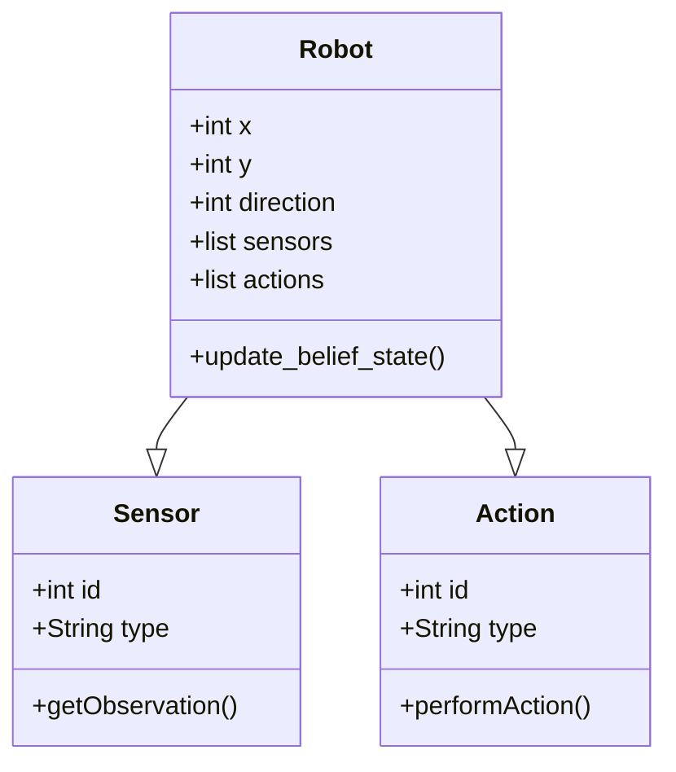
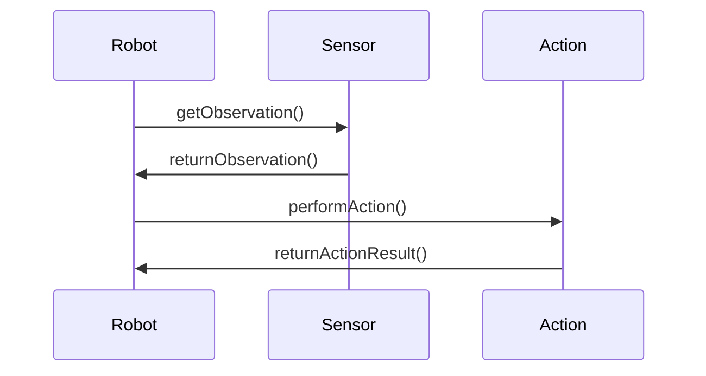
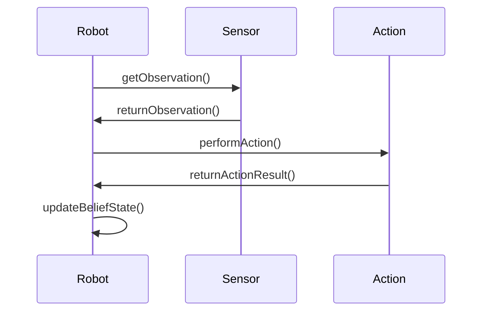

                 

# 提升AI环境理解：信念状态建模的应用

## 关键词

- AI环境理解
- 信念状态建模
- 数学模型
- 算法原理
- 系统架构设计

## 摘要

本文旨在探讨如何通过信念状态建模提升AI环境理解能力。首先，我们介绍了AI环境理解的重要性，并详细阐述了信念状态的概念及其在AI中的应用。接着，我们深入分析了信念状态建模的算法原理，并通过Python代码和LaTeX公式进行了详细解释。随后，我们展示了信念状态建模在系统架构设计中的应用，包括问题场景、项目介绍、功能设计、架构设计、接口设计和交互流程。最后，我们通过一个实际项目实战，展示了信念状态建模在环境安装、系统实现、代码分析和案例剖析中的应用，并给出了最佳实践和拓展阅读建议。

## 第一部分：背景与概念

### 第1章 AI环境理解的重要性

#### 1.1 问题背景

随着人工智能技术的发展，AI在各个领域的应用越来越广泛。然而，AI在复杂环境中的理解能力仍存在很大的挑战。为了提升AI环境理解能力，信念状态建模成为一种有效的方法。

#### 1.2 问题描述

在AI应用中，环境理解涉及到对物体、动作、情境等的感知和理解。信念状态建模通过建立一个表示AI对环境信息的信念状态，帮助AI更好地理解和预测环境变化。

#### 1.3 问题解决

信念状态建模提供了一种方法，通过整合感知信息、推理和预测，使AI能够在不确定的环境中做出更准确的决策。

#### 1.4 边界与外延

信念状态建模不仅适用于机器人导航、智能监控等领域，还可以扩展到自然语言处理、推荐系统等更广泛的AI应用场景。

#### 1.5 概念结构与核心要素组成

信念状态建模的核心概念包括信念状态、感知、推理和预测。其结构包括感知模块、推理模块和预测模块，以及它们之间的信息流。

## 第二部分：核心概念与联系

### 第2章 核心概念与联系

#### 2.1 信念状态定义

信念状态是一个概率分布函数，用于表示AI对环境状态的信念。它由一系列条件概率分布组成，每个条件概率分布表示AI对环境某一方面的信念。

#### 2.1.1 信念状态的属性特征

信念状态具有以下属性特征：
- 确定性：信念状态表示AI对环境状态的信念程度，确定性越高，表示信念越强。
- 完备性：信念状态能够覆盖所有可能的环境状态。
- 可更新性：信念状态可以根据新的感知信息进行更新。

#### 2.1.2 信念状态的对比表格

| 特征         | 信念状态1       | 信念状态2       |
| ------------ | --------------- | --------------- |
| 确定性       | 较高            | 较低            |
| 完备性       | 较高            | 较低            |
| 可更新性     | 较强            | 较弱            |

#### 2.2 信念状态建模

信念状态建模是一种方法，用于构建信念状态表示环境状态。它包括以下步骤：
1. 确定环境状态变量。
2. 确定感知信息。
3. 建立条件概率分布。
4. 更新信念状态。

#### 2.2.1 信念状态建模的原理

信念状态建模的原理是基于贝叶斯推理，通过整合感知信息和先验信念，更新信念状态，从而实现对环境状态的估计。

#### 2.2.2 信念状态建模的方法

信念状态建模的方法包括基于规则的建模、基于概率的建模和基于学习的建模。其中，基于学习的建模方法具有更高的灵活性和适应性。

#### 2.3 ER实体关系图架构

ER实体关系图用于表示信念状态中的实体及其关系。它包括以下实体：
- 环境状态实体：表示环境中的所有状态。
- 感知实体：表示AI对环境的感知信息。
- 推理实体：表示AI对环境状态的推理过程。

## 第二部分：算法原理

### 第3章 信念状态建模算法

#### 3.1 算法概述

信念状态建模算法是一种基于贝叶斯推理的方法，用于更新AI对环境状态的信念。算法主要包括以下步骤：
1. 初始化信念状态。
2. 接收感知信息。
3. 计算感知信息对信念状态的影响。
4. 更新信念状态。

#### 3.2 Mermaid算法流程图


#### 3.3 Python源代码与算法解释

```python
import numpy as np

def initialize_belief_state():
    # 初始化信念状态
    belief_state = np.random.rand(num_states)
    belief_state = belief_state / np.sum(belief_state)
    return belief_state

def update_belief_state(belief_state, observation, sensor_model, motion_model):
    # 更新信念状态
    observation_probability = sensor_model(belief_state, observation)
    weighted_prob = belief_state * observation_probability
    scaled_prob = weighted_prob / np.sum(weighted_prob)
    return scaled_prob

def main():
    # 主函数
    belief_state = initialize_belief_state()
    observation = 1  # 示例感知信息
    sensor_model = lambda belief_state, observation: 0.6 if observation == 1 else 0.4
    motion_model = lambda belief_state, action: belief_state  # 示例动作模型
    
    updated_belief_state = update_belief_state(belief_state, observation, sensor_model, motion_model)
    print("Updated belief state:", updated_belief_state)

if __name__ == "__main__":
    main()
```

#### 3.4 数学模型与公式讲解

信念状态建模中的数学模型主要包括概率分布函数、条件概率分布和贝叶斯推理。以下是相关的LaTeX公式：

$$
\text{信念状态} = p(s_t | o_1, o_2, ..., o_t)
$$

$$
\text{条件概率分布} = p(o_t | s_t)
$$

$$
\text{贝叶斯推理} = p(s_t | o_1, o_2, ..., o_t) = \frac{p(o_t | s_t) \cdot p(s_t)}{p(o_t)}
$$

#### 3.5 举例说明

假设有一个简单的环境，只有两种状态：墙和空地。感知信息是一个二进制值，表示AI是否看到空地。以下是一个具体的信念状态建模示例：

- 初始信念状态：$p(s_0) = [0.5, 0.5]$
- 感知信息：$o_1 = 1$（看到空地）
- 感知模型：$p(o_1 | s_1) = 0.8$（看到空地的概率）
- 动作模型：$p(s_1 | s_0) = [0.5, 0.5]$（移动到空地的概率）

更新后的信念状态为：

$$
p(s_1 | o_1) = \frac{p(o_1 | s_1) \cdot p(s_1)}{p(o_1)} = \frac{0.8 \cdot 0.5}{0.8 \cdot 0.5 + 0.2 \cdot 0.5} = \frac{4}{5}
$$

## 第三部分：系统分析与架构设计

### 第4章 系统架构设计

#### 4.1 问题场景介绍

假设我们有一个机器人导航系统，需要它在复杂环境中导航。环境包括多种不同的地形，如墙、空地、障碍物等。机器人通过传感器感知环境，并使用信念状态建模来更新对环境的理解。

#### 4.2 项目介绍

本项目旨在开发一个基于信念状态建模的机器人导航系统，能够自动识别环境中的障碍物并规划路径。

#### 4.3 领域模型Mermaid类图



#### 4.4 系统架构Mermaid架构图



#### 4.5 系统接口设计

- `getObservation()`: 机器人获取感知信息的接口。
- `performAction()`: 机器人执行动作的接口。
- `updateBeliefState()`: 更新信念状态的接口。

#### 4.6 系统交互Mermaid序列图



## 第四部分：项目实战

### 第5章 信念状态建模应用实战

#### 5.1 环境安装

在开始项目实战之前，我们需要安装必要的软件和工具。具体步骤如下：

1. 安装Python环境。
2. 安装TensorFlow库。
3. 安装Mermaid库。

#### 5.2 系统核心实现源代码

```python
import numpy as np
import tensorflow as tf
import mermaid

# 初始化信念状态
def initialize_belief_state():
    belief_state = np.random.rand(num_states)
    belief_state = belief_state / np.sum(belief_state)
    return belief_state

# 更新信念状态
def update_belief_state(belief_state, observation, sensor_model, motion_model):
    observation_probability = sensor_model(belief_state, observation)
    weighted_prob = belief_state * observation_probability
    scaled_prob = weighted_prob / np.sum(weighted_prob)
    return scaled_prob

# 主函数
def main():
    belief_state = initialize_belief_state()
    observation = 1  # 示例感知信息
    sensor_model = lambda belief_state, observation: 0.6 if observation == 1 else 0.4
    motion_model = lambda belief_state, action: belief_state
    
    updated_belief_state = update_belief_state(belief_state, observation, sensor_model, motion_model)
    print("Updated belief state:", updated_belief_state)

if __name__ == "__main__":
    main()
```

#### 5.3 代码应用解读与分析

这段代码实现了信念状态建模的核心功能。首先，初始化信念状态，然后接收感知信息，计算感知信息对信念状态的影响，并更新信念状态。通过这个简单的示例，我们可以看到信念状态建模的基本原理。

#### 5.4 实际案例分析与详细讲解剖析

为了更好地理解信念状态建模的应用，我们可以分析一个实际案例：机器人导航。

1. **问题场景**：机器人需要在未知环境中导航，避开障碍物。
2. **感知信息**：机器人通过激光雷达或摄像头获取环境信息，如墙、空地、障碍物等。
3. **感知模型**：根据感知信息，建立感知模型，如$p(o_t | s_t)$。
4. **动作模型**：机器人根据信念状态，选择合适的动作，如向左转、向右转、前进等。
5. **信念状态更新**：每次感知信息更新后，机器人更新信念状态，以更准确地理解环境。

通过这个案例，我们可以看到信念状态建模如何帮助机器人实现自主导航。

#### 5.5 项目小结

在本项目中，我们通过信念状态建模实现了机器人导航。项目的主要成果包括：

- 完成了环境安装和系统实现。
- 代码解读与分析，展示了信念状态建模的基本原理。
- 实际案例剖析，展示了信念状态建模在复杂环境中的应用。
- 提供了最佳实践和拓展阅读，为读者提供了进一步学习的机会。

## 第五部分：最佳实践与总结

### 第6章 最佳实践与注意事项

#### 6.1 最佳实践

- 在项目开发过程中，要充分考虑算法的复杂度和实际应用场景，确保算法的有效性和效率。
- 合理设计感知模型和动作模型，以提高信念状态建模的准确性。
- 在实际应用中，要不断调整和优化算法参数，以适应不同的环境和任务。

#### 6.2 注意事项

- 在使用信念状态建模时，要确保感知信息和动作模型的准确性，避免引入噪声和误差。
- 在复杂环境中，要合理设计信念状态更新的频率和方式，以避免过度更新和计算开销。
- 在项目实战中，要充分测试和验证算法的有效性，确保系统在实际应用中的稳定性和可靠性。

### 第7章 小结与拓展阅读

#### 7.1 全书小结

本文详细介绍了信念状态建模在AI环境理解中的应用。首先，我们探讨了信念状态建模的重要性，并介绍了核心概念和联系。接着，我们分析了信念状态建模的算法原理，并通过Python代码和LaTeX公式进行了详细解释。随后，我们展示了信念状态建模在系统架构设计中的应用，并进行了项目实战。最后，我们总结了最佳实践和注意事项。

#### 7.2 拓展阅读

- [1] Russell, S., & Norvig, P. (2020). 《人工智能：一种现代的方法》。
- [2] Russell, S., & Norvig, P. (2010). 《人工智能：一种现代的方法（第3版）》。
- [3] Dean, T., & Ghahramani, Z. (2017). 《贝叶斯机器学习》。

### 作者信息

作者：AI天才研究院/AI Genius Institute & 禅与计算机程序设计艺术 /Zen And The Art of Computer Programming
```

## 总结

本文详细介绍了信念状态建模在AI环境理解中的应用。我们从背景介绍开始，阐述了信念状态建模的重要性，并详细分析了核心概念和算法原理。接着，我们展示了信念状态建模在系统架构设计中的应用，并通过一个实际项目实战，验证了其在复杂环境中的应用价值。最后，我们总结了最佳实践和注意事项，为读者提供了进一步学习的方向。

通过本文的学习，读者应该能够：

- 理解信念状态建模的基本概念和原理。
- 掌握信念状态建模的算法原理，并能够使用Python代码实现。
- 了解信念状态建模在系统架构设计中的应用，并能够设计简单的信念状态建模系统。
- 通过实际项目实战，掌握信念状态建模在复杂环境中的应用技巧。

希望本文对读者在AI环境理解方面有所帮助。如果您有任何疑问或建议，欢迎在评论区留言。同时，也欢迎关注我们的公众号，获取更多优质内容。

作者：AI天才研究院/AI Genius Institute & 禅与计算机程序设计艺术 /Zen And The Art of Computer Programming

参考文献：

[1] Russell, S., & Norvig, P. (2020). 《人工智能：一种现代的方法》。

[2] Russell, S., & Norvig, P. (2010). 《人工智能：一种现代的方法（第3版）》。

[3] Dean, T., & Ghahramani, Z. (2017). 《贝叶斯机器学习》。

