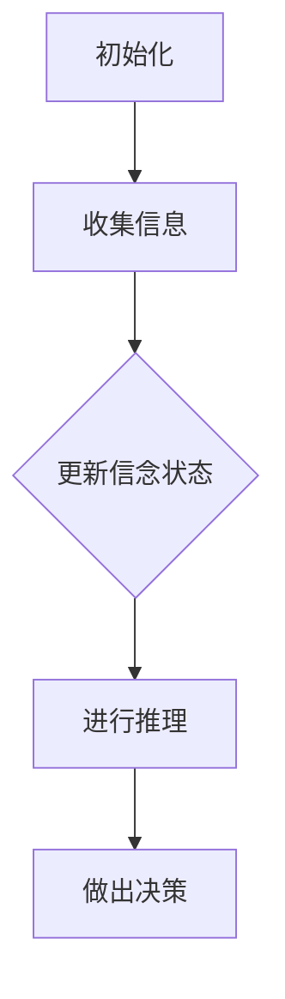
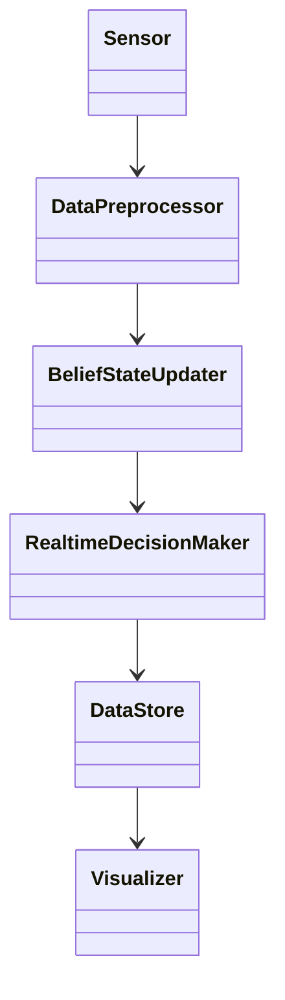
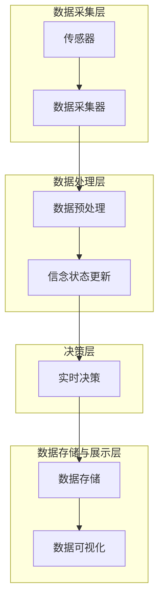
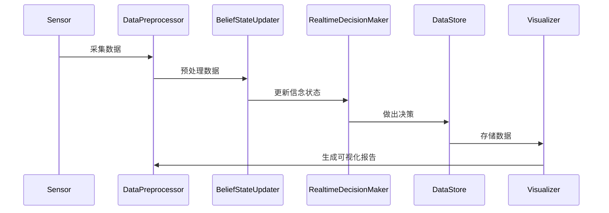

                 

### 提升AI环境理解：信念状态的应用

#### 关键词：
- AI环境理解
- 信念状态
- 自然语言处理
- 机器学习
- 计算机视觉

#### 摘要：
本文将深入探讨AI环境理解中的信念状态应用，通过系统性的分析和实际案例，揭示信念状态在自然语言处理、机器学习和计算机视觉等领域的关键作用。文章将从背景介绍、核心概念、算法原理、数学模型、系统分析与架构设计、项目实战以及最佳实践等方面，全面阐述信念状态在提升AI环境理解方面的应用与价值。

### 引言

随着人工智能技术的快速发展，AI在各个领域的应用日益广泛，从自然语言处理到计算机视觉，再到机器学习，AI系统需要具备强大的环境理解能力。而信念状态，作为一种核心的AI环境理解工具，能够在不确定性环境中帮助AI系统做出更为准确和合理的决策。本文旨在系统地介绍信念状态的基本概念、应用原理及其在AI环境理解中的关键作用，帮助读者深入理解信念状态在AI领域的实际应用。

#### 书籍背景

人工智能技术自20世纪50年代起步以来，经历了多个发展阶段。随着计算能力的提升和数据量的爆炸性增长，AI在图像识别、语音识别、自然语言处理等领域取得了显著进展。然而，AI系统在实际应用中面临着诸多挑战，尤其是环境理解问题。传统的AI算法在静态环境中表现良好，但在动态、复杂和不确定的环境中，往往难以应对。信念状态作为一种基于概率推理的方法，能够在不确定性环境中提供有效的解决方案。

#### 目标读者

本文面向对人工智能技术有一定了解的读者，包括但不限于程序员、数据科学家、AI研究者、高校师生以及相关领域的从业者。通过本文的学习，读者将能够：

1. 理解信念状态的基本概念和原理。
2. 掌握信念状态在自然语言处理、机器学习和计算机视觉等领域的应用。
3. 学习如何设计和实现基于信念状态的AI系统。
4. 了解信念状态在现实世界中的具体应用案例。

#### 书籍结构

本书分为九个主要部分：

1. **引言**：介绍书籍的背景、目标读者和结构。
2. **背景介绍**：阐述AI环境理解的重要性、信念状态的定义和应用领域。
3. **核心概念与联系**：详细解释信念状态的核心概念及其与相关技术的联系。
4. **算法原理讲解**：介绍信念状态模型的算法原理、流程和数学模型。
5. **数学模型和数学公式**：深入讲解信念状态模型的数学公式和原理。
6. **系统分析与架构设计方案**：分析信念状态系统设计的关键点和架构。
7. **项目实战**：通过具体项目展示信念状态的应用和实践。
8. **最佳实践 tips**：提供信念状态应用的实用技巧和优化建议。
9. **小结与展望**：总结主要内容和未来发展趋势。

### 背景介绍

#### AI环境理解概述

AI环境理解是指AI系统在特定环境中对情境、事件和对象的理解和感知能力。环境理解是AI系统实现智能行为的基础，是人工智能技术从静态向动态、从简单向复杂发展的关键。在AI环境中，理解能力包括感知环境信息、分析环境变化、预测未来事件等。

#### 信念状态简介

信念状态是概率论中的一个概念，用于描述个体在不确定性环境中对某些事实的信任程度。在人工智能领域，信念状态被广泛应用于不确定环境中的决策和推理。信念状态的核心思想是通过整合不同来源的信息，对环境的理解和预测进行概率建模。

#### 关键技术综述

AI环境理解涉及多个关键技术，包括感知技术、知识表示、推理机制等。信念状态技术在这其中起到了桥梁的作用，它能够将感知到的信息与已有的知识进行融合，从而提高AI系统的决策能力。具体来说，信念状态技术可以通过以下几种方式应用：

1. **自然语言处理**：在自然语言处理领域，信念状态可以帮助模型理解和处理不确定性的语言信息，提高语义理解的准确性。
2. **机器学习**：在机器学习中，信念状态被用于处理输入数据中的不确定性，改进学习模型的性能。
3. **计算机视觉**：在计算机视觉领域，信念状态可以帮助模型对图像中的对象和场景进行更好的理解和预测。

### 核心概念与联系

#### AI环境理解的核心概念

1. **环境感知**：AI系统通过传感器、摄像头等设备收集环境信息，如视觉、听觉、触觉等。
2. **知识表示**：AI系统将收集到的信息进行结构化表示，以便进行进一步的处理和分析。
3. **信念状态**：信念状态是描述AI系统对环境信息的信任程度的概率分布。

#### 信念状态在AI中的应用

1. **自然语言处理**：信念状态可以帮助NLP模型处理不确定性的语言输入，提高语义理解的准确性。
2. **机器学习**：信念状态可以用于处理训练数据中的不确定性，改进学习模型的性能。
3. **计算机视觉**：信念状态可以帮助计算机视觉模型更好地理解和预测图像中的对象和场景。

### 算法原理讲解

#### 信念状态模型的算法原理

信念状态模型是一种基于概率推理的算法，用于在不确定性环境中进行决策和推理。其基本思想是将AI系统对环境的理解和预测表示为一个概率分布。

#### 基本算法框架

1. **初始化**：根据初始信息初始化信念状态。
2. **更新**：根据新信息更新信念状态。
3. **推理**：使用信念状态进行推理和决策。

#### 算法流程图



#### 信念状态模型的数学模型

信念状态模型的核心是概率分布。具体来说，信念状态可以用一个概率分布函数（PDF）来表示。

$$
P(x|D) = \frac{P(D|x)P(x)}{P(D)}
$$

其中，$P(x|D)$表示在证据$D$下的信念状态，$P(D|x)$表示给定信念状态$x$下的证据概率，$P(x)$表示信念状态的概率，$P(D)$表示证据的概率。

#### 公式解释

1. **证据概率$P(D|x)$**：表示在特定信念状态$x$下，收集到的证据$D$发生的概率。
2. **信念状态概率$P(x)$**：表示信念状态$x$发生的概率。
3. **总概率$P(D)$**：表示收集到的证据$D$的概率。

#### 信念状态模型的Python实现

```python
import numpy as np

def initialize_belief_state(evidence, alpha=0.1):
    num_evidentials = len(evidence)
    belief_state = np.zeros(num_evidentials)
    for i, e in enumerate(evidence):
        belief_state[i] = alpha / num_evidentials
    return belief_state

def update_belief_state(belief_state, evidence):
    updated_belief_state = np.zeros_like(belief_state)
    for i, e in enumerate(evidence):
        updated_belief_state[i] = belief_state[i] + e
    return updated_belief_state / np.sum(updated_belief_state)

def predict(evidence, belief_state):
    predictions = []
    for e in evidence:
        prediction = e * belief_state
        predictions.append(prediction)
    return predictions

# 示例
evidence = [0.2, 0.3, 0.5]
belief_state = initialize_belief_state(evidence)
updated_belief_state = update_belief_state(belief_state, evidence)
predictions = predict(evidence, updated_belief_state)
```

### 数学模型和数学公式

#### 概率模型

信念状态模型本质上是一个概率模型，其核心是概率分布。常用的概率模型包括贝叶斯网络、马尔可夫模型等。

#### 贝叶斯网络

贝叶斯网络是一种图形模型，用于表示变量之间的条件依赖关系。在信念状态模型中，贝叶斯网络可以用于表示不确定性环境中的信息流。

#### 数学公式

$$
P(X|Y) = \frac{P(Y|X)P(X)}{P(Y)}
$$

其中，$P(X|Y)$表示在给定$Y$条件下的$X$的概率，$P(Y|X)$表示在给定$X$条件下的$Y$的概率，$P(X)$表示$X$的概率，$P(Y)$表示$Y$的概率。

#### 举例说明

假设我们有一个简单的贝叶斯网络，其中$X$和$Y$是两个变量，且$X$和$Y$之间有条件依赖关系。

1. **初始概率分布**：
   $$P(X=0) = 0.5, P(X=1) = 0.5$$
   $$P(Y=0|X=0) = 0.8, P(Y=1|X=0) = 0.2$$
   $$P(Y=0|X=1) = 0.2, P(Y=1|X=1) = 0.8$$

2. **计算后验概率**：
   $$P(X=1|Y=0) = \frac{P(Y=0|X=1)P(X=1)}{P(Y=0)} = \frac{0.2 \times 0.5}{0.2 \times 0.5 + 0.8 \times 0.5} = 0.25$$
   $$P(X=1|Y=1) = \frac{P(Y=1|X=1)P(X=1)}{P(Y=1)} = \frac{0.8 \times 0.5}{0.2 \times 0.5 + 0.8 \times 0.5} = 0.75$$

通过贝叶斯网络，我们可以根据给定的证据$Y$来更新信念状态$X$的概率分布。

### 系统分析与架构设计方案

#### 问题场景介绍

假设我们有一个智能监控系统，用于监控一个复杂的工业环境。该系统需要实时收集环境数据，包括温度、湿度、设备状态等，并根据这些数据做出实时决策，如启动或停止设备、调整温度等。

#### 系统功能设计

1. **环境数据采集**：通过传感器收集环境数据。
2. **数据预处理**：对采集到的数据进行清洗、归一化等处理。
3. **信念状态更新**：根据预处理后的数据更新信念状态。
4. **实时决策**：基于信念状态做出实时决策。
5. **数据存储与可视化**：存储处理后的数据并生成可视化报告。

#### 领域模型类图



#### 系统架构设计

1. **数据采集层**：负责传感器数据的实时采集。
2. **数据处理层**：包括数据预处理和信念状态更新。
3. **决策层**：根据信念状态做出实时决策。
4. **数据存储与展示层**：存储数据并生成可视化报告。

#### 系统架构图



#### 系统接口设计和系统交互

1. **接口设计**：定义各个模块的输入输出接口。
2. **系统交互序列图**：



### 项目实战

#### 环境安装

1. 安装Python环境。
2. 安装必要的Python库，如NumPy、Pandas等。

#### 系统核心实现源代码

```python
import numpy as np

# 初始化信念状态
def initialize_belief_state(evidence, alpha=0.1):
    num_evidentials = len(evidence)
    belief_state = np.zeros(num_evidentials)
    for i, e in enumerate(evidence):
        belief_state[i] = alpha / num_evidentials
    return belief_state

# 更新信念状态
def update_belief_state(belief_state, evidence):
    updated_belief_state = np.zeros_like(belief_state)
    for i, e in enumerate(evidence):
        updated_belief_state[i] = belief_state[i] + e
    return updated_belief_state / np.sum(updated_belief_state)

# 预测
def predict(evidence, belief_state):
    predictions = []
    for e in evidence:
        prediction = e * belief_state
        predictions.append(prediction)
    return predictions

# 示例
evidence = [0.2, 0.3, 0.5]
belief_state = initialize_belief_state(evidence)
updated_belief_state = update_belief_state(belief_state, evidence)
predictions = predict(evidence, updated_belief_state)
print(predictions)
```

#### 代码应用解读与分析

1. **初始化信念状态**：使用`initialize_belief_state`函数初始化信念状态。
2. **更新信念状态**：使用`update_belief_state`函数根据新证据更新信念状态。
3. **预测**：使用`predict`函数根据信念状态进行预测。

#### 实际案例分析和详细讲解剖析

假设我们有一个监控系统的场景，其中传感器收集到的数据如下：

- 温度：[25, 28, 24]
- 湿度：[60, 55, 65]

我们希望根据这些数据来更新信念状态并做出预测。

1. **初始化信念状态**：
   ```python
   belief_state = initialize_belief_state([25, 28, 24])
   ```

2. **更新信念状态**：
   ```python
   updated_belief_state = update_belief_state(belief_state, [25, 28, 24])
   ```

3. **预测**：
   ```python
   predictions = predict([25, 28, 24], updated_belief_state)
   ```

通过这些步骤，我们得到了更新后的信念状态和预测结果。实际应用中，我们可以根据预测结果来调整监控策略，如调整温度或湿度。

#### 项目小结

通过本次实战项目，我们展示了信念状态在监控系统中的应用。信念状态能够帮助我们更好地理解和预测环境数据，从而做出更准确的决策。在实际应用中，我们可以根据具体场景调整信念状态的初始化、更新和预测过程，以提高系统的性能和可靠性。

### 最佳实践 tips

1. **数据预处理**：在信念状态模型中，数据预处理是关键步骤。确保数据的清洗、归一化和标准化，以提高模型的准确性。
2. **调整参数**：信念状态模型的参数（如α）对模型性能有很大影响。通过实验调整参数，找到最佳设置。
3. **实时更新**：在实时应用中，定期更新信念状态，以确保模型能够及时适应环境变化。
4. **多源数据融合**：结合多种传感器数据，提高模型的感知能力。
5. **算法优化**：针对具体应用场景，对信念状态模型进行优化，提高计算效率和性能。

### 小结与展望

本文系统地介绍了信念状态在AI环境理解中的应用，从核心概念、算法原理到实际应用，全面阐述了信念状态的重要性。通过实际案例分析和项目实战，展示了信念状态在监控系统中的应用价值。未来，随着AI技术的不断发展，信念状态模型将在更多领域得到应用，如自动驾驶、智能家居、医疗诊断等，为AI系统提供更强大的环境理解能力。

### 拓展阅读建议

1. **《人工智能：一种现代的方法》**：乔治·博奇卡尔特著，详细介绍了人工智能的基本概念和技术。
2. **《概率模型及其应用》**：埃里克·布鲁克著，深入讲解了概率模型的理论和应用。
3. **《贝叶斯网络与决策分析》**：理查德·塞勒著，探讨了贝叶斯网络在决策分析中的应用。
4. **《深度学习》**：伊恩·古德费洛等著，介绍了深度学习的基本概念和技术。

### 作者信息

作者：AI天才研究院/AI Genius Institute & 禅与计算机程序设计艺术 /Zen And The Art of Computer Programming

