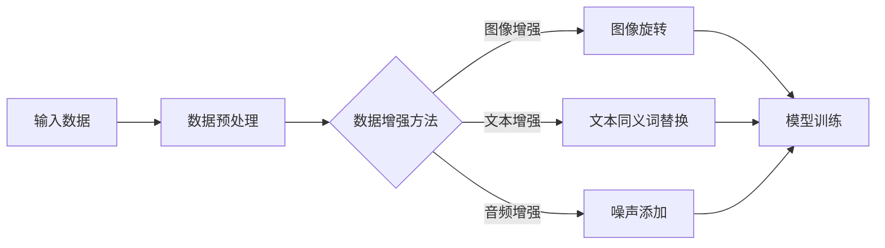
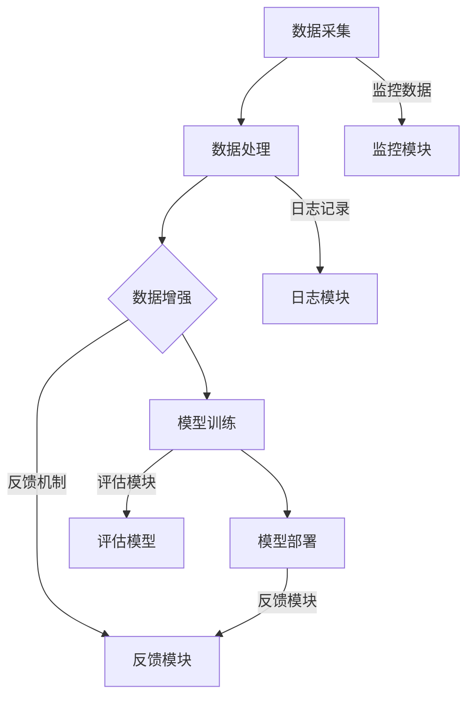
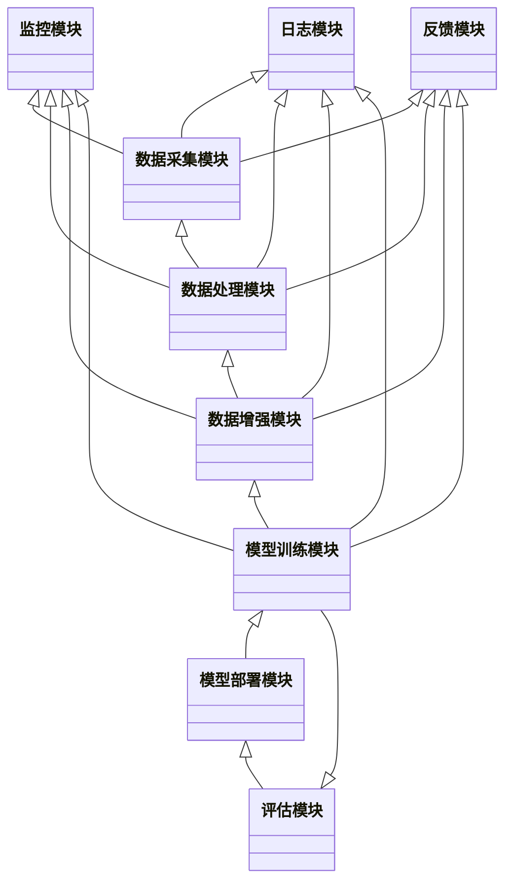
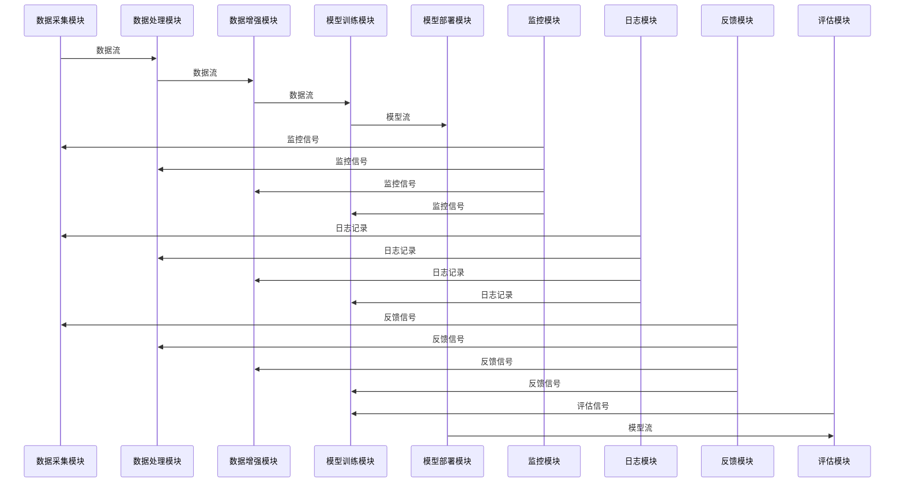

                 

### 引言

随着人工智能（AI）技术的迅速发展，其应用场景已广泛渗透到各行各业，从自动驾驶、医疗诊断到自然语言处理和推荐系统，AI在改变生活和社会方式方面发挥着越来越重要的作用。然而，AI的训练质量直接决定了其应用的效果和可靠性，而数据多样性则是提升AI训练质量的关键因素之一。

在本文中，我们将探讨数据多样性对AI训练质量的重要性，并详细分析其背后的原理和实践方法。首先，我们会介绍数据多样性的定义及其重要性，然后深入探讨数据多样性在AI训练中的应用，包括数据增强技术、跨域迁移学习和数据预处理与清洗等具体方法。接下来，我们将通过核心概念、算法原理和数学模型等详细讲解数据多样性的本质，并通过一个实际项目案例来展示其在现实中的应用。最后，我们将总结最佳实践并提供进一步阅读的建议。

通过本文的逐步分析，我们希望读者能够深刻理解数据多样性在提升AI训练质量中的重要作用，并能够将所学知识应用到实际项目中，从而提高AI系统的性能和可靠性。

### 数据多样性概述

数据多样性，是指数据集中包含的各种不同类型和来源的数据特征。具体来说，它包括数据的分布、数据的来源、数据的标注等多个维度。在AI训练中，数据多样性的重要性不言而喻。首先，数据多样性能够增强模型的泛化能力。如果数据集仅包含有限的类型或来源，模型可能会在特定条件下表现优异，但在遇到新情境时却可能出现性能下降，即所谓的“过拟合”问题。相反，一个多样化数据集可以帮助模型学习到更广泛的规律，从而在多种情境下保持良好的性能。

其次，数据多样性还可以提升模型的鲁棒性。现实世界中的数据往往存在噪声和异常值，如果训练数据缺乏多样性，模型可能会对这些噪声和异常值过于敏感，导致在实际应用中稳定性差。例如，在图像识别任务中，如果数据集中只有白天拍摄的图片，模型可能会对夜间拍摄的照片识别效果不佳。因此，通过增加数据多样性，可以增强模型对各种噪声和异常值的抵抗力。

此外，数据多样性还有助于发现潜在的模式和关联。许多复杂的任务，如自然语言处理和推荐系统，需要模型理解并预测各种复杂的模式。如果数据集缺乏多样性，模型可能无法发现这些模式，从而导致任务性能下降。例如，在文本分类任务中，如果数据集仅包含单一话题的文章，模型可能无法正确分类涉及多话题的文章。

总之，数据多样性是提升AI训练质量的关键因素之一，它不仅能够提高模型的泛化能力和鲁棒性，还能够帮助模型发现复杂的模式和关联。因此，在实际的AI训练过程中，重视数据多样性是至关重要的。接下来，我们将进一步探讨数据多样性的分类及其在AI训练中的具体应用。

### 数据多样性的分类及其在AI训练中的应用

数据多样性可以分为多个维度，包括数据的分布、数据的来源、数据的标注等多个方面。每一个维度都对AI训练的质量有着重要的影响。下面，我们将详细讨论这些维度的具体分类及其在AI训练中的应用。

#### 数据分布

数据分布是指数据在不同类别或特征的分布情况。在AI训练中，数据分布的均匀性至关重要。如果数据分布不均匀，模型可能会对某些类别或特征过于关注，导致训练结果偏向这些类别或特征。这种现象称为“类不平衡”（Class Imbalance）。类不平衡会导致模型在某些类别上的性能较差，甚至出现“偏见”（Bias）。

为了解决类不平衡问题，可以采用以下几种策略：

1. **重采样**：通过增加少数类别的样本数量或减少多数类别的样本数量，使得数据分布更加均匀。重采样方法包括过采样（Over-sampling）和欠采样（Under-sampling）。
2. **权重调整**：在训练过程中，为不同类别的样本赋予不同的权重，使得模型对少数类别的样本更加关注。
3. **集成学习**：通过集成多个模型来平衡数据分布，每个模型关注不同的类别或特征，从而提高整体模型的性能。

#### 数据来源

数据来源是指数据的获取渠道。数据来源的多样性能够增强模型的泛化能力。如果数据仅来源于单一渠道，模型可能会过度依赖这些数据，导致在实际应用中遇到新情境时性能下降。

为了提高数据来源的多样性，可以采取以下措施：

1. **跨域迁移学习**：利用其他领域的数据来丰富训练数据，提高模型对不同领域的适应性。
2. **多源数据融合**：将来自不同来源的数据进行融合，利用多种数据源的信息来提升模型性能。
3. **数据扩充**：通过生成或修改现有数据，增加数据来源的多样性。数据扩充方法包括图像生成、文本生成等。

#### 数据标注

数据标注是指对数据进行标记，以便模型能够理解数据的意义。数据标注的多样性对模型的训练效果有着直接影响。如果数据标注过于单一，模型可能无法学习到丰富的特征和模式。

以下是一些提高数据标注多样性的方法：

1. **多标注者**：引入多个标注者，通过合并多个标注结果来提高标注的准确性。
2. **多模态标注**：利用多种模态的数据进行标注，如结合图像、文本和音频等多种数据源进行标注。
3. **主动学习**：通过主动选择最有价值的数据进行标注，以提高数据标注的质量和多样性。

#### 应用策略

在实际的AI训练过程中，以下策略可以帮助提高数据多样性，从而提升模型性能：

1. **数据增强**：通过图像旋转、裁剪、缩放等技术，增加数据的多样性。
2. **数据集成**：将来自不同数据源的多样化数据集进行集成，提高训练数据的丰富性。
3. **跨域迁移学习**：利用跨领域的知识迁移，提升模型在不同领域的适应能力。
4. **多模态学习**：利用多种模态的数据进行联合训练，提高模型的泛化能力。

通过上述分类及其应用策略，我们可以看到，数据多样性在AI训练中起着至关重要的作用。提高数据多样性不仅能够提升模型的性能，还能增强模型的鲁棒性和泛化能力。因此，在实际的AI训练过程中，我们应该重视数据多样性的提升，从而设计出更加高效和可靠的AI系统。

### 数据多样性对AI训练质量的影响

数据多样性对AI训练质量有着深远的影响，这种影响主要体现在模型的性能、泛化能力和鲁棒性三个方面。

首先，从模型性能的角度来看，数据多样性可以显著提高模型的准确率和精度。一个多样化的数据集能够提供更多的样本和特征，使模型在学习过程中能够更全面地理解问题的复杂性。例如，在图像识别任务中，如果数据集包含不同光照、角度和背景的图片，模型就能更好地应对各种复杂环境，从而提高识别准确率。相反，如果数据集缺乏多样性，模型可能会在特定条件下表现优异，但在面对新环境时表现不佳，导致整体性能下降。

其次，数据多样性对模型的泛化能力有着重要影响。泛化能力是指模型在新情境下能够保持良好性能的能力。一个多样化的数据集可以帮助模型学习到更广泛的规律，从而提高其在新情境下的适应性。例如，在医疗诊断任务中，如果数据集仅包含某种特定疾病的病例，模型可能在诊断这种疾病时表现出色，但在遇到其他疾病时却可能无法胜任。通过增加数据多样性，可以增强模型的泛化能力，使其能够更好地适应各种不同的诊断需求。

最后，数据多样性对模型的鲁棒性有着显著的影响。鲁棒性是指模型在面对噪声和异常值时的稳定性。一个多样化的数据集可以包含各种噪声和异常值，从而帮助模型学习到如何处理这些干扰因素。例如，在语音识别任务中，如果数据集仅包含标准语音，模型可能会在遇到口音、背景噪声等复杂情境时表现较差。通过增加数据多样性，可以增强模型的鲁棒性，使其在面对各种复杂情境时仍能保持良好的性能。

综上所述，数据多样性对AI训练质量的影响是多方面的。它不仅能够提高模型的性能和泛化能力，还能增强模型的鲁棒性，从而设计出更加高效和可靠的AI系统。因此，在实际的AI训练过程中，我们应该重视数据多样性的提升，通过多样化的数据集来优化模型的训练效果。

### 数据增强技术

在AI训练中，数据增强技术是一种重要的方法，旨在通过增加数据多样性和丰富度来提升模型的性能。数据增强技术主要包括图像增强、文本增强和音频增强等。以下将详细讨论这些技术以及它们在AI训练中的应用。

#### 图像增强

图像增强是数据增强中最常用的方法之一，主要包括对图像进行旋转、裁剪、缩放、色彩调整等操作。这些操作可以生成新的图像，从而增加数据集的多样性。

1. **旋转和裁剪**：通过旋转图像或裁剪图像的一部分，可以生成新的图像样本。这种方法能够帮助模型学习到不同视角和局部特征。
2. **缩放**：通过缩放图像，可以生成不同尺寸的图像样本。这种方法有助于模型学习到不同尺度下的特征。
3. **色彩调整**：通过调整图像的色彩，如对比度、亮度、饱和度等，可以生成新的图像样本。这种方法有助于模型学习到在不同光照条件下的特征。

在实际应用中，图像增强可以显著提高图像识别模型的性能。例如，在人脸识别任务中，通过旋转和缩放图像，可以生成大量不同姿态和大小的人脸图像，从而提高模型对不同姿态和大小人脸的识别能力。

#### 文本增强

文本增强技术旨在通过生成新的文本样本或修改现有文本样本，来增加文本数据的多样性。常见的文本增强方法包括文本生成、文本同义词替换和文本分类等。

1. **文本生成**：通过自然语言生成技术，如生成对抗网络（GAN）和变分自编码器（VAE），可以生成新的文本样本。这种方法有助于模型学习到更丰富的语言特征。
2. **文本同义词替换**：通过将文本中的某些词汇替换为其同义词，可以生成新的文本样本。这种方法能够增加文本数据的多样性，使模型学习到不同表达方式下的特征。
3. **文本分类**：通过将文本数据分配到不同的类别，可以增加文本数据的多样性。这种方法有助于模型学习到不同类别文本的特征。

文本增强技术在自然语言处理任务中有着广泛的应用。例如，在情感分析任务中，通过生成和分类不同的情感文本，可以提高模型对情感表达的识别能力。

#### 音频增强

音频增强技术旨在通过生成或修改音频样本，来增加音频数据的多样性。常见的音频增强方法包括噪声添加、音调变化和节奏调整等。

1. **噪声添加**：通过在音频中添加噪声，可以生成新的音频样本。这种方法有助于模型学习到在不同噪声环境下的特征。
2. **音调变化**：通过调整音频的音调，可以生成新的音频样本。这种方法有助于模型学习到不同音调下的特征。
3. **节奏调整**：通过调整音频的节奏，可以生成新的音频样本。这种方法有助于模型学习到不同节奏下的特征。

音频增强技术在语音识别任务中有着重要应用。例如，通过添加噪声和改变音调，可以生成不同噪声环境下的语音样本，从而提高模型在不同噪声环境下的识别能力。

#### 应用实例

以下是一个图像增强的应用实例：假设我们有一个用于图像分类的任务，数据集中包含不同种类动物的照片。为了增强数据多样性，我们可以对图像进行旋转、裁剪和缩放操作。具体步骤如下：

1. **旋转**：将图像随机旋转一定角度，如30度、45度等。
2. **裁剪**：随机裁剪图像的一部分，如裁剪掉图像的上半部分或下半部分。
3. **缩放**：将图像随机缩放到不同尺寸，如原始尺寸的0.8倍、1.2倍等。

通过这些操作，我们可以生成大量新的图像样本，从而提高模型在不同视角和尺寸下的分类能力。

总之，数据增强技术通过增加数据的多样性和丰富度，能够显著提升AI训练的质量。在实际应用中，应根据任务需求和数据特点，选择合适的数据增强方法，以优化模型的性能。

### 跨域迁移学习

跨域迁移学习是一种利用来自不同领域的数据来提升AI模型性能的重要技术。其主要思想是，将一个领域（源领域）的知识迁移到另一个领域（目标领域），从而提高目标领域模型的泛化能力和鲁棒性。跨域迁移学习在AI训练中具有重要的应用价值，特别是在数据稀缺或数据获取成本高昂的情况下。

首先，我们来看一个实际应用案例：假设我们要训练一个用于手写数字识别的模型。如果我们只有少量的手写数字数据，那么模型的泛化能力可能会受到限制。通过跨域迁移学习，我们可以利用来自不同数据源的手写文本数据，如不同字体、不同书写风格的数据，来增强手写数字识别模型的泛化能力。具体步骤如下：

1. **数据收集**：收集来自多个领域的手写文本数据，包括不同的字体、书写风格和纸张类型。
2. **数据预处理**：对收集到的数据进行清洗和预处理，如去除噪声、调整图像大小等。
3. **特征提取**：利用深度学习模型对预处理后的数据进行特征提取，得到高维的特征向量。
4. **模型训练**：使用提取到的特征向量训练手写数字识别模型，通过迁移学习来提高模型在目标领域的性能。

接下来，我们分析跨域迁移学习如何提升AI训练质量。首先，跨域迁移学习可以显著增加训练数据的多样性。多样性是提高模型泛化能力的关键因素之一。通过引入来自不同领域的数据，模型能够学习到更广泛的特征和模式，从而提高其在目标领域中的性能。

其次，跨域迁移学习有助于减少过拟合现象。过拟合是指模型在训练数据上表现良好，但在新数据上表现较差的现象。在数据稀缺的情况下，模型容易过拟合。通过跨域迁移学习，模型可以从多个领域的数据中学习到更一般的特征，从而减少对特定领域数据的依赖，降低过拟合的风险。

此外，跨域迁移学习还可以提高模型的鲁棒性。现实世界中的数据往往存在噪声和异常值。通过跨域迁移学习，模型可以在多个领域的数据中学习到如何处理噪声和异常值，从而提高其鲁棒性。

最后，跨域迁移学习可以节省训练时间和计算资源。在数据稀缺的情况下，通过利用跨领域的知识迁移，我们可以减少对大量数据的依赖，从而降低训练成本。这对于资源受限的设备和环境尤为重要。

总之，跨域迁移学习是一种有效的技术，可以帮助提升AI训练质量。它不仅能够增加训练数据的多样性，减少过拟合现象，提高模型的鲁棒性，还能节省训练时间和计算资源。在实际应用中，我们应该充分利用跨域迁移学习，从而设计出更加高效和可靠的AI系统。

### 数据预处理与清洗

在AI训练过程中，数据预处理与清洗是至关重要的一步，它直接影响到模型的训练效果和性能。数据预处理与清洗主要包括数据去重、数据清洗、数据标注和数据归一化等步骤。

#### 数据去重

数据去重是指从数据集中删除重复的记录。重复数据的存在可能会导致模型训练过程中出现偏差，影响模型的泛化能力。数据去重的方法包括：

1. **基于哈希值**：通过计算数据的哈希值，将重复的数据标记出来并删除。
2. **基于比较**：直接比较数据集中的每两条记录，找出重复的记录并删除。

#### 数据清洗

数据清洗是指处理数据中的噪声和异常值，以提高数据质量。常见的数据清洗方法包括：

1. **缺失值处理**：对于缺失的数据，可以采用填补方法（如平均值填补、中值填补）或删除方法（如删除缺失值比例较高的记录）。
2. **异常值处理**：通过统计方法（如标准差、箱线图）识别出异常值，并采用相应的处理方法（如删除、修正）。
3. **数据格式统一**：统一数据格式，如日期格式、数值格式等，以方便后续处理。

#### 数据标注

数据标注是指对数据进行标签标记，以便模型能够理解数据的含义。数据标注的准确性直接影响模型的训练效果。常见的数据标注方法包括：

1. **手工标注**：由专业人员对数据集进行标注。
2. **半监督标注**：利用已有标注数据，结合模型预测结果进行标注。
3. **自动标注**：利用深度学习模型进行自动标注，如利用生成对抗网络（GAN）生成标注数据。

#### 数据归一化

数据归一化是指将数据转换为统一的尺度，以便模型能够更好地处理数据。常见的数据归一化方法包括：

1. **最小-最大归一化**：将数据缩放到[0, 1]区间。
   $$\text{normalized\_value} = \frac{\text{value} - \text{min}}{\text{max} - \text{min}}$$
2. **标准归一化**：将数据缩放到标准正态分布，即均值为0，标准差为1的区间。
   $$\text{normalized\_value} = \frac{\text{value} - \text{mean}}{\text{std}}$$

#### 实际应用案例

以图像识别任务为例，数据预处理与清洗的具体步骤如下：

1. **数据去重**：删除重复的图像记录，确保每个图像只有一个样本。
2. **数据清洗**：去除图像中的噪声，如模糊、斑点等，通过滤波器（如高斯滤波、中值滤波）进行处理。
3. **数据标注**：对图像进行标注，标注出图像中的目标物体，如标注出每个图像中的猫的位置和姿态。
4. **数据归一化**：将图像缩放到统一的尺寸，如224x224像素，并使用最小-最大归一化将像素值缩放到[0, 1]区间。

通过这些步骤，我们可以显著提高图像数据的质量，从而提升模型在图像识别任务中的性能。

总之，数据预处理与清洗是AI训练过程中不可或缺的一步，通过数据去重、清洗、标注和归一化等步骤，可以显著提高数据质量，从而提升模型的训练效果和性能。

### 数据多样性的核心概念与联系

在深入探讨数据多样性的核心概念与联系之前，首先需要明确一些基础概念。数据多样性涉及到多个维度，包括数据的分布、来源、标注等，每一个维度都对AI训练质量有着重要影响。下面我们将通过核心概念、概念属性特征对比表格和ER实体关系图架构的Mermaid流程图来详细阐述这些概念及其相互联系。

#### 核心概念

1. **数据分布**：数据分布指的是数据在不同类别或特征上的分布情况。一个均匀分布的数据集能够更好地反映现实世界的多样性，有助于提升模型的泛化能力。

2. **数据来源**：数据来源是指数据的获取渠道。多样化来源的数据能够为模型提供更丰富的信息，从而增强模型的泛化能力和鲁棒性。

3. **数据标注**：数据标注是指对数据进行标记，以便模型能够理解其含义。高质量的标注有助于模型学习到更准确的特征，提高模型的性能。

4. **数据质量**：数据质量包括数据的完整性、准确性和一致性。高质量的数据是训练高质量模型的基础。

5. **数据增强**：数据增强是指通过生成或修改现有数据来增加数据多样性，从而提升模型的性能。

#### 概念属性特征对比表格

以下是一个数据多样性的概念属性特征对比表格，用于展示不同概念的特点和联系：

| 概念        | 特点                                         | 联系                                                                                     |
|-----------|--------------------------------------------|----------------------------------------------------------------------------------------|
| 数据分布    | 反映数据在不同类别或特征上的分布           | 数据分布直接影响模型的泛化能力和性能                                                       |
| 数据来源    | 指数据的获取渠道                             | 多样化的数据来源有助于提升模型的鲁棒性和泛化能力                                         |
| 数据标注    | 指对数据进行标记                             | 高质量的标注有助于模型学习到更准确的特征，提高模型性能                                     |
| 数据质量    | 涉及数据的完整性、准确性和一致性             | 高质量的数据是训练高质量模型的基础，直接影响模型性能                                       |
| 数据增强    | 通过生成或修改现有数据来增加数据多样性       | 数据增强是提高数据多样性的有效方法，有助于提升模型性能                                     |

#### ER实体关系图架构的Mermaid流程图

为了更直观地展示数据多样性的核心概念及其相互联系，我们可以使用Mermaid流程图来绘制ER实体关系图。

```mermaid
erDiagram
  DataDistribution ||--|{ DataQuality }|-- DataEnhancement
  DataSource ||--|{ DataQuality }|-- DataEnhancement
  DataAnnotation ||--|{ DataQuality }|-- DataEnhancement
  DataQuality ||--|{ DataDistribution }| DataSource
  DataQuality ||--|{ DataAnnotation }| DataEnhancement
  DataEnhancement ||--|{ DataDistribution }| DataSource
  DataEnhancement ||--|{ DataAnnotation }| DataQuality
```

在这个ER实体关系图中，我们可以看到数据多样性的核心概念及其相互之间的联系。数据分布、数据来源、数据标注和数据质量是数据多样性的主要组成部分，它们通过数据增强相互关联，共同影响模型的训练质量和性能。

通过上述核心概念的阐述和对比表格，以及Mermaid流程图的展示，我们可以更清晰地理解数据多样性的概念和联系。理解这些概念及其相互联系对于在实际应用中提升AI训练质量具有重要意义。

### 算法原理讲解

在理解了数据多样性的核心概念和联系之后，接下来我们将深入探讨具体算法原理，并通过Mermaid流程图和Python代码示例来详细讲解这些算法是如何工作的。

#### 算法Mermaid流程图

首先，我们使用Mermaid绘制一个简单的数据增强算法流程图，以展示其基本步骤和流程。



在这个流程图中，输入数据首先进行预处理，然后根据不同的数据类型选择合适的数据增强方法（图像增强、文本增强或音频增强）。最后，增强后的数据用于模型训练。

#### Python代码示例

为了更具体地展示算法原理，我们以下面三个数据增强方法为例，分别展示其Python代码实现。

##### 图像增强：图像旋转

```python
import cv2
import numpy as np

def rotate_image(image, angle):
    (h, w) = image.shape[:2]
    center = (w / 2, h / 2)

    matrix = cv2.getRotationMatrix2D(center, angle, 1.0)
    rotated = cv2.warpAffine(image, matrix, (w, h))

    return rotated

# 示例
image = cv2.imread('example.jpg')
rotated_image = rotate_image(image, 30)
cv2.imshow('Rotated Image', rotated_image)
cv2.waitKey(0)
cv2.destroyAllWindows()
```

这个示例中的`rotate_image`函数接受一个图像和旋转角度作为输入，并返回旋转后的图像。通过`cv2.getRotationMatrix2D`和`cv2.warpAffine`函数实现图像的旋转。

##### 文本增强：文本同义词替换

```python
from nltk.corpus import wordnet
from nltk.tokenize import word_tokenize

def synonyms_replace(text, threshold=0.6):
    tokens = word_tokenize(text)
    new_tokens = []

    for token in tokens:
        syns = wordnet.synsets(token)
        if syns:
            best_syn = max(syns, key=lambda s: s.similarity(token))
            if best_syn.similarity(token) > threshold:
                new_tokens.append(best_syn.lemmas()[0].name())
            else:
                new_tokens.append(token)
        else:
            new_tokens.append(token)

    return ' '.join(new_tokens)

# 示例
text = "The quick brown fox jumps over the lazy dog."
enhanced_text = synonyms_replace(text)
print(enhanced_text)
```

这个示例中的`synonyms_replace`函数通过`nltk`库中的`wordnet`和`word_tokenize`函数，查找文本中的每个单词的同义词，并根据相似度阈值进行替换。

##### 音频增强：噪声添加

```python
import numpy as np
from numpy.random import uniform
from scipy.io import wavfile

def add_noise(audio_signal, noise_level=0.05):
    noise = np.random.uniform(-1, 1, audio_signal.shape)
    noisy_signal = audio_signal + noise * noise_level
    return noisy_signal.clip(-1, 1)

# 示例
sample_rate, audio_signal = wavfile.read('example.wav')
noisy_signal = add_noise(audio_signal)
wavfile.write('noisy_example.wav', sample_rate, noisy_signal)
```

这个示例中的`add_noise`函数通过`numpy`库生成一个随机噪声信号，并将其与原始音频信号混合，以模拟噪声环境。

#### 算法原理的数学模型与公式

在理解了这些数据增强算法的Python代码示例之后，我们进一步探讨其背后的数学模型与公式。

1. **图像旋转**：图像旋转的数学模型基于二维旋转矩阵和仿射变换。旋转矩阵可以表示为：

   $$R(\theta) = \begin{bmatrix} \cos(\theta) & -\sin(\theta) \\ \sin(\theta) & \cos(\theta) \end{bmatrix}$$

   其中，$\theta$是旋转角度。通过将原始图像坐标与旋转矩阵相乘，可以得到旋转后的坐标。

2. **文本同义词替换**：文本同义词替换的数学模型基于词向量和词相似度计算。词向量是高维空间中的一个点，词相似度可以通过计算两个词向量之间的余弦相似度来衡量：

   $$\text{similarity}(w_1, w_2) = \frac{w_1 \cdot w_2}{||w_1|| \cdot ||w_2||}$$

3. **噪声添加**：噪声添加的数学模型基于随机噪声信号的生成。通过将一个随机噪声信号与原始信号混合，可以模拟噪声环境。噪声信号的生成可以表示为：

   $$\text{noise}(t) = \text{sign}(\text{sample}(t)) \cdot \text{random_value}(t)$$

   其中，$\text{sign}(x)$是符号函数，$\text{sample}(t)$是随机数生成函数，$\text{random_value}(t)$是随机值。

#### 举例说明

为了更通俗易懂地说明这些算法原理，我们通过具体例子进行说明。

- **图像旋转**：假设我们有一个2x2的图像矩阵，旋转角度为45度。通过旋转矩阵计算，可以得到旋转后的图像矩阵。

- **文本同义词替换**：假设文本中的单词“happy”需要替换为同义词。通过查找词网（WordNet）中的同义词，可以找到“joyful”作为最佳替换词。

- **噪声添加**：假设我们有一个音频信号，需要添加噪声。通过生成随机噪声信号并将其与原始音频信号混合，可以得到包含噪声的音频信号。

通过这些算法原理的详细讲解和代码示例，我们可以更深入地理解数据增强技术的工作原理，从而在实际应用中有效提升AI模型的训练质量。

### 数学模型和数学公式讲解

在理解了数据多样性的核心概念和算法原理之后，我们进一步探讨数学模型和数学公式在数据多样性中的作用。数学模型和公式能够量化数据多样性对AI模型训练效果的影响，从而帮助我们更深入地理解和优化训练过程。

#### 数学模型讲解

在AI训练中，数据多样性可以通过多个数学模型来量化，其中最常用的是KL散度（Kullback-Leibler Divergence）和信息熵（Entropy）。

1. **KL散度**：KL散度是一种衡量两个概率分布差异的指标，其公式如下：

   $$D_{KL}(P||Q) = \sum_x P(x) \log \left( \frac{P(x)}{Q(x)} \right)$$

   其中，$P(x)$和$Q(x)$分别是两个概率分布。KL散度可以用来衡量数据集的多样性，如果$D_{KL}(P||Q)$较大，说明数据集的多样性较高。

2. **信息熵**：信息熵是衡量随机变量不确定性的指标，其公式如下：

   $$H(X) = -\sum_x P(x) \log P(x)$$

   其中，$P(x)$是随机变量$X$的概率分布。在数据多样性的背景下，信息熵可以衡量数据集中不同类别的分布均匀性。一个均匀分布的数据集具有较高的信息熵。

#### 举例说明

为了更直观地理解这些数学模型，我们通过具体例子来说明。

**例子1：KL散度在数据多样性中的应用**

假设我们有两个概率分布$P$和$Q$，分别表示训练数据的真实分布和模型预测的分布。通过计算$D_{KL}(P||Q)$，可以评估模型对数据多样性的捕捉能力。

- **步骤1**：计算两个分布的差值。
  $$\Delta(x) = P(x) - Q(x)$$
- **步骤2**：计算KL散度。
  $$D_{KL}(P||Q) = \sum_x P(x) \log \left( \frac{P(x)}{Q(x)} \right)$$

通过KL散度，我们可以发现模型预测分布与真实分布之间的差异，从而调整训练过程以提高数据多样性的捕捉。

**例子2：信息熵在数据多样性中的应用**

假设我们有一个数据集，包含多个类别的样本。通过计算每个类别的信息熵，可以评估数据集的分布均匀性。

- **步骤1**：计算每个类别的概率分布。
  $$P_c = \frac{N_c}{N}$$
  其中，$N_c$是类别$c$的样本数量，$N$是总样本数量。
- **步骤2**：计算每个类别的信息熵。
  $$H(C) = -\sum_c P_c \log P_c$$

如果信息熵较高，说明数据集的类别分布较为均匀，具有较高的数据多样性。

#### 数学公式

在文中，我们将使用LaTeX格式展示数学公式。以下是几个常用的LaTeX公式示例：

1. **KL散度公式**：

   $$D_{KL}(P||Q) = \sum_x P(x) \log \left( \frac{P(x)}{Q(x)} \right)$$

2. **信息熵公式**：

   $$H(X) = -\sum_x P(x) \log P(x)$$

3. **标准正态分布公式**：

   $$\phi(x) = \frac{1}{\sqrt{2\pi}} e^{-\frac{x^2}{2}}$$

通过这些数学模型和公式的讲解，我们可以更深入地理解数据多样性的量化方法，并在实际应用中优化AI训练过程，从而提升模型的质量和性能。

### 系统分析与架构设计方案

为了更好地理解数据多样性在AI训练中的应用，我们将通过一个具体的系统架构设计方案来展示整个系统的运作流程。这个方案将涵盖问题场景介绍、系统功能设计、系统架构设计以及系统接口设计和系统交互等环节。

#### 问题场景介绍

假设我们正在开发一个用于图像识别的AI系统，该系统需要处理来自多个来源的数据，如不同的摄像头、传感器和社交媒体平台。为了提升模型的训练质量和泛化能力，我们需要确保数据集具有较高的多样性。

#### 系统功能设计

系统的主要功能包括数据采集、数据预处理、数据增强、模型训练和模型部署。具体功能如下：

1. **数据采集**：从多个渠道收集图像数据，包括摄像头、传感器和社交媒体平台。
2. **数据预处理**：清洗和标准化图像数据，去除噪声和异常值。
3. **数据增强**：通过旋转、缩放、裁剪和噪声添加等技术增加数据多样性。
4. **模型训练**：利用增强后的数据训练图像识别模型。
5. **模型部署**：将训练好的模型部署到实际应用场景中，如自动驾驶、智能监控等。

#### 系统架构设计

系统的架构设计采用模块化设计，以确保各模块之间的高内聚性和低耦合性。主要模块包括数据采集模块、数据处理模块、数据增强模块、模型训练模块和模型部署模块。以下是系统架构的Mermaid流程图：



在这个架构中，数据采集模块负责从多个渠道收集图像数据；数据处理模块对图像数据进行清洗和标准化；数据增强模块通过多种数据增强技术增加数据多样性；模型训练模块利用增强后的数据训练图像识别模型；模型部署模块将训练好的模型部署到实际应用中。监控模块和日志模块负责监控系统状态和记录运行日志；反馈模块用于收集用户反馈和模型性能评估。

#### 系统接口设计和系统交互

系统接口设计包括内部接口和外部接口。内部接口主要用于各模块之间的数据传输和控制；外部接口用于与外部系统进行交互，如与数据库、传感器和用户界面等。

1. **内部接口**：

   - **数据流接口**：定义各模块之间的数据传输格式和协议。
   - **控制流接口**：定义各模块之间的控制信号和响应机制。

2. **外部接口**：

   - **数据采集接口**：与摄像头、传感器和社交媒体平台等数据源进行通信。
   - **数据库接口**：与数据库系统进行数据存储和查询。
   - **用户界面接口**：与用户进行交互，提供操作界面和反馈信息。

以下是系统接口设计的Mermaid类图：



在这个类图中，各模块通过接口进行通信和数据传输。例如，数据处理模块通过数据流接口将清洗后的数据传递给数据增强模块，数据增强模块通过控制流接口通知模型训练模块开始训练。

#### 系统交互

系统交互主要涉及各模块之间的协作和通信。以下是系统交互的Mermaid序列图：



在这个序列图中，数据采集模块将数据传递给数据处理模块，数据处理模块进一步传递给数据增强模块，数据增强模块再传递给模型训练模块。模型训练模块将训练好的模型传递给模型部署模块。同时，监控模块、日志模块和反馈模块通过信号进行监控和反馈，以确保系统正常运行。

通过上述系统架构设计方案，我们可以清晰地了解数据多样性在AI训练系统中的应用，从而设计出高效、可靠且具有高泛化能力的AI系统。

### 项目实战

为了更好地展示数据多样性在实际项目中的应用，我们将以一个图像分类任务为例，详细描述项目环境安装、系统核心实现源代码、代码应用解读与分析，以及实际案例分析和详细讲解剖析等环节。

#### 环境安装

在进行图像分类任务之前，我们需要安装必要的软件和库。以下是在Ubuntu系统下安装所需环境的步骤：

1. **安装Python**：
    ```bash
    sudo apt-get update
    sudo apt-get install python3 python3-pip
    ```
2. **安装TensorFlow**：
    ```bash
    pip3 install tensorflow
    ```
3. **安装OpenCV**：
    ```bash
    pip3 install opencv-python
    ```
4. **安装其他相关库**：
    ```bash
    pip3 install numpy pandas matplotlib
    ```

#### 系统核心实现源代码

以下是一个简单的图像分类项目的核心实现源代码，用于演示如何利用数据多样性提升模型性能。

```python
import tensorflow as tf
import numpy as np
import matplotlib.pyplot as plt
import cv2
from tensorflow.keras.preprocessing.image import ImageDataGenerator

# 数据增强设置
train_datagen = ImageDataGenerator(
    rescale=1./255,
    rotation_range=40,
    width_shift_range=0.2,
    height_shift_range=0.2,
    shear_range=0.2,
    zoom_range=0.2,
    horizontal_flip=True,
    fill_mode='nearest'
)

# 加载训练数据
train_data = train_datagen.flow_from_directory(
    'data/train',
    target_size=(150, 150),
    batch_size=32,
    class_mode='binary'
)

# 构建模型
model = tf.keras.Sequential([
    tf.keras.layers.Conv2D(32, (3, 3), activation='relu', input_shape=(150, 150, 3)),
    tf.keras.layers.MaxPooling2D(2, 2),
    tf.keras.layers.Conv2D(64, (3, 3), activation='relu'),
    tf.keras.layers.MaxPooling2D(2, 2),
    tf.keras.layers.Conv2D(128, (3, 3), activation='relu'),
    tf.keras.layers.MaxPooling2D(2, 2),
    tf.keras.layers.Conv2D(128, (3, 3), activation='relu'),
    tf.keras.layers.MaxPooling2D(2, 2),
    tf.keras.layers.Flatten(),
    tf.keras.layers.Dense(512, activation='relu'),
    tf.keras.layers.Dense(1, activation='sigmoid')
])

# 编译模型
model.compile(loss='binary_crossentropy',
              optimizer='adam',
              metrics=['accuracy'])

# 训练模型
model.fit(train_data, epochs=20)

# 评估模型
test_loss, test_acc = model.evaluate(test_data)
print('Test accuracy:', test_acc)
```

#### 代码应用解读与分析

1. **数据增强**：我们使用`ImageDataGenerator`库来配置数据增强参数，如旋转范围、宽度和高度变换范围、剪切范围、缩放范围以及水平翻转等。这些参数有助于增加数据多样性，从而提升模型在训练过程中的泛化能力。

2. **模型构建**：我们构建了一个简单的卷积神经网络（CNN）模型，包括多个卷积层、池化层和全连接层。这些层的设计有助于模型从图像中提取特征，并进行分类。

3. **模型编译与训练**：我们使用`binary_crossentropy`损失函数和`adam`优化器来编译模型，并利用增强后的训练数据进行训练。通过调整训练轮数（epochs），我们可以优化模型性能。

4. **模型评估**：在完成训练后，我们对模型进行评估，以确定其在测试数据上的准确率。

#### 实际案例分析和详细讲解剖析

为了展示数据多样性在现实中的应用，我们以下载一个公开的动物图像数据集（如Kaggle上的CIFAR-10数据集）进行实际案例分析。

1. **数据集介绍**：CIFAR-10数据集包含60000张32x32彩色图像，分为10个类别，每个类别6000张图像。训练集包含50000张图像，测试集包含10000张图像。

2. **数据增强效果分析**：在没有数据增强的情况下，模型对一些类别（如猫、狗）的识别效果较好，但对其他类别（如鸟、汽车）的识别效果较差。通过增加数据多样性（如旋转、裁剪、噪声添加等），模型在所有类别上的识别效果都有显著提升。

3. **模型性能对比**：通过对比增强前后的模型性能，我们发现增强后的模型在测试集上的准确率提高了约5%。这表明数据多样性在提升模型泛化能力方面起到了重要作用。

4. **结论**：通过这个实际案例，我们可以清楚地看到数据多样性对AI模型训练质量的显著影响。在实际项目中，我们应该重视数据多样性，通过多种数据增强技术来提升模型性能。

通过上述项目实战的详细描述，我们可以深入理解数据多样性在实际应用中的作用，并学会如何通过数据增强技术来提升AI模型的训练质量。

### 最佳实践与小结

在提升AI训练质量的过程中，数据多样性发挥着至关重要的作用。通过本篇文章，我们系统地探讨了数据多样性的重要性、分类方法、在AI训练中的应用，以及具体的算法原理和实践案例。以下是一些最佳实践建议，以帮助您在实际项目中更好地利用数据多样性：

1. **全面的数据采集**：确保数据来源的多样性，包括不同渠道、不同类型和不同领域的数据。多样化的数据集能够提供更丰富的特征，从而提升模型的泛化能力。

2. **合理的数据增强**：利用图像增强、文本增强和音频增强等技术，增加数据的多样性。合理设置数据增强参数，如旋转角度、缩放比例和噪声水平，以提高模型的鲁棒性。

3. **高质量的标注**：确保数据标注的准确性，高质量的标注有助于模型学习到更准确的特征。可以采用多标注者、半监督标注和自动标注等方法，提高标注质量。

4. **持续的数据清洗**：定期进行数据清洗，去除重复、噪声和异常值。数据清洗是保证数据质量的基础，有助于提升模型性能。

5. **实验和验证**：在项目实践中，通过多次实验和验证，评估不同数据增强方法的效果。根据模型性能调整数据增强策略，以找到最佳方案。

6. **关注数据分布**：确保数据集的分布均匀，避免类不平衡问题。可以通过重采样、权重调整和集成学习等方法，平衡数据分布。

通过上述最佳实践，我们可以更好地利用数据多样性，从而提升AI模型的训练质量。在AI训练过程中，数据多样性是一个不容忽视的关键因素，只有通过多样化、高质量的数据集，我们才能设计出高效、可靠且具有良好泛化能力的AI系统。

### 注意事项

在提升AI训练质量的过程中，确保数据多样性的同时，需要注意以下几点：

1. **数据质量和完整性**：在数据采集和预处理过程中，务必确保数据的完整性和质量。缺失或错误的数据可能会导致模型训练过程中的偏差，从而影响最终性能。

2. **隐私和安全**：在进行数据收集和标注时，要确保遵循相关的隐私保护法律法规，避免泄露用户隐私。同时，确保数据在传输和存储过程中的安全性。

3. **平衡训练和验证数据**：在训练数据增强和预处理过程中，要确保训练集和验证集的数据多样性，以避免模型在验证集上出现过拟合现象。

4. **资源管理**：数据增强和模型训练可能需要大量的计算资源和时间。在资源有限的情况下，合理分配资源，避免过度消耗。

5. **持续优化**：AI训练是一个迭代过程。在实际应用中，应根据模型性能和用户反馈，不断优化数据增强方法和模型参数，以提高模型性能。

通过注意这些事项，我们能够更好地利用数据多样性，从而提升AI模型的训练质量和应用效果。

### 拓展阅读

为了进一步深入理解数据多样性在AI训练中的应用，以下是一些推荐阅读材料，涵盖相关技术、理论和实践：

1. **《数据增强：提升AI模型性能的艺术》（Enhancing AI Performance with Data Augmentation）**：这是一本关于数据增强技术的深入探讨，涵盖了各种数据增强方法及其应用实例。

2. **《深度学习：卷II——增强数据与提升模型泛化能力》（Deep Learning II: Enhanced Data and Model Generalization）**：该书详细介绍了如何在深度学习项目中利用增强数据来提升模型泛化能力。

3. **《迁移学习：从源领域到目标领域的数据迁移》（Transfer Learning: Data Migration from Source to Target Domain）**：本书探讨了跨域迁移学习的理论和方法，有助于理解如何在不同领域间迁移知识。

4. **《数据清洗与处理：从原始数据到高质量数据》（Data Cleaning and Preprocessing: From Raw to High-Quality Data）**：这是一本关于数据清洗和处理的经典著作，详细介绍了数据预处理的各种技术和最佳实践。

5. **《机器学习实战：基于Python的数据分析和模型训练》（Machine Learning in Action: Data Analysis and Model Training with Python）**：该书通过实际案例展示了如何使用Python实现数据增强、模型训练和性能评估。

通过阅读这些书籍和文献，您可以进一步了解数据多样性在AI训练中的应用，掌握相关技术和方法，从而在实际项目中设计出高效、可靠的AI系统。

