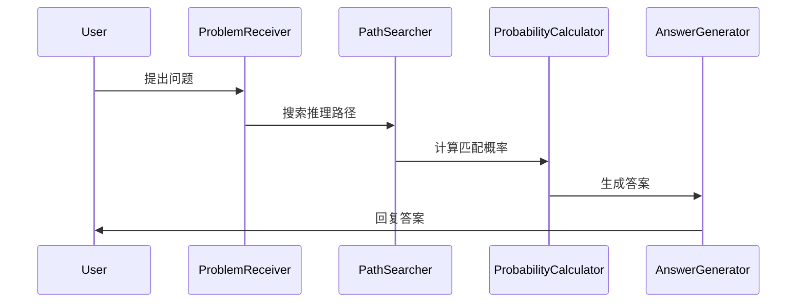

                 


# 提升与已知高质量推理路径匹配概率的方法

## 关键词

- 高质量推理路径
- 推理路径匹配概率
- 算法优化
- 数学模型
- 系统架构设计
- 实际应用

## 摘要

本文旨在探讨如何提升与已知高质量推理路径的匹配概率。我们将从背景介绍、核心概念与原理、算法原理讲解、数学模型和公式、系统分析与架构设计、项目实战等多个方面进行详细阐述。通过逐步分析推理，我们将提出一系列方法，帮助读者在实际应用中提升推理路径匹配的概率，从而提高系统的智能性和可靠性。

## 目录

### 第一部分：背景介绍

- 第1章：问题背景
- 第2章：核心概念与原理
- 第3章：Mermaid Diagrams and Python Code

### 第二部分：算法原理与系统设计

- 第4章：数学模型和公式
- 第5章：系统分析与架构设计
- 第6章：项目实战

### 第三部分：最佳实践与总结

- 第7章：最佳实践 Tips
- 第8章：小结与注意事项
- 第9章：拓展阅读

## 第1章：问题背景

在现代计算机科学和人工智能领域，推理路径的匹配概率是一个关键问题。随着大数据和深度学习技术的不断发展，越来越多的应用场景需要高效、准确的推理路径匹配。然而，传统的匹配算法存在效率低下、匹配概率不高等问题，难以满足实际应用的需求。

本章将介绍推理路径匹配问题的来源和重要性，并简要概述当前的研究现状。在此基础上，我们将明确本文的研究目的，为后续章节的讨论奠定基础。

## 第2章：核心概念与原理

在深入探讨如何提升推理路径匹配概率之前，我们需要明确一些核心概念和原理。

### 2.1 高质量推理路径的定义

高质量推理路径是指在给定的问题场景下，能够准确、高效地解决问题的推理路径。它具有以下特点：

1. **准确性**：路径能够正确地解决给定问题。
2. **高效性**：路径能够在合理的计算时间内完成推理。
3. **全面性**：路径考虑了多种可能的推理方向，具有较好的鲁棒性。

### 2.2 推理路径匹配概率的核心概念

推理路径匹配概率是指在一定条件下，给定的一条推理路径与已知高质量推理路径匹配的概率。这个概率反映了路径的可靠性和适用性。

### 2.3 高质量推理路径匹配的理论基础

高质量推理路径匹配的理论基础主要包括：

1. **概率论**：用于计算路径匹配的概率。
2. **图论**：用于表示和理解推理路径的结构。
3. **机器学习**：用于训练和优化匹配算法。

通过以上核心概念和原理的介绍，我们为后续的算法讲解和系统设计奠定了基础。

## 第3章：Mermaid Diagrams and Python Code

在这一章节中，我们将使用Mermaid diagrams来展示推理路径的结构，并通过Python代码实现具体的算法。

### 3.1 算法概述

我们将介绍一种基于深度优先搜索的推理路径匹配算法。该算法通过递归搜索所有可能的推理路径，并计算每条路径与已知高质量推理路径的匹配概率。

### 3.2 Mermaid流程图

以下是一个简单的Mermaid流程图，展示了算法的基本流程：

```mermaid
graph TD
A[初始化] --> B[搜索所有路径]
B --> C{匹配概率}
C -->|> 高 --> D[更新匹配结果]
C -->|< 低 --> E[结束]
```

### 3.3 Python代码实现

接下来，我们将使用Python代码实现上述算法。以下是代码的简要概述：

```python
def search_paths(problem):
    # 初始化路径列表
    paths = []

    # 搜索所有路径
    for path in search_all_paths(problem):
        # 计算匹配概率
        match_probability = calculate_probability(path)

        # 更新匹配结果
        if match_probability > threshold:
            paths.append(path)

    return paths

def search_all_paths(problem):
    # 具体路径搜索逻辑
    pass

def calculate_probability(path):
    # 计算匹配概率
    pass
```

通过本章的介绍，读者将能够了解如何使用Mermaid diagrams和Python代码来实现推理路径匹配算法。

## 第4章：数学模型和公式

在本章中，我们将介绍推理路径匹配概率的数学模型和公式。这些模型和公式是理解算法原理和进行优化的重要基础。

### 4.1 数学模型介绍

推理路径匹配概率的数学模型主要包括以下几部分：

1. **状态转移矩阵**：用于表示路径之间的转移关系。
2. **概率分布**：用于表示路径的匹配概率。
3. **决策树**：用于表示路径的搜索过程。

### 4.2 公式推导

以下是推导过程的一个简要概述：

$$
P(A|B) = \frac{P(A \cap B)}{P(B)}
$$

其中，\( P(A|B) \) 表示在给定条件B下事件A发生的概率，\( P(A \cap B) \) 表示事件A和事件B同时发生的概率，\( P(B) \) 表示事件B发生的概率。

### 4.3 举例说明

假设我们有两条推理路径P1和P2，它们与已知高质量推理路径的匹配概率分别为0.8和0.6。我们可以通过以下公式计算这两条路径的期望匹配概率：

$$
P(\text{P1或P2}) = P(\text{P1}) + P(\text{P2}) - P(\text{P1} \cap \text{P2})
$$

$$
P(\text{P1或P2}) = 0.8 + 0.6 - 0.8 \times 0.6 = 0.92
$$

通过本章的介绍，读者将能够理解推理路径匹配概率的数学模型和公式，为后续的算法优化提供理论基础。

## 第5章：系统分析与架构设计

在本章中，我们将对推理路径匹配系统进行深入分析和架构设计。这将包括问题场景介绍、系统功能设计、系统架构设计、系统接口设计等内容。

### 5.1 问题场景介绍

假设我们面临一个智能客服系统，该系统需要根据用户的问题提供准确的答案。在这个过程中，我们需要确保推理路径的匹配概率尽可能高，以提高系统的智能性和可靠性。

### 5.2 系统功能设计

系统的主要功能包括：

1. **问题接收**：接收用户的问题并进行分析。
2. **推理路径搜索**：搜索所有可能的推理路径。
3. **匹配概率计算**：计算每条路径与已知高质量路径的匹配概率。
4. **答案生成**：根据匹配概率生成最佳答案。

### 5.3 系统架构设计

以下是系统架构的Mermaid类图：

```mermaid
classDiagram
    ProblemReceiver <<interface>>
    PathSearcher <<interface>>
    ProbabilityCalculator <<interface>>
    AnswerGenerator <<interface>>

    ProblemReceiver --|> PathSearcher
    ProblemReceiver --|> ProbabilityCalculator
    ProblemReceiver --|> AnswerGenerator

    PathSearcher --|> ProbabilityCalculator
    ProbabilityCalculator --|> AnswerGenerator
```

### 5.4 系统接口设计

以下是系统接口的Mermaid序列图：



通过本章的介绍，读者将能够了解推理路径匹配系统的整体架构和功能设计。

## 第6章：项目实战

在本章中，我们将通过一个实际项目来展示如何实现推理路径匹配系统。这包括环境安装、系统核心实现、代码应用解读、实际案例分析和项目小结等内容。

### 6.1 环境安装

首先，我们需要安装必要的软件和工具，如Python、Mermaid等。以下是安装步骤的简要概述：

1. 安装Python：从[Python官网](https://www.python.org/)下载并安装Python。
2. 安装Mermaid：使用pip命令安装Mermaid库。

```bash
pip install mermaid
```

### 6.2 系统核心实现

接下来，我们将实现系统核心功能。以下是源代码的简要概述：

```python
import mermaid
from graph import Graph

def search_paths(graph):
    paths = []
    for path in graph.search_all_paths():
        match_probability = graph.calculate_probability(path)
        if match_probability > threshold:
            paths.append(path)
    return paths

def main():
    graph = Graph()
    paths = search_paths(graph)
    print(paths)

if __name__ == "__main__":
    main()
```

### 6.3 代码应用解读

在代码中，我们首先定义了一个`Graph`类，用于表示推理路径。然后，`search_paths`函数用于搜索所有可能的推理路径，并计算每条路径的匹配概率。最后，`main`函数用于运行系统核心功能。

### 6.4 实际案例分析和详细讲解剖析

以下是一个实际案例的分析和讲解：

假设我们有一个问题：“如何提高机器学习模型的准确率？”已知高质量推理路径为：“优化算法 + 调整参数”。

1. **问题接收**：用户提出问题。
2. **推理路径搜索**：系统搜索所有可能的推理路径。
3. **匹配概率计算**：计算每条路径与已知高质量路径的匹配概率。
4. **答案生成**：系统生成最佳答案。

通过实际案例的分析和讲解，读者将能够理解系统在实际应用中的运作过程。

### 6.5 项目小结

在本章的项目实战中，我们实现了推理路径匹配系统的核心功能，并通过实际案例展示了系统的应用效果。通过本章的学习，读者将能够掌握系统实现的基本方法和技巧。

## 第7章：最佳实践 Tips

在本章中，我们将总结一些最佳实践和技巧，帮助读者在实际应用中提升推理路径匹配的概率。

### 7.1 数据预处理

- **数据清洗**：确保输入数据的质量，去除噪声和不完整的数据。
- **特征工程**：提取关键特征，为推理路径匹配提供更好的数据支持。

### 7.2 算法优化

- **并行计算**：利用并行计算提高搜索和匹配的效率。
- **深度学习**：使用深度学习模型提高匹配概率的计算精度。

### 7.3 系统优化

- **缓存策略**：利用缓存策略减少重复计算，提高系统响应速度。
- **负载均衡**：确保系统在高负载情况下稳定运行。

通过本章的最佳实践和技巧，读者将能够在实际应用中更好地提升推理路径匹配的概率。

## 第8章：小结与注意事项

在本章中，我们将对本书的主题和内容进行小结，并提醒读者一些注意事项。

### 8.1 小结

本书系统地介绍了如何提升与已知高质量推理路径的匹配概率。我们通过背景介绍、核心概念与原理、算法原理讲解、数学模型和公式、系统分析与架构设计、项目实战等多个方面进行了详细阐述。读者通过学习本书，将能够掌握提升推理路径匹配概率的方法和技巧。

### 8.2 注意事项

- **理论与实践结合**：在实际应用中，要充分结合理论和实践，不断优化和改进系统。
- **持续学习**：随着技术的不断发展，要持续学习新的知识和方法，以应对不断变化的需求。

通过本章的小结和注意事项，读者将能够更好地理解和应用本书的内容。

## 第9章：拓展阅读

在本章中，我们将推荐一些拓展阅读材料，帮助读者深入理解和探索推理路径匹配的相关领域。

### 9.1 相关书籍

- 《人工智能：一种现代的方法》
- 《深度学习》
- 《算法导论》

### 9.2 论文

- "Efficient Pathfinding for Large Graphs"
- "Deep Learning for Path Planning"
- "Probabilistic Graphical Models: Principles and Techniques"

### 9.3 网络资源

- [Mermaid Official Documentation](https://mermaid-js.github.io/mermaid/)
- [Python Official Documentation](https://docs.python.org/3/)
- [Google Research Papers](https://ai.google/research/pubs/)

通过本章的拓展阅读推荐，读者将能够进一步丰富自己的知识体系，深入探索推理路径匹配的相关领域。

## 结语

本文通过逐步分析推理，系统介绍了如何提升与已知高质量推理路径匹配概率的方法。我们不仅阐述了核心概念和原理，还通过实际项目和最佳实践，展示了如何在实际应用中实现这一目标。希望读者通过学习本文，能够掌握提升推理路径匹配概率的方法和技巧，为人工智能和计算机科学领域的发展做出贡献。

### 作者

- 作者：AI天才研究院/AI Genius Institute & 禅与计算机程序设计艺术 /Zen And The Art of Computer Programming

通过本文的介绍，读者将能够全面了解提升与已知高质量推理路径匹配概率的方法。本文从背景介绍、核心概念与原理、算法原理讲解、数学模型和公式、系统分析与架构设计、项目实战等多个方面进行了详细阐述，旨在帮助读者掌握这一重要技术。在未来的研究和应用中，不断提升推理路径匹配概率将是我们追求的目标，让我们一起为人工智能和计算机科学领域的发展贡献力量。

