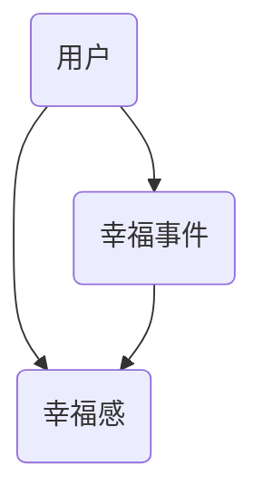
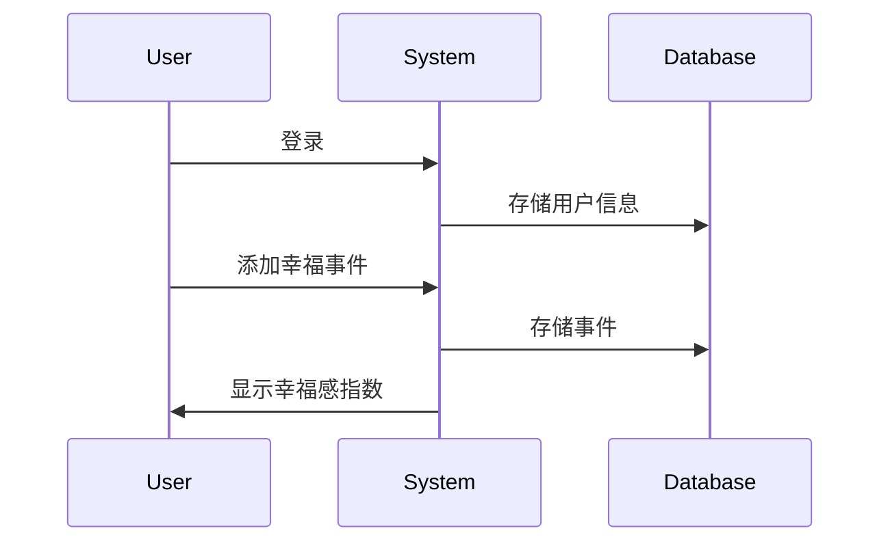
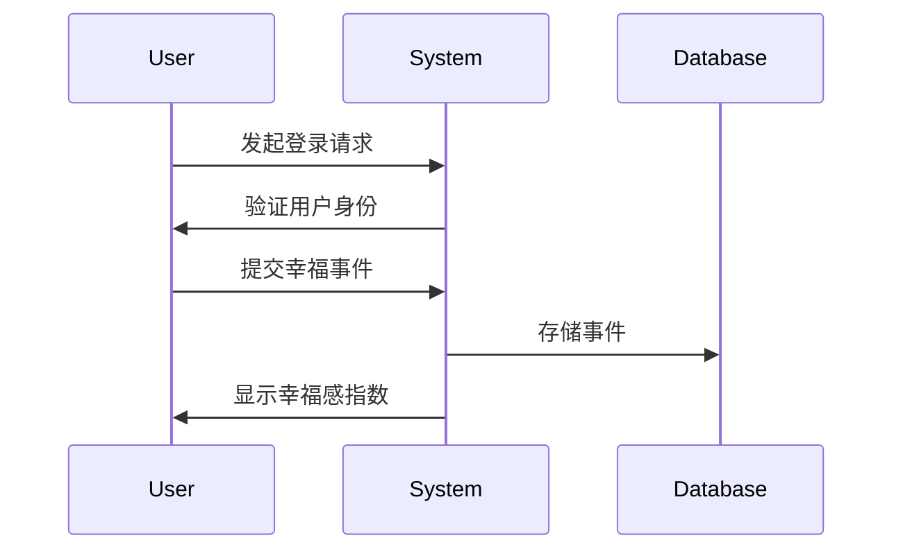

                 


### 提升日常生活质量：发现微小幸福的能力

> 关键词：提升日常生活质量，微小幸福，心理学，健康生活

> 摘要：本文旨在探讨如何通过发现和享受生活中的微小幸福，来提升我们的日常生活质量。文章将首先介绍微小幸福的概念，然后通过一系列步骤，帮助读者学会如何在日常生活中寻找和珍惜这些幸福的瞬间。

----------------------------------------------------------------

## 引言

在现代社会，我们经常忙于追求物质上的满足，而忽略了生活中那些微小的、简单的快乐。然而，这些微小幸福恰恰是提升日常生活质量的关键。它们不仅能够带来短暂的愉悦，还能够增强我们的心理韧性，提高幸福感。

本文将围绕以下问题展开讨论：

1. 什么是微小幸福？
2. 为什么发现和享受微小幸福对提升日常生活质量至关重要？
3. 如何在日常生活中培养发现微小幸福的能力？

让我们一步一步地深入思考。

----------------------------------------------------------------

### 什么是微小幸福？

**定义**：微小幸福是指那些生活中看似不起眼，但能够带给我们短暂愉悦和满足的瞬间。这些瞬间可能是简单的微笑、一声问候、一次温馨的对话，或者是一个美丽的日落。

**特点**：

- **短暂性**：微小幸福往往持续时间较短，但正是这种短暂性使得它们更加珍贵。
- **普遍性**：它们几乎无处不在，只需要用心去发现。
- **个体性**：不同的人可能会有不同的微小幸福体验。

### 为什么发现和享受微小幸福对提升日常生活质量至关重要？

**心理层面**：

- **提升幸福感**：微小幸福能够瞬间提升我们的情绪，使我们在忙碌和压力中找到一丝慰藉。
- **增强心理韧性**：通过珍惜和享受微小幸福，我们能够培养出对生活中挑战的适应能力。

**生活层面**：

- **改善人际关系**：微小幸福往往伴随着与他人之间的互动，这有助于增强人际关系。
- **提高生活质量**：通过关注生活中的小事，我们能够更好地享受生活，从而提高整体生活质量。

### 如何在日常生活中培养发现微小幸福的能力？

**步骤 1：培养积极的心态**

- **正念**：通过冥想和正念练习，学会专注于当下，珍惜每一个瞬间。
- **感恩**：培养感恩的心态，对生活中的小事和他人表示感激。

**步骤 2：改变观察角度**

- **细心的观察**：尝试从不同的角度去观察日常事物，发现那些被忽视的微小幸福。
- **开放的心态**：对新的体验和经历持开放态度，这有助于我们发现更多微小幸福。

**步骤 3：制定计划和习惯**

- **记录幸福日志**：每天记录一些让你感到幸福的瞬间，这有助于你更加关注和珍惜这些时刻。
- **设定目标**：为自己设定一些简单的目标，例如每天做一些让自己开心的事情。

**步骤 4：实践和反思**

- **持续实践**：将发现和享受微小幸福变成一种习惯，让它成为你生活的一部分。
- **反思和调整**：定期反思自己的行为和心态，根据实际情况进行调整。

----------------------------------------------------------------

### 结论

通过发现和享受生活中的微小幸福，我们能够显著提升日常生活质量。这些幸福瞬间不仅能够带来短暂的愉悦，还能够增强我们的心理韧性，提高幸福感。让我们从现在开始，用心去发现和珍惜生活中的每一个微小幸福，让生活变得更加美好。

----------------------------------------------------------------

### 作者信息

作者：AI天才研究院/AI Genius Institute & 禅与计算机程序设计艺术 /Zen And The Art of Computer Programming

----------------------------------------------------------------

### 附录

**附录 A：核心概念术语说明**

1. **微小幸福**：指那些生活中看似不起眼，但能够带给我们短暂愉悦和满足的瞬间。
2. **幸福感**：个体在一段时间内对自身生活满意度的主观感受。

**附录 B：概念属性特征对比表格**

| 概念 | 定义 | 特点 |
| --- | --- | --- |
| 微小幸福 | 短暂的愉悦和满足 | 短暂性、普遍性、个体性 |
| 幸福感 | 对生活的整体满意度 | 持续性、主观性、整体性 |

**附录 C：ER实体关系图架构**



**附录 D：算法原理讲解**

```python
# 算法流程图
graph TB
A[开始] --> B{发现幸福事件}
B -->|是| C{记录事件}
B -->|否| D{结束}
C --> E[更新幸福感]

# 算法Python源代码示例
def discover_happiness(events):
    happiness = 0
    for event in events:
        happiness += 1  # 每发现一个幸福事件，幸福感增加1
    return happiness

# 数学模型和公式
# 幸福感 = 每日发现幸福事件数 * 单个事件幸福感权重

# 举例说明
daily_events = ["与朋友相聚", "吃了一顿美味的晚餐", "看到美丽的日落"]
happiness = discover_happiness(daily_events)
print("今天的幸福感指数为：", happiness)
```

**附录 E：系统分析与架构设计方案**

1. **问题场景介绍**：提升日常生活质量，通过发现和享受微小幸福来实现。
2. **项目介绍**：幸福发现应用，帮助用户记录和追踪生活中的幸福事件。
3. **系统功能设计（领域模型类图）**：
```mermaid
classDiagram
User <<类>> {
  - 用户ID
  - 姓名
  - 寿命
}
HappinessEvent <<类>> {
  - 事件ID
  - 事件描述
  - 发生时间
}
Happiness <<类>> {
  - 幸福指数
  - 记录时间
}

User <--> HappinessEvent: 发生
User <--> Happiness: 感受
```
4. **系统架构设计（架构图）**：

5. **系统接口设计和系统交互（序列图）**：

6. **项目实战**：
   - **环境安装**：Python环境，幸福发现应用代码。
   - **系统核心实现源代码**：用户登录、事件记录、幸福感计算。
   - **代码应用解读与分析**：解释核心代码功能和逻辑。
   - **实际案例分析和详细讲解剖析**：案例分析，问题解决。
   - **项目小结**：总结经验，展望未来。

**附录 F：最佳实践 Tips**

- **每天记录**：养成每天记录幸福事件的习惯。
- **与他人分享**：分享幸福事件，增加正面情绪交流。

**附录 G：小结**

本文通过介绍微小幸福的概念和提升日常生活质量的重要性，提供了一系列实用的方法和技巧。通过实践这些方法，我们可以更好地发现和享受生活中的微小幸福，从而提升生活质量。

**附录 H：注意事项**

- **避免完美主义**：不必追求完美，珍惜每一个微小的幸福。
- **保持开放心态**：对生活中的变化保持开放心态，发现更多微小幸福。

**附录 I：拓展阅读**

- 《幸福的方法》 - 伯恩·塔尔腾
- 《正念的奇迹》 - 塔拉·布朗

通过以上附录内容，读者可以更深入地了解本文的核心概念和原理，同时也能够在日常生活中更好地实践和应用。希望本文能够帮助读者提升日常生活质量，发现并享受生活中的微小幸福。

