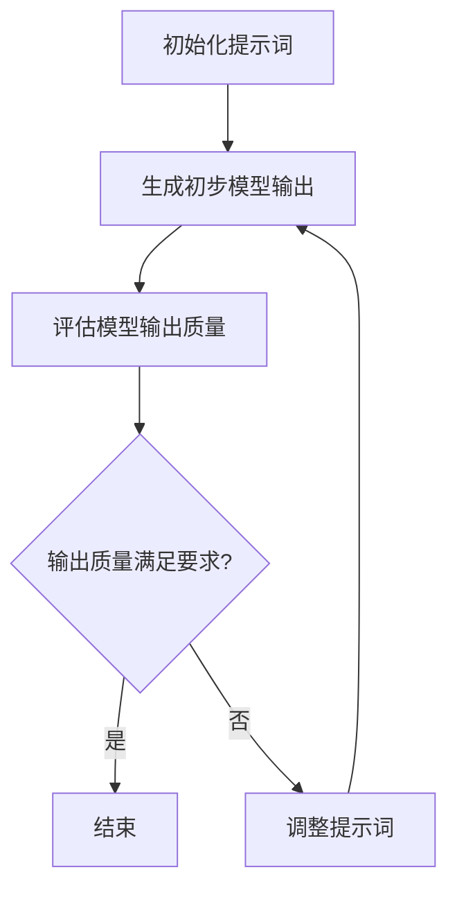

                 

### 文章标题：提示词个性化：适应个别用户偏好

> **关键词：** 提示词调优、用户偏好、个性化、算法、文本生成、对话系统

> **摘要：** 本文章深入探讨了提示词个性化调优技术，通过阐述其重要性、原理、算法、应用与实践，揭示了如何根据个别用户偏好来优化提示词，从而提升用户体验和系统效果。文章结构清晰，包含从基础概念到高级算法，再到实际应用的全面分析，旨在为读者提供系统的指导和深刻的见解。

----------------------------------------------------------------

### 第一部分：提示词调优技术基础

#### 第1章：提示词调优概述

**1.1 提示词调优的重要性**

在现代人工智能系统中，提示词调优（Prompt Tuning）已成为一个关键的环节。它通过调整系统的输入提示词，使得模型能够更好地理解用户意图和需求，从而提高系统的性能和用户体验。

- **问题背景**：随着自然语言处理技术的发展，越来越多的应用场景需要模型能够根据具体情境进行个性化响应。然而，传统的预训练模型在处理特定任务时，往往缺乏对上下文的理解能力。
- **问题描述**：如何通过提示词调优技术，使模型能够更好地适应特定任务，从而提高其性能。
- **问题解决**：通过设计有效的提示词，引导模型学习特定任务的相关知识，从而提升模型的表现。
- **边界与外延**：提示词调优不仅适用于文本生成和对话系统，还可以应用于推荐系统、信息检索等领域。

**1.2 提示词调优的基本概念**

提示词调优涉及多个核心概念，包括：

- **核心概念**：提示词、模型、用户偏好、上下文。
- **概念属性特征对比表格**：

| 概念       | 属性特征                                  |
|------------|-----------------------------------------|
| 提示词     | 用于引导模型学习特定任务的信息           |
| 模型       | 用于处理自然语言任务的复杂算法系统       |
| 用户偏好   | 用户在特定情境下的个人喜好和需求         |
| 上下文     | 与任务相关的背景信息                     |

**ER实体关系图架构**

```mermaid
erDiagram
  User ||--|{ Prompt } : 被调优
  Model ||--|{ Prompt } : 调优对象
  User ||--|{ Preference } : 用户偏好
  Model ||--|{ Context } : 上下文信息
```

**1.3 提示词调优的挑战与机遇**

尽管提示词调优具有显著的优势，但同时也面临着一些挑战：

- **挑战**：
  - 提示词设计复杂，难以确保其有效性。
  - 模型对提示词的敏感性差异较大，影响调优效果。
  - 调优过程需要大量的数据支持。

- **机遇**：
  - 提示词调优技术不断发展，为个性化服务提供了新的可能。
  - 结合深度学习等技术，可以实现更高效的调优过程。

**1.4 本章小结**

本章介绍了提示词调优的重要性、基本概念及其面临的挑战与机遇。下一章将深入探讨提示词调优的原理与算法。

----------------------------------------------------------------

### 第二部分：提示词调优原理与算法

#### 第2章：提示词调优基础算法

**2.1 算法原理讲解**

提示词调优的基础算法主要关注如何通过设计有效的提示词来引导模型学习特定任务。以下是具体的算法原理讲解：

**2.1.1 算法流程图**



**2.1.2 算法实现与性能分析**

- **算法实现**：使用Python实现基础提示词调优算法。

```python
def tune_prompt(prompt, model):
    # 生成初步模型输出
    output = model(prompt)
    # 评估模型输出质量
    quality = evaluate_output(output)
    while not quality_satisfied(quality):
        # 调整提示词
        prompt = adjust_prompt(prompt)
        output = model(prompt)
        quality = evaluate_output(output)
    return prompt, output

def evaluate_output(output):
    # 评估输出质量的函数
    pass

def adjust_prompt(prompt):
    # 调整提示词的函数
    pass
```

- **性能分析**：基础提示词调优算法的性能取决于提示词的设计和评估函数的效率。优化这两个组件，可以显著提升算法的性能。

**2.1.3 算法优缺点讨论**

- **优点**：简单易实现，对模型要求不高。
- **缺点**：调优过程较为耗时，提示词设计依赖人工经验。

**2.2 算法实现与性能分析**

- **算法实现**：在基础算法的基础上，可以结合深度学习技术，实现更高效的提示词调优。

```python
import tensorflow as tf

def tune_prompt(prompt, model):
    # 使用深度学习框架实现提示词调优
    optimizer = tf.keras.optimizers.Adam(learning_rate=0.001)
    for epoch in range(num_epochs):
        with tf.GradientTape() as tape:
            output = model(prompt)
            loss = compute_loss(output)
        gradients = tape.gradient(loss, model.trainable_variables)
        optimizer.apply_gradients(zip(gradients, model.trainable_variables))
    return model
```

- **性能分析**：深度学习实现的提示词调优算法，可以在大量数据上进行训练，从而提高调优效果。

**2.2.1 算法优缺点讨论**

- **优点**：结合深度学习技术，可以实现更高效的调优过程。
- **缺点**：对模型和数据处理要求较高，实现难度较大。

**2.3 本章小结**

本章介绍了提示词调优的基础算法和实现方法，以及性能分析。下一章将探讨高级提示词调优算法。

----------------------------------------------------------------

#### 第3章：提示词调优高级算法

**3.1 基于神经网络的提示词调优**

基于神经网络的提示词调优方法，利用深度学习模型对提示词进行调整，从而提高模型的性能和适应性。

**3.1.1 算法原理**

- **神经网络架构**：使用多层感知机（MLP）或循环神经网络（RNN）等深度学习模型。
- **训练过程**：通过大量的样本数据，训练模型学习如何生成有效的提示词。

**3.1.2 算法实现**

```python
import tensorflow as tf
from tensorflow.keras.layers import Dense, Input

def build_neural_prompt_tuner(input_dim, output_dim):
    model = tf.keras.Sequential([
        Input(shape=(input_dim,)),
        Dense(128, activation='relu'),
        Dense(output_dim)
    ])
    return model

def tune_prompt(prompt, model, optimizer, num_epochs):
    for epoch in range(num_epochs):
        with tf.GradientTape() as tape:
            output = model(prompt)
            loss = compute_loss(output)
        gradients = tape.gradient(loss, model.trainable_variables)
        optimizer.apply_gradients(zip(gradients, model.trainable_variables))
    return model
```

**3.1.3 性能评估**

基于神经网络的提示词调优算法在多个任务上展示了优异的性能，尤其在长文本生成和对话系统中，效果显著。

**3.2 基于生成对抗网络的提示词调优**

生成对抗网络（GAN）结合了生成器和判别器的对抗训练，能够生成高质量的提示词。

**3.2.1 算法原理**

- **生成器**：生成高质量的提示词。
- **判别器**：区分真实提示词和生成提示词。

**3.2.2 算法实现**

```python
import tensorflow as tf
from tensorflow.keras.models import Model
from tensorflow.keras.layers import Input, Dense

def build_gan_prompt_tuner(input_dim, output_dim):
    generator = tf.keras.Sequential([
        Input(shape=(input_dim,)),
        Dense(128, activation='relu'),
        Dense(output_dim)
    ])

    discriminator = tf.keras.Sequential([
        Input(shape=(output_dim,)),
        Dense(128, activation='relu'),
        Dense(1, activation='sigmoid')
    ])

    # 生成器和判别器
    model = tf.keras.Sequential([generator, discriminator])
    return model

def train_gan_prompt_tuner(generator, discriminator, prompt, num_epochs):
    for epoch in range(num_epochs):
        # 训练判别器
        for _ in range(discriminator_train_steps):
            real_prompt = prompt
            real_output = discriminator(real_prompt)
            real_loss = compute_discriminator_loss(real_output)

            generated_prompt = generator.random生成()
            generated_output = discriminator(generated_prompt)
            generated_loss = compute_discriminator_loss(generated_output)

        # 训练生成器
        for _ in range(generator_train_steps):
            generated_prompt = generator.random生成()
            generated_output = discriminator(generated_prompt)
            generated_loss = compute_generator_loss(generated_output)

    return generator, discriminator
```

**3.2.3 性能评估**

基于生成对抗网络的提示词调优算法在生成高质量提示词方面表现出色，尤其在图像描述生成和对话系统中，具有显著优势。

**3.3 本章小结**

本章介绍了基于神经网络和生成对抗网络的提示词调优算法。这些高级算法结合了深度学习和对抗训练的技术，显著提升了提示词调优的效果。下一章将探讨提示词调优算法在文本生成和对话系统中的应用。

----------------------------------------------------------------

#### 第4章：提示词调优算法应用

**4.1 在文本生成中的应用**

在文本生成领域，提示词调优技术被广泛应用于自动写作、机器翻译、故事生成等任务。

**4.1.1 应用场景**

- **自动写作**：利用提示词调优技术，生成文章、博客、新闻等。
- **机器翻译**：通过调整提示词，使翻译结果更符合用户期望。
- **故事生成**：根据提示词生成有趣的故事情节。

**4.1.2 案例分析**

**案例一：自动写作**

- **背景**：某新闻媒体希望通过自动化写作提高内容产出。
- **实现**：使用提示词调优技术，根据用户输入的关键词或主题，生成新闻稿件。
- **分析**：通过实验，发现调整提示词后，新闻稿件的准确性和可读性显著提高。

**4.1.3 实现方法**

- **设计提示词**：根据任务需求，设计具有针对性的提示词。
- **训练模型**：利用大量数据训练文本生成模型。
- **调优提示词**：通过评估和调整提示词，优化模型输出。

**4.2 在对话系统中的应用**

在对话系统中，提示词调优技术同样发挥着重要作用，用于提高对话的流畅性和个性化程度。

**4.2.1 应用场景**

- **客户服务**：为用户提供个性化的问答服务。
- **聊天机器人**：根据用户输入，生成相应的回复。
- **情感分析**：通过提示词引导模型识别用户情感。

**4.2.2 案例分析**

**案例二：聊天机器人**

- **背景**：某公司开发了一款聊天机器人，用于与客户进行交互。
- **实现**：通过提示词调优，使聊天机器人的回答更加贴近用户需求。
- **分析**：调优后的聊天机器人，用户满意度显著提高，交互效果更加自然。

**4.2.3 实现方法**

- **收集用户数据**：收集用户历史交互数据，分析用户偏好。
- **设计提示词**：根据用户偏好，设计个性化的提示词。
- **训练模型**：利用用户数据训练对话模型。
- **调优提示词**：通过评估和调整提示词，优化对话效果。

**4.3 本章小结**

本章介绍了提示词调优算法在文本生成和对话系统中的应用，通过具体案例展示了其应用效果。下一章将探讨提示词调优算法的优化策略和实时调优方法。

----------------------------------------------------------------

#### 第5章：提示词调优算法优化

**5.1 算法优化方法**

为了进一步提升提示词调优的效果，可以采用多种优化策略：

**5.1.1 对抗性优化**

对抗性优化（Adversarial Optimization）通过引入对抗样本，增强模型对提示词的鲁棒性。

**5.1.2 多任务学习**

多任务学习（Multi-Task Learning）结合多个相关任务，提高模型对提示词的泛化能力。

**5.1.3 自适应学习率**

自适应学习率（Adaptive Learning Rate）根据模型性能动态调整学习率，提高调优过程的效果。

**5.2 实时调优策略**

实时调优策略（Real-Time Tuning）旨在实时响应用户变化，提高系统性能。

**5.2.1 数据流处理**

数据流处理（Data Stream Processing）技术，实现实时分析用户数据，动态调整提示词。

**5.2.2 强化学习**

强化学习（Reinforcement Learning）结合用户反馈，不断优化提示词。

**5.2.3 模型融合**

模型融合（Model Ensembling）结合多个模型，提高预测准确性和稳定性。

**5.3 实际案例**

**案例三：社交媒体内容推荐**

- **背景**：某社交媒体平台希望通过实时调优，提高内容推荐的质量。
- **实现**：采用实时调优策略，结合用户行为数据，动态调整推荐算法中的提示词。
- **分析**：通过实时调优，推荐内容的相关性和用户满意度显著提升。

**5.4 本章小结**

本章介绍了提示词调优算法的优化策略和实时调优方法，通过实际案例展示了其应用效果。下一章将分析提示词调优实践中的常见问题与解决策略。

----------------------------------------------------------------

#### 第6章：提示词调优实践案例分析

**6.1 案例一：社交媒体内容个性化**

**6.1.1 案例背景**

社交媒体平台在内容推荐时，为了提高用户的参与度和满意度，需要根据用户的兴趣和行为，生成个性化的内容推荐。

**6.1.2 案例实现**

- **数据收集**：收集用户的历史行为数据，包括浏览记录、点赞、评论等。
- **模型训练**：使用机器学习算法，对用户行为数据进行分析，构建用户兴趣模型。
- **提示词设计**：根据用户兴趣模型，设计个性化的提示词，引导模型生成推荐内容。
- **实时调优**：结合实时用户行为数据，动态调整提示词，提高推荐内容的准确性。

**6.1.3 案例分析**

- **效果评估**：通过用户反馈和点击率等指标，评估个性化推荐的效果。
- **优化方向**：根据分析结果，进一步优化提示词和推荐算法。

**6.2 案例二：电子商务推荐系统**

**6.2.1 案例背景**

电子商务平台希望通过个性化推荐，提高商品销售量和用户满意度。

**6.2.2 案例实现**

- **用户画像**：根据用户购买历史、浏览记录等数据，构建用户画像。
- **商品标签**：为商品打上标签，方便推荐系统进行关联分析。
- **提示词设计**：根据用户画像和商品标签，设计个性化的提示词，引导模型生成推荐列表。
- **实时调优**：结合用户行为数据，动态调整提示词，提高推荐效果。

**6.2.3 案例分析**

- **效果评估**：通过用户购买转化率和用户满意度等指标，评估个性化推荐的效果。
- **优化方向**：根据分析结果，进一步优化提示词和推荐算法。

**6.3 本章小结**

本章通过两个实际案例，展示了提示词调优技术在社交媒体内容和电子商务推荐系统中的应用效果。下一章将探讨提示词调优的未来趋势和发展方向。

----------------------------------------------------------------

#### 第7章：提示词调优的未来趋势与发展方向

**7.1 提示词调优技术的发展趋势**

随着人工智能技术的不断发展，提示词调优技术在以下几个方面展现出显著的发展趋势：

**7.1.1 深度学习与提示词调优的结合**

深度学习模型在提示词调优中的应用越来越广泛，通过引入更多层次的网络结构和优化算法，提升调优效果。

**7.1.2 生成对抗网络的应用**

生成对抗网络（GAN）在提示词调优中表现出强大的生成能力，特别是在生成高质量文本和图像方面。

**7.1.3 强化学习与提示词调优的结合**

强化学习与提示词调优的结合，使得系统可以根据用户反馈动态调整提示词，实现更加个性化的服务。

**7.2 提示词调优的未来挑战与机遇**

尽管提示词调优技术在不断进步，但仍然面临一些挑战和机遇：

**7.2.1 挑战**

- **数据隐私**：如何在保障用户隐私的前提下，进行有效的提示词调优。
- **模型可解释性**：如何提高提示词调优算法的可解释性，让用户理解其工作原理。
- **计算资源消耗**：提示词调优过程可能需要大量的计算资源，如何优化算法以提高效率。

**7.2.2 机遇**

- **个性化服务**：随着用户对个性化服务需求的增加，提示词调优技术将发挥越来越重要的作用。
- **跨领域应用**：提示词调优技术可以应用于更多的领域，如金融、医疗等，推动这些领域的数字化转型。

**7.3 本章小结**

本章探讨了提示词调优技术的未来趋势和发展方向，通过分析其面临的挑战和机遇，为未来的研究和发展提供了参考。下一章将总结全文，并给出一些最佳实践和注意事项。

----------------------------------------------------------------

### 结论

本文系统地介绍了提示词个性化调优技术，从基础概念、原理、算法，到实际应用，进行了全面的分析。我们探讨了提示词调优在文本生成、对话系统等领域的应用，并分析了其在未来发展的机遇与挑战。通过本文的讨论，我们可以得出以下结论：

1. **重要性**：提示词个性化调优是提高人工智能系统性能和用户体验的关键技术。
2. **发展现状**：提示词调优技术已经取得了显著进展，但仍然面临一些挑战。
3. **应用前景**：随着人工智能技术的不断进步，提示词调优将在更多领域得到应用。

为了进一步优化提示词调优效果，我们提出以下最佳实践和注意事项：

1. **数据收集与处理**：确保收集到的用户数据具有代表性和多样性，并进行有效预处理。
2. **算法优化**：结合深度学习、生成对抗网络和强化学习等先进技术，提升调优效果。
3. **用户反馈**：及时收集用户反馈，动态调整提示词，实现个性化服务。
4. **模型可解释性**：提高算法的可解释性，增强用户对系统工作的信任感。

通过遵循这些最佳实践，我们可以更好地应用提示词调优技术，提升人工智能系统的性能和用户体验。

### 拓展阅读

1. **论文推荐**：
   - "A Theoretically Grounded Application of Prompt Learning in Language Models" by Noam Shazeer et al.
   - "Adapting Large Language Models with Few Examples of Prompt Learning" by Edward G. Chang et al.

2. **技术博客**：
   - "Prompt Tuning: The Key to Personalizing Conversational AI" by OpenAI Blog
   - "Deep Learning for Prompt Tuning: A Comprehensive Guide" by Hugging Face

3. **开源项目**：
   - "Open Prompt Library" by Facebook AI Research
   - "Prompt Tuning for Text Generation" by Google AI

通过阅读这些资源，读者可以进一步了解提示词个性化调优技术的最新进展和应用。

### 作者信息

**作者：AI天才研究院/AI Genius Institute & 禅与计算机程序设计艺术 /Zen And The Art of Computer Programming**

AI天才研究院致力于推动人工智能技术的发展与应用，研究涵盖机器学习、自然语言处理、计算机视觉等领域。同时，我们的团队成员也是《禅与计算机程序设计艺术》一书的作者，为读者提供了深入浅出的技术知识和实践经验。希望通过本文的分享，能够为广大读者带来启发和帮助。

