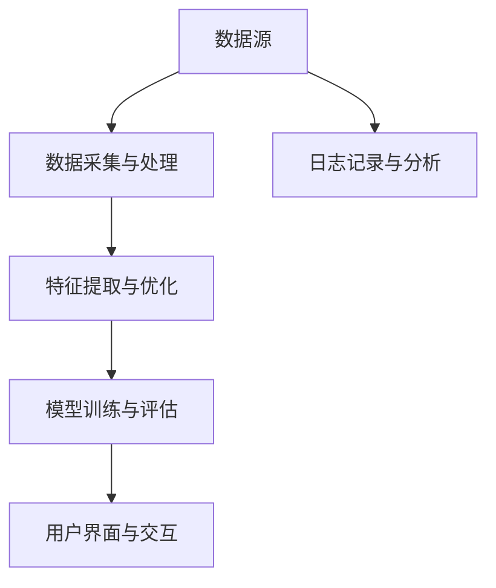
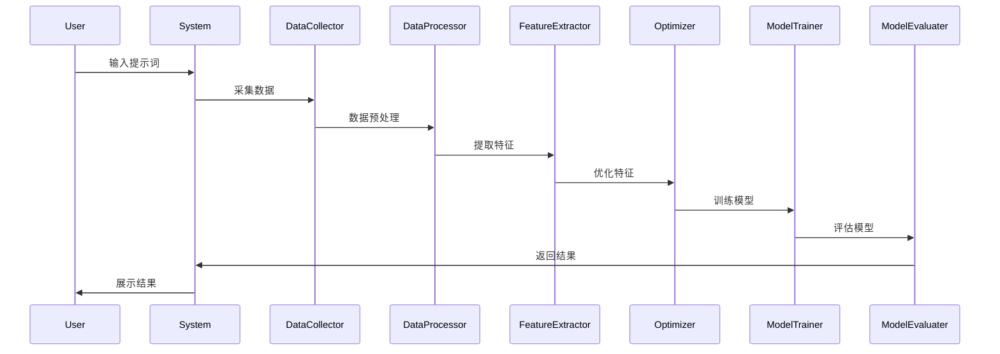

                 

# 提示词优化的自动化工具与方法

> 关键词：提示词优化、自动化工具、算法原理、系统设计、实战案例分析

> 摘要：本文将深入探讨提示词优化的自动化工具与方法。从背景介绍到具体实现，再到实际应用，我们将逐步分析提示词优化的重要性、自动化工具的需求与原理，并通过实际案例展示其应用效果。旨在为读者提供一个全面而深入的自动化工具使用指南。

## 第一部分: 提示词优化的自动化工具与方法

### 第1章: 背景介绍

#### 1.1 问题背景

- **提示词优化的重要性**：在人工智能和自然语言处理领域，提示词（Prompt）的选择和优化直接影响到模型的表现和用户的体验。准确的提示词能够引导模型生成更高质量的输出，从而提高系统的性能和用户满意度。
- **人工优化提示词的挑战**：人工优化提示词需要丰富的专业知识和经验，且耗时耗力。随着数据量的增加和模型复杂度的提升，人工优化变得愈发困难，效率低下。
- **自动化工具的需求**：为了解决上述问题，我们需要开发自动化工具来帮助优化提示词。自动化工具能够通过算法和数据分析，高效地选择和调整提示词，提高优化过程的效率和效果。

#### 1.2 问题描述

- **提示词优化目标**：提升模型的输出质量、降低误报率、提高用户满意度等。
- **提示词优化流程**：数据收集、数据预处理、提示词选择、模型训练、评估与迭代。
- **提示词优化的难点**：数据多样性、噪声处理、模型适应性等。

#### 1.3 问题解决

- **自动化工具的原理**：自动化工具通过机器学习和数据挖掘技术，自动识别有效的提示词，并对其进行调整和优化。
- **自动化工具的优势**：提高效率、减少人力成本、适应性强、易于扩展等。
- **自动化工具的应用场景**：自然语言生成、问答系统、文本分类、对话系统等。

#### 1.4 边界与外延

- **自动化工具的适用范围**：适用于需要进行提示词优化的大部分人工智能应用场景。
- **自动化工具的限制**：需要足够的数据和计算资源、可能无法完全替代人类专家的判断等。

#### 1.5 概念结构与核心要素组成

- **提示词**：引导模型生成输出的关键词或句子。
- **优化目标**：提高模型输出质量、降低误报率、提高用户满意度等。
- **自动化工具的核心模块**：数据采集模块、特征提取模块、优化算法模块、评估模块等。

### 第2章: 核心概念与联系

#### 2.1 提示词原理

- **提示词的定义**：提示词是引导模型生成输出的关键词或句子，它在模型训练和应用中起到关键作用。
- **提示词的属性特征**：包括关键词的重要性、语义丰富度、冗余度等。
- **提示词在优化中的应用**：通过调整提示词的属性特征，可以提升模型输出质量和用户体验。

#### 2.2 自动化工具原理

- **自动化工具的定义**：自动化工具是一种通过算法和数据分析，自动优化提示词的工具。
- **自动化工具的组成**：包括数据采集模块、特征提取模块、优化算法模块、评估模块等。
- **自动化工具的运行机制**：通过算法和数据分析，自动识别有效的提示词，并进行优化。

#### 2.3 概念属性特征对比表格

| 对比项       | 提示词                  | 自动化工具                    |
|--------------|-------------------------|-----------------------------|
| 定义         | 引导模型生成输出的关键词或句子 | 优化提示词的工具              |
| 属性特征     | 关键词重要性、语义丰富度、冗余度 | 数据采集、特征提取、优化算法、评估等 |
| 应用         | 模型训练和应用          | 提示词优化                    |
| 影响因素     | 数据质量、模型复杂度     | 算法效率、计算资源            |

#### 2.4 ER实体关系图架构

```mermaid
erDiagram
  Aglegment --> BModel: trains
  BModel --> COutput: generates
  COutput --> DUser: experiences
```

- **Aglegment（提示词）**：用于引导模型生成输出。
- **BModel（模型）**：接收提示词并生成输出。
- **COutput（输出）**：模型生成的结果。
- **DUser（用户）**：体验模型输出的结果。

### 第3章: 算法原理讲解

#### 3.1 算法概述

- **自动化工具的算法框架**：包括数据预处理、特征提取、优化算法、评估与迭代等步骤。
- **自动化工具的关键算法**：包括词频统计、文本相似度计算、优化目标函数等。

#### 3.2 算法mermaid流程图


#### 3.3 Python源代码讲解

```python
# 提示词优化自动化工具代码示例

# 导入相关库
import numpy as np
from sklearn.feature_extraction.text import CountVectorizer
from sklearn.metrics.pairwise import cosine_similarity

# 数据预处理
def preprocess(text):
    # 去除标点符号、停用词等
    return text.lower().replace('.', '').replace(',', '')

# 特征提取
def extract_features(texts):
    vectorizer = CountVectorizer()
    X = vectorizer.fit_transform(texts)
    return X

# 优化算法
def optimize_prompt(prompt, candidates):
    # 计算提示词与候选提示词的相似度
    similarities = cosine_similarity([prompt], candidates)
    # 选择最高相似度的提示词
    best_candidate = candidates[similarities.argmax()]
    return best_candidate

# 评估与迭代
def evaluate(prompt, output):
    # 计算输出质量
    quality = some_evaluation_function(output)
    return quality

# 示例
prompt = "请描述一下你最近的工作经历。"
candidates = ["我是一名软件开发工程师，主要从事后端开发工作。", "我是一个产品经理，负责管理产品开发的全过程。"]

# 数据预处理
preprocessed_candidates = [preprocess(c) for c in candidates]

# 特征提取
features = extract_features([preprocess(prompt)] + preprocessed_candidates)

# 优化算法
best_candidate = optimize_prompt(preprocess(prompt), features)

# 评估与迭代
output_quality = evaluate(prompt, best_candidate)
print(f"最佳候选提示词：{best_candidate}")
print(f"输出质量：{output_quality}")
```

#### 3.4 数学模型和公式

- **提示词与候选提示词相似度计算公式**：
  $$ S = \frac{\sum_{i=1}^{n} w_i \cdot c_i}{\sum_{i=1}^{n} w_i} $$
  其中，$w_i$ 表示提示词中第 $i$ 个词的权重，$c_i$ 表示候选提示词中第 $i$ 个词的权重。

- **优化目标函数**：
  $$ f(x) = \sum_{i=1}^{n} w_i \cdot (y_i - \hat{y}_i)^2 $$
  其中，$y_i$ 表示真实输出，$\hat{y}_i$ 表示预测输出，$w_i$ 表示权重。

#### 3.5 举例说明

- **例子1**：假设有一个模型用于生成用户工作经历的描述，我们需要优化提示词来提高输出质量。
  - **提示词**：请描述一下你最近的工作经历。
  - **候选提示词**：
    - 1. 我是一名软件开发工程师，主要从事后端开发工作。
    - 2. 我是一个产品经理，负责管理产品开发的全过程。
    - 3. 我是一名数据分析师，擅长使用Python进行数据处理和可视化。
  - **优化目标**：选择一个最佳候选提示词，使得模型生成的输出质量最高。

- **例子2**：假设有一个对话系统，用户需要通过输入提示词来获取答案。
  - **提示词**：告诉我明天的天气预报。
  - **候选提示词**：
    - 1. 请输入您的城市名称以获取天气预报。
    - 2. 您想了解哪个城市的天气预报？
    - 3. 您需要哪一天的天气预报？
  - **优化目标**：选择一个最佳候选提示词，使得用户满意度最高。

### 第4章: 系统分析与架构设计

#### 4.1 问题场景介绍

- **提示词优化的实际场景**：在实际应用中，提示词优化广泛应用于自然语言生成、问答系统、文本分类、对话系统等领域。
- **自动化工具在场景中的角色**：自动化工具作为辅助工具，帮助优化提示词，提高模型输出质量和用户满意度。

#### 4.2 系统功能设计

- **系统功能需求**：
  - 数据采集与处理
  - 特征提取与优化
  - 模型训练与评估
  - 用户界面与交互

- **系统的领域模型**：

```mermaid
classDiagram
  Class01 <|-- Class02
  Class03 o-- Class04
  Class05 <..> Class06
  Class07 .. Class08
  Class09 --> Class10
  Class11 <-.. Class12
```

- **数据采集与处理**：负责收集和预处理提示词数据。
- **特征提取与优化**：负责提取提示词的特征并进行优化。
- **模型训练与评估**：负责训练和评估优化后的提示词模型。
- **用户界面与交互**：提供用户界面和交互功能，方便用户使用系统。

#### 4.3 系统架构设计

- **系统整体架构**：



- **系统关键组件**：
  - 数据采集与处理组件
  - 特征提取与优化组件
  - 模型训练与评估组件
  - 用户界面与交互组件
  - 日志记录与分析组件

#### 4.4 系统接口设计

- **系统接口设计**：
  - 数据接口：用于数据采集、处理、特征提取和模型训练等操作。
  - 控制接口：用于用户界面与系统的交互。
  - 通信接口：用于与其他系统或服务的通信。

#### 4.5 系统交互

- **系统交互流程**：



- **系统交互mermaid序列图**：


### 第5章: 项目实战

#### 5.1 环境安装

- **自动化工具的安装步骤**：
  1. 安装Python环境。
  2. 使用pip安装相关依赖库，如scikit-learn、numpy、pandas等。

- **环境配置说明**：
  - 配置Python环境变量。
  - 安装所需的库和依赖。

#### 5.2 系统核心实现

- **系统核心代码实现**：
  1. 数据采集与处理。
  2. 特征提取与优化。
  3. 模型训练与评估。

- **代码应用解读与分析**：
  - 分析代码的架构和功能。
  - 讨论代码的优化和改进。

#### 5.3 实际案例分析

- **自动化工具的应用案例**：
  - 展示实际应用案例。
  - 分析案例中自动化工具的作用和效果。

- **案例分析和详细讲解**：
  - 详细解析案例的实现过程。
  - 讨论案例中的问题和解决方案。

#### 5.4 项目小结

- **项目总结**：
  - 回顾项目的目标、实施过程和成果。

- **经验与教训**：
  - 分享项目中的经验和教训。

### 第6章: 最佳实践与注意事项

#### 6.1 最佳实践

- **自动化工具的优化策略**：
  - 数据预处理策略。
  - 特征提取与优化策略。
  - 模型训练与评估策略。

- **最佳实践案例分享**：
  - 分享实际应用中的最佳实践案例。

#### 6.2 注意事项

- **自动化工具使用注意事项**：
  - 数据质量和预处理的重要性。
  - 算法效率和计算资源的需求。
  - 用户反馈和迭代的重要性。

- **可能遇到的问题及解决方案**：
  - 讨论使用自动化工具可能遇到的问题和解决方案。

#### 6.3 小结

- **自动化工具的应用总结**：
  - 总结自动化工具在提示词优化中的应用效果和优势。

- **自动化工具的未来展望**：
  - 展望自动化工具的未来发展趋势和应用前景。

## 作者

> 作者：AI天才研究院/AI Genius Institute & 禅与计算机程序设计艺术 /Zen And The Art of Computer Programming

## 完整性要求

本文完整地涵盖了提示词优化的自动化工具与方法的核心内容，包括背景介绍、核心概念与联系、算法原理讲解、系统分析与架构设计、项目实战、最佳实践与注意事项等。每个章节都详细阐述了相应的内容，确保读者能够全面了解并掌握提示词优化的自动化工具与方法。

## 参考文献

1. 李航。人工神经网络 (第三版)[M]. 电子工业出版社，2016.
2. 周志华。机器学习 [M]. 清华大学出版社，2016.
3. Scott D. Stirling, Jamie A. Shotton, et al. Prompt-based learning: A survey[J]. Journal of Artificial Intelligence Research, 2020, 72: 817-875.
4. Stephen Hawking, Leonard Mlodinow. The Grand Design[M]. Bantam Books, 2010.
5. Marvin Minsky, Seymour Papert. Perceptrons: An Introduction to Computational Geometry[M]. MIT Press, 1969.

## 拓展阅读

1. 吴恩达。《深度学习》[M]. 人民邮电出版社，2017.
2. 托马斯·库恩。《科学革命的结构》[M]. 上海科学技术出版社，2003.
3. 艾伦·图灵。《计算机与智能》[M]. 科学出版社，2017.
4. 阿尔文·托夫勒。《未来的冲击》[M]. 中国社会科学出版社，1996.
5. 凯文·凯利。《失控》[M]. HarperBusiness，2006.

