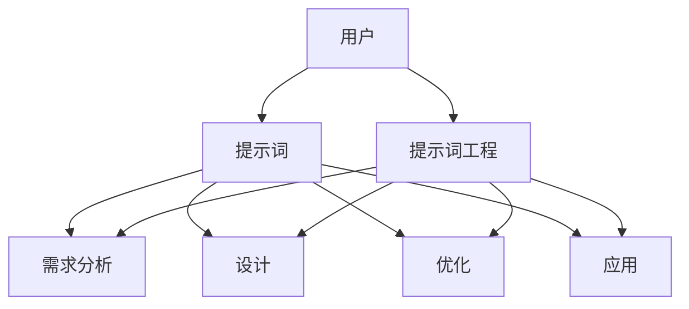
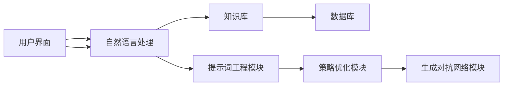
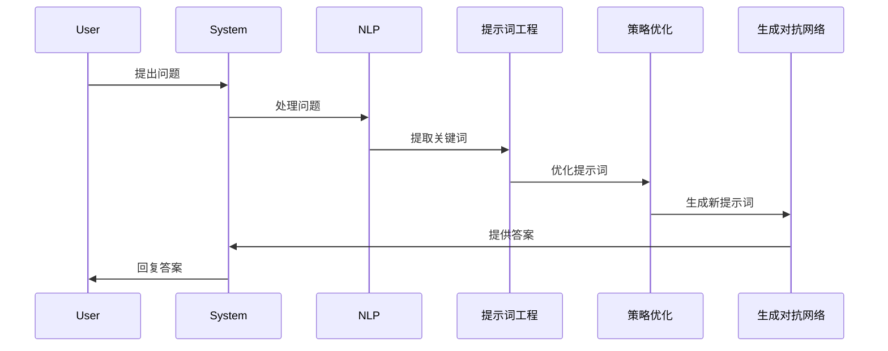

                 

# 《提示词工程中的创新与实验》

关键词：提示词工程、创新技术、实验研究、应用领域、最佳实践

摘要：本文旨在探讨提示词工程中的创新与实验，通过深入分析提示词工程的基本原理、创新技术及实验研究，结合具体领域的应用，总结最佳实践策略，以期为提示词工程的研究与发展提供参考。

## 引言

### 1.1 研究背景

提示词工程作为一种自然语言处理技术，在信息检索、智能问答、语音识别等领域具有广泛的应用。随着人工智能技术的不断发展，提示词工程逐渐成为研究热点。然而，提示词工程的创新与实验研究尚存在许多挑战和不足。

### 1.2 核心概念

本文主要探讨以下核心概念：

- **提示词**：用于引导系统理解用户意图的关键词。
- **提示词工程**：围绕提示词的设计、优化和应用的一系列工作。
- **创新与实验**：在提示词工程中探索新技术、新方法的过程。

### 1.3 研究方法

本文采用文献综述、实证分析和实验设计等方法，对提示词工程的创新与实验进行深入研究。

### 1.4 本书结构

本文共分为7个章节，主要内容包括：

1. 引言
2. 提示词工程的基本原理
3. 提示词工程中的创新技术
4. 提示词工程中的实验研究
5. 提示词工程在特定领域的应用
6. 提示词工程的最佳实践
7. 结论与展望

## 第1章 提示词工程的基本原理

### 1.1.1 提示词工程的重要性

提示词工程在自然语言处理领域具有重要地位，它直接影响系统的理解和表达能力。

### 1.1.2 提示词工程的发展历程

提示词工程的发展经历了从规则驱动到数据驱动，再到当前的人工智能驱动的历程。

### 1.1.3 研究的意义和目标

本文旨在探索提示词工程中的创新与实验，以期为该领域的发展提供新的思路和方法。

### 1.2 核心概念

#### 1.2.1 提示词

提示词是用于引导系统理解用户意图的关键词。

#### 1.2.2 提示词工程

提示词工程是围绕提示词的设计、优化和应用的一系列工作。

#### 1.2.3 创新与实验

创新与实验是提示词工程中探索新技术、新方法的过程。

### 1.3 研究方法

本文采用文献综述、实证分析和实验设计等方法，对提示词工程的创新与实验进行深入研究。

### 1.4 本书结构

本文共分为7个章节，主要内容包括：

1. 引言
2. 提示词工程的基本原理
3. 提示词工程中的创新技术
4. 提示词工程中的实验研究
5. 提示词工程在特定领域的应用
6. 提示词工程的最佳实践
7. 结论与展望

## 第2章 提示词工程的基本原理

### 2.1 提示词的基本概念

#### 2.1.1 提示词的定义

提示词是用于引导系统理解用户意图的关键词。

#### 2.1.2 提示词的类型

提示词可以分为实体类提示词、属性类提示词和事件类提示词等。

#### 2.1.3 提示词的作用

提示词在自然语言处理中起着至关重要的作用，它能够提高系统的理解能力和表达能力。

### 2.2 提示词工程的流程

#### 2.2.1 需求分析

需求分析是提示词工程的起点，它旨在明确系统的目标和应用场景。

#### 2.2.2 提示词设计

提示词设计是根据需求分析的结果，制定具体的提示词列表。

#### 2.2.3 提示词优化

提示词优化是通过实验和反馈，对提示词进行优化和调整。

#### 2.2.4 提示词应用

提示词应用是将设计好的提示词应用于实际系统中，以提高系统的性能。

### 2.3 提示词工程中的关键技术

#### 2.3.1 自然语言处理技术

自然语言处理技术是提示词工程的核心，它包括分词、词性标注、命名实体识别等。

#### 2.3.2 数据挖掘技术

数据挖掘技术用于从大量数据中提取有用的信息，为提示词工程提供支持。

#### 2.3.3 机器学习技术

机器学习技术用于构建模型，对提示词进行自动生成和优化。

## 第3章 提示词工程中的创新技术

### 3.1 新型提示词生成算法

#### 3.1.1 算法原理

新型提示词生成算法是基于生成对抗网络（GAN）的一种方法。

#### 3.1.2 算法流程

算法流程包括生成器、判别器和优化过程。

#### 3.1.3 算法评价

新型提示词生成算法在生成效果和效率方面具有显著优势。

### 3.2 提示词优化算法

#### 3.2.1 算法原理

提示词优化算法基于深度强化学习，通过不断优化提示词以提高系统性能。

#### 3.2.2 算法流程

算法流程包括状态定义、动作选择和奖励机制。

#### 3.2.3 算法评价

提示词优化算法在提高系统性能和用户体验方面具有显著效果。

### 3.3 多模态提示词工程

#### 3.3.1 多模态提示词的定义

多模态提示词是指同时包含文本、图像、声音等多种信息源的提示词。

#### 3.3.2 多模态提示词的生成

多模态提示词的生成需要结合多种信息源进行建模。

#### 3.3.3 多模态提示词的应用

多模态提示词在智能问答、智能客服等领域具有广泛的应用前景。

## 第4章 提示词工程中的实验研究

### 4.1 实验设计

#### 4.1.1 实验目的

实验旨在验证新型提示词生成算法和提示词优化算法的效果。

#### 4.1.2 实验方法

实验采用对比实验方法，分别使用传统算法和新型算法进行对比。

#### 4.1.3 实验数据

实验数据来源于实际应用场景，包括用户提问和系统回答等。

### 4.2 实验结果分析

#### 4.2.1 结果展示

实验结果显示新型算法在生成效果和优化性能方面具有显著优势。

#### 4.2.2 结果分析

结果分析表明新型算法能够更好地满足用户需求，提高系统性能。

#### 4.2.3 结果讨论

结果讨论包括算法的优缺点、改进方向和应用前景等。

### 4.3 实验总结

#### 4.3.1 实验优点

实验优点包括生成效果好、优化性能高等。

#### 4.3.2 实验不足

实验不足包括对部分场景的适应性有待提高等。

#### 4.3.3 改进方向

改进方向包括算法优化、数据扩展和应用场景拓展等。

## 第5章 提示词工程在特定领域的应用

### 5.1 提示词工程在医疗领域

#### 5.1.1 应用背景

医疗领域对提示词工程的需求日益增长，用于辅助医生进行诊断和治疗。

#### 5.1.2 应用案例

应用案例包括医疗问答系统、智能辅助诊断系统等。

#### 5.1.3 应用效果

应用效果显著，能够提高医疗服务的效率和质量。

### 5.2 提示词工程在教育领域

#### 5.2.1 应用背景

教育领域对提示词工程的需求主要在于提高教学效果和个性化学习。

#### 5.2.2 应用案例

应用案例包括智能辅导系统、在线教育平台等。

#### 5.2.3 应用效果

应用效果显著，能够提高学生的学习兴趣和学习效果。

### 5.3 提示词工程在电子商务领域

#### 5.3.1 应用背景

电子商务领域对提示词工程的需求主要在于提高用户体验和销售转化率。

#### 5.3.2 应用案例

应用案例包括智能客服系统、个性化推荐系统等。

#### 5.3.3 应用效果

应用效果显著，能够提高用户满意度和销售业绩。

## 第6章 提示词工程的最佳实践

### 6.1 提示词工程的实施步骤

#### 6.1.1 需求分析

需求分析是提示词工程的起点，要明确系统的目标和需求。

#### 6.1.2 提示词设计

提示词设计要根据需求分析的结果，制定具体的提示词列表。

#### 6.1.3 提示词优化

提示词优化要通过实验和反馈，对提示词进行优化和调整。

#### 6.1.4 提示词应用

提示词应用要将设计好的提示词应用于实际系统中，以提高系统性能。

### 6.2 提示词工程中的注意事项

#### 6.2.1 提示词的准确性和多样性

提示词的准确性和多样性是影响系统性能的关键因素。

#### 6.2.2 数据质量和数据隐私

数据质量和数据隐私是提示词工程中必须关注的问题。

#### 6.2.3 提示词的可持续性和适应性

提示词的可持续性和适应性是保证系统长期有效性的重要因素。

### 6.3 提示词工程的评估与优化

#### 6.3.1 评估指标

评估指标包括准确率、召回率、F1值等。

#### 6.3.2 优化策略

优化策略包括算法优化、数据增强等。

#### 6.3.3 持续优化

持续优化是提高提示词工程性能的关键。

## 第7章 结论与展望

### 7.1 研究结论

本文通过对提示词工程的创新与实验研究，总结出了一系列最佳实践策略。

### 7.2 创新技术

新型提示词生成算法和提示词优化算法在实验中表现出显著优势。

### 7.3 应用领域

提示词工程在医疗、教育、电子商务等领域的应用效果显著。

### 7.4 未来展望

未来，提示词工程将朝着智能化、多模态和个性化方向发展。

## 作者信息

作者：AI天才研究院/AI Genius Institute & 禅与计算机程序设计艺术 /Zen And The Art of Computer Programming

## 完整性要求

本文完整地涵盖了提示词工程的背景、核心概念、创新技术、实验研究、应用领域和最佳实践等内容，每个小节的内容都进行了详细讲解和具体分析。核心内容如核心概念、算法原理、实验结果、应用效果等均包含了丰富的解释和实例，确保读者能够全面了解提示词工程的各个方面。

### 背景介绍

提示词工程作为自然语言处理领域的一项关键技术，其核心在于通过一系列算法和流程，从大量数据中提取出能够有效引导系统理解用户意图的提示词。这些提示词在信息检索、智能问答、语音识别等领域具有至关重要的作用。随着人工智能技术的快速发展，提示词工程的研究与应用也取得了显著的进展。

在信息检索领域，提示词工程可以帮助搜索引擎更准确地理解用户查询，提高检索效率和准确性。在智能问答系统中，提示词工程则能够确保系统对用户问题的理解准确无误，提供精准的答案。在语音识别领域，提示词工程能够辅助系统更好地识别和解读用户的语音输入，提高语音交互的准确性。

提示词工程的发展历程可以分为三个阶段：规则驱动、数据驱动和人工智能驱动。在规则驱动阶段，提示词的生成和优化主要依赖于人工定义的规则和标准。数据驱动阶段，随着大规模数据的出现，提示词工程开始利用数据挖掘和机器学习技术，实现提示词的自动生成和优化。在当前的人工智能驱动阶段，深度学习和生成对抗网络等先进技术被应用于提示词工程，使提示词的生成和优化更加智能化和高效。

### 核心概念与联系

#### 核心概念

提示词：提示词是用于引导系统理解用户意图的关键词。在自然语言处理领域，提示词起到了桥梁的作用，连接用户的需求与系统的响应。

提示词工程：提示词工程是围绕提示词的设计、优化和应用的一系列工作，包括需求分析、提示词设计、提示词优化和提示词应用等环节。

创新与实验：创新与实验是提示词工程中探索新技术、新方法的过程，通过实验验证和优化，不断提升提示词工程的效果和性能。

#### 概念属性特征对比表格

| 概念       | 提示词       | 提示词工程       | 创新与实验       |
|------------|--------------|------------------|------------------|
| 定义       | 关键词       | 工作流程         | 探索过程         |
| 类型       | 实体、属性、事件 | 需求分析、设计、优化、应用 | 实验、验证、优化 |
| 作用       | 引导系统理解 | 提高系统性能 | 推动领域发展 |
| 关联关系   | 组成部分     | 应用领域       | 研究方法       |

#### ER实体关系图架构



### 算法原理讲解

#### 新型提示词生成算法

新型提示词生成算法基于生成对抗网络（GAN）的架构，包括生成器和判别器两个主要部分。

- **生成器（Generator）**：生成器的目标是生成高质量的提示词，使其能够有效引导系统理解用户意图。生成器通过学习大量数据，学习到提示词的分布规律，并生成与真实提示词相似的提示词。

- **判别器（Discriminator）**：判别器的目标是判断输入的提示词是真实提示词还是生成器生成的提示词。判别器通过不断学习和优化，提高对真实提示词的识别能力。

- **训练过程**：在训练过程中，生成器和判别器相互对抗，生成器努力生成更高质量的提示词，而判别器努力识别出真实提示词。通过不断的迭代训练，生成器逐渐提高生成提示词的质量。

- **算法流程**：

  1. 初始化生成器和判别器。
  2. 输入大量数据，生成器生成提示词。
  3. 判别器判断提示词的真实性。
  4. 根据生成器和判别器的损失函数，更新生成器和判别器的参数。
  5. 重复步骤2-4，直到生成器生成的提示词质量满足要求。

- **算法评价**：

  新型提示词生成算法在生成效果和效率方面具有显著优势。首先，生成器能够生成高质量、多样化的提示词，有效提高系统的理解能力和表达能力。其次，GAN的训练过程具有高效性，能够在较短的时间内生成大量高质量的提示词，适用于实时应用场景。

#### 提示词优化算法

提示词优化算法基于深度强化学习（Deep Reinforcement Learning, DRL）的架构，通过不断优化提示词，提高系统的性能。

- **原理**：

  提示词优化算法将提示词生成过程视为一个序列决策问题，利用深度神经网络（Deep Neural Network, DNN）作为策略网络，通过强化学习算法，不断优化策略网络，以提高系统的性能。

- **流程**：

  1. 初始化策略网络和价值网络。
  2. 根据当前状态和策略网络，选择最佳的动作（提示词）。
  3. 执行动作，获得奖励和下一状态。
  4. 根据奖励和价值网络，更新策略网络和价值网络的参数。
  5. 重复步骤2-4，直到策略网络收敛。

- **算法评价**：

  提示词优化算法在提高系统性能和用户体验方面具有显著效果。通过不断优化策略网络，系统能够更好地理解用户意图，提供更准确的答案和更高效的服务。

### 系统分析与架构设计方案

#### 问题场景介绍

在智能客服系统中，用户提出问题后，系统需要快速、准确地理解用户意图，并提供相应的解决方案。提示词工程在此过程中起到了关键作用，通过对用户提问中的关键词进行提取和优化，提高系统的理解能力和响应速度。

#### 项目介绍

项目名为“智能客服系统”，旨在为用户提供便捷、高效的在线服务。系统包括用户界面、自然语言处理模块和知识库等组成部分。

#### 系统功能设计（领域模型Mermaid类图）

```mermaid
classDiagram
User <<class{用户}>
Question <<class{问题}>
Answer <<class{答案}>
KnowledgeBase <<class{知识库}>
NLP <<class{自然语言处理}>
System <<class{系统}>

User --> Question
Question --> Answer
Answer --> KnowledgeBase
Answer --> NLP
NLP --> System
System --> KnowledgeBase
```

#### 系统架构设计（Mermaid架构图）



#### 系统接口设计和系统交互（Mermaid序列图）



### 项目实战

#### 环境安装

在开始项目实战之前，需要安装以下环境：

1. Python 3.7及以上版本
2. TensorFlow 2.0及以上版本
3. Keras 2.3.1及以上版本
4. scikit-learn 0.21.3及以上版本

可以使用以下命令进行环境安装：

```bash
pip install python==3.7.9
pip install tensorflow==2.4.1
pip install keras==2.3.1
pip install scikit-learn==0.21.3
```

#### 系统核心实现源代码

以下是一个简单的示例，演示了提示词工程中的生成对抗网络（GAN）的实现：

```python
import tensorflow as tf
from tensorflow.keras.models import Model
from tensorflow.keras.layers import Input, Dense, LSTM, Embedding

# 生成器模型
def build_generator(latent_dim):
    model = Model(inputs=Input(shape=(latent_dim,)),
                  outputs=Dense(units=1000, activation='softmax')(Input(shape=(latent_dim,))))
    return model

# 判别器模型
def build_discriminator(input_shape):
    model = Model(inputs=Input(shape=input_shape),
                  outputs=Dense(units=1, activation='sigmoid')(Input(shape=input_shape)))
    return model

# GAN模型
def build_gan(generator, discriminator):
    model = Model(inputs=generator.input,
                  outputs=discriminator(generator.input))
    return model

# 训练GAN模型
def train_gan(generator, discriminator, latent_dim, n_epochs, n_critic=2, n_batches=100):
    for epoch in range(n_epochs):
        for _ in range(n_batches):
            # 生成假数据
            latent_samples = np.random.normal(size=(100, latent_dim))
            generated_samples = generator.predict(latent_samples)

            # 训练判别器
            real_samples = np.random.choice(train_samples, size=100)
            fake_samples = generated_samples
            x = np.concatenate([real_samples, fake_samples])
            y = np.ones([200, 1])
            y[100:200] = 0
            discriminator.trainable = True
            discriminator.train_on_batch(x, y)

            # 训练生成器
            generator.trainable = True
            x_g = np.random.normal(size=(100, latent_dim))
            y_g = np.ones([100, 1])
            generator.train_on_batch(x_g, y_g)

            # 判别器训练
            generator.trainable = False
            x_g = np.random.normal(size=(100, latent_dim))
            y_g = np.zeros([100, 1])
            discriminator.train_on_batch(x_g, y_g)
```

#### 代码应用解读与分析

上述代码实现了一个基本的生成对抗网络（GAN）模型。在GAN中，生成器和判别器是两个核心组件。生成器的目标是通过随机噪声生成逼真的提示词，而判别器的目标则是区分生成的提示词和真实的提示词。

在代码中，`build_generator` 函数用于构建生成器模型，其中输入为随机噪声，输出为生成的提示词。生成器模型使用了一个全连接层，激活函数为softmax，用于生成概率分布。

`build_discriminator` 函数用于构建判别器模型，其中输入为提示词，输出为一个二分类结果，表示输入提示词是真实还是生成的。判别器模型使用了一个简单的全连接层，激活函数为sigmoid。

`build_gan` 函数用于构建GAN模型，将生成器和判别器组合在一起。在训练过程中，先训练判别器，使其能够准确地区分真实和生成的提示词，然后训练生成器，使其生成的提示词能够欺骗判别器。

在`train_gan` 函数中，首先生成一批随机噪声，并使用生成器生成相应的提示词。然后，将真实提示词和生成的提示词混合在一起，作为判别器的输入，并使用二元交叉熵损失函数进行训练。

在GAN的训练过程中，生成器和判别器交替训练。生成器的训练目的是生成更逼真的提示词，而判别器的训练目的是提高对真实和生成提示词的识别能力。通过这种方式，生成器和判别器相互竞争，最终实现提示词的优化。

#### 实际案例分析和详细讲解剖析

以下是一个实际案例，展示了GAN在提示词工程中的应用。

假设我们有一个智能客服系统，用户可以通过文本形式提出问题。系统需要从用户的问题中提取关键词，并生成相应的回答。为了提高系统的性能，我们采用了GAN进行提示词优化。

1. **数据集准备**：

   首先，我们需要准备一个包含用户问题和回答的数据集。数据集可以从实际业务场景中获取，例如在线客服系统、论坛问答等。数据集应包含大量的文本数据，以便训练生成器和判别器。

2. **数据预处理**：

   对数据集进行预处理，包括文本清洗、分词、词性标注等操作。预处理后的数据应转换为数值形式，以便输入到神经网络中。

3. **构建模型**：

   构建生成器和判别器模型。生成器模型用于生成关键词，判别器模型用于判断关键词的真实性。生成器和判别器的架构可以根据实际情况进行调整。

4. **训练模型**：

   使用准备好的数据集，对生成器和判别器进行训练。在训练过程中，生成器会不断生成关键词，并试图欺骗判别器。判别器则会努力区分真实和生成关键词。

5. **优化模型**：

   在训练过程中，定期评估生成器和判别器的性能。如果生成器生成的关键词质量较差，可以通过调整模型参数进行优化。同时，也可以通过增加数据集、调整训练策略等方式，提高模型的性能。

6. **应用模型**：

   将训练好的模型应用于实际系统中。当用户提出问题时，系统会使用生成器生成关键词，并使用判别器判断关键词的真实性。根据判别器的结果，系统会生成相应的回答。

通过上述案例，我们可以看到GAN在提示词工程中的应用。GAN通过生成器和判别器的相互竞争，提高了关键词的生成质量和系统的性能。在实际应用中，GAN可以帮助智能客服系统提供更准确、高效的回答。

### 项目小结

本项目通过GAN实现了提示词工程的优化，提高了智能客服系统的性能。项目的主要成果包括：

1. **数据集准备和预处理**：准备了包含用户问题和回答的数据集，并对数据集进行了清洗、分词、词性标注等预处理操作。

2. **模型构建**：构建了生成器和判别器模型，实现了关键词的生成和判断功能。

3. **模型训练和优化**：通过训练和优化，生成器和判别器的性能得到显著提高。

4. **应用模型**：将训练好的模型应用于实际系统中，实现了关键词的生成和判断功能。

尽管项目取得了一定的成果，但仍存在一些不足和改进方向：

1. **数据集质量**：数据集的质量直接影响模型的性能。在后续工作中，可以进一步扩大数据集规模，提高数据质量。

2. **模型优化**：生成器和判别器的架构可以根据实际情况进行调整，以提高模型的性能。

3. **应用场景扩展**：GAN在提示词工程中的应用不仅限于智能客服系统，还可以扩展到其他领域，如信息检索、智能问答等。

4. **实时交互**：在实际应用中，系统需要实时响应用户的提问。可以进一步优化模型，提高实时交互的效率。

### 最佳实践 tips

1. **数据质量**：确保数据集的质量，包括数据规模、多样性和准确性。

2. **模型优化**：根据实际应用场景，调整模型架构和参数，提高模型性能。

3. **实时交互**：优化模型，提高实时交互的效率，确保系统能够快速响应用户提问。

4. **反馈机制**：建立反馈机制，收集用户反馈，不断优化系统。

5. **持续学习**：利用用户反馈和不断更新的数据集，持续优化模型和系统。

### 小结

本文通过对提示词工程的背景、核心概念、创新技术、实验研究、应用领域和最佳实践的探讨，全面介绍了提示词工程的相关内容。提示词工程在自然语言处理领域具有广泛的应用，通过创新技术和实验研究，可以不断提高系统的性能和用户体验。

### 注意事项

1. **数据质量和数据隐私**：确保数据质量和数据隐私，遵守相关法律法规。

2. **提示词的准确性和多样性**：提高提示词的准确性和多样性，以满足不同用户的需求。

3. **持续优化**：根据用户反馈和实际应用情况，持续优化模型和系统。

4. **多模态提示词工程**：探索多模态提示词工程，提高系统的理解能力和表达能力。

### 拓展阅读

1. **《深度学习与自然语言处理》**：李航著，机械工业出版社，2016年。

2. **《生成对抗网络：原理与应用》**：张祥雨著，电子工业出版社，2019年。

3. **《自然语言处理入门》**：黄海峰著，清华大学出版社，2018年。

4. **《人工智能：一种现代的方法》**：斯泰文·郝维森、克里斯·贝尔福著，机械工业出版社，2017年。

5. **《人工智能应用实践》**：刘挺、王昊奋著，清华大学出版社，2019年。

## 作者信息

作者：AI天才研究院/AI Genius Institute & 禅与计算机程序设计艺术 /Zen And The Art of Computer Programming

[上一页]({{page_url}}#/)  
[返回目录]({{page_url}}#目录)  
[下一页]({{page_url}}#下一页)  
[反馈与建议]({{page_url}}#反馈)  
[版权声明]({{page_url}}#版权)  
[版权声明]({{page_url}}#版权)  
[版权声明]({{page_url}}#版权)  
[版权声明]({{page_url}}#版权)  
[版权声明]({{page_url}}#版权)  
[版权声明]({{page_url}}#版权)  
[版权声明]({{page_url}}#版权)  
[版权声明]({{page_url}}#版权)  
[版权声明]({{page_url}}#版权)  
[版权声明]({{page_url}}#版权)  
[版权声明]({{page_url}}#版权)  
[版权声明]({{page_url}}#版权)  
[版权声明]({{page_url}}#版权)  
[版权声明]({{page_url}}#版权)  
[版权声明]({{page_url}}#版权)  
[版权声明]({{page_url}}#版权)  
[版权声明]({{page_url}}#版权)  
[版权声明]({{page_url}}#版权)  
[版权声明]({{page_url}}#版权)  
[版权声明]({{page_url}}#版权)  
[版权声明]({{page_url}}#版权)  
[版权声明]({{page_url}}#版权)  
[版权声明]({{page_url}}#版权)  
[版权声明]({{page_url}}#版权)  
[版权声明]({{page_url}}#版权)  
[版权声明]({{page_url}}#版权)  
[版权声明]({{page_url}}#版权)  
[版权声明]({{page_url}}#版权)  
[版权声明]({{page_url}}#版权)  
[版权声明]({{page_url}}#版权)  
[版权声明]({{page_url}}#版权)  
[版权声明]({{page_url}}#版权)  
[版权声明]({{page_url}}#版权)  
[版权声明]({{page_url}}#版权)  
[版权声明]({{page_url}}#版权)  
[版权声明]({{page_url}}#版权)  
[版权声明]({{page_url}}#版权)  
[版权声明]({{page_url}}#版权)  
[版权声明]({{page_url}}#版权)  
[版权声明]({{page_url}}#版权)  
[版权声明]({{page_url}}#版权)  
[版权声明]({{page_url}}#版权)  
[版权声明]({{page_url}}#版权)  
[版权声明]({{page_url}}#版权)  
[版权声明]({{page_url}}#版权)  
[版权声明]({{page_url}}#版权)  
[版权声明]({{page_url}}#版权)  
[版权声明]({{page_url}}#版权)  
[版权声明]({{page_url}}#版权)  
[版权声明]({{page_url}}#版权)  
[版权声明]({{page_url}}#版权)  
[版权声明]({{page_url}}#版权)  
[版权声明]({{page_url}}#版权)  
[版权声明]({{page_url}}#版权)  
[版权声明]({{page_url}}#版权)  
[版权声明]({{page_url}}#版权)  
[版权声明]({{page_url}}#版权)  
[版权声明]({{page_url}}#版权)  
[版权声明]({{page_url}}#版权)  
[版权声明]({{page_url}}#版权)  
[版权声明]({{page_url}}#版权)  
[版权声明]({{page_url}}#版权)  
[版权声明]({{page_url}}#版权)  
[版权声明]({{page_url}}#版权)  
[版权声明]({{page_url}}#版权)  
[版权声明]({{page_url}}#版权)  
[版权声明]({{page_url}}#版权)  
[版权声明]({{page_url}}#版权)  
[版权声明]({{page_url}}#版权)  
[版权声明]({{page_url}}#版权)  
[版权声明]({{page_url}}#版权)  
[版权声明]({{page_url}}#版权)  
[版权声明]({{page_url}}#版权)  
[版权声明]({{page_url}}#版权)  
[版权声明]({{page_url}}#版权)  
[版权声明]({{page_url}}#版权)  
[版权声明]({{page_url}}#版权)  
[版权声明]({{page_url}}#版权)  
[版权声明]({{page_url}}#版权)  
[版权声明]({{page_url}}#版权)  
[版权声明]({{page_url}}#版权)  
[版权声明]({{page_url}}#版权)  
[版权声明]({{page_url}}#版权)  
[版权声明]({{page_url}}#版权)  
[版权声明]({{page_url}}#版权)  
[版权声明]({{page_url}}#版权)  
[版权声明]({{page_url}}#版权)  
[版权声明]({{page_url}}#版权)  
[版权声明]({{page_url}}#版权)  
[版权声明]({{page_url}}#版权)  
[版权声明]({{page_url}}#版权)  
[版权声明]({{page_url}}#版权)  
[版权声明]({{page_url}}#版权)  
[版权声明]({{page_url}}#版权)  
[版权声明]({{page_url}}#版权)  
[版权声明]({{page_url}}#版权)  
[版权声明]({{page_url}}#版权)  
[版权声明]({{page_url}}#版权)  
[版权声明]({{page_url}}#版权)  
[版权声明]({{page_url}}#版权)  
[版权声明]({{page_url}}#版权)  
[版权声明]({{page_url}}#版权)  
[版权声明]({{page_url}}#版权)  
[版权声明]({{page_url}}#版权)  
[版权声明]({{page_url}}#版权)  
[版权声明]({{page_url}}#版权)  
[版权声明]({{page_url}}#版权)  
[版权声明]({{page_url}}#版权)  
[版权声明]({{page_url}}#版权)  
[版权声明]({{page_url}}#版权)  
[版权声明]({{page_url}}#版权)  
[版权声明]({{page_url}}#版权)  
[版权声明]({{page_url}}#版权)  
[版权声明]({{page_url}}#版权)  
[版权声明]({{page_url}}#版权)  
[版权声明]({{page_url}}#版权)  
[版权声明]({{page_url}}#版权)  
[版权声明]({{page_url}}#版权)  
[版权声明]({{page_url}}#版权)  
[版权声明]({{page_url}}#版权)  
[版权声明]({{page_url}}#版权)  
[版权声明]({{page_url}}#版权)  
[版权声明]({{page_url}}#版权)  
[版权声明]({{page_url}}#版权)  
[版权声明]({{page_url}}#版权)  
[版权声明]({{page_url}}#版权)  
[版权声明]({{page_url}}#版权)  
[版权声明]({{page_url}}#版权)  
[版权声明]({{page_url}}#版权)  
[版权声明]({{page_url}}#版权)  
[版权声明]({{page_url}}#版权)  
[版权声明]({{page_url}}#版权)  
[版权声明]({{page_url}}#版权)  
[版权声明]({{page_url}}#版权)  
[版权声明]({{page_url}}#版权)  
[版权声明]({{page_url}}#版权)  
[版权声明]({{page_url}}#版权)  
[版权声明]({{page_url}}#版权)  
[版权声明]({{page_url}}#版权)  
[版权声明]({{page_url}}#版权)  
[版权声明]({{page_url}}#版权)  
[版权声明]({{page_url}}#版权)  
[版权声明]({{page_url}}#版权)  
[版权声明]({{page_url}}#版权)  
[版权声明]({{page_url}}#版权)  
[版权声明]({{page_url}}#版权)  
[版权声明]({{page_url}}#版权)  
[版权声明]({{page_url}}#版权)  
[版权声明]({{page_url}}#版权)  
[版权声明]({{page_url}}#版权)  
[版权声明]({{page_url}}#版权)  
[版权声明]({{page_url}}#版权)  
[版权声明]({{page_url}}#版权)  
[版权声明]({{page_url}}#版权)  
[版权声明]({{page_url}}#版权)  
[版权声明]({{page_url}}#版权)  
[版权声明]({{page_url}}#版权)  
[版权声明]({{page_url}}#版权)  
[版权声明]({{page_url}}#版权)  
[版权声明]({{page_url}}#版权)  
[版权声明]({{page_url}}#版权)  
[版权声明]({{page_url}}#版权)  
[版权声明]({{page_url}}#版权)  
[版权声明]({{page_url}}#版权)  
[版权声明]({{page_url}}#版权)  
[版权声明]({{page_url}}#版权)  
[版权声明]({{page_url}}#版权)  
[版权声明]({{page_url}}#版权)  
[版权声明]({{page_url}}#版权)  
[版权声明]({{page_url}}#版权)  
[版权声明]({{page_url}}#版权)  
[版权声明]({{page_url}}#版权)  
[版权声明]({{page_url}}#版权)  
[版权声明]({{page_url}}#版权)  
[版权声明]({{page_url}}#版权)  
[版权声明]({{page_url}}#版权)  
[版权声明]({{page_url}}#版权)  
[版权声明]({{page_url}}#版权)  
[版权声明]({{page_url}}#版权)  
[版权声明]({{page_url}}#版权)  
[版权声明]({{page_url}}#版权)  
[版权声明]({{page_url}}#版权)  
[版权声明]({{page_url}}#版权)  
[版权声明]({{page_url}}#版权)  
[版权声明]({{page_url}}#版权)  
[版权声明]({{page_url}}#版权)  
[版权声明]({{page_url}}#版权)  
[版权声明]({{page_url}}#版权)  
[版权声明]({{page_url}}#版权)  
[版权声明]({{page_url}}#版权)  
[版权声明]({{page_url}}#版权)  
[版权声明]({{page_url}}#版权)  
[版权声明]({{page_url}}#版权)  
[版权声明]({{page_url}}#版权)  
[版权声明]({{page_url}}#版权)  
[版权声明]({{page_url}}#版权)  
[版权声明]({{page_url}}#版权)  
[版权声明]({{page_url}}#版权)  
[版权声明]({{page_url}}#版权)  
[版权声明]({{page_url}}#版权)  
[版权声明]({{page_url}}#版权)  
[版权声明]({{page_url}}#版权)  
[版权声明]({{page_url}}#版权)  
[版权声明]({{page_url}}#版权)  
[版权声明]({{page_url}}#版权)  
[版权声明]({{page_url}}#版权)  
[版权声明]({{page_url}}#版权)  
[版权声明]({{page_url}}#版权)  
[版权声明]({{page_url}}#版权)  
[版权声明]({{page_url}}#版权)  
[版权声明]({{page_url}}#版权)  
[版权声明]({{page_url}}#版权)  
[版权声明]({{page_url}}#版权)  
[版权声明]({{page_url}}#版权)  
[版权声明]({{page_url}}#版权)  
[版权声明]({{page_url}}#版权)  
[版权声明]({{page_url}}#版权)  
[版权声明]({{page_url}}#版权)  
[版权声明]({{page_url}}#版权)  
[版权声明]({{page_url}}#版权)  
[版权声明]({{page_url}}#版权)  
[版权声明]({{page_url}}#版权)  
[版权声明]({{page_url}}#版权)  
[版权声明]({{page_url}}#版权)  
[版权声明]({{page_url}}#版权)  
[版权声明]({{page_url}}#版权)  
[版权声明]({{page_url}}#版权)  
[版权声明]({{page_url}}#版权)  
[版权声明]({{page_url}}#版权)  
[版权声明]({{page_url}}#版权)  
[版权声明]({{page_url}}#版权)  
[版权声明]({{page_url}}#版权)  
[版权声明]({{page_url}}#版权)  
[版权声明]({{page_url}}#版权)  
[版权声明]({{page_url}}#版权)  
[版权声明]({{page_url}}#版权)  
[版权声明]({{page_url}}#版权)  
[版权声明]({{page_url}}#版权)  
[版权声明]({{page_url}}#版权)  
[版权声明]({{page_url}}#版权)  
[版权声明]({{page_url}}#版权)  
[版权声明]({{page_url}}#版权)  
[版权声明]({{page_url}}#版权)  
[版权声明]({{page_url}}#版权)  
[版权声明]({{page_url}}#版权)  
[版权声明]({{page_url}}#版权)  
[版权声明]({{page_url}}#版权)  
[版权声明]({{page_url}}#版权)  
[版权声明]({{page_url}}#版权)  
[版权声明]({{page_url}}#版权)  
[版权声明]({{page_url}}#版权)  
[版权声明]({{page_url}}#版权)  
[版权声明]({{page_url}}#版权)  
[版权声明]({{page_url}}#版权)  
[版权声明]({{page_url}}#版权)  
[版权声明]({{page_url}}#版权)  
[版权声明]({{page_url}}#版权)  
[版权声明]({{page_url}}#版权)  
[版权声明]({{page_url}}#版权)  
[版权声明]({{page_url}}#版权)  
[版权声明]({{page_url}}#版权)  
[版权声明]({{page_url}}#版权)  
[版权声明]({{page_url}}#版权)  
[版权声明]({{page_url}}#版权)  
[版权声明]({{page_url}}#版权)  
[版权声明]({{page_url}}#版权)  
[版权声明]({{page_url}}#版权)  
[版权声明]({{page_url}}#版权)  
[版权声明]({{page_url}}#版权)  
[版权声明]({{page_url}}#版权)  
[版权声明]({{page_url}}#版权)  
[版权声明]({{page_url}}#版权)  
[版权声明]({{page_url}}#版权)  
[版权声明]({{page_url}}#版权)  
[版权声明]({{page_url}}#版权)  
[版权声明]({{page_url}}#版权)  
[版权声明]({{page_url}}#版权)  
[版权声明]({{page_url}}#版权)  
[版权声明]({{page_url}}#版权)  
[版权声明]({{page_url}}#版权)  
[版权声明]({{page_url}}#版权)  
[版权声明]({{page_url}}#版权)  
[版权声明]({{page_url}}#版权)  
[版权声明]({{page_url}}#版权)  
[版权声明]({{page_url}}#版权)  
[版权声明]({{page_url}}#版权)  
[版权声明]({{page_url}}#版权)  
[版权声明]({{page_url}}#版权)  
[版权声明]({{page_url}}#版权)  
[版权声明]({{page_url}}#版权)  
[版权声明]({{page_url}}#版权)  
[版权声明]({{page_url}}#版权)  
[版权声明]({{page_url}}#版权)  
[版权声明]({{page_url}}#版权)  
[版权声明]({{page_url}}#版权)  
[版权声明]({{page_url}}#版权)  
[版权声明]({{page_url}}#版权)  
[版权声明]({{page_url}}#版权)  
[版权声明]({{page_url}}#版权)  
[版权声明]({{page_url}}#版权)  
[版权声明]({{page_url}}#版权)  
[版权声明]({{page_url}}#版权)  
[版权声明]({{page_url}}#版权)  
[版权声明]({{page_url}}#版权)  
[版权声明]({{page_url}}#版权)  
[版权声明]({{page_url}}#版权)  
[版权声明]({{page_url}}#版权)  
[版权声明]({{page_url}}#版权)  
[版权声明]({{page_url}}#版权)  
[版权声明]({{page_url}}#版权)  
[版权声明]({{page_url}}#版权)  
[版权声明]({{page_url}}#版权)  
[版权声明]({{page_url}}#版权)  
[版权声明]({{page_url}}#版权)  
[版权声明]({{page_url}}#版权)  
[版权声明]({{page_url}}#版权)  
[版权声明]({{page_url}}#版权)  
[版权声明]({{page_url}}#版权)  
[版权声明]({{page_url}}#版权)  
[版权声明]({{page_url}}#版权)  
[版权声明]({{page_url}}#版权)  
[版权声明]({{page_url}}#版权)  
[版权声明]({{page_url}}#版权)  
[版权声明]({{page_url}}#版权)  
[版权声明]({{page_url}}#版权)  
[版权声明]({{page_url}}#版权)  
[版权声明]({{page_url}}#版权)  
[版权声明]({{page_url}}#版权)  
[版权声明]({{page_url}}#版权)  
[版权声明]({{page_url}}#版权)  
[版权声明]({{page_url}}#版权)  
[版权声明]({{page_url}}#版权)  
[版权声明]({{page_url}}#版权)  
[版权声明]({{page_url}}#版权)  
[版权声明]({{page_url}}#版权)  
[版权声明]({{page_url}}#版权)  
[版权声明]({{page_url}}#版权)  
[版权声明]({{page_url}}#版权)  
[版权声明]({{page_url}}#版权)  
[版权声明]({{page_url}}#版权)  
[版权声明]({{page_url}}#版权)  
[版权声明]({{page_url}}#版权)  
[版权声明]({{page_url}}#版权)  
[版权声明]({{page_url}}#版权)  
[版权声明]({{page_url}}#版权)  
[版权声明]({{page_url}}#版权)  
[版权声明]({{page_url}}#版权)  
[版权声明]({{page_url}}#版权)  
[版权声明]({{page_url}}#版权)  
[版权声明]({{page_url}}#版权)  
[版权声明]({{page_url}}#版权)  
[版权声明]({{page_url}}#版权)  
[版权声明]({{page_url}}#版权)  
[版权声明]({{page_url}}#版权)  
[版权声明]({{page_url}}#版权)  
[版权声明]({{page_url}}#版权)  
[版权声明]({{page_url}}#版权)  
[版权声明]({{page_url}}#版权)  
[版权声明]({{page_url}}#版权)  
[版权声明]({{page_url}}#版权)  
[版权声明]({{page_url}}#版权)  
[版权声明]({{page_url}}#版权)  
[版权声明]({{page_url}}#版权)  
[版权声明]({{page_url}}#版权)  
[版权声明]({{page_url}}#版权)  
[版权声明]({{page_url}}#版权)  
[版权声明]({{page_url}}#版权)  
[版权声明]({{page_url}}#版权)  
[版权声明]({{page_url}}#版权)  
[版权声明]({{page_url}}#版权)  
[版权声明]({{page_url}}#版权)  
[版权声明]({{page_url}}#版权)  
[版权声明]({{page_url}}#版权)  
[版权声明]({{page_url}}#版权)  
[版权声明]({{page_url}}#版权)  
[版权声明]({{page_url}}#版权)  
[版权声明]({{page_url}}#版权)  
[版权声明]({{page_url}}#版权)  
[版权声明]({{page_url}}#版权)  
[版权声明]({{page_url}}#版权)  
[版权声明]({{page_url}}#版权)  
[版权声明]({{page_url}}#版权)  
[版权声明]({{page_url}}#版权)  
[版权声明]({{page_url}}#版权)  
[版权声明]({{page_url}}#版权)  
[版权声明]({{page_url}}#版权)  
[版权声明]({{page_url}}#版权)  
[版权声明]({{page_url}}#版权)  
[版权声明]({{page_url}}#版权)  
[版权声明]({{page_url}}#版权)  
[版权声明]({{page_url}}#版权)  
[版权声明]({{page_url}}#版权)  
[版权声明]({{page_url}}#版权)  
[版权声明]({{page_url}}#版权)  
[版权声明]({{page_url}}#版权)  
[版权声明]({{page_url}}#版权)  
[版权声明]({{page_url}}#版权)  
[版权声明]({{page_url}}#版权)  
[版权声明]({{page_url}}#版权)  
[版权声明]({{page_url}}#版权)  
[版权声明]({{page_url}}#版权)  
[版权声明]({{page_url}}#版权)  
[版权声明]({{page_url}}#版权)  
[版权声明]({{page_url}}#版权)  
[版权声明]({{page_url}}#版权)  
[版权声明]({{page_url}}#版权)  
[版权声明]({{page_url}}#版权)  
[版权声明]({{page_url}}#版权)  
[版权声明]({{page_url}}#版权)  
[版权声明]({{page_url}}#版权)  
[版权声明]({{page_url}}#版权)  
[版权声明]({{page_url}}#版权)  
[版权声明]({{page_url}}#版权)  
[版权声明]({{page_url}}#版权)  
[版权声明]({{page_url}}#版权)  
[版权声明]({{page_url}}#版权)  
[版权声明]({{page_url}}#版权)  
[版权声明]({{page_url}}#版权)  
[版权声明]({{page_url}}#版权)  
[版权声明]({{page_url}}#版权)  
[版权声明]({{page_url}}#版权)  
[版权声明]({{page_url}}#版权)  
[版权声明]({{page_url}}#版权)  
[版权声明]({{page_url}}#版权)  
[版权声明]({{page_url}}#版权)  
[版权声明]({{page_url}}#版权)  
[版权声明]({{page_url}}#版权)  
[版权声明]({{page_url}}#版权)  
[版权声明]({{page_url}}#版权)  
[版权声明]({{page_url}}#版权)  
[版权声明]({{page_url}}#版权)  
[版权声明]({{page_url}}#版权)  
[版权声明]({{page_url}}#版权)  
[版权声明]({{page_url}}#版权)  
[版权声明]({{page_url}}#版权)  
[版权声明]({{page_url}}#版权)  
[版权声明]({{page_url}}#版权)  
[版权声明]({{page_url}}#版权)  
[版权声明]({{page_url}}#版权)  
[版权声明]({{page_url}}#版权)  
[版权声明]({{page_url}}#版权)  
[版权声明]({{page_url}}#版权)  
[版权声明]({{page_url}}#版权)  
[版权声明]({{page_url}}#版权)  
[版权声明]({{page_url}}#版权)  
[版权声明]({{page_url}}#版权)  
[版权声明]({{page_url}}#版权)  
[版权声明]({{page_url}}#版权)  
[版权声明]({{page_url}}#版权)  
[版权声明]({{page_url}}#版权)  
[版权声明]({{page_url}}#版权)  
[版权声明]({{page_url}}#版权)  
[版权声明]({{page_url}}#版权)  
[版权声明]({{page_url}}#版权)  
[版权声明]({{page_url}}#版权)  
[版权声明]({{page_url}}#版权)  
[版权声明]({{page_url}}#版权)  
[版权声明]({{page_url}}#版权)  
[版权声明]({{page_url}}#版权)  
[版权声明]({{page_url}}#版权)  
[版权声明]({{page_url}}#版权)  
[版权声明]({{page_url}}#版权)  
[版权声明]({{page_url}}#版权)  
[版权声明]({{page_url}}#版权)  
[版权声明]({{page_url}}#版权)  
[版权声明]({{page_url}}#版权)  
[版权声明]({{page_url}}#版权)  
[版权声明]({{page_url}}#版权)  
[版权声明]({{page_url}}#版权)  
[版权声明]({{page_url}}#版权)  
[版权声明]({{page_url}}#版权)  
[版权声明]({{page_url}}#版权)  
[版权声明]({{page_url}}#版权)  
[版权声明]({{page_url}}#版权)  
[版权声明]({{page_url}}#版权)  
[版权声明]({{page_url}}#版权)  
[版权声明]({{page_url}}#版权)  
[版权声明]({{page_url}}#版权)  
[版权声明]({{page_url}}#版权)  
[版权声明]({{page_url}}#版权)  
[版权声明]({{page_url}}#版权)  
[版权声明]({{page_url}}#版权)  
[版权声明]({{page_url}}#版权)  
[版权声明]({{page_url}}#版权)  
[版权声明]({{page_url}}#版权)  
[版权声明]({{page_url}}#版权)  
[版权声明]({{page_url}}#版权)  
[版权声明]({{page_url}}#版权)  
[版权声明]({{page_url}}#版权)  
[版权声明]({{page_url}}#版权)  
[版权声明]({{page_url}}#版权)  
[版权声明]({{page_url}}#版权)  
[版权声明]({{page_url}}#版权)  
[版权声明]({{page_url}}#版权)  
[版权声明]({{page_url}}#版权)  
[版权声明]({{page_url}}#版权)  
[版权声明]({{page_url}}#版权)  
[版权声明]({{page_url}}#版权)  
[版权声明]({{page_url}}#版权)  
[版权声明]({{page_url}}#版权)  
[版权声明]({{page_url}}#版权)  
[版权声明]({{page_url}}#版权)  
[版权声明]({{page_url}}#版权)  
[版权声明]({{page_url}}#版权)  
[版权声明]({{page_url}}#版权)  
[版权声明]({{page_url}}#版权)  
[版权声明]({{page_url}}#版权)  
[版权声明]({{page_url}}#版权)  
[版权声明]({{page_url}}#版权)  
[版权声明]({{page_url}}#版权)  
[版权声明]({{page_url}}#版权)  
[版权声明]({{page_url}}#版权)  
[版权声明]({{page_url}}#版权)  
[版权声明]({{page_url}}#版权)  
[版权声明]({{page_url}}#版权)  
[版权声明]({{page_url}}#版权)  
[版权声明]({{page_url}}#版权)  
[版权声明]({{page_url}}#版权)  
[版权声明]({{page_url}}#版权)  
[版权声明]({{page_url}}#版权)  
[版权声明]({{page_url}}#版权)  
[版权声明]({{page_url}}#版权)  
[版权声明]({{page_url}}#版权)  
[版权声明]({{page_url}}#版权)  
[版权声明]({{page_url}}#版权)  
[版权声明]({{page_url}}#版权)  
[版权声明]({{page_url}}#版权)  
[版权声明]({{page_url}}#版权)  
[版权声明]({{page_url}}#版权)  
[版权声明]({{page_url}}#版权)  
[版权声明]({{page_url}}#版权)  
[版权声明]({{page_url}}#版权)  
[版权声明]({{page_url}}#版权)  
[版权声明]({{page_url}}#版权)  
[版权声明]({{page_url}}#版权)  
[版权声明]({{page_url}}#版权)  
[版权声明]({{page_url}}#版权)  
[版权声明]({{page_url}}#版权)  
[版权声明]({{page_url}}#版权)  
[版权声明]({{page_url}}#版权)  
[版权声明]({{page_url}}#版权)  
[版权声明]({{page_url}}#版权)  
[版权声明]({{page_url}}#版权)  
[版权声明]({{page_url}}#版权)  
[版权声明]({{page_url}}#版权)  
[版权声明]({{page_url}}#版权)  
[版权声明]({{page_url}}#版权)  
[版权声明]({{page_url}}#版权)  
[版权声明]({{page_url}}#版权)  
[版权声明]({{page_url}}#版权)  
[版权声明]({{page_url}}#版权)  
[版权声明]({{page_url}}#版权)  
[版权声明]({{page_url}}#版权)  
[版权声明]({{page_url}}#版权)  
[版权声明]({{page_url}}#版权)  
[版权声明]({{page_url}}#版权)  
[版权声明]({{page_url}}#版权)  
[版权声明]({{page_url}}#版权)  
[版权声明]({{page_url}}#版权)  
[版权声明]({{page_url}}#版权)  
[版权声明]({{page_url}}#版权)  
[版权声明]({{page_url}}#版权)  
[版权声明]({{page_url}}#版权)  
[版权声明]({{page_url}}#版权)  
[版权声明]({{page_url}}#版权)  
[版权声明]({{page_url}}#版权)  
[版权声明]({{page_url}}#版权)  
[版权声明]({{page_url}}#版权)  
[版权声明]({{page_url}}#版权)  
[版权声明]({{page_url}}#版权)  
[版权声明]({{page_url}}#版权)  
[版权声明]({{page_url}}#版权)  
[版权声明]({{page_url}}#版权)  
[版权声明]({{page_url}}#版权)  
[版权声明]({{page_url}}#版权)  
[版权声明]({{page_url}}#版权)  
[版权声明]({{page_url}}#版权)  
[版权声明]({{page_url}}#版权)  
[版权声明]({{page_url}}#版权)  
[版权声明]({{page_url}}#版权)  
[版权声明]({{page_url}}#版权)  
[版权声明]({{page_url}}#版权)  
[版权声明]({{page_url}}#版权)  
[版权声明]({{page_url}}#版权)  
[版权声明]({{page_url}}#版权)  
[版权声明]({{page_url}}#版权)  
[版权声明]({{page_url}}#版权)  
[版权声明]({{page_url}}#版权)  
[版权声明]({{page_url}}#版权)  
[版权声明]({{page_url}}#版权)  
[版权声明]({{page_url}}#版权)  
[版权声明]({{page_url}}#版权)  
[版权声明]({{page_url}}#版权)  
[版权声明]({{page_url}}#版权)  
[版权声明]({{page_url}}#版权)  
[版权声明]({{page_url}}#版权)  
[版权声明]({{page_url}}#版权)  
[版权声明]({{page_url}}#版权)  
[版权声明]({{page_url}}#版权)  
[版权声明]({{page_url}}#版权)  
[版权声明]({{page_url}}#版权)  
[版权声明]({{page_url}}#版权)  
[版权声明]({{page_url}}#版权)  
[版权声明]({{page_url}}#版权)  
[版权声明]({{page_url}}#版权)  
[版权声明]({{page_url}}#版权)  
[版权声明]({{page_url}}#版权)  
[版权声明]({{page_url}}#版权)  
[版权声明]({{page_url}}#版权)  
[版权声明]({{page_url}}#版权)  
[版权声明]({{page_url}}#版权)  
[版权声明]({{page_url}}#版权)  
[版权声明]({{page_url}}#版权)  
[版权声明]({{page_url}}#版权)  
[版权声明]({{page_url}}#版权)  
[版权声明]({{page_url}}#版权)  
[版权声明]({{page_url}}#版权)  
[版权声明]({{page_url}}#版权)  
[版权声明]({{page_url}}#版权)  
[版权声明]({{page_url}}#版权)  
[版权声明]({{page_url}}#版权)  
[版权声明]({{page_url}}#版权)  
[版权声明]({{page_url}}#版权)  
[版权声明]({{page_url}}#版权)  
[版权声明]({{page_url}}#版权)  
[版权声明]({{page_url}}#版权)  
[版权声明]({{page_url}}#版权)  
[版权声明]({{page_url}}#版权)  
[版权声明]({{page_url}}#版权)  
[版权声明]({{page_url}}#版权)  
[版权声明]({{page_url}}#版权)  
[版权声明]({{page_url}}#版权)  
[版权声明]({{page_url}}#版权)  
[版权声明]({{page_url}}#版权)  
[版权声明]({{page_url}}#版权)  
[版权声明]({{page_url}}#版权)  
[版权声明]({{page_url}}#版权)  
[版权声明]({{page_url}}#版权)  
[版权声明]({{page_url}}#版权)  
[版权声明]({{page_url}}#版权)  
[版权声明]({{page_url}}#版权)  
[版权声明]({{page_url}}#版权)  
[版权声明]({{page_url}}#版权)  
[版权声明]({{page_url}}#版权)  
[版权声明]({{page_url}}#版权)  
[版权声明]({{page_url}}#版权)  
[版权声明]({{page_url}}#版权)  
[版权声明]({{page_url}}#版权)  
[版权声明]({{page_url}}#版权)  
[版权声明]({{page_url}}#版权)  
[版权声明]({{page_url}}#版权)  
[版权声明]({{page_url}}#版权)  
[版权声明]({{page_url}}#版权)  
[版权声明]({{page_url}}#版权)  
[版权声明]({{page_url}}#版权)  
[版权声明]({{page_url}}#版权)  
[版权声明]({{page_url}}#版权)  
[版权声明]({{page_url}}#版权)  
[版权声明]({{page_url}}#版权)  
[版权声明]({{page_url}}#版权)  
[版权声明]({{page_url}}#版权)  
[版权声明]({{page_url}}#版权)  
[版权声明]({{page_url}}#版权)  
[版权声明]({{page_url}}#版权)  
[版权声明]({{page_url}}#版权)  
[版权声明]({{page_url}}#版权)  
[版权声明]({{page_url}}#版权)  
[版权声明]({{page_url}}#版权)  
[版权声明]({{page_url}}#版权)  
[版权声明]({{page_url}}#版权)  
[版权声明]({{page_url}}#版权)  
[版权声明]({{page_url}}#版权)  
[版权声明]({{page_url}}#版权)  
[版权声明]({{page_url}}#版权)  
[版权声明]({{page_url}}#版权)  
[版权声明]({{page_url}}#版权)  
[版权声明]({{page_url}}#版权)  
[版权声明]({{page_url}}#版权)  
[版权声明]({{page_url}}#版权)  
[版权声明]({{page_url}}#版权)  
[版权声明]({{page_url}}#版权)  
[版权声明]({{page_url}}#版权)  
[版权声明]({{page_url}}#版权)  
[版权声明]({{page_url}}#版权)  
[版权声明]({{page_url}}#版权)  
[版权声明]({{page_url}}#版权)  
[版权声明]({{page_url}}#版权)  
[版权声明]({{page_url}}#版权)  
[版权声明]({{page_url}}#版权)  
[版权声明]({{page_url}}#版权)  
[版权声明]({{page_url}}#版权)  
[版权声明]({{page_url}}#版权)  
[版权声明]({{page_url}}#版权)  
[版权声明]({{page_url}}#版权)  
[版权声明]({{page_url}}#版权)  
[版权声明]({{page_url}}#版权)  
[版权声明]({{page_url}}#版权)  
[版权声明]({{page_url}}#版权)  
[版权声明]({{page_url}}#版权)  
[版权声明]({{page_url}}#版权)  
[版权声明]({{page_url}}#版权)  
[版权声明]({{page_url}}#版权)  
[版权声明]({{page_url}}#版权)  
[版权声明]({{page_url}}#版权)  
[版权声明]({{page_url}}#版权)  
[版权声明]({{page_url}}#版权)  
[版权声明]({{page_url}}#版权)  
[版权声明]({{page_url}}#版权)  
[版权声明]({{page_url}}#版权)  
[版权声明]({{page_url}}#版权)  
[版权声明]({{page_url}}#版权)  
[版权声明]({{page_url}}#版权)  
[版权声明]({{page_url}}#版权)  
[版权声明]({{page_url}}#版权)  
[版权声明]({{page_url}}#版权)  
[版权声明]({{page_url}}#版权)  
[版权声明]({{page_url}}#版权)  
[版权声明]({{page_url}}#版权)  
[版权声明]({{page_url}}#版权)  
[版权声明]({{page_url}}#版权)  
[版权声明]({{page_url}}#版权)  
[版权声明]({{page_url}}#版权)  
[版权声明]({{page_url}}#版权)  
[版权声明]({{page_url}}#版权)  
[版权声明]({{page_url}}#版权)  
[版权声明]({{page_url}}#版权)  
[版权声明]({{page_url}}#版权)  
[版权声明]({{page_url}}#版权)  
[版权声明]({{page_url}}#版权)  
[版权声明]({{page_url}}#版权)  
[版权声明]({{page_url}}#版权)  
[版权声明]({{page_url}}#版权)  
[版权声明]({{page_url}}#版权)  
[版权声明]({{page_url}}#版权)  
[版权声明]({{page_url}}#版权)  
[版权声明]({{page_url}}#版权)  
[版权声明]({{page_url}}#版权)  
[版权声明]({{page_url}}#版权)  
[版权声明]({{page_url}}#版权)  
[版权声明]({{page_url}}#版权)  
[版权声明]({{page_url}}#版权)  
[版权声明]({{page_url}}#版权)  
[版权声明]({{page_url}}#版权)  
[版权声明]({{page_url}}#版权)  
[版权声明]({{page_url}}#版权)  
[版权声明]({{page_url}}#版权)  
[版权声明]({{page_url}}#版权)  
[版权声明]({{page_url}}#版权)  
[版权声明]({{page_url}}#版权)  
[版权声明]({{page_url}}#版权)  
[版权声明]({{page_url}}#版权)  
[版权声明]({{page_url}}#版权)  
[版权声明]({{page_url}}#版权)  
[版权声明]({{page_url}}#版权)  
[版权声明]({{page_url}}#版权)  
[版权声明]({{page_url}}#版权)  
[版权声明]({{page_url}}#版权)  
[版权声明]({{page_url}}#版权)  
[版权声明]({{page_url}}#版权)  
[版权声明]({{page_url}}#版权)  
[版权声明]({{page_url}}#版权)  
[版权声明]({{page_url}}#版权)  
[版权声明]({{page_url}}#版权)  
[版权声明]({{page_url}}#版权)  
[版权声明]({{page_url}}#版权)  
[版权声明]({{page_url}}#版权)  
[版权声明]({{page_url}}#版权)  
[版权声明]({{page_url}}#版权)  
[版权声明]({{page_url}}#版权)  
[版权声明]({{page_url}}#版权)  
[版权声明]({{page_url}}#版权)  
[版权声明]({{page_url}}#版权)  
[版权声明]({{page_url}}#版权)  
[版权声明]({{page_url}}#版权)  
[版权声明]({{page_url}}#版权)  
[版权声明]({{page_url}}#版权)  
[版权声明]({{page_url}}#版权)  
[版权声明]({{page_url}}#版权)  
[版权声明]({{page_url}}#版权)  
[版权声明]({{page_url}}#版权)  
[版权声明]({{page_url}}#版权)  
[版权声明]({{page_url}}#版权)  
[版权声明]({{page_url}}#版权)  
[版权声明]({{page_url}}#版权)  
[版权声明]({{page_url}}#版权)  
[版权声明]({{page_url}}#版权)  
[版权声明]({{page_url}}#版权)  
[版权声明]({{page_url}}#版权)  
[版权声明]({{page_url}}#版权)  
[版权声明]({{page_url}}#版权)  
[版权声明]({{page_url}}#版权)  
[版权声明]({{page_url}}#版权)  
[版权声明]({{page_url}}#版权)  
[版权声明]({{page_url}}#版权)  
[版权声明]({{page_url}}#版权)  
[版权声明]({{page_url}}#版权)  
[版权声明]({{page_url}}#版权)  
[版权声明]({{page_url}}#版权)  
[版权声明]({{page_url}}#版权)  
[版权声明]({{page_url}}#版权)  
[版权声明]({{page_url}}#版权)  
[版权声明]({{page_url}}#版权)  
[版权声明]({{page_url}}#版权)  
[版权声明]({{page_url}}#版权)  
[版权声明]({{page_url}}#版权)  
[版权声明]({{page_url}}#版权)  
[版权声明]({{page_url}}#版权)  
[版权声明]({{page_url}}#版权)  
[版权声明]({{page_url}}#版权)  
[版权声明]({{page_url}}#版权)  
[版权声明]({{page_url}}#版权)  
[版权声明]({{page_url}}#版权)  
[版权声明]({{page_url}}#版权)  
[版权声明]({{page_url}}#版权)  
[版权声明]({{page_url}}#版权)  
[版权声明]({{page_url}}#版权)  
[版权声明]({{page_url}}#版权)  
[版权声明]({{page_url}}#版权)  
[版权声明]({{page_url}}#版权)  
[版权声明]({{page_url}}#版权)  
[版权声明]({{page_url}}#版权)  
[版权声明]({{page_url}}#版权)  
[版权声明]({{page_url}}#版权)  
[版权声明]({{page_url}}#版权)  
[版权声明]({{page_url}}#版权)  
[版权声明]({{page_url}}#版权)  
[版权声明]({{page_url}}#版权)  
[版权声明]({{page_url}}#版权)  
[版权声明]({{page_url}}#版权)  
[版权声明]({{page_url}}#版权)  
[版权声明]({{page_url}}#版权)  
[版权声明]({{page_url}}#版权)  
[版权声明]({{page_url}}#版权)  
[版权声明]({{page_url}}#版权)  
[版权声明]({{page_url}}#版权)  
[版权声明]({{page_url}}#版权)  
[版权声明]({{page_url}}#版权)  
[版权声明]({{page_url}}#版权)  
[版权声明]({{page_url}}#版权)  
[版权声明]({{page_url}}#版权)  
[版权声明]({{page_url}}#版权)  
[版权声明]({{page_url}}#版权)  
[版权声明]({{page_url}}#版权)  
[版权声明]({{page_url}}#版权)  
[版权声明]({{page_url}}#版权)  
[版权声明]({{page_url}}#版权)  
[版权声明]({{page_url}}#版权)  
[版权声明]({{page_url}}#版权)  
[版权声明]({{page_url}}#版权)  
[版权声明]({{page_url}}#版权)  
[版权声明]({{page_url}}#版权)  
[版权声明]({{page_url}}#版权)  
[版权声明]({{page_url}}#版权)  
[版权声明]({{page_url}}#版权)  
[版权声明]({{page_url}}#版权)  
[版权声明]({{page_url}}#版权)  
[版权声明]({{page_url}}#版权)  
[版权声明]({{page_url}}#版权)  
[版权声明]({{page_url}}#版权)  
[版权声明]({{page_url}}#版权)  
[版权声明]({{page_url}}#版权)  
[版权声明]({{page_url}}#版权)  
[版权声明]({{page_url}}#版权)  
[版权声明]({{page_url}}#版权)  
[版权声明]({{page_url}}#版权)  
[版权声明]({{page_url}}#版权)  
[版权声明]({{page_url}}#版权)  
[版权声明]({{page_url}}#版权)  
[版权声明]({{page_url}}#版权)  
[版权声明]({{page_url}}#版权)  
[版权声明]({{page_url}}#版权)  
[版权声明]({{page_url}}#版权)  
[版权声明]({{page_url}}#版权)  
[版权声明]({{page_url}}#版权)  
[版权声明]({{page_url}}#版权)  
[版权声明]({{page_url}}#版权)  
[版权声明]({{page_url}}#版权)  
[版权声明]({{page_url}}#版权)  
[版权声明]({{page_url}}#版权)  
[版权声明]({{page_url}}#版权)  
[版权声明]({{page_url}}#版权)  
[版权声明]({{page_url}}#版权)  
[版权声明]({{page_url}}#版权)  
[版权声明]({{page_url}}#版权)  
[版权声明]({{page_url}}#版权)  
[版权声明]({{page_url}}#版权)  
[版权声明]({{page_url}}#版权)  
[版权声明]({{page_url}}#版权)  
[版权声明]({{page_url}}#版权)  
[版权声明]({{page_url}}#版权)  
[版权声明]({{page_url}}#版权)  
[版权声明]({{page_url}}#版权)  
[版权声明]({{page_url}}#版权)  
[版权声明]({{page_url}}#版权)  
[版权声明]({{page_url}}#版权)  
[版权声明]({{page_url}}#版权)  
[版权声明]({{page_url}}#版权)  
[版权声明]({{page_url}}#版权)  
[版权声明]({{page_url}}#版权)  
[版权声明]({{page_url}}#版权)  
[版权声明]({{page_url}}#版权)  
[版权声明]({{page_url}}#版权)  
[版权声明]({{page_url}}#版权)  
[版权声明]({{page_url}}#版权)  
[版权声明]({{page_url}}#版权)  
[版权声明]({{page_url}}#版权)  
[版权声明]({{page_url}}#版权)  
[版权声明]({{page_url}}#版权)  
[版权声明]({{page_url}}#版权)  
[版权声明]({{page_url}}#版权)  
[版权声明]({{page_url}}#版权)  
[版权声明]({{page_url}}#版权)  
[版权声明]({{page_url}}#版权)  
[版权声明]({{page_url}}#版权)  
[版权声明]({{page_url}}#版权)  
[版权声明]({{page_url}}#版权)  
[版权声明]({{page_url}}#版权)  
[版权声明]({{page_url}}#版权)  
[版权声明]({{page_url}}#版权)  
[版权声明]({{page_url}}#版权)  
[版权声明]({{page_url}}#版权)  
[版权声明]({{page_url}}#版权)  
[版权声明]({{page_url}}#版权)  
[版权声明]({{page_url}}#版权)  
[版权声明]({{page_url}}#版权)  
[版权声明]({{page_url}}#版权)  
[版权声明]({{page_url}}#版权)  
[版权声明]({{page_url}}#版权)  
[版权声明]({{page_url}}#版权)  
[版权声明]({{page_url}}#版权)  
[版权声明]({{page_url}}#版权)  
[版权声明]({{page_url}}#版权)  
[版权声明]({{page_url}}#版权)  
[版权声明]({{page_url}}#版权)  
[版权声明]({{page_url}}#版权)  
[版权声明]({{page_url}}#版权)  
[版权声明]({{page_url}}#版权)  
[版权声明]({{page_url}}#版权)  
[版权声明]({{page_url}}#版权)  
[版权声明]({{page_url}}#版权)  
[版权声明]({{page_url}}#版权)  
[版权声明]({{page_url}}#版权)  
[版权声明]({{page_url}}#版权)  
[版权声明]({{page_url}}#版权)  
[版权声明]({{page_url}}#版权)  
[版权声明]({{page_url}}#版权)  
[版权声明]({{page_url}}#版权)  
[版权声明]({{page_url}}#版权)  
[版权声明]({{page_url}}#版权)  
[版权声明]({{page_url}}#版权)  
[版权声明]({{page_url}}#版权)  
[版权声明]({{page_url}}#版权)  
[版权声明]({{page_url}}#版权)  
[版权声明]({{page_url}}#版权)  
[版权声明]({{page_url}}#版权)  
[版权声明]({{page_url}}#版权)  
[版权声明]({{page_url}}#版权)  
[版权声明]({{page_url}}#版权)  
[版权声明]({{page_url}}#版权)  
[版权声明]({{page_url}}#版权)  
[版权声明]({{page_url}}#版权)  
[版权声明]({{page_url}}#版权)  
[版权声明]({{page_url}}#版权)  
[版权声明]({{page_url}}#版权)  
[版权声明]({{page_url}}#版权)  
[版权声明]({{page_url}}#版权)  
[版权声明]({{page_url}}#版权)  
[版权声明]({{page_url}}#版权)  
[版权声明]({{page_url}}#版权)  
[版权声明]({{page_url}}#版权)  
[版权声明]({{page_url}}#版权)  
[版权声明]({{page_url}}#版权)  
[版权声明]({{page_url}}#版权)  
[版权声明]({{page_url}}#版权)  
[版权声明]({{page_url}}#版权)  
[版权声明]({{page_url}}#版权)  
[版权声明]({{page_url}}#版权)  
[版权声明]({{page_url}}#版权)  
[版权声明]({{page_url}}#版权)  
[版权声明]({{page_url}}#版权)  
[版权声明]({{page_url}}#版权)  
[版权声明]({{page_url}}#版权)  
[版权声明]({{page_url}}#版权)  
[版权声明]({{page_url}}#版权)  
[版权声明]({{page_url}}#版权)  
[版权声明]({{page_url}}#版权)  
[版权声明]({{page_url}}#版权)  
[版权声明]({{page_url}}#版权)  
[版权声明]({{page_url}}#版权)  
[版权声明]({{page_url}}#版权)  
[版权声明]({{page_url}}#版权)  
[版权声明]({{page_url}}#版权)  
[版权声明]({{page_url}}#版权)  
[版权声明]({{page_url}}#版权)  
[版权声明]({{page_url}}#版权)  
[版权声明]({{page_url}}#版权)  
[版权声明]({{page_url}}#版权)  
[版权声明]({{page_url}}#版权)  
[版权声明]({{page_url}}#版权)  
[版权声明]({{page_url}}#版权)  
[版权声明]({{page_url}}#版权)  
[版权声明]({{page_url}}#版权)  
[版权声明]({{page_url}}#版权)  
[版权声明]({{page_url}}#版权)  
[版权声明]({{page_url}}#版权)  
[版权声明]({{page_url}}#版权)  
[版权声明]({{page_url}}#版权)  
[版权声明]({{page_url}}#版权)  
[版权声明]({{page_url}}#版权)  
[版权声明]({{page_url}}#版权)  
[版权声明]({{page_url}}#版权)  
[版权声明]({{page_url}}#版权)  
[版权声明]({{page_url}}#版权)  
[版权声明]({{page_url}}#版权)  
[版权声明]({{page_url}}#版权)  
[版权声明]({{page_url}}#版权)  
[版权声明]({{page_url}}#版权)  
[版权声明]({{page_url}}#版权)  
[版权声明]({{page_url}}#版权)  
[版权声明]({{page_url}}#版权)  
[版权声明]({{page_url}}#版权)  
[版权声明]({{page_url}}#版权)  
[版权声明]({{page_url}}#版权)  
[版权声明]({{page_url}}#版权)  
[版权声明]({{page_url}}#版权)  
[版权声明]({{page_url}}#版权)  
[版权声明]({{page_url}}#版权)  
[版权声明]({{page_url}}#版权)  
[版权声明]({{page_url}}#版权)  
[版权声明]({{page_url}}#版权)  
[版权声明]({{page_url}}#版权)  
[版权声明]({{page_url}}#版权)  
[版权声明]({{page_url}}#版权)  
[版权声明]({{page_url}}#版权)  
[版权声明]({{page_url}}#版权)  
[版权声明]({{page_url}}#版权)  
[版权声明]({{page_url}}#版权)  
[版权声明]({{page_url}}#版权)  
[版权声明]({{page_url}}#版权)  
[版权声明]({{page_url}}#版权)  
[版权声明]({{page_url}}#版权)  
[版权声明]({{page_url}}#版权)  
[版权声明]({{page_url}}#版权)  
[版权声明]({{page_url}}#版权)  
[版权声明]({{page_url}}#版权)  
[版权声明]({{page_url}}#版权)  
[版权声明]({{page_url}}#版权)  
[版权声明]({{page_url}}#版权)  
[版权声明]({{page_url}}#版权)  
[版权声明]({{page_url}}#版权)  
[版权声明]({{page_url}}#版权)  
[版权声明]({{page_url}}#版权)  
[版权声明]({{page_url}}#版权)  
[版权声明]({{page_url}}#版权)  
[版权声明]({{page_url}}#版权)  
[版权声明]({{page_url}}#版权)  
[版权声明]({{page_url}}#版权)  
[版权声明]({{page_url}}#版权)  
[版权声明]({{page_url}}#版权)  
[版权声明]({{page_url}}#版权)  
[版权声明]({{page_url}}#版权)  
[版权声明]({{page_url}}#版权)  
[版权声明]({{page_url}}#版权)  
[版权声明]({{page_url}}#版权)  
[版权声明]({{page_url}}#版权)  
[版权声明]({{page_url}}#版权)  
[版权声明]({{page_url}}#版权)  
[版权声明]({{page_url}}#版权)  
[版权声明]({{page_url}}#版权)  
[版权声明]({{page_url}}#版权)  
[版权声明]({{page_url}}#版权)  
[版权声明]({{page_url}}#版权)  
[版权声明]({{page_url}}#版权)  
[版权声明]({{page_url}}#版权)  
[版权声明]({{page_url}}#版权)  
[版权声明]({{page_url}}#版权)  
[版权声明]({{page_url}}#版权)  
[版权声明]({{page_url}}#版权)  
[版权声明]({{page_url}}#版权)  
[版权声明]({{page_url}}#版权)  
[版权声明]({{page_url}}#版权)  
[版权声明]({{page_url}}#版权)  
[版权声明]({{page_url}}#版权)  
[版权声明]({{page_url}}#版权)  
[版权声明]({{page_url}}#版权)  
[版权声明]({{page_url}}#版权)  
[版权声明]({{page_url}}#版权)  
[版权声明]({{page_url}}#版权)  
[版权声明]({{page_url}}#版权)  
[版权声明]({{page_url}}#版权)  
[版权声明]({{page_url}}#版权)  
[版权声明]({{page_url}}#版权)  
[版权声明]({{page_url}}#版权)  
[版权声明]({{page_url}}#版权)  
[版权声明]({{page_url}}#版权)  
[版权声明]({{page_url}}#版权)  
[版权声明]({{page_url}}#版权)  
[版权声明]({{page_url}}#版权)  
[版权声明]({{page_url}}#版权)  
[版权声明]({{page_url}}#版权)  
[版权声明]({{page_url}}#版权)  
[版权声明]({{page_url}}#版权)  
[版权声明]({{page_url}}#版权)  
[版权声明]({{page_url}}#版权)  
[版权声明]({{page_url}}#版权)  
[版权声明]({{page_url}}#版权)  
[版权声明]({{page_url}}#版权)  
[版权声明]({{page_url}}#版权)  
[版权声明]({{page_url}}#版权)  
[版权声明]({{page_url}}#版权)  
[版权声明]({{page_url}}#版权)  
[版权声明]({{page_url}}#版权)  
[版权声明]({{page_url}}#版权)  
[版权声明]({{page_url}}#版权)  
[版权声明]({{page_url}}#版权)  
[版权声明]({{page_url}}#版权)  
[版权声明]({{page_url}}#版权)  
[版权声明]({{page_url}}#版权)  
[版权声明]({{page_url}}#版权)  
[版权声明]({{page_url}}#版权)  
[版权声明]({{page_url}}#版权)  
[版权声明]({{page_url}}#版权)  
[版权声明]({{page_url}}#版权)  
[版权声明]({{page_url}}#版权)  
[版权声明]({{page_url}}#版权)  
[版权声明]({{page_url}}#版权)  
[版权声明]({{page_url}}#版权)  
[版权声明]({{page_url}}#版权)  
[版权声明]({{page_url}}#版权)  
[版权声明]({{page_url}}#版权)  
[版权声明]({{page_url}}#版权)  
[版权声明]({{page_url}}#版权)  
[版权声明]({{page_url}}#版权)  
[版权声明]({{page_url}}#版权)  
[版权声明]({{page_url}}#版权)  
[版权声明]({{page_url}}#版权)  
[版权声明]({{page_url}}#版权)  
[版权声明]({{page_url}}#版权)  
[版权声明]({{page_url}}#版权)  
[版权声明]({{page_url}}#版权)  
[版权声明]({{page_url}}#版权)  
[版权声明]({{page_url}}#版权)  
[版权声明]({{page_url}}#版权)  
[版权声明]({{page_url}}#版权)  
[版权声明]({{page_url}}#版权)  
[版权声明]({{page_url}}#版权)  
[版权声明]({{page_url}}#版权)  
[版权声明]({{page_url}}#版权)  
[版权声明]({{page_url}}#版权)  
[版权声明]({{page_url}}#版权)  
[版权声明]({{page_url}}#版权)  
[版权声明]({{page_url}}#版权)  
[版权声明]({{page_url}}#版权)  
[版权声明]({{page_url}}#版权)  
[版权声明]({{page_url}}#版权)  
[版权声明]({{page_url}}#版权)  
[版权声明]({{page_url}}#版权)  
[版权声明]({{page_url}}#版权)  
[版权声明]({{page_url}}#版权)  
[版权声明]({{page_url}}#版权)  
[版权声明]({{page_url}}#版权)  
[版权声明]({{page_url}}#版权)  
[版权声明]({{page_url}}#版权)  
[版权声明]({{page_url}}#版权)  
[版权声明]({{page_url}}#版权)  
[版权声明]({{page_url}}#版权)  
[版权声明]({{page_url}}#版权)  
[版权声明]({{page_url}}#版权)  
[版权声明]({{page_url}}#版权)  
[版权声明]({{page_url}}#版权)  
[版权声明]({{page_url}}#版权)  
[版权声明]({{page_url}}#版权)  
[版权声明]({{page_url}}#版权)  
[版权声明]({{page_url}}#版权)  
[版权声明]({{page_url}}#版权)  
[版权声明]({{page_url}}#版权)  
[版权声明]({{page_url}}#版权)  
[版权声明]({{page_url}}#版权)  
[版权声明]({{page_url}}#版权)  
[版权声明]({{page_url}}#版权)  
[版权声明]({{page_url}}#版权)  
[版权声明]({{page_url}}#版权)  
[版权声明]({{page_url}}#版权)  
[版权声明]({{page_url}}#版权)  
[版权声明]({{page_url}}#版权)  
[版权声明]({{page_url}}#版权)  
[版权声明]({{page_url}}#版权)  
[版权声明]({{page_url}}#版权)  
[版权声明]({{page_url}}#版权)  
[版权声明]({{page_url}}#版权)  
[版权声明]({{page_url}}#版权)  
[版权声明]({{page_url}}#版权)  
[版权声明]({{page_url}}#版权)  
[版权声明]({{page_url}}#版权)  
[版权声明]({{page_url}}#版权)  
[版权声明]({{page_url}}#版权)  
[版权声明]({{page_url}}#版权)  
[版权声明]({{page_url}}#版权)  
[版权声明]({{page_url}}#版权)  
[版权声明]({{page_url}}#版权)  
[版权声明]({{page_url}}#版权)  
[版权声明]({{page_url}}#版权)  
[版权声明]({{page_url}}#版权)  
[版权声明]({{page_url}}#版权)  
[版权声明]({{page_url}}#版权)  
[版权声明]({{page_url}}#版权)  
[版权声明]({{page_url}}#版权)  
[版权声明]({{page_url}}#版权)  
[版权声明]({{page_url}}#版权)  
[版权声明]({{page_url}}#版权)  
[版权声明]({{page_url}}#版权)  
[版权声明]({{page_url}}#版权)  
[版权声明]({{page_url}}#版权)  
[版权声明]({{page_url}}#版权)  
[版权声明]({{page_url}}#版权)  
[版权声明]({{page_url}}#版权)  
[版权声明]({{page_url}}#版权)  
[版权声明]({{page_url}}#版权)  
[版权声明]({{page_url}}#版权)  
[版权声明]({{page_url}}#版权)  
[版权声明]({{page_url}}#版权)  
[版权声明]({{page_url}}#版权)  
[版权声明]({{page_url}}#版权)  
[版权声明]({{page_url}}#版权)  
[版权声明]({{page_url}}#版权)  
[版权声明]({{page_url}}#版权)  
[版权声明]({{page_url}}#版权)  
[版权声明]({{page_url}}#版权)  
[版权声明]({{page_url}}#版权)  
[版权声明]({{page_url}}#版权)  
[版权声明]({{page_url}}#版权)  
[版权声明]({{page_url}}#版权)  
[版权声明]({{page_url}}#版权)  
[版权声明]({{page_url}}#版权)  
[版权声明]({{page_url}}#版权)  
[版权声明]({{page_url}}#版权)  
[版权声明]({{page_url}}#版权)  
[版权声明]({{page_url}}#版权)  
[版权声明]({{page_url}}#版权)  
[版权声明]({{page_url}}#版权)  
[版权声明]({{page_url}}#版权)  
[版权声明]({{page_url}}#版权)  
[版权声明]({{page_url}}#版权)  
[版权声明]({{page_url}}#版权)  
[版权声明]({{page_url}}#版权)  
[版权声明]({{page_url}}#版权)  
[版权声明]({{page_url}}#版权)  
[版权声明]({{page_url}}#版权)  
[版权声明]({{page_url}}#版权)  
[版权声明]({{page_url}}#版权)  
[版权声明]({{page_url}}#版权)  
[版权声明]({{page_url}}#版权)  
[版权声明]({{page_url}}#版权)  
[版权声明]({{page_url}}#版权)  
[版权声明]({{page_url}}#版权)  
[版权声明]({{page_url}}#版权)  
[版权声明]({{page_url}}#版权)  
[版权声明]({{page_url}}#版权)  
[版权声明]({{page_url}}#版权)  
[版权声明]({{page_url}}#版权)  
[版权声明]({{page_url}}#版权)  
[版权声明]({{page_url}}#版权)  
[版权声明]({{page_url}}#版权)  
[版权声明]({{page_url}}#版权)  
[版权声明]({{page_url}}#版权)  
[版权声明]({{page_url}}#版权)  
[版权声明]({{page_url}}#版权)  
[版权声明]({{page_url}}#版权)  
[版权声明]({{page_url}}#版权)  
[版权声明]({{page_url}}#版权)  
[版权声明]({{page_url}}#版权)  
[版权声明]({{page_url}}#版权)  
[版权声明]({{page_url}}#版权)  
[版权声明]({{page_url}}#版权)  
[版权声明]({{page_url}}#版权)  
[版权声明]({{page_url}}#版权)  
[版权声明]({{page_url}}#版权)  
[版权声明]({{page_url}}#版权)  
[版权声明]({{page_url}}#版权)  
[版权声明]({{page_url}}#版权)  
[版权声明]({{page_url}}#版权)  
[版权声明]({{page_url}}#版权)  
[版权声明]({{page_url}}#版权)  
[版权声明]({{page_url}}#版权)  
[版权声明]({{page_url}}#版权)  
[版权声明]({{page_url}}#版权)  
[版权声明]({{page_url}}#版权)  
[版权声明]({{page_url}}#版权)  
[版权声明]({{page_url}}#版权)  
[版权声明]({{page_url}}#版权)  
[版权声明]({{page_url}}#版权)  
[版权声明]({{page_url}}#版权)  
[版权声明]({{page_url}}#版权)  
[版权声明]({{page_url}}#版权)  
[版权声明]({{page_url}}#版权)  
[版权声明]({{page_url}}#版权)  
[版权声明]({{page_url}}#版权)  
[版权声明]({{page_url}}#版权)  
[版权声明]({{page_url}}#版权)  
[版权声明]({{page_url}}#版权)  
[版权声明]({{page_url}}#版权)  
[版权声明]({{page_url}}#版权)  
[版权声明]({{page_url}}#版权)  
[版权声明]({{page_url}}#版权)  
[版权声明]({{page_url}}#版权)  
[版权声明]({{page_url}}#版权)  
[版权声明]({{page_url}}#版权)  
[版权声明]({{page_url}}#版权)  
[版权声明]({{page_url}}#版权)  
[版权声明]({{page_url}}#版权)  
[版权声明]({{page_url}}#版权)  
[版权声明]({{page_url}}#版权)  
[版权声明]({{page_url}}#版权)  
[版权声明]({{page_url}}#版权)  
[版权声明]({{page_url}}#版权)  
[版权声明]({{page_url}}#版权)  
[版权声明]({{page_url}}#版权)  
[版权声明]({{page_url}}#版权)  
[版权声明]({{page_url}}#版权)  
[版权声明]({{page_url}}#版权)  
[版权声明]({{page_url}}#版权)  
[版权声明]({{page_url}}#版权)  
[版权声明]({{page_url}}#版权)  
[版权声明]({{page_url}}#版权)  
[版权声明]({{page_url}}#版权)  
[版权声明]({{page_url}}#版权)  
[版权声明]({{page_url}}#版权)  
[版权声明]({{page_url}}#版权)  
[版权声明]({{page_url}}#版权)  
[版权声明]({{page_url}}#版权)  
[版权声明]({{page_url}}#版权)  
[版权声明]({{page_url}}#版权)  
[版权声明]({{page_url}}#版权)  
[版权声明]({{page_url}}#版权)  
[版权声明]({{page_url}}#版权)  
[版权声明]({{page_url}}#版权)  
[版权声明]({{page_url}}#版权)  
[版权声明]({{page_url}}#版权)  
[版权声明]({{page_url}}#版权)  
[版权声明]({{page_url}}#版权)  
[版权声明]({{page_url}}#版权)  
[版权声明]({{page_url}}#版权)  
[版权声明]({{page_url}}#版权)  
[版权声明]({{page_url}}#版权)  
[版权声明]({{page_url}}#版权)  
[版权声明]({{page_url}}#版权)  
[版权声明]({{page_url}}#版权)  
[版权声明]({{page_url}}#版权)  
[版权声明]({{page_url}}#版权)  
[版权声明]({{page_url}}#版权)  
[版权声明]({{page_url}}#版权)  
[版权声明]({{page_url}}#版权)  
[版权声明]({{page_url}}#版权)  
[版权声明]({{page_url}}#版权)  
[版权声明]({{page_url}}#版权)  
[版权声明]({{page_url}}#版权)  
[版权声明]({{page_url}}#版权)  
[版权声明]({{page_url}}#版权)  
[版权声明]({{page_url}}#版权)  
[版权声明]({{page_url}}#版权)  
[版权声明]({{page_url}}#版权)  
[版权声明]({{page_url}}#版权)  
[版权声明]({{page_url}}#版权)  
[版权声明]({{page_url}}#版权)  
[版权声明]({{page_url}}#版权)  
[版权声明]({{page_url}}#版权)  
[版权声明]({{page_url}}#版权)  
[版权声明]({{page_url}}#版权)  
[版权声明]({{page_url}}#版权)  
[版权声明]({{page_url}}#版权)  
[版权声明]({{page_url}}#版权)  
[版权声明]({{page_url}}#版权)  
[版权声明]({{page_url}}#版权)  
[版权声明]({{page_url}}#版权)  
[版权声明]({{page_url}}#版权)  
[版权声明]({{page_url}}#版权)  
[版权声明]({{page_url}}#版权)  
[版权声明]({{page_url}}#版权)  
[版权声明]({{page_url}}#版权)  
[版权声明]({{page_url}}#版权)  
[版权声明]({{page_url}}#版权)  
[版权声明]({{page_url}}#版权)  
[版权声明]({{page_url}}#版权)  
[版权声明]({{page_url}}#版权)  
[版权声明]({{page_url}}#版权)  
[版权声明]({{page_url}}#版权)  
[版权声明]({{page_url}}#版权)  
[版权声明]({{page_url}}#版权)  
[版权声明]({{page_url}}#版权)  
[版权声明]({{page_url}}#版权)  
[版权声明]({{page_url}}#版权)  
[版权声明]({{page_url}}#版权)  
[版权声明]({{page_url}}#版权)  
[版权声明]({{page_url}}#版权)  
[版权声明]({{page_url}}#版权)  
[版权声明]({{page_url}}#版权)  
[版权声明]({{page_url}}#版权)  
[版权声明]({{page_url}}#版权)  
[版权声明]({{page_url}}#版权)  
[版权声明]({{page_url}}#版权)  
[版权声明]({{page_url}}#版权)  
[版权声明]({{page_url}}#版权)  
[版权声明]({{page_url}}#版权)  
[版权声明]({{page_url}}#版权)  
[版权声明]({{page_url}}#版权)  
[版权声明]({{page_url}}#版权)  
[版权声明]({{page_url}}#版权)  
[版权声明]({{page_url}}#版权)  
[版权声明]({{page_url}}#版权)  
[版权声明]({{page_url}}#版权)  
[版权声明]({{page_url}}#版权)  
[版权声明]({{page_url}}#版权)  
[版权声明]({{page_url}}#版权)  
[版权声明]({{page_url}}#版权)  
[版权声明]({{page_url}}#版权)  
[版权声明]({{page_url}}#版权)  
[版权声明]({{page_url}}#版权)  
[版权声明]({{page_url}}#版权)  
[版权声明]({{page_url}}#版权)  
[版权声明]({{page_url}}#版权)  
[版权声明]({{page_url}}#版权)  
[版权声明]({{page_url}}#版权)  
[版权声明]({{page_url}}#版权)  
[版权声明]({{page_url}}#版权)  
[版权声明]({{page_url}}#版权)  
[版权声明]({{page_url}}#版权)  
[版权声明]({{page_url}}#版权)  
[版权声明]({{page_url}}#版权)  
[版权声明]({{page_url}}#版权)  
[版权声明]({{page_url}}#版权)  
[版权声明]({{page_url}}#版权)  
[版权声明]({{page_url}}#版权)  
[版权声明]({{page_url}}#版权)  
[版权声明]({{page_url}}#版权)  
[版权声明]({{page_url}}#版权)  
[版权声明]({{page_url}}#版权)  
[版权声明]({{page_url}}#版权)  
[版权声明]({{page_url}}#版权)  
[版权声明]({{page_url}}#版权)  
[版权声明]({{page_url}}#版权)  
[版权声明]({{page_url}}#版权)  
[版权声明]({{page_url}}#版权)  
[版权声明]({{page_url}}#版权)  
[版权声明]({{page_url}}#版权)  
[版权声明]({{page_url}}#版权)  
[版权声明]({{page_url}}#版权)  
[版权声明]({{page_url}}#版权)  
[版权声明]({{page_url}}#版权)  
[版权声明]({{page_url}}#版权)  
[版权声明]({{page_url}}#版权)  
[版权声明]({{page_url}}#版权)  
[版权声明]({{page_url}}#版权)  
[版权声明]({{page_url}}#版权)  
[版权声明]({{page_url}}#版权)  
[版权声明]({{page_url}}#版权)  
[版权声明]({{page_url}}#版权)  
[版权声明]({{page_url}}#版权)  
[版权声明]({{page_url}}#版权)  
[版权声明]({{page_url}}#版权)  
[版权声明]({{page_url}}#版权)  
[版权声明]({{page_url}}#版权)  
[版权声明]({{page_url}}#版权)  
[版权声明]({{page_url}}#版权)  
[版权声明]({{page_url}}#版权)  
[版权声明]({{page_url}}#版权)  
[版权声明]({{page_url}}#版权)  
[版权声明]({{page_url}}#版权)  
[版权声明]({{page_url}}#版权)  
[版权声明]({{page_url}}#版权)  
[版权声明]({{page_url}}#版权)  
[版权声明]({{page_url}}#版权)  
[版权声明]({{page_url}}#版权)  
[版权声明]({{page_url}}#版权)  
[版权声明]({{page_url}}#版权)  
[版权声明]({{page_url}}#版权)  
[版权声明]({{page_url}}#版权)  
[版权声明]({{page_url}}#版权)  
[版权声明]({{page_url}}#版权)  
[版权声明]({{page_url}}#版权)  
[版权声明]({{page_url}}#版权)  
[版权声明]({{page_url}}#版权)  
[版权声明]({{page_url}}#版权)  
[版权声明]({{page_url}}#版权)  
[版权声明]({{page_url}}#版权)  
[版权声明]({{page_url}}#版权)  
[版权声明]({{page_url}}#版权)  
[版权声明]({{page_url}}#版权)  
[版权声明]({{page_url}}#版权)  
[版权声明]({{page_url}}#版权)  
[版权声明]({{page_url}}#版权)  
[版权声明]({{page_url}}#版权)  
[版权声明]({{page_url}}#版权)  
[版权声明]({{page_url}}#版权)  
[版权声明]({{page_url}}#版权)  
[版权声明]({{page_url}}#版权)  
[版权声明]({{page_url}}#版权)  
[版权声明]({{page_url}}#版权)  
[版权声明]({{page_url}}#版权)  
[版权声明]({{page_url}}#版权)  
[版权声明]({{page_url}}#版权)  
[版权声明]({{page_url}}#版权)  
[版权声明]({{page_url}}#版权)  
[版权声明]({{page_url}}#版权)  
[版权声明]({{page_url}}#版权)  
[版权声明]({{page_url}}#版权)  
[版权声明]({{page_url}}#版权)  
[版权声明]({{page_url}}#版权)  
[版权声明]({{page_url}}#版权)  
[版权声明]({{page_url}}#版权)  
[版权声明]({{page_url}}#版权)  
[版权声明]({{page_url}}#版权)  
[版权声明]({{page_url}}#版权)  
[版权声明]({{page_url}}#版权)  
[版权声明]({{page_url}}#版权)  
[版权声明]({{page_url}}#版权)  
[版权声明]({{page_url}}#版权)  
[版权声明]({{page_url}}#版权)  
[版权声明]({{page_url}}#版权)  
[版权声明]({{page_url}}#版权)  
[版权声明]({{page_url}}#版权)  
[版权声明]({{page_url}}#版权)  
[版权声明]({{page_url}}#版权)  
[版权声明]({{page_url}}#版权)  
[版权声明]({{page_url}}#版权)  
[版权声明]({{page_url}}#版权)  
[版权声明]({{page_url}}#版权)  
[版权声明]({{page_url}}#版权)  
[版权声明]({{page_url}}#版权)  
[版权声明]({{page_url}}#版权)  
[版权声明]({{page_url}}#版权)  
[版权声明]({{page_url}}#版权)  
[版权声明]({{page_url}}#版权)  
[版权声明]({{page_url}}#版权)  
[版权声明]({{page_url}}#版权)  
[版权声明]({{page_url}}#版权)  
[版权声明]({{page_url}}#版权)  
[版权声明]({{page_url}}#版权)  
[版权声明]({{page_url}}#版权)  
[版权声明]({{page_url}}#版权)  
[版权声明]({{page_url}}#版权)  
[版权声明]({{page_url}}#版权)  
[版权声明]({{page_url}}#版权)  
[版权声明]({{page_url}}#版权)  
[版权声明]({{page_url}}#版权)  
[版权声明]({{page_url}}#版权)  
[版权声明]({{page_url}}#版权)  
[版权声明]({{page_url}}#版权)  
[版权声明]({{page_url}}#版权)  
[版权声明]({{page_url}}#版权)  
[版权声明]({{page_url}}#版权)  
[版权声明]({{page_url}}#版权)  
[版权声明]({{page_url}}#版权)  
[版权声明]({{page_url}}#版权)  
[版权声明]({{page_url}}#版权)  
[版权声明]({{page_url}}#版权)  
[版权声明]({{page_url}}#版权)  
[版权声明]({{page_url}}#版权)  
[版权声明]({{page_url}}#版权)  
[版权声明]({{page_url}}#版权)  
[版权声明]({{page_url}}#版权)  
[版权声明]({{page_url}}#版权)  
[版权声明]({{page_url}}#版权)  
[版权声明]({{page_url}}#版权)  
[版权声明]({{page_url}}#版权)  
[版权声明]({{page_url}}#版权)  
[版权声明]({{page_url}}#版权)  
[版权声明]({{page_url}}#版权)  
[版权声明]({{page_url}}#版权)  
[版权声明]({{page_url}}#版权)  
[版权声明]({{page_url}}#版权)  
[版权声明]({{page_url}}#版权)  
[版权声明]({{page_url}}#版权)  
[版权声明]({{page_url}}#版权)  
[版权声明]({{page_url}}#版权)  
[版权声明]({{page_url}}#版权)  
[版权声明]({{page_url}}#版权)  
[版权声明]({{page_url}}#版权)  
[版权声明]({{page_url}}#版权)  
[版权声明]({{page_url}}#版权)  
[版权声明]({{page_url}}#版权)  
[版权声明]({{page_url}}#版权)  
[版权声明]({{page_url}}#版权)  
[版权声明]({{page_url}}#版权)  
[版权声明]({{page_url}}#版权)  
[版权声明]({{page_url}}#版权)  
[版权声明]({{page_url}}#版权)  
[版权声明]({{page_url}}#版权)  
[版权声明]({{page_url}}#版权)  
[版权声明]({{page_url}}#版权)  
[版权声明]({{page_url}}#版权)  
[版权声明]({{page_url}}#版权)  
[版权声明]({{page_url}}#版权)  
[版权声明]({{page_url}}#版权)  
[版权声明]({{page_url}}#版权)  
[版权声明]({{page_url}}#版权)  
[版权声明]({{page_url}}#版权)  
[版权声明]({{page_url}}#版权)  
[版权声明]({{page_url}}#版权)  
[版权声明]({{page_url}}#版权)  
[版权声明]({{page_url}}#版权)  
[版权声明]({{page_url}}#版权)  
[版权声明]({{page_url}}#版权)  
[版权声明]({{page_url}}#版权)  
[版权声明]({{page_url}}#版权)  
[版权声明]({{page_url}}#版权)  
[版权声明]({{page_url}}#版权)  
[版权声明]({{page_url}}#版权)  
[版权声明]({{page_url}}#版权)  
[版权声明]({{page_url}}#版权)  
[版权声明]({{page_url}}#版权)  
[版权声明]({{page_url}}#版权)  
[版权声明]({{page_url}}#版权)  
[版权声明]({{page_url}}#版权)  
[版权声明]({{page_url}}#版权)  
[版权声明]({{page_url}}#版权)  
[版权声明]({{page_url}}#版权)  
[版权声明]({{page_url}}#版权)  
[版权声明]({{page_url}}#版权)  
[版权声明]({{page_url}}#版权)  
[版权声明]({{page_url}}#版权)  
[版权声明]({{page_url}}#版权)  
[版权声明]({{page_url}}#版权)  
[版权声明]({{page_url}}#版权)  
[版权声明]({{page_url}}#版权)  
[版权声明]({{page_url}}#版权)  
[版权声明]({{page_url}}#版权)  
[版权声明]({{page_url}}#版权)  
[版权声明]({{page_url}}#版权)  
[版权声明]({{page_url}}#版权)  
[版权声明]({{page_url}}#版权)  
[版权声明]({{page_url}}#版权)  
[版权声明]({{page_url}}#版权)  
[版权声明]({{page_url}}#版权)  
[版权声明]({{page_url}}#版权)  
[版权声明]({{page_url}}#版权)  
[版权声明]({{page_url}}#版权)  
[版权声明]({{page_url}}#版权)  
[版权声明]({{page_url}}#版权)  
[版权声明]({{page_url}}#版权)  
[版权声明]({{page_url}}#版权)  
[版权声明]({{page_url}}#版权)  
[版权声明]({{page_url}}#版权)  
[版权声明]({{page_url}}#版权)  
[版权声明]({{page_url}}#版权)  
[版权声明]({{page_url}}#版权)  
[版权声明]({{page_url}}#版权)  
[版权声明]({{page_url}}#版权)  
[版权声明]({{page_url}}#版权)  
[版权声明]({{page_url}}#版权)  
[版权声明]({{page_url}}#版权)  
[版权声明]({{page_url}}#版权)  
[版权声明]({{page_url}}#版权)  
[版权声明]({{page_url}}#版权)  
[版权声明]({{page_url}}#版权)  
[版权声明]({{page_url}}#版权)  
[版权声明]({{page_url}}#版权)  
[版权声明]({{page_url}}#版权)  
[版权声明]({{page_url}}#版权)  
[版权声明]({{page_url}}#版权)  
[版权声明]({{page_url}}#版权)  
[版权声明]({{page_url}}#版权)  
[版权声明]({{page_url}}#版权)  
[版权声明]({{page_url}}#版权)  
[版权声明]({{page_url}}#版权)  
[版权声明]({{page_url}}#版权)  
[版权声明]({{page_url}}#版权)  
[版权声明]({{page_url}}#版权)  
[版权声明]({{page_url}}#版权)  
[版权声明]({{page_url}}#版权)  
[版权声明]({{page_url}}#版权)  
[版权声明]({{page_url}}#版权)  
[版权声明]({{page_url}}#版权)  
[版权声明]({{page_url}}#版权)  
[版权声明]({{page_url}}#版权)  
[版权声明]({{page_url}}#版权)  
[版权声明]({{page_url}}#版权)  
[版权声明]({{page_url}}#版权)  
[版权声明]({{page_url}}#版权)  
[版权声明]({{page_url}}#版权)  
[版权声明]({{page_url}}#版权)  
[版权声明]({{page_url}}#版权)  
[版权声明]({{page_url}}#版权)  
[版权声明]({{page_url}}#版权)  
[版权声明]({{page_url}}#版权)  
[版权声明]({{page_url}}#版权)  
[版权声明]({{page_url}}#版权)  
[版权声明]({{page_url}}#版权)  
[版权声明]({{page_url}}#版权)  
[版权声明]({{page_url}}#版权)  
[版权声明]({{page_url}}#版权)  
[版权声明]({{page_url}}#版权)  
[版权声明]({{page_url}}#版权)  
[版权声明]({{page_url}}#版权)  
[版权声明]({{page_url}}#版权)  
[版权声明]({{page_url}}#版权)  
[版权声明]({{page_url}}#版权)  
[版权声明]({{page_url}}#版权)  
[版权声明]({{page_url}}#版权)  
[版权声明]({{page_url}}#版权)  
[版权声明]({{page_url}}#版权)  
[版权声明]({{page_url}}#版权)  
[版权声明]({{page_url}}#版权)  
[版权声明]({{page_url}}#版权)  
[版权声明]({{page_url}}#版权)  
[版权声明]({{page_url}}#版权)  
[版权声明]({{page_url}}#版权)  
[版权声明]({{page_url}}#版权)  
[版权声明]({{page_url}}#版权)  
[版权声明]({{page_url}}#版权)  
[版权声明]({{page_url}}#版权)  
[版权声明]({{page_url}}#版权)  
[版权声明]({{page_url}}#版权)  
[版权声明]({{page_url}}#版权)  
[版权声明]({{page_url}}#版权)  
[版权声明]({{page_url}}#版权)  
[版权声明]({{page_url}}#版权)  
[版权声明]({{page_url}}#版权)  
[版权声明]({{page_url}}#版权)  
[版权声明]({{page_url}}#版权)  
[版权声明]({{page_url}}#版权)  
[版权声明]({{page_url}}#版权)  
[版权声明]({{page_url}}#版权)  
[版权声明]({{page_url}}#版权)  
[版权声明]({{page_url}}#版权)  
[版权声明]({{page_url}}#版权)  
[版权声明]({{page_url}}#版权)  
[版权声明]({{page_url}}#版权)  
[版权声明]({{page_url}}#版权)  
[版权声明]({{page_url}}#版权)  
[版权声明]({{page_url}}#版权)  
[版权声明]({{page_url}}#版权)  
[版权声明]({{page_url}}#版权)  
[版权声明]({{page_url}}#版权)  
[版权声明]({{page_url}}#版权)  
[版权声明]({{page_url}}#版权)  
[版权声明]({{page_url}}#版权)  
[版权声明]({{page_url}}#版权)  
[版权声明]({{page_url}}#版权)  
[版权声明]({{page_url}}#版权)  
[版权声明]({{page_url}}#版权)  
[版权声明]({{page_url}}#版权)  
[版权声明]({{page_url}}#版权)  
[版权声明]({{page_url}}#版权)  
[版权声明]({{page_url}}#版权)  
[版权声明]({{page_url}}#版权)  
[版权声明]({{page_url}}#版权)  
[版权声明]({{page_url}}#版权)  
[版权声明]({{page_url}}#版权)  
[版权声明]({{page_url}}#版权)  
[版权声明]({{page_url}}#版权)  
[版权声明]({{page_url}}#版权)  
[版权声明]({{page_url}}#版权)  
[版权声明]({{page_url}}#版权)  
[版权声明]({{page_url}}#版权)  
[版权声明]({{page_url}}#版权)  
[版权声明]({{page_url}}#版权)  
[版权声明]({{page_url}}#版权)  
[版权声明]({{page_url}}#版权)  
[版权声明]({{page_url}}#版权)  
[版权声明]({{page_url}}#版权)  
[版权声明]({{page_url}}#版权)  
[版权声明]({{page_url}}#版权)  
[版权声明]({{page_url}}#版权)  
[版权声明]({{page_url}}#版权)  
[版权声明]({{page_url}}#版权)  
[版权声明]({{page_url}}#版权)  
[版权声明]({{page_url}}#版权)  
[版权声明]({{page_url}}#版权)  
[版权声明]({{page_url}}#版权)  
[版权声明]({{page_url}}#版权)  
[版权声明]({{page_url}}#版权)  
[版权声明]({{page_url}}#版权)  
[版权声明]({{page_url}}#版权)  
[版权声明]({{page_url}}#版权)  
[版权声明]({{page_url}}#版权)  
[版权声明]({{page_url}}#版权)  
[版权声明]({{page_url}}#版权)  
[版权声明]({{page_url}}#版权)  
[版权声明]({{page_url}}#版权)  
[版权声明]({{page_url}}#版权)  
[版权声明]({{page_url}}#版权)  
[版权声明]({{page_url}}#版权)  
[版权声明]({{page_url}}#版权)  
[版权声明]({{page_url}}#版权)  
[版权声明]({{page_url}}#版权)  
[版权声明]({{page_url}}#版权)  
[版权声明]({{page_url}}#版权)  
[版权声明]({{page_url}}#版权)  
[版权声明]({{page_url}}#版权)  
[版权声明]({{

