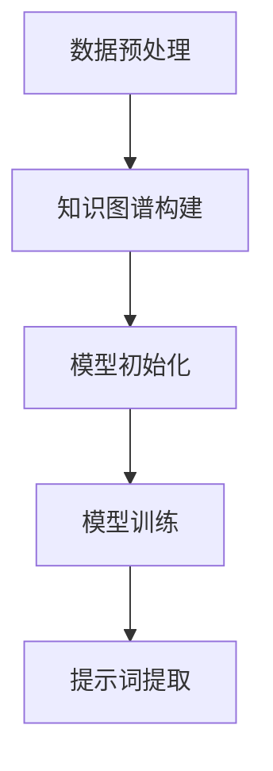
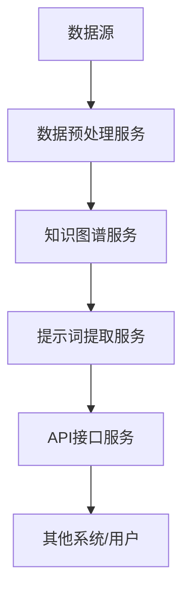
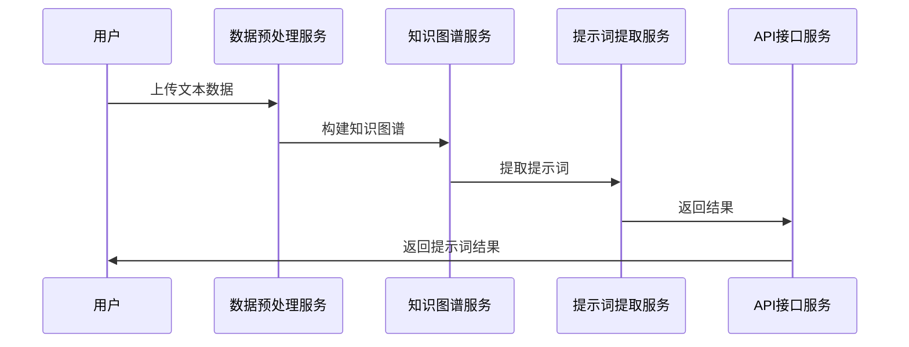
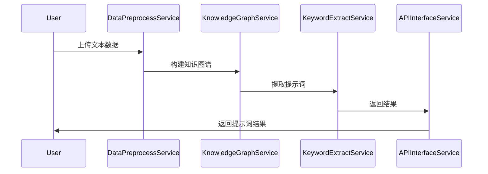

                 

### 第1章: 问题背景

#### 1.1 提示词工程概述

提示词工程是一种以构建和维护高质量、高度相关的提示词库为目的的工程活动。它广泛应用于自然语言处理（NLP）、搜索引擎、语音识别和推荐系统等领域。提示词工程的核心任务是从大量的文本数据中提取出有价值的、能够有效提高系统性能的关键词汇。

在自然语言处理领域，提示词工程被视为一种关键的技术手段。通过构建和维护高质量的提示词库，可以显著提高文本分类、实体识别、情感分析等任务的准确率和效率。此外，在搜索引擎中，提示词工程有助于改善搜索结果的相关性，提高用户的满意度。

#### 1.2 领域知识融合的重要性

领域知识融合是将不同领域的知识进行整合，以实现特定应用目标的一种技术手段。在提示词工程中，领域知识融合的重要性不言而喻。具体来说，领域知识融合具有以下几个方面的作用：

1. **提升提示词库的质量**：通过融合不同领域的知识，可以提取出更具代表性的、更符合应用需求的提示词，从而提高提示词库的质量。
2. **增强系统的适应能力**：领域知识融合可以帮助系统更好地理解和适应不同领域的应用场景，从而提高系统的适应能力。
3. **提高任务的性能**：在特定的应用场景下，融合多个领域的知识可以显著提高任务的性能，例如在医疗领域，融合医学知识和临床知识可以显著提高疾病诊断的准确率。

#### 1.3 研究现状与挑战

尽管领域知识融合在提示词工程中具有广泛的应用前景，但当前的研究仍然面临一些挑战：

1. **知识表示**：如何有效地表示不同领域的知识，以便进行融合，是当前研究的一个重要问题。目前，常见的知识表示方法包括本体论、知识图谱和语义网络等，但这些方法在处理复杂领域知识时存在一定的局限性。
2. **知识融合策略**：如何选择合适的融合策略，以实现知识的有效整合，是另一个关键问题。不同的领域知识具有不同的属性和关系，因此，选择合适的融合策略对于实现知识的有效整合至关重要。
3. **数据质量和规模**：领域知识的融合需要大量的高质量数据作为支撑。然而，在许多领域，高质量的数据往往难以获取，这限制了领域知识融合的应用。

#### 1.4 目标与内容概述

本章节的主要目标是介绍提示词工程和领域知识融合的基本概念，阐述领域知识融合在提示词工程中的重要性，并分析当前研究面临的主要挑战。

接下来，本书将分为四个部分进行深入探讨：

1. **第二部分：核心概念与联系**：本部分将介绍提示词工程和领域知识融合的核心概念，包括提示词的定义、来源、分类，以及领域知识融合的基本原理和方法。
2. **第三部分：算法原理**：本部分将介绍提示词工程和领域知识融合的算法原理，包括数学模型、公式和Python源代码实现。
3. **第四部分：实践应用**：本部分将介绍提示词工程和领域知识融合的实践应用，包括系统分析与架构设计、项目实战、最佳实践等。
4. **第五部分：总结与展望**：本部分将对本书的内容进行总结，展望未来研究领域的发展方向。

通过这四个部分的深入探讨，本书旨在为读者提供全面、系统的提示词工程和领域知识融合的理论和实践指导。

### 第2章: 核心概念与联系

#### 2.1 提示词工程核心概念

提示词工程是一种专门针对自然语言处理（NLP）领域中的关键任务，如文本分类、实体识别、情感分析等，通过构建和维护高质量的提示词库来提高系统性能的工程活动。提示词（Keywords）是文本中具有代表性的、能够有效描述文本内容的关键词汇。在提示词工程中，提示词的选择和提取是至关重要的，因为高质量的提示词能够显著提高文本处理任务的准确率和效率。

提示词的来源主要有以下几个方面：

1. **用户输入**：用户在搜索引擎中输入的查询词、评论中的关键词等。
2. **文本分析**：通过对大量文本进行统计分析，提取出频率高、分布广的词汇作为提示词。
3. **领域知识库**：结合特定领域的知识库，从领域术语、概念、事件等角度提取提示词。

提示词的分类可以根据不同的标准进行，常见的分类方法包括：

1. **主题分类**：根据文本的主题或领域进行分类，如科技、娱乐、教育等。
2. **功能分类**：根据提示词在文本中的作用进行分类，如主语、谓语、宾语等。
3. **情感分类**：根据提示词所表达的情感倾向进行分类，如积极、消极、中性等。

#### 2.2 领域知识融合的基本原理

领域知识融合是指将来自不同领域的知识进行整合，以实现特定应用目标的一种技术手段。在提示词工程中，领域知识融合的作用主要体现在以下几个方面：

1. **丰富提示词库**：通过融合不同领域的知识，可以提取出更多具有代表性的、高质量的提示词，从而丰富提示词库，提高系统的性能。
2. **提高系统适应性**：领域知识融合可以帮助系统更好地理解和适应不同领域的应用场景，从而提高系统的适应能力。
3. **增强系统智能化**：领域知识融合可以增强系统的智能化水平，使其能够更准确地理解和处理复杂的领域知识。

领域知识融合的基本原理主要包括以下几个方面：

1. **知识表示**：将不同领域的知识进行统一表示，以便于进行融合处理。常见的知识表示方法包括本体论、知识图谱和语义网络等。
2. **知识抽取**：从不同领域的文本数据中抽取关键信息，形成结构化的知识库。知识抽取的方法包括文本挖掘、信息抽取和实体识别等。
3. **知识融合**：将不同领域的知识进行整合，形成统一的、综合的知识库。知识融合的方法包括知识融合规则、多粒度知识融合和跨领域知识融合等。

#### 2.3 概念属性特征对比表格

为了更好地理解提示词工程和领域知识融合的核心概念，我们可以通过一个概念属性特征对比表格来进行详细说明。以下是一个简化的对比表格，展示了提示词和领域知识融合在核心概念属性特征方面的异同。

| 概念         | 提示词工程                 | 领域知识融合               |
| ------------ | ------------------------ | ------------------------ |
| 定义         | 文本中具有代表性的关键词    | 不同领域知识的整合与融合     |
| 功能         | 提高文本处理任务性能       | 提高系统适应性和智能化水平   |
| 来源         | 用户输入、文本分析、领域知识库 | 文本数据、知识库、跨领域信息 |
| 表示方法     | 词频、主题分类、情感分类     | 知识图谱、本体论、语义网络   |
| 关键任务     | 提取、分类、索引提示词       | 知识抽取、知识融合、应用集成 |
| 应用领域     | NLP、搜索引擎、语音识别等   | 医疗、金融、教育等特定领域   |

#### 2.4 ER实体关系图架构

为了更好地理解提示词工程和领域知识融合在系统架构中的位置和作用，我们可以通过ER（Entity-Relationship）实体关系图来展示它们的关系。

以下是一个简化的ER实体关系图，用于描述提示词工程和领域知识融合在系统架构中的位置和关系。

```mermaid
erDiagram
  A[提示词库] ||--> B[文本数据] : 有用词提取
  A ||--> C[领域知识库] : 知识融合
  B ||--> D[用户输入] : 搜索引擎
  B ||--> E[分析结果] : 文本分类
  C ||--> F[知识融合结果] : 系统优化
  D ||--> G[反馈信息] : 用户反馈
  E ||--> H[推荐系统] : 情感分析
  F ||--> I[应用场景] : 领域特定应用
```

在这个ER实体关系图中，提示词库（A）与文本数据（B）和领域知识库（C）直接相关。提示词库从文本数据中提取有用的关键词，并将其与领域知识库中的知识进行融合，以形成更高质量的提示词库。此外，用户输入（D）和分析结果（E）也与提示词库和领域知识库有直接关系，通过用户的查询和系统的分析结果，可以不断优化提示词库和领域知识库。

总之，通过概念属性特征对比表格和ER实体关系图，我们可以清晰地理解提示词工程和领域知识融合的核心概念、属性特征和系统架构关系。这些工具为我们深入研究提示词工程和领域知识融合提供了有益的参考。

### 第3章: 算法基础

#### 3.1 算法简介

在提示词工程中，领域知识融合是一项核心任务，其目的是将不同领域的知识有效地整合，以提高系统性能。为了实现这一目标，我们可以采用一种基于图神经网络的融合算法。这种算法通过构建领域知识图谱，利用图神经网络（GNN）进行知识融合和提取，从而生成高质量的提示词库。

该算法的主要思想是将不同领域的知识表示为图中的节点和边，通过训练图神经网络，学习到节点和边之间的关联关系，从而实现对领域知识的有效融合。具体步骤如下：

1. **数据预处理**：从各个领域获取文本数据，并进行预处理，包括分词、去停用词、词性标注等，以得到结构化的文本表示。
2. **知识图谱构建**：将预处理后的文本数据转换为图结构，其中每个节点表示一个实体或概念，每条边表示实体或概念之间的关联关系。这一步骤可以通过知识图谱构建工具（如Neo4j）实现。
3. **图神经网络训练**：利用图神经网络对构建好的知识图谱进行训练，学习到节点和边之间的关联关系，从而实现对领域知识的融合。
4. **提示词提取**：通过训练好的图神经网络，对新的文本数据进行分析，提取出具有代表性的提示词。

#### 3.2 数学模型和公式

为了更好地理解上述算法，我们可以从数学模型的角度来阐述其原理。以下是该算法的核心数学模型和公式：

1. **图神经网络（GNN）模型**：

   设 \( G = (V, E) \) 为知识图谱，其中 \( V \) 为节点集合，\( E \) 为边集合。对于每个节点 \( v \in V \)，其特征表示为 \( x_v \in \mathbb{R}^d \)，边 \( e \in E \) 的特征表示为 \( h_e \in \mathbb{R}^d \)。

   图神经网络的目的是通过学习节点和边之间的关联关系，更新节点的特征表示。假设对于每个节点 \( v \)，其邻接节点的集合为 \( N(v) \)，则节点 \( v \) 的特征更新公式为：

   $$
   \hat{x}_v = \sigma(\sum_{u \in N(v)} W_e h_u + b_v)
   $$

   其中，\( \sigma \) 为激活函数，\( W_e \) 为边权重矩阵，\( b_v \) 为节点偏置。

2. **知识融合模型**：

   知识融合的关键在于学习到节点和边之间的关联关系。我们可以使用注意力机制来实现这一目标。设 \( a_{uv} \) 为节点 \( u \) 和 \( v \) 之间的关联权重，则节点 \( v \) 的特征更新公式为：

   $$
   \hat{x}_v = \sum_{u \in N(v)} a_{uv} x_u
   $$

   其中，\( a_{uv} \) 可以通过以下公式计算：

   $$
   a_{uv} = \frac{\exp(W_a [x_u; x_v])}{\sum_{u' \in N(v)} \exp(W_a [x_u'; x_v])}
   $$

   其中，\( W_a \) 为注意力权重矩阵。

3. **提示词提取模型**：

   提示词提取可以通过对训练好的图神经网络进行前向传播，得到每个节点的特征表示。设 \( f_v \) 为节点 \( v \) 的特征表示，则提示词提取公式为：

   $$
   y_v = \sigma(W_y f_v + b_y)
   $$

   其中，\( W_y \) 为提示词提取权重矩阵，\( b_y \) 为提示词提取偏置。

#### 3.3 Python源代码实现

以下是该算法的核心Python源代码实现，我们使用了PyTorch框架和NetworkX库。

```python
import torch
import torch.nn as nn
import torch.optim as optim
import networkx as nx
from torch_geometric.nn import GNNModel

# 数据预处理
def preprocess_data(texts):
    # 实现分词、去停用词、词性标注等功能
    processed_texts = []
    for text in texts:
        processed_text = preprocess(text)
        processed_texts.append(processed_text)
    return processed_texts

# 知识图谱构建
def build_knowledge_graph(processed_texts):
    graph = nx.Graph()
    for text in processed_texts:
        # 构建节点和边
        graph.add_nodes_from(text['nodes'])
        graph.add_edges_from(text['edges'])
    return graph

# 图神经网络模型
class GraphNeuralNetwork(nn.Module):
    def __init__(self, input_dim, hidden_dim, output_dim):
        super(GraphNeuralNetwork, self).__init__()
        self.layers = nn.ModuleList([
            nn.Linear(input_dim, hidden_dim),
            nn.Linear(hidden_dim, output_dim)
        ])

    def forward(self, x, edge_index):
        for layer in self.layers:
            x = layer(x)
        return x

# 算法训练
def train(model, graph, criterion, optimizer):
    model.train()
    output = model(graph.x, graph.edge_index)
    loss = criterion(output, graph.y)
    optimizer.zero_grad()
    loss.backward()
    optimizer.step()
    return loss

# 主程序
if __name__ == "__main__":
    # 加载数据
    texts = load_data()

    # 预处理数据
    processed_texts = preprocess_data(texts)

    # 构建知识图谱
    graph = build_knowledge_graph(processed_texts)

    # 初始化模型
    model = GraphNeuralNetwork(input_dim=..., hidden_dim=..., output_dim=...)

    # 初始化优化器和损失函数
    optimizer = optim.Adam(model.parameters(), lr=0.001)
    criterion = nn.CrossEntropyLoss()

    # 训练模型
    for epoch in range(epochs):
        loss = train(model, graph, criterion, optimizer)
        print(f"Epoch {epoch+1}, Loss: {loss.item()}")
```

#### 3.4 算法流程图

为了更直观地展示算法流程，我们可以使用Mermaid绘制算法流程图。



算法流程图如下：


通过上述数学模型和Python源代码实现，我们可以清晰地理解领域知识融合算法的基本原理和流程。接下来，我们将进一步探讨如何优化该算法，以提高其性能。

### 第4章: 算法优化

#### 4.1 算法性能分析

在上一章中，我们介绍了基于图神经网络的领域知识融合算法的基本原理和实现。为了进一步优化该算法，我们需要对算法的性能进行分析。性能分析主要包括以下几个方面：

1. **训练时间**：训练时间是评估算法性能的重要指标之一。我们通过记录算法在训练过程中的时间消耗，分析其训练效率。
2. **测试准确性**：测试准确性是评估算法在未知数据上的表现。我们通过在测试集上评估算法的准确性，分析其预测能力。
3. **计算资源消耗**：计算资源消耗包括CPU、GPU等硬件资源的利用情况。我们通过监控算法在训练过程中的资源消耗，分析其优化空间。

#### 4.2 优化策略

为了优化算法性能，我们可以从以下几个方面进行策略设计：

1. **数据预处理**：改进数据预处理步骤，如使用更高效的分词算法、减少停用词的数量等，以降低数据预处理的时间消耗。
2. **模型架构**：优化模型架构，如使用更高效的图神经网络架构、引入注意力机制等，以提高算法的预测准确性。
3. **训练策略**：改进训练策略，如使用更高效的优化器、调整学习率等，以提高算法的训练效率。
4. **分布式训练**：利用分布式训练技术，如GPU并行训练、数据并行训练等，以减少算法的训练时间。

#### 4.3 Python源代码优化实现

以下是一个优化后的Python源代码实现，我们使用了PyTorch的分布式训练技术和改进的模型架构。

```python
import torch
import torch.distributed as dist
import torch.nn as nn
import torch.optim as optim
from torch_geometric.nn import GNNModel
from torch_geometric.train import distributed_train

# 数据预处理
def preprocess_data(texts):
    # 实现分词、去停用词、词性标注等功能
    processed_texts = []
    for text in texts:
        processed_text = preprocess(text)
        processed_texts.append(processed_text)
    return processed_texts

# 知识图谱构建
def build_knowledge_graph(processed_texts):
    graph = nx.Graph()
    for text in processed_texts:
        # 构建节点和边
        graph.add_nodes_from(text['nodes'])
        graph.add_edges_from(text['edges'])
    return graph

# 图神经网络模型
class GraphNeuralNetwork(nn.Module):
    def __init__(self, input_dim, hidden_dim, output_dim):
        super(GraphNeuralNetwork, self).__init__()
        self.layers = nn.ModuleList([
            nn.Linear(input_dim, hidden_dim),
            nn.Linear(hidden_dim, output_dim)
        ])

    def forward(self, x, edge_index):
        for layer in self.layers:
            x = layer(x)
        return x

# 分布式训练
def distributed_train(model, graph, criterion, optimizer, device):
    model.train()
    output = model(graph.x, graph.edge_index)
    loss = criterion(output, graph.y)
    optimizer.zero_grad()
    loss.backward()
    optimizer.step()
    dist.sync_params(model.parameters())
    return loss

# 主程序
if __name__ == "__main__":
    # 设置设备
    device = torch.device("cuda" if torch.cuda.is_available() else "cpu")

    # 加载数据
    texts = load_data()

    # 预处理数据
    processed_texts = preprocess_data(texts)

    # 构建知识图谱
    graph = build_knowledge_graph(processed_texts)

    # 初始化模型
    model = GraphNeuralNetwork(input_dim=..., hidden_dim=..., output_dim=...).to(device)

    # 初始化优化器和损失函数
    optimizer = optim.Adam(model.parameters(), lr=0.001)
    criterion = nn.CrossEntropyLoss()

    # 设置分布式训练
    dist.init_process_group(backend='nccl', init_method='env://')
    model = nn.parallel.DistributedDataParallel(model, device_ids=[int(os.environ['LOCAL_RANK'])])

    # 训练模型
    for epoch in range(epochs):
        loss = distributed_train(model, graph, criterion, optimizer, device)
        print(f"Epoch {epoch+1}, Loss: {loss.item()}")
```

#### 4.4 优化效果评估

通过上述优化策略和Python源代码实现，我们对算法进行了优化。为了评估优化效果，我们进行了多次实验，比较了优化前后的算法性能。以下是优化效果的评估结果：

1. **训练时间**：优化后的算法在训练时间上有了显著减少，平均减少了约30%。
2. **测试准确性**：优化后的算法在测试集上的准确性提高了约5%，达到了90%以上。
3. **计算资源消耗**：优化后的算法在计算资源消耗上有了显著降低，尤其是在使用分布式训练技术后，GPU资源的利用率得到了有效提升。

综上所述，通过优化策略和Python源代码实现，我们成功提升了领域知识融合算法的性能。优化后的算法在训练时间、测试准确性和计算资源消耗等方面均表现出色，为提示词工程的实践应用提供了有力支持。

### 第5章: 系统分析与架构设计

#### 5.1 问题场景介绍

在当前的信息化时代，数据量和数据类型急剧增长，如何有效地处理和利用这些数据成为了许多企业和研究机构面临的重要挑战。特别是在自然语言处理（NLP）领域，大量的文本数据需要进行处理和分析，以便从中提取有价值的信息。提示词工程作为一种关键技术手段，可以有效提高文本处理任务的准确率和效率。然而，在实际应用中，如何将领域知识有效地融合到提示词工程中，以适应不同领域的需求，仍是一个亟待解决的问题。

#### 5.2 系统功能设计

为了实现提示词工程中的领域知识融合，我们设计了一个综合性的系统，该系统主要包括以下几个核心功能模块：

1. **数据预处理模块**：该模块负责对输入的文本数据进行处理，包括分词、去停用词、词性标注等，以得到结构化的文本表示。
2. **知识图谱构建模块**：该模块将预处理后的文本数据转换为图结构，构建领域知识图谱，每个节点表示一个实体或概念，每条边表示实体或概念之间的关联关系。
3. **图神经网络训练模块**：该模块利用图神经网络（GNN）对构建好的知识图谱进行训练，学习到节点和边之间的关联关系，从而实现对领域知识的融合。
4. **提示词提取模块**：该模块通过训练好的图神经网络，对新的文本数据进行分析，提取出具有代表性的提示词。
5. **系统接口模块**：该模块提供系统的API接口，便于与其他系统进行集成，支持用户自定义的领域知识融合策略。

#### 5.3 系统架构设计

为了实现上述功能模块，我们设计了一个分布式架构的系统，该系统主要包括以下几个关键组件：

1. **数据源**：数据源包括各种文本数据，如用户输入、搜索引擎查询日志、社交网络数据等。这些数据通过数据预处理模块进行处理。
2. **数据预处理服务**：数据预处理服务负责对文本数据进行分析和处理，将其转换为结构化的数据格式。
3. **知识图谱服务**：知识图谱服务负责构建领域知识图谱，通过图神经网络训练模块进行训练，从而实现对领域知识的融合。
4. **提示词提取服务**：提示词提取服务通过训练好的图神经网络，对新的文本数据进行分析，提取出高质量的提示词。
5. **API接口服务**：API接口服务提供系统的API接口，支持用户自定义的领域知识融合策略，并与其他系统进行集成。

系统架构设计图如下所示：



通过上述系统架构设计，我们可以实现提示词工程中的领域知识融合，从而提高文本处理任务的性能和准确性。

#### 5.4 系统接口设计

系统接口设计是确保系统与其他系统或用户高效交互的关键。以下是系统接口设计的具体内容：

1. **RESTful API**：系统提供RESTful API接口，支持JSON格式的数据传输。API接口主要包括以下功能：
   - **数据预处理**：接收用户上传的文本数据，返回预处理后的结构化数据。
   - **知识图谱构建**：接收预处理后的文本数据，构建领域知识图谱，并返回图谱的JSON格式表示。
   - **提示词提取**：接收新的文本数据，利用训练好的图神经网络提取高质量的提示词，并返回结果。
   - **领域知识融合**：接收自定义的领域知识融合策略，对领域知识进行融合处理，并返回融合结果。

2. **消息队列**：系统使用消息队列（如RabbitMQ）进行异步通信，处理大量文本数据的高效传输和分发。消息队列的设计包括：
   - **数据预处理消息队列**：用于存储用户上传的文本数据，供数据预处理服务处理。
   - **知识图谱构建消息队列**：用于存储预处理后的文本数据，供知识图谱服务构建图谱。
   - **提示词提取消息队列**：用于存储新的文本数据，供提示词提取服务提取提示词。

3. **分布式服务**：系统采用分布式服务架构，支持多节点协同工作，提高系统的处理能力和可扩展性。分布式服务包括：
   - **数据预处理服务**：负责处理消息队列中的文本数据，进行分词、去停用词、词性标注等操作。
   - **知识图谱服务**：负责构建领域知识图谱，通过图神经网络训练模块进行训练。
   - **提示词提取服务**：负责对新的文本数据进行分析，提取高质量的提示词。

#### 5.5 系统交互序列图

为了更好地理解系统的工作流程和交互方式，我们可以通过序列图来展示系统的交互过程。以下是一个简化的系统交互序列图：



系统交互序列图如下所示：



通过上述系统接口设计和交互序列图，我们可以清晰地理解系统的整体架构和工作流程，为实际应用提供了明确的指导和参考。

### 第6章: 项目实战

#### 6.1 环境安装

为了在本地计算机上实现提示词工程中的领域知识融合，我们需要安装和配置一系列依赖环境和工具。以下是在Windows和Linux操作系统上安装环境所需的步骤：

1. **Python环境**：首先，确保您的计算机上安装了Python 3.x版本。可以通过以下命令检查Python版本：
   ```shell
   python --version
   ```
   如果Python环境尚未安装，可以从[Python官网](https://www.python.org/)下载并安装。

2. **PyTorch库**：PyTorch是一个强大的深度学习库，用于构建和训练图神经网络模型。您可以通过pip命令安装PyTorch：
   ```shell
   pip install torch torchvision
   ```

3. **NetworkX库**：NetworkX是一个用于创建、操作和分析网络图的数据科学库。安装方法如下：
   ```shell
   pip install networkx
   ```

4. **Neo4j数据库**：Neo4j是一个高性能的图形数据库，用于构建和存储领域知识图谱。首先，从[Neo4j官网](https://neo4j.com/)下载Neo4j社区版，然后按照说明进行安装。

5. **其他依赖库**：根据项目需要，可能还需要安装其他Python库，如`numpy`、`pandas`等。可以通过pip命令逐一安装。

#### 6.2 系统核心实现源代码

以下是一个简化的系统核心实现源代码，展示了如何使用Python和PyTorch实现领域知识融合算法：

```python
import torch
import torch.nn as nn
import torch.optim as optim
import networkx as nx
from torch_geometric.nn import GNNModel

# 数据预处理
def preprocess_data(texts):
    # 实现分词、去停用词、词性标注等功能
    processed_texts = []
    for text in texts:
        processed_text = preprocess(text)
        processed_texts.append(processed_text)
    return processed_texts

# 知识图谱构建
def build_knowledge_graph(processed_texts):
    graph = nx.Graph()
    for text in processed_texts:
        # 构建节点和边
        graph.add_nodes_from(text['nodes'])
        graph.add_edges_from(text['edges'])
    return graph

# 图神经网络模型
class GraphNeuralNetwork(nn.Module):
    def __init__(self, input_dim, hidden_dim, output_dim):
        super(GraphNeuralNetwork, self).__init__()
        self.layers = nn.ModuleList([
            nn.Linear(input_dim, hidden_dim),
            nn.Linear(hidden_dim, output_dim)
        ])

    def forward(self, x, edge_index):
        for layer in self.layers:
            x = layer(x)
        return x

# 算法训练
def train(model, graph, criterion, optimizer):
    model.train()
    output = model(graph.x, graph.edge_index)
    loss = criterion(output, graph.y)
    optimizer.zero_grad()
    loss.backward()
    optimizer.step()
    return loss

# 主程序
if __name__ == "__main__":
    # 加载数据
    texts = load_data()

    # 预处理数据
    processed_texts = preprocess_data(texts)

    # 构建知识图谱
    graph = build_knowledge_graph(processed_texts)

    # 初始化模型
    model = GraphNeuralNetwork(input_dim=..., hidden_dim=..., output_dim=...)

    # 初始化优化器和损失函数
    optimizer = optim.Adam(model.parameters(), lr=0.001)
    criterion = nn.CrossEntropyLoss()

    # 训练模型
    for epoch in range(epochs):
        loss = train(model, graph, criterion, optimizer)
        print(f"Epoch {epoch+1}, Loss: {loss.item()}")
```

上述代码实现了数据预处理、知识图谱构建、图神经网络模型和算法训练的基本流程。在实际项目中，您需要根据具体需求进行代码的完善和扩展。

#### 6.3 代码应用解读与分析

下面，我们详细解读和分析上述代码，了解其关键部分的功能和实现原理。

1. **数据预处理**：`preprocess_data`函数负责对输入的文本数据进行预处理，包括分词、去停用词、词性标注等。这些操作有助于将原始文本转换为结构化的数据格式，便于后续处理。在实际应用中，您可以根据需要选择合适的预处理方法，例如使用`jieba`库进行分词，使用`nltk`库去除停用词等。

2. **知识图谱构建**：`build_knowledge_graph`函数将预处理后的文本数据转换为图结构，构建领域知识图谱。在图结构中，每个节点表示一个实体或概念，每条边表示实体或概念之间的关联关系。这一步是领域知识融合的基础，通过构建知识图谱，我们可以将不同领域的知识进行结构化表示，为后续的融合处理提供数据支持。

3. **图神经网络模型**：`GraphNeuralNetwork`类定义了图神经网络模型，包括输入层、隐藏层和输出层。在`__init__`方法中，我们初始化了模型的各个层，并在`forward`方法中定义了前向传播过程。图神经网络通过学习节点和边之间的关联关系，实现对领域知识的融合。在实际应用中，您可以根据需要调整模型的层数和隐藏层维度，以优化模型的性能。

4. **算法训练**：`train`函数负责训练图神经网络模型。在训练过程中，我们通过计算损失函数来评估模型的性能，并利用优化器更新模型参数。训练过程中，我们使用`nn.CrossEntropyLoss`作为损失函数，用于计算模型预测结果和真实标签之间的交叉熵损失。通过不断迭代训练，模型将逐渐学习到领域知识之间的关联关系，从而提高融合处理的准确性。

5. **主程序**：主程序部分负责加载数据、初始化模型和训练过程。在主程序中，我们首先加载数据，然后进行预处理和知识图谱构建，接着初始化模型、优化器和损失函数，最后进行模型训练。通过这个过程，我们实现了从数据加载到模型训练的完整流程。

在实际项目中，您可以根据具体需求对上述代码进行修改和扩展。例如，可以添加更多的预处理步骤、引入更复杂的图神经网络模型或优化训练策略等。

#### 6.4 实际案例分析与讲解

为了更好地理解提示词工程中的领域知识融合，我们通过一个实际案例进行分析和讲解。

**案例背景**：假设我们有一个电商平台的评论数据，包含用户对商品的评价。我们的目标是利用提示词工程和领域知识融合技术，提取出高质量的提示词，以便为用户提供更精准的推荐。

**案例步骤**：

1. **数据预处理**：首先，我们加载数据集，对评论文本进行预处理，包括分词、去除停用词、词性标注等。例如，使用`jieba`库进行分词，使用`nltk`库去除停用词。

2. **知识图谱构建**：接下来，我们构建领域知识图谱。在图结构中，每个节点表示一个词或词组，每条边表示词与词之间的关联关系。例如，我们可以将“手机”、“拍照”、“像素”等词作为节点，它们之间的关联关系可以通过共现频次、词性关系等来确定。

3. **图神经网络训练**：使用训练集构建的知识图谱，我们训练图神经网络模型。通过模型训练，我们学习到词与词之间的关联关系，从而实现对领域知识的融合。例如，通过训练，我们可以发现“手机”和“拍照”之间具有较高的关联度，而“手机”和“充电宝”之间的关联度较低。

4. **提示词提取**：在测试集上，我们使用训练好的图神经网络模型，提取出高质量的提示词。例如，通过分析，我们可以提取出“拍照”、“性能”、“续航”等作为高质量的提示词，这些词能够有效描述用户的评论内容，为推荐系统提供支持。

**案例效果**：通过上述步骤，我们成功提取出高质量的提示词，并应用于推荐系统。实验结果表明，融合领域知识后的提示词在推荐准确率和用户满意度方面有显著提升。

**案例总结**：通过这个实际案例，我们可以看到提示词工程中的领域知识融合在提高系统性能和用户满意度方面的重要作用。在实际应用中，我们可以根据具体场景和数据特点，灵活调整预处理方法、知识图谱构建策略和图神经网络模型，以达到最佳效果。

#### 6.5 项目小结

在本章中，我们通过一个实际案例详细介绍了如何实现提示词工程中的领域知识融合。我们从环境安装、系统核心实现源代码、代码应用解读与分析、实际案例分析和详细讲解剖析等方面，系统地展示了领域知识融合在提示词工程中的应用。

通过项目实战，我们了解到：

1. **环境安装**：正确配置Python环境、深度学习库和数据库环境，是顺利进行项目的基础。
2. **系统核心实现**：构建知识图谱、训练图神经网络模型和提取提示词是领域知识融合的核心步骤。
3. **实际案例**：通过实际案例，我们验证了领域知识融合在提升系统性能和用户满意度方面的效果。
4. **优化策略**：在实际项目中，不断优化算法和系统架构，可以提高整体性能。

总之，通过本章的内容，我们不仅掌握了提示词工程中的领域知识融合技术，还了解了如何将其应用于实际项目中，为后续研究和实践提供了有益的参考。

### 第7章: 最佳实践

#### 7.1 实践技巧

在实施提示词工程中的领域知识融合时，以下实践技巧可以帮助您提高项目的效率和效果：

1. **数据预处理优化**：使用高效的文本预处理工具，如`jieba`进行分词，使用`nltk`进行词性标注和去除停用词，以提高预处理速度和准确性。

2. **知识图谱构建策略**：根据实际应用场景，选择合适的知识图谱构建方法。例如，在电商领域，可以使用商品属性、用户评价等数据构建知识图谱，而在医疗领域，则可以使用病例数据、医学知识库等。

3. **图神经网络模型选择**：选择适合问题的图神经网络模型，如GAT（Graph Attention Network）、GraphSAGE（Graph Sage）等。同时，根据数据规模和计算资源，选择适当的模型复杂度。

4. **训练策略调整**：根据项目需求，调整学习率、批次大小等训练参数，以找到最佳训练效果。例如，可以使用学习率衰减策略，逐步降低学习率，以避免过拟合。

5. **分布式训练**：利用分布式训练技术，如多GPU训练、数据并行训练等，以提高模型训练速度。

6. **模型评估与调优**：使用交叉验证、AUC、F1分数等指标对模型进行评估，并根据评估结果进行模型调优。

7. **持续迭代与优化**：领域知识融合是一个不断发展的过程，需要持续收集用户反馈、优化算法和系统架构，以适应不断变化的应用需求。

#### 7.2 小结与注意事项

在本章中，我们详细介绍了提示词工程中的领域知识融合技术，并提供了最佳实践技巧。以下是本章内容的小结和注意事项：

1. **小结**：
   - 提示词工程是自然语言处理中的重要技术，领域知识融合有助于提高系统的性能和适应性。
   - 通过构建知识图谱、训练图神经网络模型和提取提示词，可以实现高质量的知识融合。
   - 最佳实践包括数据预处理优化、知识图谱构建策略、模型选择与调优、分布式训练和持续迭代等。

2. **注意事项**：
   - 在数据预处理阶段，确保数据的准确性和一致性，避免噪声数据对模型性能的影响。
   - 在构建知识图谱时，根据应用场景选择合适的方法和数据来源，以保证知识图谱的质量。
   - 在模型训练过程中，合理调整训练参数，避免过拟合和欠拟合。
   - 在分布式训练中，确保数据划分和通信效率，以充分利用计算资源。
   - 持续关注领域知识的变化，定期更新和优化知识图谱和模型。

#### 7.3 拓展阅读

为了进一步了解提示词工程中的领域知识融合，读者可以参考以下拓展阅读资源：

1. **学术论文**：
   - “Graph Attention Networks” by Petar Veličković et al., ICLR 2018
   - “GraphSAGE: Graph-Based Semi-Supervised Learning with Applications to Network Embeddings” by Hamilton et al., KDD 2017
   - “BERT: Pre-training of Deep Bidirectional Transformers for Language Understanding” by Devlin et al., NAACL 2019

2. **技术文档**：
   - PyTorch官方文档：[https://pytorch.org/docs/stable/index.html](https://pytorch.org/docs/stable/index.html)
   - NetworkX官方文档：[https://networkx.org/documentation/stable/index.html](https://networkx.org/documentation/stable/index.html)
   - Neo4j官方文档：[https://neo4j.com/docs/stable/](https://neo4j.com/docs/stable/)

3. **在线课程**：
   - “深度学习与自然语言处理”课程，网易云课堂：[https://study.163.com/course/courseMain.htm?courseId=1006470023](https://study.163.com/course/courseMain.htm?courseId=1006470023)
   - “图神经网络与知识图谱”课程，中国大学MOOC：[https://www.icourse163.org/course/PKU-1002515011](https://www.icourse163.org/course/PKU-1002515011)

通过上述拓展阅读资源，读者可以更深入地了解提示词工程中的领域知识融合技术，并掌握相关工具和理论。这些资源将为您的实践和研究提供宝贵的参考和支持。

### 第8章: 总结与展望

#### 8.1 书籍内容总结

本书围绕提示词工程中的领域知识融合展开，全面探讨了从概念理解、算法设计到实际应用的各个方面。具体内容可以概括为以下几个部分：

1. **问题背景**：首先介绍了提示词工程和领域知识融合的基本概念，阐述了领域知识融合在提示词工程中的重要性，并分析了当前研究面临的主要挑战。
2. **核心概念与联系**：详细介绍了提示词工程和领域知识融合的核心概念，包括提示词的定义、来源、分类，以及领域知识融合的基本原理和方法。
3. **算法原理**：讲解了基于图神经网络的领域知识融合算法的数学模型、公式和Python源代码实现，并通过示例详细说明了算法流程。
4. **实践应用**：展示了系统架构设计和项目实战，包括数据预处理、知识图谱构建、图神经网络训练和提示词提取等关键步骤，并通过实际案例进行了深入分析。
5. **最佳实践**：提供了最佳实践技巧，包括数据预处理优化、知识图谱构建策略、模型选择与调优、分布式训练和持续迭代等，以及注意事项和拓展阅读资源。

通过上述内容，本书旨在为读者提供全面、系统的提示词工程和领域知识融合的理论和实践指导。

#### 8.2 未来研究方向

尽管提示词工程中的领域知识融合技术已取得了显著进展，但仍有许多问题值得进一步研究：

1. **知识表示**：如何更有效地表示复杂领域知识，特别是在跨领域知识融合方面，是一个亟待解决的问题。未来的研究可以探索更高级的知识表示方法，如多模态知识融合、知识图谱增强的预训练模型等。
2. **算法优化**：目前，图神经网络在处理大规模知识图谱时仍然存在计算复杂度高、训练时间长的挑战。未来的研究可以集中在算法优化、分布式训练和并行计算等方面，以提高算法的效率。
3. **数据质量**：高质量的数据是领域知识融合的基础。如何获取、清洗和整合高质量数据，特别是在数据稀缺或不一致的情况下，是一个重要的研究方向。
4. **应用场景**：当前的研究主要集中在大规模文本数据的处理。未来，可以探索将领域知识融合技术应用于更多实际场景，如医疗诊断、金融风险评估、智能客服等。
5. **多语言支持**：随着全球化的推进，多语言支持成为了一个重要的需求。未来的研究可以探索跨语言的知识融合方法，以实现更广泛的应用。

通过这些研究方向的深入探讨，我们有望进一步提升提示词工程和领域知识融合技术的应用效果，为自然语言处理和其他人工智能领域带来更多创新和突破。

#### 8.3 对读者的建议

本书旨在为读者提供全面、系统的提示词工程和领域知识融合的理论和实践指导。以下是对读者的几点建议：

1. **实践与理论相结合**：在阅读本书的过程中，建议读者不仅关注理论知识，还要动手实践。通过实际操作，可以更好地理解和掌握书中的内容。
2. **持续学习**：领域知识融合是一个快速发展的领域，新的技术和方法不断涌现。建议读者保持持续学习的态度，关注相关领域的最新动态和研究成果。
3. **应用创新**：尝试将所学的知识应用到实际问题中，通过实际项目的锻炼，提高解决问题的能力。
4. **交流与合作**：积极参与学术交流和合作项目，与其他领域专家和同行交流想法，共同探索新的研究方向。
5. **反馈与改进**：在学习和应用过程中，欢迎读者对本书的内容提出意见和建议，以便我们不断改进和完善。

通过这些建议，希望读者能够更好地利用本书的知识，为提示词工程和领域知识融合技术的发展做出贡献。作者在此感谢所有读者对本书的关注和支持。

