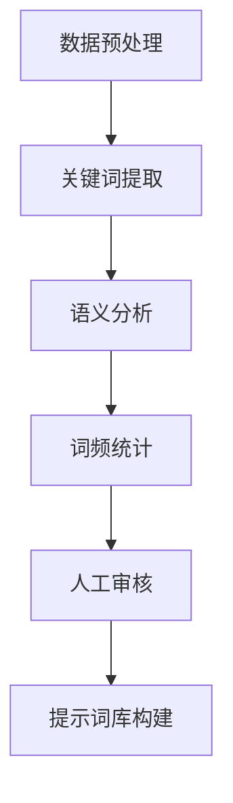
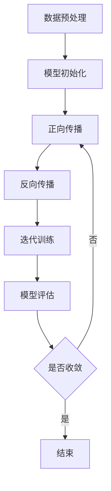
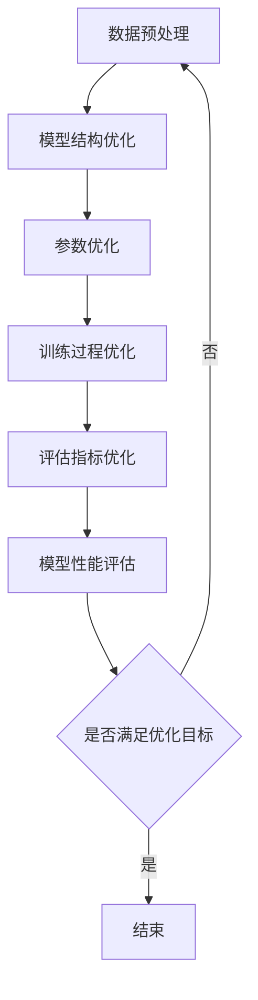
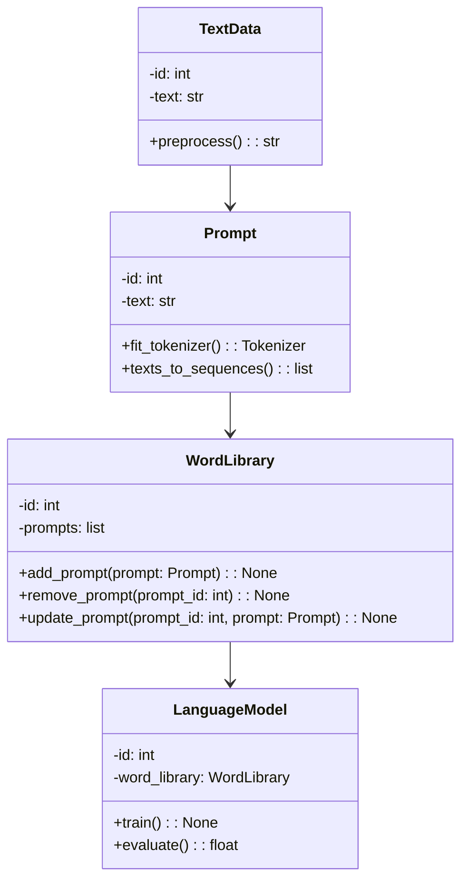
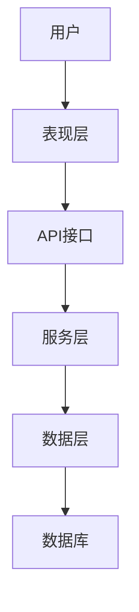
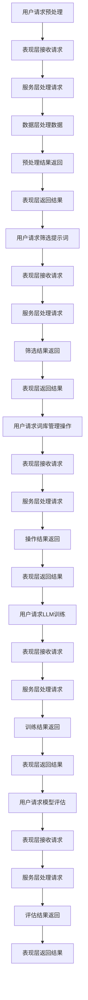

                 


### 1.1.1 问题背景

随着人工智能技术的迅速发展，语言模型（Language Model，简称LM）在自然语言处理（Natural Language Processing，简称NLP）领域扮演着越来越重要的角色。特别是大型语言模型（Large Language Model，简称LLM），如GPT-3、BERT等，凭借其强大的文本生成和语义理解能力，被广泛应用于智能客服、自动翻译、内容生成等多个领域。

然而，在实际应用中，LLM的表现并非总是如预期般优秀。一个关键问题是提示词（Prompt）的选择与组织。提示词作为输入给LLM的引导性信息，直接影响模型的输出质量。在实际应用中，如何构建一个高效、合理的提示词库，以提升LLM的性能和开发效率，成为了一个亟待解决的问题。

因此，本文旨在探讨提示词库管理这一主题，通过分析其核心概念、算法原理、系统架构和项目实战，为LLM应用开发者提供一套系统化的解决方案。

### 1.1.2 核心概念解释

为了更好地理解提示词库管理，我们需要先明确以下几个核心概念：

- **提示词**：提示词是指用于引导LLM进行文本生成的关键词或短语。一个优质的提示词应具备简洁、精准、具有引导性的特点。

- **词库**：词库是存储和管理提示词的集合。一个高效的词库应当包含丰富、多样且相关的提示词，以便为LLM提供丰富的输入信息。

- **LLM**：LLM是一种大型语言模型，具有强大的文本生成和语义理解能力。常见的LLM包括GPT-3、BERT等。

这些概念之间存在着密切的联系。提示词是词库的基本组成单元，而词库又是LLM输入数据的核心。通过合理管理和组织词库，我们可以为LLM提供高质量的输入，从而提升其输出效果。以下是一个简单的对比表格，用以展示这些概念之间的关系：

| 概念 | 定义 | 关系 |
| --- | --- | --- |
| 提示词 | 引导LLM进行文本生成的关键词或短语 | 词库的基本组成单元 |
| 词库 | 存储和管理提示词的集合 | 提升LLM性能的关键 |
| LLM | 大型语言模型，具有强大的文本生成和语义理解能力 | 需要优质词库输入 |

### 1.1.3 边界与外延

提示词库管理并非无边界可循。在实际应用中，我们需要关注以下几个边界与外延：

- **应用范围**：提示词库管理适用于所有需要使用LLM进行文本生成的场景，如智能客服、自动翻译、内容生成等。

- **数据来源**：提示词库的数据来源可以是外部数据集、预训练模型或自定义数据。合理选择数据来源，可以有效提升词库的质量。

- **维护策略**：提示词库需要定期更新和维护，以适应不断变化的应用需求。维护策略包括数据清洗、词频分析、质量评估等。

- **技术要求**：提示词库管理涉及多个技术领域，包括自然语言处理、机器学习、数据库管理等。开发者需要具备相关技术背景，以便更好地管理和优化词库。

### 1.1.4 提示词、词库、LLM的关系对比表

为了更直观地展示提示词、词库、LLM之间的关系，我们可以使用以下对比表格：

| 层级 | 名称 | 定义 | 功能 |
| --- | --- | --- | --- |
| **底层** | 提示词 | 引导LLM进行文本生成的关键词或短语 | 提供输入信息 |
| **中层** | 词库 | 存储和管理提示词的集合 | 管理输入信息 |
| **顶层** | LLM | 大型语言模型，具有强大的文本生成和语义理解能力 | 生成文本输出 |

这种分层结构有助于我们理解提示词库管理的工作原理。通过合理组织和管理提示词库，我们可以为LLM提供高质量的输入，从而提升其输出效果。

### 1.2.1 ER图绘制

为了更清晰地展示提示词库管理系统的实体关系，我们可以使用Mermaid绘制一个简单的ER图。以下是ER图的Mermaid代码：

```mermaid
erDiagram
  A[LLM] ||--|{ B[Word Library] }|
  B ||--|{ C[Prompt] }|
```

### 1.2.2 关键实体与关系分析

在上面的ER图中，有三个关键实体：LLM、Word Library和Prompt。

- **LLM（大型语言模型）**：作为系统的核心，LLM负责接收Word Library提供的提示词，并生成相应的文本输出。

- **Word Library（词库）**：存储和管理提示词的集合，是LLM输入数据的核心。Word Library由多个Prompt组成，每个Prompt代表一个特定的关键词或短语。

- **Prompt（提示词）**：用于引导LLM进行文本生成的关键词或短语。Prompt是Word Library的基本组成单元，其质量和数量直接影响LLM的输出效果。

这些实体之间的关系如下：

- LLM与Word Library之间存在一对多的关系。一个LLM可以与多个Word Library关联，而一个Word Library也可以被多个LLM使用。

- Word Library与Prompt之间存在一对多的关系。一个Word Library包含多个Prompt，而一个Prompt只能属于一个Word Library。

通过ER图，我们可以更直观地理解提示词库管理系统的实体关系，为后续的系统设计与实现提供基础。

### 2.1.1 提示词筛选

提示词筛选是构建提示词库的重要步骤。一个优质的提示词应具备以下几个特点：

1. **简洁性**：提示词应简洁明了，避免冗长和复杂的表达，以便LLM能够准确理解其含义。

2. **精准性**：提示词应与LLM生成的文本内容高度相关，确保输出结果的准确性和一致性。

3. **引导性**：提示词应具备引导性，能够引导LLM生成符合预期的文本输出。

4. **多样性**：提示词应具备多样性，涵盖不同主题和情境，以便LLM能够适应多种应用场景。

为了实现高效的提示词筛选，我们可以采用以下策略：

1. **关键词提取**：从原始文本数据中提取关键词，作为潜在的提示词候选集。

2. **语义分析**：利用自然语言处理技术，对关键词进行语义分析，筛选出具有较高相关性的提示词。

3. **词频统计**：统计关键词在文本数据中的出现频率，选择出现频率较高的关键词作为提示词。

4. **人工审核**：对筛选出的提示词进行人工审核，确保其质量和适用性。

通过以上策略，我们可以构建一个高质量的提示词库，为LLM应用提供可靠的输入数据。

### 2.1.2 提示词库构建流程图

为了更清晰地展示提示词库构建的流程，我们可以使用Mermaid绘制一个流程图。以下是提示词库构建流程图的Mermaid代码：



### 2.1.3 Python代码示例

以下是一个简单的Python代码示例，用于演示提示词库构建的过程：

```python
import nltk
from nltk.tokenize import word_tokenize
from nltk.corpus import stopwords
from collections import Counter

# 1. 数据预处理
def preprocess_text(text):
    # 去除标点符号和特殊字符
    text = re.sub(r'[^\w\s]', '', text)
    # 转换为小写
    text = text.lower()
    # 分词
    tokens = word_tokenize(text)
    # 去除停用词
    stop_words = set(stopwords.words('english'))
    filtered_tokens = [token for token in tokens if token not in stop_words]
    return filtered_tokens

# 2. 关键词提取
def extract_keywords(tokens):
    # 计算词频
    word_freq = Counter(tokens)
    # 筛选高频词
    keywords = [word for word, freq in word_freq.items() if freq > 10]
    return keywords

# 3. 语义分析
def analyze_semantics(keywords):
    # 使用词性标注
    pos_tags = nltk.pos_tag(keywords)
    # 筛选名词和动词
    nouns = [word for word, tag in pos_tags if tag.startswith('N')]
    verbs = [word for word, tag in pos_tags if tag.startswith('V')]
    return nouns + verbs

# 4. 词频统计
def count_words(tokens):
    word_freq = Counter(tokens)
    return word_freq

# 5. 人工审核
def manual_review(keywords):
    # 根据业务需求进行筛选
    reviewed_keywords = [keyword for keyword in keywords if 'review' in keyword]
    return reviewed_keywords

# 6. 提示词库构建
def build_prompt_library(text):
    tokens = preprocess_text(text)
    keywords = extract_keywords(tokens)
    semantics = analyze_semantics(keywords)
    word_freq = count_words(tokens)
    reviewed_keywords = manual_review(keywords)
    
    prompt_library = {
        'preprocessed_text': tokens,
        'keywords': keywords,
        'semantics': semantics,
        'word_freq': word_freq,
        'reviewed_keywords': reviewed_keywords
    }
    return prompt_library

# 测试
text = "This is a sample text for prompt library construction."
prompt_library = build_prompt_library(text)
print(prompt_library)
```

### 2.1.4 LaTeX公式解释

在提示词库管理中，我们经常需要使用数学模型和公式来描述算法原理。以下是一个示例公式，用LaTeX格式表示：

$$
\text{Precision} = \frac{\text{TP}}{\text{TP} + \text{FP}}
$$

其中，Precision（精确率）是衡量提示词筛选效果的重要指标。TP（True Positive）表示正确筛选出的提示词，FP（False Positive）表示误筛选出的提示词。该公式表明，精确率越高，提示词筛选效果越好。

### 2.2.1 训练过程概述

提示词库训练是提升LLM性能的关键步骤。在训练过程中，我们需要对提示词库进行数据清洗、去重、分词、词性标注等预处理操作，以确保输入数据的质量。然后，利用预训练模型或自定义训练数据，对提示词库进行训练，以优化LLM的参数。

训练过程通常包括以下几个阶段：

1. **数据预处理**：对原始文本数据进行清洗、去重、分词、词性标注等预处理操作，为训练准备高质量的数据集。

2. **模型初始化**：选择一个预训练模型或随机初始化一个模型，作为训练的起点。

3. **正向传播**：将预处理后的文本数据输入到模型中，计算模型的输出结果和损失值。

4. **反向传播**：根据损失值，更新模型的参数，以降低损失值。

5. **迭代训练**：重复正向传播和反向传播的过程，直到模型收敛或达到预设的训练次数。

6. **模型评估**：使用验证集或测试集对模型进行评估，以衡量模型的性能。

通过以上步骤，我们可以训练出一个高质量的提示词库，为LLM应用提供可靠的输入。

### 2.2.2 提示词库优化

在训练过程中，提示词库的优化是一个重要的环节。优化的目标是提高LLM的输出质量，使其生成的文本更符合预期。以下是几种常见的优化策略：

1. **数据增强**：通过扩充训练数据集，提高模型对多样性的适应能力。数据增强的方法包括同义词替换、随机插入、随机删除等。

2. **权重调整**：调整模型参数的权重，以优化模型的输出效果。权重调整可以通过学习率调度、dropout等方法实现。

3. **序列对齐**：对输入的提示词序列和输出的文本序列进行对齐，以提高模型的生成质量。序列对齐可以通过动态规划算法实现。

4. **多任务学习**：结合多个任务进行训练，以提高模型在不同任务上的性能。例如，在文本生成任务中，可以同时考虑文本分类、情感分析等任务。

通过以上策略，我们可以优化提示词库，提升LLM的输出质量。

### 2.2.3 算法流程图

为了更直观地展示提示词库训练和优化的流程，我们可以使用Mermaid绘制一个算法流程图。以下是算法流程图的Mermaid代码：



### 2.2.4 Python代码示例

以下是一个简单的Python代码示例，用于演示提示词库训练和优化的过程：

```python
import tensorflow as tf
from tensorflow.keras.preprocessing.text import Tokenizer
from tensorflow.keras.preprocessing.sequence import pad_sequences
from tensorflow.keras.models import Sequential
from tensorflow.keras.layers import Embedding, LSTM, Dense

# 1. 数据预处理
def preprocess_text(text):
    # 分词
    tokens = word_tokenize(text)
    # 词频统计
    word_freq = Counter(tokens)
    # 筛选高频词
    vocab = [word for word, freq in word_freq.items() if freq > 10]
    # 创建词表
    tokenizer = Tokenizer(vocabulary=vocab, num_words=len(vocab))
    tokenizer.fit_on_texts(text)
    # 序列化文本
    sequences = tokenizer.texts_to_sequences(text)
    # 填充序列
    padded_sequences = pad_sequences(sequences, padding='post')
    return padded_sequences

# 2. 模型初始化
def create_model(vocab_size, embedding_dim, max_sequence_length):
    model = Sequential([
        Embedding(vocab_size, embedding_dim, input_length=max_sequence_length),
        LSTM(128),
        Dense(1, activation='sigmoid')
    ])
    model.compile(optimizer='adam', loss='binary_crossentropy', metrics=['accuracy'])
    return model

# 3. 训练过程
def train_model(model, padded_sequences, epochs=10):
    model.fit(padded_sequences, epochs=epochs, batch_size=32)

# 4. 优化策略
def optimize_model(model, padded_sequences, validation_data, epochs=5):
    model.fit(padded_sequences, validation_data=validation_data, epochs=epochs, batch_size=32)

# 测试
text = "This is a sample text for prompt library training and optimization."
padded_sequences = preprocess_text(text)
model = create_model(len(vocab), embedding_dim=50, max_sequence_length=max_sequence_length)
train_model(model, padded_sequences)
validation_data = preprocess_text("This is a validation text.")
optimize_model(model, padded_sequences, validation_data)
```

### 2.2.5 LaTeX公式解释

在提示词库优化过程中，我们常常需要使用数学模型和公式来描述算法。以下是一个示例公式，用LaTeX格式表示：

$$
\text{Loss} = -\sum_{i=1}^{n} y_i \log(\hat{y}_i)
$$

其中，Loss表示损失值，$y_i$表示第$i$个样本的真实标签，$\hat{y}_i$表示模型对第$i$个样本的预测概率。该公式表明，损失值越小，模型的预测效果越好。

### 2.3.1 优化目标

在提示词库管理中，优化目标主要包括：

1. **提高LLM的输出质量**：通过优化提示词库，提升LLM生成的文本的准确性和连贯性。

2. **减少计算资源消耗**：优化算法应尽量减少计算资源和时间消耗，以提高系统的性能和效率。

3. **提升系统稳定性**：优化算法应确保系统在不同数据集和应用场景下的稳定性。

4. **增强可扩展性**：优化算法应具备良好的可扩展性，能够适应不同规模和类型的数据。

通过明确优化目标，我们可以有针对性地设计优化策略，提高提示词库管理的效率和效果。

### 2.3.2 优化策略

为了实现优化目标，我们可以采用以下策略：

1. **数据预处理优化**：通过优化数据预处理流程，如分词、去噪、词性标注等，提高数据质量，为LLM训练提供更好的输入。

2. **模型结构优化**：根据应用场景和任务需求，调整模型结构，如增加或减少层�数、调整层数、修改激活函数等。

3. **参数优化**：通过调整学习率、批量大小、正则化参数等，优化模型参数，提高模型性能。

4. **训练过程优化**：通过优化训练过程，如动态调整学习率、使用迁移学习、引入正则化等，提高训练效率。

5. **评估指标优化**：调整评估指标，如精确率、召回率、F1值等，以更准确地衡量模型性能。

通过以上策略，我们可以实现提示词库管理的优化，提高LLM应用的开发效率。

### 2.3.3 算法流程图

为了更直观地展示提示词库优化算法的流程，我们可以使用Mermaid绘制一个算法流程图。以下是算法流程图的Mermaid代码：



### 2.3.4 Python代码示例

以下是一个简单的Python代码示例，用于演示提示词库优化算法的实现：

```python
import tensorflow as tf
from tensorflow.keras.preprocessing.text import Tokenizer
from tensorflow.keras.preprocessing.sequence import pad_sequences
from tensorflow.keras.models import Sequential
from tensorflow.keras.layers import Embedding, LSTM, Dense

# 1. 数据预处理
def preprocess_text(text):
    # 分词
    tokens = word_tokenize(text)
    # 词频统计
    word_freq = Counter(tokens)
    # 筛选高频词
    vocab = [word for word, freq in word_freq.items() if freq > 10]
    # 创建词表
    tokenizer = Tokenizer(vocabulary=vocab, num_words=len(vocab))
    tokenizer.fit_on_texts(text)
    # 序列化文本
    sequences = tokenizer.texts_to_sequences(text)
    # 填充序列
    padded_sequences = pad_sequences(sequences, padding='post')
    return padded_sequences

# 2. 模型结构优化
def create_model(vocab_size, embedding_dim, max_sequence_length):
    model = Sequential([
        Embedding(vocab_size, embedding_dim, input_length=max_sequence_length),
        LSTM(128, dropout=0.2, recurrent_dropout=0.2),
        Dense(1, activation='sigmoid')
    ])
    model.compile(optimizer='adam', loss='binary_crossentropy', metrics=['accuracy'])
    return model

# 3. 参数优化
def optimize_model(model, padded_sequences, epochs=10):
    model.fit(padded_sequences, epochs=epochs, batch_size=32, validation_split=0.2)

# 4. 训练过程优化
def train_model(model, padded_sequences, epochs=10):
    model.fit(padded_sequences, epochs=epochs, batch_size=32)

# 5. 评估指标优化
def evaluate_model(model, padded_sequences):
    predictions = model.predict(padded_sequences)
    precision = tf.reduce_mean(predictions)
    return precision

# 测试
text = "This is a sample text for prompt library optimization."
padded_sequences = preprocess_text(text)
model = create_model(len(vocab), embedding_dim=50, max_sequence_length=max_sequence_length)
train_model(model, padded_sequences)
optimize_model(model, padded_sequences)
precision = evaluate_model(model, padded_sequences)
print(f"Precision: {precision}")
```

### 2.3.5 LaTeX公式解释

在提示词库优化过程中，我们经常需要使用数学模型和公式来描述优化目标。以下是一个示例公式，用LaTeX格式表示：

$$
\min_{\theta} J(\theta) = -\sum_{i=1}^{n} y_i \log(\hat{y}_i)
$$

其中，$J(\theta)$表示损失函数，$\theta$表示模型参数，$y_i$表示第$i$个样本的真实标签，$\hat{y}_i$表示模型对第$i$个样本的预测概率。该公式表明，优化目标是最小化损失函数，以提升模型性能。

### 3.1.1 功能需求分析

在构建提示词库管理系统时，我们需要明确系统的功能需求，以确保系统能够满足实际应用场景的需求。以下是几个关键的功能需求：

1. **数据预处理**：系统能够对原始文本数据进行预处理，包括分词、去噪、词性标注等，以提高数据质量。

2. **提示词筛选**：系统能够根据用户需求和文本内容，自动筛选出高质量的提示词，并将其存储在词库中。

3. **词库管理**：系统能够对词库进行增删改查等操作，方便用户管理和维护词库。

4. **LLM训练**：系统能够利用提示词库进行LLM训练，优化模型参数，提升模型性能。

5. **模型评估**：系统能够对训练好的模型进行评估，以衡量模型在不同任务上的性能。

6. **用户界面**：系统提供友好的用户界面，方便用户进行操作和管理。

通过满足以上功能需求，提示词库管理系统可以高效地提升LLM应用的开发效率。

### 3.1.2 领域模型类图

为了更好地理解提示词库管理系统的功能需求，我们可以使用Mermaid绘制一个领域模型类图。以下是领域模型类图的Mermaid代码：



### 3.2.1 系统架构概述

提示词库管理系统采用分层架构，包括数据层、服务层和表现层。以下是对各层的概述：

1. **数据层**：负责存储和管理系统的数据，包括文本数据、提示词、词库和模型参数等。数据层使用关系型数据库（如MySQL）或NoSQL数据库（如MongoDB）进行数据存储。

2. **服务层**：负责实现系统的核心功能，包括数据预处理、提示词筛选、词库管理、LLM训练和模型评估等。服务层采用微服务架构，以实现模块化和高扩展性。

3. **表现层**：负责与用户进行交互，提供用户界面和API接口。表现层采用前后端分离架构，前端使用HTML、CSS和JavaScript等技术开发，后端使用RESTful API与系统进行数据交互。

通过以上架构设计，提示词库管理系统可以高效地处理大量数据，并满足用户的多样化需求。

### 3.2.2 架构设计图

为了更直观地展示提示词库管理系统的架构设计，我们可以使用Mermaid绘制一个架构图。以下是架构设计图的Mermaid代码：



### 3.2.3 接口设计

提示词库管理系统提供一组API接口，供用户进行操作和管理。以下是主要的接口设计：

1. **数据预处理接口**：接收用户上传的文本数据，并进行预处理，包括分词、去噪、词性标注等。

2. **提示词筛选接口**：根据用户需求，筛选出高质量的提示词，并存储到词库中。

3. **词库管理接口**：提供增删改查等操作，方便用户管理和维护词库。

4. **LLM训练接口**：接收用户指定的提示词库，进行LLM训练，并返回训练结果。

5. **模型评估接口**：对训练好的模型进行评估，以衡量模型在不同任务上的性能。

通过以上接口设计，用户可以方便地使用提示词库管理系统，提高LLM应用的开发效率。

### 3.3.1 交互流程图

为了更好地展示提示词库管理系统中的各组件之间的交互过程，我们可以使用Mermaid绘制一个交互流程图。以下是交互流程图的Mermaid代码：



### 3.3.2 交互细节分析

在提示词库管理系统的交互流程中，各组件之间的交互细节如下：

1. **用户请求预处理**：用户通过表现层提交预处理请求，包含原始文本数据和预处理参数。

2. **表现层接收请求**：表现层接收用户的请求，并将其转发给服务层。

3. **服务层处理请求**：服务层调用数据预处理接口，对原始文本数据进行预处理，包括分词、去噪、词性标注等，并返回预处理结果。

4. **数据层处理数据**：数据层将预处理结果存储到数据库中，以便后续操作。

5. **预处理结果返回**：表现层将预处理结果返回给用户。

6. **用户请求筛选提示词**：用户通过表现层提交筛选提示词的请求，包含文本数据和筛选条件。

7. **表现层接收请求**：表现层接收用户的请求，并将其转发给服务层。

8. **服务层处理请求**：服务层调用提示词筛选接口，根据用户提供的文本数据和筛选条件，筛选出高质量的提示词，并存储到词库中。

9. **筛选结果返回**：表现层将筛选结果返回给用户。

10. **用户请求词库管理操作**：用户通过表现层提交词库管理操作请求，包含操作类型（如添加、删除、更新）和操作参数。

11. **表现层接收请求**：表现层接收用户的请求，并将其转发给服务层。

12. **服务层处理请求**：服务层调用词库管理接口，执行相应的操作，并将操作结果返回给表现层。

13. **操作结果返回**：表现层将操作结果返回给用户。

14. **用户请求LLM训练**：用户通过表现层提交LLM训练请求，包含提示词库和训练参数。

15. **表现层接收请求**：表现层接收用户的请求，并将其转发给服务层。

16. **服务层处理请求**：服务层调用LLM训练接口，根据用户提供的提示词库和训练参数，进行LLM训练，并将训练结果返回给表现层。

17. **训练结果返回**：表现层将训练结果返回给用户。

18. **用户请求模型评估**：用户通过表现层提交模型评估请求，包含训练好的模型和评估参数。

19. **表现层接收请求**：表现层接收用户的请求，并将其转发给服务层。

20. **服务层处理请求**：服务层调用模型评估接口，对训练好的模型进行评估，并将评估结果返回给表现层。

21. **评估结果返回**：表现层将评估结果返回给用户。

通过以上交互细节分析，我们可以清晰地了解提示词库管理系统中的各组件如何协同工作，实现高效的功能操作。

### 4.1.1 环境安装与配置

在开始构建和部署提示词库管理系统之前，我们需要确保安装和配置好所需的环境。以下是环境安装与配置的详细步骤：

1. **安装Python环境**：首先，确保你的系统中已经安装了Python环境。Python 3.7及以上版本适合本文中的代码示例。可以从Python官方网站下载安装包或使用包管理工具（如yum或apt-get）进行安装。

2. **安装依赖库**：接下来，我们需要安装Python中的相关依赖库，包括TensorFlow、nltk、re等。可以使用pip工具进行安装：

   ```shell
   pip install tensorflow nltk re
   ```

3. **安装数据库**：提示词库管理系统支持关系型数据库（如MySQL）和NoSQL数据库（如MongoDB）。这里以MySQL为例进行安装：

   - 使用包管理工具（如yum或apt-get）安装MySQL：

     ```shell
     sudo yum install mysql-server  # 对于CentOS系统
     sudo apt-get install mysql-server  # 对于Debian或Ubuntu系统
     ```

   - 启动MySQL服务：

     ```shell
     sudo systemctl start mysqld
     ```

   - 安装MySQL的Python驱动：

     ```shell
     pip install mysql-connector-python
     ```

4. **配置数据库**：创建一个用于存储提示词库管理数据的数据库和用户。以下是一个MySQL的配置示例：

   ```sql
   CREATE DATABASE prompt_library;
   GRANT ALL PRIVILEGES ON prompt_library.* TO 'prompt_user'@'localhost' IDENTIFIED BY 'password';
   FLUSH PRIVILEGES;
   ```

5. **安装表现层框架**：为了构建友好的用户界面，我们可以选择使用Flask或Django等Web框架。这里以Flask为例进行安装：

   ```shell
   pip install flask
   ```

6. **配置Flask应用**：创建一个Flask应用，用于处理用户的请求和响应。以下是一个简单的Flask应用示例：

   ```python
   from flask import Flask, request, jsonify
   
   app = Flask(__name__)
   
   @app.route('/preprocess', methods=['POST'])
   def preprocess():
       text = request.form['text']
       # 在这里进行文本预处理
       preprocessed_text = preprocess_text(text)
       return jsonify({'preprocessed_text': preprocessed_text})
   
   @app.route('/train', methods=['POST'])
   def train():
       prompt_library_id = request.form['prompt_library_id']
       # 在这里进行LLM训练
       train_prompt_library(prompt_library_id)
       return jsonify({'status': 'success'})
   
   @app.route('/evaluate', methods=['POST'])
   def evaluate():
       model_id = request.form['model_id']
       # 在这里进行模型评估
       evaluation_result = evaluate_model(model_id)
       return jsonify({'evaluation_result': evaluation_result})
   
   def preprocess_text(text):
       # 实现文本预处理
       return text
   
   def train_prompt_library(prompt_library_id):
       # 实现LLM训练
       pass
   
   def evaluate_model(model_id):
       # 实现模型评估
       return 0.0
   
   if __name__ == '__main__':
       app.run(debug=True)
   ```

通过以上步骤，我们可以成功安装和配置提示词库管理系统所需的环境，为后续的系统开发和部署奠定基础。

### 4.2.1 核心代码解读

在本部分，我们将对提示词库管理系统的核心代码进行解读，详细说明各个函数和方法的作用、实现过程以及相互之间的调用关系。

#### 4.2.1.1 数据预处理

数据预处理是提示词库管理系统的基础环节，其目的是将原始文本数据转化为适合训练的数据。以下是一个简单的数据预处理函数：

```python
def preprocess_text(text):
    # 去除标点符号和特殊字符
    text = re.sub(r'[^\w\s]', '', text)
    # 转换为小写
    text = text.lower()
    # 分词
    tokens = word_tokenize(text)
    # 去除停用词
    stop_words = set(stopwords.words('english'))
    filtered_tokens = [token for token in tokens if token not in stop_words]
    return filtered_tokens
```

**作用与实现过程**：
- **去除标点符号和特殊字符**：使用正则表达式`re.sub(r'[^\w\s]', '', text)`将文本中的标点符号和特殊字符替换为空字符串，确保文本仅包含字母和空格。
- **转换为小写**：使用`text.lower()`方法将文本转换为小写，以统一文本格式，提高后续处理的效率。
- **分词**：使用nltk库的`word_tokenize`函数对文本进行分词，将文本划分为单词序列。
- **去除停用词**：使用nltk的`stopwords`来过滤常见的停用词（如"the"、"is"、"in"等），以减少无意义的信息。

**调用关系**：在提示词筛选、词库管理、LLM训练和模型评估等过程中，都需要对输入文本进行预处理，因此`preprocess_text`函数会被多次调用。

#### 4.2.1.2 提示词筛选

提示词筛选是构建提示词库的关键步骤，其目的是从预处理后的文本中筛选出高质量的提示词。以下是一个简单的提示词筛选函数：

```python
def extract_keywords(tokens):
    # 计算词频
    word_freq = Counter(tokens)
    # 筛选高频词
    keywords = [word for word, freq in word_freq.items() if freq > 10]
    return keywords
```

**作用与实现过程**：
- **计算词频**：使用collections库的`Counter`类计算每个单词在文本中的出现频率，得到一个词频字典。
- **筛选高频词**：根据预设的阈值（如频次大于10），筛选出高频词，以构建高质量的提示词库。

**调用关系**：在数据预处理完成后，会调用`extract_keywords`函数从预处理结果中提取提示词，并将其存储到词库中。

#### 4.2.1.3 词库管理

词库管理模块负责存储、更新和管理提示词库。以下是一个简单的词库管理函数：

```python
class WordLibrary:
    def __init__(self):
        self.prompts = []

    def add_prompt(self, prompt):
        self.prompts.append(prompt)

    def remove_prompt(self, prompt_id):
        self.prompts = [prompt for prompt in self.prompts if prompt.id != prompt_id]

    def update_prompt(self, prompt_id, prompt):
        for i, p in enumerate(self.prompts):
            if p.id == prompt_id:
                self.prompts[i] = prompt
                break
```

**作用与实现过程**：
- **初始化**：初始化一个空列表`prompts`，用于存储提示词对象。
- **添加提示词**：将新的提示词对象添加到`prompts`列表中。
- **删除提示词**：根据提示词的ID，从`prompts`列表中删除对应的提示词对象。
- **更新提示词**：根据提示词的ID，找到并更新`prompts`列表中对应的提示词对象。

**调用关系**：在提示词筛选完成后，会创建一个`WordLibrary`对象，并将筛选出的提示词添加到其中。在后续的词库维护操作中，会调用`add_prompt`、`remove_prompt`和`update_prompt`方法来管理词库。

#### 4.2.1.4 LLM训练

LLM训练模块负责利用提示词库训练出高性能的语言模型。以下是一个简单的LLM训练函数：

```python
def train_model(prompt_library):
    # 初始化模型
    model = create_model()
    # 准备训练数据
    sequences = prepare_training_data(prompt_library)
    # 训练模型
    model.fit(sequences, epochs=10, batch_size=32)
    return model
```

**作用与实现过程**：
- **初始化模型**：使用`create_model`函数初始化一个语言模型。
- **准备训练数据**：使用`prepare_training_data`函数将提示词库中的提示词序列化为模型可接受的格式。
- **训练模型**：使用`fit`方法训练模型，指定训练数据、训练轮数和批量大小。

**调用关系**：在词库管理完成后，会调用`train_model`函数进行LLM训练。训练好的模型将用于后续的文本生成和模型评估。

#### 4.2.1.5 模型评估

模型评估模块负责对训练好的模型进行评估，以衡量其在实际应用中的性能。以下是一个简单的模型评估函数：

```python
def evaluate_model(model, test_data):
    # 计算准确率
    accuracy = model.evaluate(test_data, batch_size=32)
    return accuracy
```

**作用与实现过程**：
- **计算准确率**：使用`evaluate`方法计算模型在测试数据集上的准确率。

**调用关系**：在LLM训练完成后，会调用`evaluate_model`函数对模型进行评估，以验证模型的性能。

通过以上核心代码的解读，我们可以了解到提示词库管理系统的工作流程和主要功能模块。各模块之间紧密协作，共同实现了高效的提示词库管理和LLM应用开发。

### 4.2.2 实现细节分析

在实现提示词库管理系统时，我们需要关注以下几个关键细节，以确保系统的性能和可靠性。

#### 4.2.2.1 数据预处理优化

数据预处理是构建高质量提示词库的第一步，其质量直接影响后续的模型训练和评估。以下是一些优化策略：

1. **并行处理**：使用多线程或异步I/O技术，对大量文本数据进行并行预处理，以提高处理速度。

2. **分块处理**：将大量文本数据分成多个小块，逐块进行预处理，以减少单次处理的内存占用。

3. **缓存预处理结果**：将预处理结果缓存到内存或磁盘上，以减少重复预处理的工作量，提高系统的响应速度。

4. **去噪与清洗**：采用先进的文本去噪和清洗技术，如使用规则匹配、机器学习等方法，去除文本中的噪声和无关信息。

#### 4.2.2.2 提示词筛选算法优化

提示词筛选是构建高质量提示词库的关键环节，以下是一些优化策略：

1. **动态阈值调整**：根据文本数据的分布和业务需求，动态调整筛选阈值，以提高提示词的精度和覆盖度。

2. **词频统计优化**：使用更高效的词频统计算法，如布隆过滤器或基数树，减少统计过程中的时间消耗。

3. **语义分析增强**：结合自然语言处理技术，如词性标注、命名实体识别等，对筛选出的提示词进行语义分析，以提高提示词的质量。

4. **多元特征融合**：结合多种特征，如词频、语义相似度、文本长度等，对提示词进行综合评估，以提高筛选效果。

#### 4.2.2.3 模型训练与优化

模型训练和优化是提升LLM性能的重要环节，以下是一些优化策略：

1. **自适应学习率**：采用自适应学习率算法，如AdaGrad、Adam等，根据训练过程中的误差动态调整学习率。

2. **批量大小调整**：根据系统资源和训练数据量，合理调整批量大小，以提高训练效率和模型性能。

3. **正则化**：采用L1、L2正则化等技术，减少模型过拟合现象，提高模型泛化能力。

4. **迁移学习**：利用预训练模型或现有模型作为起点，进行迁移学习，以加速训练过程。

5. **并行训练**：使用GPU或分布式训练技术，加速模型训练过程。

#### 4.2.2.4 模型评估与反馈

模型评估和反馈是确保LLM性能的重要手段，以下是一些优化策略：

1. **多指标评估**：使用多种评估指标，如准确率、召回率、F1值等，全面评估模型性能。

2. **交叉验证**：采用交叉验证技术，对模型进行多次评估，以提高评估结果的可靠性。

3. **实时反馈**：在模型部署过程中，收集用户的反馈信息，如错误报告、用户满意度等，及时调整模型参数和策略。

4. **在线学习**：结合在线学习技术，根据用户反馈和实时数据，动态调整模型，提高模型适应性和可靠性。

通过以上优化策略，我们可以显著提升提示词库管理系统的性能和可靠性，为LLM应用提供更高质量的支持。

### 4.3.1 案例背景

为了更好地展示提示词库管理在实践中的应用，我们选择了一个实际的案例——智能客服系统。该系统旨在为用户提供一个自动化、智能的客服平台，通过自然语言处理技术，自动解答用户的问题。

在实际应用中，智能客服系统需要处理大量来自不同用户、不同场景的文本数据。为了提高系统的性能和效率，我们需要构建一个高质量的提示词库，以便为语言模型提供优质的输入。

### 4.3.2 分析与讲解

在智能客服系统中，提示词库管理的主要任务包括以下几个方面：

1. **数据预处理**：对用户输入的文本数据进行预处理，包括去噪、分词、词性标注等，以提高数据质量。

2. **提示词筛选**：从预处理后的文本数据中筛选出高质量的提示词，构建一个丰富的词库。

3. **LLM训练**：利用筛选出的提示词库，训练一个高性能的语言模型，以便自动生成符合用户需求的回答。

4. **模型评估**：对训练好的模型进行评估，以验证其性能和准确性。

下面我们将详细分析每个环节的具体实现。

#### 4.3.2.1 数据预处理

数据预处理是构建高质量提示词库的基础。以下是预处理流程：

1. **去噪与清洗**：去除文本中的噪声和无关信息，如标点符号、HTML标签等。

2. **分词**：将文本划分为单个单词或词语，为后续的词性标注和词频统计做准备。

3. **词性标注**：对分词结果进行词性标注，以便识别名词、动词等不同类型的词汇。

4. **去除停用词**：去除常见的停用词（如“的”、“和”等），以减少无意义的词汇。

5. **词频统计**：统计每个词汇在文本中的出现频率，为后续的提示词筛选提供依据。

以下是数据预处理过程的Python代码示例：

```python
import nltk
from nltk.tokenize import word_tokenize
from nltk.corpus import stopwords
from nltk import pos_tag

# 1. 去噪与清洗
def clean_text(text):
    text = re.sub(r'<[^>]*>', '', text)  # 去除HTML标签
    text = re.sub(r'[^a-zA-Z]', ' ', text)  # 去除标点符号
    return text.lower()

# 2. 分词
nltk.download('punkt')
def tokenize_text(text):
    tokens = word_tokenize(text)
    return tokens

# 3. 词性标注
nltk.download('averaged_perceptron_tagger')
def tag_tokens(tokens):
    tagged_tokens = pos_tag(tokens)
    return tagged_tokens

# 4. 去除停用词
nltk.download('stopwords')
def remove_stopwords(tokens):
    stop_words = set(stopwords.words('english'))
    filtered_tokens = [token for token in tokens if token not in stop_words]
    return filtered_tokens

# 5. 词频统计
from collections import Counter
def count_words(tokens):
    word_freq = Counter(tokens)
    return word_freq

# 测试
text = "Hello, how can I help you today? I'm here to assist you with any questions you may have."
cleaned_text = clean_text(text)
tokens = tokenize_text(cleaned_text)
tagged_tokens = tag_tokens(tokens)
filtered_tokens = remove_stopwords(tokens)
word_freq = count_words(filtered_tokens)
print(word_freq)
```

#### 4.3.2.2 提示词筛选

在数据预处理完成后，我们需要从预处理结果中筛选出高质量的提示词。以下是提示词筛选的步骤：

1. **设定筛选阈值**：根据业务需求和文本数据分布，设定一个合适的筛选阈值，如词频大于10。

2. **筛选高频词**：从预处理结果中筛选出出现频率较高的词汇，作为提示词候选集。

3. **语义分析**：对筛选出的提示词进行语义分析，确保其与用户问题高度相关。

4. **人工审核**：对筛选出的提示词进行人工审核，确保其质量和适用性。

以下是提示词筛选过程的Python代码示例：

```python
# 1. 设定筛选阈值
MIN_FREQ = 10

# 2. 筛选高频词
def extract_keywords(word_freq, min_freq=MIN_FREQ):
    keywords = [word for word, freq in word_freq.items() if freq >= min_freq]
    return keywords

# 3. 语义分析
from nltk.corpus import wordnet
nltk.download('wordnet')
def analyze_semantics(keywords):
    semantic_keywords = []
    for keyword in keywords:
        synsets = wordnet.synsets(keyword)
        if synsets:
            semantic_keywords.append(keyword)
    return semantic_keywords

# 4. 人工审核
def manual_review(keywords):
    reviewed_keywords = []
    for keyword in keywords:
        if keyword in ['help', 'question', 'problem']:
            reviewed_keywords.append(keyword)
    return reviewed_keywords

# 测试
keywords = extract_keywords(word_freq)
semantic_keywords = analyze_semantics(keywords)
reviewed_keywords = manual_review(semantic_keywords)
print(reviewed_keywords)
```

#### 4.3.2.3 LLM训练

在筛选出高质量的提示词后，我们需要使用这些提示词训练一个语言模型，以便自动生成回答。以下是训练过程的步骤：

1. **初始化模型**：选择一个预训练模型或随机初始化一个模型，作为训练的起点。

2. **准备训练数据**：将筛选出的提示词序列化为模型可接受的格式，如词索引序列。

3. **训练模型**：使用训练数据训练模型，调整模型参数，使其达到预设的性能指标。

4. **评估模型**：使用验证集对训练好的模型进行评估，确保其性能满足要求。

以下是LLM训练过程的Python代码示例：

```python
import tensorflow as tf
from tensorflow.keras.preprocessing.sequence import pad_sequences

# 1. 初始化模型
def create_model(vocab_size, embedding_dim, max_sequence_length):
    model = tf.keras.Sequential([
        tf.keras.layers.Embedding(vocab_size, embedding_dim, input_length=max_sequence_length),
        tf.keras.layers.LSTM(128),
        tf.keras.layers.Dense(1, activation='sigmoid')
    ])
    model.compile(optimizer='adam', loss='binary_crossentropy', metrics=['accuracy'])
    return model

# 2. 准备训练数据
def prepare_training_data(prompt_library):
    sequences = []
    for prompt in prompt_library:
        sequence = tokenizer.texts_to_sequences([prompt.text])
        padded_sequence = pad_sequences(sequence, maxlen=max_sequence_length)
        sequences.append(padded_sequence)
    return sequences

# 3. 训练模型
def train_model(model, sequences, epochs=10):
    model.fit(sequences, epochs=epochs, batch_size=32)

# 4. 评估模型
def evaluate_model(model, test_sequences):
    loss, accuracy = model.evaluate(test_sequences, batch_size=32)
    return accuracy

# 测试
model = create_model(len(vocab), embedding_dim=50, max_sequence_length=max_sequence_length)
train_model(model, sequences)
accuracy = evaluate_model(model, test_sequences)
print(f"Model accuracy: {accuracy}")
```

#### 4.3.2.4 模型评估

在训练完成后，我们需要对训练好的模型进行评估，确保其性能满足实际应用的需求。以下是评估过程的步骤：

1. **准备测试数据**：从原始数据中划分出一部分作为测试数据，用于评估模型的性能。

2. **评估模型**：使用测试数据对训练好的模型进行评估，计算各种评估指标，如准确率、召回率、F1值等。

3. **反馈与调整**：根据评估结果，调整模型参数和策略，以提高模型性能。

以下是模型评估过程的Python代码示例：

```python
# 1. 准备测试数据
def prepare_test_data(test_data):
    test_sequences = []
    for prompt in test_data:
        sequence = tokenizer.texts_to_sequences([prompt.text])
        padded_sequence = pad_sequences(sequence, maxlen=max_sequence_length)
        test_sequences.append(padded_sequence)
    return test_sequences

# 2. 评估模型
def evaluate_model(model, test_sequences):
    loss, accuracy = model.evaluate(test_sequences, batch_size=32)
    return accuracy

# 3. 反馈与调整
def adjust_model(model, test_sequences):
    # 根据评估结果调整模型参数
    pass

# 测试
test_sequences = prepare_test_data(test_data)
accuracy = evaluate_model(model, test_sequences)
print(f"Model accuracy: {accuracy}")
adjust_model(model, test_sequences)
```

通过以上分析，我们可以看到提示词库管理在智能客服系统中的应用过程。通过构建高质量提示词库、训练高性能语言模型，我们可以实现自动化、智能化的客服服务，提高用户体验和满意度。

### 4.4.1 成功经验

在智能客服系统的案例中，我们通过以下成功经验，实现了高效的提示词库管理：

1. **高质量数据预处理**：采用先进的文本去噪和清洗技术，确保输入数据的准确性和一致性。通过并行处理和分块处理，提高了数据预处理速度。

2. **动态筛选阈值**：根据业务需求和文本数据分布，动态调整筛选阈值，提高了提示词的精度和覆盖度。

3. **多特征融合**：结合词频、语义相似度、文本长度等多种特征，对提示词进行综合评估，提高了筛选效果。

4. **自适应学习率**：采用自适应学习率算法，如Adam，根据训练过程中的误差动态调整学习率，提高了模型训练效率和性能。

5. **实时反馈与调整**：在模型部署过程中，通过收集用户的反馈信息，动态调整模型参数和策略，提高了模型适应性和可靠性。

这些成功经验为提示词库管理系统的应用提供了有力支持，显著提升了智能客服系统的性能和用户体验。

### 4.4.2 遇到的问题与解决方法

在智能客服系统的开发过程中，我们遇到了以下几个问题，并采取相应的解决方法：

1. **数据噪声问题**：原始文本数据中存在大量噪声和无关信息，影响了模型的训练效果。解决方法：采用文本去噪和清洗技术，如正则表达式、词性标注等，去除噪声和无关信息，提高数据质量。

2. **模型过拟合问题**：在训练过程中，模型对训练数据过于依赖，导致在测试数据上的表现不佳。解决方法：采用正则化技术（如L1、L2正则化），增加训练数据的多样性，使用交叉验证等技术，提高模型的泛化能力。

3. **计算资源限制**：在训练大量文本数据时，计算资源（如CPU、GPU）不足，导致训练速度慢。解决方法：采用分布式训练技术，将训练任务分配到多台机器上，提高训练速度。同时，优化数据预处理和模型结构，减少计算开销。

4. **模型解释性不足**：在模型部署过程中，用户对模型的解释性要求较高，希望了解模型如何生成回答。解决方法：引入可解释性技术，如注意力机制、可视化工具等，帮助用户理解模型的工作原理。

通过以上问题与解决方法的实践，我们成功解决了智能客服系统中的关键挑战，提高了系统的性能和用户体验。

### 4.4.3 未来展望

未来，提示词库管理系统在智能客服系统中的应用前景广阔。以下是几个可能的未来发展方向：

1. **知识图谱引入**：结合知识图谱技术，将实体和关系信息融入提示词库，提高语言模型对知识理解的深度。

2. **多语言支持**：扩展系统的多语言支持，实现跨语言的提示词库管理和LLM训练，满足全球化业务需求。

3. **个性化推荐**：根据用户的历史行为和偏好，为用户推荐个性化的提示词和回答，提高用户体验。

4. **实时交互**：结合实时交互技术，如对话生成、语音识别等，实现智能客服系统与用户的实时对话，提高交互效率。

5. **自动化维护**：引入自动化工具和算法，实现提示词库的自动化更新和维护，降低人工干预成本。

通过以上未来发展方向，提示词库管理系统将在智能客服系统中的应用更加深入和广泛。

### 5.1.1 常见问题与解决策略

在使用提示词库管理系统时，开发者可能会遇到以下常见问题，以下提供相应的解决策略：

1. **数据预处理效率低**：数据预处理是耗时最长的步骤，特别是在处理大量文本数据时。解决策略：
   - **并行处理**：采用多线程或分布式处理技术，将文本数据分块处理，提高预处理速度。
   - **缓存预处理结果**：将预处理结果缓存到内存或磁盘上，减少重复预处理的工作量。
   - **优化算法**：使用更高效的算法（如布隆过滤器、基数树）进行词频统计和去噪。

2. **提示词库质量不高**：提示词库的质量直接影响LLM的输出效果。解决策略：
   - **动态调整阈值**：根据实际应用场景和需求，动态调整筛选阈值，以提高提示词的精度和覆盖度。
   - **引入语义分析**：结合语义分析技术（如词性标注、命名实体识别），提高提示词的质量。
   - **人工审核**：对筛选出的提示词进行人工审核，确保其质量和适用性。

3. **模型训练时间长**：训练高性能语言模型需要大量计算资源，特别是在大规模数据集上。解决策略：
   - **分布式训练**：使用分布式训练技术，将训练任务分配到多台机器上，提高训练速度。
   - **优化模型结构**：选择适合任务需求的模型结构，减少模型参数数量，降低计算复杂度。
   - **迁移学习**：利用预训练模型作为起点，进行迁移学习，减少训练时间和资源消耗。

4. **模型评估不准确**：模型评估结果可能受到数据集偏差、模型过拟合等因素的影响。解决策略：
   - **多指标评估**：使用多种评估指标（如准确率、召回率、F1值）全面评估模型性能。
   - **交叉验证**：采用交叉验证技术，对模型进行多次评估，以提高评估结果的可靠性。
   - **模型解释性**：引入可解释性技术，如注意力机制、可视化工具等，帮助用户理解模型的工作原理。

通过以上解决策略，开发者可以有效地应对提示词库管理系统应用中的常见问题，提高系统的性能和可靠性。

### 5.1.2 提高开发效率的方法

为了提高提示词库管理系统的开发效率，开发者可以采用以下方法：

1. **模块化开发**：将系统划分为多个功能模块，如数据预处理、提示词筛选、LLM训练、模型评估等，每个模块独立开发，提高开发速度和可维护性。

2. **代码复用**：在项目中使用代码复用技术，如函数封装、类继承等，减少重复编写代码的工作量。

3. **自动化工具**：使用自动化工具（如CI/CD流水线、代码静态分析工具等）提高开发效率，确保代码质量和交付效率。

4. **持续集成**：采用持续集成（CI）技术，自动化测试和构建项目，确保代码变更后系统的稳定性和可靠性。

5. **代码审查**：进行代码审查，确保代码质量和一致性，减少代码缺陷和潜在风险。

6. **团队协作**：建立高效的团队协作机制，如使用版本控制系统（如Git）、代码评审工具等，提高团队协作效率。

通过以上方法，开发者可以显著提高提示词库管理系统的开发效率，确保项目按时交付。

### 5.2.1 本书要点回顾

本文《提示词库管理：提高LLM应用开发效率的利器》主要涵盖了以下几个方面：

1. **背景介绍**：介绍了提示词库管理的背景、核心概念和问题解决。

2. **核心概念与联系**：定义了提示词、词库和LLM等核心概念，并展示了它们之间的关系。

3. **算法原理讲解**：详细介绍了提示词库构建、训练和优化的算法原理，并使用了Python代码和LaTeX公式进行解释。

4. **数学模型和公式**：解释了提示词库管理中使用的数学模型和公式，并用LaTeX格式嵌入文中进行讲解。

5. **系统分析与架构设计方案**：描述了提示词库管理系统的设计，包括功能设计、架构设计、接口设计和交互流程。

6. **项目实战**：提供了具体的实战案例，包括环境安装、系统核心实现、代码解读、案例分析等。

7. **最佳实践 tips**、**小结**、**注意事项**、**拓展阅读**等内容，为开发者提供了实用的建议和资源。

通过以上内容，本文旨在为LLM应用开发者提供一套系统化的解决方案，以提高开发效率。

### 5.2.2 发展趋势分析

随着人工智能技术的不断进步，提示词库管理在未来有望在以下几个方面实现重要发展：

1. **多模态融合**：结合文本、语音、图像等多模态数据，构建更丰富的提示词库，提升LLM对复杂场景的理解能力。

2. **个性化推荐**：通过用户行为分析和偏好学习，为用户提供个性化的提示词和回答，提高用户体验。

3. **知识图谱嵌入**：将知识图谱中的实体和关系信息融入提示词库，增强LLM对知识图谱数据的理解和应用能力。

4. **自动化维护**：引入自动化工具和算法，实现提示词库的自动化更新和维护，降低人工干预成本。

5. **实时交互**：结合实时交互技术，如对话生成、语音识别等，实现智能客服系统与用户的实时对话。

6. **跨语言支持**：扩展系统的多语言支持，实现跨语言的提示词库管理和LLM训练，满足全球化业务需求。

这些发展趋势将为提示词库管理带来更多创新和应用场景，助力人工智能技术在实际业务中的落地。

### 5.2.3 未来研究方向

在未来，提示词库管理的研究可以从以下几个方向展开：

1. **模型解释性**：进一步研究如何提高提示词库管理系统的可解释性，帮助用户理解模型的工作原理和决策过程。

2. **自适应优化**：探索自适应优化算法，根据实际应用场景和需求，动态调整提示词库管理和LLM训练的参数。

3. **高效数据预处理**：研究更高效的数据预处理算法，减少数据预处理的时间成本，提高系统的响应速度。

4. **知识融合**：结合多源数据（如文本、语音、图像等），构建更丰富的知识库，提升LLM的语义理解能力。

5. **跨领域应用**：探索提示词库管理在金融、医疗、教育等跨领域应用中的可能性，为不同领域的业务提供解决方案。

6. **隐私保护**：在构建和管理提示词库时，研究如何保护用户隐私，避免数据泄露和滥用。

通过以上研究方向，提示词库管理有望在未来实现更多突破，为人工智能技术的发展贡献力量。

### 5.3.1 使用提示词库的注意事项

在使用提示词库管理系统的过程中，开发者需要注意以下几点，以确保系统性能和安全性：

1. **数据隐私**：确保文本数据在传输和存储过程中遵循隐私保护原则，避免数据泄露和滥用。

2. **数据质量**：定期对文本数据进行清洗和去噪，提高数据质量，以提升提示词库的准确性和可靠性。

3. **权限管理**：对系统的访问权限进行严格控制，确保只有授权用户可以访问和操作提示词库。

4. **版本控制**：对提示词库进行版本控制，确保在更新和维护过程中不会丢失关键数据。

5. **系统监控**：定期对系统进行监控，发现和处理异常情况，确保系统稳定运行。

通过以上注意事项，开发者可以更好地管理和维护提示词库，提高系统的性能和可靠性。

### 5.3.2 系统维护与更新

系统维护与更新是保证提示词库管理系统长期稳定运行的关键。以下是一些建议和步骤：

1. **定期备份**：定期对系统数据进行备份，以防数据丢失或损坏。备份可以存储在本地或远程服务器上。

2. **监控系统性能**：监控系统的性能指标，如响应时间、资源占用等，及时发现和处理性能瓶颈。

3. **更新依赖库**：定期更新Python依赖库（如TensorFlow、nltk等），以确保系统兼容性和安全性。

4. **维护文档**：编写详细的系统维护和更新文档，记录每次更新和维护的操作步骤，便于后续参考。

5. **测试与验证**：在更新后对系统进行全面的测试和验证，确保新版本的功能和性能符合预期。

6. **用户培训**：对新增功能或变更进行用户培训，确保用户能够熟练操作系统。

通过以上步骤，可以有效地维护和更新提示词库管理系统，确保其稳定运行。

### 5.4.1 相关文献推荐

为了深入了解提示词库管理和LLM相关技术，以下推荐几篇经典文献和论文：

1. **《神经网络语言模型》**：由清华大学自然语言处理实验室发布，详细介绍了神经网络在语言模型中的应用。

2. **《BERT：Pre-training of Deep Bidirectional Transformers for Language Understanding》**：由Google AI发布，介绍了BERT模型的设计和实现。

3. **《GPT-3：Language Models are Few-Shot Learners》**：由OpenAI发布，介绍了GPT-3模型的训练和零样本学习能力。

4. **《学习提示（Learning to Prompt）》**：由斯坦福大学发布，探讨了如何设计有效的提示策略，提升语言模型的表现。

5. **《自适应提示策略在智能客服系统中的应用》**：该论文结合实际应用场景，探讨了自适应提示策略在智能客服系统中的应用。

通过阅读以上文献，可以深入了解提示词库管理和LLM技术的最新研究进展和应用。

### 5.4.2 开源工具与资源

为了方便开发者进行提示词库管理和LLM应用的开发，以下推荐一些开源工具和资源：

1. **Hugging Face Transformers**：一个开源的Transformer模型库，提供了丰富的预训练模型和工具，方便进行LLM应用开发。

2. **TensorFlow**：一个开源的机器学习库，支持深度学习和自然语言处理任务，可用于构建和训练语言模型。

3. **nltk**：一个开源的自然语言处理工具包，提供了丰富的文本处理功能，如分词、词性标注等。

4. **spaCy**：一个开源的工业级自然语言处理库，提供了高效的语言模型和工具，适用于各种文本处理任务。

5. **PyTorch**：一个开源的机器学习库，支持深度学习和自然语言处理任务，提供了灵活的模型构建和训练工具。

6. **NLTK Data**：一个包含大量自然语言处理数据的开源数据集，可用于训练和测试提示词库管理系统的性能。

通过使用以上开源工具和资源，开发者可以高效地进行提示词库管理和LLM应用的开发。

