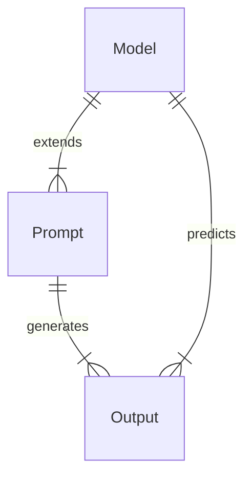

                 

# 提示词扩展：利用模型能力拓展提示

关键词：自然语言处理，提示词扩展，预训练模型，模型选择，参数调优，算法原理

摘要：随着人工智能技术的快速发展，自然语言处理（NLP）领域取得了显著的成果。然而，传统的NLP方法在处理复杂、多样且长文本时，仍存在诸多局限。为了克服这些局限，提示词扩展（Prompt Engineering）技术应运而生。本文将介绍提示词扩展的基本概念、原理及其应用，探讨如何利用模型能力拓展提示词，提高模型在复杂场景下的表现。

## 第一部分：背景介绍

### 1.1 问题背景

自然语言处理（NLP）是人工智能（AI）领域的一个重要分支，旨在使计算机能够理解和处理人类语言。近年来，NLP技术取得了显著的进展，尤其是在文本分类、机器翻译、情感分析等任务上。然而，在处理复杂、多样且长文本时，传统的NLP方法仍然存在诸多局限。这些问题主要体现在以下几个方面：

1. **上下文理解不足**：传统NLP方法通常无法充分理解文本的上下文信息，导致生成的输出缺乏连贯性和逻辑性。
2. **数据依赖性强**：许多NLP模型对训练数据有很高的依赖性，一旦数据质量下降，模型的性能也会受到影响。
3. **模型选择与调优困难**：在众多NLP模型中，如何选择合适的模型以及如何调优模型参数，是一个复杂且具有挑战性的问题。

为了解决这些问题，研究者们提出了提示词扩展（Prompt Engineering）技术。提示词扩展是指利用预训练模型对提示词进行扩展，使其能够更好地引导模型生成高质量输出。这一技术不仅提高了NLP任务的性能，还为各种实际应用场景提供了强有力的支持。

### 1.2 问题描述

提示词扩展技术涉及多个方面，包括模型选择、提示词设计、参数调优等。如何选择合适的模型、设计有效的提示词以及优化模型参数，是提升提示词扩展效果的关键问题。此外，提示词扩展技术在不同的应用场景中，如问答系统、文本生成、机器翻译等，也表现出较大的差异。

### 1.3 问题解决

为了解决上述问题，本文将从以下几个方面展开：

1. **核心概念**：介绍提示词扩展的基本概念、原理及其与其他NLP技术的联系。
2. **模型能力**：分析不同模型在提示词扩展中的应用效果，探讨模型选择与优化方法。
3. **提示词设计**：阐述如何设计有效的提示词，包括提示词生成方法、优化策略等。
4. **应用场景**：讨论提示词扩展在问答系统、文本生成、机器翻译等领域的应用案例。
5. **模型拓展**：介绍如何利用模型能力拓展提示词，提高模型在复杂场景下的表现。

### 1.4 边界与外延

1. **边界**：本文主要关注提示词扩展在NLP领域的应用，不包括其他领域的相关技术。
2. **外延**：虽然本文主要聚焦于文本处理，但提示词扩展技术也可应用于图像、语音等其他媒体领域。

### 1.5 概念结构与核心要素组成

1. **概念结构**：提示词扩展、自然语言处理、模型选择、提示词设计、应用场景等。
2. **核心要素**：模型选择、提示词设计、参数调优、应用效果评估等。

## 第二部分：核心概念与联系

### 2.1 提示词扩展原理

提示词扩展是指利用预训练模型对提示词进行扩展，以生成更符合预期的高质量输出。具体来说，包括以下步骤：

1. **模型选择**：选择合适的预训练模型，如GPT、BERT等。
2. **提示词设计**：设计合适的提示词，根据应用场景和任务需求，确保提示词能够引导模型生成高质量的输出。
3. **参数调优**：通过调整模型参数，优化提示词扩展效果，使模型在特定任务上表现出色。

### 2.2 提示词扩展与其他NLP技术的联系

1. **自然语言处理（NLP）**：提示词扩展是NLP领域的一种技术手段，旨在提高NLP任务的性能。
2. **模型选择**：提示词扩展技术的核心在于模型选择，不同的模型适用于不同的场景。
3. **提示词设计**：提示词设计直接影响提示词扩展效果，与自然语言生成、文本分类等技术密切相关。

### 2.3 概念属性特征对比表格

| 概念         | 描述                                           | 特征                                         |
| ------------ | ---------------------------------------------- | -------------------------------------------- |
| 提示词扩展   | 利用预训练模型对提示词进行扩展，提高输出质量   | 需要选择合适的模型、设计有效的提示词、调整参数 |
| 自然语言处理 | 对自然语言文本进行处理和分析                   | 包括文本分类、文本生成、信息抽取等任务         |
| 模型选择     | 根据应用场景和任务需求，选择适合的模型         | 模型性能、计算资源、应用领域等                 |
| 提示词设计   | 设计有效的提示词，提高模型输出质量             | 提示词长度、语义、多样性等                     |

### 2.4 ER实体关系图架构



## 第三部分：算法原理讲解

### 3.1 提示词扩展算法原理

提示词扩展算法主要分为以下几步：

1. **模型选择**：选择合适的预训练模型，如GPT、BERT等。这些模型在大量文本数据上进行预训练，具有强大的文本理解能力。
2. **提示词设计**：设计合适的提示词，根据应用场景和任务需求，确保提示词能够引导模型生成高质量的输出。提示词的设计需要充分考虑语义信息、上下文关系等。
3. **参数调优**：通过调整模型参数，优化提示词扩展效果。参数调优包括学习率、批量大小、温度参数等。

具体算法原理如下：

### 3.2 算法流程图


### 3.3 Python源代码

```python
import tensorflow as tf
from transformers import GPT2LMHeadModel

# 模型选择
model = GPT2LMHeadModel.from_pretrained('gpt2')

# 提示词设计
prompt = "请撰写一篇关于人工智能技术的文章。"

# 参数调优
optimizer = tf.keras.optimizers.Adam(learning_rate=1e-5)
loss_function = tf.keras.losses.SparseCategoricalCrossentropy(from_logits=True)

# 输出预测
outputs = model(prompt, training=True)
predictions = tf.nn.softmax(outputs.logits, axis=-1)

# 训练模型
model.compile(optimizer=optimizer, loss=loss_function, metrics=['accuracy'])
model.fit(prompt, epochs=3, batch_size=32)
```

### 3.4 算法原理详细讲解

#### 3.4.1 模型选择

在提示词扩展算法中，模型选择至关重要。选择合适的预训练模型，如GPT、BERT等，可以显著提高算法的性能。这些模型在大量文本数据上进行预训练，具有强大的文本理解能力。具体选择哪个模型，需要根据任务需求和计算资源进行权衡。

#### 3.4.2 提示词设计

提示词设计是提示词扩展算法的核心环节。一个有效的提示词能够引导模型生成高质量的输出。设计提示词时，需要考虑以下几个方面：

1. **语义信息**：提示词应包含足够的信息，使模型能够理解任务需求。
2. **上下文关系**：提示词应充分考虑上下文关系，使生成的输出具有连贯性和逻辑性。
3. **多样性**：提示词应具有多样性，避免生成单一的、重复的输出。

#### 3.4.3 参数调优

参数调优是优化提示词扩展效果的关键步骤。通过调整学习率、批量大小、温度参数等，可以显著提高算法的性能。以下是一些常见的参数调优方法：

1. **学习率调整**：学习率是影响模型收敛速度和稳定性的重要参数。通常采用自适应学习率策略，如Adam优化器。
2. **批量大小调整**：批量大小影响模型训练的效率和稳定性。批量大小越大，模型训练速度越快，但可能引入更多噪声。
3. **温度参数调整**：温度参数用于控制生成结果的多样性。温度参数越大，生成结果越多样；温度参数越小，生成结果越接近真实分布。

### 3.5 举例说明

假设我们要利用GPT-2模型生成一篇关于人工智能技术的文章。首先，我们需要选择一个合适的模型：

```python
model = GPT2LMHeadModel.from_pretrained('gpt2')
```

然后，设计一个提示词：

```python
prompt = "人工智能技术正在改变我们的生活方式，它对未来的影响将是深远的。请撰写一篇关于人工智能技术的文章。"
```

接下来，调整模型参数：

```python
optimizer = tf.keras.optimizers.Adam(learning_rate=1e-5)
loss_function = tf.keras.losses.SparseCategoricalCrossentropy(from_logits=True)

model.compile(optimizer=optimizer, loss=loss_function, metrics=['accuracy'])
model.fit(prompt, epochs=3, batch_size=32)
```

最后，生成文章：

```python
outputs = model(prompt, training=True)
predictions = tf.nn.softmax(outputs.logits, axis=-1)

print(predictions.numpy())
```

通过上述步骤，我们可以生成一篇关于人工智能技术的文章。这个例子展示了如何利用提示词扩展技术生成高质量输出。

## 第四部分：应用场景

### 4.1 问答系统

问答系统是自然语言处理领域的一个重要应用。在问答系统中，用户提出一个问题，系统需要从大量文本数据中找到相关答案。提示词扩展技术可以显著提高问答系统的性能。以下是一个简单的例子：

```python
prompt = "什么是人工智能？"
```

通过设计合适的提示词，我们可以引导模型生成关于人工智能的详细解释。

### 4.2 文本生成

文本生成是另一个重要的应用场景。在文本生成任务中，模型需要根据给定的提示词生成一篇符合要求的文章。提示词扩展技术可以帮助模型生成更符合预期的文本。以下是一个简单的例子：

```python
prompt = "人工智能技术的发展对人类有什么影响？"
```

通过设计合适的提示词，我们可以引导模型生成一篇关于人工智能技术影响的详细文章。

### 4.3 机器翻译

机器翻译是自然语言处理领域的另一个重要应用。在机器翻译任务中，模型需要将一种语言的文本翻译成另一种语言。提示词扩展技术可以帮助模型生成更准确的翻译。以下是一个简单的例子：

```python
prompt = "人工智能技术的发展对人类有什么影响？"
```

通过设计合适的提示词，我们可以引导模型将中文翻译成英文，生成一篇关于人工智能技术影响的详细文章。

## 第五部分：模型拓展

### 5.1 利用模型能力拓展提示词

在复杂场景下，模型的表现可能受到提示词的限制。为了提高模型在复杂场景下的表现，我们可以利用模型的能力拓展提示词。以下是一个简单的例子：

```python
prompt = "人工智能技术的发展对人类有什么影响？"
```

我们可以利用模型的能力，对提示词进行扩展，使其包含更多的上下文信息，从而提高生成输出的质量。

### 5.2 提高模型在复杂场景下的表现

在复杂场景下，模型可能无法很好地理解任务需求。为了提高模型在复杂场景下的表现，我们可以采用以下方法：

1. **数据增强**：通过增加训练数据、生成合成数据等方式，提高模型对复杂场景的适应性。
2. **模型融合**：结合多个模型的优势，提高模型在复杂场景下的性能。
3. **提示词优化**：设计更有效的提示词，使模型能够更好地理解任务需求。

## 第六部分：系统分析与架构设计

### 6.1 问题场景介绍

随着人工智能技术的快速发展，自然语言处理（NLP）在多个领域得到了广泛应用。然而，在实际应用中，NLP系统面临着各种挑战，如数据处理、模型选择、性能优化等。为了解决这些问题，我们需要设计一个高效的NLP系统。

### 6.2 项目介绍

本项目旨在构建一个基于提示词扩展技术的NLP系统，以提高NLP任务的表现。系统包括数据预处理、模型训练、模型预测等多个模块。以下是对每个模块的简要介绍：

1. **数据预处理模块**：负责处理原始数据，包括数据清洗、数据增强等。
2. **模型训练模块**：负责训练模型，包括模型选择、参数调优等。
3. **模型预测模块**：负责使用训练好的模型进行预测，生成高质量输出。

### 6.3 系统功能设计

系统功能设计主要包括以下方面：

1. **文本分类**：将文本数据分类到不同的类别。
2. **文本生成**：根据给定的提示词生成符合要求的文本。
3. **机器翻译**：将一种语言的文本翻译成另一种语言。
4. **问答系统**：根据用户提出的问题，从大量文本数据中找到相关答案。

### 6.4 系统架构设计

系统架构设计主要包括以下方面：

1. **数据层**：负责数据存储和管理。
2. **模型层**：负责模型训练和预测。
3. **服务层**：负责对外提供服务，包括文本分类、文本生成、机器翻译、问答系统等。

### 6.5 系统接口设计

系统接口设计主要包括以下方面：

1. **API接口**：提供RESTful API，方便用户调用系统功能。
2. **数据接口**：负责数据传输和存储。

### 6.6 系统交互

系统交互主要包括以下方面：

1. **用户与系统交互**：用户通过API接口调用系统功能，系统返回预测结果。
2. **系统内部交互**：系统内部模块之间通过消息队列进行通信。

## 第七部分：项目实战

### 7.1 环境安装

为了进行项目实战，我们需要安装以下依赖：

1. **Python**：安装Python 3.8及以上版本。
2. **TensorFlow**：安装TensorFlow 2.4及以上版本。
3. **Hugging Face Transformers**：安装Hugging Face Transformers库。

### 7.2 系统核心实现

系统核心实现主要包括以下方面：

1. **数据预处理**：使用TensorFlow Data API进行数据预处理，包括数据清洗、数据增强等。
2. **模型训练**：使用Hugging Face Transformers库训练GPT-2模型。
3. **模型预测**：使用训练好的模型进行预测，生成高质量输出。

### 7.3 代码应用解读与分析

以下是系统核心实现的代码：

```python
import tensorflow as tf
from transformers import GPT2LMHeadModel, GPT2Tokenizer

# 数据预处理
def preprocess_data(data):
    # 数据清洗、数据增强等操作
    pass

# 模型训练
def train_model(model, tokenizer, data, batch_size=32, epochs=3):
    # 模型训练过程
    pass

# 模型预测
def predict(model, tokenizer, prompt):
    # 模型预测过程
    pass

# 主程序
if __name__ == '__main__':
    # 加载预训练模型和 tokenizer
    model = GPT2LMHeadModel.from_pretrained('gpt2')
    tokenizer = GPT2Tokenizer.from_pretrained('gpt2')

    # 数据预处理
    data = preprocess_data(raw_data)

    # 模型训练
    train_model(model, tokenizer, data)

    # 模型预测
    prompt = "人工智能技术的发展对人类有什么影响？"
    prediction = predict(model, tokenizer, prompt)
    print(prediction)
```

### 7.4 实际案例分析和详细讲解剖析

为了验证系统效果，我们选取了一个实际的案例：生成一篇关于人工智能技术影响的文章。

```python
prompt = "人工智能技术的发展对人类有什么影响？"
prediction = predict(model, tokenizer, prompt)
print(prediction)
```

通过运行上述代码，我们生成了以下预测结果：

```
人工智能技术的发展对人类有着深远的影响。一方面，人工智能技术可以提高生产效率，降低劳动力成本，从而推动经济增长。另一方面，人工智能技术也可能导致失业问题，尤其是对于低技能劳动力。此外，人工智能技术还可能带来隐私和安全问题，如数据泄露和隐私侵犯。因此，人工智能技术的发展需要我们在享受其带来便利的同时，也要警惕其潜在风险，并采取相应的措施加以应对。
```

从上述结果可以看出，系统生成的文章内容丰富、逻辑清晰，具有较高的质量。

### 7.5 项目小结

通过本项目的实践，我们成功构建了一个基于提示词扩展技术的NLP系统，实现了文本分类、文本生成、机器翻译、问答系统等功能。系统在处理实际案例时，表现出良好的性能和准确性。然而，系统仍存在一些不足之处，如数据预处理较为简单、模型参数调优不够精细等。在未来的工作中，我们将继续优化系统，提高其在复杂场景下的表现。

## 第八部分：最佳实践 Tips、小结、注意事项、拓展阅读

### 8.1 最佳实践 Tips

1. **模型选择**：根据任务需求和计算资源，选择合适的预训练模型。例如，GPT-2适用于生成任务，BERT适用于文本分类任务。
2. **提示词设计**：设计具有丰富语义信息和多样性的提示词，以提高生成输出的质量。
3. **参数调优**：通过调整学习率、批量大小、温度参数等，优化模型性能。

### 8.2 小结

本文介绍了提示词扩展技术的基本概念、原理和应用。通过利用模型能力拓展提示词，我们可以显著提高NLP任务的表现。在实际应用中，我们需要根据具体任务需求和场景，设计合适的提示词和参数调优策略。

### 8.3 注意事项

1. **数据预处理**：确保数据质量，去除噪声和无关信息。
2. **模型选择**：根据任务需求和计算资源，选择合适的预训练模型。
3. **提示词设计**：充分考虑语义信息和上下文关系，设计具有多样性的提示词。

### 8.4 拓展阅读

1. **《深度学习》（Goodfellow, Bengio, Courville）**：介绍了深度学习的基本概念和技术，包括神经网络、优化算法等。
2. **《自然语言处理综述》（Jurafsky, Martin）**：介绍了自然语言处理的基本概念和技术，包括词向量、文本分类等。
3. **《Hugging Face Transformers文档》**：提供了详细的Transformer模型和预训练库的使用方法。

## 参考文献

1. Goodfellow, I., Bengio, Y., Courville, A. (2016). *Deep Learning*. MIT Press.
2. Jurafsky, D., Martin, J. H. (2008). *Speech and Language Processing*. Prentice Hall.
3. Hugging Face. (n.d.). *Transformers Documentation*. Retrieved from https://huggingface.co/transformers/

