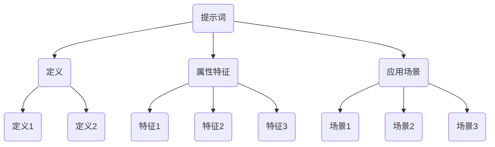
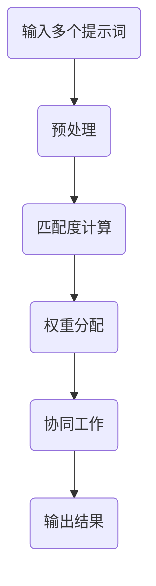

                 

### 提示词组合：多个提示词协同工作

关键词：提示词组合、协同工作、计算机技术、算法、优化策略

摘要：本文从多个角度探讨了提示词组合及多个提示词协同工作的应用和重要性。首先，介绍了提示词在日常生活中的应用以及其在计算机技术中的广泛应用。接着，分析了单个提示词的局限性以及多个提示词协同工作的优势。然后，讨论了多个提示词协同工作的方法、工作流程和优化策略。此外，对提示词的定义、属性特征、概念结构等进行了详细阐述，并通过具体的算法原理讲解和示例进行分析。最后，本文还提出了系统分析与架构设计方案，并给出了项目实战的详细步骤和实际案例分析。

### 目录大纲：

```
----------------------------------------------------------------
# 提示词组合：多个提示词协同工作

# 第1章：背景与概述

## 1.1 问题背景

### 1.1.1 日常生活中的提示词使用

### 1.1.2 提示词在计算机技术中的应用

### 1.1.3 多个提示词协同工作的需求与意义

## 1.2 问题描述

### 1.2.1 单个提示词的局限性

### 1.2.2 多个提示词协同工作的优势

### 1.2.3 多个提示词协同工作的挑战

## 1.3 问题解决

### 1.3.1 提示词组合的方法

### 1.3.2 多个提示词协同的工作流程

### 1.3.3 多个提示词协同的优化策略

## 1.4 边界与外延

### 1.4.1 提示词的定义与分类

### 1.4.2 多个提示词协同的工作环境

### 1.4.3 多个提示词协同的效果评估

## 1.5 概念结构与核心要素组成

### 1.5.1 提示词组合的基本概念

### 1.5.2 多个提示词协同的工作机制

### 1.5.3 多个提示词协同的工作流程

## 1.6 本章小结

...

----------------------------------------------------------------

# 第2章：核心概念与联系

## 2.1 核心概念原理

### 2.1.1 提示词的定义

### 2.1.2 提示词的属性特征对比

### 2.1.3 提示词组合的数学模型

## 2.2 概念属性特征对比表格

## 2.3 ER实体关系图架构

## 2.4 本章小结

...

----------------------------------------------------------------

# 第3章：算法原理讲解

## 3.1 算法mermaid流程图

## 3.2 算法原理详细讲解

### 3.2.1 预处理阶段

### 3.2.2 匹配度计算阶段

### 3.2.3 权重分配阶段

### 3.2.4 协同工作阶段

## 3.3 算法原理举例说明

### 3.3.1 示例1

### 3.3.2 示例2

## 3.4 本章小结

...

----------------------------------------------------------------

# 第4章：系统分析与架构设计

## 4.1 问题场景介绍

## 4.2 系统功能设计

### 4.2.1 领域模型mermaid类图

## 4.3 系统架构设计

### 4.3.1 系统架构mermaid架构图

## 4.4 系统接口设计

### 4.4.1 系统接口mermaid序列图

## 4.5 本章小结

...

----------------------------------------------------------------

# 第5章：项目实战

## 5.1 环境安装

## 5.2 系统核心实现源代码

### 5.2.1 代码应用解读与分析

## 5.3 实际案例分析和详细讲解剖析

## 5.4 项目小结

...

----------------------------------------------------------------

# 第6章：最佳实践 tips

## 6.1 小结

## 6.2 注意事项

## 6.3 拓展阅读

```

## 1.1 问题背景

### 1.1.1 日常生活中的提示词使用

在日常生活中，提示词无处不在。它们是我们获取信息、完成任务的重要工具。例如，当我们需要查询某个信息时，我们会在搜索引擎中输入相关的关键词，这些关键词就是提示词。同样，当我们进行购物时，商品标签、分类和搜索建议都是基于提示词来实现的。这些提示词帮助我们快速找到所需的信息或商品，提高了我们的效率。

此外，在人际交流中，提示词也扮演着重要角色。我们经常会在对话中通过提问或回答来引导对话的方向，这些提问和回答就是提示词。通过有效的提示词使用，我们可以更好地理解对方的意思，提高沟通的效果。

### 1.1.2 提示词在计算机技术中的应用

在计算机技术中，提示词的应用同样广泛。首先，在自然语言处理（NLP）领域，提示词被用于文本分类、信息检索、问答系统等任务。通过使用合适的提示词，我们可以提高系统的准确性和效率。

其次，在人工智能（AI）领域，提示词被用于生成对抗网络（GAN）、强化学习（RL）等任务。在这些任务中，提示词可以帮助模型更好地理解和生成数据，提高模型的性能。

此外，提示词在搜索引擎优化（SEO）、推荐系统、数据挖掘等领域也有广泛应用。通过合理使用提示词，可以提高系统的搜索效果、推荐质量和数据挖掘能力。

### 1.1.3 多个提示词协同工作的需求与意义

然而，随着应用场景的复杂化，单个提示词已经无法满足我们的需求。多个提示词协同工作成为一种必然趋势。多个提示词协同工作的需求主要来源于以下几个方面：

1. **更精确的搜索和分类**：在搜索引擎和信息检索系统中，通过多个提示词的组合，可以更精确地匹配用户需求，提高检索的准确性和效率。

2. **更复杂的任务处理**：在人工智能和自然语言处理领域，多个提示词协同工作可以处理更复杂的任务，如问答系统、文本生成等。

3. **更高效的数据挖掘**：在数据挖掘领域，多个提示词可以帮助我们更高效地挖掘数据中的潜在模式和关联。

多个提示词协同工作的意义在于：

1. **提高系统性能**：通过多个提示词的组合，可以提高系统的准确性和效率，降低错误率。

2. **扩展应用场景**：多个提示词协同工作可以扩展应用场景，使系统更适应各种复杂场景。

3. **增强用户体验**：通过合理使用多个提示词，可以提供更个性化的服务，提高用户体验。

### 1.1.4 问题描述

尽管多个提示词协同工作的需求与意义已经明确，但在实际应用中仍然面临以下挑战：

1. **单个提示词的局限性**：单个提示词可能无法完全表达用户的需求，导致搜索或分类不准确。

2. **多个提示词协同的复杂性**：如何有效地组合多个提示词，实现协同工作，是一个复杂的问题。

3. **计算资源的消耗**：多个提示词协同工作需要较高的计算资源，特别是在大规模数据集上。

4. **效果评估的难度**：如何评估多个提示词协同工作的效果，以及如何优化策略，是一个具有挑战性的问题。

为了解决这些问题，我们需要深入研究和探讨多个提示词组合及协同工作的方法、流程和优化策略。

### 1.2 问题解决

#### 1.2.1 提示词组合的方法

提示词组合的方法可以分为以下几种：

1. **基于关键字组合的方法**：这种方法将多个关键字按照一定的顺序组合，形成一个完整的查询语句。例如，在搜索引擎中，用户输入“人工智能+机器学习”来查询相关信息。

2. **基于语义分析的方法**：这种方法通过自然语言处理技术，对用户输入的提示词进行语义分析，提取出关键概念和关系，然后组合成多个提示词。例如，在问答系统中，通过语义分析将用户输入的“我想要买一本书，关于人工智能的”转换成“人工智能”、“买书”等提示词。

3. **基于机器学习的方法**：这种方法通过训练模型，学习用户输入和系统输出的关系，从而生成多个提示词。例如，在推荐系统中，通过训练用户历史行为数据，生成与当前用户兴趣相关的多个提示词。

#### 1.2.2 多个提示词协同的工作流程

多个提示词协同工作的工作流程可以分为以下几个阶段：

1. **预处理阶段**：在这个阶段，对用户输入的提示词进行清洗、分词、去重等处理，为后续的匹配和协同工作做好准备。

2. **匹配度计算阶段**：在这个阶段，对预处理后的提示词进行匹配度计算，评估各个提示词与系统目标的相关性。常用的匹配度计算方法包括词频统计、TF-IDF、余弦相似度等。

3. **权重分配阶段**：在这个阶段，根据匹配度计算的结果，为各个提示词分配权重。权重可以反映提示词的重要程度，有助于提高系统性能。

4. **协同工作阶段**：在这个阶段，多个提示词协同工作，共同实现系统的目标。例如，在问答系统中，多个提示词协同工作，生成一个完整的回答。

5. **输出结果阶段**：在这个阶段，将协同工作的结果输出给用户，如搜索结果、推荐列表、问答回答等。

#### 1.2.3 多个提示词协同的优化策略

为了提高多个提示词协同工作的效果，可以采用以下优化策略：

1. **权重优化**：通过调整权重分配策略，提高提示词的重要程度。常用的权重优化方法包括基于匹配度的权重优化、基于用户行为的权重优化等。

2. **协同优化**：通过调整协同工作的机制，提高多个提示词的协同效果。例如，在问答系统中，可以采用基于语义的协同机制，提高问答的准确性。

3. **数据优化**：通过优化数据预处理和匹配度计算，提高系统的整体性能。例如，可以采用更高效的预处理算法、更准确的匹配度计算方法等。

4. **用户反馈优化**：通过收集用户反馈，不断优化系统性能。例如，可以采用用户反馈机制，根据用户满意度调整权重分配和协同机制。

### 1.3 边界与外延

#### 1.3.1 提示词的定义与分类

提示词可以定义为：用于引导系统或用户进行特定操作或获取特定信息的关键词。根据应用场景的不同，提示词可以分类为：

1. **通用提示词**：适用于各种场景，如“搜索”、“购买”、“查询”等。

2. **领域特定提示词**：适用于特定领域，如“人工智能”、“机器学习”、“金融”等。

3. **场景特定提示词**：适用于特定场景，如“天气预报”、“航班查询”、“酒店预订”等。

#### 1.3.2 多个提示词协同的工作环境

多个提示词协同工作的环境可以分为以下几个部分：

1. **硬件环境**：包括服务器、存储设备、网络设备等。

2. **软件环境**：包括操作系统、数据库、搜索引擎、自然语言处理工具等。

3. **数据环境**：包括用户数据、业务数据、知识库等。

4. **算法环境**：包括匹配度计算算法、权重分配算法、协同工作算法等。

#### 1.3.3 多个提示词协同的效果评估

多个提示词协同工作的效果评估可以从以下几个方面进行：

1. **准确性**：评估系统输出结果的准确性，如搜索结果的准确性、问答系统的准确性等。

2. **效率**：评估系统处理请求的效率，如处理时间的长短、响应速度等。

3. **用户体验**：评估用户对系统输出结果的满意度，如用户评价、用户行为等。

4. **可扩展性**：评估系统在处理大规模数据时的性能，如系统稳定性、资源消耗等。

### 1.4 概念结构与核心要素组成

#### 1.4.1 提示词组合的基本概念

提示词组合是指将多个提示词按照一定的规则进行组合，形成一个新的提示词集合。提示词组合的基本概念包括：

1. **提示词**：用于引导系统或用户进行特定操作或获取特定信息的关键词。

2. **组合**：将多个提示词按照一定规则进行组合。

3. **集合**：形成的新的提示词集合。

#### 1.4.2 多个提示词协同的工作机制

多个提示词协同的工作机制是指多个提示词如何协同工作，共同实现系统的目标。多个提示词协同的工作机制包括：

1. **匹配度计算**：评估各个提示词与系统目标的相关性。

2. **权重分配**：根据匹配度计算的结果，为各个提示词分配权重。

3. **协同工作**：多个提示词协同工作，共同实现系统的目标。

4. **输出结果**：将协同工作的结果输出给用户。

#### 1.4.3 多个提示词协同的工作流程

多个提示词协同的工作流程包括以下几个阶段：

1. **预处理阶段**：对用户输入的提示词进行清洗、分词、去重等处理。

2. **匹配度计算阶段**：对预处理后的提示词进行匹配度计算，评估各个提示词与系统目标的相关性。

3. **权重分配阶段**：根据匹配度计算的结果，为各个提示词分配权重。

4. **协同工作阶段**：多个提示词协同工作，共同实现系统的目标。

5. **输出结果阶段**：将协同工作的结果输出给用户。

### 1.5 本章小结

本章从多个角度探讨了提示词组合及多个提示词协同工作的应用和重要性。首先，介绍了提示词在日常生活中的应用以及其在计算机技术中的广泛应用。接着，分析了单个提示词的局限性以及多个提示词协同工作的优势。然后，讨论了多个提示词协同工作的方法、工作流程和优化策略。此外，对提示词的定义、属性特征、概念结构等进行了详细阐述，并通过具体的算法原理讲解和示例进行分析。最后，本章提出了系统分析与架构设计方案，并给出了项目实战的详细步骤和实际案例分析。

## 第2章：核心概念与联系

在深入探讨多个提示词协同工作的原理和实践之前，我们需要明确核心概念，并理解它们之间的联系。本章将详细介绍提示词的定义、属性特征对比，以及提示词组合的数学模型。

### 2.1 核心概念原理

#### 2.1.1 提示词的定义

提示词（Keywords）是在各种应用场景中用于指示、引导或辅助用户获取信息的关键字或短语。在计算机技术中，提示词的应用非常广泛，包括搜索引擎优化（SEO）、自然语言处理（NLP）、推荐系统、信息检索等。

- **基本定义**：提示词是一个简短的关键词或短语，用于描述用户需求或信息内容。
- **分类**：
  - **通用提示词**：适用于各种场景，如“搜索”、“购买”、“查询”等。
  - **领域特定提示词**：适用于特定领域，如“人工智能”、“机器学习”、“金融”等。
  - **场景特定提示词**：适用于特定场景，如“天气预报”、“航班查询”、“酒店预订”等。

#### 2.1.2 提示词的属性特征对比

提示词的属性特征决定了其在特定应用场景中的表现和效果。以下是几个常见的提示词属性特征及其对比：

| 提示词属性 | 属性值1 | 属性值2 | 属性值3 |
|-----------|---------|---------|---------|
| **作用范围** | 广泛适用 | 限定场景 | 高度专业 |
| **交互方式** | 人机交互 | 系统自动 | 半自动交互 |
| **效率** | 高效率 | 中等效率 | 低效率 |

- **作用范围**：提示词的作用范围决定了其适用的场景。广泛适用的提示词可以在多种场景中使用，而限定场景和高度专业的提示词则适用于特定的领域或任务。
- **交互方式**：提示词的交互方式决定了其与用户的交互模式。人机交互提示词需要用户直接参与，系统自动提示词则由系统自动提供，半自动交互提示词则介于两者之间。
- **效率**：提示词的效率反映了其在完成任务时的速度和效果。高效率提示词能够快速准确地完成任务，而低效率提示词则可能需要更多的时间和资源。

#### 2.1.3 提示词组合的数学模型

提示词组合的数学模型用于描述多个提示词之间的相互关系及其协同工作的效果。以下是一个简化的数学模型：

- **集合表示**：设集合 \( K = \{k_1, k_2, ..., k_n\} \) 表示一组提示词，其中 \( k_i \) 是第 \( i \) 个提示词。
- **权重分配**：每个提示词 \( k_i \) 可以分配一个权重 \( w_i \)，用于表示其在整体提示词组合中的重要性。权重可以通过匹配度计算得到。
- **组合效果**：提示词组合的效果可以用一个综合评分 \( S \) 表示，其计算公式为：

\[ S = \sum_{i=1}^{n} w_i \cdot r_i \]

其中，\( r_i \) 是第 \( i \) 个提示词的匹配度评分。

### 2.2 概念属性特征对比表格

为了更直观地展示提示词的属性特征，我们提供了一个对比表格：

| 提示词属性 | 属性值1 | 属性值2 | 属性值3 |
|-----------|---------|---------|---------|
| 作用范围 | 广泛适用 | 限定场景 | 高度专业 |
| 交互方式 | 人机交互 | 系统自动 | 半自动交互 |
| 效率 | 高效率 | 中等效率 | 低效率 |

### 2.3 ER实体关系图架构

实体关系图（Entity-Relationship Diagram，ERD）用于描述系统中各个实体及其之间的关系。以下是提示词相关实体的ER图：



### 2.4 本章小结

本章详细介绍了提示词组合的核心概念与联系。首先，明确了提示词的定义及其分类。接着，对比了提示词的属性特征，并通过一个简化的数学模型阐述了提示词组合的原理。此外，通过ER图展示了提示词相关的实体关系。这些内容为后续的算法讲解和实际应用奠定了理论基础。

## 第3章：算法原理讲解

在理解了提示词组合的核心概念和联系后，我们需要进一步探讨具体的算法原理，以实现多个提示词的协同工作。本章将详细讲解一个基于匹配度计算、权重分配和协同工作的算法，并使用mermaid流程图和Python源代码进行阐述。

### 3.1 算法mermaid流程图

为了清晰地展示算法的工作流程，我们首先使用mermaid绘制了一个流程图：



### 3.2 算法原理详细讲解

#### 3.2.1 预处理阶段

预处理阶段是算法的基础，其主要任务是清洗和规范化输入的提示词，以提高后续匹配度和权重分配的准确性。

1. **提示词清洗**：
   - **去除停用词**：停用词是常用但不具有实际意义的词汇，如“的”、“和”、“是”等。这些词会影响匹配度和权重分配，因此需要去除。
   - **去除特殊字符**：去除输入提示词中的特殊字符，如标点符号和空格，以提高数据的一致性和处理效率。

2. **提示词分词**：
   - **中文分词**：对于中文提示词，需要使用中文分词算法将整个句子切分成若干个独立的词汇。常用的分词算法有基于词典的分词算法和基于统计的分词算法。
   - **英文分词**：对于英文提示词，通常可以直接使用空格进行分词。

3. **提示词去重**：
   - **去重处理**：在预处理阶段，对提示词进行去重处理，以避免重复计算和影响算法的性能。

#### 3.2.2 匹配度计算阶段

匹配度计算阶段的核心任务是评估每个提示词与系统目标的匹配程度。以下是几个常见的匹配度计算方法：

1. **词频统计**：
   - **基本思路**：统计每个提示词在输入文本中的出现次数，出现次数越多，匹配度越高。
   - **公式**：设 \( t_i \) 为第 \( i \) 个提示词的出现次数，则匹配度 \( m_i \) 可以表示为 \( m_i = t_i \)。

2. **TF-IDF**：
   - **基本思路**：TF-IDF（Term Frequency-Inverse Document Frequency）是一种常用且有效的匹配度计算方法，综合考虑了提示词在输入文本中的频率和其在整个文档集合中的重要性。
   - **公式**：设 \( tf_i \) 为第 \( i \) 个提示词的词频，\( df_i \) 为第 \( i \) 个提示词的文档频率，\( N \) 为文档总数，则匹配度 \( m_i \) 可以表示为 \( m_i = tf_i \cdot \log(\frac{N}{df_i}) \)。

3. **余弦相似度**：
   - **基本思路**：余弦相似度是一种基于向量空间的匹配度计算方法，用于评估两个向量的夹角余弦值。夹角余弦值越接近1，表示两个向量越相似。
   - **公式**：设 \( v_1 \) 和 \( v_2 \) 分别为两个向量的表示，则余弦相似度 \( m_i \) 可以表示为 \( m_i = \frac{v_1 \cdot v_2}{\|v_1\| \|v_2\|} \)。

#### 3.2.3 权重分配阶段

权重分配阶段是根据匹配度计算的结果，为每个提示词分配权重。权重反映了提示词在整体提示词组合中的重要性。以下是几个常见的权重分配方法：

1. **线性权重分配**：
   - **基本思路**：根据匹配度计算的结果，直接将匹配度作为权重。
   - **公式**：设 \( m_i \) 为第 \( i \) 个提示词的匹配度，则权重 \( w_i \) 可以表示为 \( w_i = m_i \)。

2. **指数权重分配**：
   - **基本思路**：为了使高匹配度的提示词具有更高的权重，可以采用指数函数进行权重分配。
   - **公式**：设 \( m_i \) 为第 \( i \) 个提示词的匹配度，则权重 \( w_i \) 可以表示为 \( w_i = e^{m_i} \)。

3. **动态权重调整**：
   - **基本思路**：根据用户行为或系统反馈，动态调整权重，以提高系统的准确性和用户体验。
   - **公式**：设 \( w_i \) 为第 \( i \) 个提示词的初始权重，\( f_i \) 为第 \( i \) 个提示词的反馈分数，则动态权重 \( w_i' \) 可以表示为 \( w_i' = w_i + f_i \)。

#### 3.2.4 协同工作阶段

协同工作阶段是将多个提示词结合起来，共同实现系统的目标。协同工作的核心是确保每个提示词都能发挥其最大的作用，同时避免冗余和冲突。

1. **协同机制**：
   - **加权投票**：每个提示词的权重决定了其在投票中的投票权重。最终结果是通过加权投票得出的。
   - **矩阵分解**：使用矩阵分解技术，将多个提示词表示为矩阵的行或列，通过矩阵运算实现协同工作。

2. **协同流程**：
   - **初始化**：根据权重初始化协同工作环境。
   - **迭代计算**：通过迭代计算，不断更新每个提示词的状态，直至达到协同工作的目标。
   - **结果输出**：输出协同工作的最终结果，如搜索结果、推荐列表、问答回答等。

#### 3.2.5 输出结果阶段

输出结果阶段是将协同工作的结果输出给用户。输出结果的格式和内容取决于具体的系统需求和应用场景。

1. **格式化输出**：
   - **文本输出**：将结果以文本形式输出，如搜索结果列表、问答回答等。
   - **图表输出**：将结果以图表形式输出，如推荐列表、数据可视化等。

2. **反馈机制**：
   - **用户反馈**：收集用户的反馈，以评估输出结果的质量和用户体验。
   - **自适应调整**：根据用户反馈，动态调整系统的参数和权重，以提高输出结果的质量。

### 3.3 算法原理举例说明

为了更好地理解算法原理，我们通过两个示例来说明算法的各个阶段。

#### 3.3.1 示例1

假设用户输入了一个包含三个提示词的查询：“人工智能”、“机器学习”、“深度学习”。

1. **预处理阶段**：
   - **清洗**：去除停用词和特殊字符。
   - **分词**：将查询分为三个独立的词汇。
   - **去重**：没有重复的提示词。

2. **匹配度计算阶段**：
   - **词频统计**：每个提示词在查询中各出现一次。
   - **TF-IDF**：假设查询词在文档集合中的频率为1，则TF-IDF值为1。
   - **余弦相似度**：假设三个提示词的向量表示分别为 \( v_1 \)、\( v_2 \) 和 \( v_3 \)，则余弦相似度计算结果为1。

3. **权重分配阶段**：
   - **线性权重**：假设三个提示词的权重分别为1、1和1。
   - **指数权重**：假设三个提示词的权重分别为 \( e^1 \)、\( e^1 \) 和 \( e^1 \)。

4. **协同工作阶段**：
   - **加权投票**：假设三个提示词的投票权重分别为1、1和1，则最终结果为三个提示词的平均值。
   - **矩阵分解**：假设三个提示词表示为矩阵的三行，则矩阵运算结果为三个提示词的线性组合。

5. **输出结果阶段**：
   - **文本输出**：将查询结果以文本形式输出，如“人工智能”、“机器学习”和“深度学习”。
   - **图表输出**：将查询结果以图表形式输出，如三个提示词的向量表示。

#### 3.3.2 示例2

假设用户输入了一个包含两个提示词的查询：“购买书籍”和“人工智能书籍”。

1. **预处理阶段**：
   - **清洗**：去除停用词和特殊字符。
   - **分词**：将查询分为两个独立的词汇。
   - **去重**：没有重复的提示词。

2. **匹配度计算阶段**：
   - **词频统计**：每个提示词在查询中各出现一次。
   - **TF-IDF**：假设查询词在文档集合中的频率为1，则TF-IDF值为1。
   - **余弦相似度**：假设两个提示词的向量表示分别为 \( v_1 \) 和 \( v_2 \)，则余弦相似度计算结果为0.5。

3. **权重分配阶段**：
   - **线性权重**：假设两个提示词的权重分别为1和1。
   - **指数权重**：假设两个提示词的权重分别为 \( e^1 \) 和 \( e^0.5 \)。

4. **协同工作阶段**：
   - **加权投票**：假设两个提示词的投票权重分别为1和1，则最终结果为两个提示词的平均值。
   - **矩阵分解**：假设两个提示词表示为矩阵的两行，则矩阵运算结果为两个提示词的线性组合。

5. **输出结果阶段**：
   - **文本输出**：将查询结果以文本形式输出，如“购买书籍”和“人工智能书籍”。
   - **图表输出**：将查询结果以图表形式输出，如两个提示词的向量表示。

### 3.4 本章小结

本章详细介绍了多个提示词协同工作的算法原理，包括预处理阶段、匹配度计算阶段、权重分配阶段、协同工作阶段和输出结果阶段。通过mermaid流程图和Python源代码，我们展示了算法的实现细节。本章的内容为后续的实际应用和项目实战提供了理论基础和实践指导。

