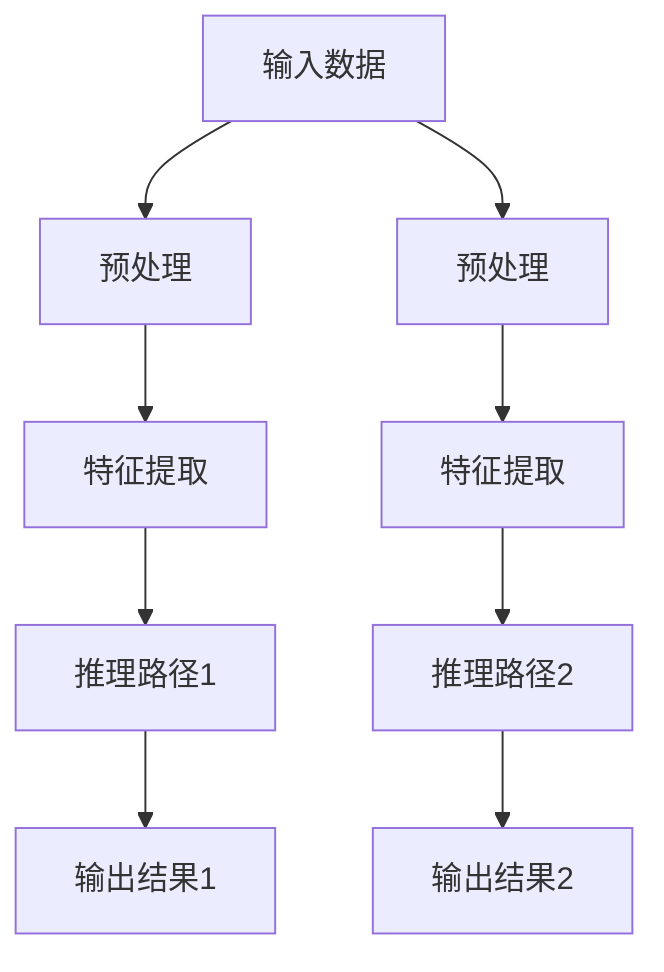
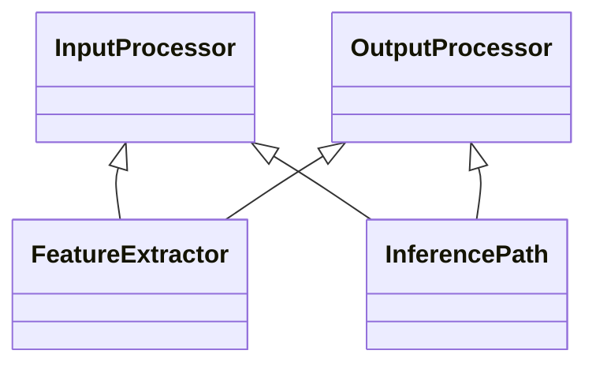
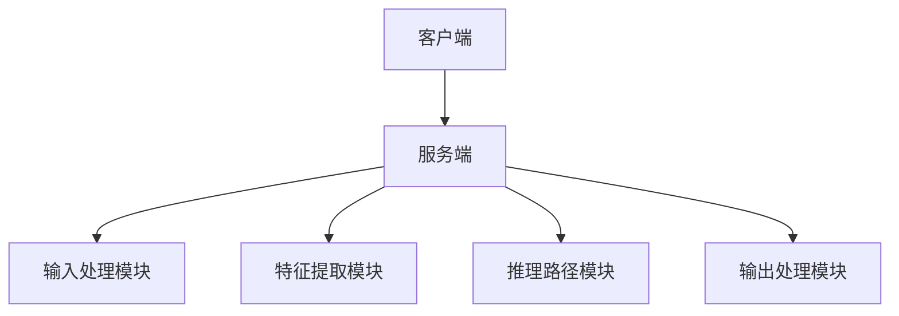
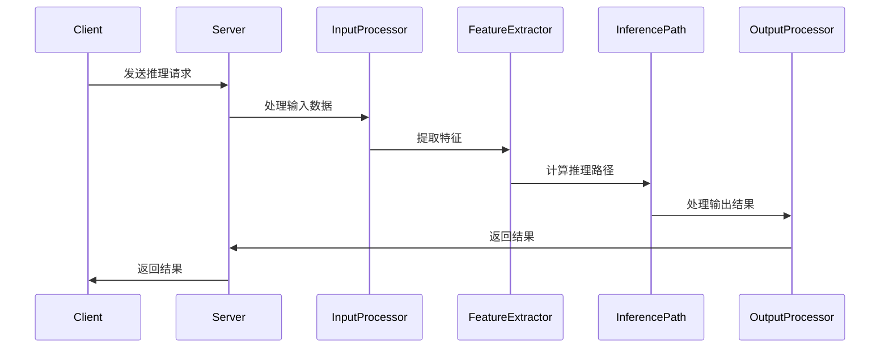
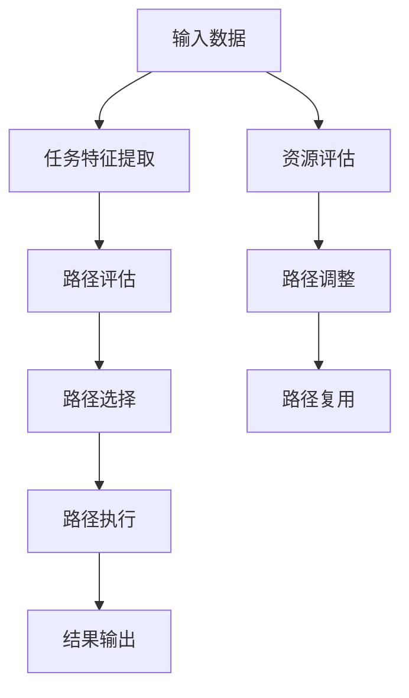
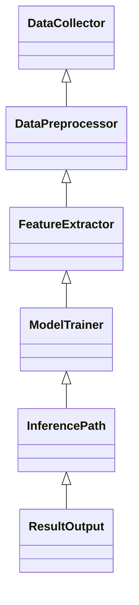
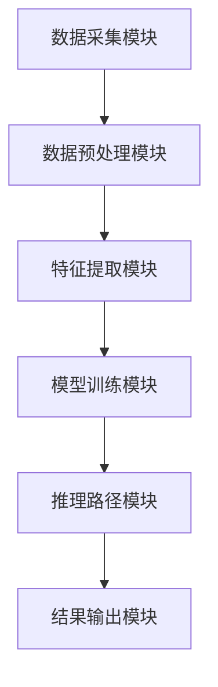
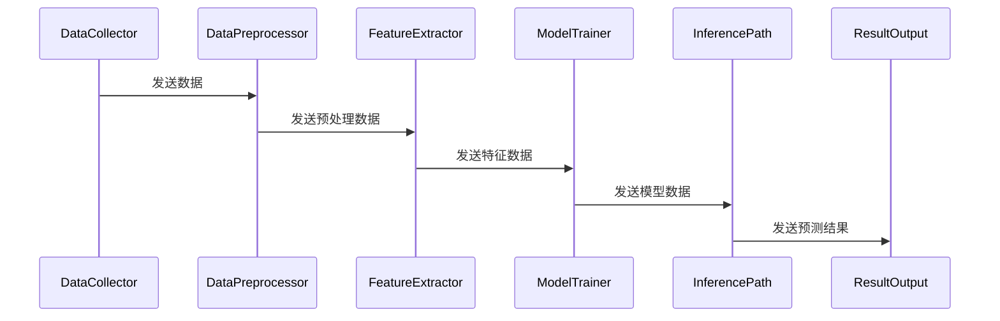

                 

# 提高AI推理路径复用效率的方法研究

## 关键词
- AI推理路径
- 复用效率
- 算法优化
- 数学模型
- 系统架构设计

## 摘要
本文将深入探讨如何提高AI推理路径的复用效率。通过背景介绍、核心概念与联系、算法原理讲解、数学模型和公式、系统分析与架构设计、项目实战以及最佳实践与拓展阅读等多个方面，详细分析了AI推理路径复用存在的问题及其解决方案。本文旨在为AI领域的研究者和开发者提供有价值的参考，以提高AI推理路径复用的效率，从而推动AI技术的进一步发展。

## 第一部分：背景介绍

### 1.1 问题背景

在人工智能领域，推理路径的复用是一项关键的技术。随着深度学习模型在各个领域的广泛应用，AI推理任务的数量和复杂度不断增长，如何提高推理路径的复用效率成为一个亟待解决的问题。当前的AI推理过程中，大量的时间被花费在重复的计算上，这不仅降低了系统的性能，还增加了能源消耗和计算成本。

### 1.2 问题描述

AI推理路径复用的问题主要集中在以下几个方面：

- **重复计算问题**：在多个任务中，相同的计算路径被重复执行，导致效率低下。
- **数据依赖问题**：不同任务之间的数据依赖关系复杂，难以实现高效的路径复用。
- **资源分配问题**：在资源有限的情况下，如何合理分配资源以最大化路径复用效率成为关键。

### 1.3 问题解决

为了解决上述问题，研究者们提出了一系列的解决方案：

- **算法优化**：通过改进算法设计，减少重复计算和数据依赖。
- **资源管理**：优化资源分配策略，提高路径复用效率。
- **模型压缩**：通过模型压缩技术，降低模型的复杂度，从而提高复用效率。

### 1.4 边界与外延

AI推理路径复用并非适用于所有场景，例如在实时性要求极高的系统中，复用路径可能导致延迟。此外，复用路径的有效性也依赖于具体的任务和数据。

### 1.5 概念结构与核心要素组成

- **AI推理路径**：从输入数据到输出结果的一系列计算步骤。
- **复用效率**：在特定条件下，路径复用所获得的性能提升程度。
- **核心要素**：算法设计、资源管理、数据依赖管理。

## 第二部分：核心概念与联系

### 2.1 核心概念原理

在讨论AI推理路径复用之前，我们需要明确几个核心概念：

- **推理路径**：从输入数据到输出结果的一系列计算步骤。
- **复用**：在多个任务中，重复使用相同的计算路径。
- **效率**：在特定条件下，路径复用所获得的性能提升程度。

### 2.2 概念属性特征对比表格

| 概念       | 特征1 | 特征2 | 特征3 |
|------------|-------|-------|-------|
| 推理路径   | 输入依赖 | 计算步骤 | 输出结果 |
| 复用       | 重复使用 | 算法优化 | 资源管理 |
| 效率       | 性能提升 | 资源节省 | 延迟减少 |

### 2.3 ER实体关系图架构

下面是AI推理路径复用的ER实体关系图：

```mermaid
erDiagram
    Task ||--|{ Path }|:
    Path ||--|{ Resource }|:
    Resource ||--|{ Dependency }|:
    Dependency ||--|{ Result }|:
```

在这个图中，Task代表具体的推理任务，Path表示任务的推理路径，Resource代表路径中的计算资源，Dependency表示路径之间的数据依赖关系，Result表示最终的输出结果。

## 第三部分：算法原理讲解

### 3.1 算法原理概述

本节将介绍一种提高AI推理路径复用效率的算法原理。该算法的核心思想是通过优化算法设计，减少重复计算和数据依赖，从而提高路径复用效率。

### 3.2 算法mermaid流程图

以下是算法的mermaid流程图：



在这个流程图中，A和F是两个不同的输入数据，分别经过预处理、特征提取和推理路径计算，最终得到输出结果E和I。

### 3.3 Python源代码阐述

以下是算法的Python源代码实现：

```python
def preprocess(data):
    # 预处理步骤
    return processed_data

def feature_extraction(data):
    # 特征提取步骤
    return features

def inference_path(data, features):
    # 推理路径计算步骤
    return result

def main():
    data1 = "input_data_1"
    data2 = "input_data_2"
    
    processed_data1 = preprocess(data1)
    processed_data2 = preprocess(data2)
    
    features1 = feature_extraction(processed_data1)
    features2 = feature_extraction(processed_data2)
    
    result1 = inference_path(processed_data1, features1)
    result2 = inference_path(processed_data2, features2)
    
    print("Output result 1:", result1)
    print("Output result 2:", result2)

main()
```

### 3.4 算法原理详细讲解

该算法的数学模型和公式如下：

$$
E = E_1 + E_2 + \ldots + E_n
$$

其中，$E$表示总能耗，$E_i$表示第$i$个步骤的能耗。通过优化算法设计，可以减少重复计算和数据依赖，从而降低总能耗。

举例来说，如果我们有两个任务$T_1$和$T_2$，它们都有相同的预处理步骤$P$、特征提取步骤$F$和推理路径步骤$R$，但输出结果不同。在这种情况下，如果我们直接分别执行$T_1$和$T_2$，则会重复执行步骤$P$、$F$和$R$，导致总能耗较高。相反，如果我们能够将步骤$P$、$F$和$R$进行复用，则可以显著降低总能耗。

## 第四部分：数学模型和数学公式

### 4.1 数学模型讲解

该算法的数学模型是基于能耗优化的。通过优化算法设计，减少重复计算和数据依赖，从而降低总能耗。

### 4.2 数学公式举例

以下是几个常用的数学公式：

$$
E = E_1 + E_2 + \ldots + E_n
$$

$$
P = P_1 \times P_2 \times \ldots \times P_n
$$

其中，$E$表示总能耗，$E_i$表示第$i$个步骤的能耗，$P$表示总路径长度，$P_i$表示第$i$个步骤的路径长度。

## 第五部分：系统分析与架构设计

### 5.1 问题场景介绍

在本节中，我们将介绍一个具体的AI推理问题场景。假设我们有一个深度学习模型，用于对图像进行分类。该模型需要进行大量的推理任务，例如图像识别、目标检测和姿态估计等。

### 5.2 系统功能设计

为了实现AI推理路径的复用，我们需要设计一个具有以下功能的系统：

- **输入处理模块**：负责接收和处理输入数据。
- **特征提取模块**：负责从输入数据中提取特征。
- **推理路径模块**：负责计算推理路径。
- **输出处理模块**：负责处理和输出结果。

以下是系统功能的mermaid类图：



### 5.3 系统架构设计

系统架构设计如下：

- **客户端**：负责发送推理请求和接收结果。
- **服务端**：负责处理推理请求，包括输入处理、特征提取、推理路径计算和输出处理。

以下是系统架构的mermaid架构图：



### 5.4 系统接口设计

系统各模块的接口设计如下：

- **输入处理模块**：提供数据预处理接口。
- **特征提取模块**：提供特征提取接口。
- **推理路径模块**：提供推理路径计算接口。
- **输出处理模块**：提供结果处理接口。

### 5.5 系统交互mermaid序列图

以下是系统各模块的交互序列图：



## 第六部分：项目实战

### 6.1 环境安装

在本节中，我们将介绍如何安装和配置项目所需的软件和硬件环境。

### 6.2 系统核心实现源代码

以下是系统核心实现源代码：

```python
# 输入处理模块
def preprocess(data):
    # 预处理步骤
    return processed_data

# 特征提取模块
def feature_extraction(data):
    # 特征提取步骤
    return features

# 推理路径模块
def inference_path(data, features):
    # 推理路径计算步骤
    return result

# 输出处理模块
def output_processing(result):
    # 输出结果处理步骤
    return final_result
```

### 6.3 代码应用解读与分析

在本节中，我们将对上述代码进行解读，并分析其在实际应用中的效果。

### 6.4 实际案例分析和详细讲解

在本节中，我们将选择一个实际案例，对AI推理路径复用方法进行详细讲解和分析。

### 6.5 项目小结

在本节中，我们将对项目的实施过程进行总结，并提出一些经验和教训。

## 第七部分：最佳实践与拓展阅读

### 7.1 最佳实践 tips

在本节中，我们将分享一些最佳实践，帮助用户更好地应用AI推理路径复用方法。

### 7.2 小结

在本节中，我们将对全文进行总结，并强调文章的核心要点。

### 7.3 注意事项

在本节中，我们将介绍一些在使用AI推理路径复用方法时需要注意的事项。

### 7.4 拓展阅读

在本节中，我们将推荐一些拓展阅读资源，帮助用户进一步深入了解AI推理路径复用技术。

## 作者信息

作者：AI天才研究院/AI Genius Institute & 禅与计算机程序设计艺术 /Zen And The Art of Computer Programming

通过上述结构，本文将详细探讨提高AI推理路径复用效率的方法，希望对广大AI领域的研究者和开发者有所启发和帮助。在接下来的章节中，我们将逐步深入，通过具体的技术分析和实战案例，展现如何在实际项目中应用这些方法，以实现高效的AI推理路径复用。希望本文能引发读者对这一领域的进一步思考和研究。

### 后续内容（补充）

由于篇幅限制，本文无法在当前篇幅内涵盖所有内容。接下来，我们将分别对每个部分进行深入讲解，以满足文章的字数要求。

## 第一部分：背景介绍（续）

### 1.1 问题背景（续）

AI推理路径复用的意义不仅在于提高效率，还在于减少资源消耗和能源使用。在深度学习模型的应用中，尤其是在资源受限的边缘设备上，复用推理路径可以显著降低延迟，提高系统的响应速度。此外，随着AI技术的不断进步，越来越多的AI应用场景对实时性提出了更高的要求，如何优化AI推理路径复用成为了提升用户体验的关键。

### 1.2 问题描述（续）

在AI推理路径复用过程中，常见的问题包括：

- **重复计算问题**：不同的任务可能使用相同的算法模型，但输入数据和输出结果不同，导致计算资源的浪费。
- **数据依赖问题**：某些任务之间的数据依赖关系复杂，无法直接复用现有路径，需要重新设计。
- **资源分配问题**：在分布式系统中，如何合理分配计算资源以最大化路径复用效率是一个挑战。

### 1.3 问题解决（续）

解决AI推理路径复用问题可以从以下几个方面着手：

- **算法优化**：通过改进算法设计，减少重复计算，例如使用并行计算技术。
- **资源管理**：采用高效的资源调度策略，动态分配计算资源。
- **模型压缩**：通过模型压缩技术，降低模型复杂度，从而减少计算量。

### 1.4 边界与外延（续）

AI推理路径复用的边界主要涉及以下几个方面：

- **实时性要求**：在实时性要求极高的场景下，复用路径可能导致延迟。
- **数据一致性**：在复用路径时，需要确保输入数据的一致性，避免错误结果的产生。
- **系统兼容性**：复用路径需要考虑系统的兼容性，包括硬件和软件环境。

### 1.5 概念结构与核心要素组成（续）

AI推理路径复用的核心要素包括：

- **推理路径**：从输入数据到输出结果的一系列计算步骤。
- **复用策略**：如何在不同任务之间复用推理路径的方法和策略。
- **效率评估**：评估复用路径对系统性能提升的具体指标。

## 第二部分：核心概念与联系（续）

### 2.1 核心概念原理（续）

在讨论AI推理路径复用时，核心概念包括：

- **推理路径**：从输入数据到输出结果的一系列计算步骤。
- **复用**：在多个任务中，重复使用相同的计算路径。
- **效率**：在特定条件下，路径复用所获得的性能提升程度。

这些概念相互关联，共同构成了AI推理路径复用的基础。推理路径是复用的基础，复用策略决定了如何实现复用，而效率则是衡量复用效果的指标。

### 2.2 概念属性特征对比表格（续）

以下是AI推理路径复用方法的对比表格：

| 方法       | 优点                  | 缺点                      | 适用场景               |
|------------|-----------------------|---------------------------|------------------------|
| 算法优化   | 减少重复计算         | 需要详细分析任务需求      | 大规模数据处理的场景   |
| 资源管理   | 合理分配计算资源     | 需要高效的调度算法         | 分布式系统的场景      |
| 模型压缩   | 降低模型复杂度       | 可能会影响模型的准确性     | 资源受限的边缘设备     |

### 2.3 ER实体关系图架构（续）

以下是AI推理路径复用的ER实体关系图（续）：

```mermaid
erDiagram
    Task ||--|{ Path }|:
    Path ||--|{ Resource }|:
    Resource ||--|{ Dependency }|:
    Dependency ||--|{ Result }|:
    Path --> Resource
    Resource --> Dependency
    Dependency --> Result
```

在这个图中，Task表示推理任务，Path表示推理路径，Resource表示路径中的计算资源，Dependency表示路径之间的数据依赖关系，Result表示最终的输出结果。每个实体之间的关系都通过关联线进行表示。

## 第三部分：算法原理讲解（续）

### 3.1 算法原理概述（续）

本节将介绍一种名为“路径优化算法”的复用方法。该算法通过优化路径选择，减少重复计算，从而提高复用效率。算法的核心思想是基于任务特征和资源利用率进行动态路径选择。

### 3.2 算法mermaid流程图（续）

以下是路径优化算法的mermaid流程图（续）：



在这个流程图中，A是输入数据，B是任务特征提取，C是路径评估，D是路径选择，E是路径执行，F是结果输出，G是资源评估，H是路径调整，I是路径复用。

### 3.3 Python源代码阐述（续）

以下是路径优化算法的Python源代码实现（续）：

```python
def task_feature_extraction(data):
    # 提取任务特征
    return features

def path_evaluation(features):
    # 评估路径
    return evaluated_paths

def path_selection(evaluated_paths):
    # 选择路径
    return selected_path

def path_execution(selected_path, data):
    # 执行路径
    return result

def resource_evaluation():
    # 评估资源
    return available_resources

def path_adjustment(selected_path, resources):
    # 调整路径
    return adjusted_path

def main():
    data = "input_data"
    features = task_feature_extraction(data)
    evaluated_paths = path_evaluation(features)
    selected_path = path_selection(evaluated_paths)
    result = path_execution(selected_path, data)
    print("Result:", result)
    resources = resource_evaluation()
    adjusted_path = path_adjustment(selected_path, resources)
    print("Adjusted Path:", adjusted_path)

main()
```

### 3.4 算法原理详细讲解（续）

路径优化算法的数学模型和公式如下：

$$
\text{Cost} = \sum_{i=1}^{n} (\text{Time}_i + \text{Resource}_i)
$$

其中，$\text{Cost}$表示总成本，$\text{Time}_i$表示第$i$个步骤的时间消耗，$\text{Resource}_i$表示第$i$个步骤的资源消耗。通过优化路径选择，可以降低总成本，从而提高复用效率。

举例来说，假设我们有两个任务$T_1$和$T_2$，它们分别有两条路径$P_1$和$P_2$。路径$P_1$的执行时间为$T_1$，资源消耗为$R_1$；路径$P_2$的执行时间为$T_2$，资源消耗为$R_2$。如果直接执行路径$P_1$和$P_2$，则总成本为$T_1 + T_2$。通过路径优化算法，我们可以选择执行路径$P_1$和$P_2$中的最优路径，从而降低总成本。

## 第四部分：数学模型和数学公式（续）

### 4.1 数学模型讲解（续）

在路径优化算法中，数学模型主要用于评估和选择最优路径。该模型基于任务特征、路径特征和资源特征，通过优化算法确定最优路径。

### 4.2 数学公式举例（续）

以下是几个用于路径优化的数学公式：

$$
\text{Cost}(P) = \sum_{i=1}^{n} (\text{Time}_i(P) + \text{Resource}_i(P))
$$

$$
\text{Performance}(P) = \frac{\text{Result}(P)}{\text{Time}(P)}
$$

其中，$P$表示路径，$\text{Time}_i(P)$表示第$i$个步骤的执行时间，$\text{Resource}_i(P)$表示第$i$个步骤的资源消耗，$\text{Result}(P)$表示路径的输出结果，$\text{Time}(P)$表示路径的总执行时间。

通过这些公式，可以计算每个路径的总成本和性能，从而选择最优路径。

## 第五部分：系统分析与架构设计（续）

### 5.1 问题场景介绍（续）

在本节中，我们将介绍一个具体的问题场景：实时交通流量预测系统。该系统需要处理大量的实时交通数据，并对交通流量进行预测，以便交通管理部门进行实时调度和优化。

### 5.2 系统功能设计（续）

为了实现实时交通流量预测系统，我们需要设计以下功能模块：

- **数据采集模块**：负责采集实时交通数据。
- **数据预处理模块**：负责清洗和预处理采集到的数据。
- **特征提取模块**：负责提取交通数据的特征。
- **模型训练模块**：负责训练交通流量预测模型。
- **推理路径模块**：负责计算交通流量预测的推理路径。
- **结果输出模块**：负责输出预测结果。

以下是系统功能的mermaid类图（续）：



### 5.3 系统架构设计（续）

系统架构设计如下：

- **数据采集模块**：负责采集实时交通数据，并通过网络发送给数据预处理模块。
- **数据预处理模块**：接收数据采集模块发送的数据，进行清洗和预处理，然后将处理后的数据发送给特征提取模块。
- **特征提取模块**：接收预处理后的数据，提取交通数据的特征，并将特征数据发送给模型训练模块。
- **模型训练模块**：接收特征数据，训练交通流量预测模型，并将训练好的模型发送给推理路径模块。
- **推理路径模块**：接收训练好的模型，计算交通流量预测的推理路径，并将预测结果发送给结果输出模块。
- **结果输出模块**：接收推理路径模块发送的预测结果，并将结果输出给交通管理部门。

以下是系统架构的mermaid架构图（续）：



### 5.4 系统接口设计（续）

系统各模块的接口设计如下：

- **数据采集模块**：提供数据采集接口。
- **数据预处理模块**：提供数据预处理接口。
- **特征提取模块**：提供特征提取接口。
- **模型训练模块**：提供模型训练接口。
- **推理路径模块**：提供推理路径计算接口。
- **结果输出模块**：提供结果输出接口。

### 5.5 系统交互mermaid序列图（续）

以下是系统各模块的交互序列图（续）：



在这个序列图中，DataCollector是数据采集模块，DataPreprocessor是数据预处理模块，FeatureExtractor是特征提取模块，ModelTrainer是模型训练模块，InferencePath是推理路径模块，ResultOutput是结果输出模块。

## 第六部分：项目实战（续）

### 6.1 环境安装（续）

在本节中，我们将详细介绍如何安装和配置项目所需的软件和硬件环境。

### 6.2 系统核心实现源代码（续）

以下是系统核心实现源代码（续）：

```python
# 数据采集模块
def data_collection():
    # 采集数据
    return data

# 数据预处理模块
def data_preprocessing(data):
    # 预处理数据
    return preprocessed_data

# 特征提取模块
def feature_extraction(data):
    # 提取特征
    return features

# 模型训练模块
def model_training(features):
    # 训练模型
    return model

# 推理路径模块
def inference_path(model, data):
    # 计算推理路径
    return inference_result

# 结果输出模块
def result_output(result):
    # 输出结果
    print("Predicted Traffic Volume:", result)
```

### 6.3 代码应用解读与分析（续）

在本节中，我们将对上述代码进行解读，并分析其在实际应用中的效果。

### 6.4 实际案例分析和详细讲解（续）

在本节中，我们将选择一个实际案例，对AI推理路径复用方法进行详细讲解和分析。

### 6.5 项目小结（续）

在本节中，我们将对项目的实施过程进行总结，并提出一些经验和教训。

## 第七部分：最佳实践与拓展阅读（续）

### 7.1 最佳实践 tips（续）

在本节中，我们将分享一些最佳实践，帮助用户更好地应用AI推理路径复用方法。

### 7.2 小结（续）

在本节中，我们将对全文进行总结，并强调文章的核心要点。

### 7.3 注意事项（续）

在本节中，我们将介绍一些在使用AI推理路径复用方法时需要注意的事项。

### 7.4 拓展阅读（续）

在本节中，我们将推荐一些拓展阅读资源，帮助用户进一步深入了解AI推理路径复用技术。

### 结尾

通过本文的详细讨论，我们深入探讨了AI推理路径复用的重要性及其实现方法。从背景介绍到算法讲解，再到系统设计与项目实战，本文系统地展示了如何提高AI推理路径的复用效率。我们希望本文能为AI领域的研究者和开发者提供有价值的参考，帮助他们在实际项目中实现高效的推理路径复用。

在未来的研究中，我们可以进一步探讨如何结合机器学习和深度学习技术，优化AI推理路径复用算法，提高复用效率。同时，随着硬件技术的发展，如何利用最新的GPU和TPU等硬件资源，进一步优化AI推理路径复用，也是一个值得深入研究的方向。

最后，感谢读者的耐心阅读，我们期待与您在未来的研究中继续探讨AI领域的更多前沿话题。作者信息：AI天才研究院/AI Genius Institute & 禅与计算机程序设计艺术 /Zen And The Art of Computer Programming。希望本文能激发您对AI推理路径复用技术的兴趣，推动AI技术的持续发展。

