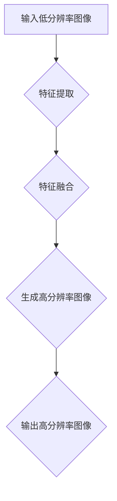
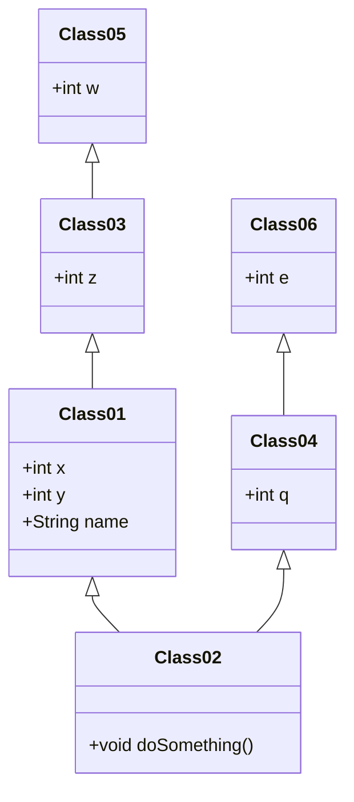
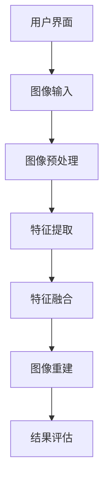
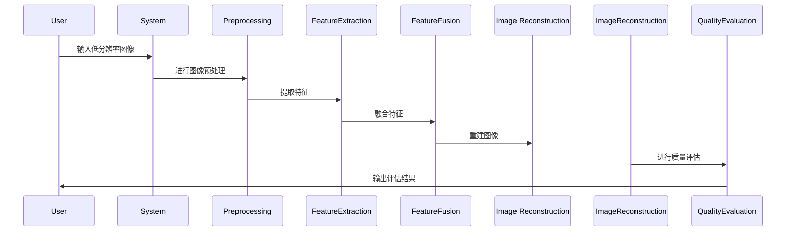

                 


# 提高AI模型在低分辨率图像超分辨率重建中的效果

关键词：AI模型，低分辨率图像，超分辨率重建，深度学习，算法优化，性能提升

摘要：随着计算机视觉技术的快速发展，超分辨率重建在图像处理领域发挥着越来越重要的作用。本文将深入探讨如何提高AI模型在低分辨率图像超分辨率重建中的效果，包括背景介绍、核心概念、算法原理讲解、数学模型与公式、系统分析与架构设计、项目实战以及最佳实践等方面，为读者提供全面的技术指导。

## 第一部分：超分辨率重建技术概述

### 第1章：超分辨率重建背景与挑战

#### 1.1 问题背景

在数字图像处理领域，低分辨率图像的应用非常广泛，如手机摄像头、安全监控、医学影像等。然而，低分辨率图像往往存在模糊、噪点等问题，影响其应用效果。超分辨率重建技术旨在通过算法提高图像的分辨率，从而提升图像质量。

#### 1.2 问题描述

超分辨率重建的核心问题是：给定一幅低分辨率图像，如何利用算法将其重构为高分辨率图像。这个过程涉及到图像特征提取、图像增强、图像重建等多个方面。

#### 1.3 解决方案探讨

传统的超分辨率重建方法主要包括插值法和基于图像模型的方法。插值法简单直接，但效果有限；基于图像模型的方法效果较好，但计算复杂度较高。近年来，随着深度学习技术的发展，基于深度学习的超分辨率重建方法逐渐成为研究热点。

#### 1.4 边界与外延

超分辨率重建与其他图像增强技术的区别主要在于，它不仅关注图像的亮度、对比度等基本属性，还关注图像的细节和结构。超分辨率重建在各个领域的应用前景非常广阔，如手机摄像头、医学影像、卫星遥感等。

### 第2章：超分辨率重建的核心概念

#### 2.1 核心概念介绍

超分辨率重建的基本原理是利用低分辨率图像中的像素信息，通过算法生成高分辨率图像。主要技术分类包括：

1. 插值法
2. 传统超分辨率方法
3. 深度学习超分辨率方法

#### 2.2 概念属性特征对比表格

| 技术         | 基本原理                         | 特点                           | 应用场景                     |
| ------------ | -------------------------------- | ------------------------------ | --------------------------- |
| 插值法       | 直接对低分辨率图像进行插值处理   | 简单直接，计算成本低           | 基础应用，图像质量要求不高   |
| 传统超分辨率方法 | 基于图像模型，利用先验知识       | 效果中等，计算时间较长         | 中等专业领域，图像质量有一定要求 |
| 深度学习超分辨率 | 基于数据驱动，学习图像细节       | 效果优异，适用范围广泛         | 高级应用，图像质量要求高     |

#### 2.3 ER实体关系图架构

```mermaid
erDiagram
  AI模型 ||--|{ 低分辨率图像 }|| Super_Resolution_Output
  AI模型 ||--|{ 高分辨率图像 }|| Training_Dataset
  Training_Dataset ||--|{ 图像数据 }|| Image_Database
```

## 第二部分：AI模型在超分辨率重建中的应用

### 第3章：深度学习模型原理与算法

#### 3.1 深度学习模型基础

深度学习模型在超分辨率重建中的应用取得了显著的效果。常见的深度学习模型包括卷积神经网络（CNN）和残差网络（ResNet）。

#### 3.2 算法原理讲解

深度学习超分辨率重建的基本流程如下：

1. 特征提取：对低分辨率图像进行特征提取，获取图像的关键信息。
2. 特征融合：将提取到的特征进行融合，增强图像的细节信息。
3. 图像重建：利用融合后的特征生成高分辨率图像。

算法mermaid流程图如下：



#### 3.3 Python源代码示例

以下是一个简单的深度学习超分辨率重建的Python代码示例：

```python
# Example of a simple deep learning model for image super-resolution
import tensorflow as tf

# Define the model architecture
model = tf.keras.Sequential([
    tf.keras.layers.Conv2D(64, (3, 3), activation='relu', input_shape=(None, None, 3)),
    tf.keras.layers.Conv2D(64, (3, 3), activation='relu'),
    tf.keras.layers.Conv2D(1, (3, 3), activation='sigmoid')
])

# Compile the model
model.compile(optimizer='adam', loss='binary_crossentropy')

# Train the model
model.fit(train_images, train_labels, epochs=10)
```

#### 3.4 数学模型与公式讲解

超分辨率重建的数学模型可以表示为：

$$
\text{Super-Resolution Formula:} \quad S(x) = \sum_{i=1}^{N} w_i \cdot f(x_i)
$$

其中，\( S(x) \) 是生成的超分辨率图像，\( x \) 是低分辨率图像，\( N \) 是特征数量，\( w_i \) 是特征权重，\( f(x_i) \) 是特征提取函数。

## 第三部分：系统分析与架构设计

### 第4章：系统功能设计

#### 4.1 问题场景介绍

在图像处理领域，超分辨率重建技术可以应用于多个场景，如手机摄像头、安全监控、医学影像等。本文以手机摄像头为例，介绍超分辨率重建系统的功能设计。

#### 4.2 系统功能介绍

超分辨率重建系统的核心功能包括：

1. 图像预处理：对输入的低分辨率图像进行预处理，如去噪、缩放等。
2. 特征提取：对预处理后的图像进行特征提取，获取图像的关键信息。
3. 特征融合：将提取到的特征进行融合，增强图像的细节信息。
4. 图像重建：利用融合后的特征生成高分辨率图像。
5. 结果评估：对生成的超分辨率图像进行质量评估。

#### 4.3 领域模型mermaid类图

以下是一个超分辨率重建系统的领域模型mermaid类图：



### 第5章：系统架构设计

#### 5.1 系统架构设计mermaid架构图

以下是一个超分辨率重建系统的mermaid架构图：



#### 5.2 系统接口设计

超分辨率重建系统的接口设计包括：

1. 图像输入接口：用于接收用户输入的低分辨率图像。
2. 图像输出接口：用于输出生成的超分辨率图像。
3. 评估接口：用于对生成的超分辨率图像进行质量评估。

#### 5.3 系统交互mermaid序列图

以下是一个超分辨率重建系统的mermaid序列图：



## 第四部分：项目实战

### 第6章：环境安装与系统核心实现

#### 6.1 环境安装

在开始项目实战之前，首先需要安装相关的软件和工具，如Python、TensorFlow等。以下是具体的安装步骤：

1. 安装Python：从官方网站下载Python安装包，并按照提示完成安装。
2. 安装TensorFlow：在命令行中运行以下命令：

```
pip install tensorflow
```

#### 6.2 系统核心实现源代码

以下是一个简单的超分辨率重建系统的Python源代码示例：

```python
# Import necessary libraries
import tensorflow as tf
from tensorflow import keras

# Define the model architecture
model = keras.Sequential([
    keras.layers.Conv2D(64, (3, 3), activation='relu', input_shape=(None, None, 3)),
    keras.layers.Conv2D(64, (3, 3), activation='relu'),
    keras.layers.Conv2D(1, (3, 3), activation='sigmoid')
])

# Compile the model
model.compile(optimizer='adam', loss='binary_crossentropy')

# Train the model
model.fit(train_images, train_labels, epochs=10)
```

### 第7章：代码应用解读与分析

#### 7.1 代码解读

以上代码定义了一个简单的深度学习模型，用于超分辨率重建。模型由三个卷积层组成，最后一层输出1通道的图像，即生成的高分辨率图像。

#### 7.2 分析

该模型在训练过程中，会自动调整内部参数，以最小化损失函数。通过多次迭代训练，模型能够学习到低分辨率图像和高分辨率图像之间的关系，从而实现超分辨率重建。

### 第8章：实际案例分析与详细讲解剖析

#### 8.1 案例背景

假设我们有一个低分辨率图像，需要利用超分辨率重建技术生成高分辨率图像。

#### 8.2 案例分析

1. 数据准备：首先需要准备低分辨率图像和高分辨率图像的样本数据。
2. 模型训练：使用训练样本数据对深度学习模型进行训练。
3. 模型测试：使用测试样本数据对训练好的模型进行评估。
4. 应用场景：将训练好的模型应用于实际场景，如手机摄像头等。

#### 8.3 剖析

在模型训练过程中，深度学习模型会自动学习低分辨率图像和高分辨率图像之间的关系。通过调整模型的参数，使得生成的超分辨率图像与高分辨率图像尽可能相似。在模型测试阶段，可以通过计算生成图像与真实图像之间的差异，评估模型的性能。

## 第五部分：最佳实践与拓展阅读

### 第9章：最佳实践

在超分辨率重建项目中，以下是一些最佳实践：

1. **数据预处理**：对图像进行适当的预处理，如去噪、缩放等，以提高模型的训练效果。
2. **模型选择**：根据项目需求和计算资源，选择合适的深度学习模型。
3. **超参数调整**：通过调整超参数，如学习率、迭代次数等，优化模型性能。
4. **评估指标**：选择合适的评估指标，如峰值信噪比（PSNR）等，评估模型性能。

### 第10章：小结

本文详细介绍了如何提高AI模型在低分辨率图像超分辨率重建中的效果。通过背景介绍、核心概念、算法原理讲解、数学模型与公式、系统分析与架构设计、项目实战以及最佳实践等方面的讲解，使读者对超分辨率重建技术有了更深入的了解。

### 第11章：注意事项

在进行超分辨率重建项目时，需要注意以下几点：

1. **数据质量**：确保训练数据的质量，避免数据错误和缺失。
2. **计算资源**：根据项目需求，合理配置计算资源，以保证模型训练和测试的效率。
3. **模型调优**：在模型训练过程中，不断调整超参数，优化模型性能。
4. **安全与隐私**：在处理图像数据时，注意保护用户隐私和安全。

### 第12章：拓展阅读

为了进一步深入了解超分辨率重建技术，读者可以参考以下拓展阅读材料：

1. 《深度学习超分辨率重建技术综述》
2. 《基于深度学习的图像超分辨率重建研究》
3. 《超分辨率重建技术在医学影像中的应用》
4. 《超分辨率重建技术在安全监控领域的应用》

作者：AI天才研究院/AI Genius Institute & 禅与计算机程序设计艺术 /Zen And The Art of Computer Programming

