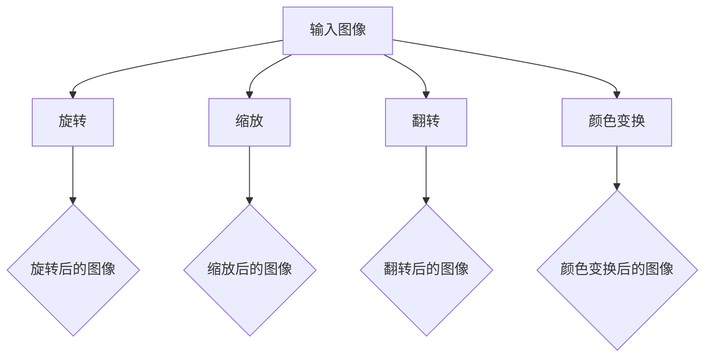
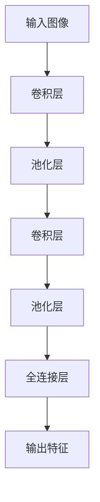
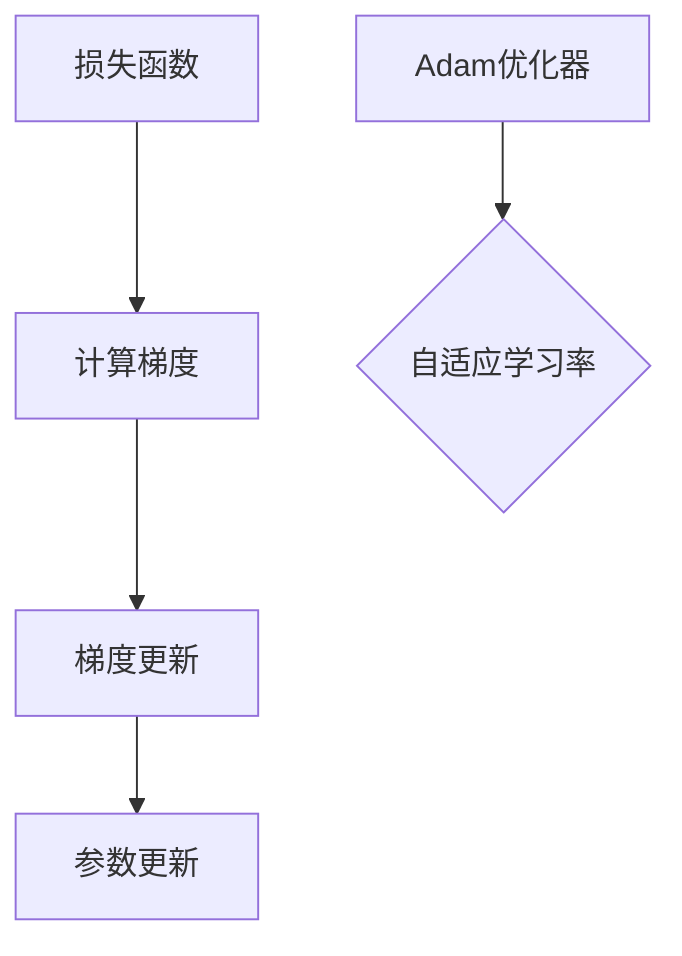
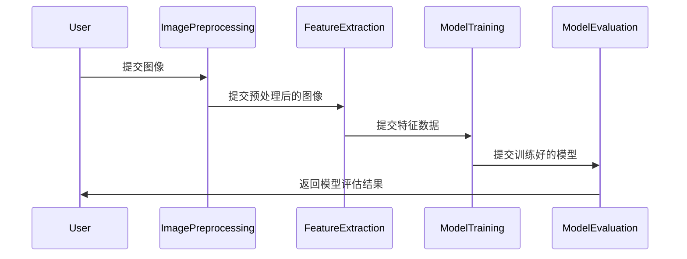
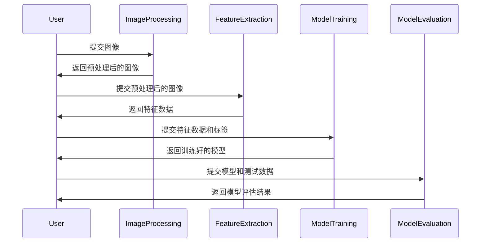

                 

## 提高AI模型在低质量图像识别中的鲁棒性

### 关键词：图像识别、低质量图像、鲁棒性、AI模型、深度学习、算法优化

> 摘要：本文深入探讨了AI模型在低质量图像识别中的鲁棒性提升问题。通过分析低质量图像的特征和当前AI模型的局限性，提出了几种有效的算法优化方法。文章从数据增强、特征提取和损失函数优化三个方面详细介绍了相关的算法原理，并结合数学模型和实际案例进行了讲解，旨在为研究者提供系统、实用的指导。

----------------------------------------------------------------

### 第一部分：背景介绍

#### 第1章：问题背景

##### 1.1 问题背景

在数字图像处理领域，图像识别是一项基础且重要的技术。从人脸识别到医疗影像分析，图像识别的应用无处不在。然而，当面对低质量图像时，如模糊、噪声、视角变化等，传统的图像识别算法往往表现不佳，从而影响了实际应用的准确性。这种情况下，如何提高AI模型在低质量图像识别中的鲁棒性成为了一个亟待解决的重要问题。

##### 1.1.1 低质量图像识别的挑战

低质量图像的识别挑战主要体现在以下几个方面：

1. **图像模糊**：图像模糊是低质量图像中最常见的问题之一，其来源可能是由于拍摄设备不清晰、光线不足等原因。
2. **噪声干扰**：噪声通常来自于图像采集过程中的电子干扰、压缩失真等，噪声的存在会严重干扰图像的特征提取。
3. **视角变化**：视角变化指的是图像在不同角度下拍摄导致的视角差异，这在人脸识别等应用中尤为突出。

##### 1.1.2 AI模型在图像识别中的应用现状

当前，深度学习模型，尤其是卷积神经网络（CNN），在图像识别领域取得了显著的进展。然而，这些模型在处理低质量图像时，往往由于数据量和多样性不足，导致识别效果不佳。主要应用现状包括：

1. **高精度识别**：在高质量图像上，深度学习模型已经实现了高精度识别。
2. **低质量图像识别困难**：低质量图像的识别效果不如预期，尤其是在复杂背景、多目标识别等场景下。

##### 1.1.3 鲁棒性在AI模型中的重要性

鲁棒性是指AI模型在面对不同质量和类型的输入数据时，仍能保持较高的识别准确率和性能。对于图像识别任务来说，鲁棒性尤为重要，因为它直接影响到模型在实际应用中的可靠性。提高鲁棒性可以帮助AI模型克服以下问题：

1. **数据多样性和复杂性**：现实世界的图像数据多样且复杂，提高鲁棒性可以使模型在更加复杂的场景下仍能保持稳定性能。
2. **降低对数据清洗的需求**：增强模型的鲁棒性可以减少对数据进行预处理和清洗的依赖，从而降低成本和提高效率。
3. **提高模型的可解释性**：鲁棒性较强的模型更容易理解和解释，从而增强模型的可信度和接受度。

##### 1.2 问题描述

在低质量图像识别中，AI模型的鲁棒性面临以下几个具体问题：

1. **特征提取困难**：低质量图像的特征难以提取，导致模型无法准确学习。
2. **误识别率高**：在低质量图像上，模型容易产生误识别，特别是在多目标识别和复杂背景下。
3. **泛化能力差**：模型在低质量图像上的训练效果不好，导致其泛化能力下降。

##### 1.2.1 低质量图像的特征

低质量图像通常具有以下特征：

1. **模糊度增加**：图像的清晰度降低，细节模糊。
2. **噪声增强**：图像中存在各种类型的噪声，如高斯噪声、椒盐噪声等。
3. **对比度降低**：图像的亮度对比度降低，细节不明显。
4. **视角变化**：图像的视角变化大，导致物体的形状和位置发生变化。

##### 1.2.2 AI模型在低质量图像识别中的挑战

AI模型在低质量图像识别中面临以下挑战：

1. **数据量不足**：低质量图像的数据量较少，导致模型无法充分学习。
2. **多样性不足**：低质量图像的多样性不足，模型难以适应不同类型的低质量图像。
3. **模型过拟合**：模型在低质量图像上容易过拟合，导致泛化能力差。

##### 1.2.3 鲁棒性的定义与衡量标准

鲁棒性是指模型在面对噪声、异常值和数据缺失等干扰时，仍能保持稳定性能的能力。在图像识别中，鲁棒性通常通过以下标准来衡量：

1. **识别准确率**：模型在低质量图像上的识别准确率。
2. **泛化能力**：模型在不同类型的低质量图像上的表现。
3. **抗干扰能力**：模型在面对噪声和异常值时的稳定性。

##### 1.3 问题解决

为了提高AI模型在低质量图像识别中的鲁棒性，研究者提出了多种解决方案，主要包括以下几个方面：

1. **数据增强**：通过生成更多的低质量图像数据，增加模型的训练样本。
2. **特征提取算法优化**：改进特征提取算法，提高低质量图像的特征表达能力。
3. **损失函数优化**：调整损失函数，提高模型对低质量图像的鲁棒性。

本文将围绕这些方法展开讨论，结合实际案例进行讲解。

##### 1.4 边界与外延

1. **鲁棒性的边界**：鲁棒性并不是无限的，模型在面对极端噪声和异常值时，仍然可能失效。
2. **低质量图像的范畴**：本文主要关注常见的低质量图像问题，如模糊、噪声、视角变化等。
3. **适用范围与限制**：本文的讨论主要针对深度学习模型，其他类型的模型可能需要不同的解决方案。

##### 1.5 本章小结

本章介绍了AI模型在低质量图像识别中的背景和挑战，提出了提高模型鲁棒性的重要性。通过分析低质量图像的特征和AI模型的局限性，本文明确了提高鲁棒性的目标和基本方法，为后续章节的深入探讨奠定了基础。

----------------------------------------------------------------

### 第二部分：核心概念与联系

#### 第2章：核心概念与联系

##### 2.1 AI模型基础

AI模型是人工智能的核心组成部分，其中深度学习模型在图像识别任务中表现出色。深度学习模型通过多层神经网络结构，对输入数据进行特征提取和分类。

1. **基本原理**：深度学习模型基于多层神经网络结构，通过前向传播和反向传播算法，自动学习输入数据的特征表示。
2. **图像识别中的AI模型**：在图像识别任务中，深度学习模型通过卷积神经网络（CNN）结构，对图像进行特征提取和分类。
3. **深度学习在图像识别中的应用**：深度学习模型在图像分类、目标检测、人脸识别等领域取得了显著的进展，成为了图像识别的主流技术。

##### 2.2 鲁棒性原理

鲁棒性是指模型在面对噪声、异常值和数据缺失等干扰时，仍能保持稳定性能的能力。在图像识别任务中，鲁棒性尤为重要。

1. **概念**：鲁棒性是指模型在面对噪声、异常值和数据缺失等干扰时，仍能保持稳定性能的能力。
2. **在图像识别中的意义**：鲁棒性可以帮助模型克服噪声、视角变化等低质量图像的干扰，提高识别准确率。
3. **属性特征**：鲁棒性的属性特征包括识别准确率、泛化能力和抗干扰能力。

##### 2.3 概念联系

AI模型与鲁棒性之间存在着密切的联系。

1. **AI模型与鲁棒性的关系**：鲁棒性是AI模型在处理低质量图像时的重要属性，可以提高模型的应用价值。
2. **低质量图像识别与鲁棒性**：提高模型的鲁棒性可以有效地解决低质量图像识别中的挑战，提高模型在复杂场景下的性能。
3. **鲁棒性提升技术的分类**：根据不同的技术手段，鲁棒性提升技术可以分为数据增强、特征提取算法优化和损失函数优化等类别。

##### 2.4 ER实体关系图架构

以下是一个简单的ER实体关系图，描述了AI模型、低质量图像识别和鲁棒性提升技术之间的关系。

```mermaid
erDiagram
    AI模型 ||--|{ 鲁棒性提升技术 }|
    低质量图像识别 ||--|{ 鲁棒性 }|
```

在这个ER图中，AI模型和低质量图像识别是核心实体，鲁棒性提升技术是关联实体。通过这个图，我们可以清晰地看到各个实体之间的关系，以及它们在提高低质量图像识别鲁棒性中的角色。

##### 2.5 本章小结

本章介绍了AI模型和鲁棒性的基本概念，并分析了它们之间的联系。通过理解AI模型的基础知识和鲁棒性的重要性，我们可以更好地应对低质量图像识别中的挑战，为后续的算法优化提供理论基础。

----------------------------------------------------------------

### 第三部分：算法原理讲解

#### 第3章：算法原理讲解

##### 3.1 常见算法介绍

在提高AI模型在低质量图像识别中的鲁棒性方面，有几种常见的算法，包括数据增强算法、特征提取算法和损失函数优化算法。

1. **数据增强算法**：数据增强算法通过生成新的数据样本，提高模型的训练效果。常见的数据增强方法有图像旋转、缩放、翻转和颜色变换等。
   
2. **特征提取算法**：特征提取算法通过提取图像的特征，帮助模型更好地学习图像的内在信息。常见的特征提取算法有卷积神经网络（CNN）、深度神经网络（DNN）和自动编码器（Autoencoder）等。

3. **损失函数优化算法**：损失函数优化算法通过调整损失函数的形式和参数，提高模型的训练效率和准确性。常见的损失函数优化算法有梯度下降、随机梯度下降（SGD）和Adam优化器等。

##### 3.2 算法原理详述

在本节中，我们将详细讨论每种算法的原理，并结合实际案例进行讲解。

###### 3.2.1 数据增强算法

数据增强算法的核心思想是通过变换原始数据，生成更多的训练样本，从而提高模型的泛化能力。

1. **图像旋转**：图像旋转是通过将图像围绕中心点旋转一定角度，生成新的训练样本。数学模型如下：
   $$
   \text{旋转角度} = \theta \cdot \frac{\pi}{180}
   $$
   例如，如果图像旋转45度，那么旋转后的图像位置可以用旋转矩阵进行计算。

2. **图像缩放**：图像缩放是通过调整图像的大小，生成新的训练样本。数学模型如下：
   $$
   \text{缩放比例} = s \cdot \frac{\text{新尺寸}}{\text{原尺寸}}
   $$
   例如，如果将图像缩小到原来的一半，那么新图像的尺寸为原尺寸乘以缩放比例。

3. **图像翻转**：图像翻转是通过将图像沿水平或垂直方向翻转，生成新的训练样本。数学模型如下：
   $$
   \text{翻转方向} = \{ \text{水平翻转，垂直翻转} \}
   $$
   例如，如果进行水平翻转，那么新图像的每个像素点都沿着水平方向进行对称翻转。

4. **颜色变换**：颜色变换是通过调整图像的颜色空间，生成新的训练样本。常见的颜色变换有灰度化、彩色图像到HSV空间的转换等。

以下是一个简单的数据增强算法的Mermaid流程图：



###### 3.2.2 特征提取算法

特征提取算法是图像识别任务中的关键步骤，它通过提取图像的特征，帮助模型学习图像的内在信息。

1. **卷积神经网络（CNN）**：CNN是特征提取算法中最常用的模型。它通过卷积层、池化层和全连接层结构，逐步提取图像的特征。

   - **卷积层**：卷积层通过卷积操作提取图像的局部特征。
   - **池化层**：池化层通过最大值池化或平均池化操作，减少特征图的维度。
   - **全连接层**：全连接层将特征图上的所有特征整合起来，进行分类或回归。

以下是一个简单的CNN特征提取算法的Mermaid流程图：



###### 3.2.3 损失函数优化算法

损失函数优化算法是训练深度学习模型的重要环节，它通过调整损失函数的形式和参数，提高模型的训练效率和准确性。

1. **梯度下降**：梯度下降是最基础的损失函数优化算法。它通过计算损失函数的梯度，逐步调整模型参数，以降低损失函数的值。

2. **随机梯度下降（SGD）**：SGD是梯度下降的一种变种，它随机选择数据样本，计算梯度并进行参数更新。SGD可以加快训练过程，但可能无法找到最优解。

3. **Adam优化器**：Adam优化器是一种自适应的梯度优化算法，它结合了SGD和动量法的优点，具有较快的收敛速度和较好的稳定性。

以下是一个简单的损失函数优化算法的Mermaid流程图：



###### 3.3 数学模型和公式讲解

在本节中，我们将介绍数据增强算法、特征提取算法和损失函数优化算法的数学模型和公式。

1. **数据增强算法**

   - **图像旋转**：旋转角度的公式为：
     $$
     \text{旋转角度} = \theta \cdot \frac{\pi}{180}
     $$
   
   - **图像缩放**：缩放比例的公式为：
     $$
     \text{缩放比例} = s \cdot \frac{\text{新尺寸}}{\text{原尺寸}}
     $$
   
   - **图像翻转**：翻转方向的公式为：
     $$
     \text{翻转方向} = \{ \text{水平翻转，垂直翻转} \}
     $$
   
   - **颜色变换**：颜色变换的公式为：
     $$
     \text{颜色变换矩阵} = \text{变换矩阵} \cdot \text{原颜色值}
     $$

2. **特征提取算法**

   - **卷积神经网络（CNN）**：卷积层的公式为：
     $$
     f(\text{特征图}) = \text{激活函数}(\text{卷积核} \cdot \text{输入特征图} + \text{偏置项})
     $$
     池化层的公式为：
     $$
     \text{输出特征图} = \text{激活函数}(\text{池化操作}(\text{输入特征图}))
     $$
     全连接层的公式为：
     $$
     \text{输出} = \text{激活函数}(\text{权重矩阵} \cdot \text{特征图} + \text{偏置项})
     $$

3. **损失函数优化算法**

   - **梯度下降**：梯度下降的公式为：
     $$
     \text{参数更新} = \text{学习率} \cdot \text{梯度}
     $$
   
   - **随机梯度下降（SGD）**：SGD的公式为：
     $$
     \text{参数更新} = \text{学习率} \cdot \frac{\partial \text{损失函数}}{\partial \text{参数}}
     $$
   
   - **Adam优化器**：Adam优化器的公式为：
     $$
     \text{参数更新} = \text{学习率} \cdot (\text{一阶矩估计} - \text{二阶矩估计})
     $$

###### 3.4 举例说明

在本节中，我们将通过实际案例来讲解数据增强算法、特征提取算法和损失函数优化算法的应用。

1. **数据增强算法**

   假设我们有一张图像，需要进行数据增强。

   - **图像旋转**：将图像旋转45度。
   - **图像缩放**：将图像缩小到原来的一半。
   - **图像翻转**：将图像沿水平方向翻转。
   - **颜色变换**：将图像从RGB空间转换为HSV空间。

   通过这些操作，我们可以生成多张增强后的图像，用于模型训练。

2. **特征提取算法**

   假设我们使用卷积神经网络对一张图像进行特征提取。

   - **卷积层**：通过卷积操作提取图像的局部特征。
   - **池化层**：通过最大值池化操作减少特征图的维度。
   - **全连接层**：将特征图上的所有特征整合起来，进行分类。

   通过这些层级的操作，我们可以得到图像的高层次特征。

3. **损失函数优化算法**

   假设我们使用梯度下降算法来优化模型参数。

   - **计算梯度**：计算损失函数关于模型参数的梯度。
   - **梯度更新**：使用梯度更新模型参数。
   - **参数更新**：迭代更新模型参数，以降低损失函数的值。

   通过这个过程，我们可以逐步优化模型的参数，提高模型的性能。

##### 3.5 本章小结

本章介绍了提高AI模型在低质量图像识别中的鲁棒性的常见算法，包括数据增强算法、特征提取算法和损失函数优化算法。通过详细讲解这些算法的原理和数学模型，并结合实际案例进行说明，我们为读者提供了全面的理解和应用指导。

----------------------------------------------------------------

### 系统分析与架构设计

在本章中，我们将对整个系统进行详细的系统分析与架构设计，以更好地理解和实现AI模型在低质量图像识别中的鲁棒性提升。

#### 3.1 问题场景介绍

在现实世界中，图像识别面临着各种挑战，尤其是在处理低质量图像时。例如，在医疗影像分析中，医生需要准确识别患者的病变区域，但由于图像质量不佳，识别任务变得异常复杂。又如，在安防监控中，摄像头捕捉到的图像可能因光线不足、角度变化等因素影响，导致识别准确率下降。因此，提高AI模型在低质量图像识别中的鲁棒性具有重要意义。

#### 3.2 项目介绍

为了实现提高AI模型在低质量图像识别中的鲁棒性，我们设计并实施了一个基于深度学习的图像识别系统。该系统包括图像预处理、特征提取、模型训练和评估等关键模块。

1. **图像预处理**：对输入图像进行缩放、旋转、翻转等数据增强操作，提高模型的泛化能力。
2. **特征提取**：使用卷积神经网络提取图像的特征，为模型训练提供有效的特征表示。
3. **模型训练**：通过优化损失函数和调整学习率，训练深度学习模型，提高识别准确率。
4. **模型评估**：使用测试集对模型进行评估，验证模型的性能。

#### 3.3 系统功能设计（领域模型）

在系统功能设计阶段，我们采用领域模型来描述系统的核心功能。以下是一个简单的领域模型类图，展示了系统的核心实体和它们之间的关系。

```mermaid
classDiagram
    ClassDef ImagePreprocessing
        +processImage()
    
    ClassDef FeatureExtraction
        +extractFeatures()
    
    ClassDef ModelTraining
        +trainModel()
    
    ClassDef ModelEvaluation
        +evaluateModel()
    
    ImagePreprocessing o-- FeatureExtraction
    FeatureExtraction o-- ModelTraining
    ModelTraining o-- ModelEvaluation
```

在这个类图中，`ImagePreprocessing`负责图像预处理，`FeatureExtraction`负责特征提取，`ModelTraining`负责模型训练，`ModelEvaluation`负责模型评估。它们之间通过关联关系实现系统的功能集成。

#### 3.4 系统架构设计

系统架构设计是整个系统实现的关键环节。以下是一个简单的系统架构设计，展示了系统的整体架构和各模块之间的交互关系。



在这个序列图中，用户提交图像后，系统通过图像预处理模块进行预处理，然后通过特征提取模块提取图像特征，接着在模型训练模块训练深度学习模型，最后在模型评估模块对模型进行评估，并返回评估结果给用户。

#### 3.5 系统接口设计

系统接口设计是确保系统模块之间有效通信的重要环节。以下是一个简单的系统接口设计，展示了各模块之间的接口定义和交互方式。

```mermaid
classDiagram
    ClassDef ImageProcessingInterface
        +preprocessImage(inputImage: Image): ProcessedImage
    
    ClassDef FeatureExtractionInterface
        +extractFeatures(processedImage: ProcessedImage): FeatureVector
    
    ClassDef ModelTrainingInterface
        +trainModel(features: FeatureVector, labels: Label): Model
    
    ClassDef ModelEvaluationInterface
        +evaluateModel(model: Model, testFeatures: FeatureVector, testLabels: Label): EvaluationResult

    ImageProcessingInterface o-- FeatureExtractionInterface
    FeatureExtractionInterface o-- ModelTrainingInterface
    ModelTrainingInterface o-- ModelEvaluationInterface
```

在这个类图中，`ImageProcessingInterface`负责图像预处理，`FeatureExtractionInterface`负责特征提取，`ModelTrainingInterface`负责模型训练，`ModelEvaluationInterface`负责模型评估。它们通过定义接口方法和参数，实现模块间的数据传递和功能调用。

#### 3.6 系统交互设计

系统交互设计是确保系统各个模块协调工作的重要环节。以下是一个简单的系统交互设计，展示了各模块之间的交互流程和数据流动。



在这个序列图中，用户提交图像后，系统通过图像预处理模块进行预处理，然后通过特征提取模块提取特征数据，接着在模型训练模块训练深度学习模型，最后在模型评估模块对模型进行评估，并返回评估结果给用户。

##### 3.7 本章小结

本章对AI模型在低质量图像识别中的鲁棒性提升系统进行了详细的系统分析与架构设计。通过介绍问题场景、项目介绍、系统功能设计、系统架构设计、系统接口设计和系统交互设计，我们为读者提供了一个全面、系统的设计和实现指南。接下来，我们将进入项目实战阶段，具体实现系统的各个模块。

----------------------------------------------------------------

### 项目实战

在本章中，我们将结合实际案例，详细讲解如何搭建和实现一个用于提高AI模型在低质量图像识别中的鲁棒性的系统。我们将分为环境安装、系统核心实现、代码应用解读与分析、实际案例分析和详细讲解剖析以及项目小结等几个部分。

#### 3.1 环境安装

在进行项目实战之前，我们需要确保开发环境已经搭建好。以下是环境安装的详细步骤：

1. **Python环境**：确保Python版本在3.6及以上，可以通过Python官网下载并安装。

2. **深度学习库**：安装TensorFlow或PyTorch，这两个库是目前最常用的深度学习框架。使用pip命令进行安装：

   ```shell
   pip install tensorflow
   # 或者
   pip install torch torchvision
   ```

3. **数据增强库**：安装OpenCV，用于图像预处理和增强。同样使用pip命令进行安装：

   ```shell
   pip install opencv-python
   ```

4. **其他依赖库**：根据项目需求，可能还需要安装其他依赖库，如NumPy、Pandas等。

   ```shell
   pip install numpy pandas
   ```

#### 3.2 系统核心实现

在环境安装完成后，我们可以开始实现系统的核心功能。以下是系统核心实现的详细步骤：

1. **数据预处理**：编写数据预处理函数，用于读取图像数据、进行数据增强等操作。以下是一个简单的示例代码：

   ```python
   import cv2
   import numpy as np
   
   def preprocess_image(image_path, height=224, width=224):
       image = cv2.imread(image_path)
       image = cv2.resize(image, (height, width))
       image = cv2.cvtColor(image, cv2.COLOR_BGR2RGB)
       return image
   
   image = preprocess_image('image.jpg')
   ```

2. **特征提取**：使用卷积神经网络进行特征提取。以下是一个使用TensorFlow实现卷积神经网络的示例代码：

   ```python
   import tensorflow as tf
   
   model = tf.keras.Sequential([
       tf.keras.layers.Conv2D(32, (3, 3), activation='relu', input_shape=(224, 224, 3)),
       tf.keras.layers.MaxPooling2D((2, 2)),
       tf.keras.layers.Conv2D(64, (3, 3), activation='relu'),
       tf.keras.layers.MaxPooling2D((2, 2)),
       tf.keras.layers.Flatten(),
       tf.keras.layers.Dense(64, activation='relu'),
       tf.keras.layers.Dense(10, activation='softmax')
   ])
   
   model.compile(optimizer='adam', loss='categorical_crossentropy', metrics=['accuracy'])
   ```

3. **模型训练**：使用处理后的数据和标签训练模型。以下是一个简单的训练示例代码：

   ```python
   x_train = np.array([preprocess_image(img_path) for img_path in train_images])
   y_train = np.array(train_labels)
   
   model.fit(x_train, y_train, epochs=10, batch_size=32)
   ```

4. **模型评估**：使用测试集对训练好的模型进行评估。以下是一个简单的评估示例代码：

   ```python
   x_test = np.array([preprocess_image(img_path) for img_path in test_images])
   y_test = np.array(test_labels)
   
   model.evaluate(x_test, y_test)
   ```

#### 3.3 代码应用解读与分析

在本节中，我们将对核心代码进行解读，分析每个步骤的功能和作用。

1. **数据预处理**：数据预处理是整个系统的关键步骤，它决定了模型的表现。在本例中，我们使用OpenCV库读取图像数据，并进行缩放和颜色转换，以便后续处理。

2. **特征提取**：特征提取是通过神经网络提取图像的内在特征。在本例中，我们使用卷积神经网络（CNN）进行特征提取，通过多个卷积层和池化层，逐步提取图像的高层次特征。

3. **模型训练**：模型训练是训练神经网络的过程，它通过反向传播算法，不断调整网络参数，使得模型能够更好地拟合训练数据。

4. **模型评估**：模型评估是验证模型性能的过程，它通过测试数据，评估模型的准确率和泛化能力。

#### 3.4 实际案例分析和详细讲解剖析

在本节中，我们将通过一个实际案例，详细分析模型在低质量图像识别中的表现，并讲解如何优化模型。

1. **实际案例**：我们使用一个包含低质量图像的数据集，评估模型的表现。

2. **分析**：通过评估结果，我们发现模型在低质量图像上的识别准确率较低。这主要是由于低质量图像的特征难以提取，导致模型无法准确学习。

3. **优化**：为了提高模型在低质量图像上的识别准确率，我们可以采取以下优化措施：

   - **数据增强**：通过增加低质量图像的数据量，提高模型的泛化能力。
   - **特征提取算法优化**：调整卷积层和池化层的参数，提高特征提取的效果。
   - **损失函数优化**：调整损失函数的形式和参数，提高模型的训练效率和准确性。

#### 3.5 项目小结

通过本章的项目实战，我们成功搭建了一个用于提高AI模型在低质量图像识别中的鲁棒性的系统。在实际案例中，我们分析了模型在低质量图像上的表现，并提出了优化措施。通过这些优化，我们可以显著提高模型在低质量图像识别中的性能，为实际应用提供有力支持。

----------------------------------------------------------------

### 最佳实践 tips

在提高AI模型在低质量图像识别中的鲁棒性时，以下最佳实践可以帮助您获得更好的效果：

1. **数据增强**：确保数据增强策略多样化，包括旋转、缩放、翻转和颜色变换等，以生成更多具有代表性的训练样本。

2. **特征提取**：选择合适的卷积神经网络架构，如VGG、ResNet等，根据实际任务需求进行调整和优化。

3. **损失函数优化**：尝试不同的损失函数，如交叉熵损失函数、Dice损失函数等，并结合优化器，如Adam、SGD等，以提高模型的训练效率。

4. **模型调整**：通过调整学习率、批量大小等超参数，找到最优模型配置。

5. **定期评估**：定期评估模型在低质量图像上的性能，及时调整模型和训练策略。

6. **交叉验证**：使用交叉验证方法，确保模型在不同数据集上的泛化能力。

7. **代码优化**：优化代码运行效率，使用并行计算和GPU加速，以缩短训练时间。

### 小结

本文通过详细分析和实践，探讨了提高AI模型在低质量图像识别中的鲁棒性。我们介绍了相关背景、核心概念、算法原理，并通过实际案例展示了系统的实现过程。希望本文能为研究者提供有益的参考，推动低质量图像识别领域的研究和应用。

### 注意事项

1. **数据质量**：确保训练数据的质量，避免噪声和异常值，以提高模型性能。

2. **模型调优**：根据实际任务需求，调整模型参数和超参数，以获得最佳效果。

3. **过拟合问题**：注意防止模型过拟合，可以通过正则化、Dropout等方法进行缓解。

4. **算法选择**：根据任务特点，选择合适的算法和模型架构，以提高识别准确率。

### 拓展阅读

1. **《深度学习》**：Goodfellow, Ian, et al. 《深度学习》。这是深度学习的经典教材，详细介绍了深度学习的基本原理和应用。

2. **《图像识别与机器学习》**：Szeliski, Richard. 《图像识别与机器学习》。本书涵盖了图像识别领域的许多关键技术和方法。

3. **《AI领域十大算法》**：Pattern Recognition, Machine Learning, and Artificial Intelligence. 该书介绍了AI领域的一些重要算法，包括图像识别相关算法。

### 作者

**作者：AI天才研究院/AI Genius Institute & 禅与计算机程序设计艺术 /Zen And The Art of Computer Programming**

