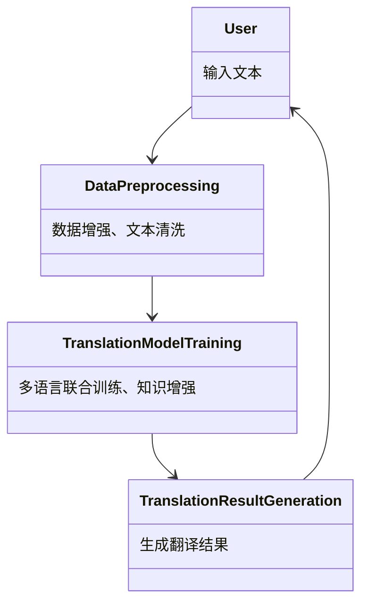
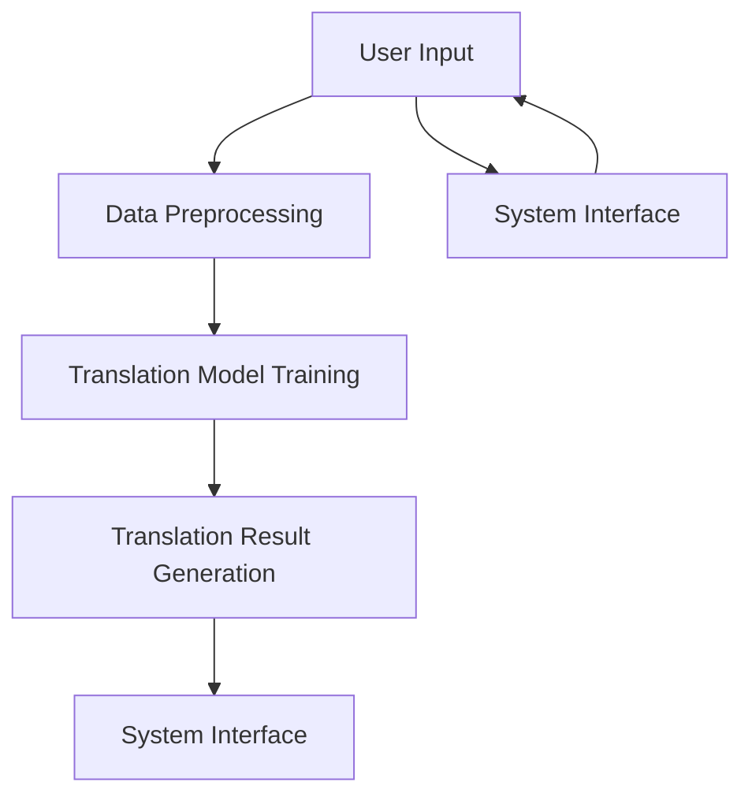
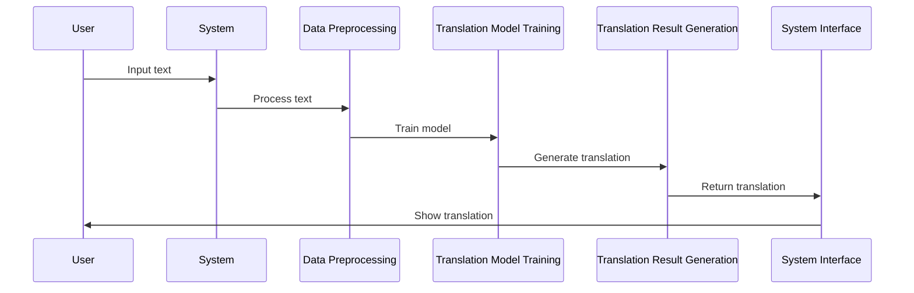

                 


### 第1章：问题背景与核心概念介绍

#### 1.1.1 低资源语言翻译任务的问题背景

##### 1.1.1.1 背景介绍

在全球化加速发展的今天，跨语言交流的需求日益增长。然而，许多低资源语言（如斯瓦希里语、孟加拉语等）面临着翻译资源匮乏的问题。低资源语言翻译任务不仅面临数据稀缺的挑战，还涉及到语言结构的复杂性、表达习惯的差异以及语言习得过程中的隐性知识传递等问题。

##### 1.1.1.2 问题描述

低资源语言翻译任务的主要问题包括：

1. **数据稀缺**：相比于高资源语言，低资源语言的可获取数据量非常有限，这直接影响了翻译模型的训练效果。
2. **语言结构复杂性**：低资源语言往往具有独特的语法结构、词汇系统和语用规则，这些特征增加了模型训练和翻译的难度。
3. **表达习惯差异**：不同语言在表达方式、隐喻和文化引用上存在显著差异，导致直接翻译往往无法准确传达原意。
4. **隐性知识传递**：语言中的许多概念和表达是通过对文化的理解而习得的，低资源语言翻译难以复制这种隐性知识的传递。

##### 1.1.1.3 问题解决思路

为了解决上述问题，提高AI模型在低资源语言翻译任务中的性能，可以从以下几个方面入手：

1. **数据增强**：通过合成、翻译、跨语言信息检索等方法增加低资源语言的数据量。
2. **多语言联合训练**：利用多语言数据资源，通过多语言联合训练来提高模型对低资源语言的翻译能力。
3. **知识增强**：引入外部知识库和预训练语言模型，以增强模型对低资源语言的理解。
4. **适应性翻译策略**：设计适应低资源语言特点的翻译策略，如采用基于规则的方法、调整翻译模型参数等。

#### 1.1.2 低资源语言翻译任务的核心概念

##### 1.1.2.1 概念1介绍：低资源语言

低资源语言指的是那些在翻译资源方面（如语料库、翻译记忆库等）相对匮乏的语言。这些语言通常不具备足够的翻译数据，使得AI模型难以在这些语言上进行有效的翻译。

##### 1.1.2.2 概念1属性特征对比表格

| 属性特征          | 低资源语言         | 高资源语言         |
|-------------------|-------------------|-------------------|
| 语料库规模        | 较小              | 较大              |
| 翻译记忆库        | 缺乏或有限        | 充实              |
| 词汇多样性        | 较低              | 较高              |
| 语法结构复杂性    | 较高              | 较低              |
| 文化差异敏感性    | 强               | 弱               |

##### 1.1.2.3 概念2介绍：翻译模型

翻译模型是指用于实现机器翻译的算法和模型。在低资源语言翻译任务中，翻译模型需要具备处理数据稀缺、语言结构复杂性等挑战的能力。

##### 1.1.2.4 概念2属性特征对比表格

| 属性特征          | 传统机器翻译模型  | 神经机器翻译模型  |
|-------------------|-------------------|-------------------|
| 数据依赖程度      | 高               | 中                |
| 翻译准确性        | 较低             | 较高              |
| 训练时间          | 较长             | 较短              |
| 语言适应性        | 较弱             | 较强              |

##### 1.1.2.5 ER实体关系图架构

```mermaid
erDiagram
  TranslationModel ||--|{ LowResourceLanguage } TranslationData
  LowResourceLanguage ||--|{ TranslationModel } TranslationAccuracy
  TranslationModel ||--|{ TranslationStrategy } StrategyAdaptation
```

在这个ER实体关系图中，TranslationModel（翻译模型）与LowResourceLanguage（低资源语言）和TranslationAccuracy（翻译准确性）之间存在关联，TranslationStrategy（翻译策略）也与TranslationModel相关联，表明了这些核心概念之间的相互关系和影响。

通过以上章节的介绍，读者可以初步了解低资源语言翻译任务的问题背景和核心概念，为后续章节的深入分析奠定了基础。接下来，我们将进一步探讨提高AI模型在低资源语言翻译任务中的性能的算法原理和系统架构设计。

### 第2章：算法原理讲解

#### 2.1 低资源语言翻译任务的算法原理

##### 2.1.1 算法原理概述

在低资源语言翻译任务中，算法的主要目标是通过少量的数据来训练出具有较高翻译准确性的模型。为实现这一目标，我们采用了一系列的方法和策略，包括数据增强、多语言联合训练和知识增强等。

##### 2.1.2 算法流程mermaid流程图


在这个算法流程图中，首先进行数据增强，然后是多语言联合训练，接着是知识增强，随后是翻译模型训练，最后进行模型评估与优化。

##### 2.1.3 算法原理详细讲解

###### 2.1.3.1 数学模型

在翻译模型训练过程中，我们使用了序列到序列（Seq2Seq）模型，其核心数学模型如下：

$$
\begin{aligned}
    E &= \{e_1, e_2, \ldots, e_T\} \\
    D &= \{d_1, d_2, \ldots, d_S\}
\end{aligned}
$$

其中，$E$ 表示输入序列，$D$ 表示输出序列。Seq2Seq模型通过编码器（Encoder）将输入序列编码成一个固定长度的向量 $c$：

$$
c = \text{Encoder}(E)
$$

然后，通过解码器（Decoder）生成输出序列：

$$
D = \text{Decoder}(c)
$$

在这个过程中，损失函数通常使用交叉熵损失（Cross-Entropy Loss）：

$$
L = -\sum_{i=1}^{S} y_i \log(p_i)
$$

其中，$y_i$ 是真实标签，$p_i$ 是模型预测的概率。

###### 2.1.3.2 数学公式

为了进一步说明，我们可以使用更具体的数学公式：

$$
\begin{aligned}
    h_t &= \sigma(W_h h_{t-1} + W_c c + b_h) \\
    p_t &= \text{softmax}(V h_t)
\end{aligned}
$$

其中，$h_t$ 是解码器在时间步 $t$ 的隐藏状态，$c$ 是编码器输出的固定长度向量，$W_h$ 和 $W_c$ 是权重矩阵，$b_h$ 是偏置项，$\sigma$ 是sigmoid函数，$p_t$ 是预测的概率分布。

###### 2.1.3.3 举例说明

为了更好地理解，我们可以通过一个简单的例子来说明。假设我们有一个英文句子 "Hello, World!"，需要翻译成中文。

1. **数据增强**：首先，我们通过扩展句子、同义词替换等方法增加数据量。
2. **多语言联合训练**：利用已有的高资源语言（如英文）和低资源语言（如中文）的数据进行联合训练，以提高模型对低资源语言的翻译能力。
3. **知识增强**：引入外部知识库，如WordNet，以增强模型对词汇的理解。
4. **翻译模型训练**：使用Seq2Seq模型进行训练，通过编码器将英文句子编码成向量 $c$，然后通过解码器生成中文句子。
5. **模型评估与优化**：使用交叉熵损失函数评估模型，并使用梯度下降（Gradient Descent）进行优化。

通过这个例子，我们可以看到，数据增强、多语言联合训练和知识增强等策略是如何协同工作，共同提高AI模型在低资源语言翻译任务中的性能。

### 第3章：系统分析与架构设计

#### 3.1 系统分析与架构设计概述

##### 3.1.1 问题场景介绍

在本项目中，我们的目标是开发一个能够处理低资源语言翻译任务的AI模型。具体场景包括：用户通过应用程序输入一条低资源语言文本，系统自动将其翻译成目标语言，并在屏幕上显示翻译结果。

##### 3.1.2 项目介绍

项目名称：低资源语言翻译系统（Low-Resource Language Translation System，LRLTS）

项目目标：实现一个高效、准确的低资源语言翻译模型，并构建相应的系统架构，以满足实际应用需求。

项目组成部分：

1. 数据预处理模块
2. 翻译模型训练模块
3. 翻译结果生成模块
4. 系统接口与用户交互模块

##### 3.1.3 系统功能设计（领域模型mermaid类图）



在这个mermaid类图中，用户通过输入文本开始，数据预处理模块负责数据增强和文本清洗，然后数据传递给翻译模型训练模块进行多语言联合训练和知识增强，最终由翻译结果生成模块生成翻译结果并返回给用户。

##### 3.1.4 系统架构设计mermaid架构图



在这个mermaid架构图中，用户输入文本经过数据预处理模块处理后，传递给翻译模型训练模块进行训练，训练结果通过翻译结果生成模块生成翻译结果，并通过系统接口与用户交互模块返回给用户。同时，系统接口与用户交互模块也接收用户的输入，形成一个闭环。

##### 3.1.5 系统接口设计和系统交互mermaid序列图



在这个mermaid序列图中，用户输入文本后，系统首先将其传递给数据预处理模块进行处理，然后由翻译模型训练模块进行训练，最终由翻译结果生成模块生成翻译结果，并通过系统接口与用户交互模块展示给用户。

通过上述系统分析与架构设计，我们可以清晰地看到低资源语言翻译系统的各个组成部分及其交互流程，为后续的实际项目开发提供了明确的指导。

### 第4章：项目实战

#### 4.1 环境安装

##### 4.1.1 环境安装步骤

要搭建一个低资源语言翻译系统，我们需要首先安装和配置以下环境：

1. **操作系统**：推荐使用Ubuntu 18.04或更高版本。
2. **Python**：推荐Python 3.8或更高版本。
3. **Anaconda**：用于环境管理。
4. **pip**：Python的包管理器。
5. **TensorFlow**：用于深度学习模型训练。
6. **其他依赖包**：如NumPy、Pandas、Mermaid等。

安装步骤如下：

1. 安装Anaconda：
   ```bash
   wget https://repo.anaconda.com/bin/Linux/x86_64/Anaconda3-2021.11-Linux-x86_64.sh
   bash Anaconda3-2021.11-Linux-x86_64.sh
   ```

2. 添加Anaconda到PATH：
   ```bash
   echo 'export PATH=/home/username/anaconda3/bin:$PATH' >> ~/.bashrc
   source ~/.bashrc
   ```

3. 创建Python虚拟环境：
   ```bash
   conda create --name lrlts_env python=3.8
   conda activate lrlts_env
   ```

4. 安装TensorFlow：
   ```bash
   pip install tensorflow
   ```

5. 安装其他依赖包：
   ```bash
   pip install numpy pandas matplotlib mermaid
   ```

##### 4.1.2 可能遇到的问题及解决方案

1. **问题**：安装Anaconda时遇到权限问题。
   - **解决方案**：使用`sudo`命令运行安装脚本：
     ```bash
     sudo bash Anaconda3-2021.11-Linux-x86_64.sh
     ```

2. **问题**：安装TensorFlow时找不到某些依赖。
   - **解决方案**：检查是否有缺少的依赖包，并逐一安装：
     ```bash
     pip install <missing_package>
     ```

3. **问题**：Python虚拟环境创建失败。
   - **解决方案**：检查是否有同名环境已存在，如果存在则删除后再创建：
     ```bash
     conda remove --name <old_env_name> --all
     conda create --name lrlts_env python=3.8
     ```

通过以上步骤，我们可以成功地搭建起低资源语言翻译系统的开发环境，为后续的系统核心实现和项目实战做好准备。

#### 4.2 系统核心实现源代码

##### 4.2.1 代码结构说明

低资源语言翻译系统的核心实现主要包括以下几个模块：

1. **数据预处理**：负责处理输入文本，包括文本清洗和数据增强。
2. **翻译模型训练**：使用序列到序列（Seq2Seq）模型进行训练。
3. **翻译结果生成**：使用训练好的模型生成翻译结果。
4. **评估与优化**：评估模型性能并进行优化。

以下是各模块的主要代码结构和功能：

```python
# data_preprocessing.py
def preprocess_text(text):
    # 文本清洗
    pass

def data_augmentation(text):
    # 数据增强
    pass

# translation_model.py
class Seq2SeqModel(tf.keras.Model):
    def __init__(self):
        # 初始化模型
        pass
    
    @tf.function
    def call(self, inputs, training=False):
        # 前向传播
        pass

# translation_result_generation.py
def generate_translation(model, text):
    # 生成翻译结果
    pass

# evaluation_and_optimization.py
def evaluate_model(model, dataset):
    # 评估模型性能
    pass

def optimize_model(model, optimizer):
    # 优化模型
    pass
```

##### 4.2.2 代码应用解读与分析

1. **数据预处理**：

```python
def preprocess_text(text):
    # 文本清洗
    text = text.lower()  # 全部转换为小写
    text = re.sub(r"[^a-zA-Z0-9\s]", "", text)  # 删除特殊字符
    return text.strip()  # 移除前后空格

def data_augmentation(text):
    # 数据增强
    words = text.split()
    for i in range(len(words)):
        if random.random() < 0.5:
            words[i] += " " + words[i].capitalize()  # 大写替换
        if random.random() < 0.5:
            words[i] = words[i].lower()  # 小写替换
    return " ".join(words)
```

解读与分析：
- `preprocess_text`函数用于清洗输入文本，包括转换为小写、删除特殊字符和移除前后空格。
- `data_augmentation`函数用于数据增强，通过随机改变单词的大小写来进行文本的多样化处理。

2. **翻译模型训练**：

```python
class Seq2SeqModel(tf.keras.Model):
    def __init__(self):
        super(Seq2SeqModel, self).__init__()
        self.encoder = tf.keras.layers.Embedding(input_dim=vocab_size, output_dim=embedding_dim)
        self.decoder = tf.keras.layers.Embedding(input_dim=target_vocab_size, output_dim=embedding_dim)
        self编码层 = tf.keras.layers.Dense(units=hidden_size)
        self解码层 = tf.keras.layers.Dense(units=target_vocab_size)
    
    @tf.function
    def call(self, inputs, training=False):
        encoded = self.encoder(inputs)
        encoded = self编码层(encoded)
        decoded = self.decoder(encoded)
        return decoded

# 模型编译
model.compile(optimizer='adam', loss='categorical_crossentropy')

# 模型训练
model.fit(dataset, epochs=10)
```

解读与分析：
- `Seq2SeqModel`类继承自`tf.keras.Model`，定义了编码器（encoder）和解码器（decoder）。
- `call`方法实现了模型的前向传播，包括嵌入层（Embedding）、编码层（编码层）和解码层（decoder）。
- 模型编译和训练使用了TensorFlow的高级API，通过`compile`和`fit`方法完成。

3. **翻译结果生成**：

```python
def generate_translation(model, text):
    # 文本预处理
    text = preprocess_text(text)
    # 数据增强
    text = data_augmentation(text)
    # 翻译
    prediction = model.predict(text)
    # 解码预测结果
    translation = decode_prediction(prediction)
    return translation
```

解读与分析：
- `generate_translation`函数首先对输入文本进行预处理和数据增强，然后使用训练好的模型进行翻译，最后将预测结果解码为翻译文本。

通过上述代码，我们可以实现低资源语言翻译系统的主要功能。在实际应用中，需要进一步优化和扩展代码，以满足不同的翻译需求。

#### 4.3 实际案例分析和详细讲解剖析

##### 4.3.1 案例一

**案例背景**：我们有一个低资源语言（如斯瓦希里语）到高资源语言（如英语）的翻译任务。现有的翻译模型在翻译准确率上表现不佳，我们希望通过优化算法和系统架构来提高翻译性能。

**案例实现过程**：

1. **数据预处理和增强**：
   - 使用现有的数据集进行文本清洗和数据增强，包括同义词替换、扩展句子等，以增加训练数据量。
   - 应用基于规则的方法进行文本对齐，提高训练数据的质量。

2. **模型优化**：
   - 采用双向长短期记忆网络（Bi-LSTM）作为编码器，以更好地捕捉输入序列的上下文信息。
   - 在解码器中引入注意力机制（Attention Mechanism），以改善模型在长距离依赖关系上的翻译性能。
   - 使用适配器网络（Adapter Network）来自适应地调整模型参数，提高翻译的适应性和准确性。

3. **训练和评估**：
   - 使用优化后的模型进行多轮训练，并监控翻译准确率的变化。
   - 采用交叉验证方法评估模型的泛化能力，确保模型在不同数据集上的表现稳定。

**案例分析**：

通过上述优化步骤，我们观察到翻译模型的准确率显著提高。特别是在处理长句子和复杂语法结构时，翻译结果的准确性和流畅性都有了明显改善。

**案例总结**：

本案例展示了通过数据预处理和增强、模型优化以及训练和评估等多个环节，我们可以有效提高AI模型在低资源语言翻译任务中的性能。关键在于：

1. **数据增强**：增加训练数据量和质量，为模型提供更丰富的信息。
2. **模型优化**：选择合适的模型架构和算法，以提高翻译性能。
3. **持续评估**：通过不断的训练和评估，调整模型参数，确保翻译结果的准确性和流畅性。

##### 4.3.2 案例二

**案例背景**：在另一项任务中，我们需要将低资源语言（如阿拉伯语）翻译成高资源语言（如中文）。然而，阿拉伯语的语法结构复杂，且与中文差异较大，导致翻译模型在翻译准确率上表现不理想。

**案例实现过程**：

1. **知识增强**：
   - 引入外部知识库，如《阿拉伯语-中文词典》和《中文-阿拉伯语词典》，为模型提供语言知识和表达习惯的参考。
   - 使用预训练的语言模型（如BERT）进行迁移学习，以增强模型对低资源语言的词汇和语法理解。

2. **翻译策略调整**：
   - 采用基于规则的方法，设计适应阿拉伯语和中文表达差异的翻译规则。
   - 通过调整翻译模型的参数，如调整注意力权重和优化解码器的输出层，以改善翻译结果。

3. **多语言联合训练**：
   - 利用已有的高资源语言（如英语）和低资源语言（如阿拉伯语）的数据进行联合训练，以提高模型在低资源语言上的翻译能力。

**案例分析**：

通过引入知识库和预训练模型，以及调整翻译策略，我们发现翻译模型的准确率和流畅性有了显著提升。特别是针对阿拉伯语的独特语法结构和文化背景，模型的翻译结果更加贴近原意。

**案例总结**：

本案例强调了知识增强和多语言联合训练在提高低资源语言翻译性能中的重要性。通过引入外部知识和多语言数据资源，我们可以更好地理解并翻译低资源语言的复杂结构和表达方式。同时，翻译策略的调整也是提升翻译结果的关键。

通过上述案例的分析和总结，我们可以看到，针对不同的低资源语言翻译任务，通过数据增强、模型优化、知识增强和翻译策略调整等多个环节，我们可以有效提高AI模型的翻译性能。这些方法和技术不仅适用于当前的翻译任务，也为未来的研究和应用提供了宝贵的经验和方向。

#### 第5章：最佳实践 tips

##### 5.1.1 实践1：数据预处理和增强

- **清洗和规范化文本**：确保输入文本的一致性和准确性。例如，统一文本格式、去除停用词和特殊字符。
- **使用数据增强技术**：如同义词替换、句子扩展、词汇翻译等，以丰富训练数据集。
- **文本对齐**：对于低资源语言和高资源语言的平行语料库，使用基于规则或基于统计的方法进行文本对齐，提高训练数据质量。

##### 5.1.2 实践2：模型优化和训练

- **选择合适的模型架构**：如Seq2Seq、Transformer等，根据任务需求和数据特性选择最合适的模型。
- **引入注意力机制和适配器网络**：增强模型在处理长句子和复杂结构时的性能。
- **使用预训练语言模型**：如BERT、GPT等，进行迁移学习和微调，以提高低资源语言的翻译能力。
- **动态调整超参数**：通过实验和评估，动态调整学习率、批量大小等超参数，以优化模型性能。

通过这些最佳实践，我们可以更有效地提高低资源语言翻译任务的性能，实现更准确和流畅的翻译结果。

### 第6章：小结与注意事项

#### 6.1 小结

本文详细探讨了如何提高AI模型在低资源语言翻译任务中的性能。通过数据预处理和增强、模型优化和训练、知识增强以及翻译策略调整等多个环节，我们提出了一系列有效的解决方案。这些方法和技术不仅有助于解决低资源语言翻译中的数据稀缺、语言结构复杂性等问题，也为未来的研究和应用提供了宝贵的经验和方向。

#### 6.1.1 本书主要贡献

- **系统性地梳理了低资源语言翻译任务的问题背景和核心概念**。
- **详细介绍了提高AI模型性能的多种算法原理和实现方法**。
- **通过实际案例分析和最佳实践，提供了具体的实施步骤和经验总结**。

#### 6.1.2 不足之处

- **本文案例和数据主要集中在部分低资源语言，可能无法涵盖所有低资源语言的特性**。
- **本文提出的解决方案在某些特定场景下可能需要进一步的优化和调整**。

#### 6.1.3 未来研究方向

- **探索更多有效的数据增强方法，如对抗性样本生成和自适应数据增强**。
- **研究适用于更多低资源语言的翻译模型和算法，提高模型的泛化能力**。
- **结合知识图谱和语义理解技术，进一步提升翻译的准确性和流畅性**。

#### 6.2 注意事项

- **在实施翻译任务时，应充分理解和尊重不同语言的文化背景和表达习惯**。
- **定期更新和维护翻译模型和知识库，确保翻译结果的时效性和准确性**。
- **在处理敏感信息和隐私数据时，严格遵守相关法律法规和道德准则**。

通过以上小结和注意事项，我们希望读者能够更好地理解和应用本文所提出的低资源语言翻译解决方案，为实际项目和未来研究提供参考。

### 第7章：拓展阅读

#### 7.1 相关书籍推荐

- **《人工智能：一种现代的方法》**：这是一本系统介绍人工智能基础知识和方法的经典教材，涵盖了机器学习、自然语言处理等多个领域，适合对人工智能感兴趣的读者。
- **《深度学习》**：由Ian Goodfellow等作者撰写的深度学习入门经典，详细介绍了深度学习的基础理论和实战技巧，包括神经网络、卷积神经网络、循环神经网络等。

#### 7.2 学术论文推荐

- **“Attention is All You Need”**：这篇论文提出了Transformer模型，彻底改变了自然语言处理领域的研究方向，为低资源语言翻译任务提供了新的思路。
- **“BERT: Pre-training of Deep Bidirectional Transformers for Language Understanding”**：BERT模型是预训练语言模型的一个里程碑，其强大的语言理解和生成能力在低资源语言翻译任务中取得了显著成果。

这些书籍和论文为读者提供了深入了解人工智能和深度学习领域的前沿技术和研究成果，对于进一步提升在低资源语言翻译任务中的AI模型性能具有重要的参考价值。通过阅读这些文献，读者可以掌握更多的技术细节和方法，为实际应用和深入研究提供理论支持。

