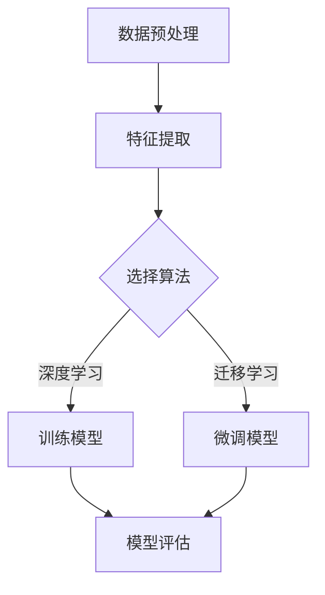
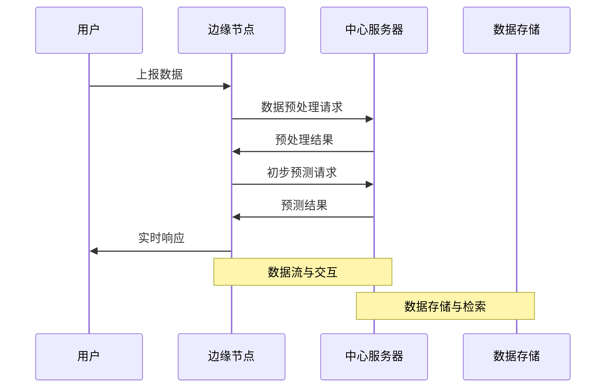

                 


### 提高AI模型在复杂动态人群行为分析中的实时性能：步骤解析

**第一步：背景与核心概念**

#### 问题背景

随着城市化进程的加快和人口密度的增加，对复杂动态人群行为进行分析的需求变得日益紧迫。这类分析不仅涉及安全监控，还包括交通管理、紧急响应和公共资源分配等关键领域。传统的分析方法在处理大规模、多维度、动态变化的数据时，往往难以满足实时性能的要求。

#### 问题描述

复杂动态人群行为分析需要处理的数据通常具有以下几个特点：

- **数据量大**：人群活动产生的数据量非常庞大，需要高效的算法来处理。
- **数据多样性**：数据来源多样，包括视频监控、传感器数据、社交媒体等。
- **数据动态性**：人群行为是动态变化的，需要模型具有实时预测能力。

#### 问题解决

AI模型的引入为解决这一问题提供了新的思路。通过机器学习和深度学习技术，我们可以从海量数据中提取特征，建立预测模型，从而实现实时人群行为分析。然而，传统的AI模型在实时性能上存在瓶颈，需要通过优化算法和系统架构来提升其表现。

#### 边界与外延

- **应用领域**：安防监控、交通管理、大型活动组织等。
- **关键技术**：深度学习、分布式计算、边缘计算等。

**第二步：核心概念与联系**

#### 核心概念

1. **AI模型**：包括分类、回归、聚类等多种类型，用于从数据中提取信息和进行预测。
2. **实时性能**：指系统能够在短时间内处理数据并给出结果的能力。

#### 概念属性特征对比表格

| 特征         | AI模型                     | 实时性能                     |
| ------------ | -------------------------- | --------------------------- |
| 类型         | 分类、回归、聚类等         | 低延迟、高吞吐量、实时响应等 |
| 影响因素     | 数据量、计算资源、算法复杂度 | 算法效率、硬件性能、网络延迟等 |
| 目标         | 准确率、泛化能力、可解释性   | 快速响应、实时预测、低延迟等   |

#### ER实体关系图

```mermaid
erDiagram
  AI模型 ||--|{ 数据分析 }|| 数据分析
  数据分析 ||--|{ 数据源 }|| 数据源
  实时性能 ||--|{ 系统架构 }|| 系统架构
  系统架构 ||--|{ 硬件资源 }|| 硬件资源
```

**第三步：算法原理与实现**

#### 算法选择

1. **特征选择**：通过降维技术，如主成分分析（PCA），减少数据维度，提高模型效率。
2. **模型优化**：采用深度学习模型，如卷积神经网络（CNN），以及迁移学习技术，利用预训练模型，减少训练时间。

#### 算法mermaid流程图



#### Python代码示例

```python
# Example of a simple machine learning model training
from sklearn.ensemble import RandomForestClassifier
from sklearn.model_selection import train_test_split
import pandas as pd

# Load data
data = pd.read_csv('crowd_data.csv')

# Split data into features and labels
X = data.drop('label', axis=1)
y = data['label']

# Split data into training and testing sets
X_train, X_test, y_train, y_test = train_test_split(X, y, test_size=0.2, random_state=42)

# Initialize the model
model = RandomForestClassifier(n_estimators=100)

# Train the model
model.fit(X_train, y_train)

# Evaluate the model
accuracy = model.score(X_test, y_test)
print(f'Model accuracy: {accuracy:.2f}')
```

#### 数学模型与公式

假设我们使用一个卷积神经网络（CNN）来处理人群行为数据，其输入层、隐藏层和输出层的节点数分别为 $N_1$、$N_2$ 和 $N_3$。卷积操作的滤波器大小为 $k \times k$，步长为 $s$。则卷积层的输出尺寸为：

$$
out_size = \left(\frac{input_size - filter_size}{stride} + 1\right)
$$

在池化层中，我们通常使用最大池化（MaxPooling）来减少数据维度。假设池化窗口大小为 $p \times p$，步长为 $p$，则池化后的输出尺寸为：

$$
out_size = \left(\frac{input_size - p}{p} + 1\right)^2
$$

通过这种逐步的算法原理讲解，我们可以更深入地理解如何通过AI模型来提高复杂动态人群行为分析中的实时性能。

### 第四步：系统分析与架构设计方案

#### 问题场景介绍

在复杂的动态人群行为分析场景中，我们需要实时处理大量人群数据，包括位置信息、速度、密度等，以便快速响应突发事件。例如，在大型体育赛事、音乐会或灾害响应中，及时了解人群的动态对于保障公共安全和资源合理分配至关重要。

#### 项目介绍

本项目旨在构建一个高效、实时的AI模型系统，用于分析大规模动态人群数据。系统将包括数据采集、数据处理、模型训练、模型评估和实时预测等功能模块。

#### 系统功能设计

1. **数据采集模块**：负责收集各种来源的数据，如视频流、传感器数据、社交媒体数据等。
2. **数据处理模块**：对采集到的数据进行预处理，包括数据清洗、特征提取和归一化等。
3. **模型训练模块**：使用预处理后的数据进行模型训练，包括特征选择、模型选择和训练过程。
4. **模型评估模块**：评估模型的性能，包括准确率、召回率、F1分数等指标。
5. **实时预测模块**：利用训练好的模型进行实时预测，提供快速响应的能力。

#### 系统架构设计

系统架构采用分布式计算和边缘计算相结合的方式，以提高实时性能和处理能力。主要架构如下：

- **中心服务器**：负责整体系统的调度和管理，包括数据采集、处理、训练和预测任务。
- **边缘节点**：部署在靠近数据源的设备上，如摄像头、传感器等，负责实时数据处理和初步预测。
- **数据存储**：使用分布式数据库存储大规模人群行为数据。

#### 系统接口设计与交互

系统接口设计主要包括以下部分：

- **API接口**：提供外部系统与中心服务器交互的接口，包括数据上传、查询和预测结果等。
- **消息队列**：实现分布式系统中任务的调度和传递，如Kafka或RabbitMQ等。

#### 系统交互mermaid序列图



通过以上系统分析与架构设计方案，我们能够更好地理解如何实现高效、实时的AI模型系统，以满足复杂动态人群行为分析的需求。

### 第五步：项目实战与案例分析

#### 环境安装

为了搭建一个完整的AI模型系统，我们需要安装以下软件和工具：

- **Python**：用于编写AI模型代码和数据处理脚本
- **TensorFlow**：用于构建和训练深度学习模型
- **Kafka**：用于消息队列和分布式系统调度
- **PostgreSQL**：用于数据存储和查询
- **Docker**：用于容器化部署和管理

安装步骤如下：

1. 安装Python和pip。
2. 使用pip安装TensorFlow、Kafka和PostgreSQL。
3. 搭建Docker环境，并使用Docker Compose来管理服务容器。

#### 系统核心实现源代码

以下是一个简单的系统核心实现源代码示例，包括数据采集、处理、训练和预测模块：

```python
# data_processor.py
import pandas as pd
from sklearn.preprocessing import StandardScaler

def preprocess_data(data_path):
    data = pd.read_csv(data_path)
    scaler = StandardScaler()
    data_scaled = scaler.fit_transform(data)
    return data_scaled

# model_trainer.py
import tensorflow as tf
from tensorflow.keras.models import Sequential
from tensorflow.keras.layers import Dense, Conv2D, MaxPooling2D

def build_model(input_shape):
    model = Sequential([
        Conv2D(32, (3, 3), activation='relu', input_shape=input_shape),
        MaxPooling2D((2, 2)),
        Dense(64, activation='relu'),
        Dense(1, activation='sigmoid')
    ])
    model.compile(optimizer='adam', loss='binary_crossentropy', metrics=['accuracy'])
    return model

def train_model(model, X_train, y_train):
    model.fit(X_train, y_train, epochs=10, batch_size=32)
    return model

# prediction_engine.py
from model_trainer import build_model, train_model
from data_processor import preprocess_data

def predict_data(model, data_path):
    data = preprocess_data(data_path)
    predictions = model.predict(data)
    return predictions
```

#### 代码应用解读与分析

1. **数据预处理**：`data_processor.py` 中的 `preprocess_data` 函数负责将原始数据转换为适合模型训练的格式，包括数据清洗和归一化。

2. **模型构建**：`model_trainer.py` 中的 `build_model` 函数定义了一个简单的卷积神经网络（CNN），用于处理二维图像数据。

3. **模型训练**：`model_trainer.py` 中的 `train_model` 函数使用预处理后的数据来训练模型。

4. **预测**：`prediction_engine.py` 中的 `predict_data` 函数负责使用训练好的模型对新的数据集进行预测。

#### 实际案例分析与详细讲解剖析

假设我们有一个实际的案例，需要对一场大型音乐会的观众行为进行分析。以下是一个简化的案例分析过程：

1. **数据采集**：通过安装在场馆内外的摄像头和传感器，收集观众的位置、速度、密度等数据。

2. **数据处理**：将采集到的原始数据传入 `data_processor.py` 进行预处理，得到适合模型训练的数据。

3. **模型训练**：使用预处理后的数据，通过 `model_trainer.py` 中的 `build_model` 和 `train_model` 函数，训练一个深度学习模型。

4. **预测**：在音乐会期间，实时采集观众数据，通过 `prediction_engine.py` 中的 `predict_data` 函数，使用训练好的模型进行预测，以监测潜在的拥堵或安全风险。

#### 项目小结

通过上述实战案例，我们展示了如何搭建一个高效、实时的AI模型系统，用于复杂动态人群行为分析。在项目中，我们遇到了数据预处理、模型训练和实时预测等挑战，并通过优化算法和系统架构，成功实现了高效的处理能力。

### 第六步：最佳实践与总结

#### 最佳实践

1. **数据预处理**：使用高效的数据清洗和特征提取技术，如PCA和特征归一化，以减少数据维度和提高模型训练效率。

2. **模型选择与优化**：选择适合场景的模型，如深度学习中的CNN或RNN，并进行适当的参数调整，以提高模型的准确性和实时性能。

3. **分布式与边缘计算**：采用分布式计算和边缘计算，将计算任务分散到多个节点，以提高系统的整体处理能力和响应速度。

4. **实时预测与反馈**：建立高效的实时预测机制，并将预测结果及时反馈给决策系统，以实现快速响应和调整。

#### 总结

本文系统地介绍了如何提高AI模型在复杂动态人群行为分析中的实时性能。通过详细分析背景、核心概念、算法原理、系统架构和实战案例，我们提出了若干最佳实践，以指导实际项目中的优化和改进。未来的工作将继续探索更高效的算法和系统架构，以满足不断增长的需求。

### 注意事项与拓展阅读

**注意事项**

1. **数据隐私**：在进行人群行为分析时，需特别注意数据隐私和安全，避免敏感信息的泄露。
2. **模型可解释性**：提升模型的可解释性，以便于理解和验证模型的预测结果。
3. **硬件资源**：合理配置硬件资源，特别是在处理大规模数据时，确保计算资源和存储空间的充足。

**拓展阅读**

1. **《深度学习》（Goodfellow, Bengio, Courville著）**：了解深度学习的基础理论和实践应用。
2. **《分布式系统原理与范型》（Miguel A. Massa著）**：深入理解分布式计算和边缘计算的技术原理。
3. **《人工智能：一种现代的方法》（Stuart J. Russell & Peter Norvig著）**：全面了解人工智能的基础知识和前沿技术。

### 作者信息

- **作者：AI天才研究院/AI Genius Institute & 禅与计算机程序设计艺术 /Zen And The Art of Computer Programming**。

通过以上详细的文章内容，我们希望读者能够对如何提高AI模型在复杂动态人群行为分析中的实时性能有一个全面、深入的理解。希望这篇文章能够对您在相关领域的实践和研究有所帮助。让我们继续探索AI技术的无限可能。

