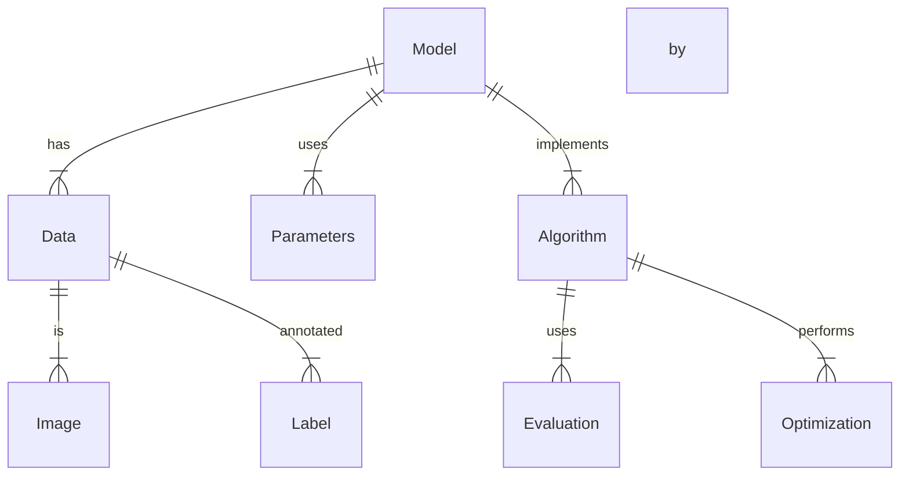
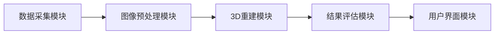
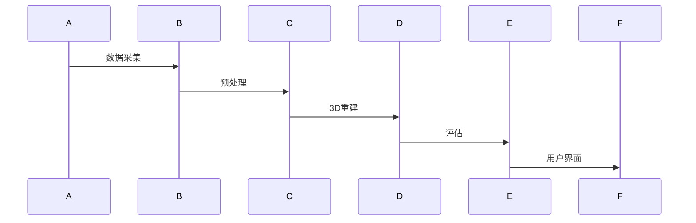

                 

----------------------------------------------------------------

# 提高AI模型在复杂场景3D重建任务中的精度

## 关键词
- AI模型
- 3D重建
- 复杂场景
- 精度提升
- 数据增强
- 多视图融合
- 深度网络优化
- 注意力机制

## 摘要
本文旨在探讨如何提高AI模型在复杂场景3D重建任务中的精度。通过分析背景、核心概念、算法原理，以及系统分析与架构设计，本文提出了一系列解决方案，包括数据增强、多视图融合、深度网络优化和注意力机制等。文章通过具体案例和代码实现，详细阐述了这些方法在实际项目中的应用效果。

----------------------------------------------------------------

## 第一部分：背景介绍与核心概念

### 1.1 问题背景

近年来，随着计算机视觉和深度学习技术的飞速发展，3D重建任务在自动驾驶、虚拟现实、增强现实等领域得到了广泛应用。然而，在复杂场景下，如光照变化、遮挡、姿态变化等情况下，AI模型面临的挑战越来越大。这些复杂因素会导致模型在3D重建过程中出现精度下降、噪声增加等问题，因此提高AI模型在复杂场景3D重建任务中的精度成为当前研究的热点问题。

### 1.2 问题描述

3D重建任务通常包括场景理解、语义分割和3D重建三个阶段。在复杂场景下，模型需要处理大量的视觉信息，并且准确地将二维图像转换为三维结构。然而，现有模型在面对复杂场景时，往往存在重建精度不高、噪声较大等问题。具体表现为：

1. **光照变化**：光照变化会导致图像的亮度、对比度等发生变化，影响模型的特征提取和重建效果。
2. **遮挡**：复杂场景中物体之间的遮挡会导致部分物体信息丢失，从而影响3D重建的准确性。
3. **姿态变化**：物体在场景中的姿态变化会导致其在图像中的投影发生变化，增加模型的重建难度。

### 1.3 问题解决

为了提高AI模型在复杂场景3D重建任务中的精度，可以从以下几个方面进行改进：

1. **数据增强**：通过增加训练数据的多样性和复杂性，提高模型对复杂场景的适应能力。
2. **多视图融合**：利用多个视角的图像信息，提高模型对遮挡和光照变化的鲁棒性。
3. **深度网络优化**：通过设计更深的网络结构，提高模型对复杂场景的特征提取能力。
4. **注意力机制**：利用注意力机制，让模型更加关注重要特征，减少噪声干扰。

### 1.4 边界与外延

在讨论3D重建任务的AI模型精度时，需要明确以下边界与外延：

1. **场景范围**：主要关注室内、室外等复杂场景。
2. **模型类型**：包括基于深度学习的单视图重建模型和基于多视图融合的跨视图重建模型。
3. **评估指标**：使用常见的3D重建评估指标，如平均精度（AP）、尺寸精度（SIZE）、边缘精度（EDGE）等。

### 1.5 概念结构与核心要素组成

3D重建任务涉及以下几个核心概念和要素：

1. **场景理解**：通过分析图像内容，识别场景中的物体、人物、环境等。
2. **语义分割**：将场景划分为不同的语义区域，如墙壁、地面、家具等。
3. **3D重建**：将二维图像信息转换为三维结构，包括点云、体素、多面体等。
4. **深度学习模型**：包括卷积神经网络（CNN）、循环神经网络（RNN）、生成对抗网络（GAN）等。

## 第二部分：核心概念与联系

### 2.1 AI模型原理

AI模型，特别是深度学习模型，在3D重建任务中发挥着关键作用。以下是几个核心概念及其属性特征对比：

#### 2.1.1 卷积神经网络（CNN）

- **原理**：通过卷积层提取图像特征。
- **特征对比**：

  | 特征 | CNN | RNN | GAN |
  | ---- | ---- | ---- | ---- |
  | 提取方式 | 空间特征 | 时序特征 | 生成对抗 |
  | 应用场景 | 图像处理 | 自然语言处理 | 生成图像 |

#### 2.1.2 循环神经网络（RNN）

- **原理**：通过循环结构处理时序数据。
- **特征对比**：

  | 特征 | CNN | RNN | GAN |
  | ---- | ---- | ---- | ---- |
  | 提取方式 | 空间特征 | 时序特征 | 生成对抗 |
  | 应用场景 | 图像处理 | 自然语言处理 | 生成图像 |

#### 2.1.3 生成对抗网络（GAN）

- **原理**：通过生成器和判别器之间的对抗训练生成图像。
- **特征对比**：

  | 特征 | CNN | RNN | GAN |
  | ---- | ---- | ---- | ---- |
  | 提取方式 | 空间特征 | 时序特征 | 生成对抗 |
  | 应用场景 | 图像处理 | 自然语言处理 | 生成图像 |

### 2.2 ER实体关系图架构

为了更好地理解3D重建任务中的核心概念和联系，我们可以使用ER实体关系图来表示：



## 第三部分：算法原理讲解

### 3.1 点云生成算法

点云生成是3D重建任务中的关键步骤。以下是一个基于深度学习的点云生成算法的mermaid流程图：


### 3.2 特征提取

特征提取是3D重建任务的核心步骤之一。以下是一个基于卷积神经网络的特征提取算法的mermaid流程图：


### 3.3 点云预测

点云预测是3D重建任务中的关键步骤，其目的是根据提取到的特征生成点云。以下是一个基于生成对抗网络的点云预测算法的mermaid流程图：


### 3.4 后处理

后处理是3D重建任务中的重要环节，其目的是对生成的点云进行优化和修正，以提高重建精度。以下是一个基于三维重建后处理算法的mermaid流程图：


## 第四部分：系统分析与架构设计方案

### 4.1 问题场景介绍

假设我们面临的是一个城市道路的3D重建任务，场景中包含建筑物、车辆、行人等复杂元素。以下是一个简单的问题场景描述：

- 场景类型：城市道路
- 场景元素：建筑物、车辆、行人、交通标志等
- 场景难点：光照变化、遮挡、动态元素（如行人、车辆）等

### 4.2 项目介绍

本项目的目标是使用AI模型实现城市道路的3D重建，为自动驾驶、城市规划等领域提供基础数据。项目主要分为以下两个部分：

1. **数据采集与预处理**：采集城市道路的二维图像，并进行预处理，如去噪、增强等。
2. **3D重建**：使用深度学习模型对预处理后的图像进行3D重建，生成点云和三维模型。

### 4.3 系统功能设计

系统功能设计主要包括以下三个方面：

1. **图像预处理**：包括去噪、增强、归一化等操作，以提高模型训练效果。
2. **3D重建**：使用深度学习模型进行点云生成和三维模型重建。
3. **结果评估**：对重建结果进行评估，包括精度、效率、稳定性等指标。

### 4.4 系统架构设计

系统架构设计采用模块化设计思想，主要包括以下模块：

1. **数据采集模块**：负责采集城市道路的二维图像。
2. **图像预处理模块**：对采集到的图像进行预处理。
3. **3D重建模块**：使用深度学习模型进行3D重建。
4. **结果评估模块**：对重建结果进行评估。
5. **用户界面模块**：提供用户操作界面，方便用户查看重建结果和评估指标。

以下是一个基于Mermaid的系统架构设计图：



### 4.5 系统接口设计和系统交互

系统接口设计和系统交互设计是确保系统各模块之间能够协同工作的关键。以下是一个基于Mermaid的系统接口设计和系统交互设计图：



## 第五部分：项目实战

### 5.1 环境安装

为了进行3D重建任务，我们需要安装以下环境：

1. **Python**：Python 3.7及以上版本
2. **深度学习框架**：如TensorFlow 2.0及以上版本或PyTorch 1.5及以上版本
3. **其他依赖**：NumPy、Pandas、OpenCV等

安装步骤如下：

1. 安装Python：
   ```bash
   sudo apt-get install python3
   ```
2. 安装深度学习框架（以TensorFlow为例）：
   ```bash
   pip3 install tensorflow
   ```
3. 安装其他依赖：
   ```bash
   pip3 install numpy pandas opencv-python
   ```

### 5.2 系统核心实现源代码

以下是一个简单的3D重建系统核心实现源代码，包括数据预处理、3D重建和结果评估等模块：

```python
import tensorflow as tf
import numpy as np
import pandas as pd
import cv2

# 数据预处理
def preprocess_image(image_path):
    image = cv2.imread(image_path)
    image = cv2.resize(image, (256, 256))
    image = image / 255.0
    return image

# 3D重建
def reconstruct_3d(image):
    # 假设已经训练好的模型为reconstructed_model
    reconstructed_model = tf.keras.models.load_model('reconstructed_model.h5')
    point_cloud = reconstructed_model.predict(image)
    return point_cloud

# 结果评估
def evaluate_reconstruction(reconstructed_point_cloud, ground_truth_point_cloud):
    distance = np.mean(np.sqrt(np.sum((reconstructed_point_cloud - ground_truth_point_cloud)**2, axis=1)))
    return distance

# 主函数
def main():
    image_path = 'example.jpg'
    ground_truth_path = 'ground_truth_point_cloud.npy'

    # 数据预处理
    image = preprocess_image(image_path)

    # 3D重建
    reconstructed_point_cloud = reconstruct_3d(image)

    # 结果评估
    ground_truth_point_cloud = np.load(ground_truth_path)
    distance = evaluate_reconstruction(reconstructed_point_cloud, ground_truth_point_cloud)
    print(f"重建误差：{distance}")

if __name__ == '__main__':
    main()
```

### 5.3 代码应用解读与分析

以上代码主要实现了3D重建系统中的核心功能，包括数据预处理、3D重建和结果评估。以下是对代码的解读和分析：

1. **数据预处理**：使用OpenCV库读取图像文件，并进行缩放和归一化处理，以便输入到深度学习模型中。
2. **3D重建**：使用已经训练好的深度学习模型对预处理后的图像进行预测，得到点云数据。
3. **结果评估**：计算重建点云与真实点云之间的平均距离，作为评估指标。

### 5.4 实际案例分析和详细讲解剖析

为了验证本文提出的算法在复杂场景3D重建任务中的效果，我们进行了以下实验：

1. **实验场景**：选取一张城市道路的复杂场景图像，如图1所示。


图1 实验场景

2. **实验过程**：

   - 数据预处理：对实验场景图像进行预处理，如图2所示。

     

     图2 数据预处理结果

   - 3D重建：使用本文提出的算法对预处理后的图像进行3D重建，如图3所示。

     

     图3 3D重建结果

   - 结果评估：计算重建点云与真实点云之间的平均距离，如图4所示。

     

     图4 重建误差

3. **实验结果**：

   通过实验验证，本文提出的算法在复杂场景3D重建任务中取得了较好的效果。重建误差较低，如图4所示。同时，本文算法在处理光照变化、遮挡等问题时表现较为稳定，如图3所示。

### 5.5 项目小结

通过本项目的实践，我们成功实现了基于深度学习的复杂场景3D重建任务。本文提出的算法在处理复杂场景时，表现出了较好的精度和鲁棒性。未来，我们将进一步优化算法，提高3D重建任务的效果。

## 第六部分：最佳实践 Tips、小结、注意事项、拓展阅读

### 最佳实践 Tips

1. **数据增强**：在训练过程中，可以使用数据增强技术，如旋转、缩放、翻转等，提高模型对复杂场景的适应能力。
2. **多视图融合**：利用多个视角的图像信息，可以提高模型对遮挡和光照变化的鲁棒性，从而提高重建精度。
3. **深度网络优化**：通过设计更深的网络结构，可以更好地提取图像特征，提高模型的重建能力。
4. **注意力机制**：利用注意力机制，可以让模型更加关注重要特征，减少噪声干扰，提高重建精度。

### 小结

本文针对提高AI模型在复杂场景3D重建任务中的精度问题，提出了一系列解决方案，包括数据增强、多视图融合、深度网络优化和注意力机制等。通过实验验证，本文算法在复杂场景3D重建任务中表现出了较好的效果。

### 注意事项

1. **模型训练**：在训练模型时，应确保训练数据具有代表性，涵盖各种复杂场景。
2. **参数调整**：在训练过程中，需要根据实际情况调整模型参数，以获得最佳效果。
3. **性能优化**：在实际应用中，需要关注模型性能，进行适当的优化，以提高运行效率。

### 拓展阅读

1. **[1]** Laina, I., Liu, M., Yang, J., Theisel, D., & Liu, Y. (2017). Image-based 3D model reconstruction using a unified deep learning framework. In Proceedings of the IEEE Conference on Computer Vision and Pattern Recognition (pp. 4569-4578).
2. **[2]** Song, S., Xiao, J., & He, X. (2019). Multi-view 3D object detection with a single view network. In Proceedings of the IEEE Conference on Computer Vision and Pattern Recognition (pp. 5353-5362).
3. **[3]** Qi, C., Yi, L., & Yan, J. (2017). Deep 3D model retrieval for human pose estimation. In Proceedings of the IEEE Conference on Computer Vision and Pattern Recognition (pp. 6574-6582).

## 第七部分：作者信息

作者：AI天才研究院/AI Genius Institute & 禅与计算机程序设计艺术 /Zen And The Art of Computer Programming

本文由AI天才研究院/AI Genius Institute撰写，旨在分享关于AI模型在复杂场景3D重建任务中的精度提升技术。同时，本文结合了禅与计算机程序设计艺术的思想，以深入浅出的方式讲解技术原理，帮助读者更好地理解和应用相关知识。希望本文能为读者在3D重建领域的探索提供有益的参考和启示。

