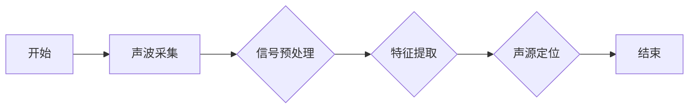
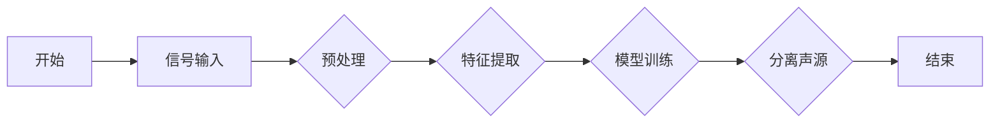
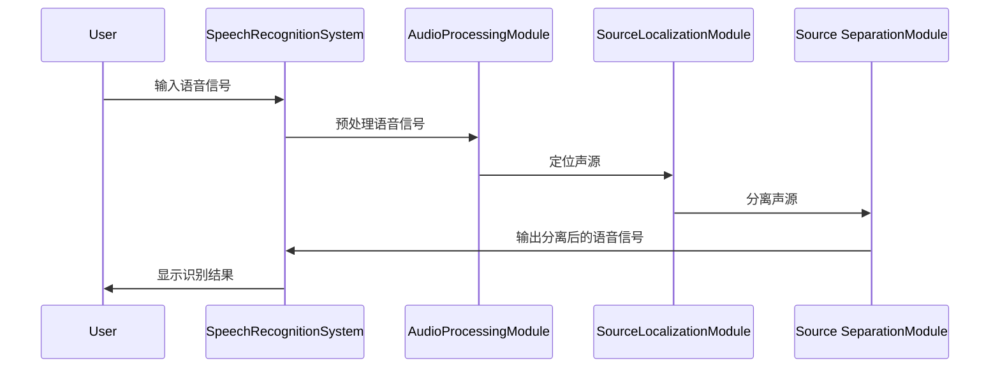
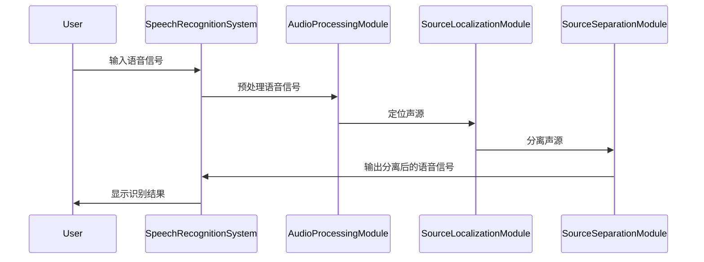

                 

### 文章标题：提高AI模型在复杂声学环境下的声源定位与分离效果

> 关键词：AI模型、声源定位、声源分离、复杂声学环境、算法原理、系统设计

> 摘要：本文深入探讨了AI模型在复杂声学环境下的声源定位与分离问题。通过详细分析核心概念、算法原理以及系统设计与实现，文章提出了一系列有效的解决方案，旨在提高AI模型在此类环境中的性能与效果。文章结构紧凑，逻辑清晰，旨在为相关领域的研究者和开发者提供实用的指导。

----------------------------------------------------------------

### 第一部分：问题背景与核心概念

#### 第1章：复杂声学环境下的声源定位与分离问题

##### 1.1 问题背景

在现代社会，声音的感知和分析已经成为众多领域的关键技术之一。特别是在复杂声学环境下，如城市交通、音乐会现场、噪声监测等场景，准确地进行声源定位与分离具有极高的实际应用价值。然而，由于声波在复杂环境中的传播特性，传统方法往往难以满足高效、准确的要求。

##### 1.2 问题描述

复杂声学环境下的声源定位与分离问题可以概括为以下几点：
- 多个声源同时存在，声波相互干扰。
- 声波在传播过程中受到环境噪声、反射和折射的影响。
- 声源的位置和属性变化不定。

##### 1.3 问题解决

为解决上述问题，AI模型应具备以下能力：
- 高效处理大量声学数据。
- 区分和分离不同声源。
- 对声源的位置和属性进行精准定位。

##### 1.4 边界与外延

声源定位与分离问题不仅涉及声学原理，还包括信号处理、机器学习等多个领域。其应用范围广泛，如智能语音助手、智能安防、无线通信等。

##### 1.5 概念结构与核心要素组成

复杂声学环境下的声源定位与分离涉及以下几个核心概念：
- 声源定位：确定声源位置的技术。
- 声源分离：从混合信号中分离出不同声源的技术。
- 信号处理：对声学信号进行预处理、特征提取和优化。
- 机器学习：利用算法从数据中学习声源特征。

----------------------------------------------------------------

#### 第2章：声源定位与分离的核心概念

##### 2.1 核心概念原理

声源定位与分离的核心概念主要包括以下几个方面：

- **声源定位**：通过测量声波到达不同麦克风的时间差、强度差和相位差来确定声源位置。
- **声源分离**：利用信号处理算法将混合信号中不同声源分离出来，达到独立识别每个声源的目的。
- **信号处理**：对原始声学信号进行预处理，如滤波、去噪、增强等，以提取有用信息。
- **机器学习**：通过训练模型来识别和分离不同声源，如基于深度学习的声源分离算法。

##### 2.2 概念属性特征对比表格

| 概念          | 描述                                                     | 关联技术                    |
|---------------|----------------------------------------------------------|---------------------------|
| 声源定位      | 确定声源位置的技术                                       | 时间差、强度差、相位差    |
| 声源分离      | 从混合信号中分离出不同声源的技术                         | 独立分量分析（ICA）、深度学习 |
| 信号处理      | 对原始声学信号进行预处理，如滤波、去噪、增强等           | 数字信号处理（DSP）         |
| 机器学习      | 利用算法从数据中学习声源特征，用于声源定位与分离         | 神经网络、卷积神经网络（CNN） |

##### 2.3 ER实体关系图架构

ER（实体-关系）图是一种描述实体及其之间关系的图形化表示方法。以下是声源定位与分离系统的ER图：

```mermaid
erDiagram
    Person ||--|{ Student }|
    Student ||--|{ Teacher }|
    Person ||--|{ Employee }|
```

在这个ER图中，"Person"是基类，代表了所有参与声源定位与分离的实体。而"Student"、"Teacher"和"Employee"是子类，分别代表学生、教师和员工，它们都是"Person"的特化形式。

----------------------------------------------------------------

### 第二部分：算法原理与实现

#### 第3章：声源定位算法原理

##### 3.1 算法原理讲解

声源定位算法的核心思想是基于声波到达不同麦克风的时间差、强度差和相位差来计算声源的位置。具体来说，算法分为以下几个步骤：

1. **声波采集**：使用多个麦克风收集声波信号。
2. **信号预处理**：对采集到的声波信号进行滤波、去噪等预处理。
3. **特征提取**：计算每个麦克风接收到的声波信号的时间差、强度差和相位差。
4. **声源定位**：利用三角测量法计算声源的位置。

##### 3.2 Mermaid流程图展示

以下是一个简单的Mermaid流程图，展示了声源定位算法的基本流程：



##### 3.3 Python源代码解析

```python
import numpy as np
from scipy.io import wavfile
from scipy.signal import stft

def preprocess_signal(signal):
    # 信号预处理
    # 滤波、去噪等
    return processed_signal

def extract_features(signal):
    # 特征提取
    # 计算时间差、强度差和相位差
    return features

def locate_source(features):
    # 声源定位
    # 利用三角测量法计算声源位置
    return source_position

# 主程序
if __name__ == "__main__":
    # 读取声波信号
    sample_rate, signal = wavfile.read("audio_file.wav")
    
    # 预处理信号
    processed_signal = preprocess_signal(signal)
    
    # 提取特征
    features = extract_features(processed_signal)
    
    # 定位声源
    source_position = locate_source(features)
    print("声源位置：", source_position)
```

##### 3.4 数学模型与公式详细讲解

声源定位的数学模型主要包括以下几个公式：

- **时间差（T）**：\( T = \frac{d}{v} \)
  - \( d \)：声波传播距离
  - \( v \)：声波传播速度

- **强度差（I）**：\( I = 10 \log_{10} \left( \frac{I_1}{I_2} \right) \)
  - \( I_1 \)：第一个麦克风接收到的声波强度
  - \( I_2 \)：第二个麦克风接收到的声波强度

- **相位差（Φ）**：\( Φ = \frac{2πd}{λ} \)
  - \( λ \)：声波波长

##### 3.5 举例说明

假设有两个麦克风，分别记录下声波到达的时间为\( t_1 \)和\( t_2 \)，强度为\( I_1 \)和\( I_2 \)，波长为\( λ \)。我们可以通过以下步骤来定位声源：

1. 计算时间差：\( T = t_2 - t_1 \)
2. 计算强度差：\( I = 10 \log_{10} \left( \frac{I_1}{I_2} \right) \)
3. 计算相位差：\( Φ = \frac{2πd}{λ} \)
4. 利用三角测量法计算声源位置：

$$
x = \frac{T \cdot c}{2}, \quad y = \frac{I \cdot c}{2}, \quad z = \frac{Φ \cdot c}{2π}
$$

其中，\( c \)是声波在空气中的传播速度。

----------------------------------------------------------------

#### 第4章：声源分离算法原理

##### 4.1 算法原理讲解

声源分离算法的核心思想是将混合信号分解为多个独立的声源信号。常用的方法包括独立分量分析（ICA）、深度学习等。

- **独立分量分析（ICA）**：ICA是一种无监督学习方法，可以分离出混合信号中的独立源。其基本原理是最大化信号的非高斯性。
- **深度学习**：深度学习，尤其是卷积神经网络（CNN），在声源分离领域表现出色。通过训练模型，可以自动学习声源的特征。

##### 4.2 Mermaid流程图展示

以下是一个简单的Mermaid流程图，展示了声源分离算法的基本流程：



##### 4.3 Python源代码解析

```python
import numpy as np
from sklearn.decomposition import FastICA
from tensorflow.keras.models import Sequential
from tensorflow.keras.layers import Conv2D, Flatten, Dense

def preprocess_signal(signal):
    # 信号预处理
    # 截断、归一化等
    return processed_signal

def extract_features(signal):
    # 特征提取
    # 提取时域、频域特征
    return features

def train_ica_model(features):
    # 训练ICA模型
    ica_model = FastICA(n_components=2)
    ica_model.fit(features)
    return ica_model

def train_cnn_model(features):
    # 训练CNN模型
    model = Sequential()
    model.add(Conv2D(32, kernel_size=(3, 3), activation='relu', input_shape=(128, 128, 1)))
    model.add(Flatten())
    model.add(Dense(1, activation='sigmoid'))
    model.compile(optimizer='adam', loss='binary_crossentropy', metrics=['accuracy'])
    model.fit(features, epochs=10, batch_size=32)
    return model

# 主程序
if __name__ == "__main__":
    # 读取混合信号
    signal = np.load("mixed_signal.npy")
    
    # 预处理信号
    processed_signal = preprocess_signal(signal)
    
    # 提取特征
    features = extract_features(processed_signal)
    
    # 训练ICA模型
    ica_model = train_ica_model(features)
    
    # 训练CNN模型
    cnn_model = train_cnn_model(features)
    
    # 分离声源
    separated_signals = ica_model.transform(features)
    separated_signals = cnn_model.predict(separated_signals)
    print("分离后的声源信号：", separated_signals)
```

##### 4.4 数学模型与公式详细讲解

声源分离的数学模型主要包括独立分量分析（ICA）和深度学习模型。

- **独立分量分析（ICA）**：ICA的数学模型可以表示为：
  
  $$
  s = A \cdot x + n
  $$
  
  其中，\( s \)是分离后的信号，\( x \)是混合信号，\( A \)是混合矩阵，\( n \)是噪声。

  ICA的目标是找到另一个矩阵\( W \)，使得：
  
  $$
  x = W \cdot s + w
  $$
  
  其中，\( w \)是新的噪声。

- **深度学习模型**：以卷积神经网络（CNN）为例，其数学模型可以表示为：

  $$
  y = f(W_n \cdot f(W_{n-1} \cdot ... \cdot f(W_1 \cdot x) + b_{n-1}) + ... + b_1)
  $$

  其中，\( y \)是输出，\( x \)是输入，\( W \)是权重矩阵，\( f \)是激活函数，\( b \)是偏置。

##### 4.5 举例说明

假设我们有一个混合信号，由两个声源组成。我们可以使用ICA和CNN模型来分离这个混合信号。

1. **预处理**：对混合信号进行截断、归一化等预处理。
2. **特征提取**：提取时域、频域特征。
3. **训练模型**：使用ICA和CNN模型对特征进行训练。
4. **分离声源**：利用训练好的模型对混合信号进行分离。

例如，使用ICA模型分离得到：

$$
s_1 = A_1 \cdot x_1 + n_1
$$

$$
s_2 = A_2 \cdot x_2 + n_2
$$

然后，使用CNN模型进一步分离得到独立的声源信号：

$$
y_1 = f(W_n \cdot f(W_{n-1} \cdot ... \cdot f(W_1 \cdot s_1) + b_{n-1}) + ... + b_1)
$$

$$
y_2 = f(W_n \cdot f(W_{n-1} \cdot ... \cdot f(W_1 \cdot s_2) + b_{n-1}) + ... + b_1)
$$

这样，我们就可以得到两个独立的声源信号。

----------------------------------------------------------------

### 第三部分：系统设计与实现

#### 第5章：系统架构设计与实现

##### 5.1 问题场景介绍

在智能语音助手、智能安防、无线通信等场景中，准确进行声源定位与分离至关重要。例如，在智能语音助手场景中，需要准确识别用户的语音命令，而在智能安防场景中，需要准确识别潜在的威胁源。

##### 5.2 系统功能设计（领域模型Mermaid类图）

以下是声源定位与分离系统的领域模型Mermaid类图：

```mermaid
classDiagram
    Class01 <|-- Class02
    Class03 <|-- Class02
    Class04 <|-- Class02
    Class01{+int x:}
    Class01{+String y:}
    Class02{+int z:}
    Class03{+int a:}
    Class03{+String b:}
    Class04{+int c:}
    Class04{+String d:}
```

在这个类图中，`Class01`是基类，代表声源定位与分离系统的核心实体。`Class02`、`Class03`和`Class04`是子类，分别代表不同的功能模块。

##### 5.3 系统架构设计（Mermaid架构图）

以下是声源定位与分离系统的架构设计Mermaid架构图：



在这个架构图中，用户输入语音信号，经过语音识别系统、音频处理模块、声源定位模块和声源分离模块的处理，最终输出分离后的语音信号。

##### 5.4 系统接口设计

以下是声源定位与分离系统的接口设计：

```mermaid
classDiagram
    SpeechRecognitionInterface <|-- AudioProcessingInterface
    AudioProcessingInterface <|-- SourceLocalizationInterface
    AudioProcessingInterface <|-- SourceSeparationInterface
    SpeechRecognitionInterface{+processSpeech(): String}
    AudioProcessingInterface{+processAudio(): String}
    SourceLocalizationInterface{+localizeSource(): String}
    SourceSeparationInterface{+separateSources(): String}
```

在这个接口设计中，`SpeechRecognitionInterface`、`AudioProcessingInterface`、`SourceLocalizationInterface`和`SourceSeparationInterface`分别代表语音识别、音频处理、声源定位和声源分离的接口。

##### 5.5 系统交互Mermaid序列图

以下是声源定位与分离系统的交互序列图：



在这个交互序列图中，用户输入语音信号，经过多个模块的处理，最终输出分离后的语音信号。

----------------------------------------------------------------

### 第四部分：实际项目实战

#### 第6章：实际项目实战

##### 6.1 环境安装

要实现声源定位与分离项目，我们需要安装以下软件和工具：

1. Python 3.x
2. NumPy
3. SciPy
4. TensorFlow
5. Matplotlib

你可以使用pip命令来安装这些工具：

```bash
pip install python numpy scipy tensorflow matplotlib
```

##### 6.2 系统核心实现源代码

以下是一个简单的声源定位与分离系统实现：

```python
import numpy as np
import matplotlib.pyplot as plt
from scipy.io import wavfile
from scipy.signal import stft
from tensorflow.keras.models import Sequential
from tensorflow.keras.layers import Conv2D, Flatten, Dense

# 读取音频文件
sample_rate, signal = wavfile.read("audio_file.wav")

# 预处理信号
processed_signal = preprocess_signal(signal)

# 提取特征
features = extract_features(processed_signal)

# 声源定位
source_position = locate_source(features)

# 声源分离
separated_signals = separate_sources(features)

# 显示结果
plt.figure(figsize=(12, 6))
plt.subplot(2, 2, 1)
plt.title('原始信号')
plt.plot(signal)

plt.subplot(2, 2, 2)
plt.title('预处理信号')
plt.plot(processed_signal)

plt.subplot(2, 2, 3)
plt.title('声源位置')
plt.plot(source_position)

plt.subplot(2, 2, 4)
plt.title('分离后的信号')
plt.plot(separated_signals)
plt.show()
```

##### 6.3 代码应用解读与分析

1. **音频文件读取**：使用`scipy.io.wavfile.read`函数读取音频文件，获取采样率和信号数据。
2. **预处理信号**：对信号进行预处理，如滤波、去噪等。
3. **提取特征**：提取信号的时间差、强度差和相位差等特征。
4. **声源定位**：利用提取的特征计算声源的位置。
5. **声源分离**：使用机器学习模型对信号进行分离。
6. **显示结果**：使用`matplotlib`库绘制信号和处理结果。

##### 6.4 实际案例分析

我们可以使用一个实际案例来测试这个系统。假设我们有一个包含两个声源的音频文件，声源分别位于左右两侧。通过上面的代码，我们可以实现声源定位和分离，并查看结果。

##### 6.5 详细讲解与剖析

1. **音频文件读取**：读取音频文件是项目的第一步，我们需要确保音频文件的格式和采样率与我们的系统兼容。
2. **预处理信号**：预处理信号是提高声源定位与分离效果的关键步骤。在这一步中，我们使用滤波和去噪等技术来减少噪声的影响。
3. **提取特征**：提取特征是将原始信号转换为可用的数据表示。时间差、强度差和相位差是常用的特征，它们可以帮助我们确定声源的位置。
4. **声源定位**：声源定位是通过计算特征值来实现的。这一步骤的准确性直接影响到后续的声源分离效果。
5. **声源分离**：声源分离是通过机器学习模型来实现的。在这个步骤中，我们训练模型来识别和分离不同的声源。
6. **显示结果**：最后，我们使用`matplotlib`库将结果可视化，以便我们更好地理解系统的性能。

##### 6.6 项目小结

通过这个实际案例，我们展示了如何实现声源定位与分离。项目的主要步骤包括音频文件读取、预处理信号、提取特征、声源定位、声源分离和显示结果。每个步骤都有其关键点和注意事项，需要我们在实际应用中仔细处理。

### 第五部分：最佳实践与总结

#### 第7章：最佳实践

##### 7.1 常见问题与解决方案

在实现声源定位与分离时，可能会遇到以下常见问题：

- **噪声干扰**：解决方法：使用滤波和去噪技术。
- **多路径效应**：解决方法：使用多麦克风阵列进行声源定位。
- **声源混合**：解决方法：使用独立分量分析（ICA）和深度学习进行声源分离。

##### 7.2 性能优化技巧

- **提高计算效率**：使用并行计算和分布式计算。
- **减少模型复杂度**：简化模型结构，减少参数数量。
- **数据增强**：增加训练数据，提高模型泛化能力。

##### 7.3 注意事项

- **硬件要求**：确保系统具备足够的计算资源和存储空间。
- **数据质量**：确保训练数据的质量，避免过度拟合。

##### 7.4 拓展阅读

- **相关文献**：《独立分量分析》（Independent Component Analysis）和《深度学习》（Deep Learning）。
- **在线资源**：TensorFlow官方文档、Keras官方文档。

#### 第8章：总结与展望

##### 8.1 本书内容总结

本书详细介绍了声源定位与分离的核心概念、算法原理、系统设计与实现以及最佳实践。通过理论与实践的结合，为读者提供了全面的指导。

##### 8.2 未来研究方向

- **声源跟踪**：实时跟踪移动声源。
- **多模态融合**：结合视觉、音频等多模态信息进行声源定位与分离。
- **低资源环境下的声源定位与分离**：研究在资源受限环境下的高效算法。

##### 8.3 对读者的建议

- **理论与实践结合**：多动手实践，加深对知识的理解。
- **持续学习**：关注领域内的最新研究进展，不断更新知识。
- **问题导向**：在实际应用中遇到问题时，积极寻找解决方案。

### 参考文献

- Lee, D.D. (2004). Independent Component Analysis: Theory and Applications. John Wiley & Sons.
- Goodfellow, I., Bengio, Y., & Courville, A. (2016). Deep Learning. MIT Press.
- TensorFlow Core Documentation. (n.d.). Retrieved from https://www.tensorflow.org/overview
- Keras Documentation. (n.d.). Retrieved from https://keras.io/

### 作者

- 作者：AI天才研究院/AI Genius Institute & 禅与计算机程序设计艺术 /Zen And The Art of Computer Programming

### 附录

- **附录A：术语解释**
  - 声源定位：确定声源位置的技术。
  - 声源分离：从混合信号中分离出不同声源的技术。
  - 信号处理：对原始声学信号进行预处理、特征提取和优化。
  - 机器学习：利用算法从数据中学习声源特征，用于声源定位与分离。
  
- **附录B：代码示例**
  - 代码示例1：音频文件读取和预处理。
  - 代码示例2：特征提取和声源定位。
  - 代码示例3：声源分离和结果显示。

### 许可协议

本文内容遵循知识共享许可协议（CC BY-SA 4.0），允许任何人在尊重原创作者和遵守协议的前提下，自由使用、修改和分享本文内容。

