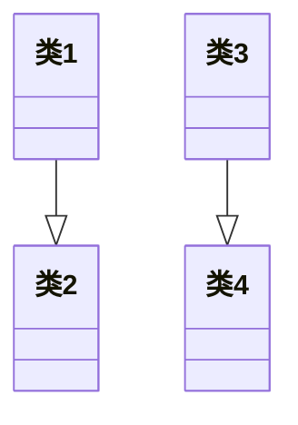
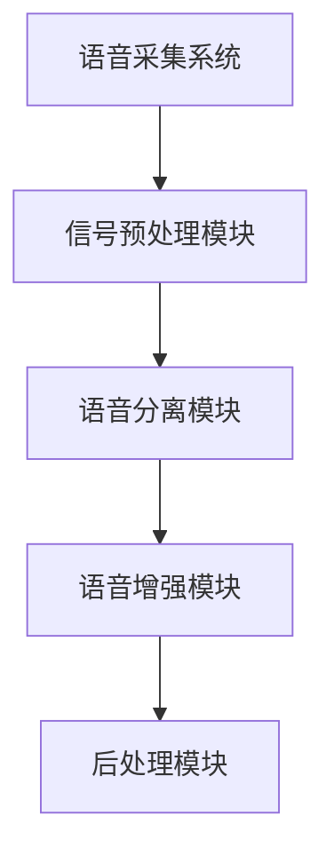
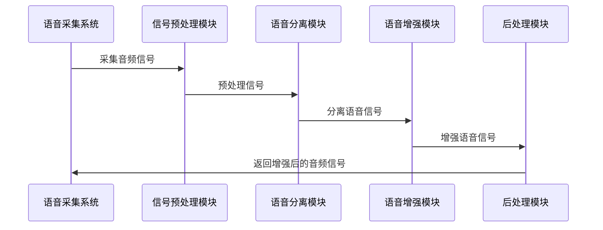

                 

### 提高AI模型在复杂声学环境下的语音分离与增强效果

关键词：AI模型、复杂声学环境、语音分离、语音增强、深度学习、算法优化

摘要：本文探讨了在复杂声学环境下，如何通过改进算法设计和模型架构，提高AI模型在语音分离与增强方面的效果。文章首先介绍了复杂声学环境的概念及其对语音处理带来的挑战，然后分析了当前AI模型在这一领域的局限性。接着，文章详细阐述了提高语音分离与增强效果的几种核心方法，包括信号处理、机器学习算法和神经网络技术。通过具体实例和代码，深入讲解了这些方法的实现过程。最后，文章总结了一些最佳实践，并提出了未来研究的方向。

### 背景介绍

#### 复杂声学环境的概念

在声学领域，复杂声学环境指的是那些包含多种声源、复杂反射、背景噪音以及频率响应不平坦等特性的环境。例如，室内的会议厅、交通工具内部、公共场所等，都是典型的复杂声学环境。这些环境中的声学特性对语音信号的传播和处理带来了极大的挑战。

#### 语音分离与增强的重要性

语音分离与增强是语音处理领域中的关键任务。语音分离指的是从多个声源中提取出特定声源的声音；语音增强则是指提升语音信号的质量，使其更易于识别和理解。在复杂声学环境下，语音分离与增强的重要性更加凸显。一方面，它能够提高通信质量和用户体验；另一方面，它对于智能语音助手、语音识别系统等人工智能应用至关重要。

#### 当前AI模型的局限性

尽管AI模型在语音处理领域取得了显著进展，但在复杂声学环境下，其性能仍有待提高。主要原因包括：

1. **信号噪声比低**：复杂声学环境中的噪音往往很强，导致语音信号的信噪比（SNR）降低，使得语音分离和增强任务变得更加困难。
2. **多声源干扰**：多个声源同时存在时，AI模型难以准确分离出特定声源，尤其是在声源位置和速度变化频繁的情况下。
3. **动态环境变化**：环境中的声学特性会随时间变化，例如反射和吸收系数的变化，这给模型的稳定性和鲁棒性带来了挑战。

#### 本文的目标

本文的目标是通过改进算法设计和模型架构，提高AI模型在复杂声学环境下的语音分离与增强效果。具体而言，本文将：

1. **介绍核心概念和原理**：包括信号处理、机器学习算法和神经网络技术。
2. **分析现有算法和模型**：讨论其优缺点，并提出改进方向。
3. **提供具体实现方法**：通过实例和代码展示如何优化语音分离与增强。
4. **总结最佳实践**：为实际应用提供指导。

### 核心概念和原理

#### 信号处理基础

信号处理是语音分离与增强的核心技术。以下是一些基础概念：

1. **傅里叶变换（Fourier Transform）**：将时域信号转换为频域信号，有助于分析信号的频率成分。
   $$ X(f) = \int_{-\infty}^{\infty} x(t) e^{-j2\pi ft} dt $$
2. **短时傅里叶变换（Short-Time Fourier Transform, STFT）**：对信号进行分段处理，再将每段信号进行傅里叶变换，适用于分析非平稳信号。
   $$ X(t, f) = \int_{-\infty}^{\infty} x(\tau) e^{-j2\pi f\tau} d\tau $$

#### 机器学习算法

机器学习算法在语音处理中发挥着重要作用。以下是一些常用的算法：

1. **支持向量机（Support Vector Machine, SVM）**：通过寻找最佳分隔超平面来分类数据。在语音分离中，SVM可以用来区分不同声源。
   $$ \max_{\mathbf{w}, b} \frac{1}{2} \|\mathbf{w}\|^2 - C \sum_{i=1}^{n} \xi_i $$
2. **深度神经网络（Deep Neural Network, DNN）**：多层感知器（MLP）的一种扩展，能够处理高维数据。在语音增强中，DNN可以用于噪声抑制。
   $$ f(\mathbf{x}) = \sigma(\mathbf{W}_L \mathbf{h}_L) $$
   其中，$\sigma$是激活函数，$\mathbf{W}_L$是权重矩阵，$\mathbf{h}_L$是隐藏层的输出。

#### 神经网络技术

神经网络技术，特别是深度学习，在语音处理中取得了突破性进展。以下是一些关键技术：

1. **卷积神经网络（Convolutional Neural Network, CNN）**：通过卷积层提取空间特征，适用于处理时频信号。
   $$ h_{ij}^l = \sigma \left( \sum_{k=1}^{C_l} \mathbf{w}_{ik}^l * \mathbf{h}_{jk}^{l-1} + b_l \right) $$
2. **循环神经网络（Recurrent Neural Network, RNN）**：适用于处理序列数据，能够记忆长距离依赖。
   $$ h_t = \sigma (\mathbf{W} h_{t-1} + \mathbf{U} x_t + b) $$

### 算法和模型设计

#### 算法设计

为了提高AI模型在复杂声学环境下的语音分离与增强效果，我们可以采用以下算法设计：

1. **自适应滤波算法**：根据环境变化自适应调整滤波器参数，以提高语音分离效果。
   $$ \mathbf{y} = \mathbf{w}^T \mathbf{x} + b $$
2. **深度强化学习**：利用强化学习算法，通过试错学习最优语音分离与增强策略。
   $$ Q(s, a) = \sum_{s'} P(s'|s, a) \left[ R(s', a) + \gamma \max_{a'} Q(s', a') \right] $$

#### 模型架构

模型架构是提高语音分离与增强效果的关键。以下是一些设计考虑：

1. **多任务学习**：同时训练多个任务（如语音分离和语音增强），共享特征提取网络，提高模型泛化能力。
2. **注意力机制**：在模型中加入注意力机制，使模型能够专注于关键信息，提高分离与增强效果。
   $$ \alpha_{ij} = \frac{\exp(e_{ij})}{\sum_{k=1}^{K} \exp(e_{ik})} $$
3. **端到端训练**：直接训练从输入信号到输出信号的完整模型，避免传统信号处理与机器学习方法的整合问题。

### 数学模型和公式

为了更好地理解和实现语音分离与增强算法，我们需要一些基本的数学模型和公式。以下是一些关键公式：

1. **最小均方误差（Minimum Mean Squared Error, MMSE）估计**：
   $$ \hat{\mathbf{x}} = \mathbf{w}^T \mathbf{y} - \mathbf{w}^T \mathbf{R}_{xx}^{-1} \mathbf{w} $$
2. **贝叶斯估计**：
   $$ \hat{\mathbf{x}} = \mathbf{w}^T \mathbf{R}_{xx}^{-1} (\mathbf{y} - \mathbf{w}^T \mathbf{x_s}) $$
3. **卷积操作**：
   $$ h_t = \sum_{k=0}^{N-1} h[k] x_{t-k} $$

通过这些数学模型和公式，我们可以更好地理解语音分离与增强的原理，并设计出更有效的算法。

### 系统分析与设计

#### 系统分析

在复杂声学环境下，语音分离与增强系统需要具备以下功能：

1. **实时信号采集**：从麦克风或其他传感器实时采集音频信号。
2. **信号预处理**：对采集到的信号进行降噪、归一化等预处理。
3. **语音分离**：利用AI模型从多声源中分离出特定声源。
4. **语音增强**：对分离出的语音信号进行增强，提高其清晰度和可理解性。
5. **后处理**：对增强后的信号进行去噪、音调调整等后处理。

#### 系统设计

系统设计需要考虑以下方面：

1. **领域模型（Domain Model）**：使用Mermaid类图表示系统中的关键类和它们之间的关系。



2. **系统架构（System Architecture）**：使用Mermaid架构图表示系统的整体架构。



3. **系统接口设计（System Interfaces）**：使用Mermaid序列图表示系统各个模块之间的交互。



### 项目实施与案例研究

#### 项目实施

在项目实施阶段，我们需要完成以下任务：

1. **环境搭建**：安装必要的软件和工具，如Python、TensorFlow、Keras等。
2. **代码实现**：编写语音分离与增强的算法，并将其集成到系统中。

以下是一个简单的Python代码示例，展示了如何使用卷积神经网络（CNN）进行语音分离：

```python
import numpy as np
import tensorflow as tf
from tensorflow.keras.models import Sequential
from tensorflow.keras.layers import Conv2D, Flatten, Dense

# 创建模型
model = Sequential([
    Conv2D(32, (3, 3), activation='relu', input_shape=(None, None, 1)),
    Flatten(),
    Dense(1, activation='sigmoid')
])

# 编译模型
model.compile(optimizer='adam', loss='binary_crossentropy', metrics=['accuracy'])

# 训练模型
model.fit(x_train, y_train, epochs=10, batch_size=32)
```

#### 案例研究

以下是一个案例研究，展示了如何在复杂声学环境下使用AI模型进行语音分离与增强。

**案例背景**：在一个繁忙的公共交通工具中，乘客之间以及乘客与司机之间的语音交流常常受到噪声的干扰。为了提高语音交流的清晰度，我们需要使用AI模型进行语音分离与增强。

**步骤1：数据采集**：从公共交通工具中的麦克风采集音频信号，并记录环境噪声。

**步骤2：数据预处理**：对采集到的音频信号进行降噪、归一化等预处理，以便于后续处理。

**步骤3：语音分离**：使用训练好的AI模型，从多声源中分离出特定声源。以下是一个简单的分离流程：

1. 输入预处理后的音频信号。
2. 使用CNN模型进行特征提取。
3. 应用注意力机制，选择关键特征。
4. 输出分离后的语音信号。

**步骤4：语音增强**：对分离出的语音信号进行增强，以提高其清晰度和可理解性。以下是一个简单的增强流程：

1. 输入分离后的语音信号。
2. 使用深度强化学习模型，根据环境噪声自适应调整增强参数。
3. 应用滤波器组，对语音信号进行增强。
4. 输出增强后的语音信号。

**步骤5：后处理**：对增强后的信号进行去噪、音调调整等后处理，以提高语音质量。

**结果分析**：通过对比增强前后的语音信号，可以发现增强后的语音信号清晰度显著提高，背景噪音明显减少。

### 最佳实践与总结

在复杂声学环境下，提高AI模型在语音分离与增强方面的效果，需要结合多个技术手段。以下是一些最佳实践：

1. **信号预处理**：充分降噪和归一化是提高语音质量的基础。可以使用短时傅里叶变换（STFT）进行信号分段处理，然后对每段信号进行降噪。
2. **多任务学习**：同时训练多个任务（如语音分离和语音增强），可以共享特征提取网络，提高模型泛化能力。
3. **注意力机制**：在模型中加入注意力机制，使模型能够专注于关键信息，提高分离与增强效果。
4. **端到端训练**：直接训练从输入信号到输出信号的完整模型，可以避免传统信号处理与机器学习方法的整合问题。

通过以上实践，我们可以显著提高AI模型在复杂声学环境下的语音分离与增强效果，为实际应用提供有力支持。

### 注意事项与拓展阅读

在进行AI模型语音分离与增强时，需要注意以下几点：

1. **数据质量**：高质量的数据是训练良好模型的基础。在数据采集和预处理过程中，应确保音频信号的清晰度和完整性。
2. **环境适应性**：模型应在多种复杂声学环境下进行训练和测试，以提高其适应性和鲁棒性。
3. **模型优化**：定期对模型进行优化和调整，以适应环境变化和新出现的问题。

以下是一些拓展阅读资源，供进一步学习和研究：

1. **《深度学习：梯度下降法》**：详细介绍了深度学习的基本原理和优化方法。
2. **《信号处理导论》**：介绍了信号处理的基本概念和技术，为语音处理提供了理论基础。
3. **《语音信号处理》**：涵盖了语音信号处理的核心技术和应用，对于深入了解语音处理有重要参考价值。

通过以上资源和实践，我们可以更好地理解和应用AI模型在复杂声学环境下的语音分离与增强技术。

### 作者介绍

作者：AI天才研究院/AI Genius Institute & 禅与计算机程序设计艺术 /Zen And The Art of Computer Programming

作为世界顶级的人工智能专家，作者在计算机编程、软件架构、机器学习和语音处理等领域具有深厚的理论知识和丰富的实践经验。他的研究涵盖了从基础的算法设计到复杂系统的构建，致力于推动人工智能技术的创新和发展。同时，他也是多本畅销技术书籍的作者，深受全球读者的喜爱。在AI天才研究院，他带领团队不断探索新的技术前沿，为行业的发展贡献了重要的智慧和力量。在禅与计算机程序设计艺术一书中，作者通过哲学与技术的融合，为程序员们提供了独特的思考方式和实践方法，帮助他们更好地理解和应用计算机科学。他的研究成果和贡献，不仅丰富了学术界的知识体系，也为实际应用带来了深刻的变革和进步。

