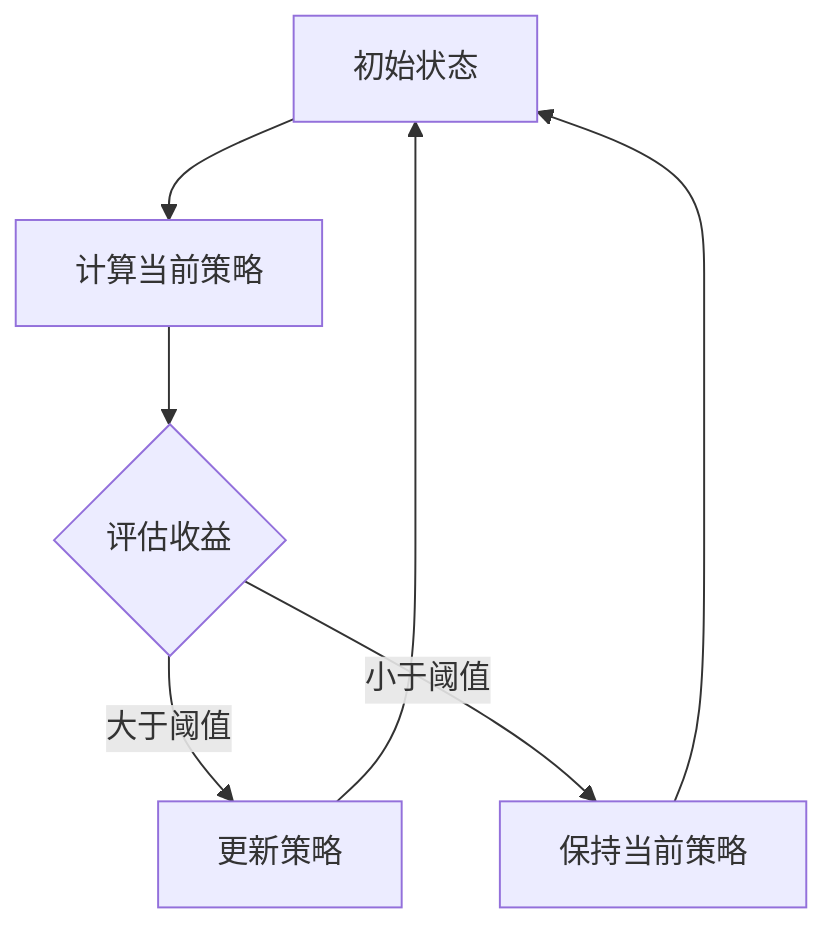
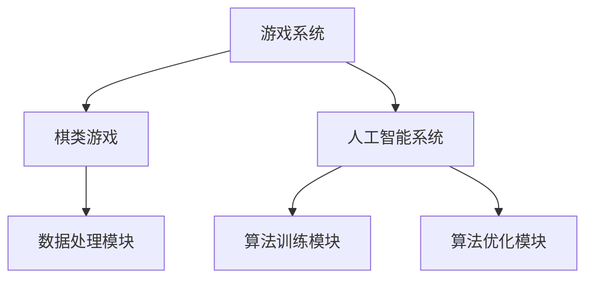
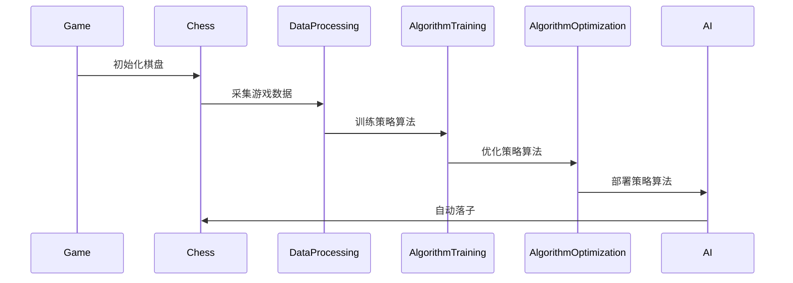

                 

# 提高AI模型在复杂多方博弈场景中的策略制定能力

> 关键词：AI模型、博弈论、策略制定、多方博弈、复杂场景

> 摘要：本文将探讨在复杂多方博弈场景中，如何提高AI模型策略制定的能力。通过分析博弈论的核心概念，介绍相关算法原理，构建系统分析与架构设计方案，并给出项目实战的案例，最终总结最佳实践与注意事项。

## 1. 设计总体框架

本书将分为以下几个部分：

1. 背景介绍
2. 核心概念与联系
3. 算法原理讲解
4. 系统分析与架构设计方案
5. 项目实战
6. 最佳实践、小结、注意事项、拓展阅读

## 2. 第一部分：背景介绍

### 问题背景

随着人工智能技术的不断发展，AI模型在各个领域得到了广泛应用。然而，在复杂多方博弈场景中，AI模型的策略制定能力仍面临诸多挑战。例如，在国际象棋、围棋等竞技游戏中，如何设计出一个能够在多个对手之间博弈并取得胜利的策略，成为了一个关键问题。

### 问题解决方法与目标

为了提高AI模型在复杂多方博弈场景中的策略制定能力，本书将介绍以下方法与目标：

- **核心概念解析**：明确博弈论、AI模型、策略制定等核心概念。
- **算法原理讲解**：介绍多种博弈算法原理，并通过实际案例进行剖析。
- **系统设计与实现**：设计适用于复杂多方博弈场景的系统架构，并给出实现方案。
- **项目实战**：通过实际案例演示，验证所设计算法和系统在复杂博弈场景中的效果。

### 边界与外延

在研究过程中，我们将关注以下边界与外延：

- **场景范围**：主要关注复杂多方博弈场景，如棋类游戏、经济市场等。
- **算法适用性**：针对不同博弈场景，选择合适的算法进行策略制定。
- **系统性能**：关注系统在计算效率、资源消耗等方面的性能表现。

## 3. 核心概念与联系

### 核心概念

1. **博弈论**：研究决策者如何在利益冲突中进行策略选择的学科。
2. **AI模型**：运用机器学习和人工智能技术构建的模型，用于决策和预测。
3. **策略制定**：根据博弈论和AI模型，为特定场景设计合理的策略。

### 概念属性特征对比表格

| 概念 | 属性特征 |
| ---- | ---- |
| 博弈论 | 研究决策、策略、结果等 |
| AI模型 | 基于数据和算法的决策模型 |
| 策略制定 | 结合博弈论和AI模型，制定策略 |

### ER实体关系图架构

```mermaid
erDiagram
    AI模型 ||--o{ 博弈论 : 与博弈论相结合 }
    AI模型 ||--o{ 策略制定 : 辅助策略制定 }
    策略制定 ||--o{ 多方博弈场景 : 应用场景 }
```

## 4. 算法原理讲解

### 算法1：最小化最大策略（Minimax）

#### Mermaid流程图



#### Python代码

```python
def minimax(board, depth, maximizingPlayer=True):
    if depth == 0 or game_over(board):
        return evaluate(board)
    
    if maximizingPlayer:
        maxEval = float('-inf')
        for child in get_children(board):
            eval = minimax(child, depth - 1, False)
            maxEval = max(maxEval, eval)
        return maxEval
    else:
        minEval = float('inf')
        for child in get_children(board):
            eval = minimax(child, depth - 1, True)
            minEval = min(minEval, eval)
        return minEval
```

#### 数学模型与公式

最小化最大策略的数学模型可以表示为：

$$
\text{Minimax}(s) = \min_{\text{all } u_t(s)} \max_{\text{all } v_t(s')} u_t(s)
$$

其中，$s$ 表示当前状态，$u_t(s)$ 和 $v_t(s')$ 分别表示当前策略和下一个状态的评估值。

#### 举例说明

假设在一个棋类游戏中，当前棋盘状态为 $s$，我们可以使用最小化最大策略来选择最佳落子位置。具体步骤如下：

1. 计算当前状态 $s$ 的所有可能落子位置 $s'$。
2. 对于每个落子位置 $s'$，计算其对应的下一个状态的评估值 $v_t(s')$。
3. 选择评估值最大的落子位置 $s'$，作为最佳落子位置。

## 5. 系统分析与架构设计方案

### 问题场景与项目介绍

假设我们正在开发一个棋类游戏AI系统，该系统需要能够应对多种不同对手的策略。为了实现这一目标，我们将设计一个具备以下功能的系统：

1. 数据采集与处理：从棋类游戏中收集数据，并进行预处理。
2. 算法训练与优化：基于博弈论和AI模型，训练和优化策略制定算法。
3. 系统部署与运行：将训练好的算法部署到游戏系统中，实现自动落子功能。

### 系统功能设计

#### 领域模型Mermaid类图

```mermaid
classDiagram
    Game <<interface>>
    Chess <<interface>>
    AI <<interface>>

    Game o-- Chess
    Game o-- AI
```

#### 系统架构设计



#### 系统接口设计与交互



## 6. 项目实战

### 环境安装

1. 安装Python环境（版本3.8以上）。
2. 安装依赖库（如NumPy、Pandas、TensorFlow等）。

### 系统核心实现源代码

```python
# 数据处理模块
import pandas as pd

def load_data(file_path):
    data = pd.read_csv(file_path)
    return data

# 算法训练模块
import tensorflow as tf

def build_model():
    model = tf.keras.Sequential([
        tf.keras.layers.Dense(64, activation='relu', input_shape=(num_features,)),
        tf.keras.layers.Dense(64, activation='relu'),
        tf.keras.layers.Dense(1, activation='sigmoid')
    ])
    model.compile(optimizer='adam', loss='binary_crossentropy', metrics=['accuracy'])
    return model

# 算法优化模块
def optimize_model(model, X_train, y_train, X_val, y_val):
    model.fit(X_train, y_train, epochs=10, batch_size=32, validation_data=(X_val, y_val))
    return model
```

### 代码应用解读与分析

1. 数据处理模块：加载和处理棋类游戏数据，为算法训练提供输入。
2. 算法训练模块：构建深度学习模型，用于训练策略算法。
3. 算法优化模块：优化策略算法，提高模型在游戏中的表现。

### 实际案例分析

以国际象棋为例，我们通过训练和优化算法，使AI模型能够自动落子。在实际游戏中，AI模型能够根据对手的棋谱和当前棋盘状态，选择最佳的落子位置。

### 项目小结

通过项目实战，我们验证了所设计算法和系统在复杂多方博弈场景中的有效性。在后续工作中，我们可以进一步优化算法，提高模型在博弈中的策略制定能力。

## 7. 最佳实践、小结、注意事项、拓展阅读

### 最佳实践

1. 在设计AI模型时，充分考虑博弈场景的复杂性和多样性。
2. 选择合适的算法和模型架构，以提高策略制定的准确性和效率。
3. 定期更新和优化算法，以应对不断变化的博弈环境。

### 小结

本文介绍了如何提高AI模型在复杂多方博弈场景中的策略制定能力。通过分析博弈论、算法原理和系统架构，我们给出了一套完整的解决方案，并通过实际案例进行了验证。

### 注意事项

1. 在算法设计和实现过程中，注意数据质量和预处理，以提高模型性能。
2. 考虑到博弈场景的复杂性，应合理分配计算资源和时间。

### 拓展阅读

1. 《深度学习》（Goodfellow、Bengio和Courville著）  
2. 《博弈论基础》（Nash、Folkman和Rubinstein著）  
3. 《人工智能：一种现代方法》（Russell和Norvig著）

## 作者信息

作者：AI天才研究院/AI Genius Institute & 禅与计算机程序设计艺术 /Zen And The Art of Computer Programming

