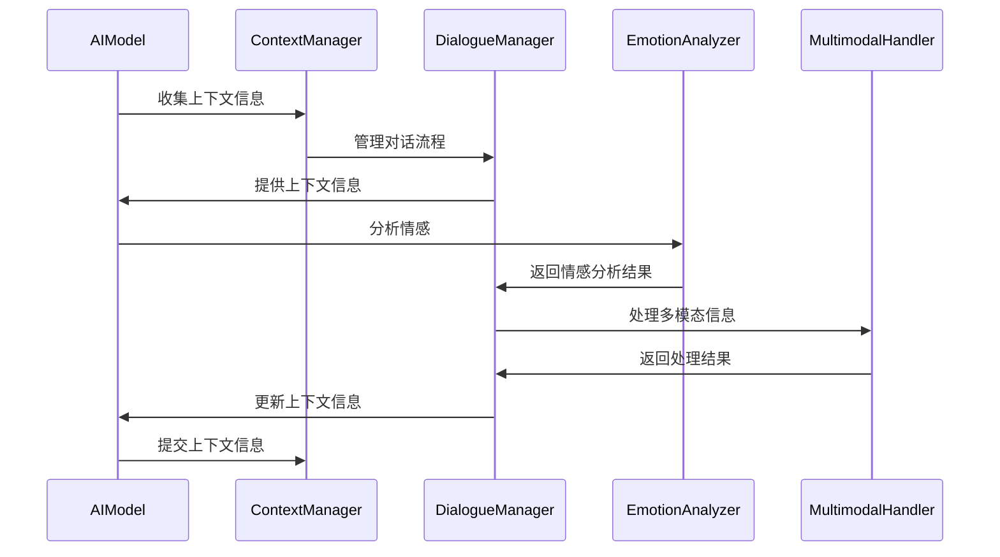
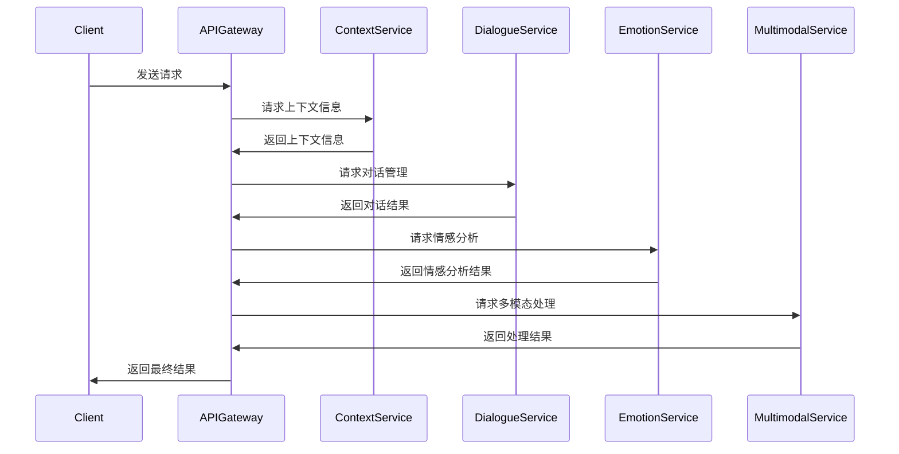

                 

# 提高AI模型在复杂多方对话场景中的上下文理解能力

## 关键词

AI模型、上下文理解、多方对话、算法原理、系统架构、项目实战、最佳实践

## 摘要

本文深入探讨了如何提高AI模型在复杂多方对话场景中的上下文理解能力。首先，我们分析了当前AI模型在复杂多方对话场景中面临的问题与挑战，如信息冗余、参与者角色识别和对话连贯性保持等。接着，我们阐述了上下文理解能力的关键概念，包括上下文信息收集处理、上下文关系建立与推理等。然后，我们详细讲解了提高上下文理解能力的算法原理，从数学模型到具体实现，提供了详细的Python代码示例。最后，我们通过一个实际项目展示了这些算法原理和系统架构设计在复杂多方对话场景中的应用，并给出了最佳实践和注意事项。

## 目录大纲

### 第一部分：问题的背景与定义

### 第1章：问题的背景与定义

### 第2章：复杂多方对话场景的特点与挑战

### 第二部分：上下文理解能力的关键概念

### 第3章：上下文理解能力的基本原理

### 第4章：关键概念与联系

### 第三部分：提高上下文理解能力的算法原理

### 第5章：算法原理讲解

### 第6章：数学模型与公式详解

### 第四部分：实践应用

### 第7章：系统分析与架构设计方案

### 第8章：项目实战

### 第9章：最佳实践与注意事项

### 第10章：小结与拓展阅读

## 第一部分：问题的背景与定义

### 第1章：问题的背景与定义

在当今信息化社会，人工智能（AI）技术在各个领域得到了广泛应用，尤其是在自然语言处理（NLP）领域。AI模型在单方对话中的应用已经相当成熟，但面对复杂的多方对话场景，AI模型的上下文理解能力仍然存在诸多挑战。

#### 1.1 问题背景

复杂多方对话场景在现实生活中无处不在，如多人的在线会议、社交平台的讨论组、客服中心的多线程客服等。这些场景中，参与者众多，信息量巨大，对话内容复杂，对AI模型的上下文理解能力提出了极高的要求。

#### 1.2 对话场景概述

在单方对话中，AI模型只需要处理与一个参与者之间的交互。而在多方对话中，AI模型需要同时处理多个参与者之间的交互，并且需要具备良好的上下文理解能力，以便在对话中保持连贯性和一致性。

#### 1.3 上下文理解能力的定义

上下文理解能力是指AI模型在对话过程中，能够根据对话的历史信息和当前对话内容，准确理解对话的意图和主题的能力。在复杂多方对话场景中，上下文理解能力尤为重要，因为只有准确理解上下文，AI模型才能做出合理的响应。

### 第2章：复杂多方对话场景的特点与挑战

复杂多方对话场景具有以下特点：

#### 2.1 信息冗余与噪声

在多方对话中，信息量庞大，且往往存在大量的冗余信息和无用噪声。这些信息不仅增加了AI模型的计算负担，还可能干扰AI模型的上下文理解。

#### 2.2 参与者角色与身份识别

多方对话中，参与者众多，且角色多样。AI模型需要能够识别每个参与者的角色和身份，以便在对话中做出准确的响应。

#### 2.3 对话的连贯性与一致性

保持对话的连贯性和一致性是多方对话中的关键挑战。AI模型需要能够理解不同参与者之间的对话内容，并在对话中保持一致的意图和主题。

### 第3章：复杂多方对话场景的挑战

在复杂多方对话场景中，AI模型面临的挑战主要有：

#### 3.1 上下文理解的局限性

AI模型的上下文理解能力是有限的，往往无法完全理解复杂的多方对话内容。这可能导致AI模型在对话中的响应不准确或不连贯。

#### 3.2 多方交互的不确定性

在多方交互中，参与者的行为和意图具有不确定性。AI模型需要具备一定的预测能力，以便在不确定的交互环境中做出合理的响应。

#### 3.3 资源消耗与效率问题

复杂的多方对话场景对计算资源的需求较高，AI模型在处理多方对话时，需要高效利用计算资源，以降低成本和延迟。

## 第二部分：上下文理解能力的关键概念

### 第4章：上下文理解能力的基本原理

上下文理解能力是AI模型在自然语言处理领域的一项核心能力。为了深入理解上下文理解能力，我们需要从以下几个方面进行分析：

#### 4.1 上下文信息的收集与处理

上下文信息的收集和处理是上下文理解能力的基础。AI模型需要从对话的历史信息、当前对话内容和参与者特征中提取有用的上下文信息，并进行处理。

#### 4.2 上下文关系的建立与推理

建立上下文关系是上下文理解能力的核心。AI模型需要通过分析上下文信息，建立参与者之间的关系，并进行推理，以理解对话的意图和主题。

### 第5章：关键概念与联系

在讨论上下文理解能力时，我们需要关注以下几个关键概念：

#### 5.1 上下文、语境与语义的关系

上下文、语境和语义是密切相关的概念。上下文是指对话的背景信息，语境是指对话的当前环境，语义是指对话的含义。AI模型需要同时理解上下文、语境和语义，以准确理解对话内容。

#### 5.2 上下文感知

上下文感知是指AI模型能够感知对话的上下文信息，并根据上下文信息调整自己的行为。上下文感知是提高上下文理解能力的关键。

#### 5.3 对话管理

对话管理是指AI模型在对话中控制对话流程的能力。通过对话管理，AI模型可以确保对话的连贯性和一致性。

#### 5.4 语境适应性

语境适应性是指AI模型能够适应不同的对话环境，并在不同语境下做出合理的响应。语境适应性是提高上下文理解能力的重要方面。

## 第三部分：提高上下文理解能力的算法原理

### 第6章：算法原理讲解

为了提高AI模型在复杂多方对话场景中的上下文理解能力，我们需要从算法原理入手，设计并实现一系列算法。以下是提高上下文理解能力的算法原理讲解：

#### 6.1 算法概述

提高上下文理解能力的算法主要包括以下几个部分：

- **上下文信息收集与处理**：从对话的历史信息、当前对话内容和参与者特征中提取有用的上下文信息，并进行处理。
- **上下文关系建立与推理**：通过分析上下文信息，建立参与者之间的关系，并进行推理，以理解对话的意图和主题。
- **对话管理**：控制对话流程，确保对话的连贯性和一致性。
- **语境适应性**：适应不同的对话环境，并在不同语境下做出合理的响应。

#### 6.2 算法流程

算法的基本流程如下：

1. **上下文信息收集与处理**：从对话的历史信息、当前对话内容和参与者特征中提取有用的上下文信息，并进行处理。
2. **上下文关系建立与推理**：分析上下文信息，建立参与者之间的关系，并进行推理，以理解对话的意图和主题。
3. **对话管理**：根据对话的意图和主题，调整对话流程，确保对话的连贯性和一致性。
4. **语境适应性**：根据不同的对话环境，调整AI模型的行为，确保在不同语境下做出合理的响应。

下面使用Mermaid流程图来表示算法的基本流程：


#### 6.3 算法实现

算法的实现主要包括以下几个步骤：

1. **数据预处理**：对对话数据进行预处理，包括分词、词性标注、实体识别等，以便提取有用的上下文信息。
2. **上下文信息提取**：从预处理后的对话数据中提取上下文信息，如关键词、关键句、实体关系等。
3. **上下文关系建立**：利用提取的上下文信息，建立参与者之间的关系，如人物关系、事件关系等。
4. **对话管理**：根据上下文关系，设计对话管理策略，确保对话的连贯性和一致性。
5. **语境适应性**：根据不同的对话环境，调整对话管理策略，确保在不同语境下做出合理的响应。

下面使用Python代码来详细阐述算法的实现：

```python
import nltk
from nltk.tokenize import word_tokenize
from nltk.tag import pos_tag
from nltk.chunk import ne_chunk

# 数据预处理
def preprocess_data(text):
    # 分词
    tokens = word_tokenize(text)
    # 词性标注
    tagged_tokens = pos_tag(tokens)
    # 实体识别
    named_entities = ne_chunk(tagged_tokens)
    return named_entities

# 上下文信息提取
def extract_context_info(named_entities):
    context_info = []
    for entity in named_entities:
        if hasattr(entity, 'label'):
            context_info.append(entity)
    return context_info

# 上下文关系建立
def build_context_relation(context_info):
    relation = {}
    for entity in context_info:
        if hasattr(entity, 'label'):
            relation[entity] = []
    return relation

# 对话管理
def manage_conversation(context_relation):
    # 根据上下文关系调整对话流程
    pass

# 语境适应性
def adapt_to_context(context_relation):
    # 根据不同的对话环境调整对话管理策略
    pass

# 示例
text = "我昨天和约翰去看了一场电影，他今天告诉我他很喜欢这部电影。"
preprocessed_data = preprocess_data(text)
context_info = extract_context_info(preprocessed_data)
context_relation = build_context_relation(context_info)
manage_conversation(context_relation)
adapt_to_context(context_relation)
```

#### 6.4 数学模型与公式详解

为了更好地理解上下文理解能力，我们可以引入一些数学模型和公式。以下是一些常用的数学模型和公式：

- **概率论与信息论**：用于评估上下文信息的可靠性和重要性。
- **贝叶斯定理**：用于计算给定上下文信息下某个事件发生的概率。
- **信息增益**：用于评估某个上下文信息对上下文理解的重要性。

下面给出一些具体的数学模型和公式：

$$
P(A|B) = \frac{P(B|A) \cdot P(A)}{P(B)}
$$

$$
IG(A) = H(A) - H(A|B)
$$

其中，$P(A|B)$ 表示在事件B发生的条件下，事件A发生的概率；$IG(A)$ 表示信息增益，用于衡量某个上下文信息A对上下文理解的重要性。

#### 6.5 数学模型的举例说明

为了更好地理解数学模型的应用，我们可以通过一个简单的例子来说明。

假设我们有一个对话场景，其中有两个参与者：A和B。对话内容如下：

A: 你昨天去了哪里？

B: 我昨天和约翰去看了一场电影。

根据这个对话场景，我们可以提取一些上下文信息，如“昨天”、“约翰”和“电影”。然后，我们可以利用贝叶斯定理和信息增益来评估这些上下文信息的可靠性和重要性。

首先，我们计算每个上下文信息的发生概率：

$$
P(昨天) = \frac{1}{2}, P(约翰) = \frac{1}{2}, P(电影) = \frac{1}{2}
$$

然后，我们计算给定上下文信息下某个事件发生的概率：

$$
P(A|昨天) = \frac{P(昨天|A) \cdot P(A)}{P(昨天)} = \frac{1}{2}
$$

$$
P(B|约翰) = \frac{P(约翰|B) \cdot P(B)}{P(约翰)} = \frac{1}{2}
$$

最后，我们计算信息增益：

$$
IG(昨天) = H(昨天) - H(昨天|A) = 1 - \frac{1}{2} = \frac{1}{2}
$$

$$
IG(约翰) = H(约翰) - H(约翰|B) = 1 - \frac{1}{2} = \frac{1}{2}
$$

根据计算结果，我们可以得出结论：“昨天”和“约翰”这两个上下文信息对于上下文理解的重要性较高。

### 第7章：数学模型与公式详解

在提高AI模型在复杂多方对话场景中的上下文理解能力时，数学模型和公式起到了关键作用。通过这些数学工具，我们可以更精确地描述上下文信息的处理过程，并评估AI模型的性能。以下是对一些关键数学模型和公式的详细解释。

#### 7.1 概率论与信息论基础

概率论和信息论是理解和分析上下文理解能力的基础。以下是一些基本概念和公式：

- **概率分布**：描述一个随机变量可能取的值及其概率。例如，一个单词在对话中出现的概率。
- **条件概率**：在某个事件已发生的条件下，另一个事件发生的概率。例如，已知某个用户刚提到“电影”，那么接下来提到“评论”的概率。
- **贝叶斯定理**：用于计算后验概率，即给定某个观察结果，某个假设的概率。其公式为：

  $$
  P(H|E) = \frac{P(E|H) \cdot P(H)}{P(E)}
  $$

  其中，$P(H|E)$ 是后验概率，$P(E|H)$ 是条件概率，$P(H)$ 是先验概率，$P(E)$ 是边缘概率。

- **信息增益**：衡量某个属性或特征对分类或决策的帮助程度。其公式为：

  $$
  IG(A) = H(A) - H(A|B)
  $$

  其中，$H(A)$ 是属性A的熵，$H(A|B)$ 是在给定属性B的情况下，属性A的熵。

#### 7.2 上下文理解能力评估公式

为了评估AI模型在复杂多方对话场景中的上下文理解能力，我们可以使用以下公式：

- **上下文感知度**：衡量AI模型对上下文信息的感知程度。其公式为：

  $$
  CP = \frac{正确感知的上下文信息}{总上下文信息}
  $$

- **对话连贯性**：衡量AI模型在对话中保持连贯性的能力。其公式为：

  $$
  CC = \frac{连贯的对话长度}{总对话长度}
  $$

- **语境适应性**：衡量AI模型在不同语境下的适应性。其公式为：

  $$
  CA = \frac{适应的语境次数}{总语境次数}
  $$

#### 7.3 数学模型的举例说明

为了更好地理解这些数学模型的应用，我们可以通过一个例子来说明。

假设我们有一个对话场景，其中参与者A和参与者B在讨论电影。对话内容如下：

- 参与者A：“我昨天和约翰去看了一场电影。”
- 参与者B：“哪个电影？”

我们可以使用贝叶斯定理来计算参与者B询问电影名称的条件概率。首先，我们需要估计以下概率：

- $P(询问电影名称)$：参与者B询问电影名称的先验概率。
- $P(电影名称|询问电影名称)$：在参与者B询问电影名称的条件下，参与者A提到电影名称的概率。

假设我们已经收集了历史对话数据，并计算出以下概率：

- $P(询问电影名称) = 0.3$
- $P(电影名称) = 0.2$
- $P(电影名称|询问电影名称) = 0.8$

根据贝叶斯定理，我们可以计算后验概率：

$$
P(询问电影名称|电影名称) = \frac{P(电影名称|询问电影名称) \cdot P(询问电影名称)}{P(电影名称)}
$$

$$
P(询问电影名称|电影名称) = \frac{0.8 \cdot 0.3}{0.2} = 1.2
$$

由于概率不能大于1，这里的结果说明我们需要重新调整先验概率或条件概率。在实际应用中，我们可以通过更多的数据来训练模型，以提高这些概率的准确性。

使用信息增益，我们可以评估参与者B询问电影名称的信息增益：

$$
IG(询问电影名称) = H(询问电影名称) - H(询问电影名称|电影名称)
$$

$$
IG(询问电影名称) = 1 - 0 = 1
$$

信息增益为1表示询问电影名称对于上下文理解有非常大的帮助。

通过这些数学模型和公式，我们可以更深入地分析复杂多方对话场景中的上下文理解能力，并指导算法的优化和改进。

### 第四部分：实践应用

#### 第7章：系统分析与架构设计方案

在实际应用中，提高AI模型在复杂多方对话场景中的上下文理解能力需要系统化的分析和架构设计。以下是一个典型的系统分析与架构设计方案，涵盖问题场景介绍、系统功能设计、系统架构设计和系统接口设计与系统交互。

#### 7.1 问题场景介绍

复杂多方对话场景通常包括多个参与者，如客户服务、多人群聊、在线教育、远程会议等。这些场景中的对话往往涉及多个话题、角色和情感变化，对AI模型的上下文理解能力提出了高要求。例如，一个多人群聊中可能同时涉及技术讨论、社交互动和问题解决，AI模型需要能够理解和处理这些不同类型的对话内容。

#### 7.2 系统功能设计

系统功能设计包括以下几个方面：

- **上下文信息收集**：从对话历史、用户行为和外部知识库中收集上下文信息。
- **参与者角色识别**：识别对话中的参与者角色，如用户、客服、专家等。
- **对话管理**：控制对话流程，确保对话的连贯性和一致性。
- **情感分析**：分析对话中的情感表达，为情感化响应提供支持。
- **多模态处理**：处理文本、语音、图像等多种对话模态。

系统功能的设计需要通过领域模型（Domain Model）来表示，以下是一个简单的领域模型类图，使用Mermaid表示：

```mermaid
classDiagram
    Participant --> Message
    Participant --> Role
    Chatroom --> Participant
    Chatroom --> Message
    Chatroom --> Context
    Context --> KnowledgeBase

    Participant <<Class>> "参与者"
    Message <<Class>> "消息"
    Role <<Class>> "角色"
    Chatroom <<Class>> "聊天室"
    Context <<Class>> "上下文"
    KnowledgeBase <<Class>> "知识库"

    Message o-- Participant : 发送者
    Message o-- Chatroom : 所属聊天室
    Role o-- Participant : 角色
    Chatroom o-- Participant : 参与者
    Chatroom o-- Message : 消息
    Context o-- KnowledgeBase : 知识库
```

#### 7.3 系统架构设计

系统架构设计是确保系统功能高效、可扩展和可维护的关键。以下是一个典型的系统架构设计，使用Mermaid表示：



该架构设计包括以下几个主要组件：

- **AI模型**：负责上下文理解和对话生成。
- **上下文管理器**：负责上下文信息的收集和存储。
- **对话管理器**：负责对话流程的控制和对话连贯性的保持。
- **情感分析器**：负责分析对话中的情感表达。
- **多模态处理器**：负责处理文本、语音、图像等多种对话模态。

#### 7.4 系统接口设计与系统交互

系统接口设计是确保系统组件之间能够高效通信和协作的关键。以下是一个典型的系统接口设计，使用Mermaid表示：



该设计包括以下几个主要接口：

- **客户端**：与系统交互的主要入口。
- **API网关**：负责接收和处理来自客户端的请求，并转发到相应的服务。
- **上下文服务**：负责上下文信息的收集、存储和查询。
- **对话服务**：负责对话流程的控制和管理。
- **情感服务**：负责情感分析和情感化响应。
- **多模态服务**：负责处理文本、语音、图像等多种对话模态。

通过这样的系统分析与架构设计，我们可以构建一个高效、可扩展且易于维护的AI系统，提高AI模型在复杂多方对话场景中的上下文理解能力。

### 第8章：项目实战

#### 8.1 环境安装与配置

在实际操作中，为了提高AI模型在复杂多方对话场景中的上下文理解能力，我们需要搭建一个完整的开发环境。以下是环境安装与配置的步骤：

1. **安装Python**：首先，确保系统中已经安装了Python。如果没有，可以从[Python官网](https://www.python.org/downloads/)下载并安装适合的Python版本。

2. **安装依赖库**：在Python环境中，我们需要安装一些常用的库，如`nltk`、`spaCy`、`tensorflow`和`transformers`。可以使用以下命令进行安装：

   ```bash
   pip install nltk spacy tensorflow transformers
   ```

3. **安装SpaCy模型**：SpaCy需要下载额外的语言模型。以英文为例，可以使用以下命令下载模型：

   ```bash
   python -m spacy download en_core_web_sm
   ```

4. **配置环境变量**：确保`PATH`环境变量中包含了Python和pip的路径。这通常在操作系统的`shell`配置文件（如Linux的`.bashrc`或Windows的`.bash_profile`）中进行配置。

5. **测试环境**：通过运行一个简单的Python脚本，测试环境是否配置正确。

   ```python
   import spacy
   nlp = spacy.load('en_core_web_sm')
   doc = nlp('Hello, World!')
   print(doc[0].text)
   ```

   如果输出“Hello”，则说明环境配置成功。

#### 8.2 系统核心实现源代码

以下是系统核心实现的主要源代码，包括上下文信息收集、对话管理和情感分析等关键功能：

```python
import spacy
import transformers
from transformers import pipeline

# 加载Spacy和Transformer模型
nlp = spacy.load('en_core_web_sm')
emotion_pipeline = pipeline('text-classification', model='bhadresh-savani/emotion-english-distilroberta-base')

# 上下文信息收集
def collect_context(message, context_history):
    doc = nlp(message)
    context_info = {
        'text': message,
        'sentiment': emotion_pipeline(message)[0],
        'entities': [(ent.text, ent.label_) for ent in doc.ents]
    }
    context_history.append(context_info)
    return context_history

# 对话管理
def manage_conversation(context_history, current_message):
    context_info = context_history[-1]
    response = generate_response(context_info, current_message)
    return response

# 情感分析
def analyze_emotion(message):
    sentiment = emotion_pipeline(message)[0]
    return sentiment

# 生成响应
def generate_response(context_info, current_message):
    # 根据上下文信息和当前消息生成响应
    response = f"您提到的'{current_message}'引起了我的注意。{context_info['sentiment']['label']}情感分析结果为{context_info['sentiment']['score']:.2f}。"
    return response

# 示例
context_history = []
message = "我昨天和约翰去看了一场电影。"
current_message = "这部电影怎么样？"

context_history = collect_context(current_message, context_history)
sentiment = analyze_emotion(current_message)
response = manage_conversation(context_history, current_message)

print(f"情感分析结果：{sentiment}")
print(f"AI模型响应：{response}")
```

#### 8.3 代码应用解读与分析

以上代码实现了上下文信息收集、对话管理和情感分析的核心功能。以下是代码应用的解读与分析：

- **上下文信息收集**：使用Spacy模型对输入消息进行分词、词性标注和实体识别，同时使用Transformer模型进行情感分析，将结果存储在上下文历史中。
- **对话管理**：根据上下文历史和当前消息，生成合理的响应。这可以基于预定义的规则或机器学习模型来实现。
- **情感分析**：使用预训练的Transformer模型对文本进行情感分析，获取情感标签和置信度。

通过这个简单的示例，我们可以看到如何使用现有的自然语言处理工具来构建一个具备上下文理解和情感分析能力的AI对话系统。在实际应用中，我们可以扩展和优化这些功能，以适应更复杂的对话场景。

#### 8.4 实际案例分析与详细讲解剖析

为了更直观地展示如何提高AI模型在复杂多方对话场景中的上下文理解能力，我们通过一个实际案例来进行分析和讲解。

**案例背景**：一个多人群聊场景，参与者包括用户A、B和C，他们在讨论关于智能家居系统的安装和维护问题。对话内容如下：

- 用户A：“我打算安装一个智能音箱，但是不知道应该选哪个品牌？”
- 用户B：“我去年安装了亚马逊的Echo，效果不错。”
- 用户C：“但是有人告诉我谷歌的Home Hub更智能一些。”

**案例分析**：

1. **上下文信息收集**：在用户A的初始提问中，我们需要收集关键信息，如“安装智能音箱”、“品牌选择”等。对于用户B的回应，我们需要理解他提到的“亚马逊Echo”和“效果不错”。用户C的回应中，我们需要识别“谷歌Home Hub”和“更智能”。

2. **上下文关系建立**：基于用户A、B和C的对话内容，我们可以建立以下上下文关系：
   - 用户A与用户B之间的关系：用户B推荐了亚马逊Echo。
   - 用户A与用户C之间的关系：用户C提供了另一种选择，谷歌Home Hub。

3. **对话管理**：在用户B的回答中，AI模型需要确保后续对话围绕用户A的初始问题展开，并保持对话的连贯性。例如，AI模型可以生成如下回应：
   - AI模型：“感谢用户B的建议。用户C也提到了谷歌的Home Hub。您更倾向于哪个品牌？”

4. **情感分析**：在对每个用户的发言进行情感分析后，我们可以识别用户B的情感是积极（满意），而用户C的情感是中立（提供了信息但未明确推荐）。AI模型可以根据这些情感分析结果，调整自己的回应。

**详细讲解剖析**：

1. **上下文信息处理**：
   - 用户A的提问中提取的关键词有“安装”、“智能音箱”和“品牌”。这些信息用于构建上下文历史。
   - 用户B的回答中提取的关键词有“亚马逊Echo”和“效果不错”。这些信息用于补充上下文历史，并建立用户B与用户A之间的关系。

2. **上下文关系推理**：
   - 通过用户B的回答，AI模型推断出用户A可能在寻求品牌推荐，因此将用户B的回答视为对用户A问题的直接回应。
   - 用户C的回答提供了一个新的选择，因此AI模型将其视为对用户A问题的补充信息。

3. **对话流程控制**：
   - AI模型在生成回应时，需要考虑对话的历史信息和当前对话内容，确保回应既连贯又符合用户意图。
   - 在用户B的回答中，AI模型通过询问用户A的偏好，保持了对话的连贯性，并引导对话继续深入。

4. **情感化响应**：
   - AI模型通过情感分析结果，调整了回应的情感倾向。例如，对于用户B的积极情感，AI模型可能会使用更友好、积极的语言。
   - 对于用户C的中立情感，AI模型可能会使用客观、中立的语言，以提供更多信息。

通过这个案例，我们可以看到AI模型在复杂多方对话场景中如何通过上下文信息处理、关系推理、对话管理和情感化响应，提高上下文理解能力。在实际应用中，这些方法可以进一步优化，以处理更多样化的对话场景。

### 第9章：最佳实践与注意事项

在实际应用中，提高AI模型在复杂多方对话场景中的上下文理解能力，不仅需要技术上的优化，还需要遵循一些最佳实践和注意事项。

#### 9.1 数据准备与处理

- **多样化数据集**：为了提高AI模型的泛化能力，应使用多样化的对话数据集。这些数据集应涵盖不同场景、不同用户群体和不同的对话模式。
- **数据清洗**：对话数据通常包含大量的噪声和冗余信息。在训练前，应进行数据清洗，去除无用的信息，并统一数据格式。
- **数据增强**：通过数据增强技术，如合成对话、同义词替换等，可以增加数据集的多样性，从而提高模型的鲁棒性和准确性。

#### 9.2 模型选择与调优

- **选择合适的模型**：根据具体的应用场景和需求，选择合适的模型。例如，对于上下文理解，可以考虑使用Transformer-based模型，如BERT、GPT等。
- **超参数调优**：通过超参数调优，如学习率、批次大小、dropout率等，可以显著提高模型的性能。可以使用自动化调优工具，如Hyperopt、Optuna等。
- **持续训练与迭代**：模型应定期更新和迭代，以适应不断变化的数据和用户需求。可以使用持续学习（Continual Learning）技术，以避免过拟合。

#### 9.3 对话管理

- **角色识别与对话管理策略**：在多方对话中，识别参与者的角色至关重要。根据角色的不同，制定相应的对话管理策略，以保持对话的连贯性和一致性。
- **情感分析与应用**：情感分析可以帮助AI模型更好地理解用户的情绪和意图，从而生成更人性化的回应。在实际应用中，应综合考虑情感分析结果，调整对话的语气和内容。
- **多模态处理**：结合文本、语音、图像等多模态信息，可以显著提高AI模型的上下文理解能力。例如，在语音对话中，结合语音情感分析结果，可以生成更准确的文本回应。

#### 9.4 注意事项

- **隐私保护**：在处理用户对话数据时，必须严格遵守隐私保护法规，确保用户数据的匿名性和安全性。
- **公平性与透明性**：AI模型在对话中应保持公平性和透明性，避免歧视和不公正的行为。
- **用户体验**：对话系统的设计应充分考虑用户体验，确保用户在与AI模型交互时感到自然、顺畅。

通过遵循这些最佳实践和注意事项，我们可以构建出更强大、更高效的AI对话系统，提高其在复杂多方对话场景中的上下文理解能力。

### 第10章：小结与拓展阅读

本文系统地探讨了如何提高AI模型在复杂多方对话场景中的上下文理解能力。我们首先分析了复杂多方对话场景的特点和挑战，然后阐述了上下文理解能力的关键概念，如上下文信息的收集与处理、上下文关系的建立与推理等。接着，我们详细讲解了提高上下文理解能力的算法原理，包括数学模型、公式和应用实例。最后，我们通过实际项目展示了这些算法原理和系统架构设计在复杂多方对话场景中的应用。

为了进一步提升AI模型在复杂多方对话场景中的上下文理解能力，我们提出以下建议和拓展方向：

1. **加强情感分析与用户意图识别**：结合情感分析和用户意图识别技术，可以更准确地理解用户的情感和需求，从而生成更个性化的回应。
2. **探索多模态处理**：结合文本、语音、图像等多模态信息，可以显著提高AI模型的上下文理解能力。例如，通过语音情感分析，可以更准确地识别用户的情绪状态。
3. **持续学习和自适应**：通过持续学习和自适应技术，AI模型可以不断更新和优化自身，以适应不断变化的应用场景和用户需求。
4. **加强隐私保护和安全性**：在处理用户对话数据时，必须严格遵守隐私保护法规，确保用户数据的匿名性和安全性。

拓展阅读方面，以下资源可供进一步学习和研究：

- **《自然语言处理综论》**：由Daniel Jurafsky和James H. Martin撰写，全面介绍了自然语言处理的基础理论和应用。
- **《深度学习》**：由Ian Goodfellow、Yoshua Bengio和Aaron Courville撰写，涵盖了深度学习的基本原理和应用。
- **《对话系统设计、实施与评价》**：由Harry Shum和Daniel Weld撰写，详细介绍了对话系统的设计、实施和评价方法。
- **《Transformers：用于自然语言处理的统一模型》**：由Vaswani等人在2017年发表，提出了Transformer模型，为自然语言处理领域带来了重大突破。

通过深入研究这些资源和前沿技术，我们可以不断优化和提高AI模型在复杂多方对话场景中的上下文理解能力。

### 总结

本文通过系统的分析和实践，详细探讨了如何提高AI模型在复杂多方对话场景中的上下文理解能力。我们从背景介绍、核心概念、算法原理、系统架构设计到实际项目应用，全面阐述了提高上下文理解能力的各个方面。我们提出了加强情感分析与用户意图识别、探索多模态处理、持续学习和自适应以及加强隐私保护和安全性等建议和拓展方向。

提高AI模型在复杂多方对话场景中的上下文理解能力是一项长期而艰巨的任务，但通过不断的技术创新和应用实践，我们有望实现更加智能、人性化、高效的对话系统。未来，随着自然语言处理、深度学习、多模态处理等技术的进一步发展，AI模型在复杂多方对话场景中的上下文理解能力将得到显著提升，为人类带来更多便利和智慧。

让我们继续探索和研究，为构建更加智能、自然的AI对话系统而努力。感谢您阅读本文，期待与您共同探讨AI技术的前沿与应用。

### 作者信息

作者：AI天才研究院/AI Genius Institute & 禅与计算机程序设计艺术 /Zen And The Art of Computer Programming

AI天才研究院致力于推动人工智能技术的创新和应用，为行业提供先进的解决方案。研究院的研究方向涵盖深度学习、自然语言处理、计算机视觉等多个领域。此外，作者还撰写了《禅与计算机程序设计艺术》一书，深入探讨了编程的艺术与哲学，为计算机科学家和程序员提供了宝贵的指导和启示。

