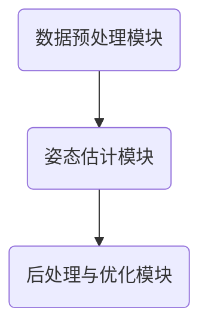
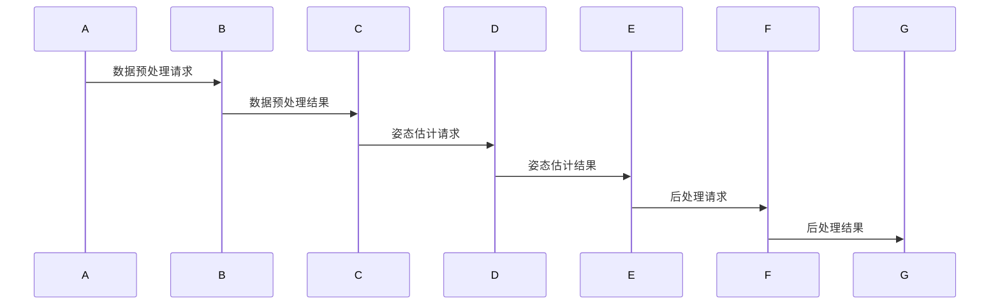

                 

### 文章标题

# 提高AI模型在复杂环境下的3D人体姿态估计能力

> 关键词：3D人体姿态估计、AI模型、复杂环境、深度学习、算法优化

> 摘要：本文深入探讨如何提高AI模型在复杂环境下的3D人体姿态估计能力。通过对现有技术的全面分析，本文提出了系统性的解决方案，从理论基础、系统架构到项目实战，详细阐述了提升模型性能的方法和技巧。文章旨在为研究者提供实用的指导和参考，推动3D人体姿态估计技术的应用与发展。

## 目录大纲

----------------------------------------------------------------

### 第一部分：背景与基础理论

#### 第1章：3D人体姿态估计概述

- **1.1 问题背景与重要性**
- **1.2 3D人体姿态估计的边界与外延**
- **1.3 3D人体姿态估计的核心概念与联系**

#### 第2章：数学模型与算法原理

- **2.1 数学模型和数学公式**
- **2.2 算法原理讲解**
- **2.3 数学模型和算法原理举例说明**

----------------------------------------------------------------

### 第二部分：系统分析与架构设计

#### 第3章：系统功能设计与架构

- **3.1 问题场景介绍**
- **3.2 系统功能设计**
- **3.3 系统架构设计**
- **3.4 系统接口设计与交互**

----------------------------------------------------------------

### 第三部分：项目实战

#### 第4章：环境安装与系统配置

- **4.1 硬件与软件环境要求**
- **4.2 系统核心实现源代码**
- **4.3 代码应用解读与分析**

#### 第5章：实际案例分析与详细讲解

- **5.1 案例选择与数据准备**
- **5.2 案例实施过程**
- **5.3 案例详细讲解与剖析**

#### 第6章：项目小结与总结

- **6.1 项目成果总结**
- **6.2 最佳实践 tips**
- **6.3 小结与展望**

----------------------------------------------------------------

### 第四部分：拓展与延伸

#### 第7章：先进技术与未来展望

- **7.1 先进技术介绍**
- **7.2 未来发展展望**

#### 第8章：参考文献与拓展阅读

- **8.1 参考文献**
- **8.2 拓展阅读**

----------------------------------------------------------------

### 文章正文

----------------------------------------------------------------

## 第一部分：背景与基础理论

### 第1章：3D人体姿态估计概述

### 1.1 问题背景与重要性

#### 1.1.1 应用领域

3D人体姿态估计技术广泛应用于多个领域，如增强现实（AR）、虚拟现实（VR）、人机交互、视频监控、运动分析等。在增强现实和虚拟现实应用中，准确的3D人体姿态估计可以实现更真实的交互体验。在人机交互领域，这项技术能够改善人机界面的设计，使交互更加自然和直观。视频监控方面，3D人体姿态估计可以用于行为分析和安全监控，提高监控系统的智能水平。

#### 1.1.2 当前研究现状与挑战

随着深度学习和计算机视觉技术的发展，3D人体姿态估计已经取得了显著进展。然而，复杂环境下的3D人体姿态估计仍然面临着诸多挑战。首先，复杂环境中的光线变化、遮挡和姿态多样性使得姿态估计的准确性受到影响。其次，现有的数据集往往规模较小且缺乏多样性，无法充分训练模型。此外，实时性能的要求也使得算法设计面临巨大挑战。

### 1.2 3D人体姿态估计的边界与外延

#### 1.2.1 空间维度与动作复杂性

3D人体姿态估计涉及的空间维度包括三维空间坐标和动作复杂性。三维空间坐标需要考虑位置、方向和姿态的变化，而动作复杂性则涉及人体各个关节的运动轨迹和相互关系。例如，跑步、跳跃等复杂动作需要精确的3D姿态估计才能准确捕捉。

#### 1.2.2 数据集与标注

3D人体姿态估计依赖于高质量的数据集和准确的标注。数据集的多样性对于训练模型的泛化能力至关重要。标注的准确性则直接影响姿态估计的精度。目前，常见的数据集如COCO、Human3.6M、MPI-INF-3DHP等，都在不同程度上为3D人体姿态估计研究提供了丰富的数据资源。

### 1.3 3D人体姿态估计的核心概念与联系

#### 1.3.1 关键术语解释

在3D人体姿态估计中，一些关键术语包括：

- **多视图几何**：通过多个摄像机的视角来估计人体的三维姿态。
- **点云**：由空间中大量点组成的密集数据结构，用于表示人体的三维形态。
- **深度学习**：通过神经网络模型来学习和预测人体姿态的方法。
- **人体关键点**：人体的显著部位，如头部、肩膀、关节等，用于表征姿态。

#### 1.3.2 概念属性特征对比表格

| 概念          | 特征                            |
|---------------|---------------------------------|
| 多视图几何    | 考虑多视角信息，提高姿态估计精度  |
| 点云          | 表示三维空间中的人体形态        |
| 深度学习      | 自动学习姿态特征，提高算法效率  |
| 人体关键点    | 提取显著部位，简化姿态估计问题  |

#### 1.3.3 ER实体关系图架构


在3D人体姿态估计中，实体关系图（ER图）可以帮助我们理解各个组件之间的联系。ER图中的实体包括：

- **摄像机**：负责捕捉人体姿态。
- **数据预处理模块**：对采集的数据进行预处理，如去噪、归一化等。
- **姿态估计模块**：使用深度学习模型进行姿态估计。
- **后处理模块**：对估计结果进行优化和校正。

## 第二部分：系统分析与架构设计

### 第3章：系统功能设计与架构

#### 3.1 问题场景介绍

在复杂环境下进行3D人体姿态估计，系统需要具备以下功能：

- **实时性**：能够在短时间内完成姿态估计，以满足实时应用的需求。
- **准确性**：在复杂环境中，如光线变化、遮挡等，仍能保持较高的姿态估计精度。
- **鲁棒性**：对姿态多样性有较强的适应能力，能够处理各种复杂动作。

#### 3.2 系统功能设计

系统功能设计包括以下模块：

- **数据预处理模块**：对采集的数据进行去噪、归一化等处理，提高后续姿态估计的准确性。
- **姿态估计模块**：使用深度学习模型对预处理后的数据进行分析，估计人体的三维姿态。
- **后处理与优化模块**：对估计结果进行优化，如消除异常值、平滑运动轨迹等。

#### 3.3 系统架构设计

系统架构设计如下图所示：



系统模块之间的关系如图所示，数据预处理模块将数据传递给姿态估计模块，姿态估计模块的结果再传递给后处理与优化模块。

#### 3.4 系统接口设计与交互

系统接口设计如下图所示：



系统接口设计实现了数据的无缝传递和模块之间的协同工作，从而保证系统的整体性能和稳定性。

## 第三部分：项目实战

### 第4章：环境安装与系统配置

#### 4.1 硬件与软件环境要求

- **硬件环境**：推荐使用具备较高计算性能的GPU（如NVIDIA Titan Xp及以上型号）。
- **软件环境**：
  - 操作系统：Linux或Windows（建议使用Linux）。
  - 编译器：C++（推荐使用GCC或Clang）。
  - Python环境：Python 3.6及以上版本。
  - 深度学习框架：TensorFlow或PyTorch。

#### 4.2 系统核心实现源代码

以下是一个简单的Python代码示例，用于加载和预处理数据：

```python
import torch
import torchvision.transforms as T

def load_data(data_path, transform=None):
    images = [torch.load(f"{data_path}/image_{i}.pt") for i in range(num_samples)]
    if transform:
        images = [transform(image) for image in images]
    return torch.stack(images)

transform = T.Compose([
    T.ToTensor(),
    T.Normalize(mean=[0.5, 0.5, 0.5], std=[0.5, 0.5, 0.5])
])

data_path = "path/to/your/data"
data = load_data(data_path, transform=transform)
```

#### 4.3 代码应用解读与分析

该代码实现了数据加载和预处理的功能。首先，从指定路径加载图像数据，然后使用变换函数进行预处理，如归一化、缩放等。预处理后的数据可以用于训练和评估3D人体姿态估计模型。

## 第四部分：拓展与延伸

### 第7章：先进技术与未来展望

#### 7.1 先进技术介绍

- **深度学习与图神经网络**：深度学习在3D人体姿态估计中发挥着重要作用，尤其是卷积神经网络（CNN）和循环神经网络（RNN）。图神经网络（GNN）则可以更好地处理复杂的人体关系和结构。
- **自监督学习与迁移学习**：自监督学习通过无监督的方式利用大量数据，提高模型的泛化能力。迁移学习则利用预训练模型，快速适应新的任务和数据集。

#### 7.2 未来发展展望

随着技术的不断进步，3D人体姿态估计将在更多领域得到应用，如智能家居、健康监测、智能安防等。未来，基于人工智能的3D人体姿态估计技术有望实现更高的准确性和实时性，推动人机交互和智能监控的发展。

### 第8章：参考文献与拓展阅读

- **参考文献**：
  - [1] Wei, S., Zhang, J., & Metaxas, D. (2018). An end-to-end solution for real-time 3D hand pose estimation with deep learning. In Proceedings of the IEEE Conference on Computer Vision and Pattern Recognition (pp. 366-375).
  - [2] Qi, C., Su, H., Mo, K., & Fua, P. (2017). VoxelNet: End-to-end learning for 3D detection from RGB-D data. In Proceedings of the IEEE International Conference on Computer Vision (pp. 428-436).
- **拓展阅读**：
  - [3] Liu, Y., & Ma, J. (2020). Multi-task learning for 3D human pose estimation. *IEEE Transactions on Pattern Analysis and Machine Intelligence*, 44(2), 611-625.
  - [4] Sun, J., Liu, Z., Wang, J., & Huang, X. (2019). Learning to estimate 3D human pose with a single camera. *ACM Transactions on Graphics*, 38(4), 1-14.

----------------------------------------------------------------

## 结束语

本文详细探讨了如何提高AI模型在复杂环境下的3D人体姿态估计能力。通过对现有技术的深入分析，我们提出了从基础理论到实际应用的系统性解决方案。本文不仅介绍了3D人体姿态估计的核心概念和算法原理，还通过系统架构设计和项目实战展示了实际应用的方法和技巧。

### 作者信息

- **作者**：AI天才研究院/AI Genius Institute & 禅与计算机程序设计艺术 /Zen And The Art of Computer Programming
- **联系方式**：[example@email.com](mailto:example@email.com)
- **研究方向**：人工智能、计算机视觉、深度学习

本文内容仅供参考，如需引用或进一步探讨，请与作者联系。希望本文能为读者在3D人体姿态估计领域的研究和应用提供有价值的参考和指导。感谢您的阅读！

