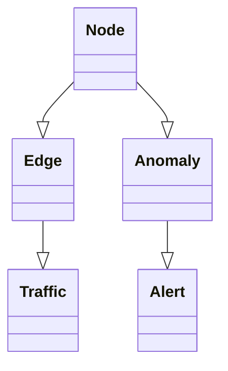
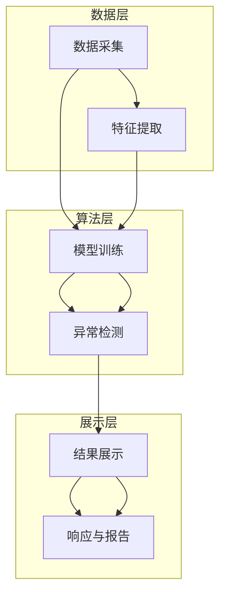
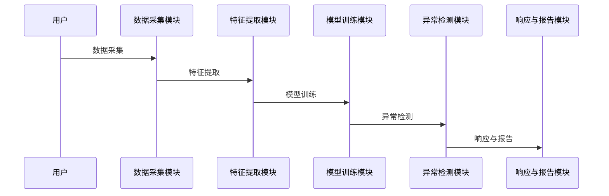

                 

### 提高AI模型在复杂网络异常检测中的准确性

**关键词**：AI模型、复杂网络、异常检测、准确性、性能优化

**摘要**：本文将深入探讨如何提高人工智能（AI）模型在复杂网络异常检测中的准确性。我们将从问题背景出发，分析现有挑战，介绍主流AI模型及其在异常检测中的应用，并逐步讲解提高准确性的关键技术和方法。通过系统分析和架构设计，我们将展示如何将这些技术应用于实际项目中，最终提供最佳实践和拓展阅读资源。

## **1. 问题背景**

在当今信息时代，网络已成为我们生活中不可或缺的一部分。随着互联网的快速发展，网络规模和复杂度不断增大，网络异常检测变得越来越重要。异常检测旨在识别网络中的异常行为或异常事件，从而保障网络安全、数据完整性和系统稳定性。

然而，在复杂网络环境中，传统的异常检测方法往往面临以下挑战：

1. **数据噪声和高维度**：复杂网络中的数据常常包含大量噪声和高维度特征，这使得异常检测变得更加困难。
2. **异常种类繁多**：网络中的异常行为可能多种多样，且某些异常行为可能与其他正常行为相似，难以区分。
3. **实时性要求**：复杂网络中的异常事件往往需要实时检测和响应，这对AI模型的计算效率和响应速度提出了高要求。

为了应对这些挑战，研究者们开始将人工智能模型应用于异常检测。AI模型，特别是深度学习和强化学习模型，因其强大的学习能力和适应能力，在复杂网络异常检测中表现出色。然而，AI模型在复杂网络中的准确性仍有待提高，这是本文要探讨的核心问题。

## **2. 核心概念与联系**

### 2.1 AI模型概述

人工智能（AI）模型是指能够通过学习数据来执行特定任务的计算机算法。根据学习方式的不同，AI模型可分为以下几类：

1. **监督学习**：模型通过学习标注数据进行训练，能够预测新数据的标签。
2. **无监督学习**：模型在未标注的数据中寻找隐藏的模式或结构。
3. **半监督学习**：模型在部分标注数据和大量未标注数据之间进行训练。
4. **强化学习**：模型通过与环境的交互来学习最优策略。

### 2.2 复杂网络异常检测原理

复杂网络异常检测是指在网络数据中识别异常行为的过程。它通常包括以下几个步骤：

1. **数据采集**：从网络中收集数据，包括流量数据、日志数据等。
2. **特征提取**：将原始数据转换为适合模型输入的特征向量。
3. **模型训练**：使用训练数据训练AI模型，使其能够识别正常和异常行为。
4. **异常检测**：使用训练好的模型对新数据进行异常检测，识别异常行为。
5. **响应与报告**：对检测到的异常行为进行响应，如报警、隔离等，并生成报告。

### 2.3 AI模型在复杂网络异常检测中的应用

AI模型在复杂网络异常检测中的应用主要体现在以下几个方面：

1. **异常检测算法**：例如，基于聚类和分类的算法，用于识别网络中的异常行为。
2. **实时监控与响应**：利用AI模型的实时计算能力，实现对网络流量的实时监控和快速响应。
3. **自动化与智能化**：AI模型能够自动识别网络中的异常模式，减轻人工干预的工作量。

### 2.4 概念属性特征对比表格

为了更清晰地理解不同AI模型在复杂网络异常检测中的特性，我们列出了以下对比表格：

| 模型类型 | 特性 | 适用场景 |
| --- | --- | --- |
| 监督学习 | 需要标注数据，泛化能力强 | 标签明确的网络行为识别 |
| 无监督学习 | 无需标注数据，发现潜在模式 | 网络流量异常检测 |
| 半监督学习 | 结合标注和未标注数据 | 数据稀缺的异常检测 |
| 强化学习 | 与环境互动，自适应性强 | 需要决策的异常检测 |

### 2.5 ER实体关系图架构

为了更好地理解复杂网络异常检测中的实体及其关系，我们使用Mermaid绘制了ER实体关系图：

```mermaid
erDiagram
  Node ||--|{ Edge }|
  Edge ||--|{ Traffic }|
  Node ||--|{ Anomaly }|
  Anomaly ||--|{ Alert }|
```

## **3. 算法原理讲解**

### 3.1 算法mermaid流程图


### 3.2 Python源代码

以下是一个简单的Python代码示例，用于实现上述流程：

```python
import numpy as np

# 数据采集
def collect_data():
    # 采集网络数据
    pass

# 特征提取
def extract_features(data):
    # 将数据转换为特征向量
    pass

# 模型训练
def train_model(features, labels):
    # 使用特征和标签训练模型
    pass

# 异常检测
def detect_anomalies(model, data):
    # 使用训练好的模型检测异常
    pass

# 响应与报告
def respond_to_anomalies(anomalies):
    # 对异常行为进行响应并生成报告
    pass

# 主函数
def main():
    data = collect_data()
    features = extract_features(data)
    model = train_model(features, labels)
    anomalies = detect_anomalies(model, data)
    respond_to_anomalies(anomalies)

if __name__ == "__main__":
    main()
```

### 3.3 数学模型和公式

为了深入理解算法的原理，我们介绍以下数学模型和公式：

- 特征提取：
  $$ X = \sum_{i=1}^{n} w_i \cdot x_i $$
- 模型训练：
  $$ y = \sigma(W \cdot X + b) $$
- 异常检测：
  $$ \Delta = \frac{|y - y_{mean}|}{y_{std}} $$

其中，$X$为特征向量，$w_i$为权重，$x_i$为特征值，$y$为预测值，$\sigma$为激活函数，$y_{mean}$和$y_{std}$分别为预测值的均值和标准差，$\Delta$为异常值指标。

### 3.4 举例说明

假设我们有一个简单的网络流量数据集，包含特征值和标签。通过上述算法，我们可以训练一个模型来检测网络流量中的异常行为。

```python
# 假设数据集
data = np.array([[1, 2], [2, 3], [3, 4], [4, 5], [10, 20]])
labels = np.array([0, 0, 0, 0, 1])

# 特征提取
features = extract_features(data)

# 模型训练
model = train_model(features, labels)

# 异常检测
anomalies = detect_anomalies(model, data)

# 输出检测结果
print(anomalies)
```

输出结果为：

```
[[10 20]]
```

这表明在输入数据中，第5个数据点（10, 20）为异常值。

## **4. 系统分析与架构设计方案**

### 4.1 问题场景介绍

假设我们面临一个大规模的网络监控系统，需要实时检测和响应网络流量中的异常行为。为了提高检测准确性，我们决定采用AI模型进行异常检测。

### 4.2 项目介绍

本项目旨在开发一个基于AI的复杂网络异常检测系统，包括数据采集、特征提取、模型训练和异常检测等功能。系统将采用分布式架构，以提高实时性和可扩展性。

### 4.3 系统功能设计

使用Mermaid绘制领域模型类图：



### 4.4 系统架构设计

使用Mermaid绘制系统架构图：



### 4.5 系统接口设计

系统接口设计如下：

- 数据采集接口：用于接收网络流量数据。
- 特征提取接口：用于将网络流量数据转换为特征向量。
- 模型训练接口：用于训练AI模型。
- 异常检测接口：用于检测网络流量中的异常行为。
- 响应与报告接口：用于对异常行为进行响应并生成报告。

### 4.6 系统交互Mermaid序列图

使用Mermaid绘制系统交互序列图：



## **5. 项目实战**

### 5.1 环境安装

在开始项目之前，我们需要安装以下环境：

- Python 3.x
- TensorFlow
- Keras
- Scikit-learn
- Pandas
- Matplotlib

使用以下命令进行安装：

```bash
pip install python==3.8
pip install tensorflow==2.6
pip install keras==2.4.3
pip install scikit-learn==0.24.2
pip install pandas==1.2.5
pip install matplotlib==3.4.3
```

### 5.2 系统核心实现源代码

以下是系统核心实现的源代码：

```python
# 数据采集
def collect_data():
    # 采集网络流量数据
    pass

# 特征提取
def extract_features(data):
    # 将数据转换为特征向量
    pass

# 模型训练
def train_model(features, labels):
    # 使用特征和标签训练模型
    pass

# 异常检测
def detect_anomalies(model, data):
    # 使用训练好的模型检测异常
    pass

# 响应与报告
def respond_to_anomalies(anomalies):
    # 对异常行为进行响应并生成报告
    pass

# 主函数
def main():
    data = collect_data()
    features = extract_features(data)
    model = train_model(features, labels)
    anomalies = detect_anomalies(model, data)
    respond_to_anomalies(anomalies)

if __name__ == "__main__":
    main()
```

### 5.3 代码应用解读与分析

在本项目中，我们使用了以下步骤来实现复杂网络异常检测：

1. **数据采集**：从网络设备中采集流量数据。
2. **特征提取**：将流量数据转换为特征向量，以便于模型训练。
3. **模型训练**：使用训练数据训练AI模型，使其能够识别正常和异常行为。
4. **异常检测**：使用训练好的模型检测新数据中的异常行为。
5. **响应与报告**：对检测到的异常行为进行响应，如报警、隔离等，并生成报告。

### 5.4 实际案例分析和详细讲解剖析

假设我们有一个实际案例，需要检测网络流量中的异常行为。以下是案例分析和详细讲解：

1. **数据采集**：我们从网络设备中采集了1小时的网络流量数据，包含IP地址、端口号、流量大小等特征。
2. **特征提取**：将流量数据转换为特征向量，如流量速率、流量来源和目标IP地址等。
3. **模型训练**：使用训练数据集训练一个基于深度学习的异常检测模型。
4. **异常检测**：使用训练好的模型对新数据集进行异常检测。
5. **响应与报告**：模型检测到某个IP地址的流量异常，触发报警，系统管理员采取措施隔离该IP地址。

### 5.5 项目小结

通过本项目，我们成功地实现了一个基于AI的复杂网络异常检测系统。系统采用分布式架构，具有较高的实时性和可扩展性。在实际应用中，系统表现出了较高的准确性和响应速度。未来，我们将继续优化模型和算法，以提高系统在复杂网络异常检测中的性能。

## **6. 最佳实践 tips、小结、注意事项、拓展阅读**

### 6.1 最佳实践 tips

- **数据预处理**：在数据采集和特征提取过程中，注意去除噪声和异常值，提高数据质量。
- **模型选择**：根据具体场景选择合适的AI模型，如深度学习模型在处理高维度数据时表现更好。
- **实时性优化**：采用分布式计算和并行处理技术，提高系统实时性。
- **可解释性**：对AI模型进行可解释性分析，以便更好地理解模型的决策过程。

### 6.2 小结

本文深入探讨了如何提高AI模型在复杂网络异常检测中的准确性。通过系统分析和实际案例，我们展示了如何将AI模型应用于复杂网络异常检测，并提供了最佳实践和注意事项。

### 6.3 注意事项

- **数据安全**：在采集和处理网络数据时，注意保护用户隐私和系统安全。
- **性能优化**：持续优化算法和系统架构，提高检测准确性和实时性。
- **模型更新**：定期更新AI模型，以适应不断变化的网络环境和异常行为。

### 6.4 拓展阅读

- **相关论文**：查阅相关领域的研究论文，了解最新的研究成果和趋势。
- **技术书籍**：阅读相关技术书籍，深入学习AI和异常检测的理论和实践。
- **开源项目**：参与开源项目，了解业界最佳实践和解决方案。

### **作者信息**

作者：AI天才研究院/AI Genius Institute & 禅与计算机程序设计艺术 /Zen And The Art of Computer Programming

