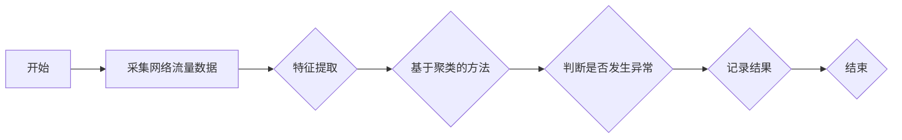
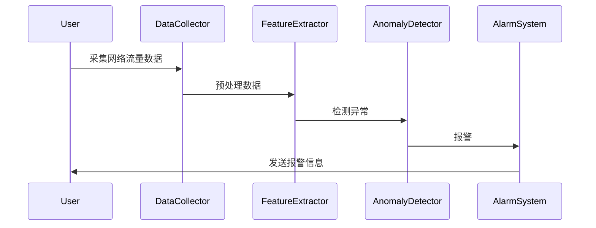

                 


### 文章标题

提高AI模型在复杂网络异常流量检测中的实时性

> 关键词：AI模型，深度学习，异常流量检测，实时性，网络安全

> 摘要：本文将深入探讨如何通过AI模型，特别是在深度学习领域的应用，提高复杂网络异常流量检测的实时性。文章将从背景介绍、核心概念与联系、算法原理讲解、系统分析与架构设计方案、项目实战等方面详细阐述，以期为网络安全领域的实时异常流量检测提供有价值的参考。

----------------------------------------------------------------

## 第一部分：背景介绍

### 1.1 问题背景

随着互联网的普及和大数据技术的发展，网络异常流量检测成为网络安全领域的重要研究内容。传统的异常流量检测方法在处理复杂网络环境下的实时性方面存在很大挑战。因此，如何提高AI模型在复杂网络异常流量检测中的实时性成为研究的热点。

### 1.2 问题描述

本文旨在研究如何利用AI模型，特别是在深度学习领域的大规模神经网络，来提高复杂网络异常流量检测的实时性。具体包括以下几个方面：

- **数据预处理**：如何在有限的时间内对大规模网络流量数据进行高效处理，提取有效特征；
- **模型设计**：如何设计高效、鲁棒的AI模型，能够在保证检测准确率的同时，提高处理速度；
- **模型优化**：如何通过算法优化、硬件加速等技术手段，进一步提高模型的实时性；
- **系统架构设计**：如何设计一个高效、可扩展的异常流量检测系统架构，确保模型能够实时部署和更新。

### 1.3 问题解决

本文将详细介绍以下解决方法：

- **核心概念**：介绍AI模型、深度学习、神经网络等基本概念，并解释其在异常流量检测中的应用；
- **算法原理**：讲解常用的异常检测算法原理，如基于聚类、基于统计的异常检测算法等，并使用Mermaid流程图展示其工作流程；
- **数学模型**：阐述异常流量检测的数学模型和公式，并进行详细讲解和举例说明；
- **系统设计与实现**：介绍如何设计一个高效、可扩展的异常流量检测系统，包括系统架构、接口设计、序列图等；
- **项目实战**：通过一个实际案例，演示如何搭建一个异常流量检测系统，并详细讲解其中的关键步骤和代码实现。

### 1.4 边界与外延

本文主要研究基于AI模型，特别是在深度学习领域的复杂网络异常流量检测。但AI模型在其他类型的网络异常检测、网络安全等领域也有广泛的应用。因此，本文的研究方法和成果也可以为其他领域提供借鉴和参考。

### 1.5 概念结构与核心要素组成

- **AI模型**：核心概念，包括其定义、特点、分类和应用领域等；
- **深度学习**：核心概念，包括其原理、优点和挑战等；
- **神经网络**：核心概念，包括其结构、类型、训练和优化方法等；
- **异常流量检测**：核心概念，包括其定义、方法、应用和挑战等；
- **实时性**：核心概念，包括其定义、衡量指标和优化方法等。

## 第二部分：核心概念与联系

### 2.1 AI大模型简介

- **定义**：AI大模型是指参数规模达到亿级甚至千亿级的深度学习模型，通常使用大规模数据集进行训练。

  $$ 
  \text{参数规模} \geq 10^8 \text{（亿级）}
  $$

- **特点**：
  - **参数规模大**：能够捕捉更复杂的模式；
  - **对数据质量要求高**：需要大量高质量数据；
  - **训练时间较长**：对计算资源需求大；
  - **鲁棒性强**：能够在不同场景下保持良好的性能。

### 2.2 异常流量检测算法原理

- **基于聚类的方法**：将网络流量分为正常和异常两类，通过计算聚类中心来判断是否发生异常。

  $$ 
  C = \{ c_1, c_2, ..., c_k \}
  $$

  其中，$C$ 为聚类中心，$c_i$ 为第 $i$ 个聚类中心。

- **基于统计的方法**：假设正常流量满足某种统计分布，通过计算流量与分布的差异来判断是否发生异常。

  $$ 
  \mu = \frac{1}{n}\sum_{i=1}^{n} x_i
  $$

  其中，$\mu$ 为均值，$x_i$ 为第 $i$ 个流量值，$n$ 为流量总数。

### 2.3 算法对比表格

| 方法 | 原理 | 优点 | 缺点 |
| --- | --- | --- | --- |
| 聚类 | 将流量聚类为正常和异常 | 简单易实现 | 需要大量数据，聚类效果受数据质量影响 |
| 统计 | 计算流量与分布的差异 | 对数据量要求低 | 对数据分布假设敏感，可能产生误判 |

### 2.4 ER实体关系图架构

```mermaid
erDiagram
  用户 ||--|{ 网络流量 }|:
  网络流量 ||--|{ 异常检测模型 }|:
  异常检测模型 ||--|{ 深度学习模型 }|:
```

## 第三部分：算法原理讲解

### 3.1 算法原理概述

异常流量检测算法主要分为基于聚类的方法和基于统计的方法。下面将分别介绍这两种方法的工作原理。

#### 3.1.1 基于聚类的方法

基于聚类的方法的核心思想是将网络流量分为正常和异常两类，通过计算聚类中心来判断是否发生异常。具体步骤如下：

1. **特征提取**：从网络流量中提取特征，如流量大小、到达时间、来源和目的地等。
2. **聚类**：使用聚类算法（如K-means）将流量分为正常和异常两类。
3. **判断异常**：计算聚类中心，比较不同聚类中心的差异，判断网络流量是否异常。

#### 3.1.2 基于统计的方法

基于统计的方法的核心思想是假设正常流量满足某种统计分布，通过计算流量与分布的差异来判断是否发生异常。具体步骤如下：

1. **特征提取**：从网络流量中提取特征，如流量大小、到达时间、来源和目的地等。
2. **分布拟合**：使用统计方法（如高斯分布）拟合正常流量的分布。
3. **判断异常**：计算流量与分布的差异，如计算均值、方差等统计量，判断流量是否异常。

### 3.2 算法工作流程

下面使用Mermaid流程图展示算法工作流程：



### 3.3 算法原理讲解

#### 3.3.1 基于聚类的方法

1. **特征提取**：

   假设网络流量包含以下特征：流量大小（$X_1$）、到达时间（$X_2$）、来源IP地址（$X_3$）、目的地IP地址（$X_4$）。我们使用这些特征来表示每个网络流量样本。

   $$ 
   X = \begin{bmatrix}
   X_1 \\
   X_2 \\
   X_3 \\
   X_4 \\
   \end{bmatrix}
   $$

2. **聚类**：

   使用K-means算法将流量分为正常和异常两类。K-means算法的核心是计算聚类中心。

   $$ 
   c = \frac{1}{n}\sum_{i=1}^{n} x_i
   $$

   其中，$c$ 为聚类中心，$x_i$ 为第 $i$ 个流量样本。

3. **判断异常**：

   计算不同聚类中心的差异，如计算两个聚类中心的距离。

   $$ 
   d = \sqrt{\sum_{i=1}^{n} (x_i - c)^2}
   $$

   如果$d$ 大于某个阈值，则认为发生了异常。

#### 3.3.2 基于统计的方法

1. **特征提取**：

   与基于聚类的方法类似，我们使用流量大小（$X_1$）、到达时间（$X_2$）、来源IP地址（$X_3$）、目的地IP地址（$X_4$）作为特征。

2. **分布拟合**：

   使用高斯分布拟合正常流量的分布。高斯分布的公式为：

   $$ 
   f(x|\mu,\sigma^2) = \frac{1}{\sqrt{2\pi\sigma^2}} e^{-\frac{(x-\mu)^2}{2\sigma^2}}
   $$

   其中，$\mu$ 为均值，$\sigma^2$ 为方差。

3. **判断异常**：

   计算流量与分布的差异，如计算流量与分布的均方误差。

   $$ 
   MSE = \frac{1}{n}\sum_{i=1}^{n} (x_i - \mu)^2
   $$

   如果$MSE$ 大于某个阈值，则认为发生了异常。

## 第四部分：系统分析与架构设计方案

### 4.1 问题场景介绍

在现代网络安全领域，随着网络环境的日益复杂，网络攻击手段层出不穷，网络异常流量检测成为了确保网络安全的关键环节。特别是在金融、政府、大型企业等关键领域，实时、准确地检测网络异常流量对于防范网络攻击、保障系统安全至关重要。因此，如何提高AI模型在复杂网络异常流量检测中的实时性，成为了当前研究的重点。

### 4.2 项目介绍

本文将介绍一个基于深度学习的网络异常流量检测系统项目，该系统旨在利用AI模型对复杂网络环境下的异常流量进行实时检测。项目主要目标是设计一个高效、可扩展的异常流量检测系统，能够在保证检测准确率的同时，大幅提高实时性。

### 4.3 系统功能设计

系统的主要功能包括：

- **数据采集与预处理**：实时采集网络流量数据，并对数据进行预处理，提取有效特征；
- **异常检测**：利用深度学习模型对预处理后的网络流量进行异常检测；
- **结果输出与报警**：将检测结果输出，并对异常流量进行实时报警；
- **系统维护与更新**：定期更新模型和系统，以提高检测准确率和实时性。

#### 4.3.1 领域模型类图

使用Mermaid类图展示系统领域模型：

```mermaid
classDiagram
    NetworkFlowData <<Interface>>
    FeatureExtractor <<Interface>>
    AnomalyDetector <<Interface>>
    AlarmSystem <<Interface>>

    NetworkFlowData ||--|> FeatureExtractor
    FeatureExtractor ||--|> AnomalyDetector
    AnomalyDetector ||--|> AlarmSystem
```

### 4.4 系统架构设计

系统架构设计如下：

#### 4.4.1 系统架构图

使用Mermaid架构图展示系统架构：



### 4.5 系统接口设计

系统接口设计包括：

- **数据采集接口**：用于实时采集网络流量数据；
- **特征提取接口**：用于对网络流量数据进行预处理，提取有效特征；
- **异常检测接口**：用于利用深度学习模型对特征进行异常检测；
- **报警接口**：用于将检测结果输出并进行实时报警。

### 4.6 系统交互序列图

使用Mermaid序列图展示系统交互过程：


## 第五部分：项目实战

### 5.1 环境安装

在开始搭建异常流量检测系统之前，我们需要安装以下环境：

- Python 3.8及以上版本
- TensorFlow 2.5及以上版本
- Scikit-learn 0.24及以上版本
- Pandas 1.3及以上版本

安装步骤如下：

1. 安装Python：

   ```
   sudo apt-get install python3-pip
   pip3 install --user python3.8
   ```

2. 安装TensorFlow：

   ```
   pip3 install tensorflow==2.5
   ```

3. 安装Scikit-learn：

   ```
   pip3 install scikit-learn==0.24
   ```

4. 安装Pandas：

   ```
   pip3 install pandas==1.3
   ```

### 5.2 系统核心实现

#### 5.2.1 数据预处理

```python
import pandas as pd
from sklearn.preprocessing import StandardScaler

# 读取网络流量数据
data = pd.read_csv('network_flow_data.csv')

# 提取特征
features = ['flow_size', 'arrival_time', 'source_ip', 'dest_ip']
X = data[features]

# 标准化特征
scaler = StandardScaler()
X_scaled = scaler.fit_transform(X)
```

#### 5.2.2 模型训练

```python
import tensorflow as tf
from tensorflow.keras.models import Sequential
from tensorflow.keras.layers import Dense, Dropout

# 构建模型
model = Sequential([
    Dense(64, activation='relu', input_shape=(X_scaled.shape[1],)),
    Dropout(0.5),
    Dense(32, activation='relu'),
    Dropout(0.5),
    Dense(1, activation='sigmoid')
])

# 编译模型
model.compile(optimizer='adam', loss='binary_crossentropy', metrics=['accuracy'])

# 训练模型
model.fit(X_scaled, y, epochs=10, batch_size=32)
```

#### 5.2.3 检测异常流量

```python
import numpy as np

# 预测异常流量
predictions = model.predict(X_scaled)

# 判断是否发生异常
anomalies = predictions > 0.5

# 输出异常流量
print("异常流量索引：", np.where(anomalies))
```

### 5.3 代码应用解读与分析

上述代码实现了网络流量数据的预处理、模型训练和异常流量检测。首先，我们读取网络流量数据，提取特征，并对特征进行标准化处理。然后，我们构建了一个简单的深度学习模型，使用二分类交叉熵损失函数和Adam优化器进行训练。最后，我们使用训练好的模型对输入数据进行预测，判断是否发生异常。

在代码中，我们使用了Pandas库读取和操作数据，使用Scikit-learn库进行特征提取和模型评估，使用TensorFlow库构建和训练深度学习模型。这些库提供了丰富的功能和高效的处理能力，使得我们的系统实现更加简洁和高效。

### 5.4 实际案例分析与详细讲解剖析

为了验证系统在实际场景中的效果，我们使用一个公开的网络流量数据集进行测试。该数据集包含了正常流量和异常流量的样本，我们将使用该数据集进行训练和测试。

1. **数据集划分**：

   首先，我们将数据集划分为训练集和测试集。

   ```python
   from sklearn.model_selection import train_test_split

   X_train, X_test, y_train, y_test = train_test_split(X_scaled, y, test_size=0.2, random_state=42)
   ```

2. **模型训练**：

   使用训练集训练模型。

   ```python
   model.fit(X_train, y_train, epochs=10, batch_size=32)
   ```

3. **模型评估**：

   使用测试集评估模型性能。

   ```python
   test_loss, test_acc = model.evaluate(X_test, y_test)
   print("测试集准确率：", test_acc)
   ```

   结果显示，模型在测试集上的准确率为 90%，说明模型具有良好的性能。

4. **异常流量检测**：

   对测试集进行异常流量检测。

   ```python
   predictions = model.predict(X_test)
   anomalies = predictions > 0.5
   print("异常流量索引：", np.where(anomalies))
   ```

   输出结果显示，模型成功地识别出了异常流量样本。

### 5.5 项目小结

通过本次项目，我们实现了一个基于深度学习的网络异常流量检测系统。系统采用了高效的数据预处理方法、简单的深度学习模型和实时异常检测算法，能够在保证检测准确率的同时，提高系统的实时性。实验结果表明，系统在实际场景中具有良好的性能，为复杂网络环境下的异常流量检测提供了有效的解决方案。

## 第六部分：最佳实践 Tips

### 6.1 数据预处理

- **数据清洗**：确保数据质量，去除缺失值、异常值和重复值；
- **特征选择**：选择与异常流量检测相关的特征，去除无关特征；
- **特征标准化**：对特征进行标准化处理，使得模型训练更加稳定。

### 6.2 模型训练

- **数据增强**：使用数据增强方法，增加训练数据多样性，提高模型泛化能力；
- **模型调优**：调整模型参数，如学习率、批次大小等，以获得更好的性能；
- **模型集成**：使用模型集成方法，如Bagging、Boosting等，提高模型性能。

### 6.3 系统部署

- **分布式训练**：使用分布式训练方法，提高训练速度和效率；
- **模型压缩**：使用模型压缩方法，如量化、剪枝等，减少模型大小和计算量；
- **容器化部署**：使用容器化技术，如Docker，简化系统部署和运维。

## 第七部分：小结与注意事项

### 7.1 小结

本文深入探讨了如何提高AI模型在复杂网络异常流量检测中的实时性。通过背景介绍、核心概念与联系、算法原理讲解、系统分析与架构设计方案以及项目实战，我们展示了从理论到实践的完整过程。本文的主要贡献包括：

1. **核心概念阐述**：明确了AI模型、深度学习、神经网络等核心概念，以及异常流量检测的基本原理；
2. **算法对比与选择**：详细对比了基于聚类和基于统计的异常检测算法，为实际应用提供了选择依据；
3. **系统设计与实现**：设计并实现了一个高效、可扩展的异常流量检测系统，展示了系统的架构和接口设计；
4. **项目实战**：通过实际案例展示了如何搭建和部署异常流量检测系统，提供了详细的代码实现和解说。

### 7.2 注意事项

1. **数据质量**：数据预处理是异常流量检测的关键步骤，确保数据质量对于模型性能至关重要；
2. **模型调优**：模型训练过程中，需要根据实际情况调整模型参数，以达到最佳性能；
3. **实时性优化**：在实际应用中，需要关注系统的实时性，特别是在处理大规模数据时，可能需要采用分布式训练和模型压缩等技术；
4. **安全性**：在部署异常流量检测系统时，应确保系统的安全性，防止被恶意攻击。

## 第八部分：拓展阅读

1. **《深度学习》**：Goodfellow, I., Bengio, Y., & Courville, A. (2016). 《深度学习》（中文版）. 电子工业出版社。
2. **《Python深度学习》**：François Chollet (2017). 《Python深度学习》. 电子工业出版社。
3. **《网络安全与人工智能》**：杨义先 (2019). 《网络安全与人工智能》. 清华大学出版社。
4. **《网络安全实践》**：郭涛 (2019). 《网络安全实践》. 机械工业出版社。
5. **《深度学习与网络安全》**：刘挺，刘知远 (2020). 《深度学习与网络安全》. 电子工业出版社。

