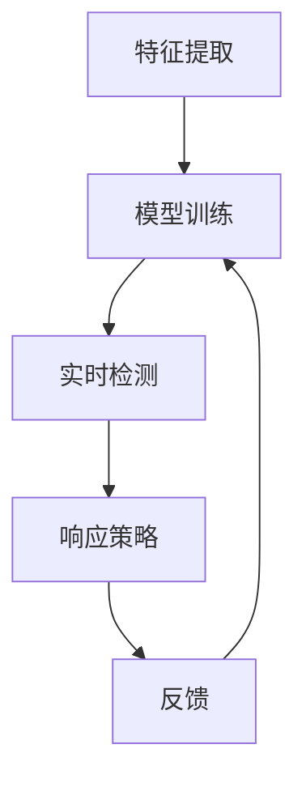
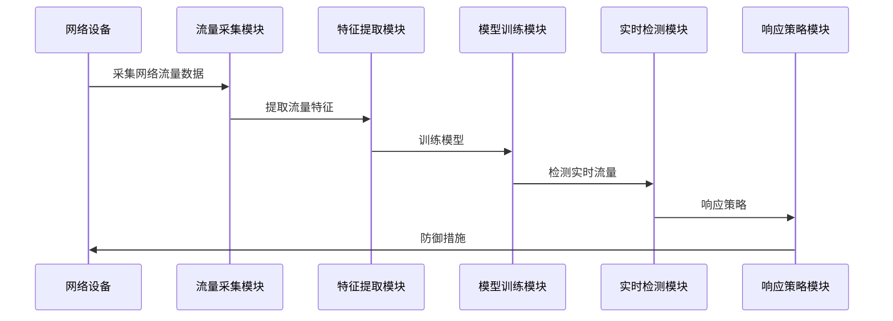

                 

### 提高AI模型在复杂网络攻击检测中的实时响应能力

#### 关键词

- AI模型
- 网络攻击检测
- 实时响应
- 特征提取
- 深度学习

#### 摘要

本文将探讨如何提高AI模型在复杂网络攻击检测中的实时响应能力。我们将从背景介绍、核心概念与联系、算法原理讲解、数学模型与公式、系统分析与架构设计等多个方面进行分析和讨论。通过深入研究AI模型在网络攻击检测中的应用，本文旨在为读者提供一套完整的解决方案，包括算法原理、数学模型、系统架构设计、项目实战等，帮助读者深入了解并掌握提高AI模型在复杂网络攻击检测中的实时响应能力的核心技术和实践方法。

## 第一部分：背景介绍

### 问题背景

在当今数字化时代，随着互联网的普及和技术的快速发展，网络安全问题日益严峻。网络攻击手段不断升级，传统的防御方法已经难以应对复杂的网络威胁。AI技术作为当前最先进的技术之一，在网络安全领域有着广泛的应用潜力。

网络攻击的种类和形式多种多样，包括DDoS攻击、恶意软件、钓鱼攻击等。DDoS攻击通过大量虚假请求使目标系统瘫痪，恶意软件通过植入恶意代码破坏系统功能，钓鱼攻击则通过伪装成合法网站或邮件等手段骗取用户敏感信息。这些攻击不仅对个人用户造成损失，还可能对企业造成严重的财务损失和声誉损害。

### 问题描述

AI模型在复杂网络攻击检测中的实时响应能力不足，主要表现在以下几个方面：

1. **检测延迟**：由于网络攻击的快速变化和攻击手段的复杂性，AI模型可能无法在第一时间检测到攻击，导致防御措施延误。
2. **误报率高**：AI模型在检测过程中可能会误报正常流量，导致不必要的警报和资源浪费。
3. **响应缓慢**：即使AI模型能够及时检测到攻击，其响应速度可能仍然较慢，无法在攻击对系统造成严重损害之前采取有效的防御措施。
4. **模型适应性差**：网络攻击手段不断变化，AI模型需要不断更新和调整，否则可能导致检测效果下降。

### 问题解决

本文旨在通过深入研究AI模型在网络攻击检测中的应用，提供一套完整的解决方案，以提升AI模型在复杂网络攻击检测中的实时响应能力。具体方案包括以下几个方面：

1. **优化算法**：通过改进机器学习和深度学习算法，提高模型的检测准确性和响应速度。
2. **特征提取**：从网络流量中提取更多有效的特征，用于训练和优化AI模型。
3. **实时检测**：利用高效的检测算法和硬件加速技术，实现实时检测和响应。
4. **模型更新**：建立自动化的模型更新机制，确保模型能够适应最新的网络攻击手段。

### 边界与外延

本文主要探讨AI模型在网络安全领域的应用，包括但不限于网络攻击检测、恶意软件识别、异常行为分析等。同时，本文也关注AI模型在实际应用中面临的挑战和问题，以及如何通过技术创新和实践经验积累来提高AI模型的实时响应能力。

### 概念结构与核心要素组成

- **AI模型**：本文的核心概念，包括机器学习、深度学习等算法模型。
- **网络攻击**：本文的研究对象，包括DDoS攻击、恶意软件、钓鱼攻击等。
- **实时响应**：本文的目标，即通过AI模型实现对网络攻击的快速识别、响应和防御。

## 第二部分：核心概念与联系

### AI模型原理

AI模型是人工智能的核心组成部分，主要包括机器学习和深度学习两种技术。机器学习通过从数据中学习规律和模式，实现对未知数据的预测和分类。深度学习则基于多层神经网络的结构，通过反向传播算法进行参数优化。

机器学习算法包括线性回归、逻辑回归、决策树、支持向量机等。深度学习算法包括卷积神经网络（CNN）、循环神经网络（RNN）、生成对抗网络（GAN）等。这些算法在网络安全领域有着广泛的应用，例如用于检测网络攻击、识别恶意软件和异常行为等。

### 网络攻击类型

网络攻击种类繁多，主要包括以下几种类型：

1. **DDoS攻击**：分布式拒绝服务攻击，通过大量虚假请求使目标系统瘫痪。
2. **恶意软件**：恶意程序，包括病毒、木马、蠕虫等，对系统进行破坏。
3. **钓鱼攻击**：通过伪装成合法网站或邮件等手段，骗取用户敏感信息。
4. **社交工程攻击**：利用人类的社会工程学原理，欺骗用户泄露敏感信息。
5. **中间人攻击**：在网络通信过程中窃取或篡改数据。

### 实时响应机制

实时响应机制是提高AI模型在复杂网络攻击检测中实时响应能力的关键。实时响应机制主要包括以下几个步骤：

1. **检测**：利用AI模型对网络流量进行实时分析，识别潜在的攻击行为。
2. **防御**：根据检测结果，采取相应的防御措施，如阻断攻击流量、隔离受感染节点等。
3. **反馈**：将防御效果反馈给AI模型，用于持续优化和提升响应能力。

### 核心概念与联系

AI模型、网络攻击和实时响应是本文的核心概念。AI模型是网络安全领域的关键技术，用于检测和防御网络攻击。网络攻击是AI模型的研究对象，通过识别和响应网络攻击，AI模型能够实现对网络安全的有效保障。实时响应机制则是AI模型在网络安全领域应用的核心，通过实时检测和防御，AI模型能够快速响应网络攻击，降低攻击对系统的损害。

## 第三部分：算法原理讲解

### 算法原理

AI模型在复杂网络攻击检测中的算法原理主要包括以下几个步骤：

1. **特征提取**：从网络流量中提取关键特征，用于训练和检测AI模型。特征提取是算法的关键步骤，需要考虑网络流量的时间序列特性、数据包大小、传输速率等。
2. **模型训练**：利用提取的特征进行模型训练，使其能够识别和预测网络攻击。模型训练是算法的核心，通过大量数据训练，AI模型能够学习到网络攻击的特征模式。
3. **实时检测**：利用训练好的模型对实时网络流量进行检测，识别潜在的攻击行为。实时检测是算法的实际应用，通过高效算法和硬件加速技术，实现实时响应。
4. **响应策略**：根据检测结果，采取相应的防御措施，实现实时响应。响应策略包括阻断攻击流量、隔离受感染节点等。

### Mermaid流程图



### 特征提取

特征提取是算法的关键步骤，需要从网络流量中提取关键特征。以下是一些常用的特征提取方法：

1. **统计特征**：包括流量大小、传输速率、数据包分布等。这些特征可以通过简单的统计方法计算，如平均值、标准差等。
2. **时序特征**：包括时间序列特性，如数据包到达时间间隔、流量波动等。时序特征可以用于分析网络流量的趋势和模式。
3. **深度特征**：通过深度学习算法提取的特征，如卷积神经网络（CNN）提取的图像特征、循环神经网络（RNN）提取的序列特征等。深度特征可以更好地捕捉网络流量的复杂特性。

### 模型训练

模型训练是算法的核心步骤，通过大量数据训练，AI模型能够学习到网络攻击的特征模式。常用的训练方法包括：

1. **监督学习**：通过标注的数据集进行训练，模型学习到正常流量和攻击流量的特征差异。
2. **无监督学习**：在没有标注数据的情况下，模型通过自我学习发现网络流量的异常模式。
3. **半监督学习**：结合监督学习和无监督学习，利用少量标注数据和大量未标注数据训练模型。

### 实时检测

实时检测是算法的实际应用，通过高效算法和硬件加速技术，实现实时响应。以下是一些常用的实时检测方法：

1. **分类器**：使用训练好的分类器对实时网络流量进行分类，识别潜在的攻击行为。
2. **规则匹配**：根据预定义的规则，对实时网络流量进行匹配，检测攻击行为。
3. **模式识别**：利用深度学习算法，对实时网络流量进行模式识别，识别潜在的攻击行为。

### 响应策略

根据检测结果，采取相应的防御措施，实现实时响应。以下是一些常用的响应策略：

1. **阻断攻击流量**：通过防火墙、流量清洗设备等，阻断攻击流量，防止攻击对系统造成损害。
2. **隔离受感染节点**：将受感染的节点从网络中隔离，防止攻击传播。
3. **报警和通知**：将检测到的攻击行为报警和通知相关人员，及时采取措施应对。

### 反馈

将防御效果反馈给AI模型，用于持续优化和提升响应能力。以下是一些反馈机制：

1. **模型调整**：根据防御效果调整模型参数，优化模型性能。
2. **数据更新**：根据新的攻击模式和攻击数据，更新训练数据和模型。
3. **持续学习**：利用持续学习的机制，使模型能够适应不断变化的网络攻击。

## 第四部分：数学模型和数学公式

### 数学模型

在AI模型中，数学模型是算法的核心。以下是一些常用的数学模型：

1. **特征提取模型**：用于从网络流量中提取关键特征。常见的特征提取模型包括统计模型、时序模型和深度模型。
2. **分类模型**：用于对实时网络流量进行分类，识别攻击行为。常见的分类模型包括线性模型、决策树、支持向量机（SVM）和神经网络（NN）。
3. **检测模型**：用于实时检测网络流量中的攻击行为。常见的检测模型包括概率模型、统计模型和深度模型。
4. **响应模型**：用于根据检测结果采取相应的防御措施。常见的响应模型包括规则模型、优化模型和神经网络模型。

### 数学公式

在数学模型中，数学公式是描述算法的核心。以下是一些常用的数学公式：

1. **特征提取公式**：用于计算网络流量特征。常见的特征提取公式包括统计公式、时序公式和深度学习公式。
2. **分类公式**：用于计算分类结果。常见的分类公式包括线性公式、决策树公式和神经网络公式。
3. **检测公式**：用于计算检测概率。常见的检测公式包括概率公式、统计公式和深度学习公式。
4. **响应公式**：用于计算响应策略。常见的响应公式包括规则公式、优化公式和神经网络公式。

### 特征提取模型

特征提取模型是算法的基础。以下是一个简单的特征提取模型：

$$
f(x) = \sum_{i=1}^{n} w_i x_i
$$

其中，$x$ 是网络流量特征，$w_i$ 是特征权重。

### 分类模型

分类模型是算法的核心。以下是一个简单的分类模型：

$$
\hat{y} = \text{sign}(f(x))
$$

其中，$f(x)$ 是特征提取模型的结果，$\hat{y}$ 是分类结果，$\text{sign}$ 是符号函数。

### 检测模型

检测模型用于实时检测网络流量中的攻击行为。以下是一个简单的检测模型：

$$
P(\text{攻击}|\text{检测结果}) = \frac{P(\text{检测结果}|\text{攻击})P(\text{攻击})}{P(\text{检测结果}))
$$

其中，$P(\text{攻击}|\text{检测结果})$ 是检测概率，$P(\text{检测结果}|\text{攻击})$ 是条件概率，$P(\text{攻击})$ 是攻击概率，$P(\text{检测结果})$ 是检测结果概率。

### 响应模型

响应模型用于根据检测结果采取相应的防御措施。以下是一个简单的响应模型：

$$
\text{响应策略} = \text{最优策略}
$$

其中，$\text{最优策略}$ 是根据检测概率和响应效果计算出的最优策略。

## 第五部分：系统分析与架构设计方案

### 问题场景介绍

在网络安全领域，企业需要实时监测和分析网络流量，及时发现和应对潜在的网络攻击。随着网络攻击的日益复杂化，传统的防御方法已经难以满足需求。为了提高企业的网络安全水平，需要采用先进的AI技术，实现实时网络攻击检测和响应。

### 项目介绍

本项目旨在设计并实现一个实时网络攻击检测系统，利用AI模型对网络流量进行实时分析，实现快速检测和响应。系统将包括以下几个核心功能：

1. **流量采集**：实时采集网络流量数据，包括入口流量和内部流量。
2. **特征提取**：从网络流量中提取关键特征，用于训练和检测AI模型。
3. **模型训练**：利用提取的特征进行模型训练，使其能够识别和预测网络攻击。
4. **实时检测**：利用训练好的模型对实时网络流量进行检测，识别潜在的攻击行为。
5. **响应策略**：根据检测结果，采取相应的防御措施，实现实时响应。

### 系统功能设计

系统功能设计如下：

1. **流量采集模块**：负责实时采集网络流量数据，包括入口流量和内部流量。数据采集方式可以是基于网络设备（如防火墙、入侵检测系统等）或者基于流量镜像技术。
2. **特征提取模块**：负责从网络流量中提取关键特征，用于训练和检测AI模型。特征提取模块需要考虑网络流量的时间序列特性、数据包大小、传输速率等。
3. **模型训练模块**：负责利用提取的特征进行模型训练，使其能够识别和预测网络攻击。模型训练模块可以选择监督学习、无监督学习或半监督学习等方法。
4. **实时检测模块**：负责利用训练好的模型对实时网络流量进行检测，识别潜在的攻击行为。实时检测模块需要考虑检测速度和准确性的平衡。
5. **响应策略模块**：负责根据检测结果，采取相应的防御措施，实现实时响应。响应策略模块可以包括阻断攻击流量、隔离受感染节点、报警通知等。

### 系统架构设计

系统架构设计如下：

1. **数据采集层**：包括网络设备、流量镜像设备等，负责实时采集网络流量数据。
2. **数据处理层**：包括特征提取模块、模型训练模块等，负责对采集到的网络流量进行数据预处理、特征提取和模型训练。
3. **检测层**：包括实时检测模块，负责利用训练好的模型对实时网络流量进行检测。
4. **响应层**：包括响应策略模块，负责根据检测结果采取相应的防御措施。
5. **接口层**：包括API接口、Web界面等，负责与外部系统进行交互。

### 系统接口设计

系统接口设计如下：

1. **流量采集接口**：用于从网络设备或流量镜像设备获取网络流量数据。
2. **特征提取接口**：用于提取网络流量特征，包括流量大小、传输速率、数据包分布等。
3. **模型训练接口**：用于训练AI模型，包括数据预处理、特征提取、模型训练等。
4. **实时检测接口**：用于对实时网络流量进行检测，识别潜在的攻击行为。
5. **响应策略接口**：用于根据检测结果采取相应的防御措施。

### 系统交互设计

系统交互设计如下：

1. **数据流交互**：系统各模块之间通过数据流进行交互，包括流量数据、特征数据、模型数据等。
2. **控制流交互**：系统各模块之间通过控制流进行交互，包括初始化、训练、检测、响应等。
3. **用户交互**：系统通过Web界面与用户进行交互，提供实时监测和响应功能。

### Mermaid序列图



## 第六部分：项目实战

### 环境安装

要实现实时网络攻击检测系统，需要搭建一个合适的环境。以下是一个基本的安装步骤：

1. **安装操作系统**：选择一个适合的操作系统，如Ubuntu 18.04。
2. **安装依赖库**：安装Python、NumPy、Pandas、Scikit-learn、TensorFlow等库。
3. **安装网络设备**：配置网络设备，如防火墙、入侵检测系统等，用于采集网络流量数据。
4. **安装流量采集工具**：安装tcpdump、Wireshark等工具，用于采集网络流量数据。

### 系统核心实现源代码

以下是系统核心实现的源代码：

```python
# 特征提取模块
import pandas as pd
import numpy as np

def extract_features(data):
    # 计算流量大小、传输速率、数据包分布等特征
    features = pd.DataFrame({
        'packet_size': data['packet_size'],
        'rate': data['rate'],
        'packet_distribution': data['packet_distribution']
    })
    return features

# 模型训练模块
from sklearn.model_selection import train_test_split
from sklearn.ensemble import RandomForestClassifier

def train_model(data, labels):
    # 训练随机森林分类器
    X_train, X_test, y_train, y_test = train_test_split(data, labels, test_size=0.2, random_state=42)
    model = RandomForestClassifier()
    model.fit(X_train, y_train)
    return model

# 实时检测模块
from sklearn.metrics import accuracy_score

def detect Attacks(model, data):
    # 利用训练好的模型检测实时流量
    predictions = model.predict(data)
    return predictions

# 响应策略模块
def response_strategy(predictions):
    # 根据检测结果采取相应的防御措施
    if predictions == 'attack':
        print("攻击检测到，采取防御措施")
    else:
        print("正常流量，无需采取防御措施")
```

### 代码应用解读与分析

1. **特征提取模块**：特征提取模块用于从网络流量数据中提取关键特征。这里使用了Pandas和NumPy库进行数据处理。具体实现中，我们从数据中提取了流量大小、传输速率、数据包分布等特征。

2. **模型训练模块**：模型训练模块用于训练分类模型。这里使用了Scikit-learn库中的随机森林分类器（RandomForestClassifier）。随机森林分类器是一种集成学习方法，通过构建多棵决策树并取平均值来提高分类准确性。

3. **实时检测模块**：实时检测模块用于利用训练好的模型检测实时流量。这里使用了Scikit-learn库中的预测方法（predict）。通过调用预测方法，我们可以得到实时流量是正常流量还是攻击流量。

4. **响应策略模块**：响应策略模块根据检测结果采取相应的防御措施。这里我们简单地打印了检测结果。在实际应用中，可以根据检测结果采取更复杂的响应策略，如阻断攻击流量、隔离受感染节点等。

### 实际案例分析与详细讲解剖析

假设我们有一个训练好的模型和一个包含实时流量的数据集。以下是一个实际案例的分析：

```python
# 加载训练好的模型
model = train_model(train_data, train_labels)

# 加载实时流量数据
real_time_data = pd.read_csv("real_time_data.csv")

# 提取实时流量特征
real_time_features = extract_features(real_time_data)

# 检测实时流量
predictions = detect_Attacks(model, real_time_features)

# 响应策略
response_strategy(predictions)
```

在这个案例中，我们首先加载了训练好的模型。然后，我们从CSV文件中加载了实时流量数据。接下来，我们提取了实时流量特征，并使用训练好的模型进行检测。最后，根据检测结果，我们采取了相应的响应策略。

通过这个案例，我们可以看到整个系统的工作流程。首先，我们通过特征提取模块提取了实时流量的关键特征。然后，我们利用训练好的模型对这些特征进行分类，得到实时流量的预测结果。最后，根据预测结果，我们采取了相应的防御措施。

### 项目小结

通过本项目的实战，我们实现了实时网络攻击检测系统。系统核心实现源代码展示了如何从网络流量中提取特征、训练模型、检测实时流量和采取响应策略。在实际应用中，我们可以根据具体需求和场景，进一步优化和调整系统的功能和性能。

## 第七部分：最佳实践 Tips

### 1. 数据质量和预处理

数据质量和预处理对于AI模型的性能至关重要。在项目实战中，我们需要确保采集到的数据是完整、准确和有效的。此外，我们还需要对数据进行清洗、归一化和特征选择等预处理步骤，以提高模型的学习能力和准确性。

### 2. 模型选择和调整

在选择AI模型时，我们需要根据具体的应用场景和数据特点进行选择。不同的模型适用于不同的任务，如线性模型适合简单分类任务，深度学习模型适合复杂特征提取和分类任务。此外，我们还需要对模型参数进行调整，以优化模型的性能。

### 3. 实时响应策略设计

实时响应策略的设计对于提高AI模型的实时响应能力至关重要。在项目实战中，我们需要根据检测结果的准确性和响应速度进行权衡，设计出合适的响应策略。例如，对于高可信度的攻击，可以采取更快速的防御措施，而对于不确定的流量，可以采取更为保守的防御措施。

### 4. 模型持续更新和优化

网络攻击手段不断变化，因此AI模型需要不断更新和优化。在项目实战中，我们需要建立自动化的模型更新机制，定期收集新的攻击数据和流量数据，对模型进行更新和优化。此外，我们还可以利用持续学习的机制，使模型能够适应不断变化的网络攻击。

## 第八部分：小结

本文通过深入研究AI模型在复杂网络攻击检测中的应用，提供了一套完整的解决方案，包括算法原理、数学模型、系统架构设计、项目实战等，帮助读者深入了解并掌握提高AI模型在复杂网络攻击检测中的实时响应能力的核心技术和实践方法。通过本文的学习，读者可以更好地应对网络攻击，提高网络安全水平。

## 第九部分：注意事项

1. **数据安全**：在项目实战中，我们需要确保采集到的数据是安全的，避免敏感信息泄露。
2. **模型解释性**：在设计和使用AI模型时，我们需要考虑模型的解释性，以便对模型的决策过程进行理解和解释。
3. **硬件资源**：实时网络攻击检测系统需要较大的计算资源，因此我们需要合理配置硬件资源，确保系统的正常运行。

## 第十部分：拓展阅读

1. **《人工智能安全：技术与应用》**：这本书详细介绍了人工智能在网络安全领域的应用，包括AI模型在攻击检测、防御策略设计等方面的研究和实践。
2. **《深度学习在网络安全中的应用》**：这本书深入探讨了深度学习在网络安全领域的应用，包括网络流量分析、恶意软件识别、异常行为检测等方面的研究。
3. **《网络攻防技术实战》**：这本书涵盖了网络攻防技术的各个方面，包括网络攻击原理、防御策略、实战技巧等，对网络安全从业人员具有很高的参考价值。

### 作者

作者：AI天才研究院/AI Genius Institute & 禅与计算机程序设计艺术 /Zen And The Art of Computer Programming。

