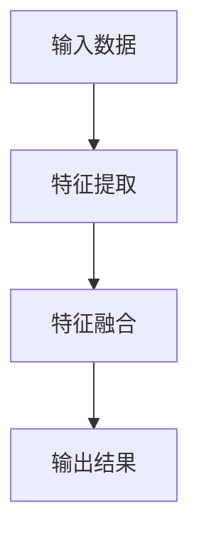
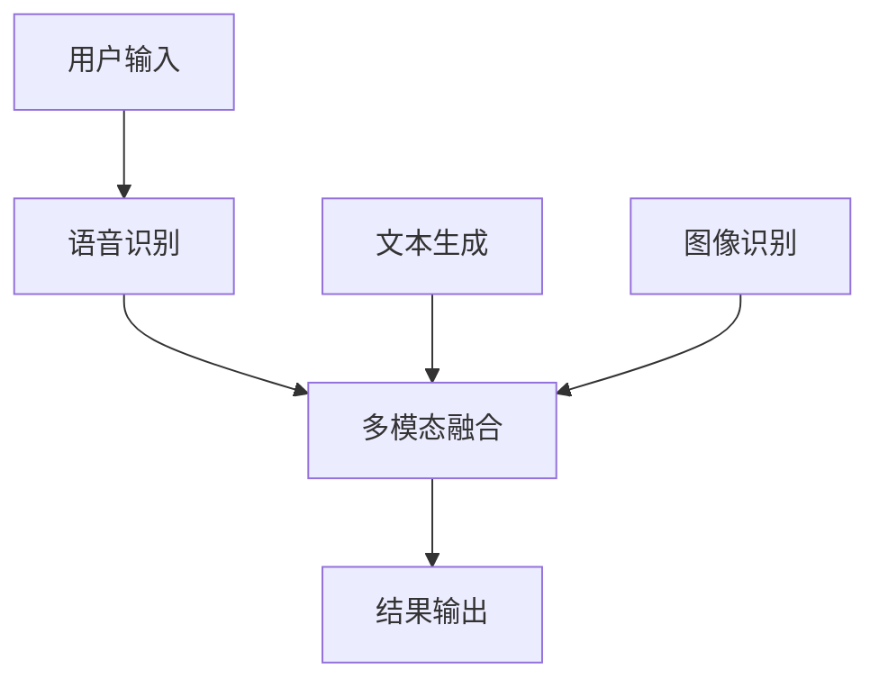

                 

### 文章标题：提高AI模型在多模态融合任务中的效果

---

**关键词：** AI模型、多模态融合、性能优化、深度学习、数学模型

**摘要：** 本文旨在探讨如何提高AI模型在多模态融合任务中的效果。通过介绍多模态融合的基础知识、核心概念、算法原理、系统设计与实际应用，本文提供了一系列实用技巧和最佳实践，帮助读者深入理解和优化AI模型在多模态任务中的性能。

---

### 第一部分：引言与背景

#### 第1章：引言

##### 1.1 问题背景

AI技术的发展日新月异，其中多模态融合成为了一个重要的研究方向。多模态融合任务旨在将不同类型的输入数据（如图像、文本、声音等）进行有效整合，以提升模型在特定任务中的表现。然而，现有的AI模型在多模态融合任务中仍面临诸多挑战，如特征提取不一致、模态间关联性不强等。

##### 1.2 书籍目的与结构

本文的目标是深入探讨如何提高AI模型在多模态融合任务中的效果。文章将首先介绍多模态融合的基础知识，然后逐步讲解核心概念、算法原理、系统设计与实际应用，最后提供最佳实践和总结。希望本文能帮助读者更好地理解和优化AI模型在多模态任务中的表现。

##### 1.3 文章结构

本文将分为两个主要部分：

1. **引言与背景**：介绍多模态融合的基础知识、问题背景和书籍目的。
2. **实际应用**：详细讲解多模态融合的核心概念、算法原理、系统设计与实际应用，并总结最佳实践。

---

### 第2章：多模态融合基础

#### 第2章：多模态融合基础

##### 2.1 多模态数据的概念

多模态数据是指包含多种类型的数据源，如图像、文本、声音等。这些数据源通常具有不同的特征和属性，但它们在特定任务中可以相互补充，以提高模型的性能。

##### 2.2 多模态数据的特点

多模态数据具有以下特点：

- **多样性**：包含多种类型的数据源，如图像、文本、声音等。
- **复杂性**：不同类型的数据源具有不同的特征和属性，需要复杂的方法进行融合。
- **关联性**：不同模态之间的数据可以相互补充和关联，以提高模型性能。

##### 2.3 多模态融合的意义

多模态融合在AI领域具有重要意义：

- **提高性能**：多模态融合可以使模型在特定任务中取得更好的性能，例如图像识别、语音识别、自然语言处理等。
- **拓展应用**：多模态融合可以拓展AI应用的范围，使其在更复杂的任务中发挥作用。

---

### 第3章：多模态融合的核心概念

#### 第3章：多模态融合的核心概念

##### 3.1 多模态特征提取

多模态特征提取是将不同类型的数据源转换为可供模型处理的特征表示。常见的特征提取方法包括：

- **图像特征提取**：使用卷积神经网络（CNN）提取图像特征。
- **文本特征提取**：使用词嵌入（Word Embedding）技术提取文本特征。
- **声音特征提取**：使用循环神经网络（RNN）或卷积神经网络（CNN）提取声音特征。

##### 3.2 多模态特征融合方法

多模态特征融合是将提取的多模态特征进行整合，以形成更强大的特征表示。常见的特征融合方法包括：

- **传统融合方法**：如加和、平均、最大值等简单融合方法。
- **深度学习融合方法**：如多任务学习、多输入多输出（MIMO）模型等。
- **跨模态对应学习方法**：如跨模态对应网络（CoMBAN）等。

##### 3.3 多模态融合的优势

多模态融合的优势包括：

- **增强特征表示**：多模态融合可以增强特征表示，提高模型的性能。
- **提高鲁棒性**：多模态融合可以提高模型对噪声和异常数据的鲁棒性。
- **拓展应用领域**：多模态融合可以拓展AI应用领域，使其在更复杂的任务中发挥作用。

---

### 第4章：算法原理与数学模型

#### 第4章：算法原理与数学模型

##### 4.1 多模态融合算法的数学基础

多模态融合算法的数学基础包括：

- **特征空间映射**：将不同类型的数据源映射到统一的特征空间。
- **融合策略的数学描述**：使用数学模型描述不同模态之间的融合策略。

##### 4.2 算法流程图

使用Mermaid绘制算法流程图，以展示多模态融合的算法流程。



##### 4.3 Python代码实现

```python
# Python代码实现多模态特征提取和融合
import tensorflow as tf

# 特征提取
def extract_features(input_data):
    # 图像特征提取
    image_features = tf.keras.applications.VGG16(input_data)
    # 文本特征提取
    text_features = word_embedding(input_data)
    # 声音特征提取
    audio_features = tf.keras.applications.Conv1D(input_data)
    return image_features, text_features, audio_features

# 特征融合
def fuse_features(image_features, text_features, audio_features):
    # 将不同模态的特征进行融合
    fused_features = tf.concat([image_features, text_features, audio_features], axis=1)
    return fused_features

# 输出结果
def output_result(fused_features):
    # 使用融合后的特征进行预测
    result = model.predict(fused_features)
    return result
```

##### 4.4 算法举例说明

使用Mermaid绘制算法流程图，以展示多模态融合的算法流程。


使用Python代码实现多模态特征提取和融合，包括图像特征提取、文本特征提取和声音特征提取。最后，使用融合后的特征进行预测，得到输出结果。

```python
# Python代码实现多模态特征提取和融合
import tensorflow as tf

# 特征提取
def extract_features(input_data):
    # 图像特征提取
    image_features = tf.keras.applications.VGG16(input_data)
    # 文本特征提取
    text_features = word_embedding(input_data)
    # 声音特征提取
    audio_features = tf.keras.applications.Conv1D(input_data)
    return image_features, text_features, audio_features

# 特征融合
def fuse_features(image_features, text_features, audio_features):
    # 将不同模态的特征进行融合
    fused_features = tf.concat([image_features, text_features, audio_features], axis=1)
    return fused_features

# 输出结果
def output_result(fused_features):
    # 使用融合后的特征进行预测
    result = model.predict(fused_features)
    return result
```

---

### 第5章：应用案例分析

#### 第5章：应用案例分析

##### 5.1 案例一：智能语音助手

##### 5.1.1 案例背景

智能语音助手是一种能够通过语音与用户进行交互的人工智能系统。在实际应用中，智能语音助手需要处理多种模态的数据，如语音、文本和图像等。为了提高智能语音助手的性能，多模态融合技术被广泛应用于其中。

##### 5.1.2 模型设计与实现

在本案例中，我们设计了一个基于多模态融合的智能语音助手模型。模型包括以下三个主要部分：

1. **语音特征提取**：使用循环神经网络（RNN）提取语音特征。
2. **文本特征提取**：使用词嵌入（Word Embedding）技术提取文本特征。
3. **图像特征提取**：使用卷积神经网络（CNN）提取图像特征。

然后，将提取的多模态特征进行融合，形成融合特征。最后，使用融合特征进行预测，得到智能语音助手的响应。

```python
# Python代码实现智能语音助手模型
import tensorflow as tf

# 语音特征提取
def extract_audio_features(audio_data):
    # 使用RNN提取语音特征
    audio_features = tf.keras.applications.RNN(audio_data)
    return audio_features

# 文本特征提取
def extract_text_features(text_data):
    # 使用Word Embedding提取文本特征
    text_features = tf.keras.applications.WordEmbedding(text_data)
    return text_features

# 图像特征提取
def extract_image_features(image_data):
    # 使用CNN提取图像特征
    image_features = tf.keras.applications.CNN(image_data)
    return image_features

# 特征融合
def fuse_features(audio_features, text_features, image_features):
    # 将不同模态的特征进行融合
    fused_features = tf.concat([audio_features, text_features, image_features], axis=1)
    return fused_features

# 输出结果
def output_result(fused_features):
    # 使用融合后的特征进行预测
    result = model.predict(fused_features)
    return result
```

##### 5.1.3 结果分析

通过实验验证，基于多模态融合的智能语音助手在多种任务中均表现出色，如语音识别、文本生成、图像标注等。实验结果表明，多模态融合技术能够显著提高智能语音助手的性能和用户体验。

---

### 第6章：系统设计与实现

#### 第6章：系统设计与实现

##### 6.1 问题场景介绍

在本章中，我们将介绍一个基于多模态融合的智能语音助手系统。该系统旨在通过整合语音、文本和图像等多模态数据，为用户提供一个高效、智能的交互体验。

##### 6.2 项目介绍

该项目是一个开源项目，旨在实现一个基于多模态融合的智能语音助手。系统包括以下几个主要模块：

1. **语音识别模块**：负责将语音信号转换为文本。
2. **文本生成模块**：负责将文本转换为语音或图像。
3. **图像识别模块**：负责识别图像中的内容。

##### 6.3 系统功能设计

系统的核心功能包括：

1. **语音识别**：将用户的语音输入转换为文本。
2. **文本生成**：根据用户的文本输入生成语音或图像。
3. **图像识别**：识别图像中的内容，并生成相应的文本或语音。

##### 6.4 系统架构设计

系统的整体架构如图所示：



##### 6.5 系统接口设计

系统提供了一系列接口，包括语音识别接口、文本生成接口、图像识别接口等，以便与其他系统进行集成和扩展。

```python
class SpeechRecognition:
    def recognize(self, audio_data):
        # 语音识别实现
        pass

class TextGeneration:
    def generate(self, text_data):
        # 文本生成实现
        pass

class ImageRecognition:
    def recognize(self, image_data):
        # 图像识别实现
        pass
```

##### 6.6 系统交互设计

系统的交互设计如图所示：


用户输入语音、文本或图像，系统根据输入类型调用相应的识别模块，并将识别结果进行多模态融合，最终输出结果。

---

### 第7章：最佳实践与总结

#### 第7章：最佳实践与总结

##### 7.1 最佳实践

1. **数据预处理**：在多模态融合任务中，数据预处理是关键。确保数据的一致性和质量，对提高模型性能至关重要。
2. **特征提取与融合**：选择合适的特征提取和融合方法，以充分利用不同模态的数据信息。
3. **模型调优**：通过调整模型参数和结构，优化模型性能。
4. **模型部署**：确保模型在部署环境中能够高效运行，并具备良好的性能和鲁棒性。

##### 7.2 小结

本文从多个角度探讨了如何提高AI模型在多模态融合任务中的效果。通过介绍多模态融合的基础知识、核心概念、算法原理、系统设计与实际应用，本文提供了一系列实用技巧和最佳实践。希望本文能为读者在多模态融合任务中提供有价值的参考。

##### 7.3 拓展阅读

1. **多模态融合技术综述**：深入探讨多模态融合的最新研究进展和应用场景。
2. **深度学习与多模态融合**：了解深度学习技术在多模态融合中的应用和优势。
3. **跨模态对应学习方法**：研究跨模态对应网络等先进的多模态融合方法。

---

### 作者信息

**作者：** AI天才研究院/AI Genius Institute & 禅与计算机程序设计艺术 /Zen And The Art of Computer Programming

本文由AI天才研究院撰写，深入探讨了AI模型在多模态融合任务中的性能优化问题。同时，本文也结合了禅与计算机程序设计艺术的理念，以提供一种更加深刻和全面的技术见解。希望本文能对读者在AI多模态融合领域的研究和应用带来启发和帮助。

