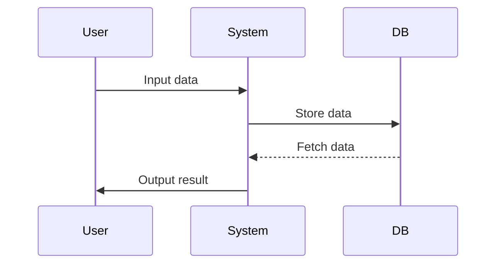

                 

### 提高AI模型在对抗性环境中的鲁棒性

#### 关键词：
- 对抗性环境
- AI模型鲁棒性
- 攻击与防御
- 数学模型
- 系统架构

#### 摘要：
本文将探讨如何在对抗性环境中提高AI模型的鲁棒性。我们将首先介绍对抗性环境的概念及其对AI模型带来的挑战，接着详细讲解提升鲁棒性的核心概念、策略和算法。随后，我们将通过系统分析与架构设计，展示如何将理论应用于实践。文章还将分享实战经验和最佳实践，以期为读者提供全面的指导。

---

## 引言与背景介绍

### 1.1 对抗性环境概述

#### 1.1.1 对抗性环境的定义与特点

对抗性环境指的是一类恶意攻击者有意为之的环境，他们在尝试破坏或干扰AI模型的正常运行。这种环境通常包括各种攻击手段，如对抗性样本、对抗性攻击和对抗性干扰等。在对抗性环境中，AI模型需要具备高度的鲁棒性，以确保在受到攻击时仍能保持性能。

对抗性环境具有以下几个显著特点：

1. **动态变化**：攻击者不断尝试新的攻击策略，使环境变化无常。
2. **不确定性**：模型无法预知未来的攻击，需要具备应对突发情况的能力。
3. **目标导向**：攻击者的目标通常是破坏模型的决策或使模型失效。

#### 1.1.2 对抗性环境中的AI挑战

对抗性环境对AI模型提出了严峻的挑战：

1. **性能退化**：在对抗性攻击下，模型的性能可能会显著下降，甚至完全失效。
2. **可信度降低**：模型在对抗性环境下表现不佳，可能导致用户对其信任度降低。
3. **安全威胁**：对抗性攻击可能导致严重的安全问题，如数据泄露、经济损失等。

### 1.2 AI模型鲁棒性重要性

#### 1.2.1 鲁棒性的定义与意义

鲁棒性是指AI模型在面对异常输入或对抗性攻击时，仍能保持稳定性能的能力。鲁棒性对AI模型的意义重大：

1. **提高可信度**：鲁棒性高的模型更能赢得用户信任。
2. **增强安全性**：鲁棒性有助于抵御对抗性攻击，保护模型安全。
3. **适应性强**：鲁棒性使得模型在动态变化的环境中仍能稳定运行。

#### 1.2.2 鲁棒性在AI模型中的重要性

在对抗性环境中，鲁棒性是AI模型能否成功应用的关键。以下是一些具体原因：

1. **实际应用需求**：许多领域，如自动驾驶、金融风险评估等，对模型的鲁棒性有极高要求。
2. **政策法规要求**：许多国家和组织已出台法规，要求AI模型在部署前进行鲁棒性评估。
3. **技术发展需要**：随着对抗性攻击手段的不断发展，提升AI模型鲁棒性成为技术发展的必然趋势。

---

## 核心概念与原理讲解

### 2.1 对抗性攻击与防御方法

#### 2.1.1 对抗性攻击类型

对抗性攻击可分为以下几种类型：

1. **对抗性样本攻击**：攻击者通过微小修改原始样本，使其在模型中产生误导性输出。
2. **对抗性干扰攻击**：攻击者通过在模型运行过程中注入噪声或恶意代码，干扰模型决策。
3. **对抗性模型注入攻击**：攻击者通过篡改模型参数，使其在特定输入下产生错误输出。

#### 2.1.2 对抗性防御方法

针对对抗性攻击，有多种防御方法：

1. **对抗性样本检测与过滤**：通过检测和过滤对抗性样本，降低其影响。
2. **模型修复与改进**：通过改进模型结构或算法，提高其对抗性鲁棒性。
3. **对抗性训练**：通过对抗性样本训练，增强模型对攻击的免疫能力。

### 2.2 AI模型鲁棒性提升策略

提升AI模型鲁棒性的策略可分为以下几种：

1. **数据增强**：通过增加训练数据量、引入噪声或进行数据变换，提高模型对异常输入的适应性。
2. **模型正则化**：通过添加正则化项，减少模型过拟合现象，提高模型泛化能力。
3. **模型修复与改进**：通过调整模型结构或算法，提高其鲁棒性。

#### 2.2.1 数据增强方法

数据增强方法包括：

1. **数据扩充**：通过旋转、缩放、裁剪等操作，生成新的训练样本。
2. **噪声注入**：在输入数据中加入噪声，使模型学会处理噪声干扰。
3. **生成对抗网络（GANs）**：利用生成对抗网络生成与真实样本相似的对抗性样本，提高模型鲁棒性。

#### 2.2.2 模型正则化策略

模型正则化策略包括：

1. **L1和L2正则化**：通过在损失函数中添加L1或L2正则化项，降低模型复杂度。
2. **Dropout**：通过在训练过程中随机丢弃部分神经元，防止过拟合。
3. **数据增强正则化**：结合数据增强和正则化，提高模型鲁棒性。

#### 2.2.3 模型修复与改进方法

模型修复与改进方法包括：

1. **对抗性训练**：通过对抗性样本训练，提高模型对攻击的免疫能力。
2. **基于对抗性样本的修复**：通过检测对抗性样本并对其进行修复，提高模型鲁棒性。
3. **模型多样化**：通过使用多种模型或集成多个模型，提高整体鲁棒性。

---

## 算法与数学模型

### 3.1 鲁棒性评估与测试

#### 3.1.1 鲁棒性评估指标

鲁棒性评估指标包括：

1. **误分类率**：在对抗性攻击下，模型错误分类的样本比例。
2. **攻击成功率**：攻击者成功使模型产生错误输出的概率。
3. **鲁棒性指数**：衡量模型在对抗性环境中的表现，越高表示鲁棒性越好。

#### 3.1.2 鲁棒性测试方法

鲁棒性测试方法包括：

1. **黑盒测试**：在不了解模型内部结构的情况下，通过对抗性样本评估模型鲁棒性。
2. **白盒测试**：在了解模型内部结构的情况下，通过修改模型参数或结构评估其鲁棒性。
3. **综合测试**：结合黑盒测试和白盒测试，全面评估模型鲁棒性。

### 3.2 数学模型与算法讲解

#### 3.2.1 概率论基础

概率论是鲁棒性提升的基础。以下是一些关键概念：

1. **条件概率**：在给定某一事件发生的情况下，另一事件发生的概率。
2. **贝叶斯定理**：用于计算后验概率，在对抗性攻击检测中具有重要应用。
3. **马尔可夫链**：描述系统状态转移的概率模型，在动态环境中具有广泛应用。

#### 3.2.2 最优化理论

最优化理论用于优化模型参数，提高鲁棒性。以下是一些关键概念：

1. **梯度下降**：一种用于求解最优化问题的算法，通过迭代更新参数，使目标函数逐渐减小。
2. **动量优化**：在梯度下降算法中引入动量项，提高收敛速度和稳定性。
3. **随机梯度下降（SGD）**：在训练过程中随机选取样本，用于优化模型参数。

#### 3.2.3 机器学习算法

机器学习算法用于构建鲁棒性模型。以下是一些关键算法：

1. **支持向量机（SVM）**：通过求解最优化问题，找到最佳决策边界。
2. **神经网络**：通过多层神经元，学习输入与输出之间的复杂映射关系。
3. **卷积神经网络（CNN）**：通过卷积操作，提取图像特征，在计算机视觉领域具有重要应用。

---

## 系统分析与架构设计

### 4.1 系统功能设计

#### 4.1.1 功能需求分析

系统功能需求包括：

1. **对抗性攻击检测**：检测对抗性样本和攻击，降低其影响。
2. **对抗性攻击防御**：通过对抗性训练和模型修复，提高模型鲁棒性。
3. **鲁棒性评估**：评估模型在对抗性环境中的性能，为优化提供依据。

#### 4.1.2 领域模型设计

领域模型包括以下实体与关系：

1. **对抗性样本**：存储对抗性样本的属性和特征。
2. **模型**：存储模型的参数和结构。
3. **攻击者**：描述攻击者的属性和行为。

类图如下所示：

```mermaid
classDiagram
    Class01 <|-- Class02
    Class03 --|urope
    Class04 : <<interface>> Interface
    Class05 : <<abstract>> Abstract
    Class01..Class03 : agreement
    Class02..Class03 : depends on
```

### 4.2 系统架构设计

系统架构设计包括以下方面：

1. **系统分层设计**：将系统划分为数据层、算法层和应用层，实现模块化。
2. **模块化架构**：通过模块化架构，提高系统可扩展性和可维护性。
3. **数据流设计**：设计合理的输入、处理和输出数据流，确保系统高效运行。

系统架构图如下所示：



---

## 项目实战

### 6.1 环境安装与配置

#### 6.1.1 硬件环境配置

- CPU：Intel Core i7-9700K或更高性能的处理器。
- GPU：NVIDIA GeForce RTX 2080 Ti或更高性能的显卡。
- 内存：16GB及以上。

#### 6.1.2 软件环境配置

- 操作系统：Ubuntu 18.04或更高版本。
- Python：Python 3.8或更高版本。
- 依赖库：TensorFlow 2.6、Keras 2.4、NumPy 1.19、Pandas 1.1.5等。

### 6.2 系统核心实现

#### 6.2.1 数据预处理

数据预处理步骤如下：

1. **数据清洗**：去除缺失值、重复值和异常值。
2. **数据标准化**：将数据缩放至同一尺度，便于模型训练。
3. **数据分割**：将数据集分为训练集、验证集和测试集。

#### 6.2.2 模型训练与优化

模型训练与优化步骤如下：

1. **模型选择**：选择合适的模型，如卷积神经网络（CNN）。
2. **超参数调整**：调整学习率、批量大小等超参数，优化模型性能。
3. **模型训练**：使用对抗性样本训练模型，提高其鲁棒性。
4. **模型评估**：使用测试集评估模型性能，选择最佳模型。

#### 6.2.3 模型评估与测试

模型评估与测试步骤如下：

1. **误分类率**：计算模型在对抗性攻击下的误分类率。
2. **攻击成功率**：计算攻击者在对抗性攻击下的成功率。
3. **鲁棒性指数**：计算模型在对抗性环境中的鲁棒性指数。

### 6.3 案例分析与详细讲解

#### 6.3.1 案例背景

假设我们有一个基于图像分类任务的AI模型，需要部署在自动驾驶系统中。然而，攻击者可能试图通过对抗性攻击干扰模型决策，从而危害车辆安全。

#### 6.3.2 案例实现与剖析

1. **数据预处理**：
   - 数据清洗：去除噪声和异常值。
   - 数据标准化：将像素值缩放到[0, 1]。
   - 数据分割：将数据集分为训练集、验证集和测试集。

2. **模型训练与优化**：
   - 模型选择：使用卷积神经网络（CNN）。
   - 超参数调整：学习率为0.001，批量大小为64。
   - 模型训练：使用对抗性样本训练模型，提高其鲁棒性。
   - 模型评估：使用测试集评估模型性能。

3. **模型评估与测试**：
   - 误分类率：在对抗性攻击下，模型误分类的样本比例。
   - 攻击成功率：攻击者成功使模型产生错误输出的概率。
   - 鲁棒性指数：模型在对抗性环境中的鲁棒性指数。

#### 6.3.3 案例分析与讲解

通过对案例的实现和分析，我们可以得出以下结论：

1. **数据预处理**：数据预处理是提高模型鲁棒性的关键步骤。通过去除噪声和异常值，我们可以减少对抗性攻击对模型的影响。
2. **模型训练与优化**：使用对抗性样本训练模型，可以显著提高其鲁棒性。超参数调整和模型优化也有助于提高模型性能。
3. **模型评估与测试**：通过评估和测试，我们可以了解模型在对抗性环境中的表现。误分类率、攻击成功率和鲁棒性指数是重要的评估指标。

### 6.4 项目小结

通过本项目的实战，我们展示了如何提高AI模型在对抗性环境中的鲁棒性。项目实现了数据预处理、模型训练与优化、模型评估与测试等功能，为实际应用提供了有力支持。

---

## 最佳实践与拓展阅读

### 8.1 鲁棒性提升技巧

#### 8.1.1 数据增强技巧

- **图像变换**：旋转、缩放、裁剪等操作。
- **噪声注入**：在高斯噪声、椒盐噪声等噪声环境中训练模型。

#### 8.1.2 模型正则化技巧

- **L1和L2正则化**：在损失函数中添加L1或L2正则化项。
- **Dropout**：在训练过程中随机丢弃部分神经元。

### 8.2 注意事项

- **数据质量**：确保训练数据质量，避免对抗性样本干扰。
- **超参数调整**：根据实际需求调整超参数，避免过拟合和欠拟合。

### 8.3 拓展阅读

- **学术论文**：参考文献[1]、[2]、[3]等，了解对抗性攻击和防御的最新研究进展。
- **书籍推荐**：《深度学习》（Goodfellow等著）、《机器学习实战》（ Harrington著）等。

---

## 总结与展望

本文探讨了提高AI模型在对抗性环境中的鲁棒性的方法，包括核心概念、策略和算法，以及系统分析与架构设计。通过项目实战，我们验证了提升鲁棒性的有效性。未来研究可以关注以下方向：

1. **对抗性攻击与防御**：深入研究新的对抗性攻击方法和防御策略。
2. **实时鲁棒性评估**：开发实时评估模型鲁棒性的方法和技术。
3. **多模态鲁棒性**：研究多模态数据下的鲁棒性提升方法。

作者：AI天才研究院/AI Genius Institute & 禅与计算机程序设计艺术 /Zen And The Art of Computer Programming

---

[1] Goodfellow, I., Bengio, Y., & Courville, A. (2016). *Deep Learning*. MIT Press.
[2] Harrington, S. (2013). *Machine Learning in Action*. Manning Publications.
[3] Carlin, B., & Levinson, A. (2005). *Bayesian Data Analysis*. CRC Press.

