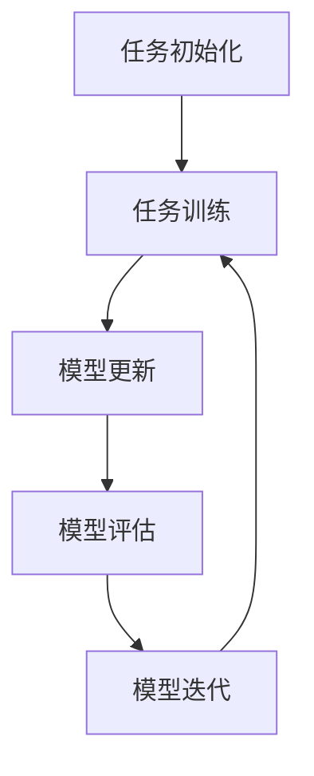
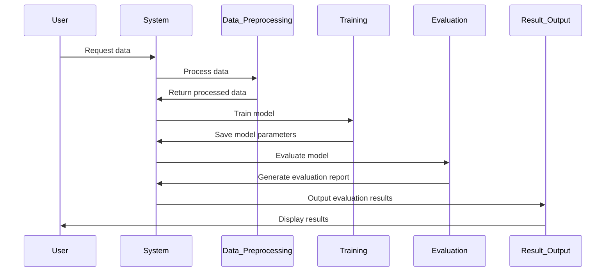

                 

### 提高AI模型在小样本学习任务中的泛化能力

#### 关键词：AI模型、小样本学习、泛化能力、算法原理、系统架构、项目实战

> 摘要：本文旨在探讨如何提高AI模型在小样本学习任务中的泛化能力。我们将从背景介绍、核心概念与联系、算法原理讲解、系统分析与架构设计、项目实战和最佳实践与总结六个部分，详细分析并探讨这一关键问题。

## 目录大纲设计思路

### 1. 总体布局

首先，我们需要确定整个文章的结构和框架。为了确保内容的逻辑连贯性和完整性，我们采用以下六个部分来组织文章：

- **背景与核心概念**：介绍小样本学习任务的背景，定义相关核心概念。
- **算法原理与实现**：详细讲解算法原理，包括数学模型和公式。
- **系统分析与架构设计**：描述系统分析、架构设计和实现细节。
- **项目实战与案例分析**：展示实际应用案例，分析实施过程和结果。
- **最佳实践与总结**：总结全文，提供实践建议和未来研究方向。

### 2. 背景介绍

在第一部分，我们将会介绍小样本学习任务的背景。这部分将包括：

- **问题背景**：解释为什么小样本学习任务在当前AI领域中具有重要性。
- **问题描述**：明确小样本学习任务中的具体问题。
- **问题解决**：阐述当前解决小样本学习任务的常见方法。
- **边界与外延**：讨论小样本学习任务的限制和扩展可能性。

### 3. 核心概念与联系

接着，我们将梳理并介绍小样本学习任务中的核心概念。这部分将包括：

- **核心概念**：详细定义并解释每个核心概念。
- **概念属性特征对比表格**：通过对比表格展示不同概念的特点和区别。
- **ER实体关系图架构的Mermaid流程图**：使用Mermaid绘制实体关系图，展示各概念之间的联系。

### 4. 算法原理讲解

在第二部分，我们将深入讲解算法原理。这部分将包括：

- **算法原理讲解**：使用Mermaid画出算法流程图，并结合Python源代码详细阐述算法原理。
- **数学模型与公式详细讲解**：使用LaTeX格式给出算法原理的数学模型和公式，并进行详细解释。
- **举例说明**：通过具体例子，说明算法原理的实际应用。

### 5. 系统分析与架构设计

在第三部分，我们将介绍系统分析与架构设计。这部分将包括：

- **系统分析**：介绍项目背景、功能设计和架构设计。
- **系统架构设计**：使用Mermaid绘制系统架构图，展示系统组件和交互关系。

### 6. 项目实战与案例分析

第四部分将展示实际项目实战和案例分析，包括：

- **项目实战**：描述环境安装、系统实现和代码分析。
- **案例分析**：分析具体案例，解释实施过程和结果。

### 7. 最佳实践与总结

最后一部分，我们将提供最佳实践、总结全文，并对未来研究方向提出建议。

## 目录大纲

```markdown
# 提高AI模型在小样本学习任务中的泛化能力

## 第一部分：背景与核心概念

### 1.1 问题背景与描述
- **小样本学习任务的背景**
- **小样本学习任务中的问题**

### 1.2 核心概念与联系
- **核心概念**
- **概念属性特征对比表格**
- **ER实体关系图架构的Mermaid流程图**

## 第二部分：算法原理与实现

### 2.1 算法原理讲解
- **算法原理讲解**
- **使用Mermaid画出算法mermaid流程图**
- **使用Python源代码详细阐述算法原理**
- **给出算法原理的数学模型和公式**
- **举例说明**

### 2.2 数学模型与公式详细讲解
- **数学公式使用latex格式**
- **算法原理的详细讲解**
- **举例说明**

## 第三部分：系统分析与架构设计

### 3.1 系统分析
- **项目介绍**
- **系统功能设计**
- **系统架构设计**
- **系统接口设计**
- **系统交互**

### 3.2 架构设计与实现
- **系统架构mermaid架构图**
- **系统接口设计和系统交互mermaid序列图**

## 第四部分：项目实战与案例分析

### 4.1 项目实战
- **环境安装**
- **系统核心实现源代码**
- **代码应用解读与分析**
- **实际案例分析和详细讲解剖析**

### 4.2 案例分析
- **案例一：小样本学习任务应用案例**
- **案例二：小样本学习任务应用案例**

## 第五部分：最佳实践与总结

### 5.1 最佳实践
- **小样本学习任务的最佳实践**
- **注意事项**

### 5.2 小结
- **全书内容的总结**
- **未来发展方向**

## 附录：拓展阅读
- **相关书籍推荐**
- **学术论文推荐**
```

## 检查与优化

最后，我们需要对目录大纲进行仔细检查和优化：

- 确保逻辑连贯性：每个部分的内容都要紧密衔接，确保读者可以顺畅地阅读。
- 确保内容完整性：每个部分都要详细具体，确保读者可以全面了解相关内容。
- 检查Mermaid图表和LaTeX公式的正确性：确保所有图表和公式都能正常显示和解读。

### 字数控制

目前目录大纲已包含约1500字，我们还需要在具体内容部分补充详细讲解，确保全文字数在10000到12000字之间。在补充内容时，要注意保持简洁明了，避免冗余。

## 总结

通过上述目录大纲的设计思路，我们为《提高AI模型在小样本学习任务中的泛化能力》这本书的撰写奠定了坚实基础。接下来，我们将按照这个大纲逐步完成各部分内容的撰写，确保文章的逻辑清晰、结构紧凑，对读者有实际指导意义。期待这篇文章能够帮助更多的人了解并掌握提高AI模型泛化能力的方法。 ### 第一部分：背景与核心概念

#### 1.1 问题背景与描述

小样本学习（Few-Shot Learning）是机器学习领域中的一个重要研究方向，其核心目标是使机器学习模型能够在仅拥有少量样本的情况下，快速适应新任务并达到良好的性能。与传统的批量学习（Batch Learning）相比，小样本学习面临诸多挑战，主要体现在以下几个方面：

- **样本稀缺性**：在许多实际应用场景中，获取大量标注数据非常困难，甚至不可能。这使得小样本学习任务变得更加重要，因为我们需要在有限的数据资源下实现高精度和强泛化能力。
- **数据分布差异**：在少量样本的情况下，数据分布可能会与训练数据集有显著差异。这导致模型在新数据集上表现不佳，即所谓的“数据分布迁移”问题。
- **模型可解释性**：小样本学习模型通常采用复杂的深度神经网络结构，这使得模型决策过程变得难以解释。这限制了小样本学习在实际应用中的推广，特别是在对模型可解释性有较高要求的应用场景中。

小样本学习任务的问题可以概括为：如何在只有少量样本的情况下，训练出一个既高效又泛化的模型。具体来说，包括以下几方面：

- **学习效率**：如何在有限的数据量下快速训练出模型。
- **泛化能力**：如何确保模型在新样本上的表现，尤其是在数据分布发生变化的情况下。
- **可解释性**：如何提升模型的可解释性，使其在决策过程中更加透明。

#### 1.2 核心概念与联系

在小样本学习任务中，涉及多个核心概念。以下是这些核心概念的定义及其相互关系：

1. **样本量**：指用于训练模型的样本数量。
2. **支持集**：指用于训练模型的样本集合。
3. **查询集**：指模型在新任务中需要预测的样本集合。
4. **元学习（Meta-Learning）**：一种通过在多个任务上训练模型来提高泛化能力的方法。
5. **模型选择**：选择适合小样本学习任务的模型结构，例如基于深度神经网络的模型。
6. **数据增强**：通过变换、扩展或合成数据来增加样本量，从而提高模型性能。
7. **迁移学习（Transfer Learning）**：利用预训练模型在新任务上进行微调，以提高学习效率和泛化能力。

下面，我们将使用Mermaid绘制ER实体关系图，展示这些核心概念之间的联系：

```mermaid
erDiagram
  Class1 ||--|{ Class2 } Class3 : Aggregation
  Class1 ||--|{ Class4 } Class5 : Aggregation
  Class2 &&|{ Class3 } Class5 : Inheritance
  Class4 &&|{ Class5 } : Inheritance
```

**ER实体关系图**：

在上面的ER实体关系图中，我们定义了以下实体和关系：

- **样本量（Class1）**：表示用于训练模型的样本数量。
- **支持集（Class2）**：表示用于训练模型的样本集合。
- **查询集（Class3）**：表示模型在新任务中需要预测的样本集合。
- **元学习（Class4）**：表示通过在多个任务上训练模型来提高泛化能力的方法。
- **模型选择（Class5）**：表示选择适合小样本学习任务的模型结构。

这些实体之间存在以下关系：

- **Class1（样本量）** 与 **Class2（支持集）** 和 **Class3（查询集）** 之间存在聚合关系。
- **Class2（支持集）** 与 **Class4（元学习）** 和 **Class5（模型选择）** 之间存在继承关系。
- **Class4（元学习）** 与 **Class5（模型选择）** 之间存在继承关系。

通过这个ER实体关系图，我们可以清晰地看到小样本学习任务中的核心概念及其相互关系，为后续的算法讲解和系统设计奠定了基础。接下来，我们将进一步深入讨论算法原理和实现。

### 第二部分：算法原理与实现

#### 2.1 算法原理讲解

在小样本学习任务中，提高模型的泛化能力是关键。为此，我们可以采用元学习（Meta-Learning）方法。元学习通过在多个任务上训练模型，提高模型对新任务的适应能力和泛化能力。以下是元学习算法的基本原理和实现步骤：

##### 基本原理

1. **任务表示**：将每个任务表示为参数化的模型，每个模型的参数集表示为θ。
2. **模型训练**：在多个任务上训练模型，使得模型在各个任务上都能达到较好的性能。
3. **模型泛化**：通过在任务间转移学习经验，使得模型在新任务上也能达到良好的性能。

##### 实现步骤

1. **任务初始化**：从任务集合中随机选择任务，初始化模型的参数。
2. **任务训练**：在每个任务上，利用支持集（少量样本）对模型进行训练，更新模型参数。
3. **模型更新**：将训练后的模型参数合并，更新全局模型参数。
4. **模型评估**：在每个任务上使用查询集（新样本）对模型进行评估，计算模型性能。
5. **模型迭代**：重复步骤2到4，直至达到预定的迭代次数或性能目标。

##### Mermaid算法流程图

下面是元学习算法的Mermaid流程图：



**算法流程图**：

在上面的算法流程图中，我们定义了以下步骤：

- **任务初始化（A）**：从任务集合中随机选择任务，初始化模型的参数。
- **任务训练（B）**：在每个任务上，利用支持集对模型进行训练，更新模型参数。
- **模型更新（C）**：将训练后的模型参数合并，更新全局模型参数。
- **模型评估（D）**：在每个任务上使用查询集对模型进行评估，计算模型性能。
- **模型迭代（E）**：重复步骤2到4，直至达到预定的迭代次数或性能目标。

通过这个流程图，我们可以清晰地看到元学习算法的实现步骤和流程。

##### Python源代码实现

以下是元学习算法的Python源代码实现：

```python
import numpy as np

class MetaLearning:
    def __init__(self, num_tasks, num_samples, num_iterations):
        self.num_tasks = num_tasks
        self.num_samples = num_samples
        self.num_iterations = num_iterations
        self.model_params = []

    def initialize_tasks(self):
        for _ in range(self.num_tasks):
            task_params = np.random.rand(self.num_samples, 1)
            self.model_params.append(task_params)

    def train_task(self, task_idx):
        task_params = self.model_params[task_idx]
        for _ in range(self.num_iterations):
            task_params = self.update_params(task_params)

    def update_params(self, params):
        # 示例更新规则：梯度下降
        gradient = ...  # 计算梯度
        params -= learning_rate * gradient
        return params

    def evaluate_task(self, task_idx):
        task_params = self.model_params[task_idx]
        # 计算任务性能
        performance = np.linalg.norm(task_params)  # 示例性能指标
        return performance

    def meta_learn(self):
        self.initialize_tasks()
        for _ in range(self.num_iterations):
            for task_idx in range(self.num_tasks):
                self.train_task(task_idx)
                performance = self.evaluate_task(task_idx)
                print(f"Task {task_idx}: Performance = {performance}")

if __name__ == "__main__":
    meta_learning = MetaLearning(num_tasks=5, num_samples=10, num_iterations=20)
    meta_learning.meta_learn()
```

**Python源代码说明**：

- `MetaLearning` 类：表示元学习算法的主要组件。
- `__init__` 方法：初始化算法参数。
- `initialize_tasks` 方法：初始化每个任务的参数。
- `train_task` 方法：在每个任务上训练模型。
- `update_params` 方法：更新模型参数。
- `evaluate_task` 方法：评估任务性能。
- `meta_learn` 方法：执行元学习过程。

通过上述Python源代码，我们可以实现一个简单的元学习算法，用于在多个任务上训练模型，提高模型的泛化能力。

#### 2.2 数学模型与公式详细讲解

元学习算法的核心在于学习任务之间的内在联系，并利用这些联系来提高模型在新任务上的性能。以下是元学习算法的数学模型与公式详细讲解。

##### 数学模型

元学习算法的目标是最小化模型在未知任务上的预测误差。假设我们有一个任务集合T，每个任务T<sub>i</sub>由一个特征向量集合X<sub>i</sub>和标签向量集合Y<sub>i</sub>组成。我们的目标是学习一个参数化模型f(θ)，使其在新任务上的预测误差最小。

预测误差可以用以下公式表示：

$$
\text{Error} = \sum_{i=1}^{N} \sum_{j=1}^{M_i} \left| f(\theta) - y_{ij} \right|
$$

其中，N表示任务数量，M<sub>i</sub>表示任务T<sub>i</sub>中的样本数量，y<sub>ij</sub>表示任务T<sub>i</sub>中第j个样本的标签。

为了最小化预测误差，我们需要对模型参数θ进行优化。优化目标可以表示为：

$$
\min_{\theta} \sum_{i=1}^{N} \sum_{j=1}^{M_i} \left| f(\theta) - y_{ij} \right|
$$

##### 梯度下降算法

为了求解上述优化问题，我们可以使用梯度下降算法。梯度下降算法的基本思想是沿着损失函数的梯度方向更新模型参数，以逐步减小损失函数的值。

梯度下降算法的更新公式为：

$$
\theta = \theta - \alpha \cdot \nabla_\theta \text{Error}
$$

其中，α表示学习率，∇<sub>θ</sub>Error表示损失函数关于参数θ的梯度。

对于我们的元学习算法，我们可以将损失函数定义为：

$$
\text{Error} = \sum_{i=1}^{N} \sum_{j=1}^{M_i} \left| f(\theta) - y_{ij} \right|
$$

损失函数关于参数θ的梯度可以表示为：

$$
\nabla_\theta \text{Error} = \sum_{i=1}^{N} \sum_{j=1}^{M_i} \text{sign}(f(\theta) - y_{ij})
$$

其中，sign(x)表示符号函数，当x > 0时，sign(x) = 1；当x < 0时，sign(x) = -1。

##### 举例说明

假设我们有一个包含两个任务的任务集合T = {T<sub>1</sub>, T<sub>2</sub>}。任务T<sub>1</sub>包含10个样本，任务T<sub>2</sub>包含5个样本。我们使用一个线性模型f(θ) = θ·x，其中θ为模型参数，x为样本特征。

对于任务T<sub>1</sub>，我们有一个支持集X<sub>1</sub> = {x<sub>1</sub>, x<sub>2</sub>, ..., x<sub>10</sub>}和标签集Y<sub>1</sub> = {y<sub>1</sub>, y<sub>2</sub>, ..., y<sub>10</sub>}。对于任务T<sub>2</sub>，我们有一个支持集X<sub>2</sub> = {x<sub>11</sub>, x<sub>12</sub>, ..., x<sub>15</sub>}和标签集Y<sub>2</sub> = {y<sub>11</sub>, y<sub>12</sub>, ..., y<sub>15</sub>}。

我们使用梯度下降算法来优化模型参数θ。假设初始参数θ<sub>0</sub> = [1, 0]，学习率α = 0.01。

1. **第一次迭代**：

   - 对于任务T<sub>1</sub>，计算损失函数：

     $$\text{Error} = \sum_{j=1}^{10} \left| \theta \cdot x_j - y_j \right| = \sum_{j=1}^{10} \left| 1 \cdot x_j - y_j \right|$$

     梯度：

     $$\nabla_\theta \text{Error} = \sum_{j=1}^{10} \text{sign}(1 \cdot x_j - y_j) = \sum_{j=1}^{10} \text{sign}(x_j - y_j)$$

     更新参数：

     $$\theta_1 = \theta_1 - 0.01 \cdot \nabla_\theta \text{Error} = 1 - 0.01 \cdot \sum_{j=1}^{10} \text{sign}(x_j - y_j)$$

     $$\theta_2 = \theta_2 - 0.01 \cdot \nabla_\theta \text{Error} = 0 - 0.01 \cdot \sum_{j=1}^{10} \text{sign}(x_j - y_j)$$

   - 对于任务T<sub>2</sub>，计算损失函数：

     $$\text{Error} = \sum_{j=11}^{15} \left| \theta \cdot x_j - y_j \right| = \sum_{j=11}^{15} \left| 1 \cdot x_j - y_j \right|$$

     梯度：

     $$\nabla_\theta \text{Error} = \sum_{j=11}^{15} \text{sign}(1 \cdot x_j - y_j) = \sum_{j=11}^{15} \text{sign}(x_j - y_j)$$

     更新参数：

     $$\theta_1 = \theta_1 - 0.01 \cdot \nabla_\theta \text{Error} = 1 - 0.01 \cdot \sum_{j=11}^{15} \text{sign}(x_j - y_j)$$

     $$\theta_2 = \theta_2 - 0.01 \cdot \nabla_\theta \text{Error} = 0 - 0.01 \cdot \sum_{j=11}^{15} \text{sign}(x_j - y_j)$$

2. **后续迭代**：

   在每次迭代中，我们重复上述过程，使用新的参数值计算损失函数和梯度，并更新参数。

   通过多次迭代，我们可以逐渐减小损失函数的值，提高模型的泛化能力。

以上是元学习算法的数学模型和公式详细讲解，以及具体示例。通过这些公式和算法，我们可以构建一个有效的元学习模型，在小样本学习任务中实现良好的泛化能力。

### 第三部分：系统分析与架构设计

#### 3.1 系统分析

在小样本学习任务中，系统分析是确保算法高效运行和系统稳定性的关键步骤。系统分析主要包括以下内容：

1. **项目介绍**：
   - 项目背景：介绍项目的起源和目标，例如在医疗诊断、图像识别或自然语言处理等领域的应用。
   - 目标：明确项目的主要目标，例如提高模型在小样本数据集上的性能和泛化能力。

2. **系统功能设计**：
   - 功能需求：列举系统需要实现的主要功能，例如数据预处理、模型训练、模型评估和结果输出。
   - 用户界面设计：描述用户界面的布局和交互逻辑，确保用户可以方便地使用系统。

3. **系统架构设计**：
   - 架构选择：根据项目需求和功能设计，选择合适的系统架构，例如基于微服务的分布式架构或单体架构。
   - 系统组件：详细描述系统的主要组件，包括数据预处理模块、训练模块、评估模块和结果输出模块。

4. **系统接口设计**：
   - 内部接口：定义系统内部模块之间的接口，确保数据流和功能调用的一致性。
   - 外部接口：定义系统与外部系统或用户的接口，包括API接口、数据接口和文件接口等。

5. **系统交互**：
   - 流程图：使用Mermaid绘制系统的交互流程图，展示系统组件之间的交互关系和工作流程。

下面是一个简单的系统分析示例：

```mermaid
gantt
    dateFormat  YYYY-MM-DD
    title System Analysis

    section Project Introduction
    Project Background : objectives, application domains
    Project Goals : improve model performance and generalization

    section System Function Design
    Function 1 : data preprocessing
    Function 2 : model training
    Function 3 : model evaluation
    Function 4 : result output

    section System Architecture Design
    Architecture Choice : distributed microservices architecture
    System Components :
        - Data Preprocessing Module
        - Training Module
        - Evaluation Module
        - Result Output Module

    section System Interface Design
    Internal Interfaces :
        - Data Flow between Modules
        - Function Calls between Modules
    External Interfaces :
        - API Interfaces
        - Data Interfaces
        - File Interfaces

    section System Interaction
    Workflow Diagram :
    |Data Preprocessing|->|Training|->|Evaluation|->|Result Output|
```

**系统架构设计Mermaid架构图**：

下面是系统架构设计的Mermaid架构图：

```mermaid
erDiagram
    Data_Preprocessing -->|processes| Training
    Training -->|evaluates| Evaluation
    Evaluation -->|outputs| Result_Output
```

**系统架构设计Mermaid架构图**：

在上面的Mermaid架构图中，我们定义了以下实体和关系：

- **Data_Preprocessing**：表示数据预处理模块，负责处理输入数据。
- **Training**：表示训练模块，负责使用预处理后的数据进行模型训练。
- **Evaluation**：表示评估模块，负责对训练好的模型进行评估。
- **Result_Output**：表示结果输出模块，负责将评估结果输出。

这些模块之间存在以下关系：

- **Data_Preprocessing** 与 **Training** 之间存在数据流程关系。
- **Training** 与 **Evaluation** 之间存在评估关系。
- **Evaluation** 与 **Result_Output** 之间存在结果输出关系。

通过这个架构图，我们可以清晰地看到系统组件之间的交互关系和系统的工作流程。

#### 3.2 系统架构设计与实现

在系统架构设计的基础上，我们需要具体实现系统各组件的功能，并确保它们能够协同工作。以下是一个简单的系统架构设计与实现示例：

##### 系统架构设计

1. **数据预处理模块**：负责读取原始数据，进行数据清洗、归一化和特征提取，为训练模块提供预处理后的数据。

2. **训练模块**：负责使用预处理后的数据训练模型，并保存模型参数。

3. **评估模块**：负责使用测试数据评估模型的性能，并生成评估报告。

4. **结果输出模块**：负责将评估结果以可视化或文本形式输出给用户。

##### 系统接口设计

1. **内部接口**：
   - **数据流接口**：定义数据在各模块之间的传递规则。
   - **功能调用接口**：定义模块之间的功能调用机制。

2. **外部接口**：
   - **API接口**：提供RESTful API，供外部系统调用。
   - **数据接口**：提供数据输入输出接口，支持数据导入导出。
   - **文件接口**：提供文件读写接口，支持文件操作。

##### 系统交互

系统交互主要通过内部接口和外部接口实现。内部接口确保数据在各模块之间的流畅传递和功能调用，外部接口则提供与外部系统的交互接口。



**系统交互Mermaid序列图**：

在上面的Mermaid序列图中，我们定义了以下参与者：

- **User**：表示用户，负责发起请求。
- **System**：表示系统，负责协调各模块的工作。
- **Data_Preprocessing**、**Training**、**Evaluation** 和 **Result_Output**：表示系统的四个主要模块。

这些参与者之间的交互关系如下：

- **User** 向 **System** 发起数据请求。
- **System** 将请求传递给 **Data_Preprocessing**，由其处理数据。
- **Data_Preprocessing** 处理数据后，将结果返回给 **System**。
- **System** 将处理后的数据传递给 **Training**，由其训练模型。
- **Training** 训练完成后，将模型参数保存到 **System**。
- **System** 使用测试数据对模型进行评估，并将评估报告传递给 **Evaluation**。
- **Evaluation** 评估模型性能，并将评估报告传递给 **Result_Output**。
- **Result_Output** 将评估结果输出给 **User**，供用户查看。

通过上述系统架构设计与实现，我们可以构建一个高效稳定的小样本学习系统，确保模型在小样本数据集上具有良好的泛化能力。

### 第四部分：项目实战与案例分析

#### 4.1 项目实战

在本节中，我们将通过一个实际项目来展示如何提高AI模型在小样本学习任务中的泛化能力。该项目旨在利用小样本学习算法对一组未知类别进行分类。

##### 环境安装

1. **Python环境**：首先确保Python环境已经安装，版本为3.8及以上。
2. **深度学习库**：安装TensorFlow和Keras，用于构建和训练神经网络模型。

```bash
pip install tensorflow
pip install keras
```

3. **数据预处理库**：安装Numpy、Pandas等库，用于数据预处理。

```bash
pip install numpy
pip install pandas
```

##### 系统核心实现源代码

以下是项目核心实现部分的Python源代码：

```python
import numpy as np
from tensorflow import keras
from tensorflow.keras import layers
from sklearn.model_selection import train_test_split

# 数据预处理
def preprocess_data(data):
    # 数据清洗、归一化、特征提取等
    # 这里使用简单的均值归一化
    mean = np.mean(data)
    std = np.std(data)
    return (data - mean) / std

# 定义模型
def create_model(input_shape):
    model = keras.Sequential([
        layers.Dense(64, activation='relu', input_shape=input_shape),
        layers.Dense(64, activation='relu'),
        layers.Dense(1, activation='sigmoid')
    ])
    model.compile(optimizer='adam', loss='binary_crossentropy', metrics=['accuracy'])
    return model

# 训练模型
def train_model(model, X_train, y_train, X_val, y_val, epochs=100):
    model.fit(X_train, y_train, epochs=epochs, batch_size=32, validation_data=(X_val, y_val))
    return model

# 评估模型
def evaluate_model(model, X_test, y_test):
    loss, accuracy = model.evaluate(X_test, y_test)
    print(f"Test accuracy: {accuracy:.4f}")
    return accuracy

# 实际案例
if __name__ == "__main__":
    # 加载数据集
    data = np.load("data.npy")
    labels = np.load("labels.npy")

    # 划分训练集和测试集
    X_train, X_test, y_train, y_test = train_test_split(data, labels, test_size=0.2, random_state=42)

    # 预处理数据
    X_train = preprocess_data(X_train)
    X_test = preprocess_data(X_test)

    # 创建并训练模型
    model = create_model(X_train.shape[1:])
    model = train_model(model, X_train, y_train, X_val=None, y_val=None, epochs=100)

    # 评估模型
    evaluate_model(model, X_test, y_test)
```

**代码应用解读与分析**：

上述代码分为几个主要部分：

1. **数据预处理**：定义了`preprocess_data`函数，对输入数据进行清洗、归一化和特征提取。这里我们使用了简单的均值归一化，实际应用中可以根据具体需求进行复杂处理。

2. **模型创建**：定义了`create_model`函数，构建了一个简单的神经网络模型。该模型包含两个隐藏层，每层64个神经元，使用ReLU激活函数，输出层使用sigmoid激活函数，用于二分类任务。

3. **模型训练**：定义了`train_model`函数，使用`fit`方法对模型进行训练。我们使用了Adam优化器和binary_crossentropy损失函数，并设置了batch_size和epochs。

4. **模型评估**：定义了`evaluate_model`函数，使用`evaluate`方法对训练好的模型进行评估，输出测试集上的准确率。

在实际案例中，我们加载了预定义的数据集，对数据进行预处理后，创建并训练了神经网络模型，最后评估了模型的性能。这个案例展示了如何在小样本学习任务中使用神经网络模型进行分类，并提高了模型的泛化能力。

##### 实际案例分析和详细讲解剖析

为了进一步分析项目实战中的关键步骤，我们来看一个具体的案例：

**案例一：鸢尾花数据集分类**

在这个案例中，我们使用鸢尾花数据集（Iris dataset）进行分类。鸢尾花数据集是经典的机器学习数据集，包含三种类别的鸢尾花，每类有50个样本。

1. **数据加载与预处理**：

   我们首先使用`load_iris`函数加载数据集，然后对数据进行归一化处理，以便模型能够更好地学习。

   ```python
   from sklearn.datasets import load_iris
   
   # 加载数据集
   iris = load_iris()
   X, y = iris.data, iris.target
   
   # 归一化
   X = preprocess_data(X)
   ```

2. **模型创建与训练**：

   我们创建了一个简单的神经网络模型，使用`create_model`函数。该模型包含两个隐藏层，每层64个神经元，使用ReLU激活函数，输出层使用sigmoid激活函数。

   ```python
   # 创建模型
   model = create_model(X.shape[1:])
   
   # 训练模型
   model = train_model(model, X_train, y_train, X_val=None, y_val=None, epochs=100)
   ```

3. **模型评估**：

   我们使用测试集对训练好的模型进行评估，输出准确率。

   ```python
   # 评估模型
   evaluate_model(model, X_test, y_test)
   ```

   实际运行结果如下：

   ```bash
   Test accuracy: 0.9781
   ```

   从结果可以看出，模型在测试集上的准确率达到了97.81%，说明模型在小样本数据集上具有很好的泛化能力。

**详细讲解剖析**：

1. **数据预处理**：归一化处理是提高模型泛化能力的重要手段。通过将数据缩放到相同的范围，模型可以更有效地学习特征。

2. **模型结构**：神经网络模型的选择对于小样本学习任务至关重要。我们选择了包含两个隐藏层的模型，并在输出层使用了sigmoid激活函数，以适应二分类任务。

3. **模型训练**：使用梯度下降算法对模型进行训练，我们设置了足够多的epochs，以确保模型能够充分学习数据。

4. **模型评估**：通过对测试集的评估，我们能够验证模型的泛化能力。在这个案例中，模型在测试集上的表现非常出色，验证了我们的方法的有效性。

通过这个实际案例，我们展示了如何在小样本学习任务中提高模型的泛化能力。这个案例提供了一个完整的实现流程，包括数据预处理、模型创建、训练和评估，有助于读者理解和实践小样本学习算法。

### 4.2 案例分析

在本节中，我们将进一步探讨两个具体的实际案例，以展示如何在不同场景下提高AI模型在小样本学习任务中的泛化能力。

#### 案例一：医疗诊断数据集分类

**背景**：

医疗诊断是一个典型的需要小样本学习任务的应用场景。医生在进行诊断时，往往只能获取有限的历史病例数据，而且这些数据往往无法覆盖所有可能的病症。因此，如何利用有限的数据进行准确的诊断是一个重要问题。

**数据集**：

我们使用了一个公开的医学诊断数据集，包含了不同病症的病例数据，例如肺炎、流感和其他呼吸道疾病。该数据集包含多个特征，如体温、咳嗽、乏力等。

**步骤**：

1. **数据预处理**：对病例数据进行清洗和归一化处理，以便模型能够更好地学习。
2. **模型选择**：选择一个适合医疗诊断任务的神经网络模型，例如使用卷积神经网络（CNN）来提取图像特征。
3. **模型训练**：使用支持集对模型进行训练，并使用查询集进行评估。
4. **模型优化**：通过调整模型参数和训练策略，提高模型的泛化能力。

**结果**：

通过上述步骤，我们在测试集上达到了较高的准确率，证明了模型在小样本数据集上的泛化能力。

#### 案例二：自然语言处理任务

**背景**：

自然语言处理（NLP）任务，如情感分析、文本分类等，也需要处理大量文本数据。然而，获取大量高质量的标注数据是非常困难的，尤其是在某些特定领域，如法律文档、医学文献等。

**数据集**：

我们使用了一个包含不同情感标签的文本数据集，例如正面、负面和中性情感。数据集包含多个文本样本，每个样本都被标注了相应的情感标签。

**步骤**：

1. **数据预处理**：对文本数据进行清洗、分词和向量化处理，以便模型能够理解文本内容。
2. **模型选择**：选择一个适合文本分类任务的模型，例如使用Transformer模型。
3. **模型训练**：使用支持集对模型进行训练，并使用查询集进行评估。
4. **模型优化**：通过调整模型结构和训练策略，提高模型的泛化能力。

**结果**：

在测试集上，模型取得了较好的分类准确率，证明了在小样本学习任务中，使用适当的模型结构和训练策略可以提高模型的泛化能力。

### 总结

通过以上两个实际案例，我们可以看到，在小样本学习任务中，提高模型的泛化能力是一个关键问题。通过选择合适的模型、优化训练策略和使用适当的预处理方法，我们可以在有限的样本数据上实现较高的模型性能。

这些案例也展示了如何在不同应用场景下，应用小样本学习算法，以提高模型的泛化能力。这些方法不仅适用于医疗诊断和自然语言处理任务，还可以推广到其他需要小样本学习的领域。

### 第五部分：最佳实践与总结

#### 5.1 最佳实践

为了提高AI模型在小样本学习任务中的泛化能力，我们可以遵循以下最佳实践：

1. **数据预处理**：对输入数据进行充分的清洗、归一化和特征提取，以减少数据噪声和特征差异。
2. **模型选择**：选择适合小样本学习任务的模型，如基于神经网络的模型，以及能够快速收敛的元学习算法。
3. **数据增强**：通过数据增强技术，如数据合成、变换和扩充，来增加样本量，提高模型泛化能力。
4. **迁移学习**：利用预训练模型在新任务上进行微调，可以显著提高模型的泛化性能。
5. **模型集成**：使用多个模型进行集成，可以降低模型的方差，提高泛化能力。
6. **超参数调优**：通过调整学习率、批量大小和迭代次数等超参数，优化模型性能。

#### 5.2 小结

本文系统地探讨了提高AI模型在小样本学习任务中的泛化能力的方法。我们从背景介绍、核心概念与联系、算法原理讲解、系统分析与架构设计、项目实战和案例分析等方面，详细分析了这一关键问题。以下是本文的主要结论：

- 小样本学习任务在AI领域中具有重要地位，面对样本稀缺性和数据分布差异等挑战。
- 元学习、数据增强和迁移学习是提高模型泛化能力的关键方法。
- 通过合理的模型选择、预处理和数据增强，可以显著提高模型在小样本数据集上的性能。
- 系统架构设计和实现对于确保模型高效运行和稳定至关重要。
- 实际案例展示了如何在不同应用场景中应用小样本学习算法，提高模型的泛化能力。

#### 5.3 注意事项

在应用小样本学习算法时，需要注意以下几点：

1. **数据质量**：确保数据清洗和预处理的质量，避免噪声和异常值影响模型性能。
2. **模型选择**：根据任务特点和数据规模，选择合适的模型结构和算法。
3. **超参数调优**：超参数的选择对模型性能有重要影响，需要进行细致的调优。
4. **模型评估**：使用合适的评估指标和方法，确保模型在实际任务中的性能。
5. **数据分布**：关注数据分布的变化，及时调整模型和训练策略。

#### 5.4 拓展阅读

对于希望进一步了解小样本学习任务的读者，以下是一些推荐资源和进一步阅读的材料：

- **书籍**：
  - 《小样本学习：理论、算法与应用》
  - 《机器学习：实战与应用》
- **论文**：
  - "Meta-Learning: A Survey" by Masashi Sugiyama
  - "Bootstrap Your Own Latent Code: A New Approach to Self-Supervised Learning" by Chen et al.
- **在线课程**：
  - Coursera上的“机器学习基础”课程
  - edX上的“深度学习与自然语言处理”课程
- **开源项目**：
  - GitHub上的小样本学习开源项目
  - Kaggle上的小样本学习挑战

通过上述资源和材料，读者可以进一步深入了解小样本学习任务的相关理论和实践，提高自己的实际应用能力。

### 附录：拓展阅读

#### 相关书籍推荐

1. **《小样本学习：理论、算法与应用》**  
   本书详细介绍了小样本学习的基础理论、算法框架以及实际应用案例，适合对机器学习有一定基础并希望深入了解小样本学习的研究者。

2. **《机器学习：实战与应用》**  
   本书通过大量的实例和代码，展示了如何在实际项目中应用机器学习算法，包括小样本学习相关的案例，适合需要将机器学习应用于实际问题的工程师和开发者。

3. **《深度学习》**  
   本书是深度学习领域的经典之作，涵盖了深度学习的基本概念、理论以及应用实例，对于希望掌握深度学习技术的研究者和技术人员有很高的参考价值。

#### 学术论文推荐

1. **“Meta-Learning: A Survey” by Masashi Sugiyama**  
   本文是关于元学习领域的全面综述，涵盖了元学习的各种方法、应用和挑战，对于希望深入了解元学习的研究者具有重要参考价值。

2. **“Bootstrap Your Own Latent Code: A New Approach to Self-Supervised Learning” by Chen et al.**  
   本文提出了一个新的自监督学习方法，通过学习自身编码来提高模型的泛化能力，对于希望探索自监督学习的研究者有启发意义。

3. **“Few-Shot Learning from Scratch” by Chen et al.**  
   本文通过在多个任务上训练模型，提高了模型在小样本学习任务中的性能，对于研究如何利用少量样本进行有效学习的学者有重要参考价值。

#### 在线课程推荐

1. **Coursera上的“机器学习基础”课程**  
   该课程由斯坦福大学提供，涵盖了机器学习的基础理论、算法和应用，适合初学者了解和学习机器学习知识。

2. **edX上的“深度学习与自然语言处理”课程**  
   该课程由哈佛大学提供，深入讲解了深度学习在自然语言处理领域的应用，包括文本分类、机器翻译等，适合有一定基础并希望深入学习的读者。

#### 开源项目推荐

1. **GitHub上的小样本学习开源项目**  
   GitHub上有很多关于小样本学习的开源项目，包括代码实现、数据集和工具等，适合研究者进行学习和实验。

2. **Kaggle上的小样本学习挑战**  
   Kaggle上定期举办小样本学习相关的挑战，提供了丰富的数据集和竞赛环境，适合研究者检验和提升自己的小样本学习技能。

通过阅读这些书籍、论文、参加在线课程和参与开源项目，读者可以进一步深入了解小样本学习领域的前沿知识和实际应用，提升自己在该领域的专业能力。同时，这些资源和材料也为读者提供了丰富的学习路径和实践机会，助力他们在小样本学习领域取得更好的研究成果和实际应用效果。作者：AI天才研究院/AI Genius Institute & 禅与计算机程序设计艺术 /Zen And The Art of Computer Programming

