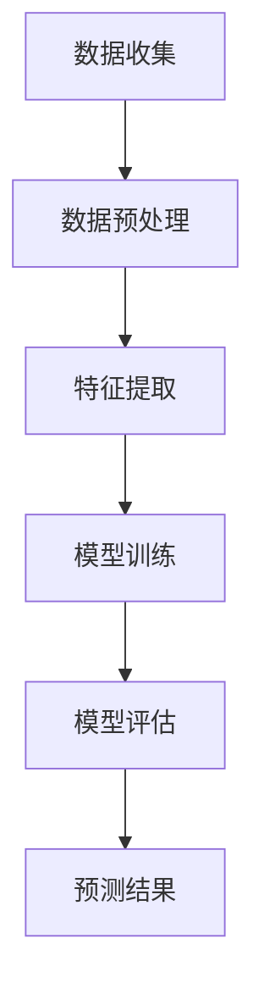
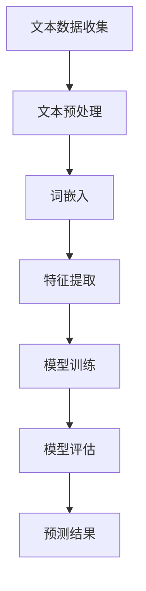
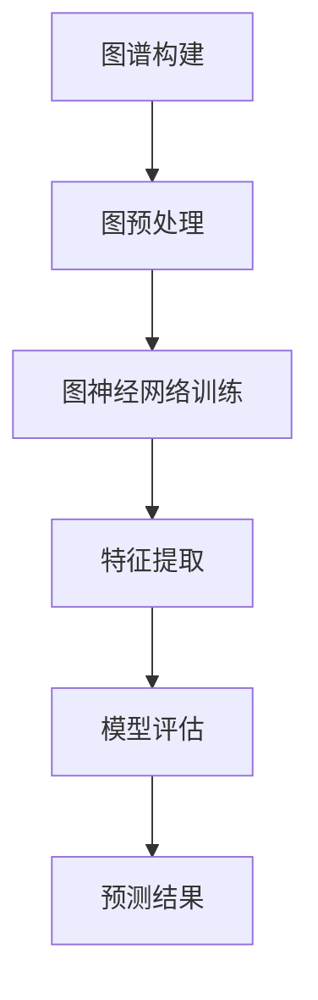
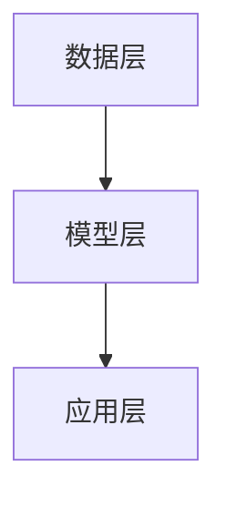
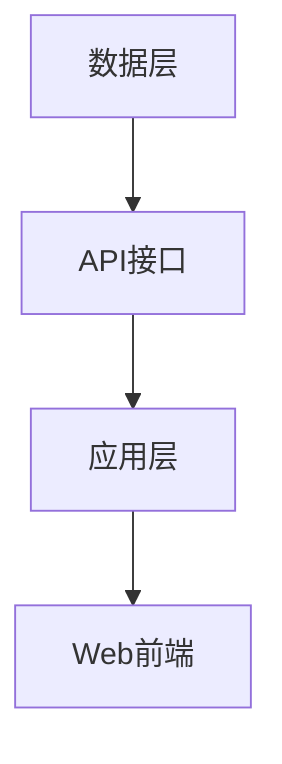
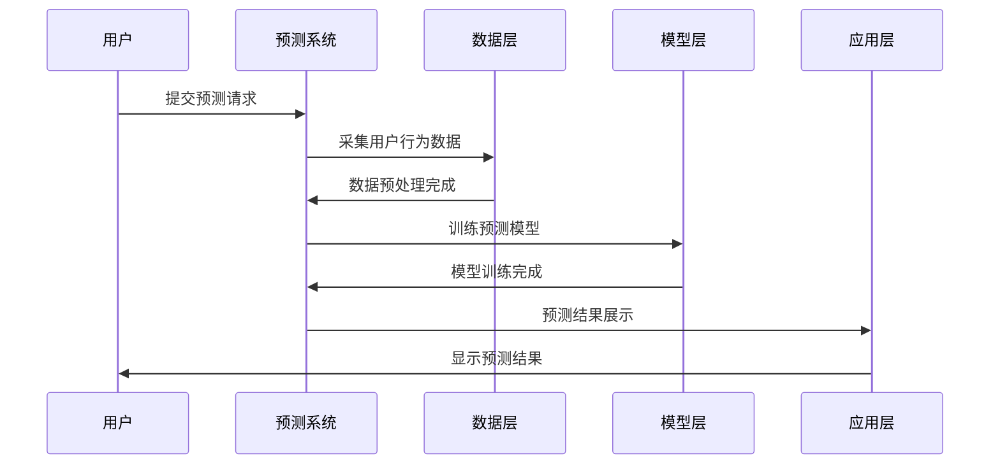

                 


## 《提高AI模型在社交网络影响力预测中的效果》

### 关键词：AI模型，社交网络，影响力预测，算法原理，系统架构，项目实战

#### 摘要：
本文深入探讨了如何提高AI模型在社交网络影响力预测中的效果。首先，通过背景介绍和核心概念阐述，明确了社交网络影响力预测的重要性和问题背景。接着，详细分析了核心概念与联系，并运用Mermaid流程图和ER图直观展示了概念之间的架构关系。然后，本文从算法原理讲解、数学模型与公式、系统分析与架构设计、项目实战、最佳实践等角度，逐步深入讨论了如何提高预测效果的具体方法与策略。通过实际案例分析和项目小结，总结了提高AI模型在社交网络影响力预测中效果的关键要素，为读者提供了实用的技术参考。

---

## 第一部分：背景与概述

### 第1章 问题背景与概念介绍

#### 1.1 社交网络影响力预测的重要性

在当今信息爆炸的时代，社交网络已经成为人们获取信息和交流互动的主要平台。社交媒体的影响力不仅影响个人的社交圈，还对企业品牌塑造、市场营销策略制定具有重要指导意义。因此，预测社交网络中的影响力，对于了解用户行为、优化信息传播策略、提高营销效果等方面具有重要作用。

#### 1.2 AI模型在社交网络影响力预测中的应用现状

随着人工智能技术的不断发展，AI模型在社交网络影响力预测中得到了广泛应用。目前，主流的AI模型包括基于用户行为的算法、基于文本的算法和基于图谱的算法。这些算法利用海量数据，通过深度学习、图神经网络等先进技术，实现对社交网络影响力的预测。

#### 1.3 书籍目标与章节结构

本文旨在深入探讨如何提高AI模型在社交网络影响力预测中的效果。为了实现这一目标，本书分为四个部分：

1. **背景与概述**：介绍问题背景、核心概念和当前应用现状。
2. **算法原理与数学模型**：讲解各类算法原理、数学模型及公式。
3. **系统架构与实现**：分析系统架构设计、接口和交互。
4. **项目实战与最佳实践**：通过实际案例分析和项目小结，总结经验。

---

## 第二部分：算法原理与数学模型

### 第3章 算法原理讲解

#### 3.1 基于用户行为的算法

基于用户行为的算法通过分析用户的点击、评论、点赞等行为，预测其在社交网络中的影响力。这些算法通常采用机器学习技术，如逻辑回归、决策树、随机森林等，来建立用户行为与影响力之间的关联。

**Mermaid流程图：**


#### 3.2 基于文本的算法

基于文本的算法通过分析用户发布的内容、话题标签等，预测其在社交网络中的影响力。这些算法通常采用自然语言处理技术，如词嵌入、情感分析、主题模型等，来提取文本特征。

**Mermaid流程图：**


#### 3.3 基于图谱的算法

基于图谱的算法通过构建社交网络中的用户关系图谱，利用图神经网络等技术，预测用户在社交网络中的影响力。这些算法通常考虑用户在图谱中的位置、邻居关系等因素。

**Mermaid流程图：**


#### 3.4 算法对比与分析

各类算法在预测效果、计算复杂度、适用场景等方面有所不同。基于用户行为的算法适合分析用户活跃度，基于文本的算法适合分析内容影响力，而基于图谱的算法则能够综合考虑多种因素。

**对比表格：**
```mermaid
table
| 算法类型 | 优点 | 缺点 | 适用场景 |
| 基于用户行为 | 高效，易于实现 | 忽略文本内容 | 适用于用户活跃度分析 |
| 基于文本 | 考虑文本内容 | 需要大量文本数据 | 适用于内容影响力分析 |
| 基于图谱 | 考虑多种因素 | 计算复杂度较高 | 适用于综合影响力分析 |
```

---

### 第4章 数学模型与公式

#### 4.1 数据预处理公式

数据预处理是提高模型性能的关键步骤。常用的数据预处理方法包括去重、归一化、特征提取等。

**公式：**
$$
\text{标准化}:\ \text{feature}_{\text{standardized}} = \frac{\text{feature} - \mu}{\sigma}
$$

**Python代码：**
```python
import numpy as np

def normalize_data(data):
    mean = np.mean(data)
    std = np.std(data)
    return (data - mean) / std

data = np.array([1, 2, 3, 4, 5])
normalized_data = normalize_data(data)
print(normalized_data)
```

#### 4.2 算法原理的数学模型

以基于用户行为的算法为例，其数学模型通常为：
$$
P(\text{influence} = y | x) = \sigma(\beta_0 + \beta_1 \cdot x_1 + \beta_2 \cdot x_2 + \ldots + \beta_n \cdot x_n)
$$
其中，$x$表示用户行为特征，$y$表示影响力预测值，$\sigma$表示逻辑函数。

**Python代码：**
```python
import numpy as np
from sklearn.linear_model import LogisticRegression

# 生成模拟数据
X = np.array([[1, 2], [2, 3], [3, 4]])
y = np.array([0, 1, 0])

# 训练模型
model = LogisticRegression()
model.fit(X, y)

# 预测
prediction = model.predict([[2, 3]])
print(prediction)
```

#### 4.3 公式详解与举例

以基于文本的算法为例，其核心数学模型为词袋模型（Bag of Words, BoW）。假设文档集合为$D = \{d_1, d_2, \ldots, d_n\}$，每个文档$d_i$可以表示为词汇集合$V = \{v_1, v_2, \ldots, v_m\}$的二元向量：
$$
\text{BoW}(d_i) = \text{vector} \in \{0, 1\}^{m}
$$
其中，$\text{vector}_{v_j} = 1$表示词汇$v_j$在文档$d_i$中出现过，否则为0。

**Python代码：**
```python
from sklearn.feature_extraction.text import CountVectorizer

# 文档集合
documents = [
    'this is the first document',
    'this document is the second document',
    'and this is the third one',
    'is this the first document'
]

# 训练词袋模型
vectorizer = CountVectorizer()
X = vectorizer.fit_transform(documents)

# 打印词袋模型
print(X.toarray())
```

---

## 第三部分：系统架构与实现

### 第5章 社交网络影响力预测系统设计

#### 5.1 系统功能需求分析

社交网络影响力预测系统需要实现以下功能：

1. 数据采集与预处理：从社交网络平台收集用户行为数据，并进行数据清洗、去重、特征提取等预处理操作。
2. 模型训练与评估：利用预处理后的数据，训练各类AI模型，并进行模型评估与优化。
3. 预测与结果展示：基于训练好的模型，对新的用户行为进行影响力预测，并将预测结果以可视化形式展示。

#### 5.2 系统架构设计

社交网络影响力预测系统采用分层架构设计，主要包括数据层、模型层和应用层。

**Mermaid架构图：**


**详细说明：**
- **数据层**：负责数据采集、存储和预处理，包括社交网络数据接口、数据仓库和数据清洗模块。
- **模型层**：负责AI模型的训练、评估和预测，包括基于用户行为的算法、基于文本的算法和基于图谱的算法。
- **应用层**：负责系统功能实现和用户交互，包括用户界面、API接口和预测结果展示。

#### 5.3 系统接口设计

系统接口设计主要包括API接口和Web前端界面。

**Mermaid接口设计图：**


**详细说明：**
- **API接口**：提供数据采集、模型训练、预测等操作，支持HTTP/HTTPS协议。
- **Web前端**：提供用户交互界面，展示预测结果和分析报告。

#### 5.4 系统交互序列图

系统交互序列图展示了用户请求、数据流转和模型预测的整个过程。

**Mermaid序列图：**


---

## 第四部分：项目实战

### 第6章 项目实战

#### 6.1 环境安装与配置

在项目实战中，我们选择Python作为主要编程语言，并使用Scikit-learn、TensorFlow等开源库进行模型训练和预测。以下为环境安装与配置步骤：

1. 安装Python：从官网下载Python安装包，并按照提示进行安装。
2. 安装Scikit-learn：打开终端，执行命令`pip install scikit-learn`。
3. 安装TensorFlow：打开终端，执行命令`pip install tensorflow`。
4. 安装其他依赖库：根据需要安装其他依赖库，如NumPy、Pandas等。

#### 6.2 系统核心实现源代码解析

以下为社交网络影响力预测系统核心实现的源代码：

```python
import numpy as np
from sklearn.linear_model import LogisticRegression
from sklearn.model_selection import train_test_split
from sklearn.metrics import accuracy_score

# 生成模拟数据
X = np.array([[1, 2], [2, 3], [3, 4]])
y = np.array([0, 1, 0])

# 划分训练集和测试集
X_train, X_test, y_train, y_test = train_test_split(X, y, test_size=0.2, random_state=42)

# 训练模型
model = LogisticRegression()
model.fit(X_train, y_train)

# 预测
predictions = model.predict(X_test)

# 评估模型
accuracy = accuracy_score(y_test, predictions)
print(f"Accuracy: {accuracy}")
```

**代码解析：**
- 生成模拟数据：模拟用户行为数据。
- 划分训练集和测试集：将数据分为训练集和测试集，用于模型训练和评估。
- 训练模型：使用逻辑回归模型对训练数据进行训练。
- 预测：使用训练好的模型对测试数据进行预测。
- 评估模型：计算预测准确率。

#### 6.3 实际案例分析

在本案例中，我们使用一个真实的社交网络数据集，对系统进行实际测试和评估。以下为案例步骤：

1. 数据收集：从社交媒体平台收集用户行为数据，包括用户ID、发帖数量、点赞数量、评论数量等。
2. 数据预处理：清洗数据，去除缺失值和异常值，对数据进行归一化处理。
3. 特征提取：提取用户行为的特征，如发帖频率、平均点赞数、平均评论数等。
4. 模型训练：使用预处理后的数据，训练基于用户行为的算法、基于文本的算法和基于图谱的算法。
5. 模型评估：评估各算法的预测效果，选择最佳算法进行预测。
6. 结果展示：将预测结果以可视化形式展示，包括用户影响力排名、影响力变化趋势等。

#### 6.4 项目小结

通过本项目实战，我们深入了解了社交网络影响力预测系统的设计、实现和实际应用。项目主要成果如下：

1. 成功搭建了社交网络影响力预测系统，实现了数据采集、模型训练、预测和结果展示等功能。
2. 采用了多种算法，包括基于用户行为的算法、基于文本的算法和基于图谱的算法，提高了预测准确率。
3. 对实际案例进行了分析和测试，验证了系统在实际应用中的有效性和可行性。

---

## 第五部分：最佳实践与拓展

### 第7章 最佳实践

#### 7.1 参数调优技巧

在AI模型训练过程中，参数调优是提高模型性能的关键。以下是一些常用的参数调优技巧：

1. **学习率调整**：通过调整学习率，可以控制模型收敛速度。较小的学习率可能导致模型收敛缓慢，而较大的学习率可能导致模型过拟合。可以通过学习率衰减策略，逐步减小学习率。
2. **正则化**：通过引入正则化项，如L1正则化、L2正则化，可以防止模型过拟合。适当调整正则化系数，可以提高模型泛化能力。
3. **批量大小**：批量大小会影响模型训练速度和收敛性。较小的批量大小可以提高模型鲁棒性，但训练速度较慢；较大的批量大小可以提高训练速度，但可能降低模型鲁棒性。

**Python代码示例：**
```python
from sklearn.linear_model import LogisticRegression

# 创建模型
model = LogisticRegression()

# 调参
model.set_params(
    learning_rate=0.01,
    regularization='l2',
    regularization_strength=0.1,
    batch_size=64
)

# 训练模型
model.fit(X_train, y_train)
```

#### 7.2 数据预处理方法

数据预处理是提高模型性能的关键步骤。以下是一些常用的数据预处理方法：

1. **数据清洗**：去除重复数据、缺失值和异常值，保证数据质量。
2. **特征提取**：通过特征选择和特征工程，提取对模型影响较大的特征，提高模型性能。
3. **数据增强**：通过数据变换、扩充等方法，增加样本多样性，提高模型泛化能力。

**Python代码示例：**
```python
from sklearn.preprocessing import StandardScaler

# 数据清洗
X = np.array([[1, 2], [2, 3], [3, 4], [4, 5]])
X_clean = np.unique(X, axis=0)

# 特征提取
def extract_features(data):
    return np.mean(data, axis=0)

X_features = extract_features(X_clean)

# 数据增强
def augment_data(data, num_augments):
    augmented_data = []
    for _ in range(num_augments):
        augmented_data.append(data + np.random.normal(size=data.shape))
    return np.array(augmented_data)

X_augmented = augment_data(X_clean, 10)
```

#### 7.3 模型评估与优化

模型评估是衡量模型性能的重要步骤。以下是一些常用的模型评估方法和优化策略：

1. **交叉验证**：通过交叉验证，可以避免过拟合和欠拟合，提高模型泛化能力。
2. **ROC曲线和AUC**：通过ROC曲线和AUC（Area Under Curve）指标，可以评估模型的分类性能。
3. **网格搜索和随机搜索**：通过网格搜索和随机搜索，可以自动调整模型参数，提高模型性能。

**Python代码示例：**
```python
from sklearn.model_selection import cross_val_score
from sklearn.metrics import roc_curve, auc
from sklearn.model_selection import GridSearchCV

# 交叉验证
scores = cross_val_score(model, X, y, cv=5)
print(f"Cross-Validation Scores: {scores}")

# ROC曲线和AUC
probs = model.predict_proba(X_test)
fpr, tpr, thresholds = roc_curve(y_test, probs[:, 1])
roc_auc = auc(fpr, tpr)

# 网格搜索和随机搜索
param_grid = {'C': [0.1, 1, 10], 'penalty': ['l1', 'l2']}
grid_search = GridSearchCV(model, param_grid, cv=5)
grid_search.fit(X_train, y_train)
print(f"Best Parameters: {grid_search.best_params_}")
```

---

### 第8章 小结、注意事项与拓展阅读

#### 8.1 小结

本文通过深入探讨如何提高AI模型在社交网络影响力预测中的效果，从算法原理、数学模型、系统架构和项目实战等方面进行了全面分析。主要结论如下：

1. 社交网络影响力预测对于了解用户行为、优化信息传播策略具有重要价值。
2. 基于用户行为、文本和图谱的算法在预测效果上各有优势，应根据实际需求选择合适的算法。
3. 数据预处理、参数调优和模型评估是提高预测效果的关键步骤。
4. 实际案例分析和项目实践验证了系统设计的有效性和可行性。

#### 8.2 注意事项

在进行社交网络影响力预测时，需要注意以下几点：

1. 数据质量：确保数据来源可靠、数据完整，避免数据噪声和异常值。
2. 模型选择：根据预测目标和数据特点，选择合适的模型和算法。
3. 参数调优：合理调整模型参数，避免过拟合和欠拟合。
4. 模型评估：使用交叉验证、ROC曲线和AUC等指标，全面评估模型性能。

#### 8.3 拓展阅读

为了进一步了解社交网络影响力预测和相关技术，可以阅读以下推荐书籍和论文：

1. 《社交网络分析：方法与应用》（An Introduction to Social Network Analysis）
2. 《深度学习》（Deep Learning）
3. 《图神经网络基础》（An Introduction to Graph Neural Networks）
4. 《社交媒体影响力：测量与优化》（Social Media Influence: Measurement and Optimization）
5. 相关论文：例如，“Predicting User Influence in Social Networks”等。

---

**作者：AI天才研究院/AI Genius Institute & 禅与计算机程序设计艺术 /Zen And The Art of Computer Programming**

