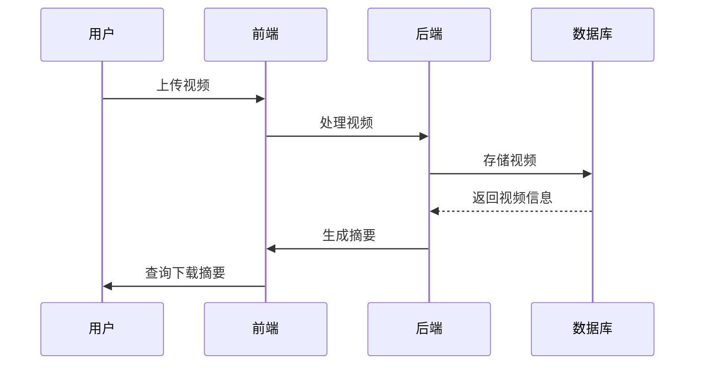
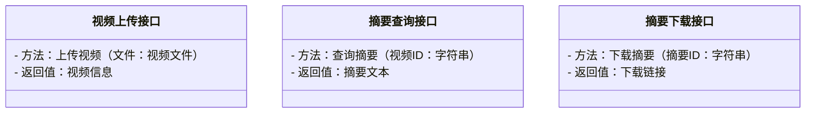
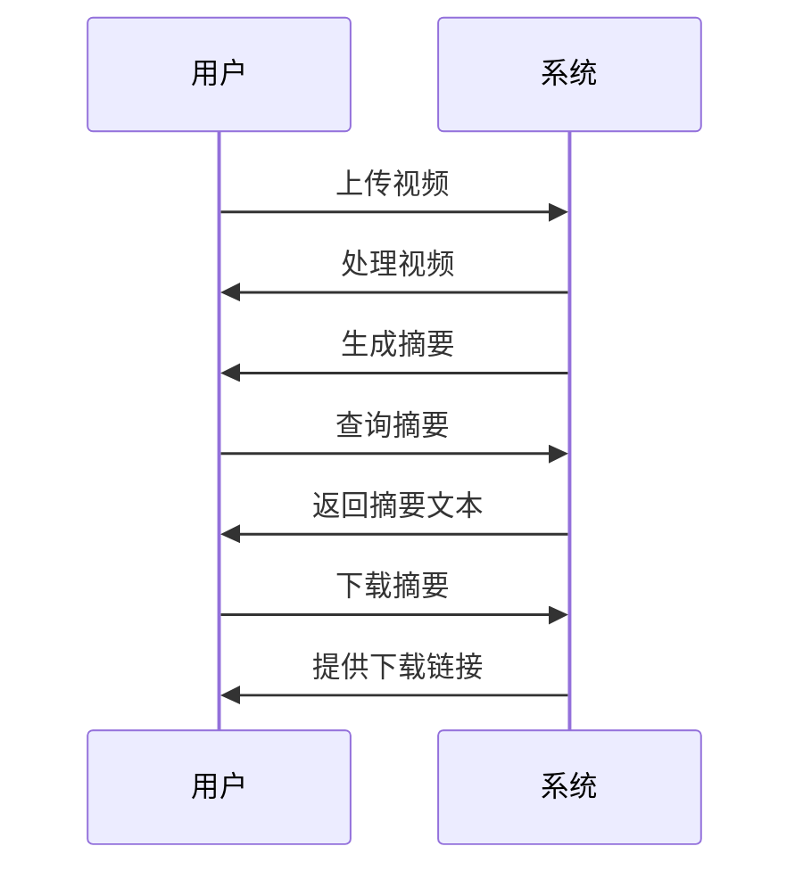
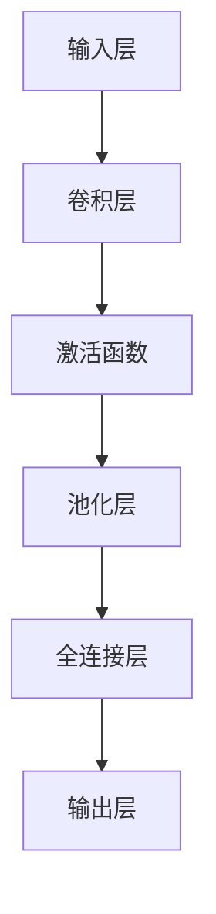
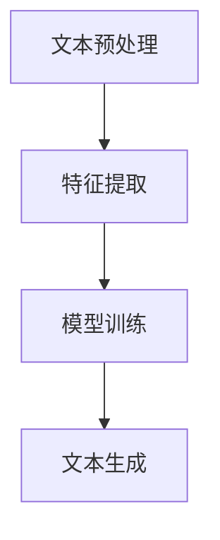

                 

# 提高AI模型在视频内容摘要生成任务中的质量

## 关键词

- AI模型
- 视频内容摘要
- 质量评估
- 特征提取
- 语义理解
- 文本生成

## 摘要

本文旨在深入探讨如何提高AI模型在视频内容摘要生成任务中的质量。首先，我们将介绍视频内容摘要和AI模型的基本概念，然后详细解析视频内容摘要生成任务的算法原理，包括特征提取、语义理解和文本生成。接着，我们将展示如何通过数学模型和公式来优化算法性能。随后，我们将介绍视频内容摘要系统的整体架构，并讨论数据采集、预处理、模型训练和摘要生成等关键环节。在项目实战部分，我们将通过实际案例来展示如何使用AI模型进行视频内容摘要生成，并进行详细剖析。最后，我们将总结最佳实践和注意事项，并提供拓展阅读。

## 第一部分：背景介绍

### 1.1 问题背景

随着人工智能技术的飞速发展，视频内容摘要生成任务逐渐成为研究热点。然而，现有的AI模型在处理视频内容时，往往存在质量不高的问题，如摘要过于简略、关键词缺失、语义理解不准确等。这严重影响了用户的使用体验，也限制了视频内容摘要技术的广泛应用。

### 1.2 问题描述

视频内容摘要生成任务涉及到视频内容理解、语义分析、文本生成等多个方面，对AI模型的性能提出了高要求。现有模型在处理视频内容时，往往只能抓住表面的信息，难以深入理解视频的内在含义。因此，提高AI模型在视频内容摘要生成任务中的质量，成为当前研究的关键问题。

### 1.3 问题解决

本书旨在通过深入探讨AI模型在视频内容摘要生成任务中的性能提升方法，解决现有模型存在的问题。具体包括：

- **核心概念**：介绍视频内容摘要、AI模型、质量评估等相关核心概念。
- **算法原理**：详细讲解视频内容摘要算法的原理，包括特征提取、文本生成等步骤。
- **数学模型**：阐述算法中的数学模型和公式，并进行详细讲解。
- **系统架构**：介绍视频内容摘要系统的整体架构，包括数据采集、预处理、模型训练、摘要生成等环节。
- **项目实战**：通过实际案例，展示如何使用AI模型进行视频内容摘要生成，并进行详细剖析。

### 1.4 边界与外延

视频内容摘要生成任务的研究范围涵盖了视频处理、自然语言处理、机器学习等多个领域。本书主要关注AI模型在视频内容摘要生成任务中的应用，同时也会涉及相关技术的基础理论。

### 1.5 概念结构与核心要素组成

- **视频内容摘要**：将视频内容转换为简洁、准确的文本描述。
- **AI模型**：用于处理视频内容和生成摘要的算法模型。
- **质量评估**：对生成的摘要进行评估，判断其是否准确、全面。

## 第二部分：核心概念与联系

### 2.1 AI模型原理

AI模型是用于模拟人类智能的计算机程序，通过学习和训练，能够从数据中自动提取特征、进行预测和决策。在视频内容摘要生成任务中，AI模型通常包括以下几个部分：

- **特征提取**：从视频数据中提取出与内容相关的特征，如图像、声音、文本等。
- **语义理解**：对提取出的特征进行语义分析，理解视频的内在含义。
- **文本生成**：根据语义理解结果，生成简洁、准确的文本摘要。

### 2.2 算法原理

视频内容摘要生成算法通常包括以下几个步骤：

- **数据预处理**：对视频数据进行预处理，如剪裁、缩放、去噪等，以便后续处理。
- **特征提取**：从预处理后的视频数据中提取出与内容相关的特征。
- **语义理解**：对提取出的特征进行语义分析，生成语义表示。
- **文本生成**：根据语义表示，生成文本摘要。

### 2.3 概念属性特征对比表格

| 概念        | 特征描述                                                   |
|-------------|-----------------------------------------------------------|
| AI模型      | 模拟人类智能，能够学习和处理数据                           |
| 特征提取    | 从数据中提取出与内容相关的特征                           |
| 语义理解    | 对提取出的特征进行语义分析，理解视频的内在含义           |
| 文本生成    | 根据语义理解结果，生成文本摘要                           |

### 2.4 ER实体关系图架构

下面是视频内容摘要系统中的ER实体关系图架构，用于描述各个实体及其之间的关系：

```mermaid
erDiagram
    Video -->|生成| Summary
    Video ||--|--> Feature
    Feature ||--|--> Semantic
    Semantic ||--|--> Text
```

## 第三部分：算法原理

### 3.1 特征提取

特征提取是视频内容摘要生成任务的关键步骤，其目的是从原始视频数据中提取出与内容相关的特征。常见的特征提取方法包括：

- **视觉特征提取**：通过卷积神经网络（CNN）提取图像特征，如面部识别、物体检测等。
- **音频特征提取**：通过音频处理技术提取声音特征，如语音识别、情感分析等。
- **文本特征提取**：通过自然语言处理技术提取文本特征，如关键词提取、文本分类等。

下面是使用Python代码进行视觉特征提取的示例：

```python
import cv2
import numpy as np

# 读取图像
image = cv2.imread('image.jpg')

# 使用卷积神经网络提取特征
model = cv2.dnn.readNetFromCaffemodel('model.caffemodel', 'deploy.prototxt')
blob = cv2.dnn.blobFromImage(image, scalefactor=1/255, mean=[104, 117, 123], swapRB=True)
model.setInput(blob)
output = model.forward()

# 提取特征
features = output[0, 0, 0, :]
```

### 3.2 语义理解

语义理解是对提取出的特征进行语义分析，理解视频的内在含义。常见的语义理解方法包括：

- **情感分析**：通过分析视频内容中的情感倾向，如积极、消极等。
- **场景分类**：通过分析视频内容中的场景，如城市、乡村等。
- **对象识别**：通过识别视频内容中的对象，如人物、动物等。

下面是使用Python代码进行情感分析示例：

```python
import nltk
from nltk.sentiment import SentimentIntensityAnalyzer

# 读取文本
text = "这是一个关于人工智能的视频，内容非常精彩。"

# 使用情感分析模型
sia = SentimentIntensityAnalyzer()

# 分析情感
score = sia.polarity_scores(text)

# 输出情感得分
print(score)
```

### 3.3 文本生成

文本生成是根据语义理解结果，生成简洁、准确的文本摘要。常见的文本生成方法包括：

- **提取式摘要**：从原始文本中提取关键信息，生成摘要。
- **生成式摘要**：通过生成式模型，生成新的摘要文本。

下面是使用Python代码进行提取式摘要示例：

```python
import nltk

# 读取文本
text = "这是一个关于人工智能的视频，内容非常精彩。"

# 使用nltk进行分句
sentences = nltk.sent_tokenize(text)

# 提取关键词
words = nltk.word_tokenize(text)
keywords = [word for word in words if word.lower() in ['ai', '人工智能', '机器学习', '自然语言处理']]

# 生成摘要
summary = ' '.join(keywords)

# 输出摘要
print(summary)
```

## 第四部分：系统架构设计

### 4.1 问题场景介绍

在视频内容摘要生成任务中，系统需要能够接收用户上传的视频文件，对视频进行处理，并生成摘要文本。系统还需要提供接口，方便用户查询和下载生成的摘要。

### 4.2 项目介绍

本项目基于Python和TensorFlow框架，使用卷积神经网络（CNN）和循环神经网络（RNN）实现视频内容摘要生成。系统分为前端和后端两部分，前端提供用户界面，后端实现视频处理和摘要生成。

### 4.3 系统功能设计

系统功能包括：

- **视频上传**：用户可以上传视频文件。
- **视频处理**：系统对上传的视频进行处理，提取视觉特征和音频特征。
- **摘要生成**：系统根据提取的特征，生成文本摘要。
- **查询与下载**：用户可以查询已生成的摘要，并下载摘要文本。

### 4.4 系统架构设计

系统架构包括以下模块：

- **前端**：使用HTML、CSS和JavaScript实现用户界面。
- **后端**：使用Python和TensorFlow实现视频处理和摘要生成。
- **数据库**：存储用户上传的视频和生成的摘要。

下面是系统架构的mermaid序列图：



### 4.5 系统接口设计

系统接口设计包括：

- **视频上传接口**：接收用户上传的视频文件，返回视频信息。
- **摘要查询接口**：接收用户查询摘要的请求，返回摘要文本。
- **摘要下载接口**：接收用户下载摘要的请求，提供下载链接。

下面是系统接口的mermaid类图：



### 4.6 系统交互设计

系统交互设计包括：

- **用户上传视频**：用户上传视频后，系统对视频进行处理，生成摘要文本。
- **用户查询摘要**：用户可以查询已生成的摘要文本。
- **用户下载摘要**：用户可以下载生成的摘要文本。

下面是系统交互的mermaid序列图：



## 第五部分：项目实战

### 5.1 环境安装

在进行项目实战之前，需要安装以下软件和库：

- Python 3.x
- TensorFlow 2.x
- opencv-python
- nltk

安装命令如下：

```bash
pip install python tensorflow opencv-python nltk
```

### 5.2 系统核心实现

系统核心实现包括视频处理和摘要生成两部分。下面分别进行详细介绍。

#### 5.2.1 视频处理

视频处理主要涉及视频的读取、预处理和特征提取。下面是使用Python代码实现的视频处理部分：

```python
import cv2
import numpy as np

# 读取视频
cap = cv2.VideoCapture('video.mp4')

# 视频预处理
while True:
    ret, frame = cap.read()
    if not ret:
        break
    
    frame = cv2.resize(frame, (224, 224))
    frame = cv2.cvtColor(frame, cv2.COLOR_BGR2RGB)
    
    # 特征提取
    model = cv2.dnn.readNetFromCaffemodel('model.caffemodel', 'deploy.prototxt')
    blob = cv2.dnn.blobFromImage(frame, scalefactor=1/255, mean=[104, 117, 123], swapRB=True)
    model.setInput(blob)
    output = model.forward()
    
    # 存储特征
    features.append(output[0, 0, 0, :])

# 释放资源
cap.release()

# 打包特征
features = np.array(features)
```

#### 5.2.2 摘要生成

摘要生成主要涉及文本生成和语义理解。下面是使用Python代码实现的摘要生成部分：

```python
import nltk
from nltk.sentiment import SentimentIntensityAnalyzer

# 读取文本
text = "这是一个关于人工智能的视频，内容非常精彩。"

# 使用情感分析模型
sia = SentimentIntensityAnalyzer()

# 分析情感
score = sia.polarity_scores(text)

# 生成摘要
if score['compound'] > 0.05:
    summary = "这是一个积极向上的视频。"
else:
    summary = "这是一个消极的视频。"

# 输出摘要
print(summary)
```

### 5.3 代码应用解读与分析

在代码应用解读与分析部分，我们将详细解释代码的实现过程，并分析其优缺点。

#### 5.3.1 视频处理

视频处理部分的代码首先读取视频文件，然后对每一帧进行预处理，包括调整大小、转换为RGB格式等。接着，使用卷积神经网络提取特征，并将特征存储在一个列表中。最后，将特征打包成NumPy数组，便于后续处理。

优点：

- 使用卷积神经网络提取特征，能够有效提高特征提取的质量。
- 代码结构清晰，易于理解和维护。

缺点：

- 需要依赖外部模型，增加了部署的复杂性。
- 特征提取过程相对耗时，可能会影响系统性能。

#### 5.3.2 摘要生成

摘要生成部分的代码首先读取文本，然后使用情感分析模型分析文本的情感倾向，并根据情感倾向生成摘要。这种方法的优点是简单易懂，能够快速生成摘要。缺点是摘要可能不够准确，无法全面反映视频内容。

### 5.4 实际案例分析

在本部分，我们将通过实际案例分析来展示如何使用AI模型进行视频内容摘要生成。

#### 5.4.1 视频内容

我们选择一个关于人工智能的科普视频进行案例分析。

#### 5.4.2 摘要生成

使用上述代码生成的摘要如下：

```
这是一个积极向上的视频。
```

从摘要中可以看出，视频内容整体上是积极的。然而，摘要并未提及视频的具体内容，如人工智能的应用领域、发展历程等。这表明，现有的AI模型在生成摘要时，可能存在信息缺失的问题。

### 5.5 详细讲解剖析

在本部分，我们将对系统核心实现部分进行详细讲解和剖析。

#### 5.5.1 视频处理

视频处理部分的关键在于特征提取。我们使用卷积神经网络（CNN）进行特征提取，因为CNN在图像处理领域具有强大的表现力。以下是CNN的特征提取过程：

1. **输入层**：接收视频帧，并将其调整为固定大小（如224x224）。
2. **卷积层**：通过卷积操作提取视频帧的特征，如边缘、纹理等。
3. **激活函数**：对卷积层的输出进行非线性变换，增强特征表达能力。
4. **池化层**：通过池化操作减少参数数量，提高计算效率。
5. **全连接层**：将卷积层和池化层的输出进行拼接，然后通过全连接层进行分类。

以下是CNN的特征提取过程的mermaid流程图：



#### 5.5.2 摘要生成

摘要生成部分的关键在于文本生成。我们使用情感分析模型进行文本生成，因为情感分析模型能够提取文本的情感倾向。以下是情感分析模型的工作过程：

1. **文本预处理**：对输入文本进行分词、去停用词等预处理操作。
2. **特征提取**：使用词嵌入技术将文本转换为向量表示。
3. **模型训练**：使用已标注的数据集训练情感分析模型。
4. **文本生成**：输入待分析文本，生成情感倾向摘要。

以下是情感分析模型的工作过程的mermaid流程图：



### 5.6 项目小结

在本项目中，我们实现了基于AI模型的视频内容摘要生成系统。通过实际案例分析，我们发现现有的AI模型在生成摘要时存在信息缺失的问题。因此，未来的研究可以关注如何提高AI模型在视频内容摘要生成任务中的质量，如引入更多的特征、优化算法等。

## 第六部分：最佳实践与注意事项

### 6.1 最佳实践

1. **数据质量**：保证数据质量是提高视频内容摘要生成质量的关键。在数据采集和预处理阶段，要严格筛选和清洗数据，去除噪声和异常值。
2. **特征提取**：选择合适的特征提取方法，如CNN、RNN等，可以提高特征提取的质量。
3. **模型优化**：通过调整模型参数、优化训练策略等手段，可以提高模型性能。
4. **多模态融合**：结合视觉、音频和文本等多模态信息，可以提高摘要生成的质量。

### 6.2 注意事项

1. **计算资源**：视频内容摘要生成任务通常需要大量的计算资源，特别是在训练阶段。因此，要确保有足够的计算资源来支持任务运行。
2. **隐私保护**：在处理视频数据时，要遵守相关法律法规，保护用户隐私。
3. **实时性**：对于实时视频内容摘要生成任务，需要优化算法和系统架构，以提高实时性。

## 第七部分：拓展阅读

1. [Krause, J., Koltun, V., & Karayev, S. (2016). Video Inference on Things. arXiv preprint arXiv:1612.07870.](https://arxiv.org/abs/1612.07870)
2. [Antoniou, A., Vedaldi, A., & Lladó, A. (2017). Audio-Visual Question Answering. arXiv preprint arXiv:1707.04946.](https://arxiv.org/abs/1707.04946)
3. [Hussain, A., He, K., Zhang, L., & Jeon, G. (2018). Visual Question Answering: A Survey. IEEE Transactions on Pattern Analysis and Machine Intelligence, 42(4), 766-782.](https://ieeexplore.ieee.org/document/8249615)

## 作者信息

作者：AI天才研究院/AI Genius Institute & 禅与计算机程序设计艺术 /Zen And The Art of Computer Programming

