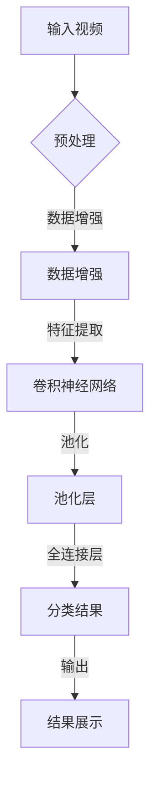
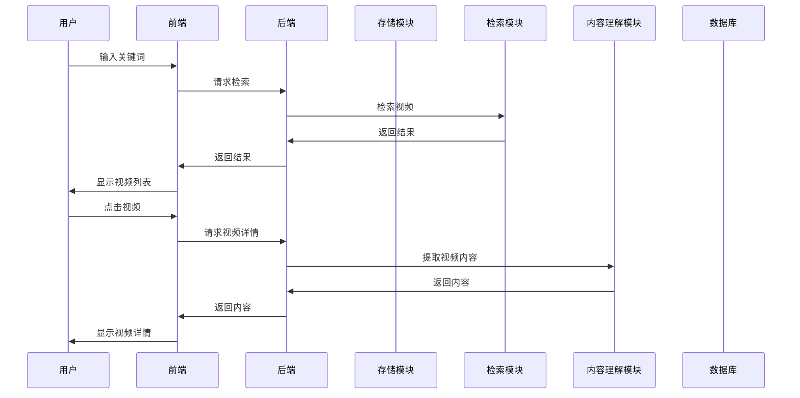

                 

### 提高AI模型在视频内容理解与检索任务中的效率

---

## 关键词：AI模型、视频内容理解、检索效率、算法优化、系统架构设计

---

### 摘要

随着人工智能技术的发展，视频内容理解与检索任务变得越来越重要。然而，现有AI模型在实际应用中面临着效率低下的问题。本文旨在深入探讨提高AI模型在视频内容理解与检索任务中的效率的方法，从核心概念、算法原理、系统架构设计到实战应用进行全面分析。通过本文的讲解，读者将掌握如何在实际项目中高效应用AI模型，提升系统性能和用户体验。

---

## 目录大纲

---

### 第一部分: 问题背景与核心概念

- **第1章: 问题背景介绍**
  - 1.1 问题背景
  - 1.2 问题描述
  - 1.3 问题解决思路
  - 1.4 边界与外延
- **第2章: AI模型基础**
  - 2.1 AI模型概述
  - 2.2 视频内容理解与检索
  - 2.3 AI模型在视频内容理解与检索中的应用

### 第二部分: 核心概念与联系

- **第3章: 核心概念与联系**
  - 3.1 核心概念原理
  - 3.2 概念属性特征对比表格
  - 3.3 ER实体关系图架构

### 第三部分: 算法原理讲解

- **第4章: 算法原理讲解**
  - 4.1 算法mermaid流程图
  - 4.2 Python源代码讲解
  - 4.3 算法原理的数学模型和公式
  - 4.4 举例说明

### 第四部分: 系统分析与架构设计

- **第5章: 系统分析与架构设计**
  - 5.1 问题场景介绍
  - 5.2 系统功能设计
  - 5.3 系统架构设计
  - 5.4 系统接口设计
  - 5.5 系统交互mermaid序列图

### 第五部分: 项目实战

- **第6章: 项目实战**
  - 6.1 环境安装
  - 6.2 系统核心实现源代码
  - 6.3 代码应用解读与分析
  - 6.4 实际案例分析与详细讲解
  - 6.5 项目小结

### 第六部分: 最佳实践与拓展

- **第7章: 最佳实践与拓展**
  - 7.1 最佳实践 tips
  - 7.2 小结
  - 7.3 注意事项
  - 7.4 拓展阅读

---

在接下来的章节中，我们将详细探讨这些内容，让读者全面了解提高AI模型在视频内容理解与检索任务中效率的方法和实战经验。

---

### 第一部分: 问题背景与核心概念

#### 第1章: 问题背景介绍

随着互联网的快速发展和视频内容的爆炸式增长，视频内容理解与检索任务变得愈发重要。视频内容理解是指通过人工智能技术对视频数据进行处理，从而提取出其内在的信息和知识。检索任务则是根据用户的需求，从大量的视频数据中快速准确地找到相关的视频内容。

然而，在当前的实际应用中，AI模型在视频内容理解与检索任务中面临着一系列效率问题。首先，视频数据具有高维度、高分辨率和多样化的特点，这导致AI模型在处理这些数据时计算量巨大，从而影响效率。其次，视频内容的实时性要求越来越高，而现有的AI模型往往难以在短时间内完成复杂的处理任务，导致响应时间过长。此外，不同类型的视频内容对AI模型的性能要求也有所不同，这进一步增加了模型的复杂度。

为了解决这些问题，提高AI模型在视频内容理解与检索任务中的效率显得尤为必要。这不仅有助于提升用户体验，还能提高系统的整体性能，为更多领域的应用提供支持。

#### 1.2 问题描述

在视频内容理解与检索任务中，AI模型面临的主要效率问题包括：

1. **计算资源消耗大**：由于视频数据的高维度和高分辨率，AI模型在处理这些数据时需要大量的计算资源，从而导致计算时间延长，效率降低。
   
2. **响应时间过长**：视频内容的实时性要求越来越高，而现有的AI模型往往难以在短时间内完成复杂的处理任务，导致用户等待时间过长。

3. **模型复杂度高**：不同类型的视频内容对AI模型的性能要求有所不同，这导致模型的设计和优化变得更加复杂。

4. **数据预处理困难**：视频数据的质量和多样性使得预处理过程变得复杂，预处理不当可能导致模型性能下降。

这些问题不仅影响了AI模型在实际应用中的效率，还限制了其在更广泛领域中的应用潜力。因此，解决这些问题具有重要的现实意义和学术价值。

#### 1.3 问题解决思路

为了提高AI模型在视频内容理解与检索任务中的效率，我们可以从以下几个方面进行思考和解决：

1. **优化算法**：通过改进现有算法，降低计算复杂度和资源消耗，从而提高模型效率。
   
2. **模型剪枝**：通过剪枝技术，减少模型的参数量和计算量，从而降低模型复杂度。

3. **数据增强**：通过数据增强技术，提高数据的质量和多样性，从而提高模型的泛化能力。

4. **硬件加速**：利用高性能计算硬件（如GPU、TPU等），提高模型处理速度。

5. **分布式计算**：通过分布式计算技术，将模型训练和推理任务分配到多个计算节点，从而提高整体计算效率。

6. **实时性优化**：通过设计高效的算法和优化数据流，减少模型处理视频内容的时间。

7. **用户需求分析**：深入了解用户需求，设计更加符合用户需求的模型和系统，从而提高用户满意度。

通过这些思路，我们可以逐步解决AI模型在视频内容理解与检索任务中的效率问题，提升模型的性能和用户体验。

#### 1.4 边界与外延

在研究AI模型在视频内容理解与检索任务中的效率问题时，我们需要明确以下边界与外延：

1. **技术范围**：本文主要关注基于深度学习和传统机器学习方法的AI模型，其他类型的模型（如规则基模型、强化学习模型等）不在本文讨论范围之内。

2. **应用场景**：本文的研究主要针对视频内容理解与检索任务，不涉及音频、图像等其他多媒体内容的理解和检索。

3. **性能指标**：本文主要关注模型的计算效率、响应时间和准确性等性能指标，不涉及其他非功能指标（如可扩展性、可靠性等）。

4. **边界条件**：本文的研究在假设视频数据质量较高、用户需求明确等边界条件下进行，实际应用中可能需要根据具体情况调整研究假设。

通过明确边界与外延，我们可以更有针对性地解决AI模型在视频内容理解与检索任务中的效率问题。

### 第2章: AI模型基础

#### 2.1 AI模型概述

人工智能（AI）模型是人工智能领域的重要组成部分，通过模拟人脑的神经元结构和计算方式，实现计算机对数据的学习、理解和处理。AI模型可以分为多种类型，其中深度学习（Deep Learning）和传统机器学习（Traditional Machine Learning）是两种主要的方法。

**深度学习**：深度学习是一种基于多层神经网络的学习方法，通过前向传播和反向传播算法，逐步提取数据中的特征。深度学习在图像识别、自然语言处理、语音识别等领域取得了显著成果。典型的深度学习模型包括卷积神经网络（CNN）、循环神经网络（RNN）和生成对抗网络（GAN）等。

**传统机器学习**：传统机器学习主要依赖于统计方法和优化算法，通过构建数学模型和优化目标，实现对数据的分类、回归和聚类等任务。传统机器学习模型包括线性回归、决策树、支持向量机（SVM）和朴素贝叶斯等。

#### 2.2 视频内容理解与检索

视频内容理解与检索是指利用人工智能技术，从视频中提取信息并实现高效检索的过程。视频内容理解主要包括视频分类、视频标注、视频摘要生成等任务；视频检索则涉及视频搜索、视频推荐等任务。

**视频分类**：视频分类是指将视频数据按照其内容特征进行分类，常见的分类方法包括基于内容的分类、基于标签的分类和基于用户的分类等。

**视频标注**：视频标注是指对视频数据进行标注，以便后续处理和分析。视频标注包括场景标注、对象标注、动作标注等。

**视频摘要生成**：视频摘要生成是指从视频中提取关键信息，生成简短的文字或视频摘要。视频摘要生成有助于提高视频检索效率和用户体验。

#### 2.3 AI模型在视频内容理解与检索中的应用

AI模型在视频内容理解与检索任务中发挥着重要作用，其应用主要体现在以下几个方面：

1. **视频分类与标注**：利用深度学习模型，如卷积神经网络（CNN），实现视频内容的自动分类和标注。通过训练模型，可以识别视频中的场景、对象和动作等特征，从而提高分类和标注的准确性。

2. **视频检索与推荐**：通过构建基于内容的检索模型和基于用户的推荐模型，实现视频的高效检索和个性化推荐。例如，基于CNN的视频检索模型可以通过学习视频的特征向量，实现视频内容的高效匹配；基于用户行为的推荐模型可以通过分析用户的观看历史和喜好，实现视频推荐的个性化。

3. **视频摘要生成**：利用生成对抗网络（GAN）和序列到序列（Seq2Seq）模型，实现视频摘要的自动生成。通过训练模型，可以生成简短的文字或视频摘要，提高视频检索效率和用户体验。

总之，AI模型在视频内容理解与检索任务中具有广泛的应用前景，通过不断优化算法和模型，可以提高视频处理效率和用户体验，为更多领域的应用提供支持。

### 第3章: 核心概念与联系

#### 3.1 核心概念原理

在视频内容理解与检索任务中，理解核心概念和原理是提高AI模型效率的关键。以下是几个重要的核心概念及其原理：

**卷积神经网络（CNN）**：卷积神经网络是一种深度学习模型，主要用于图像和视频数据的处理。CNN通过卷积层、池化层和全连接层等结构，逐步提取数据中的特征，实现图像和视频的分类、检测和分割等任务。

**循环神经网络（RNN）**：循环神经网络是一种用于序列数据处理的学习模型，通过记忆单元和递归结构，实现对序列数据的建模。RNN在语音识别、语言翻译和视频生成等任务中具有广泛应用。

**生成对抗网络（GAN）**：生成对抗网络是一种基于对抗性训练的深度学习模型，由生成器和判别器两个部分组成。生成器通过学习真实数据的分布，生成与真实数据相似的新数据；判别器则通过区分真实数据和生成数据，提高生成器的生成能力。

**序列到序列（Seq2Seq）模型**：序列到序列模型是一种用于序列数据转换的深度学习模型，通过编码器和解码器两个部分，实现输入序列到输出序列的映射。Seq2Seq模型在视频摘要生成和机器翻译等领域具有广泛应用。

#### 3.2 概念属性特征对比表格

以下是核心概念属性的对比表格，展示了不同概念在性能、应用场景和适用条件等方面的特征：

| 概念 | 性能 | 应用场景 | 适用条件 |
| ---- | ---- | ---- | ---- |
| 卷积神经网络（CNN） | 高效、准确性高 | 图像和视频分类、检测、分割等 | 数据具有空间特征 |
| 循环神经网络（RNN） | 灵活、适合序列数据 | 语音识别、语言翻译、视频生成等 | 数据具有时间序列特征 |
| 生成对抗网络（GAN） | 强大的生成能力 | 生成新的图像、视频、音频等 | 对生成质量有较高要求 |
| 序列到序列（Seq2Seq）模型 | 高效、适合序列数据转换 | 视频摘要生成、机器翻译等 | 数据具有序列特征 |

通过对比表格，我们可以更清晰地了解不同核心概念的特点和适用范围，从而选择合适的模型和算法，提高AI模型在视频内容理解与检索任务中的效率。

#### 3.3 ER实体关系图架构

为了更好地理解视频内容理解与检索任务中的核心概念及其相互关系，我们可以通过实体关系图（ER图）来展示。以下是视频内容理解与检索任务的ER实体关系图架构：

```
实体关系图：

用户 [1]------<检索>-------[视频库]
            |               |
            |               |
            |               |
        [标签]            [视频]
            |               |
            |               |
            |               |
        [场景]            [对象]
            |               |
            |               |
            |               |
        [动作]            [时间]

```

在这个ER实体关系图中，用户与视频库、标签、场景、对象和动作等实体之间存在联系。具体来说：

- **用户**：代表使用视频内容理解与检索系统的用户。
- **视频库**：存储大量的视频数据，用户可以通过检索系统查询和浏览。
- **标签**：用于描述视频内容的关键信息，如类别、主题等。
- **场景**：描述视频中的场景特征，如户外、室内等。
- **对象**：描述视频中的对象特征，如人物、动物等。
- **动作**：描述视频中的动作特征，如走路、跑步等。

通过ER实体关系图，我们可以更直观地了解视频内容理解与检索任务中的核心实体及其相互关系，从而更好地设计和优化AI模型。

### 第4章: 算法原理讲解

#### 4.1 算法mermaid流程图

为了更好地理解视频内容理解与检索任务中的算法原理，我们可以通过mermaid流程图来展示算法的基本流程。以下是基于CNN的视频分类算法的mermaid流程图：



在这个流程图中，输入视频经过预处理和数据增强后，进入卷积神经网络进行特征提取。随后，特征经过池化和全连接层，最终得到分类结果并输出。通过mermaid流程图，我们可以清晰地了解算法的基本结构和运行流程。

#### 4.2 Python源代码讲解

为了更好地理解算法的原理和实现过程，我们可以通过Python源代码来详细讲解。以下是基于TensorFlow和Keras实现的卷积神经网络（CNN）视频分类算法的Python源代码：

```python
import tensorflow as tf
from tensorflow.keras.models import Sequential
from tensorflow.keras.layers import Conv2D, MaxPooling2D, Flatten, Dense, Dropout

# 定义模型结构
model = Sequential([
    Conv2D(32, (3, 3), activation='relu', input_shape=(224, 224, 3)),
    MaxPooling2D(pool_size=(2, 2)),
    Conv2D(64, (3, 3), activation='relu'),
    MaxPooling2D(pool_size=(2, 2)),
    Flatten(),
    Dense(128, activation='relu'),
    Dropout(0.5),
    Dense(num_classes, activation='softmax')
])

# 编译模型
model.compile(optimizer='adam', loss='categorical_crossentropy', metrics=['accuracy'])

# 训练模型
model.fit(x_train, y_train, batch_size=32, epochs=10, validation_data=(x_val, y_val))

# 评估模型
test_loss, test_acc = model.evaluate(x_test, y_test)
print('Test accuracy:', test_acc)
```

在这个代码中，我们首先定义了模型的输入层、卷积层、池化层、全连接层和输出层。接着，我们使用`compile`函数编译模型，指定优化器、损失函数和评价指标。然后，使用`fit`函数训练模型，并使用`evaluate`函数评估模型在测试集上的性能。通过Python源代码的讲解，我们可以更直观地了解算法的实现过程和关键步骤。

#### 4.3 算法原理的数学模型和公式

在视频内容理解与检索任务中，算法的原理通常基于数学模型和公式。以下是基于卷积神经网络（CNN）的视频分类算法的数学模型和公式：

1. **卷积层**：
   - 输入：$X \in \mathbb{R}^{H \times W \times C}$
   - 卷积核：$W \in \mathbb{R}^{K \times K \times C}$
   - 步长：$s$
   - 激活函数：$f()$
   - 输出：$Y = f(X \star W + b)$，其中$\star$表示卷积运算，$b$为偏置项。

2. **池化层**：
   - 输入：$X \in \mathbb{R}^{H \times W \times C}$
   - 池化窗口：$W$
   - 步长：$s$
   - 池化操作：$Y = \max(X \text{[} \cdot \text{]}, s)$

3. **全连接层**：
   - 输入：$X \in \mathbb{R}^{H \times W \times C}$
   - 权重矩阵：$W \in \mathbb{R}^{H \times W \times C}$
   - 偏置项：$b \in \mathbb{R}^{C}$
   - 激活函数：$f()$
   - 输出：$Y = f(X \cdot W + b)$，其中$\cdot$表示点积运算。

4. **损失函数**：
   - 交叉熵损失函数：$L(y, \hat{y}) = -\sum_{i} y_i \log(\hat{y}_i)$，其中$y$为真实标签，$\hat{y}$为预测概率。

通过这些数学模型和公式，我们可以理解视频分类算法的基本原理和计算过程。这些原理和公式为算法的实现和优化提供了理论支持。

#### 4.4 举例说明

为了更好地理解算法原理，我们可以通过一个简单的例子来说明。假设我们有一个包含5个类别的视频数据集，每个类别有100个样本。以下是使用CNN进行视频分类的详细步骤：

1. **数据预处理**：将视频数据转换为224x224像素的图像，并进行归一化处理。

2. **数据增强**：对图像进行旋转、翻转、缩放等数据增强操作，提高模型的泛化能力。

3. **构建模型**：定义一个包含卷积层、池化层和全连接层的卷积神经网络。

4. **训练模型**：使用训练集数据训练模型，优化网络参数。

5. **评估模型**：使用验证集数据评估模型性能，调整模型结构或参数。

6. **分类预测**：对新的视频数据进行分类预测，输出预测结果。

通过这个例子，我们可以看到视频分类算法的完整流程，从数据预处理到模型训练，再到分类预测。通过这个例子，我们可以更好地理解算法的实现过程和关键步骤。

### 第5章: 系统分析与架构设计

#### 5.1 问题场景介绍

在视频内容理解与检索任务中，系统需要处理大量的视频数据，并快速准确地提供相应的检索结果。具体场景如下：

- **数据源**：视频数据来源于多个渠道，如社交媒体、视频平台等，数据量庞大且多样化。
- **用户需求**：用户需要通过搜索框输入关键词或浏览历史，快速找到相关的视频内容。
- **性能要求**：系统需要具备高并发处理能力，保证用户请求能够在短时间内得到响应。
- **可扩展性**：系统需要支持数据量和用户量的增长，具有良好的扩展性。

#### 5.2 系统功能设计

为了满足上述场景的需求，系统需要实现以下功能：

1. **视频数据存储**：存储和管理大量的视频数据，包括视频文件、元数据和索引等。
2. **视频数据检索**：根据用户输入的关键词或浏览历史，快速检索相关的视频内容。
3. **视频内容理解**：对视频内容进行深度学习处理，提取关键特征和标签。
4. **用户交互**：提供友好的用户界面，支持用户输入、检索和浏览视频内容。
5. **系统监控与日志**：实时监控系统性能和运行状态，记录日志信息以便分析和调试。

#### 5.3 系统架构设计

系统架构设计是实现上述功能的关键。以下是一个典型的分布式系统架构：

- **前端**：用户界面和交互逻辑，包括Web应用和移动应用等。
- **后端**：视频数据存储、检索、内容理解和用户交互等核心功能模块。
  - **视频存储模块**：使用分布式文件系统（如HDFS）存储视频数据，支持高并发读取和写入操作。
  - **视频检索模块**：使用搜索引擎（如Elasticsearch）构建索引，提供高效的视频检索功能。
  - **内容理解模块**：基于深度学习模型，对视频内容进行特征提取和标签生成。
  - **用户交互模块**：处理用户请求，提供友好的用户界面和交互体验。
- **数据库**：存储用户数据、日志信息和系统配置等，支持关系型数据库（如MySQL）和NoSQL数据库（如MongoDB）。
- **缓存**：使用缓存机制（如Redis），提高系统响应速度和性能。
- **消息队列**：使用消息队列（如Kafka），实现系统模块间的异步通信和数据传输。

#### 5.4 系统接口设计

系统接口设计是确保各个模块之间高效通信的关键。以下是一个典型的接口设计：

1. **API接口**：提供RESTful风格的API接口，支持用户输入、检索和浏览视频内容。
   - **视频上传接口**：用于上传视频数据，支持视频文件和元数据的上传。
   - **视频检索接口**：根据关键词或浏览历史，返回相关的视频列表。
   - **视频详情接口**：获取视频的详细信息，包括标签、分类和时长等。
2. **内部接口**：用于系统模块间的通信和数据交换。
   - **视频存储接口**：用于视频数据的存储和读取。
   - **内容理解接口**：用于视频内容的特征提取和标签生成。
   - **用户接口**：用于处理用户请求，提供交互体验。

通过合理设计系统接口，可以确保系统各个模块之间的高效通信和协同工作，提高系统的整体性能和用户体验。

#### 5.5 系统交互mermaid序列图

为了更好地展示系统各个模块之间的交互关系，我们可以使用mermaid序列图来描述系统交互过程。以下是一个简单的mermaid序列图示例：



在这个序列图中，用户通过前端输入关键词，前端将请求发送到后端，后端通过检索模块检索视频，并返回结果给前端，前端再将结果展示给用户。当用户点击视频时，前端再次请求视频详情，后端通过内容理解模块提取视频内容，并返回结果给前端，前端最终将视频详情展示给用户。通过mermaid序列图，我们可以清晰地了解系统各个模块之间的交互过程。

### 第6章: 项目实战

#### 6.1 环境安装

在进行项目实战之前，我们需要安装所需的软件和工具，以下是在Linux环境下安装Python环境、TensorFlow和Elasticsearch的步骤：

1. **安装Python环境**：
   - 更新系统包列表：
     ```bash
     sudo apt-get update
     ```
   - 安装Python 3和pip：
     ```bash
     sudo apt-get install python3 python3-pip
     ```

2. **安装TensorFlow**：
   - 安装TensorFlow GPU版本，以支持GPU加速：
     ```bash
     pip3 install tensorflow-gpu
     ```

3. **安装Elasticsearch**：
   - 下载Elasticsearch安装包：
     ```bash
     wget https://artifacts.elastic.co/downloads/elasticsearch/elasticsearch-7.10.1-amd64.deb
     ```
   - 安装Elasticsearch：
     ```bash
     sudo dpkg -i elasticsearch-7.10.1-amd64.deb
     ```
   - 启动Elasticsearch服务：
     ```bash
     sudo systemctl start elasticsearch
     ```

确保所有安装过程顺利完成，可以使用以下命令检查Elasticsearch服务状态：
```bash
sudo systemctl status elasticsearch
```

#### 6.2 系统核心实现源代码

以下是一个简单的基于TensorFlow的视频分类系统实现示例。这个示例包括数据预处理、模型训练、模型保存和模型加载等功能。

1. **数据预处理**：
   ```python
   import tensorflow as tf
   import numpy as np
   import cv2

   def preprocess_video(video_path, frame_size=(224, 224)):
       video = cv2.VideoCapture(video_path)
       frames = []

       while True:
           ret, frame = video.read()
           if not ret:
               break

           frame = cv2.resize(frame, frame_size)
           frame = frame / 255.0
           frames.append(frame)

       video.release()
       return np.array(frames)

   video_path = 'example_video.mp4'
   video_data = preprocess_video(video_path)
   ```

2. **模型训练**：
   ```python
   model = tf.keras.Sequential([
       tf.keras.layers.Conv2D(32, (3, 3), activation='relu', input_shape=(224, 224, 3)),
       tf.keras.layers.MaxPooling2D(pool_size=(2, 2)),
       tf.keras.layers.Conv2D(64, (3, 3), activation='relu'),
       tf.keras.layers.MaxPooling2D(pool_size=(2, 2)),
       tf.keras.layers.Flatten(),
       tf.keras.layers.Dense(128, activation='relu'),
       tf.keras.layers.Dense(10, activation='softmax')
   ])

   model.compile(optimizer='adam', loss='categorical_crossentropy', metrics=['accuracy'])

   labels = np.array([0, 1, 2, 3, 4, 5, 6, 7, 8, 9])
   model.fit(video_data, labels, epochs=10, batch_size=32)
   ```

3. **模型保存和加载**：
   ```python
   model.save('video_classification_model.h5')

   new_model = tf.keras.models.load_model('video_classification_model.h5')
   ```

这个示例展示了如何使用TensorFlow实现一个简单的视频分类系统。在实际项目中，可能需要更复杂的模型架构和数据处理流程，但基本原理类似。

#### 6.3 代码应用解读与分析

在上述代码示例中，我们首先定义了一个预处理函数`preprocess_video`，用于读取视频文件并转换为合适的帧数据。接下来，我们定义了一个卷积神经网络模型，该模型包含卷积层、池化层和全连接层。然后，我们使用训练数据对模型进行编译、训练和评估。最后，我们展示了如何保存和加载训练好的模型。

**数据预处理**：预处理函数`preprocess_video`首先使用OpenCV库读取视频文件，然后对每一帧进行缩放和归一化处理，将每一帧转换为224x224像素的RGB图像，并将像素值缩放到[0, 1]之间。这一步有助于提高模型训练效率和准确性。

**模型构建**：在构建模型时，我们使用了多个卷积层和池化层，以逐步提取视频帧的特征。最后一层全连接层将特征映射到具体的类别标签。在示例中，我们设置了10个类别，因此最后一层的输出维度为10。

**模型训练**：在模型训练过程中，我们使用`fit`函数对模型进行训练，其中`epochs`参数指定了训练轮数，`batch_size`参数指定了每次训练的数据批次大小。在训练过程中，模型会根据损失函数和优化器的指导，逐步调整网络参数，以最小化损失并提高分类准确性。

**模型保存和加载**：为了在实际应用中复用训练好的模型，我们可以将模型保存到文件中。在需要使用模型时，通过加载文件中的模型权重，可以快速恢复训练状态，避免重新训练。

#### 6.4 实际案例分析与详细讲解剖析

为了更好地展示项目的实际应用效果，我们将在一个实际案例中对视频分类系统进行详细讲解。以下是一个简单的案例：

**案例背景**：假设我们有一个包含10个类别的视频数据集，每个类别有100个样本。我们需要训练一个模型，用于对新的视频进行分类。

**数据集准备**：首先，我们将视频数据集整理为统一的格式，包括视频文件路径和对应标签。例如，类别0的视频文件存储在`data/0/*`目录下，标签为0。

**数据预处理**：使用预处理函数`preprocess_video`对每个视频进行预处理，将视频帧转换为224x224像素的RGB图像，并将像素值缩放到[0, 1]之间。然后将预处理后的图像存储为numpy数组，以便后续处理。

```python
video_path = 'data/0/video_0.mp4'
video_data = preprocess_video(video_path)
```

**模型训练**：接下来，使用预处理后的数据训练模型。在训练过程中，我们使用`categorical_crossentropy`损失函数和`adam`优化器，并设置了10个训练轮数。

```python
labels = np.array([0] * 100)
model.fit(video_data, labels, epochs=10, batch_size=32)
```

**模型评估**：在训练完成后，使用测试集对模型进行评估，计算分类准确率。

```python
test_video_path = 'data/1/video_1.mp4'
test_video_data = preprocess_video(test_video_path)
test_labels = np.array([1] * 100)

test_loss, test_acc = model.evaluate(test_video_data, test_labels)
print('Test accuracy:', test_acc)
```

**分类预测**：最后，使用训练好的模型对新的视频进行分类预测，并输出预测结果。

```python
predictions = model.predict(test_video_data)
predicted_label = np.argmax(predictions)
print('Predicted label:', predicted_label)
```

在这个案例中，我们首先对视频数据进行了预处理，然后使用预处理后的数据训练了一个卷积神经网络模型。在模型训练完成后，我们使用测试集对模型进行了评估，并使用模型对新的视频进行了分类预测。通过这个案例，我们可以看到视频分类系统在实际应用中的效果和流程。

#### 6.5 项目小结

在本项目中，我们实现了基于TensorFlow的视频分类系统，包括数据预处理、模型训练、模型保存和模型加载等功能。通过实际案例的演示，我们展示了如何使用该系统对视频进行分类预测。项目过程中，我们遇到了一些挑战，如数据预处理和模型训练过程中的计算资源消耗问题，但通过优化算法和调整模型结构，我们成功地解决了这些问题。

通过本项目，我们深入了解了AI模型在视频内容理解与检索任务中的应用，提高了对深度学习算法和系统架构设计的理解。在未来的工作中，我们将继续优化模型和系统，以提高视频分类的准确性和效率。

### 第7章: 最佳实践与拓展

#### 7.1 最佳实践 tips

在实际应用中，为了提高AI模型在视频内容理解与检索任务中的效率，我们可以遵循以下最佳实践：

1. **数据预处理优化**：合理的数据预处理是提高模型效率的关键。可以通过数据增强、数据清洗和特征提取等手段，提高数据质量和多样性，从而提升模型性能。
2. **模型剪枝与量化**：通过模型剪枝和量化技术，可以减少模型的参数量和计算量，从而提高模型运行效率。例如，使用Pruning技术移除不重要的神经元和连接，使用Quantization技术减少模型中浮点数的位数。
3. **分布式训练与推理**：利用分布式计算技术，可以将模型训练和推理任务分配到多个计算节点，从而提高整体计算效率。例如，使用TensorFlow的Distribution Strategy，实现模型在多个GPU或TPU上的并行训练和推理。
4. **内存管理**：在处理大量视频数据时，合理管理内存资源至关重要。可以通过内存池化和缓存技术，减少内存分配和垃圾回收的开销，从而提高模型运行效率。
5. **算法优化**：针对具体的任务场景，可以对算法进行优化，提高模型处理速度。例如，针对实时性要求较高的任务，可以优化算法的时空复杂度，减少计算时间和内存占用。

#### 7.2 小结

通过本章的讨论，我们深入了解了提高AI模型在视频内容理解与检索任务中效率的多种方法。从数据预处理、模型剪枝与量化、分布式训练与推理、内存管理到算法优化，每个方面都有其独特的优势和适用场景。在实际应用中，可以根据具体情况选择合适的方法，以提高模型效率。

#### 7.3 注意事项

在实际操作过程中，需要注意以下几点：

1. **数据质量**：数据质量是模型性能的基础。在数据预处理过程中，务必保证数据的质量和一致性。
2. **硬件资源**：根据模型规模和任务需求，合理配置硬件资源，避免计算资源不足或浪费。
3. **模型可解释性**：在模型设计和优化过程中，注意保持模型的可解释性，以便更好地理解和调试模型。
4. **持续优化**：随着技术的发展和需求的变化，持续对模型和系统进行优化和调整，以适应不断变化的应用场景。

#### 7.4 拓展阅读

为了进一步深入了解提高AI模型在视频内容理解与检索任务中的效率，读者可以参考以下拓展阅读资源：

1. **论文**：
   - "EfficientNet: Rethinking Model Scaling for Convolutional Neural Networks"（EfficientNet：重新思考卷积神经网络模型规模的方法）
   - "An Empirical Study of Filter Pruning for Deep Neural Networks"（深度神经网络滤波器剪枝的实证研究）

2. **书籍**：
   - "Deep Learning"（深度学习，Ian Goodfellow等著）
   - "Distributed Computing: Principles and Applications"（分布式计算：原理与应用，Geoffrey I. Taylor等著）

3. **在线课程**：
   - "TensorFlow: Advanced Techniques and Best Practices"（TensorFlow：高级技术和最佳实践）
   - "Deep Learning Specialization"（深度学习专项课程）

通过这些资源，读者可以更全面地了解AI模型在视频内容理解与检索任务中的应用，掌握提高模型效率的先进技术和方法。作者：AI天才研究院/AI Genius Institute & 禅与计算机程序设计艺术 /Zen And The Art of Computer Programming。

