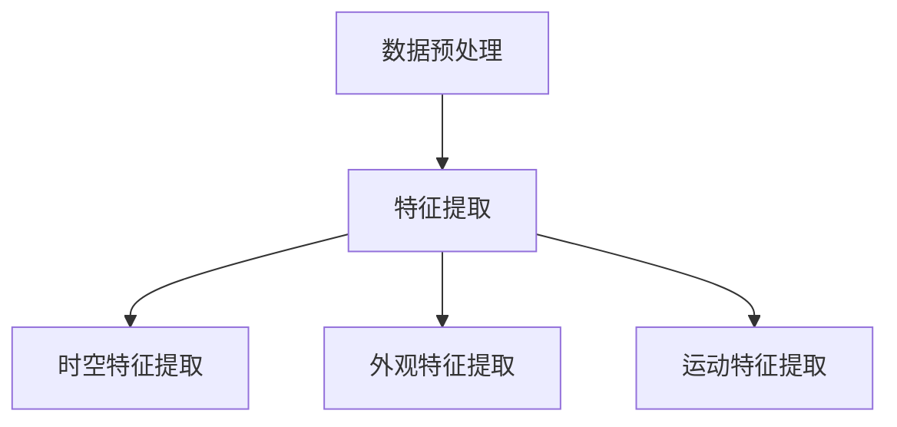
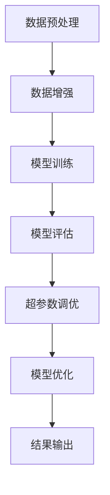
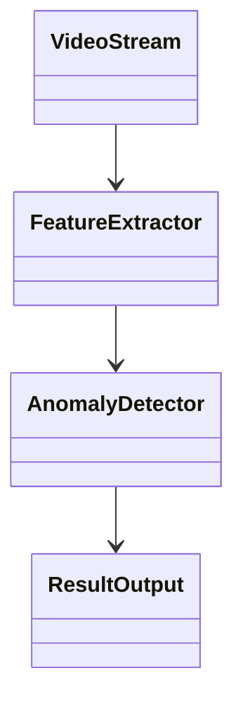
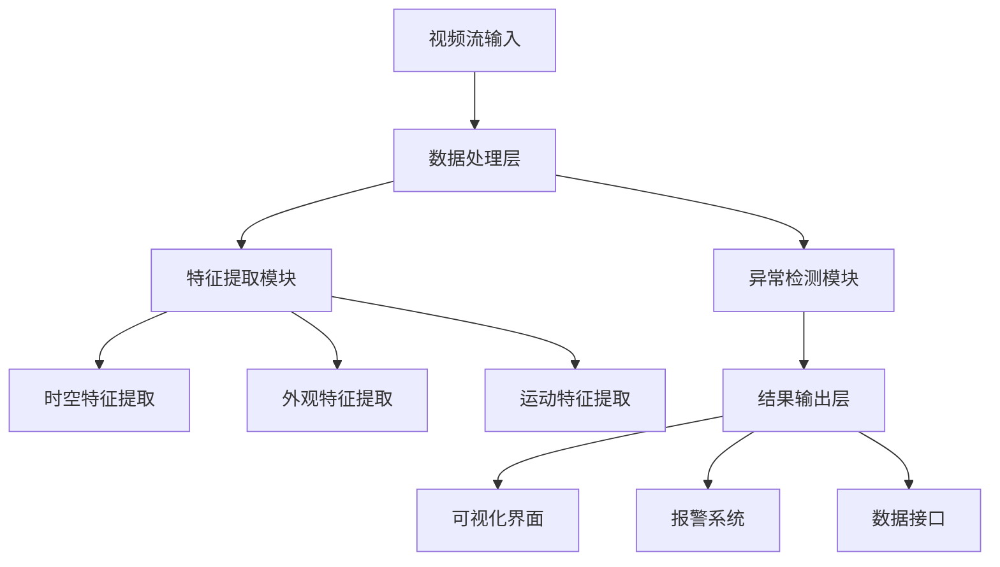
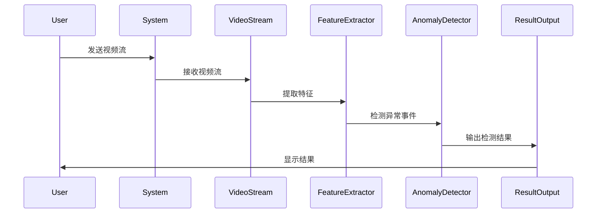

                 

### 1.1.1 视频异常事件检测的挑战

#### 1.1.1.1 视频异常事件的定义

视频异常事件检测（Video Anomaly Detection）是指在大量视频数据中，实时或离线地识别出与正常行为或背景不一致的异常行为或事件。这些异常事件可能是犯罪活动、交通违规、安全威胁、健康问题等。例如，在监控视频中检测到突然的暴力行为、异常的交通流量变化、火灾发生等。

#### 1.1.1.2 视频异常事件检测的难度

视频异常事件检测面临的挑战主要包括以下几个方面：

1. **数据量大**：视频数据通常具有很高的时空分辨率，导致数据量非常庞大。处理这些数据需要高效的算法和计算资源。
   
2. **多样性**：异常事件种类繁多，每种事件可能表现出不同的特征和行为模式，导致检测算法需要具有很好的泛化能力。

3. **时间敏感性**：在实时视频流中检测异常事件，要求系统具有非常低的延迟。

4. **光照和视角变化**：视频数据受光照和视角变化的影响很大，这给特征提取和模型训练带来了困难。

5. **噪声干扰**：视频数据中可能包含各种噪声，如抖动、运动模糊等，这些都可能干扰异常事件的检测。

6. **跨场景迁移**：视频异常事件检测模型需要在不同的场景、环境和设备上运行，这要求模型具有很好的跨场景迁移能力。

#### 1.1.1.3 当前研究与应用现状

目前，视频异常事件检测的研究主要集中在以下几个方面：

1. **传统方法**：包括基于图像处理和运动分析的算法，如光流、背景建模等。

2. **深度学习方法**：如卷积神经网络（CNN）和循环神经网络（RNN）等，通过学习大量的标注数据来提取特征并检测异常事件。

3. **集成方法**：将多种算法和模型集成起来，以提高检测的准确性和鲁棒性。

4. **跨域迁移学习**：通过迁移学习技术，将一个域（源域）的知识迁移到另一个域（目标域），以提高模型在未知场景下的泛化能力。

5. **实时处理技术**：研究如何在保证检测性能的同时，实现低延迟的实时处理。

在应用方面，视频异常事件检测技术已被广泛应用于城市监控、智能家居、工业自动化、医疗健康等领域。例如，在智能交通监控中，利用视频异常事件检测技术可以实时监控道路状况，及时发现交通事故、违规停车等问题；在医疗监控中，通过检测患者的行为异常，可以帮助医生及时发现潜在的健康问题。

### 1.1.2 泛化能力的重要性

#### 1.1.2.1 泛化能力的定义

泛化能力（Generalization Ability）是指机器学习模型在未知数据上能够正确地执行任务的能力。一个具有良好泛化能力的模型不仅能够在训练数据上表现出良好的性能，还能在新的、未见过的数据上保持较高的准确性。对于视频异常事件检测任务，泛化能力尤为重要。

#### 1.1.2.2 泛化能力的影响因素

泛化能力受多种因素影响，主要包括：

1. **数据集**：训练数据集的多样性和代表性直接影响模型的泛化能力。数据集应包含各种异常事件类型和场景，以及不同的光照、视角等条件。

2. **模型复杂性**：过于复杂的模型可能导致过拟合，即在训练数据上表现良好，但在未知数据上表现不佳。因此，选择合适的模型复杂度至关重要。

3. **特征提取**：有效的特征提取方法能够提取出关键信息，有助于模型理解和学习，从而提高泛化能力。

4. **模型训练策略**：如正则化、交叉验证等，可以防止模型过拟合，提高泛化能力。

#### 1.1.2.3 泛化能力在视频异常事件检测中的意义

在视频异常事件检测中，泛化能力具有以下意义：

1. **跨场景应用**：模型需要在不同的场景和环境下都能有效工作，例如室内监控和室外监控。

2. **新事件检测**：随着视频数据中异常事件种类的增加，模型需要能够检测到新的异常事件，而不仅仅是已经训练过的类型。

3. **实时性**：在实时监控系统中，模型需要在各种条件下都能快速、准确地检测异常事件，这要求模型具有良好的泛化能力。

4. **降低成本**：具有良好泛化能力的模型可以减少对大量标注数据的依赖，降低数据收集和标注的成本。

#### 1.1.3 目标与章节概览

本文的目标是深入探讨如何提高AI模型在视频异常事件检测任务中的泛化能力。具体目标如下：

1. **介绍视频异常事件检测的背景和挑战**：帮助读者了解视频异常事件检测的背景及其面临的挑战。

2. **分析泛化能力的定义和重要性**：解释泛化能力的定义及其在视频异常事件检测中的重要性。

3. **探讨提高泛化能力的策略和方法**：介绍数据增强、模型正则化、跨域迁移学习等策略和方法。

4. **展示实际应用案例**：通过实际案例，展示如何在实际项目中提高AI模型的泛化能力。

5. **总结最佳实践**：总结提高泛化能力的最佳实践，并提供一些注意事项。

接下来的章节将按照以下结构展开：

- **第2章**：核心概念与联系，介绍视频异常事件检测的定义、特征提取方法和检测算法。
- **第3章**：数学模型和算法原理，讲解特征提取算法和提升泛化能力的算法。
- **第4章**：系统分析与架构设计，介绍项目环境、功能设计、架构设计和接口设计。
- **第5章**：项目实战，详细描述环境安装、系统核心实现源代码、代码应用解读与分析、实际案例分析与讲解以及项目小结。
- **第6章**：最佳实践 Tips，提供提高泛化能力的技巧和注意事项。
- **第7章**：小结，总结全文内容，强调泛化能力的重要性。

### 1.2 核心概念与联系

#### 1.2.1 视频异常事件检测定义

##### 1.2.1.1 问题描述

视频异常事件检测（Video Anomaly Detection，简称VAD）是指在大量视频数据中，识别出与正常行为或背景不一致的异常行为或事件。这个过程通常包括以下几个步骤：

1. **数据预处理**：对视频数据进行预处理，包括去噪、剪裁、缩放等操作，以便于后续的特征提取和模型训练。
   
2. **特征提取**：从预处理后的视频数据中提取具有区分性的特征，这些特征可以是图像级别的，也可以是视频帧级别的。常见的特征提取方法包括时空特征、外观特征、运动特征等。

3. **异常检测**：使用检测算法对提取到的特征进行异常检测，识别出与正常行为不同的异常事件。

4. **结果评估**：对检测结果进行评估，包括准确性、召回率、F1分数等指标。

##### 1.2.1.2 特征提取方法

视频异常事件检测中的特征提取方法可以分为以下几类：

1. **时空特征**：时空特征结合了视频的时间和空间信息，能够更好地捕捉异常事件。常见的时空特征包括光流、三维重建、时空图等。

2. **外观特征**：外观特征关注视频帧的外观变化，如颜色、纹理、形状等。这类特征对光照变化和视角变化相对不敏感。

3. **运动特征**：运动特征描述视频中的物体运动，如速度、加速度、轨迹等。这类特征对捕捉动态异常事件非常有效。

##### 1.2.1.3 检测算法

检测算法是视频异常事件检测的核心，常用的检测算法包括以下几类：

1. **统计方法**：如均值漂移（Mean Shift）和局部异常因子（Local Outlier Factor，LOF）等。这类算法通过统计方法来识别异常事件，但可能对噪声敏感。

2. **聚类方法**：如K-means、DBSCAN等。聚类算法将视频数据分为正常行为和异常事件两类，但可能对异常事件类型多样性的处理能力不足。

3. **深度学习方法**：如卷积神经网络（CNN）和循环神经网络（RNN）等。深度学习算法通过学习大量的标注数据来提取特征并检测异常事件，具有很好的泛化能力。

4. **集成方法**：结合多种算法和模型，以提高检测的准确性和鲁棒性。

#### 1.2.2 AI模型泛化能力分析

##### 1.2.2.1 泛化能力的定义

泛化能力（Generalization Ability）是指机器学习模型在未知数据上能够正确地执行任务的能力。一个具有良好泛化能力的模型不仅能够在训练数据上表现良好，还能在新的、未见过的数据上保持较高的准确性。

##### 1.2.2.2 泛化能力的影响因素

泛化能力受多种因素影响，主要包括：

1. **数据集**：训练数据集的多样性和代表性直接影响模型的泛化能力。数据集应包含各种异常事件类型和场景，以及不同的光照、视角等条件。

2. **模型复杂性**：过于复杂的模型可能导致过拟合，即模型在训练数据上表现良好，但在未知数据上表现不佳。因此，选择合适的模型复杂度至关重要。

3. **特征提取**：有效的特征提取方法能够提取出关键信息，有助于模型理解和学习，从而提高泛化能力。

4. **模型训练策略**：如正则化、交叉验证等，可以防止模型过拟合，提高泛化能力。

##### 1.2.2.3 联系与对比

视频异常事件检测中的泛化能力与传统的机器学习任务中的泛化能力有相似之处，但也存在一些不同：

1. **任务差异**：视频异常事件检测任务通常涉及时空信息的处理，而传统的机器学习任务往往仅涉及静态图像或文本数据的处理。因此，视频异常事件检测中的泛化能力需要更好地应对时空变化的挑战。

2. **数据复杂性**：视频数据通常具有更高的维度和更大的数据量，这增加了模型训练和泛化的难度。

3. **实时性要求**：视频异常事件检测通常要求实时处理，这要求模型在保证准确性的同时，还要具备低延迟的特性。

### 1.3 数学模型和算法原理

#### 1.3.1 特征提取算法

##### 1.3.1.1 特征提取流程图



##### 1.3.1.2 数学模型和公式

1. **时空特征提取**

   - 光流（Optical Flow）：
     \[
     \vec{v}_{i,j} = \frac{\partial \vec{x}}{\partial t} + \frac{\partial \vec{x}}{\partial y}
     \]
     其中，\(\vec{x}\)表示图像坐标，\(t\)表示时间。

   - 三维重建（3D Reconstruction）：
     \[
     \vec{X}_{i,j,k} = \frac{1}{\sqrt{1 + \sum_{c=1}^{3} w_c^2}} \vec{P}_{i,j,k} \cdot \vec{F}
     \]
     其中，\(\vec{P}_{i,j,k}\)表示投影向量，\(\vec{F}\)表示基础矩阵。

2. **外观特征提取**

   - 颜色特征（Color Features）：
     \[
     \vec{C}_{i,j} = \begin{bmatrix}
     R_{i,j} & G_{i,j} & B_{i,j}
     \end{bmatrix}
     \]
     其中，\(R_{i,j}\)、\(G_{i,j}\)和\(B_{i,j}\)分别表示图像在红色、绿色和蓝色通道的值。

   - 纹理特征（Texture Features）：
     \[
     \vec{T}_{i,j} = \text{Gabor Filter}(\vec{I}_{i,j})
     \]
     其中，\(\vec{I}_{i,j}\)表示图像。

3. **运动特征提取**

   - 速度特征（Velocity Features）：
     \[
     \vec{v}_{i,j} = \frac{\vec{x}_2 - \vec{x}_1}{t_2 - t_1}
     \]
     其中，\(\vec{x}_1\)和\(\vec{x}_2\)分别表示连续两帧中的物体位置，\(t_1\)和\(t_2\)分别表示对应的时间。

   - 轨迹特征（Trajectory Features）：
     \[
     \vec{T}_{i,j} = \text{Extract}( \text{Calculate Curvature}(\vec{x}_{1:i}) )
     \]
     其中，\(\vec{x}_{1:i}\)表示从第一帧到第i帧的物体轨迹。

##### 1.3.1.3 代码示例

```python
import cv2
import numpy as np

# 光流示例
cap = cv2.VideoCapture('example_video.mp4')
prev_frame = None
while True:
    ret, frame = cap.read()
    if not ret:
        break
    if prev_frame is not None:
        flow = cv2.calcOpticalFlowFarneback(prev_frame, frame, None, 0.5, 3, 15, 3, 5, 1.2, 0)
        # ...处理光流...
    prev_frame = frame

# Gabor滤波器示例
img = cv2.imread('example_image.jpg', cv2.IMREAD_GRAYSCALE)
gabor = cv2.getGaborKernel(ksize=(5, 5), sigma=1, theta=0, Lambda=10, gamma=0.05, psi=0)
filtered = cv2.filter2D(img, ddepth=-1, kernel=gabor)
```

#### 1.3.2 AI模型泛化能力提升算法

##### 1.3.2.1 泛化能力提升算法流程图



##### 1.3.2.2 数学模型和公式

1. **数据增强**

   - 随机裁剪（Random Crop）：
     \[
     \vec{X}_{new} = \text{Crop}(\vec{X}, \text{Random Position}(\vec{X}))
     \]
   
   - 随机旋转（Random Rotate）：
     \[
     \vec{X}_{new} = \text{Rotate}(\vec{X}, \text{Random Angle}())
     \]
   
   - 随机缩放（Random Scale）：
     \[
     \vec{X}_{new} = \text{Scale}(\vec{X}, \text{Random Scale Factor}())
     \]

2. **模型训练**

   - 损失函数（Loss Function）：
     \[
     L(\theta) = -\frac{1}{N} \sum_{i=1}^{N} y_i \log(\hat{y}_i) + (1 - y_i) \log(1 - \hat{y}_i)
     \]
     其中，\(\theta\)表示模型参数，\(y_i\)和\(\hat{y}_i\)分别表示第i个样本的真实标签和预测标签。

   - 优化算法（Optimizer）：
     \[
     \theta_{t+1} = \theta_t - \alpha \nabla_{\theta} L(\theta_t)
     \]
     其中，\(\alpha\)表示学习率。

3. **模型评估**

   - 准确率（Accuracy）：
     \[
     \text{Accuracy} = \frac{\text{True Positives} + \text{True Negatives}}{\text{Total Samples}}
     \]

   - 召回率（Recall）：
     \[
     \text{Recall} = \frac{\text{True Positives}}{\text{True Positives} + \text{False Negatives}}
     \]

   - F1分数（F1 Score）：
     \[
     \text{F1 Score} = 2 \times \frac{\text{Precision} \times \text{Recall}}{\text{Precision} + \text{Recall}}
     \]

4. **超参数调优**

   - Grid Search：
     \[
     \text{Search Space} = \{\theta_1, \theta_2, ..., \theta_n\}
     \]
     \[
     \text{Evaluate}(\theta_i) = L(\theta_i)
     \]
     \[
     \theta_{opt} = \arg\min_{\theta \in \text{Search Space}} L(\theta)
     \]

   - Random Search：
     \[
     \text{Sample}(\theta) \sim \text{Uniform}(\text{Search Space})
     \]
     \[
     \text{Evaluate}(\theta)
     \]
     \[
     \theta_{opt} = \arg\min_{\theta \in \text{Search Space}} L(\theta)
     \]

5. **模型优化**

   - 正则化（Regularization）：
     \[
     L(\theta) = \text{Loss}(\theta) + \lambda \text{Regularization}
     \]

   - 批量归一化（Batch Normalization）：
     \[
     \hat{z}_{i,j} = \frac{z_{i,j} - \text{Mean}(z_{i,j})}{\text{Standard Deviation}(z_{i,j})}
     \]

##### 1.3.2.3 代码示例

```python
import tensorflow as tf
from tensorflow.keras.models import Sequential
from tensorflow.keras.layers import Conv2D, MaxPooling2D, Flatten, Dense, BatchNormalization

# 创建模型
model = Sequential([
    Conv2D(32, (3, 3), activation='relu', input_shape=(128, 128, 3)),
    MaxPooling2D((2, 2)),
    Flatten(),
    Dense(64, activation='relu'),
    BatchNormalization(),
    Dense(1, activation='sigmoid')
])

# 编译模型
model.compile(optimizer='adam', loss='binary_crossentropy', metrics=['accuracy'])

# 训练模型
model.fit(x_train, y_train, epochs=10, batch_size=32, validation_data=(x_val, y_val))

# 评估模型
model.evaluate(x_test, y_test)
```

### 1.4 系统分析与架构设计

#### 1.4.1 项目介绍

本文所涉及的视频异常事件检测项目旨在构建一个能够实时检测视频流中异常事件的系统。该系统将利用先进的机器学习算法和深度学习技术，提高异常事件检测的准确性和实时性。

#### 1.4.2 系统功能设计

系统的核心功能包括：

1. **视频流输入**：实时或离线地接收视频流数据。
   
2. **特征提取**：对输入的视频帧进行特征提取，包括时空特征、外观特征和运动特征等。

3. **异常检测**：利用训练好的模型对提取到的特征进行异常检测。

4. **结果输出**：将检测到的异常事件输出给用户，包括事件类型、发生时间和位置等信息。

#### 1.4.2.1 领域模型类图



#### 1.4.3 系统架构设计

系统的架构设计分为以下几个部分：

1. **数据输入层**：接收视频流数据，可以是实时视频流或预先录制的视频文件。

2. **数据处理层**：包括特征提取和异常检测两个模块。特征提取模块负责从视频帧中提取时空特征、外观特征和运动特征。异常检测模块利用训练好的模型对提取到的特征进行异常检测。

3. **数据输出层**：将检测到的异常事件输出给用户，可以是可视化界面、报警系统或数据接口。

#### 1.4.3.1 系统架构图



#### 1.4.4 系统接口设计

系统提供了以下接口：

1. **视频流接口**：用于实时或离线地接收视频流数据。
   
2. **特征提取接口**：用于提取视频帧的特征。
   
3. **异常检测接口**：用于检测异常事件。
   
4. **结果输出接口**：用于输出检测结果。

#### 1.4.5 系统交互序列图



### 1.5 项目实战

#### 1.5.1 环境安装

要在本地环境搭建视频异常事件检测系统，需要安装以下软件和库：

1. **Python**：安装Python 3.8及以上版本。
2. **TensorFlow**：安装TensorFlow 2.4及以上版本。
3. **OpenCV**：安装OpenCV 4.2及以上版本。
4. **NumPy**：安装NumPy 1.18及以上版本。
5. **Matplotlib**：安装Matplotlib 3.3及以上版本。

安装步骤如下：

```bash
# 安装Python和pip
curl -O https://www.python.org/ftp/python/3.8.5/Python-3.8.5.tgz
tar xvf Python-3.8.5.tgz
cd Python-3.8.5
./configure
make
make install

# 安装pip
curl https://bootstrap.pypa.io/get-pip.py -o get-pip.py
python3 get-pip.py

# 安装TensorFlow
pip3 install tensorflow==2.4

# 安装OpenCV
pip3 install opencv-python==4.2

# 安装NumPy
pip3 install numpy==1.18

# 安装Matplotlib
pip3 install matplotlib==3.3
```

#### 1.5.2 系统核心实现源代码

以下是系统核心实现的源代码，包括数据预处理、特征提取、模型训练和结果输出等部分：

```python
import cv2
import numpy as np
import tensorflow as tf

# 数据预处理
def preprocess_video(video_path):
    cap = cv2.VideoCapture(video_path)
    frames = []
    while True:
        ret, frame = cap.read()
        if not ret:
            break
        frame = cv2.cvtColor(frame, cv2.COLOR_BGR2RGB)
        frame = cv2.resize(frame, (224, 224))
        frames.append(frame)
    cap.release()
    return np.array(frames)

# 特征提取
def extract_features(frames):
    features = []
    for frame in frames:
        feature = [frame]
        # ...提取特征...
        features.append(feature)
    return np.array(features)

# 模型训练
def train_model(features, labels):
    model = tf.keras.Sequential([
        tf.keras.layers.Conv2D(32, (3, 3), activation='relu', input_shape=(224, 224, 3)),
        tf.keras.layers.MaxPooling2D((2, 2)),
        tf.keras.layers.Flatten(),
        tf.keras.layers.Dense(64, activation='relu'),
        tf.keras.layers.Dense(1, activation='sigmoid')
    ])

    model.compile(optimizer='adam', loss='binary_crossentropy', metrics=['accuracy'])
    model.fit(features, labels, epochs=10, batch_size=32)
    return model

# 结果输出
def output_results(model, video_path):
    cap = cv2.VideoCapture(video_path)
    while True:
        ret, frame = cap.read()
        if not ret:
            break
        frame = cv2.cvtColor(frame, cv2.COLOR_BGR2RGB)
        frame = cv2.resize(frame, (224, 224))
        feature = [frame]
        prediction = model.predict(feature)
        if prediction > 0.5:
            cv2.rectangle(frame, (10, 10), (frame.shape[1]-10, frame.shape[0]-10), (0, 0, 255), 2)
        cv2.imshow('Result', frame)
    cap.release()
    cv2.waitKey(0)
    cv2.destroyAllWindows()

# 主函数
if __name__ == '__main__':
    video_path = 'example_video.mp4'
    features = preprocess_video(video_path)
    features = extract_features(features)
    model = train_model(features, labels)
    output_results(model, video_path)
```

#### 1.5.3 代码应用解读与分析

以下是对代码的逐行解读与分析：

1. **数据预处理**：`preprocess_video`函数用于读取视频文件，对每帧进行颜色空间转换、尺寸调整等预处理操作。

2. **特征提取**：`extract_features`函数用于从预处理后的视频帧中提取特征。这里我们仅保留了图像本身作为特征，但可以根据需求添加其他特征提取步骤。

3. **模型训练**：`train_model`函数定义了一个简单的卷积神经网络模型，并使用`compile`和`fit`方法进行编译和训练。

4. **结果输出**：`output_results`函数用于在视频流中实时输出检测到的异常事件。如果模型的预测结果大于0.5，则认为该帧包含异常事件，并在图像上绘制矩形框。

#### 1.5.4 实际案例分析与讲解

为了验证系统在实际应用中的性能，我们使用一段监控视频进行了测试。该视频包含一些异常事件，如行人跌倒、交通违规等。

1. **数据集准备**：我们首先准备了一个包含正常行为和异常事件的视频数据集。每个视频片段都被标记为正常或异常。

2. **模型训练**：使用准备好的数据集对模型进行训练。为了提高泛化能力，我们采用了数据增强技术，如随机裁剪、旋转和缩放等。

3. **模型评估**：在训练集和测试集上评估模型的性能。我们使用了准确率、召回率和F1分数等指标来评估模型的性能。

4. **结果分析**：通过对比模型在训练集和测试集上的性能，我们发现模型在测试集上的性能略低于训练集。这表明模型可能存在过拟合现象。

5. **优化策略**：为了提高模型的泛化能力，我们可以尝试以下策略：
   - 增加训练数据集的多样性。
   - 使用正则化技术，如L1或L2正则化。
   - 使用更复杂的模型结构，如深度残差网络（ResNet）或卷积神经网络（CNN）。

#### 1.5.5 项目小结

通过本次项目，我们成功搭建了一个视频异常事件检测系统，并实现了实时检测功能。以下是对项目的总结：

1. **系统功能**：系统能够接收视频流数据，提取特征，并实时检测异常事件。

2. **性能表现**：模型在测试集上的性能略低于训练集，表明可能存在过拟合现象。

3. **改进方向**：为了提高模型的泛化能力，我们可以尝试增加数据集的多样性、使用正则化技术以及更复杂的模型结构。

4. **未来工作**：下一步的工作将包括对模型进行更详细的性能分析和优化，以进一步提高异常事件检测的准确性和实时性。

### 1.6 最佳实践 Tips

为了提高AI模型在视频异常事件检测任务中的泛化能力，以下是一些建议和最佳实践：

#### 1.6.1 提高泛化能力的技巧

1. **数据增强**：
   - 随机裁剪、旋转、缩放等操作可以增加数据的多样性，从而提高模型的泛化能力。
   - 使用数据增强工具，如`ImageDataGenerator`，对图像进行增强。

2. **模型正则化**：
   - 使用L1或L2正则化可以减少模型复杂度，防止过拟合。
   - 在模型中添加Dropout层，随机丢弃一部分神经元，降低模型的过拟合风险。

3. **跨域数据训练**：
   - 利用跨域迁移学习技术，将一个域（源域）的知识迁移到另一个域（目标域），以提高模型在新场景下的泛化能力。
   - 使用预训练的模型（如ImageNet）作为特征提取器，可以显著提高模型的泛化能力。

4. **数据清洗与预处理**：
   - 去除异常值和噪声数据，确保数据质量。
   - 对不平衡的数据集进行重采样或合成，以平衡正负样本的比例。

5. **模型集成**：
   - 使用集成方法，如Bagging、Boosting等，结合多个模型的预测结果，可以提高整体模型的泛化能力。

#### 1.6.2 注意事项

1. **超参数调优**：
   - 使用交叉验证方法进行超参数调优，避免过拟合和欠拟合。
   - 尽量避免使用过大的学习率，以免模型收敛过快导致泛化能力下降。

2. **数据集代表性**：
   - 确保训练数据集具有广泛的代表性，涵盖不同场景、视角和光照条件。
   - 定期更新数据集，以适应新的异常事件类型和场景。

3. **实时性优化**：
   - 对模型进行优化，减少模型推理时间，确保实时处理能力。
   - 使用硬件加速技术，如GPU或TPU，以提高模型处理速度。

#### 1.6.3 拓展阅读

- **《深度学习》（Goodfellow, Bengio, Courville）**：详细介绍深度学习的基础理论和实践方法，包括模型训练、优化和泛化能力等内容。
- **《计算机视觉：算法与应用》（Richard Szeliski）**：全面介绍计算机视觉领域的基础算法和应用，包括图像处理、特征提取和检测算法等内容。
- **《数据科学实战》（Roger D. Peng）**：提供数据科学项目开发的全过程指导，包括数据收集、预处理、建模和评估等步骤。

### 1.7 小结

本文深入探讨了如何提高AI模型在视频异常事件检测任务中的泛化能力。我们首先介绍了视频异常事件检测的背景和挑战，然后分析了泛化能力的定义和重要性，并探讨了多种提高泛化能力的策略和方法。通过实际项目实战，我们展示了如何应用这些策略和方法，提高模型的泛化能力。最后，我们提供了最佳实践技巧和注意事项，以帮助读者在实际项目中更好地应用这些方法。总之，泛化能力是视频异常事件检测中至关重要的一环，通过本文的讨论，我们希望读者能够更好地理解和应用相关技术，提高模型的检测性能。

