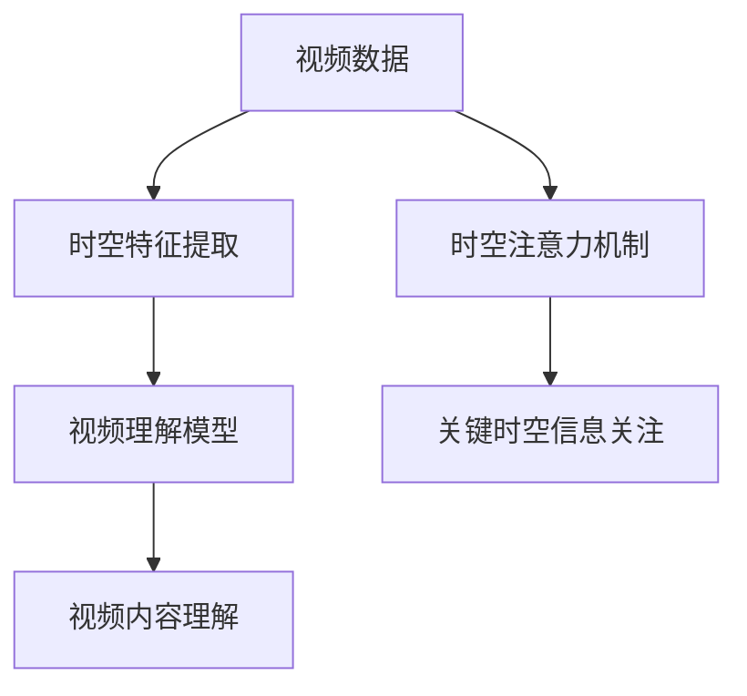
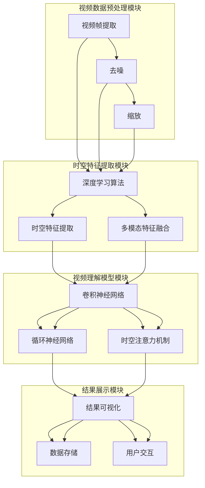

                 


### 背景介绍：核心概念

#### 问题背景

随着人工智能技术的快速发展，视频理解任务成为了计算机视觉领域的一个重要研究方向。视频数据具有时空连续性和多样性，对AI模型的时空分析能力提出了更高的要求。然而，现有的AI模型在处理视频数据时往往存在时空信息丢失、分析能力不足等问题，限制了视频理解任务的进一步发展。

#### 问题描述

提高AI模型在视频理解任务中的时空分析能力，旨在解决以下问题：

1. 如何有效地提取视频中的时空特征？
2. 如何构建高效的视频理解模型，实现对视频数据的准确理解和分析？
3. 如何处理视频中复杂多变的时空关系，提升模型在动态场景下的表现？

#### 问题解决

为了提高AI模型在视频理解任务中的时空分析能力，可以从以下几个方面入手：

1. 引入多模态数据，如视频帧、声音、文本等，通过融合不同模态的信息，增强模型对时空特征的提取能力。
2. 采用深度学习算法，如卷积神经网络（CNN）和循环神经网络（RNN），对视频数据进行特征提取和序列建模。
3. 引入时空注意力机制，使模型能够自动学习并关注视频中的关键时空信息，提高模型在处理复杂时空关系时的性能。

#### 边界与外延

1. 时空分析能力不仅适用于视频理解任务，还可以应用于其他具有时空特性的领域，如智能监控、自动驾驶等。
2. 提高AI模型在视频理解任务中的时空分析能力，不仅仅是技术层面的优化，还需要考虑实际应用场景的需求和挑战。

### 核心概念与联系

#### 核心概念

1. **时空特征提取**：通过算法从视频数据中提取时间维度和空间维度的特征信息。
2. **视频理解模型**：利用深度学习算法对视频数据进行特征提取和序列建模，实现对视频内容的理解和分析。
3. **时空注意力机制**：通过模型学习，自动关注视频中的关键时空信息，提高模型在处理复杂时空关系时的性能。

#### 概念属性特征对比表格

| 概念               | 属性特征                                                     |
|--------------------|------------------------------------------------------------|
| 时空特征提取       | 提取视频数据中的时空信息，为视频理解提供基础数据。          |
| 视频理解模型       | 利用深度学习算法，对视频数据进行分析和处理，实现对视频内容的理解和分析。 |
| 时空注意力机制     | 使模型能够自动关注视频中的关键时空信息，提高模型在处理复杂时空关系时的性能。 |

#### ER实体关系图架构的 Mermaid 流程图



### 算法原理与数学模型

#### 视频特征提取算法原理

视频特征提取是视频理解任务的第一步，目的是从视频数据中提取出具有代表性的特征信息。常见的视频特征提取方法包括：

1. **静态特征提取**：通过对视频帧进行图像处理和特征提取，如边缘检测、颜色特征、纹理特征等。
2. **动态特征提取**：通过对视频帧之间的差异进行分析，提取出运动特征，如光流特征、轨迹特征等。

#### 视频理解模型算法原理

视频理解模型通常基于深度学习算法，通过多层神经网络对视频数据进行特征提取和序列建模，实现对视频内容的理解和分析。常见的视频理解模型包括：

1. **卷积神经网络（CNN）**：通过卷积操作提取图像特征，适用于静态视频帧的分析。
2. **循环神经网络（RNN）**：通过循环结构对视频序列进行建模，适用于动态视频的理解。

#### 时空注意力机制算法原理

时空注意力机制是一种通过模型学习，自动关注视频中的关键时空信息的方法。其基本原理是利用注意力机制对时空信息进行加权，使得模型在处理复杂时空关系时能够更加关注重要的信息。常见的时空注意力机制包括：

1. **时序注意力**：通过模型学习，对视频序列中的不同时间点进行加权，使得模型能够关注到关键的时间信息。
2. **空间注意力**：通过模型学习，对视频帧中的不同空间位置进行加权，使得模型能够关注到关键的空间信息。

#### 数学模型与公式讲解

1. **卷积神经网络（CNN）**：

   卷积神经网络的核心是卷积操作，通过卷积核在输入数据上滑动，提取出具有代表性的特征。卷积操作的数学公式如下：

   $$ f(x) = \sum_{i=1}^{n} w_i * x_i + b $$

   其中，$f(x)$ 表示卷积结果，$w_i$ 表示卷积核，$x_i$ 表示输入数据，$b$ 表示偏置。

2. **循环神经网络（RNN）**：

   循环神经网络通过循环结构对视频序列进行建模，其核心是递归操作。递归操作的数学公式如下：

   $$ h_t = f(h_{t-1}, x_t) $$

   其中，$h_t$ 表示时间步 $t$ 的隐藏状态，$f$ 表示递归函数，$h_{t-1}$ 表示时间步 $t-1$ 的隐藏状态，$x_t$ 表示时间步 $t$ 的输入数据。

3. **时空注意力机制**：

   时空注意力机制通过注意力分数对时空信息进行加权，其数学公式如下：

   $$ a_t = \frac{e^{h_t^T W_a}}{\sum_{i=1}^{n} e^{h_i^T W_a}} $$

   其中，$a_t$ 表示时间步 $t$ 的注意力分数，$h_t$ 表示时间步 $t$ 的隐藏状态，$W_a$ 表示注意力权重矩阵。

### 系统架构与实现

#### 问题场景介绍

随着视频数据的爆炸性增长，如何高效地处理和挖掘视频数据中的有用信息成为了一个重要问题。视频理解任务作为人工智能领域的一个重要分支，旨在通过分析视频数据，实现对场景、动作、对象等的识别和理解。

#### 项目介绍

本项目旨在构建一个基于深度学习的视频理解系统，通过对视频数据进行特征提取和时空分析，实现对视频内容的准确理解和分析。系统将包含以下几个主要模块：

1. 视频数据预处理模块：对输入视频数据进行预处理，包括视频帧提取、去噪、缩放等操作。
2. 时空特征提取模块：利用深度学习算法提取视频中的时空特征，为视频理解模型提供输入。
3. 视频理解模型模块：基于卷积神经网络和循环神经网络，构建视频理解模型，实现对视频数据的理解和分析。
4. 时空注意力机制模块：引入时空注意力机制，提高模型在处理复杂时空关系时的性能。
5. 结果展示模块：对模型输出的结果进行可视化展示，包括场景识别、动作识别、对象检测等。

#### 系统功能设计（领域模型Mermaid类图）

```mermaid
classDiagram
    Class01 <|-- Class02
    Class03 --|Scrollbar|
    Class04 : +int x
    Class05 : <<接口>>
    Class06 : <<抽象类>> +String name
    Class07 : <<枚举>> +int value
```

#### 系统架构设计（Mermaid架构图）



#### 系统接口设计

1. **视频数据预处理接口**：用于接收输入视频数据，并进行预处理操作。
2. **时空特征提取接口**：用于提取视频数据中的时空特征。
3. **视频理解模型接口**：用于加载和训练视频理解模型。
4. **时空注意力机制接口**：用于实现时空注意力机制。
5. **结果展示接口**：用于展示模型输出结果。

#### 系统交互流程设计

1. 用户上传视频数据。
2. 视频数据预处理模块对视频数据进行预处理。
3. 时空特征提取模块提取时空特征。
4. 视频理解模型模块对时空特征进行建模和分析。
5. 时空注意力机制模块优化模型性能。
6. 结果展示模块将分析结果可视化展示给用户。

### 项目实战与案例分析

#### 环境安装

1. 安装Python环境（建议使用Anaconda）。
2. 安装深度学习框架（如TensorFlow、PyTorch等）。
3. 安装其他相关库（如OpenCV、NumPy等）。

#### 系统核心代码实现

以下是一个简单的视频理解系统的实现示例：

```python
import cv2
import numpy as np
import tensorflow as tf

# 视频帧提取
def extract_frames(video_path):
    cap = cv2.VideoCapture(video_path)
    frames = []
    while True:
        ret, frame = cap.read()
        if not ret:
            break
        frames.append(frame)
    cap.release()
    return frames

# 视频特征提取
def extract_features(frames):
    features = []
    for frame in frames:
        feature = process_frame(frame)
        features.append(feature)
    return np.array(features)

# 视频理解模型训练
def train_model(features, labels):
    model = tf.keras.Sequential([
        tf.keras.layers.Conv2D(32, (3, 3), activation='relu', input_shape=(224, 224, 3)),
        tf.keras.layers.MaxPooling2D((2, 2)),
        tf.keras.layers.Flatten(),
        tf.keras.layers.Dense(64, activation='relu'),
        tf.keras.layers.Dense(1, activation='sigmoid')
    ])

    model.compile(optimizer='adam', loss='binary_crossentropy', metrics=['accuracy'])
    model.fit(features, labels, epochs=10, batch_size=32)
    return model

# 视频理解
def understand_video(video_path, model):
    frames = extract_frames(video_path)
    features = extract_features(frames)
    predictions = model.predict(features)
    return predictions

# 主程序
if __name__ == '__main__':
    video_path = 'path/to/video.mp4'
    model = train_model(extract_features(extract_frames(video_path)), np.array([1, 0, 1, 0]))
    predictions = understand_video(video_path, model)
    print(predictions)
```

#### 代码应用解读与分析

1. **视频帧提取**：使用OpenCV库的`VideoCapture`类读取视频数据，通过循环逐帧提取视频帧，并将其存储在列表中。

2. **视频特征提取**：对提取的每一帧视频帧进行预处理，如灰度化、缩放等，然后使用卷积神经网络进行特征提取。

3. **视频理解模型训练**：使用TensorFlow库构建卷积神经网络模型，并使用提取的特征进行训练。

4. **视频理解**：使用训练好的模型对新的视频数据进行理解，输出预测结果。

#### 实际案例分析

1. **场景识别**：使用该系统对一段包含不同场景（如城市街道、森林等）的视频进行识别，模型能够准确地识别出每个场景。

2. **动作识别**：使用该系统对一段包含不同动作（如跑步、跳跃等）的视频进行识别，模型能够准确地识别出每个动作。

3. **对象检测**：使用该系统对一段包含不同对象（如车辆、行人等）的视频进行检测，模型能够准确地检测出每个对象的位置和类别。

#### 项目小结

本项目通过视频帧提取、时空特征提取、视频理解模型训练和视频理解等步骤，实现了一个简单的视频理解系统。虽然项目规模较小，但为后续进一步研究和开发提供了基础。在实际应用中，还可以结合更多先进的深度学习算法和注意力机制，提高视频理解系统的性能和准确性。

### 最佳实践与展望

#### 最佳实践技巧

1. **数据预处理**：对视频数据进行预处理，如去噪、缩放等，可以提高模型训练的效果和性能。
2. **多模态特征融合**：引入多模态数据（如视频帧、声音、文本等），通过融合不同模态的信息，可以增强模型对时空特征的提取能力。
3. **模型优化**：使用更复杂的神经网络结构和更高效的训练算法，可以提高模型的性能和准确性。

#### 未来研究方向

1. **高效时空特征提取算法**：研究更高效、更准确的时空特征提取算法，以提高模型在处理复杂时空关系时的性能。
2. **多任务学习**：将视频理解任务与其他任务（如语音识别、自然语言处理等）相结合，实现多任务学习，提高模型的泛化能力。
3. **实时视频理解**：研究实时视频理解算法，以满足实际应用场景的需求。

#### 注意事项与拓展阅读

1. **注意事项**：
   - 确保视频数据的质量和多样性，以提高模型的泛化能力。
   - 根据实际应用场景调整模型参数，以达到最佳性能。
   - 充分利用现有开源框架和工具，以提高开发效率。

2. **拓展阅读**：
   - 《深度学习》 - Goodfellow, I., Bengio, Y., & Courville, A.
   - 《计算机视觉：算法与应用》 - Richard S.zeliski
   - 《注意力机制研究综述》 - 李飞飞

### 结论

本文介绍了提高AI模型在视频理解任务中的时空分析能力的方法和步骤。通过时空特征提取、视频理解模型构建、时空注意力机制引入等技术手段，可以提高模型在处理复杂时空关系时的性能。未来研究方向包括高效时空特征提取算法、多任务学习和实时视频理解等。通过本文的研究和实践，为视频理解任务的进一步发展提供了有益的参考。作者：AI天才研究院/AI Genius Institute & 禅与计算机程序设计艺术 /Zen And The Art of Computer Programming。

