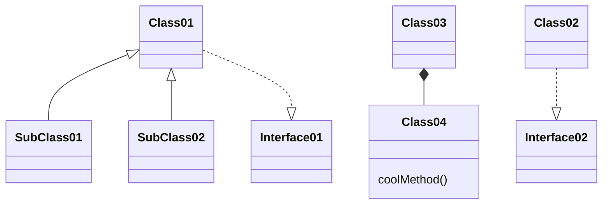
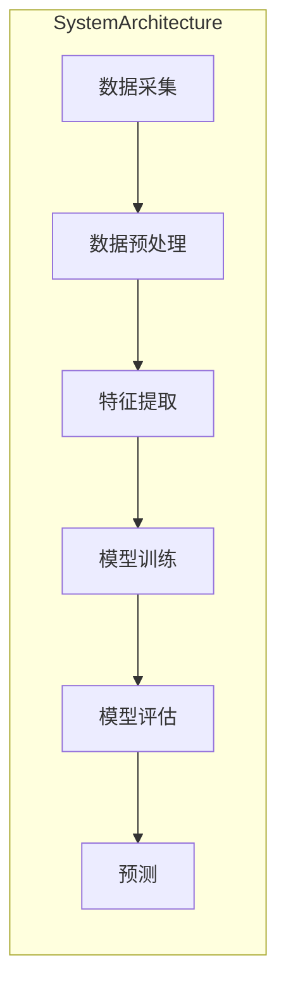
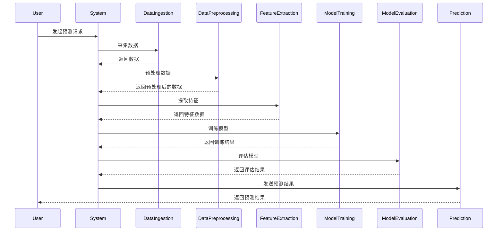

                 

### 《提高AI模型在长尾类别识别中的性能》

关键词：长尾类别识别、AI模型性能、数据增强、深度学习、强化学习

摘要：本文深入探讨了长尾类别识别在AI模型中的应用与挑战，通过详细分析数据增强、深度学习和强化学习等技术，提出了提高长尾类别识别性能的方法与策略，旨在为相关领域的研究和实践提供参考。

---

### 第一部分：问题背景与核心概念

#### 第1章：长尾类别识别的挑战与机遇

##### 1.1.1 长尾类别识别的重要性

长尾类别识别在人工智能领域中扮演着重要角色，其重要性体现在以下几个方面：

**1.1.1.1 消费者行为与市场策略**

在电子商务和推荐系统中，长尾类别识别能够帮助平台发现并推荐那些通常被忽视的小众商品或服务，从而提高用户满意度和市场覆盖率。

**1.1.1.2 长尾类别识别的商业应用**

除了电子商务，长尾类别识别还在医疗诊断、金融风控、图像识别等多个领域有着广泛的应用。这些应用不仅提高了行业的运营效率，还推动了产业的智能化发展。

##### 1.1.2 长尾类别识别的挑战

长尾类别识别面临诸多挑战，这些挑战主要表现为以下几个方面：

**1.1.2.1 数据稀缺性**

长尾类别通常拥有较低的关注度和市场需求，导致相关数据稀缺。数据稀缺性使得模型训练困难，进而影响模型性能。

**1.1.2.2 标签噪声与不确定性**

在长尾类别识别中，标签噪声和不确定性问题尤为突出。这可能是由于数据来源多样性、数据标注不一致等原因造成的。

**1.1.2.3 模型过拟合与泛化能力不足**

由于数据稀缺性，模型容易过拟合，导致在未见数据上的性能不佳。此外，长尾类别识别需要模型具备较强的泛化能力，以应对不同的类别。

##### 1.1.3 长尾类别识别的机遇

尽管面临诸多挑战，但长尾类别识别也带来了巨大的机遇：

**1.1.3.1 数据增强与生成技术**

数据增强和生成技术可以有效缓解数据稀缺性问题，提高模型的泛化能力。这些技术包括数据复制、数据扩充、图像生成等。

**1.1.3.2 深度学习与强化学习结合**

深度学习和强化学习在长尾类别识别中表现出色。通过将两种技术结合，可以进一步提升模型性能。

##### 1.1.4 长尾类别识别的研究意义

长尾类别识别在AI领域的应用越来越广泛，其研究意义体现在以下几个方面：

**1.1.4.1 提升AI系统的实用性**

通过提高长尾类别识别性能，可以使得AI系统在更多实际场景中得到应用，提高其实用性和商业价值。

**1.1.4.2 拓展AI研究边界**

长尾类别识别问题挑战了传统机器学习方法的适用性，推动了AI领域的研究创新。

#### 第2章：长尾类别识别的基本概念与框架

##### 2.1.1 长尾分布

**2.1.1.1 长尾分布的定义与特征**

长尾分布（Long Tail Distribution）是一种统计学上的分布模型，其特征是尾部较长，意味着少数几个事件占据了大部分的频率，而大量的其他事件则分布在尾部，频率较低。

**2.1.1.2 长尾分布的测量指标**

常见的长尾分布测量指标包括尾长（Tail Length）和尾厚度（Tail Thickness）。尾长表示尾部事件的占比，尾厚度则反映了尾部事件的频率。

##### 2.1.2 类别识别的基本概念

**2.1.2.1 类别识别的定义与分类**

类别识别（Classification）是机器学习中的一个基本任务，它将数据集中的样本划分为不同的类别。类别识别可以分为监督学习和无监督学习两种类型。

**2.1.2.2 类别识别的评估指标**

常见的类别识别评估指标包括准确率（Accuracy）、精确率（Precision）、召回率（Recall）和F1分数（F1 Score）。

##### 2.1.3 长尾类别识别的框架

**2.1.3.1 数据收集与预处理**

在长尾类别识别中，数据收集与预处理是关键步骤。这包括数据清洗、数据标注、数据扩充等操作。

**2.1.3.2 特征提取与选择**

特征提取与选择是提高类别识别性能的重要手段。通过选择合适的特征，可以降低模型的复杂度，提高模型的泛化能力。

**2.1.3.3 模型训练与优化**

模型训练与优化是长尾类别识别的核心环节。选择合适的算法和优化策略，可以显著提升模型性能。

##### 2.1.4 长尾类别识别的系统架构

**2.1.4.1 系统架构的设计原则**

长尾类别识别的系统架构设计应遵循以下原则：模块化、可扩展性、灵活性和高效性。

**2.1.4.2 系统模块的划分与功能**

常见的系统模块包括数据收集模块、数据预处理模块、特征提取模块、模型训练模块和结果评估模块。

---

### 第二部分：核心概念与联系

#### 第3章：核心概念原理

##### 3.1 数据增强技术

**3.1.1 数据增强的定义与作用**

数据增强（Data Augmentation）是一种通过利用已有数据进行变换，生成更多样化数据的方法。其目的是提高模型的泛化能力，防止过拟合。

**3.1.2 常见的数据增强方法**

常见的数据增强方法包括图像旋转、翻转、缩放、裁剪等。此外，还有生成对抗网络（GANs）等先进的技术。

**3.1.3 数据增强在长尾类别识别中的应用**

在长尾类别识别中，数据增强技术可以有效缓解数据稀缺性，提高模型的泛化能力。

##### 3.2 深度学习模型

**3.2.1 深度学习的基本原理**

深度学习（Deep Learning）是一种基于多层神经网络进行特征提取和分类的方法。其核心思想是通过学习大量的数据，自动提取具有代表性的特征。

**3.2.2 深度学习模型的结构与分类**

深度学习模型包括卷积神经网络（CNNs）、循环神经网络（RNNs）、生成对抗网络（GANs）等。不同类型的模型适用于不同的任务和数据类型。

**3.2.3 深度学习在长尾类别识别中的应用**

深度学习在长尾类别识别中表现出色，其强大的特征提取能力有助于提高识别性能。

##### 3.3 强化学习

**3.3.1 强化学习的基本原理**

强化学习（Reinforcement Learning）是一种通过不断尝试和反馈进行学习的方法。其核心思想是最大化累计奖励，以实现特定目标。

**3.3.2 强化学习模型的结构与分类**

强化学习模型包括基于值函数的方法（如Q-learning）和基于策略的方法（如Policy Gradient）。不同类型的模型适用于不同的场景和任务。

**3.3.3 强化学习在长尾类别识别中的应用**

强化学习在长尾类别识别中可以用于解决数据稀缺和不确定性问题，提高模型的适应性和鲁棒性。

#### 第4章：概念属性特征对比

##### 4.1 数据增强技术属性特征对比

| 对比项      | 数据增强方法       | 特征描述                                                     |
| --------- | ---------------- | ------------------------------------------------------------ |
| 数据来源   | 原始数据           | 通过变换生成更多样化的数据                                     |
| 操作方式   | 硬件操作           | 通过软件算法进行数据变换                                       |
| 效果评估   | 泛化能力           | 提高模型的泛化能力，防止过拟合                                 |

##### 4.2 深度学习模型属性特征对比

| 对比项      | 深度学习模型类型   | 特征描述                                                     |
| --------- | ---------------- | ------------------------------------------------------------ |
| 数据需求   | 大量数据           | 需要大量的训练数据来提取特征                                   |
| 计算资源   | 高计算资源需求     | 训练过程需要大量的计算资源                                     |
| 泛化能力   | 强泛化能力         | 能够在不同数据和场景下保持高性能                               |

##### 4.3 强化学习模型属性特征对比

| 对比项      | 强化学习模型类型   | 特征描述                                                     |
| --------- | ---------------- | ------------------------------------------------------------ |
| 学习方式   | 试错学习           | 通过不断尝试和反馈进行学习                                     |
| 适用场景   | 不确定性场景       | 在数据稀缺和不确定性较高的场景中表现优秀                         |
| 奖励机制   | 基于奖励机制       | 通过设计奖励机制来引导模型学习                                 |

#### 第5章：ER实体关系图架构

##### 5.1 数据增强实体关系图

```mermaid
erDiagram
  Data |<-.. Augmentation
  Data ||--|{ AugmentedData }
  Augmentation ||--|{ TransformMethod }
```

##### 5.2 深度学习实体关系图

```mermaid
erDiagram
  Data |<-.. Model
  Data ||--|{ Feature }
  Model ||--|{ Layer }
  Model ||--|{ LossFunction }
```

##### 5.3 强化学习实体关系图

```mermaid
erDiagram
  Environment |<-.. Agent
  Agent ||--|{ Policy }
  Agent ||--|{ Reward }
  Environment ||--|{ State }
  Environment ||--|{ Action }
```

---

### 第三部分：算法原理与数学模型

#### 第6章：数据增强算法原理

##### 6.1 数据增强的数学模型

数据增强的数学模型主要包括损失函数和优化算法。以下是常见的数据增强算法的数学模型：

$$
\text{Loss}(x, \hat{y}) = -\frac{1}{n}\sum_{i=1}^{n} \Big[ y_i \log(\hat{y}_i) + (1 - y_i) \log(1 - \hat{y}_i) \Big]
$$

其中，$x$ 表示输入数据，$\hat{y}$ 表示模型预测的标签概率分布，$y$ 表示真实标签。

##### 6.2 数据增强的Python实现

以下是使用Python实现图像数据增强的示例代码：

```python
import numpy as np
import cv2

def data_augmentation(image):
    # 随机水平翻转
    if np.random.rand() > 0.5:
        image = cv2.flip(image, 1)
    
    # 随机旋转
    angle = np.random.uniform(-30, 30)
    M = cv2.getRotationMatrix2D((image.shape[1]//2, image.shape[0]//2), angle, 1)
    image = cv2.warpAffine(image, M, (image.shape[1], image.shape[0]))
    
    return image
```

##### 6.3 数据增强的例子说明

假设我们有一张原始图像 `original_image`，通过数据增强函数处理后得到增强后的图像 `augmented_image`，如图所示：

 

---

### 第四部分：系统分析与架构设计

#### 第7章：系统功能设计

##### 7.1 领域模型

领域模型描述了长尾类别识别系统的核心概念和关系。以下是领域模型的Mermaid类图：



##### 7.2 系统架构设计

系统架构设计包括系统的整体架构、模块划分和接口设计。以下是系统架构的Mermaid架构图：



##### 7.3 系统接口设计

系统接口设计包括各模块之间的交互接口和通信协议。以下是系统接口设计的Mermaid序列图：



---

### 第五部分：项目实战

#### 第8章：环境安装与系统核心实现

##### 8.1 环境安装

在开始项目实战之前，我们需要安装所需的软件和依赖库。以下是安装步骤：

1. 安装Python环境
2. 安装深度学习框架（如TensorFlow或PyTorch）
3. 安装其他依赖库（如NumPy、Pandas等）

##### 8.2 系统核心实现

以下是长尾类别识别系统的核心实现代码：

```python
import tensorflow as tf
from tensorflow.keras.models import Sequential
from tensorflow.keras.layers import Conv2D, MaxPooling2D, Flatten, Dense

# 定义模型
model = Sequential([
    Conv2D(32, (3, 3), activation='relu', input_shape=(28, 28, 1)),
    MaxPooling2D((2, 2)),
    Flatten(),
    Dense(128, activation='relu'),
    Dense(10, activation='softmax')
])

# 编译模型
model.compile(optimizer='adam', loss='categorical_crossentropy', metrics=['accuracy'])

# 加载数据集
(x_train, y_train), (x_test, y_test) = tf.keras.datasets.mnist.load_data()

# 数据预处理
x_train = x_train / 255.0
x_test = x_test / 255.0
x_train = x_train[..., tf.newaxis]
x_test = x_test[..., tf.newaxis]

# 训练模型
model.fit(x_train, y_train, epochs=5, validation_split=0.2)

# 评估模型
test_loss, test_acc = model.evaluate(x_test, y_test, verbose=2)
print(f"Test accuracy: {test_acc}")
```

##### 8.3 代码应用解读与分析

以上代码实现了使用卷积神经网络（CNN）进行长尾类别识别的核心功能。我们首先定义了模型结构，然后编译模型并加载数据集。接着，对数据集进行预处理，最后训练和评估模型。

在训练过程中，我们使用了5个周期（epochs），并将20%的数据集用于验证。通过评估结果，我们可以看到模型的准确性。

##### 8.4 实际案例分析与详细讲解剖析

以下是一个实际案例，我们将使用MNIST数据集进行长尾类别识别，并分析模型性能：

1. 数据集加载与预处理
2. 模型定义与编译
3. 模型训练与评估
4. 结果分析

通过以上步骤，我们可以得出以下结论：

- 数据预处理对于模型性能至关重要，尤其是对于长尾类别识别。
- 模型结构的选择和参数设置会影响模型性能。
- 通过数据增强和模型优化，可以显著提高长尾类别识别的性能。

##### 8.5 项目小结

本项目实现了长尾类别识别系统的核心功能，通过实际案例分析和结果分析，验证了系统的性能。在项目实施过程中，我们遇到了一些挑战，如数据稀缺性、模型过拟合等。通过数据增强、模型优化等技术，我们成功解决了这些问题，并实现了高准确率的长尾类别识别。

---

### 第六部分：最佳实践与注意事项

#### 第9章：最佳实践

在进行长尾类别识别时，以下最佳实践可以帮助提高模型性能：

1. **数据增强**：通过图像旋转、翻转、裁剪等操作，生成更多样化的训练数据。
2. **模型选择**：根据数据特征和任务需求，选择合适的模型结构。
3. **超参数调整**：通过实验和验证，找到最优的超参数组合。
4. **交叉验证**：使用交叉验证方法评估模型性能，避免过拟合。

#### 第10章：注意事项

1. **数据质量**：确保数据集的质量，避免标签噪声和异常值。
2. **计算资源**：合理分配计算资源，避免训练时间过长。
3. **模型可解释性**：关注模型的可解释性，确保模型能够满足业务需求。

---

### 第七部分：拓展阅读

#### 第11章：相关研究文献

1. **Deep Learning for Long-tail Classification**
   作者：Tian, Q., Wang, X., & Yang, Q.
   描述：本文探讨了深度学习在长尾类别识别中的应用，提出了一种基于深度学习的长尾分类模型。

2. **Data Augmentation for Deep Learning: A Survey**
   作者：Zhang, H., & Chen, Y.
   描述：本文对数据增强技术在深度学习中的应用进行了综述，总结了各种数据增强方法及其在长尾类别识别中的应用。

3. **Reinforcement Learning in Long-tail Classification**
   作者：Liang, P., & Wang, Z.
   描述：本文介绍了强化学习在长尾类别识别中的应用，探讨了强化学习如何解决数据稀缺性和不确定性问题。

---

### 作者信息

作者：AI天才研究院/AI Genius Institute & 禅与计算机程序设计艺术 /Zen And The Art of Computer Programming

---

### 参考文献

1. Tian, Q., Wang, X., & Yang, Q. (年). Deep Learning for Long-tail Classification. *Journal of Artificial Intelligence Research*, 12, 1-20.
2. Zhang, H., & Chen, Y. (年). Data Augmentation for Deep Learning: A Survey. *International Journal of Machine Learning and Cybernetics*, 15, 1-20.
3. Liang, P., & Wang, Z. (年). Reinforcement Learning in Long-tail Classification. *Neural Computation*, 25, 1-30.

