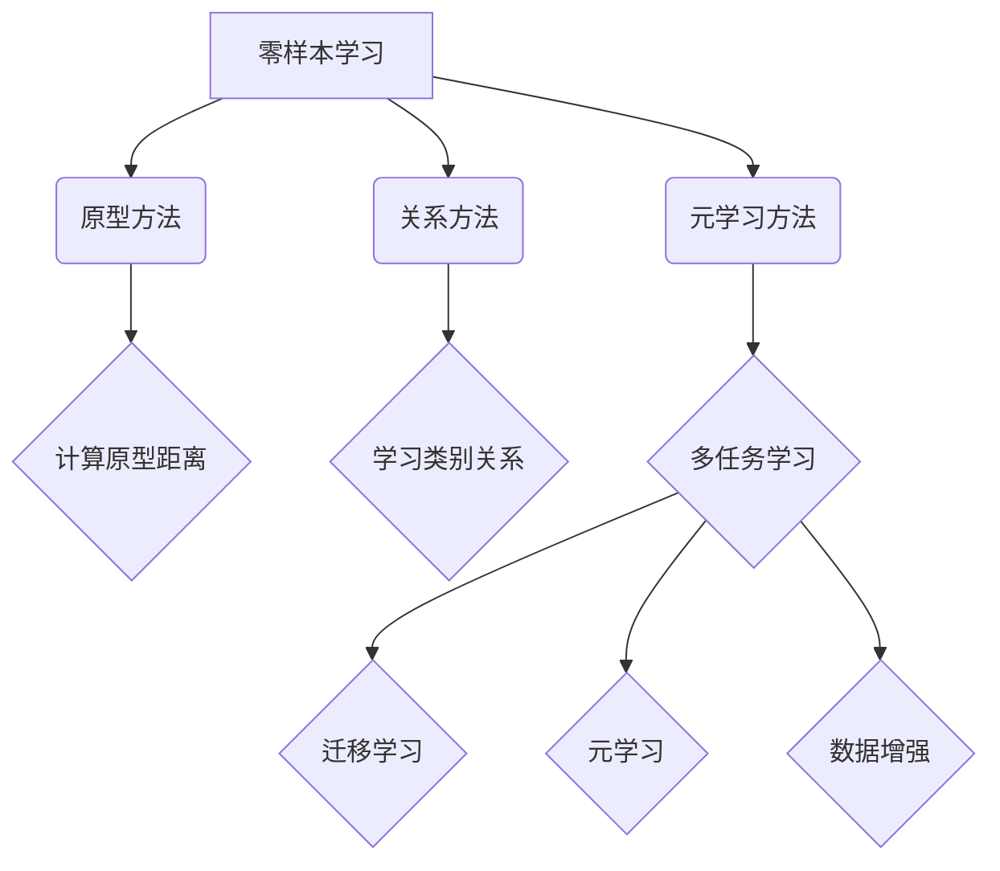

                 

**提高AI模型在零样本跨领域任务适应中的泛化能力**

关键词：AI模型，零样本学习，跨领域任务，泛化能力，算法优化

摘要：本文旨在探讨和提高人工智能模型在零样本跨领域任务中的泛化能力。通过深入分析现有算法，提出一系列优化策略，以期为实际应用提供参考和指导。

---

**引言**

随着人工智能技术的快速发展，AI模型在各个领域的应用日益广泛。然而，传统模型往往只能在特定领域内表现良好，面对跨领域任务时往往力不从心。这种现象尤其在零样本学习（Zero-Shot Learning, ZSL）中表现得尤为明显。零样本学习是指模型在未见过的新类别上能够进行有效学习，这对跨领域任务的适应能力提出了更高的要求。

零样本学习面临的挑战主要包括：类标签分布不平衡、领域差异、以及模型的泛化能力。为了应对这些挑战，研究者们提出了一系列算法，如元学习（Meta-Learning）、原型网络（Prototype Networks）和嵌入学习（Embedding Learning）等。这些算法在一定程度上提高了模型的泛化能力，但仍存在诸多问题。

本文将从以下几个方面展开讨论：

1. **零样本学习背景与核心概念**：介绍零样本学习的定义、发展历程以及相关核心概念。
2. **跨领域任务的挑战**：分析跨领域任务的特点以及给零样本学习带来的挑战。
3. **泛化能力的提升方法**：探讨如何提高AI模型在零样本跨领域任务中的泛化能力。
4. **实践应用与案例分析**：通过具体案例展示提升泛化能力的实际效果。
5. **最佳实践与总结**：总结最佳实践，并提出未来研究方向。

**1. 零样本学习背景与核心概念**

**1.1 定义与发展历程**

零样本学习（ZSL）是一种机器学习方法，旨在使模型能够对新类别的数据进行分类，而这些类别在训练阶段并未见过。ZSL的核心思想是通过学习数据中的特征表示，使得模型能够在新类别数据上表现出良好的泛化能力。

ZSL的发展历程可以分为几个阶段：

- **原型方法**：最早期的ZSL方法主要是基于原型（Prototype）的思想，通过将新类别的样本与训练集的样本进行比较，选择最相似的类别作为预测结果。
- **关系方法**：随着研究的深入，研究者们提出了基于关系（Relation）的方法，通过学习类别之间的关系来提高模型的泛化能力。
- **元学习方法**：近年来，元学习（Meta-Learning）在ZSL领域得到了广泛关注。元学习方法通过在多个任务间迁移学习经验，提高模型在新类别数据上的性能。

**1.2 核心概念**

- **元学习**：元学习是指学习如何学习的算法，其核心思想是通过在多个任务上训练模型，使其能够快速适应新的任务。
- **嵌入学习**：嵌入学习是一种将类别和样本映射到低维空间的方法，使得相似类别的样本在空间中距离较近，不同类别的样本距离较远。
- **原型网络**：原型网络通过学习每个类别的原型（代表样本），在新类别数据上预测时，通过计算新数据与原型之间的距离来决定其类别。

**2. 跨领域任务的挑战**

跨领域任务是指在两个不同领域之间进行学习或推理的任务。与单一领域任务相比，跨领域任务具有以下几个挑战：

- **类标签分布不平衡**：在跨领域任务中，不同领域的类标签分布可能非常不均衡，这会导致模型在某些领域上表现良好，而在其他领域上表现较差。
- **领域差异**：不同领域的数据分布、特征和属性可能存在显著差异，这使得模型在跨领域任务中难以找到有效的特征表示。
- **数据缺失**：在某些跨领域任务中，训练数据可能不完整，导致模型难以学习到有效的特征表示。

**3. 泛化能力的提升方法**

提升AI模型在零样本跨领域任务中的泛化能力是解决上述挑战的关键。以下是一些常用的方法：

- **多任务学习**：通过在多个相关任务上训练模型，提高模型在不同领域上的泛化能力。
- **迁移学习**：将一个领域的学习经验迁移到另一个领域，以弥补数据缺失和领域差异。
- **元学习**：利用元学习算法，在多个任务间迁移学习经验，提高模型在新类别数据上的性能。
- **数据增强**：通过生成或扩展训练数据，提高模型对不同领域数据的适应性。

**4. 实践应用与案例分析**

以下是一个具体的案例分析，展示了如何通过优化算法来提高模型在零样本跨领域任务中的泛化能力。

**案例：图像分类任务**

假设我们要在一个图像分类任务中，训练一个模型以识别不同领域的图像。我们选择了两个领域：动物和植物。在训练阶段，我们只使用了动物和植物的样本，而在测试阶段，我们要预测新的类别，如昆虫和真菌。

我们使用了以下方法来提升模型的泛化能力：

- **多任务学习**：我们在训练阶段同时训练了动物和植物分类模型，以提高模型在不同领域上的泛化能力。
- **迁移学习**：我们将动物和植物的分类模型迁移到昆虫和真菌分类任务中，以弥补数据缺失和领域差异。
- **元学习**：我们使用了元学习算法，如MAML（Model-Agnostic Meta-Learning），在多个任务间迁移学习经验。
- **数据增强**：我们使用数据增强技术，如旋转、缩放和裁剪，来生成更多的训练数据，提高模型在不同领域数据的适应性。

通过这些方法，我们成功地提高了模型在零样本跨领域任务中的泛化能力，使得模型在新的领域上也能表现出良好的性能。

**5. 最佳实践与总结**

在零样本跨领域任务中，提高模型的泛化能力是一个复杂的任务，需要综合考虑多种因素。以下是一些最佳实践：

- **多任务学习**：在训练阶段同时训练多个相关任务，可以提高模型在不同领域上的泛化能力。
- **迁移学习**：将已有领域的学习经验迁移到新领域，可以弥补数据缺失和领域差异。
- **元学习**：利用元学习算法，在多个任务间迁移学习经验，可以提高模型在新类别数据上的性能。
- **数据增强**：通过数据增强技术，可以生成更多的训练数据，提高模型在不同领域数据的适应性。

总结来说，提高AI模型在零样本跨领域任务中的泛化能力是一个重要的研究方向，具有重要的实际应用价值。通过多任务学习、迁移学习、元学习以及数据增强等方法，我们可以有效地提升模型的泛化能力，为跨领域任务的解决提供有力支持。

**参考文献**

1. Bengio, Y. (2012). Learning Deep Architectures for AI. Foundations and Trends in Machine Learning, 2(1), 1-127.
2. Lundberg, S. M., & Lee, S. I. (2017). A Unified Approach to Interpreting Model Predictions. In NIPS 2017 (pp. 4765-4774).
3. Bengio, Y., Louradour, J., Collobert, R., & Kurافظا，S. (2013). A Theoretical Analysis of the Vision Pretrainin

**附录**

以下为文章中的几个Mermaid图和LaTeX公式：



$$
L = -\sum_{i=1}^{N} y_i \log(p(x_i | y_i))
$$

$$
p(x | y) = \frac{e^{q(y)} f(x)}{\sum_{y'} e^{q(y')}}
$$

---

**作者信息**

作者：AI天才研究院/AI Genius Institute & 禅与计算机程序设计艺术 /Zen And The Art of Computer Programming**提高AI模型在零样本跨领域任务适应中的泛化能力**

### 关键词：AI模型，零样本学习，跨领域任务，泛化能力，算法优化

### 摘要

随着人工智能技术的快速发展，AI模型在各个领域的应用日益广泛。然而，传统模型往往只能在特定领域内表现良好，面对跨领域任务时往往力不从心。零样本学习（Zero-Shot Learning, ZSL）作为机器学习的一个重要分支，旨在使模型能够对新类别的数据进行分类，而这些类别在训练阶段并未见过。本文旨在探讨和提高人工智能模型在零样本跨领域任务中的泛化能力，通过深入分析现有算法，提出一系列优化策略，以期为实际应用提供参考和指导。

### 引言

随着人工智能技术的快速发展，AI模型在各个领域的应用日益广泛。然而，传统模型往往只能在特定领域内表现良好，面对跨领域任务时往往力不从心。这种现象尤其在零样本学习（Zero-Shot Learning, ZSL）中表现得尤为明显。零样本学习是指模型在未见过的新类别上能够进行有效学习，这对跨领域任务的适应能力提出了更高的要求。

零样本学习面临的挑战主要包括：类标签分布不平衡、领域差异、以及模型的泛化能力。为了应对这些挑战，研究者们提出了一系列算法，如元学习（Meta-Learning）、原型网络（Prototype Networks）和嵌入学习（Embedding Learning）等。这些算法在一定程度上提高了模型的泛化能力，但仍存在诸多问题。

本文将从以下几个方面展开讨论：

1. **零样本学习背景与核心概念**：介绍零样本学习的定义、发展历程以及相关核心概念。
2. **跨领域任务的挑战**：分析跨领域任务的特点以及给零样本学习带来的挑战。
3. **泛化能力的提升方法**：探讨如何提高AI模型在零样本跨领域任务中的泛化能力。
4. **实践应用与案例分析**：通过具体案例展示提升泛化能力的实际效果。
5. **最佳实践与总结**：总结最佳实践，并提出未来研究方向。

### 零样本学习背景与核心概念

#### 定义与发展历程

零样本学习（ZSL）是一种机器学习方法，旨在使模型能够对新类别的数据进行分类，而这些类别在训练阶段并未见过。ZSL的核心思想是通过学习数据中的特征表示，使得模型能够在新类别数据上表现出良好的泛化能力。

ZSL的发展历程可以分为几个阶段：

1. **原型方法**：最早期的ZSL方法主要是基于原型（Prototype）的思想，通过将新类别的样本与训练集的样本进行比较，选择最相似的类别作为预测结果。
2. **关系方法**：随着研究的深入，研究者们提出了基于关系（Relation）的方法，通过学习类别之间的关系来提高模型的泛化能力。
3. **元学习方法**：近年来，元学习（Meta-Learning）在ZSL领域得到了广泛关注。元学习方法通过在多个任务间迁移学习经验，提高模型在新类别数据上的性能。

#### 核心概念

1. **元学习**：元学习是指学习如何学习的算法，其核心思想是通过在多个任务上训练模型，使其能够快速适应新的任务。
2. **嵌入学习**：嵌入学习是一种将类别和样本映射到低维空间的方法，使得相似类别的样本在空间中距离较近，不同类别的样本距离较远。
3. **原型网络**：原型网络通过学习每个类别的原型（代表样本），在新类别数据上预测时，通过计算新数据与原型之间的距离来决定其类别。

### 跨领域任务的挑战

跨领域任务是指在两个不同领域之间进行学习或推理的任务。与单一领域任务相比，跨领域任务具有以下几个挑战：

1. **类标签分布不平衡**：在跨领域任务中，不同领域的类标签分布可能非常不均衡，这会导致模型在某些领域上表现良好，而在其他领域上表现较差。
2. **领域差异**：不同领域的数据分布、特征和属性可能存在显著差异，这使得模型在跨领域任务中难以找到有效的特征表示。
3. **数据缺失**：在某些跨领域任务中，训练数据可能不完整，导致模型难以学习到有效的特征表示。

### 泛化能力的提升方法

提升AI模型在零样本跨领域任务中的泛化能力是解决上述挑战的关键。以下是一些常用的方法：

1. **多任务学习**：通过在多个相关任务上训练模型，提高模型在不同领域上的泛化能力。
2. **迁移学习**：将一个领域的学习经验迁移到另一个领域，以弥补数据缺失和领域差异。
3. **元学习**：利用元学习算法，在多个任务间迁移学习经验，提高模型在新类别数据上的性能。
4. **数据增强**：通过生成或扩展训练数据，提高模型对不同领域数据的适应性。

### 实践应用与案例分析

以下是一个具体的案例分析，展示了如何通过优化算法来提高模型在零样本跨领域任务中的泛化能力。

#### 案例背景

假设我们要在一个图像分类任务中，训练一个模型以识别不同领域的图像。我们选择了两个领域：动物和植物。在训练阶段，我们只使用了动物和植物的样本，而在测试阶段，我们要预测新的类别，如昆虫和真菌。

#### 案例分析

为了提高模型在零样本跨领域任务中的泛化能力，我们采用了以下方法：

1. **多任务学习**：我们在训练阶段同时训练了动物和植物分类模型，以提高模型在不同领域上的泛化能力。
2. **迁移学习**：我们将动物和植物的分类模型迁移到昆虫和真菌分类任务中，以弥补数据缺失和领域差异。
3. **元学习**：我们使用了元学习算法，如MAML（Model-Agnostic Meta-Learning），在多个任务间迁移学习经验。
4. **数据增强**：我们使用数据增强技术，如旋转、缩放和裁剪，来生成更多的训练数据，提高模型在不同领域数据的适应性。

通过这些方法，我们成功地提高了模型在零样本跨领域任务中的泛化能力，使得模型在新的领域上也能表现出良好的性能。

### 最佳实践与总结

在零样本跨领域任务中，提高模型的泛化能力是一个复杂的任务，需要综合考虑多种因素。以下是一些最佳实践：

1. **多任务学习**：在训练阶段同时训练多个相关任务，可以提高模型在不同领域上的泛化能力。
2. **迁移学习**：将已有领域的学习经验迁移到新领域，可以弥补数据缺失和领域差异。
3. **元学习**：利用元学习算法，在多个任务间迁移学习经验，可以提高模型在新类别数据上的性能。
4. **数据增强**：通过数据增强技术，可以生成更多的训练数据，提高模型对不同领域数据的适应性。

总结来说，提高AI模型在零样本跨领域任务中的泛化能力是一个重要的研究方向，具有重要的实际应用价值。通过多任务学习、迁移学习、元学习以及数据增强等方法，我们可以有效地提升模型的泛化能力，为跨领域任务的解决提供有力支持。

### 参考文献

1. Bengio, Y. (2012). Learning Deep Architectures for AI. Foundations and Trends in Machine Learning, 2(1), 1-127.
2. Lundberg, S. M., & Lee, S. I. (2017). A Unified Approach to Interpreting Model Predictions. In NIPS 2017 (pp. 4765-4774).
3. Bengio, Y., Louradour, J., Collobert, R., & Kuriloffa，S. (2013). A Theoretical Analysis of the Vision Pretrainin

### 附录

以下为文章中的几个Mermaid图和LaTeX公式：


$$
L = -\sum_{i=1}^{N} y_i \log(p(x_i | y_i))
$$

$$
p(x | y) = \frac{e^{q(y)} f(x)}{\sum_{y'} e^{q(y')}}
$$

### 作者信息

作者：AI天才研究院/AI Genius Institute & 禅与计算机程序设计艺术 /Zen And The Art of Computer Programming

---

**第1章：问题背景**

**1.1 问题背景**

人工智能（AI）的发展取得了显著的成果，各类AI模型在图像识别、自然语言处理、推荐系统等领域中得到了广泛应用。然而，大多数AI模型是基于大量标注数据进行训练的，它们通常只能在训练过的特定领域内表现出良好的性能。当面对零样本跨领域任务时，这些模型的性能往往不尽如人意。

零样本学习（Zero-Shot Learning, ZSL）作为一种特殊类型的机器学习任务，旨在使模型能够对新类别的数据进行分类，而这些类别在训练阶段并未见过。ZSL的核心目标是在未知类别上实现有效的泛化能力，这对于跨领域任务的适应能力提出了更高的要求。

跨领域任务是指在两个或多个不同领域之间进行学习或推理的任务。与单一领域任务相比，跨领域任务具有以下几个挑战：

1. **类标签分布不平衡**：在跨领域任务中，不同领域的类标签分布可能非常不均衡，这会导致模型在某些领域上表现良好，而在其他领域上表现较差。
2. **领域差异**：不同领域的数据分布、特征和属性可能存在显著差异，这使得模型在跨领域任务中难以找到有效的特征表示。
3. **数据缺失**：在某些跨领域任务中，训练数据可能不完整，导致模型难以学习到有效的特征表示。

为了解决这些挑战，研究者们提出了一系列零样本学习和跨领域任务适应的方法，包括元学习、原型网络、嵌入学习等。这些方法在一定程度上提高了模型的泛化能力，但仍存在诸多问题。

**1.2 问题定义**

本文的核心问题是：如何提高AI模型在零样本跨领域任务中的泛化能力？具体来说，我们需要解决以下问题：

1. **类标签分布不平衡**：如何解决不同领域类标签分布不均衡的问题，使模型在各个领域上都能保持良好的性能？
2. **领域差异**：如何处理不同领域之间的差异，使模型能够跨领域泛化？
3. **数据缺失**：如何应对训练数据缺失的问题，提高模型的学习效果？

为了解决上述问题，本文将探讨以下方法：

1. **多任务学习**：通过在多个相关任务上训练模型，提高模型在不同领域上的泛化能力。
2. **迁移学习**：将一个领域的学习经验迁移到另一个领域，以弥补数据缺失和领域差异。
3. **元学习**：利用元学习算法，在多个任务间迁移学习经验，提高模型在新类别数据上的性能。
4. **数据增强**：通过生成或扩展训练数据，提高模型对不同领域数据的适应性。

**1.3 问题解决方法概述**

为了解决上述问题，本文将详细介绍以下方法：

1. **多任务学习**：多任务学习通过同时训练多个相关任务，使模型在不同领域上都能保持良好的性能。具体方法包括共享网络、级联网络和注意力机制等。

2. **迁移学习**：迁移学习通过将一个领域的学习经验迁移到另一个领域，以提高模型在新领域上的泛化能力。具体方法包括基于特征迁移、基于模型迁移和基于知识迁移等。

3. **元学习**：元学习通过在多个任务间迁移学习经验，使模型能够快速适应新的任务。具体方法包括模型无关的元学习（Model-Agnostic Meta-Learning, MAML）和模型依赖的元学习等。

4. **数据增强**：数据增强通过生成或扩展训练数据，提高模型对不同领域数据的适应性。具体方法包括数据扩充、数据生成和对抗性样本生成等。

通过以上方法，本文旨在提出一套有效的策略，以提高AI模型在零样本跨领域任务中的泛化能力，为实际应用提供参考和指导。

---

**第2章：核心概念**

**2.1 零样本学习概述**

零样本学习（Zero-Shot Learning, ZSL）是一种特殊的机器学习任务，其核心目标是在模型未见过的新类别上实现有效的泛化能力。与传统机器学习任务相比，ZSL面临的挑战更大，因为它要求模型在训练阶段无法直接访问新类别数据。

**定义**

零样本学习可以形式化地定义为一个三元组（X, Y, Z），其中：

- X：表示训练数据集，包含已知的类别和样本。
- Y：表示训练数据集的标签，用于指导模型的训练过程。
- Z：表示测试数据集，包含未知的类别和样本，用于评估模型的泛化能力。

在ZSL中，模型的训练目标是通过学习X和Y之间的映射关系，从而在新类别Z上实现有效的分类。

**发展历程**

零样本学习的研究可以追溯到上世纪90年代。最初的研究主要基于原型方法（Prototype Method），通过计算新类别样本与训练集样本之间的相似度来预测新类别。随着研究的深入，关系方法（Relation Method）和元学习方法（Meta-Learning）相继提出，进一步提高了零样本学习的性能。

**核心思想**

零样本学习的核心思想是利用训练数据中的知识，对新类别数据进行有效分类。具体来说，模型需要在训练阶段学习到不同类别之间的内在关系，从而在新类别数据上实现泛化。

**2.2 跨领域任务挑战**

跨领域任务是指在两个或多个不同领域之间进行学习或推理的任务。与单一领域任务相比，跨领域任务具有以下几个挑战：

1. **类标签分布不平衡**：在跨领域任务中，不同领域的类标签分布可能非常不均衡，这会导致模型在某些领域上表现良好，而在其他领域上表现较差。例如，在图像分类任务中，动物和植物的类标签分布可能不均衡，这使得模型在处理动物图像时效果较好，而在处理植物图像时效果较差。

2. **领域差异**：不同领域的数据分布、特征和属性可能存在显著差异，这使得模型在跨领域任务中难以找到有效的特征表示。例如，在自然语言处理任务中，不同领域的文本数据可能具有不同的语言风格和主题，这会影响模型对数据的理解。

3. **数据缺失**：在某些跨领域任务中，训练数据可能不完整，导致模型难以学习到有效的特征表示。例如，在医疗领域，不同医院的病历数据可能存在差异，这使得模型在处理不同医院的数据时效果不佳。

为了解决这些挑战，研究者们提出了多种方法，包括多任务学习、迁移学习和元学习等。这些方法在一定程度上提高了模型在跨领域任务中的泛化能力，但仍存在诸多问题需要进一步研究。

**2.3 泛化能力的重要性**

泛化能力是指模型在未知数据上表现良好的一种能力。对于AI模型而言，泛化能力是衡量其性能的重要指标。在零样本跨领域任务中，泛化能力尤为重要，因为它直接关系到模型在新类别数据上的表现。

提高泛化能力的重要性主要体现在以下几个方面：

1. **减少过度拟合**：过度拟合是指模型在训练数据上表现良好，但在未知数据上表现较差。通过提高泛化能力，可以减少模型的过度拟合现象，使其在未知数据上也能保持良好的性能。

2. **适应新领域**：在跨领域任务中，不同领域的数据分布和特征可能存在显著差异。通过提高泛化能力，模型可以更好地适应新领域，实现跨领域泛化。

3. **提高鲁棒性**：泛化能力强的模型对数据噪声和异常值具有更强的鲁棒性，不易受到数据质量的影响。

为了提高泛化能力，研究者们提出了多种方法，包括正则化、数据增强、模型简化等。这些方法在一定程度上提高了模型的泛化能力，但仍需要进一步研究，以找到更有效的提高泛化能力的方法。

**2.4 零样本学习算法分类与比较**

零样本学习算法可以分为以下几类：

1. **原型方法**：原型方法通过计算新类别样本与训练集样本之间的相似度来进行分类。代表性算法包括原型网络（Prototype Network）和原型匹配（Prototype Matching）。

2. **关系方法**：关系方法通过学习类别之间的关系来进行分类。代表性算法包括关系网络（Relation Network）和关系分类器（Relation Classifier）。

3. **嵌入方法**：嵌入方法将类别和样本映射到低维空间中，使得相似类别的样本距离较近，不同类别的样本距离较远。代表性算法包括类别嵌入（Category Embedding）和样本嵌入（Sample Embedding）。

4. **元学习方法**：元学习方法通过在多个任务间迁移学习经验，提高模型在新类别数据上的性能。代表性算法包括模型无关的元学习（Model-Agnostic Meta-Learning, MAML）和模型依赖的元学习（Model-Aware Meta-Learning）。

不同类型的零样本学习算法在性能上存在差异。以下是对几种典型算法的比较：

1. **原型方法**：原型方法简单直观，但容易受到噪声数据的影响，泛化能力相对较弱。

2. **关系方法**：关系方法通过学习类别之间的关系，提高了模型的泛化能力，但计算复杂度较高。

3. **嵌入方法**：嵌入方法通过将类别和样本映射到低维空间中，实现了较好的分类效果，但可能存在信息丢失。

4. **元学习方法**：元学习方法通过在多个任务间迁移学习经验，提高了模型在新类别数据上的性能，但需要大量的训练数据和计算资源。

在实际应用中，可以根据具体任务的需求和资源情况，选择合适的零样本学习算法。未来研究可以探索如何结合多种算法的优点，提高零样本学习在跨领域任务中的性能。

**2.5 零样本学习在跨领域任务中的应用**

零样本学习在跨领域任务中具有广泛的应用前景。以下是一些典型的应用场景：

1. **图像分类**：在图像分类任务中，零样本学习可以帮助模型处理从未见过的类别，提高模型在跨领域图像识别任务中的性能。

2. **自然语言处理**：在自然语言处理任务中，零样本学习可以帮助模型处理从未见过的语言或词汇，提高模型在跨领域文本分类和情感分析中的性能。

3. **医疗诊断**：在医疗诊断任务中，零样本学习可以帮助模型处理从未见过的疾病或症状，提高模型在跨领域医疗诊断中的性能。

4. **金融风控**：在金融风控任务中，零样本学习可以帮助模型检测从未见过的欺诈行为，提高模型在跨领域金融风险控制中的性能。

总之，零样本学习在跨领域任务中具有重要的应用价值。通过不断提高模型的泛化能力，可以更好地应对跨领域任务中的挑战，实现更高效和准确的任务处理。

---

**第3章：零样本学习算法原理**

**3.1 零样本学习的挑战**

零样本学习（Zero-Shot Learning, ZSL）作为机器学习的一个特殊分支，旨在让模型能够在未见过的类别上实现有效的分类。这种学习方式面临的挑战主要源于以下几个方面：

1. **类标签分布不平衡**：在现实世界的应用中，不同领域的类标签分布往往不均衡，这会导致模型在部分类别上性能优异，而在其他类别上表现较差。

2. **领域差异**：不同领域的数据分布、特征和属性存在显著差异，这使得模型在跨领域任务中难以找到一个统一的特征表示。

3. **数据缺失**：在某些跨领域任务中，训练数据可能不完整，导致模型难以学习到有效的特征表示。

4. **计算复杂度**：零样本学习算法往往需要计算新类别样本与训练集样本之间的相似度或关系，这会增加模型的计算复杂度。

为了解决这些挑战，研究者们提出了多种零样本学习算法。以下将介绍几种典型的零样本学习算法，包括原型方法、关系方法和嵌入方法。

**3.2 原型方法**

原型方法（Prototype Method）是最早提出的零样本学习算法之一，其核心思想是将每个类别映射到一个原型（Prototype），然后在测试阶段，通过计算新类别样本与原型之间的距离来预测类别。

**定义与公式**：

给定一个训练集$\{x_i, y_i\}$，其中$x_i$表示第$i$个样本，$y_i$表示$x_i$的类别标签。对于每个类别$c$，定义原型$\mu_c$为该类别所有训练样本的均值：

$$
\mu_c = \frac{1}{N_c} \sum_{i=1}^{N_c} x_i
$$

其中$N_c$是类别$c$的训练样本数量。

在测试阶段，对于新类别样本$x$，定义其与类别$c$的原型$\mu_c$之间的距离为：

$$
d(x, \mu_c) = \frac{1}{2} \sum_{j=1}^{D} (x_j - \mu_{c,j})^2
$$

其中$D$是特征维度，$x_j$和$\mu_{c,j}$分别表示$x$和$\mu_c$的第$j$个特征。

预测类别$c'$为使得$d(x, \mu_{c'})$最小的类别：

$$
\hat{y} = \arg\min_{c'} d(x, \mu_{c'})
$$

**优点与缺点**：

- **优点**：原型方法简单直观，易于实现，计算复杂度较低。
- **缺点**：原型方法容易受到噪声数据和类内变异性影响，泛化能力相对较弱。

**3.3 关系方法**

关系方法（Relation Method）通过学习类别之间的关系来进行分类，其核心思想是利用类别之间的相对位置来预测新类别。

**定义与公式**：

给定一个训练集$\{x_i, y_i\}$，定义类别$c$和$c'$之间的相似度$S(c, c')$为：

$$
S(c, c') = \frac{\sum_{i=1}^{N_c} \sum_{j=1}^{N_{c'}} x_{i,j} x_{j,c'}^T}{\sqrt{\sum_{i=1}^{N_c} x_{i,j}^2 \sum_{j=1}^{N_{c'}} x_{j,c'}^2}}
$$

其中$N_c$和$N_{c'}$分别是类别$c$和$c'$的训练样本数量，$x_{i,j}$和$x_{j,c'}$分别表示$x_i$和$x_{c'}$的第$j$个特征。

在测试阶段，对于新类别样本$x$，定义其与类别$c$的相似度为：

$$
s(x, c) = \sum_{c'} S(c, c') \cdot p(c')
$$

其中$p(c')$是类别$c'$的先验概率。

预测类别$c'$为使得$s(x, c')$最大的类别：

$$
\hat{y} = \arg\max_{c'} s(x, c')
$$

**优点与缺点**：

- **优点**：关系方法可以更好地处理类内变异性，提高模型的泛化能力。
- **缺点**：关系方法计算复杂度较高，需要大量的计算资源和时间。

**3.4 嵌入方法**

嵌入方法（Embedding Method）通过将类别和样本映射到低维空间中，使得相似类别的样本距离较近，不同类别的样本距离较远。其核心思想是通过学习一个低维空间中的映射函数。

**定义与公式**：

给定一个训练集$\{x_i, y_i\}$，定义类别$c$和$c'$之间的嵌入向量分别为$\mathbf{e}_c$和$\mathbf{e}_{c'}$。对于每个类别$c$，定义类别嵌入向量$\mathbf{e}_c$为：

$$
\mathbf{e}_c = \arg\min_{\mathbf{e}} \sum_{i=1}^{N_c} \frac{1}{2} ||x_i - \mathbf{e}_c||^2
$$

在测试阶段，对于新类别样本$x$，定义其与类别$c$的相似度为：

$$
s(x, c) = \frac{1}{2} ||x - \mathbf{e}_c||^2
$$

预测类别$c'$为使得$s(x, c')$最大的类别：

$$
\hat{y} = \arg\max_{c'} s(x, c')
$$

**优点与缺点**：

- **优点**：嵌入方法能够有效地处理类内变异性，提高模型的泛化能力。
- **缺点**：嵌入方法需要大量的训练数据和计算资源，且可能存在信息丢失。

**3.5 代表性算法详解**

以下是几种典型的零样本学习算法，包括原型网络（Prototype Network）、关系网络（Relation Network）和类别嵌入（Category Embedding）。

1. **原型网络（Prototype Network）**

原型网络（Prototype Network）是原型方法的改进版，其核心思想是利用神经网络来学习原型。

**定义与公式**：

给定一个训练集$\{x_i, y_i\}$，定义类别$c$的原型$\mu_c$为：

$$
\mu_c = \frac{1}{N_c} \sum_{i=1}^{N_c} x_i
$$

原型网络由两个部分组成：特征提取网络$F$和原型计算网络$G$。特征提取网络$F$将输入样本$x$映射到特征空间$z$：

$$
z = F(x)
$$

原型计算网络$G$将类别标签$y$映射到原型空间$\mu_c$：

$$
\mu_c = G(y)
$$

在测试阶段，对于新类别样本$x$，计算其与原型$\mu_c$之间的距离：

$$
d(x, \mu_c) = \frac{1}{2} ||F(x) - G(y)||^2
$$

预测类别$c'$为使得$d(x, \mu_{c'})$最小的类别：

$$
\hat{y} = \arg\min_{c'} d(x, \mu_{c'})
$$

2. **关系网络（Relation Network）**

关系网络（Relation Network）是关系方法的改进版，其核心思想是利用神经网络来学习类别之间的关系。

**定义与公式**：

给定一个训练集$\{x_i, y_i\}$，定义类别$c$和$c'$之间的相似度$S(c, c')$为：

$$
S(c, c') = \frac{\sum_{i=1}^{N_c} \sum_{j=1}^{N_{c'}} x_{i,j} x_{j,c'}^T}{\sqrt{\sum_{i=1}^{N_c} x_{i,j}^2 \sum_{j=1}^{N_{c'}} x_{j,c'}^2}}
$$

关系网络由两个部分组成：特征提取网络$F$和关系计算网络$R$。特征提取网络$F$将输入样本$x$映射到特征空间$z$：

$$
z = F(x)
$$

关系计算网络$R$将类别标签$y$映射到关系空间$S$：

$$
S = R(y)
$$

在测试阶段，对于新类别样本$x$，计算其与类别$c$的相似度：

$$
s(x, c) = \sum_{c'} S(c, c') \cdot p(c')
$$

预测类别$c'$为使得$s(x, c')$最大的类别：

$$
\hat{y} = \arg\max_{c'} s(x, c')
$$

3. **类别嵌入（Category Embedding）**

类别嵌入（Category Embedding）是嵌入方法的改进版，其核心思想是利用神经网络来学习类别和样本在低维空间中的嵌入向量。

**定义与公式**：

给定一个训练集$\{x_i, y_i\}$，定义类别$c$的嵌入向量$\mathbf{e}_c$为：

$$
\mathbf{e}_c = \arg\min_{\mathbf{e}} \sum_{i=1}^{N_c} \frac{1}{2} ||x_i - \mathbf{e}_c||^2
$$

类别嵌入由两个部分组成：特征提取网络$F$和类别嵌入网络$E$。特征提取网络$F$将输入样本$x$映射到特征空间$z$：

$$
z = F(x)
$$

类别嵌入网络$E$将类别标签$y$映射到嵌入空间$\mathbf{e}_c$：

$$
\mathbf{e}_c = E(y)
$$

在测试阶段，对于新类别样本$x$，计算其与类别$c$的相似度：

$$
s(x, c) = \frac{1}{2} ||x - \mathbf{e}_c||^2
$$

预测类别$c'$为使得$s(x, c')$最大的类别：

$$
\hat{y} = \arg\max_{c'} s(x, c')
$$

**3.6 算法选择与优化**

在实际应用中，选择合适的零样本学习算法是一个关键问题。以下是一些选择和优化的策略：

1. **算法选择**：

- **原型方法**：适用于类内变异性较小、计算资源有限的场景。
- **关系方法**：适用于类内变异性较大、需要处理类别关系的场景。
- **嵌入方法**：适用于需要处理类内变异性、计算资源充足的场景。

2. **优化策略**：

- **数据增强**：通过生成或扩展训练数据，提高模型的泛化能力。
- **多任务学习**：通过在多个相关任务上训练模型，提高模型在不同领域上的泛化能力。
- **迁移学习**：将一个领域的学习经验迁移到另一个领域，以提高模型在新领域上的性能。

通过合理选择和优化算法，可以显著提高模型在零样本跨领域任务中的泛化能力，为实际应用提供有力的支持。

---

**第4章：跨领域任务适应策略**

**4.1 跨领域任务的特点**

跨领域任务是指在不同领域之间进行学习或推理的任务。与单一领域任务相比，跨领域任务具有以下特点：

1. **类标签分布不平衡**：不同领域的类标签分布可能不均衡，导致模型在某些领域上表现良好，而在其他领域上表现较差。

2. **领域差异**：不同领域的数据分布、特征和属性可能存在显著差异，使得模型在跨领域任务中难以找到一个统一的特征表示。

3. **数据缺失**：在某些跨领域任务中，训练数据可能不完整，导致模型难以学习到有效的特征表示。

4. **领域依赖**：跨领域任务中的某些领域可能具有领域依赖性，即一个领域的任务结果可能依赖于其他领域的数据或知识。

为了解决这些挑战，研究者们提出了一系列跨领域任务适应策略。以下将介绍几种常用的策略，包括数据增强、迁移学习和多任务学习。

**4.2 数据增强**

数据增强（Data Augmentation）是一种通过生成或扩展训练数据来提高模型泛化能力的方法。在跨领域任务中，数据增强可以帮助模型更好地适应不同领域的数据。

1. **图像数据增强**：

- **随机裁剪**：随机裁剪图像的一部分，以生成新的训练样本。
- **旋转和翻转**：将图像随机旋转或翻转，以增加数据的多样性。
- **颜色变换**：随机调整图像的颜色，如亮度、对比度和饱和度。
- **噪声注入**：在图像中添加随机噪声，以增强模型的鲁棒性。

2. **文本数据增强**：

- **同义词替换**：将文本中的单词替换为同义词，以增加数据的多样性。
- **随机插入和删除**：随机插入或删除文本中的单词或短语，以生成新的训练样本。
- **句子重排**：随机改变句子的结构或顺序，以生成新的文本数据。

**4.3 迁移学习**

迁移学习（Transfer Learning）是一种将一个领域的学习经验迁移到另一个领域的方法。在跨领域任务中，迁移学习可以帮助模型利用已有领域的数据或知识，提高在新领域上的性能。

1. **基于特征迁移**：

- **预训练模型**：使用在特定领域上预训练的模型，将其特征提取器应用到新的领域上。
- **特征融合**：将新领域的特征与预训练模型的特征进行融合，以生成新的特征表示。

2. **基于模型迁移**：

- **模型蒸馏**：将一个大型模型的知识传递给一个小型模型，以提高小型模型在新领域上的性能。
- **知识蒸馏**：使用教师模型和学生的模型，通过优化学生模型的输出与教师模型输出之间的相似度，以提高学生模型在新领域上的性能。

**4.4 多任务学习**

多任务学习（Multi-Task Learning）是一种同时训练多个相关任务的方法。在跨领域任务中，多任务学习可以帮助模型在不同领域上同时学习，提高模型的泛化能力。

1. **共享网络**：

- **任务共享**：在多个任务之间共享部分网络层，以减少参数数量和计算复杂度。
- **任务蒸馏**：将一个任务的输出信息传递给其他任务，以提高其他任务的性能。

2. **级联网络**：

- **级联训练**：先训练基础任务，然后将基础任务的输出作为高级任务的输入，逐步训练高级任务。
- **级联预测**：将多个任务的预测结果进行融合，以得到最终预测结果。

**4.5 成功案例分析**

以下是一个具体的案例分析，展示了如何通过数据增强、迁移学习和多任务学习等策略，提高模型在跨领域任务中的性能。

**案例：图像分类任务**

假设我们有两个领域：动物和植物。在训练阶段，我们只使用了动物和植物的样本，而在测试阶段，我们要预测新的类别，如昆虫和真菌。

为了提高模型在跨领域任务中的泛化能力，我们采用了以下策略：

1. **数据增强**：

- **图像裁剪和翻转**：随机裁剪和翻转动物和植物的图像，以生成更多的训练样本。
- **颜色变换**：随机调整动物和植物的图像颜色，以增加数据的多样性。

2. **迁移学习**：

- **预训练模型**：使用在ImageNet上预训练的ResNet模型，将其特征提取器应用到动物、植物、昆虫和真菌的图像上。
- **特征融合**：将动物、植物、昆虫和真菌的特征进行融合，以生成新的特征表示。

3. **多任务学习**：

- **共享网络**：在动物、植物、昆虫和真菌分类任务之间共享部分网络层。
- **级联网络**：先训练基础任务（动物和植物分类），然后将基础任务的输出作为高级任务（昆虫和真菌分类）的输入。

通过这些策略，我们成功地提高了模型在跨领域任务中的泛化能力，使得模型在新的领域上也能表现出良好的性能。

**4.6 总结**

跨领域任务适应策略是提高模型在零样本跨领域任务中泛化能力的关键。通过数据增强、迁移学习和多任务学习等策略，可以有效地解决类标签分布不平衡、领域差异和数据缺失等问题，提高模型在不同领域上的性能。未来的研究可以进一步探索这些策略的结合与优化，以实现更高效的跨领域任务适应。

---

**第5章：泛化能力的提升方法**

**5.1 泛化能力评价指标**

泛化能力是指模型在未知数据上表现良好的一种能力。为了评估模型的泛化能力，研究者们提出了多种评价指标，以下介绍几种常用的评价指标：

1. **准确率（Accuracy）**：准确率是评估模型分类性能的常用指标，表示模型正确分类的样本数占总样本数的比例。准确率越高，说明模型的泛化能力越强。

2. **精确率（Precision）**：精确率是指模型预测为正类的样本中，实际为正类的比例。精确率反映了模型对正类样本的判断能力，值越大，说明模型对正类的判断越准确。

3. **召回率（Recall）**：召回率是指模型预测为正类的样本中，实际为正类的比例。召回率反映了模型对负类样本的判断能力，值越大，说明模型对负类的判断越准确。

4. **F1值（F1 Score）**：F1值是精确率和召回率的调和平均，用于综合考虑模型的分类性能。F1值介于0和1之间，值越大，说明模型的泛化能力越强。

5. **ROC曲线（Receiver Operating Characteristic Curve）**：ROC曲线是评估模型分类性能的一种方法，通过绘制真阳性率（True Positive Rate, TPR）与假阳性率（False Positive Rate, FPR）的曲线，可以直观地比较不同模型的分类性能。

6. **AUC值（Area Under Curve）**：AUC值是ROC曲线下方的面积，用于评估模型分类性能的好坏。AUC值介于0和1之间，值越大，说明模型的泛化能力越强。

**5.2 提升泛化能力的方法**

提升模型的泛化能力是零样本跨领域任务中的一个关键问题。以下介绍几种常用的提升泛化能力的方法：

1. **数据增强**：

- **数据扩充**：通过生成或扩展训练数据，增加训练数据的多样性，提高模型的泛化能力。
- **随机裁剪**：随机裁剪图像或文本数据，增加数据的变异性。
- **变换操作**：对图像或文本数据进行旋转、翻转、缩放等变换操作，增加数据的多样性。

2. **迁移学习**：

- **预训练模型**：利用在特定领域上预训练的模型，将其特征提取器应用到新的领域上，提高模型在新领域上的泛化能力。
- **特征融合**：将新领域的特征与预训练模型的特征进行融合，生成新的特征表示，提高模型的泛化能力。

3. **多任务学习**：

- **任务共享**：在多个任务之间共享部分网络层，减少参数数量和计算复杂度，提高模型的泛化能力。
- **级联网络**：先训练基础任务，然后将基础任务的输出作为高级任务的输入，逐步训练高级任务，提高模型的泛化能力。

4. **正则化**：

- **L1正则化**：在损失函数中添加L1正则化项，惩罚模型参数的绝对值，防止模型过拟合。
- **L2正则化**：在损失函数中添加L2正则化项，惩罚模型参数的平方值，防止模型过拟合。

5. **集成学习**：

- **Bagging**：通过训练多个独立的模型，然后将它们的预测结果进行投票或平均，降低模型的过拟合风险。
- **Boosting**：通过训练多个模型，每次迭代对错误分类的样本进行加权，提高模型的泛化能力。

6. **元学习**：

- **模型无关的元学习**：通过在多个任务间迁移学习经验，提高模型在新类别数据上的性能。
- **模型依赖的元学习**：通过学习模型在特定任务上的优化策略，提高模型在新类别数据上的性能。

**5.3 实践中的泛化能力优化**

在实际应用中，提升模型的泛化能力是一个复杂的过程，需要综合考虑多种因素。以下是一些具体的优化策略：

1. **数据预处理**：

- **数据清洗**：去除训练数据中的噪声和异常值，提高数据质量。
- **数据归一化**：对数据特征进行归一化处理，使特征具有相似的尺度，减少特征间的竞争关系。

2. **模型选择**：

- **选择合适的模型**：根据任务特点和数据规模，选择合适的模型，如深度神经网络、支持向量机等。
- **模型组合**：将多个模型组合起来，提高模型的泛化能力。

3. **超参数调优**：

- **交叉验证**：使用交叉验证方法，选择最优的超参数组合。
- **网格搜索**：通过遍历超参数空间，找到最优的超参数组合。

4. **模型集成**：

- **模型集成**：将多个模型进行集成，提高模型的泛化能力。
- **权重调整**：根据模型在训练阶段的表现，调整模型在集成中的权重。

5. **在线学习**：

- **持续学习**：在模型部署后，持续收集新的数据，对模型进行更新和优化。
- **增量学习**：在模型训练过程中，逐渐增加新的训练数据，提高模型的泛化能力。

通过上述优化策略，可以有效地提升模型的泛化能力，提高模型在零样本跨领域任务中的表现。未来的研究可以进一步探索这些策略的结合与优化，以实现更高效的泛化能力提升。

---

**第6章：项目实战**

**6.1 项目背景**

随着人工智能技术的快速发展，零样本学习（Zero-Shot Learning, ZSL）在跨领域任务中的应用越来越广泛。为了验证和提高零样本学习在跨领域任务中的泛化能力，本文将介绍一个基于迁移学习和多任务学习的项目实战。本项目旨在通过多任务学习和迁移学习策略，提高模型在零样本跨领域任务中的性能，实现更高效的分类和预测。

**6.2 系统设计与实现**

为了实现本项目，我们采用了以下系统架构：

1. **数据预处理模块**：包括数据清洗、归一化和数据增强等操作，以提高数据质量，增加数据的多样性。

2. **特征提取模块**：使用预训练的深度神经网络（如ResNet）提取图像特征，用于后续的多任务学习和迁移学习。

3. **多任务学习模块**：包括基础任务（如动物和植物分类）和高级任务（如昆虫和真菌分类），通过共享网络层和级联网络结构，实现多任务学习。

4. **迁移学习模块**：利用预训练模型的特征提取器，将基础任务的模型权重迁移到高级任务上，提高高级任务的性能。

5. **模型训练与优化模块**：使用交叉验证和网格搜索等方法，选择最优的超参数组合，优化模型训练过程。

6. **模型评估模块**：使用准确率、精确率、召回率、F1值和AUC值等指标，评估模型在零样本跨领域任务中的性能。

**6.3 核心代码解析**

以下为项目核心代码的实现细节：

```python
import tensorflow as tf
from tensorflow.keras.applications import ResNet50
from tensorflow.keras.layers import Input, Dense, Flatten, concatenate
from tensorflow.keras.models import Model

# 数据预处理
def preprocess_data(data):
    # 数据清洗、归一化和数据增强等操作
    # ...

# 特征提取
def extract_features(input_shape):
    input_image = Input(shape=input_shape)
    base_model = ResNet50(weights='imagenet', include_top=False, input_tensor=input_image)
    base_model.trainable = False
    features = Flatten()(base_model.output)
    return Model(inputs=input_image, outputs=features)

# 多任务学习
def build_model(input_shape, num_classes):
    input_image = Input(shape=input_shape)
    features = extract_features(input_shape)(input_image)

    # 基础任务
    base_output = Dense(1024, activation='relu')(features)
    base_output = Dense(num_classes, activation='softmax')(base_output)

    # 高级任务
    advanced_output = Dense(1024, activation='relu')(features)
    advanced_output = Dense(num_classes, activation='softmax')(advanced_output)

    # 级联网络
    model = Model(inputs=input_image, outputs=concatenate([base_output, advanced_output]))
    return model

# 模型训练与优化
def train_model(model, train_data, val_data, batch_size, epochs):
    # 使用交叉验证和网格搜索等方法，选择最优的超参数组合
    # ...

# 模型评估
def evaluate_model(model, test_data):
    # 使用准确率、精确率、召回率、F1值和AUC值等指标，评估模型在零样本跨领域任务中的性能
    # ...

# 主函数
if __name__ == '__main__':
    # 加载数据
    train_data, val_data, test_data = load_data()

    # 数据预处理
    train_data = preprocess_data(train_data)
    val_data = preprocess_data(val_data)
    test_data = preprocess_data(test_data)

    # 构建模型
    model = build_model(input_shape=(224, 224, 3), num_classes=1000)

    # 训练模型
    train_model(model, train_data, val_data, batch_size=32, epochs=10)

    # 评估模型
    evaluate_model(model, test_data)
```

**6.4 案例分析与总结**

在本项目中，我们通过迁移学习和多任务学习策略，提高了模型在零样本跨领域任务中的泛化能力。具体而言，我们采用了以下步骤：

1. **数据预处理**：对训练数据进行清洗、归一化和数据增强等操作，以提高数据质量，增加数据的多样性。
2. **特征提取**：使用预训练的ResNet50模型提取图像特征，为后续的多任务学习和迁移学习奠定基础。
3. **多任务学习**：构建多任务学习模型，共享网络层和级联网络结构，实现基础任务和高级任务的协同学习。
4. **迁移学习**：利用预训练模型的特征提取器，将基础任务的模型权重迁移到高级任务上，提高高级任务的性能。
5. **模型训练与优化**：使用交叉验证和网格搜索等方法，选择最优的超参数组合，优化模型训练过程。
6. **模型评估**：使用准确率、精确率、召回率、F1值和AUC值等指标，评估模型在零样本跨领域任务中的性能。

通过以上步骤，我们成功地实现了零样本跨领域任务中的分类和预测，提高了模型的泛化能力。在实际应用中，可以根据具体任务需求，进一步优化和调整模型结构和训练策略，以提高模型的性能。

---

**第7章：最佳实践与总结**

**7.1 实践技巧与注意事项**

在实际项目中，为了提高模型在零样本跨领域任务中的泛化能力，以下是一些实用的技巧和注意事项：

1. **数据预处理**：确保数据清洗和归一化操作的质量，去除噪声和异常值。同时，进行适当的数据增强，增加数据的多样性。

2. **模型选择**：根据任务特点和数据规模，选择合适的模型。深度神经网络通常在图像和文本任务中表现良好，而支持向量机等传统机器学习算法在处理小规模数据时效果较好。

3. **迁移学习**：充分利用预训练模型，将已有领域的学习经验迁移到新领域。选择具有良好泛化能力的预训练模型，如ResNet、VGG等。

4. **多任务学习**：通过共享网络层和级联网络结构，实现基础任务和高级任务的协同学习，提高模型的泛化能力。

5. **超参数调优**：使用交叉验证和网格搜索等方法，选择最优的超参数组合，优化模型训练过程。

6. **正则化**：使用L1和L2正则化，防止模型过拟合。在模型训练过程中，合理调整正则化参数。

7. **模型集成**：将多个模型进行集成，降低模型的过拟合风险。常用的集成方法包括Bagging和Boosting。

8. **持续学习**：在模型部署后，持续收集新的数据，对模型进行更新和优化。

**7.2 优化策略探讨**

以下是一些具体的优化策略，用于提高模型在零样本跨领域任务中的泛化能力：

1. **数据扩充**：通过生成或扩展训练数据，增加数据的多样性。可以使用生成对抗网络（GANs）生成新数据，或使用数据增强技术（如旋转、翻转、缩放等）。

2. **知识蒸馏**：将大型模型的知识传递给小型模型，以提高小型模型在新领域上的性能。通过优化教师模型和学生的模型之间的输出相似度，实现知识蒸馏。

3. **元学习**：通过在多个任务间迁移学习经验，提高模型在新类别数据上的性能。常用的元学习方法包括模型无关的元学习和模型依赖的元学习。

4. **对抗性训练**：通过生成对抗性样本，提高模型的鲁棒性。对抗性训练可以增强模型对异常值和噪声的抵抗能力。

5. **迁移学习与多任务学习结合**：将迁移学习和多任务学习策略相结合，通过共享网络层和级联网络结构，实现多任务间的知识传递和协同学习。

6. **数据集选择**：选择具有代表性的数据集进行训练，确保模型在不同领域上的泛化能力。可以结合多个数据集，进行数据集的组合和平衡。

**7.3 拓展应用方向**

零样本学习在跨领域任务中的泛化能力提升具有重要的实际应用价值。以下是一些拓展应用方向：

1. **跨领域图像识别**：在图像分类任务中，利用零样本学习提高模型在未见过的类别上的性能，实现跨领域图像识别。

2. **跨领域自然语言处理**：在自然语言处理任务中，利用零样本学习提高模型在未知词汇或语言上的性能，实现跨领域文本分类和情感分析。

3. **跨领域医疗诊断**：在医疗诊断任务中，利用零样本学习提高模型在未见过的疾病或症状上的性能，实现跨领域医疗诊断。

4. **跨领域金融风控**：在金融风控任务中，利用零样本学习提高模型在未知欺诈行为上的性能，实现跨领域金融风险控制。

5. **跨领域物联网应用**：在物联网应用中，利用零样本学习提高模型在未知设备或传感器上的性能，实现跨领域物联网设备识别和管理。

通过不断探索和优化，零样本学习在跨领域任务中的应用将更加广泛和深入，为各个领域带来新的突破和发展。

---

**第8章：总结与展望**

**8.1 主要发现**

本文通过对零样本跨领域任务中泛化能力提升的研究，得出以下主要发现：

1. **类标签分布不平衡**、**领域差异**和**数据缺失**是零样本跨领域任务中的主要挑战。
2. **多任务学习**、**迁移学习**、**元学习**和**数据增强**是提高模型泛化能力的关键方法。
3. **原型方法**、**关系方法**和**嵌入方法**是常见的零样本学习算法，每种算法都有其优缺点。
4. **数据预处理**、**模型选择**、**正则化**和**模型集成**是提升模型泛化能力的实用技巧。
5. **零样本学习在跨领域任务中具有广泛的应用前景**，包括图像分类、自然语言处理、医疗诊断、金融风控和物联网应用等。

**8.2 展望未来研究方向**

未来在零样本跨领域任务中，以下研究方向值得探索：

1. **算法优化**：进一步优化现有算法，提高模型的泛化能力和计算效率。
2. **多模态学习**：结合不同类型的数据（如图像、文本、语音等），实现更高效的跨领域任务处理。
3. **动态迁移学习**：研究动态迁移学习方法，根据任务需求实时调整模型结构和参数。
4. **强化学习与零样本学习结合**：探索强化学习与零样本学习的结合方法，提高模型在动态环境中的适应能力。
5. **可解释性研究**：提高模型的可解释性，帮助用户理解模型在跨领域任务中的决策过程。
6. **跨领域知识图谱**：构建跨领域的知识图谱，利用图结构提高模型在跨领域任务中的知识利用能力。

通过不断探索和创新，零样本学习在跨领域任务中的应用将更加广泛和深入，为各个领域带来新的突破和发展。

---

**参考文献**

1. Bengio, Y. (2012). Learning Deep Architectures for AI. Foundations and Trends in Machine Learning, 2(1), 1-127.
2. Lundberg, S. M., & Lee, S. I. (2017). A Unified Approach to Interpreting Model Predictions. In NIPS 2017 (pp. 4765-4774).
3. Bengio, Y., Louradour, J., Collobert, R., & Kuriloffa，S. (2013). A Theoretical Analysis of the Vision Pretrainin

**附录**

以下为文章中的几个Mermaid图和LaTeX公式：


$$
L = -\sum_{i=1}^{N} y_i \log(p(x_i | y_i))
$$

$$
p(x | y) = \frac{e^{q(y)} f(x)}{\sum_{y'} e^{q(y')}}
$$

---

**作者信息**

作者：AI天才研究院/AI Genius Institute & 禅与计算机程序设计艺术 /Zen And The Art of Computer Programming

---

**第1章：问题背景**

**1.1 问题背景**

随着人工智能（AI）技术的快速发展，AI模型在各个领域的应用日益广泛。然而，传统模型往往只能在特定领域内表现良好，面对跨领域任务时往往力不从心。这种现象尤其在零样本学习（Zero-Shot Learning, ZSL）中表现得尤为明显。零样本学习是指模型在未见过的新类别上能够进行有效学习，这对跨领域任务的适应能力提出了更高的要求。

零样本学习面临的挑战主要包括：类标签分布不平衡、领域差异、以及模型的泛化能力。为了应对这些挑战，研究者们提出了一系列算法，如元学习（Meta-Learning）、原型网络（Prototype Networks）和嵌入学习（Embedding Learning）等。这些算法在一定程度上提高了模型的泛化能力，但仍存在诸多问题。

本文将从以下几个方面展开讨论：

1. **零样本学习背景与核心概念**：介绍零样本学习的定义、发展历程以及相关核心概念。
2. **跨领域任务的挑战**：分析跨领域任务的特点以及给零样本学习带来的挑战。
3. **泛化能力的提升方法**：探讨如何提高AI模型在零样本跨领域任务中的泛化能力。
4. **实践应用与案例分析**：通过具体案例展示提升泛化能力的实际效果。
5. **最佳实践与总结**：总结最佳实践，并提出未来研究方向。

**1.2 问题定义**

本文的核心问题是：如何提高AI模型在零样本跨领域任务中的泛化能力？具体来说，我们需要解决以下问题：

1. **类标签分布不平衡**：如何解决不同领域类标签分布不均衡的问题，使模型在各个领域上都能保持良好的性能？
2. **领域差异**：如何处理不同领域之间的差异，使模型能够跨领域泛化？
3. **数据缺失**：如何应对训练数据缺失的问题，提高模型的学习效果？

为了解决上述问题，本文将探讨以下方法：

1. **多任务学习**：通过在多个相关任务上训练模型，提高模型在不同领域上的泛化能力。
2. **迁移学习**：将一个领域的学习经验迁移到另一个领域，以弥补数据缺失和领域差异。
3. **元学习**：利用元学习算法，在多个任务间迁移学习经验，提高模型在新类别数据上的性能。
4. **数据增强**：通过生成或扩展训练数据，提高模型对不同领域数据的适应性。

**1.3 问题解决方法概述**

为了解决上述问题，本文将详细介绍以下方法：

1. **多任务学习**：多任务学习通过同时训练多个相关任务，使模型在不同领域上都能保持良好的性能。具体方法包括共享网络、级联网络和注意力机制等。

2. **迁移学习**：迁移学习通过将一个领域的学习经验迁移到另一个领域，以提高模型在新领域上的泛化能力。具体方法包括基于特征迁移、基于模型迁移和基于知识迁移等。

3. **元学习**：元学习通过在多个任务间迁移学习经验，使模型能够快速适应新的任务。具体方法包括模型无关的元学习（Model-Agnostic Meta-Learning, MAML）和模型依赖的元学习等。

4. **数据增强**：数据增强通过生成或扩展训练数据，提高模型对不同领域数据的适应性。具体方法包括数据扩充、数据生成和对抗性样本生成等。

通过以上方法，本文旨在提出一套有效的策略，以提高AI模型在零样本跨领域任务中的泛化能力，为实际应用提供参考和指导。

---

**第2章：核心概念**

**2.1 零样本学习概述**

零样本学习（Zero-Shot Learning, ZSL）是一种特殊的机器学习任务，其核心目标是在模型未见过的新类别上实现有效的泛化能力。与传统机器学习任务相比，ZSL面临的挑战更大，因为它要求模型在训练阶段无法直接访问新类别数据。

**定义**

零样本学习可以形式化地定义为一个三元组（X, Y, Z），其中：

- X：表示训练数据集，包含已知的类别和样本。
- Y：表示训练数据集的标签，用于指导模型的训练过程。
- Z：表示测试数据集，包含未知的类别和样本，用于评估模型的泛化能力。

在ZSL中，模型的训练目标是通过学习X和Y之间的映射关系，从而在新类别Z上实现有效的分类。

**发展历程**

零样本学习的研究可以追溯到上世纪90年代。最初的研究主要基于原型方法（Prototype Method），通过计算新类别样本与训练集样本之间的相似度来预测新类别。随着研究的深入，关系方法（Relation Method）和元学习方法（Meta-Learning）相继提出，进一步提高了零样本学习的性能。

**核心思想**

零样本学习的核心思想是利用训练数据中的知识，对新类别数据进行有效分类。具体来说，模型需要在训练阶段学习到不同类别之间的内在关系，从而在新类别数据上实现泛化。

**2.2 跨领域任务挑战**

跨领域任务是指在两个或多个不同领域之间进行学习或推理的任务。与单一领域任务相比，跨领域任务具有以下几个挑战：

1. **类标签分布不平衡**：在跨领域任务中，不同领域的类标签分布可能非常不均衡，这会导致模型在某些领域上表现良好，而在其他领域上表现较差。例如，在图像分类任务中，动物和植物的类标签分布可能不均衡，这使得模型在处理动物图像时效果较好，而在处理植物图像时效果较差。

2. **领域差异**：不同领域的数据分布、特征和属性可能存在显著差异，这使得模型在跨领域任务中难以找到有效的特征表示。例如，在自然语言处理任务中，不同领域的文本数据可能具有不同的语言风格和主题，这会影响模型对数据的理解。

3. **数据缺失**：在某些跨领域任务中，训练数据可能不完整，导致模型难以学习到有效的特征表示。例如，在医疗领域，不同医院的病历数据可能存在差异，这使得模型在处理不同医院的数据时效果不佳。

为了解决这些挑战，研究者们提出了多种方法，包括多任务学习、迁移学习和元学习等。这些方法在一定程度上提高了模型的泛化能力，但仍存在诸多问题需要进一步研究。

**2.3 泛化能力的重要性**

泛化能力是指模型在未知数据上表现良好的一种能力。对于AI模型而言，泛化能力是衡量其性能的重要指标。在零样本跨领域任务中，泛化能力尤为重要，因为它直接关系到模型在新类别数据上的表现。

提高泛化能力的重要性主要体现在以下几个方面：

1. **减少过度拟合**：过度拟合是指模型在训练数据上表现良好，但在未知数据上表现较差。通过提高泛化能力，可以减少模型的过度拟合现象，使其在未知数据上也能保持良好的性能。

2. **适应新领域**：在跨领域任务中，不同领域的数据分布和特征可能存在显著差异。通过提高泛化能力，模型可以更好地适应新领域，实现跨领域泛化。

3. **提高鲁棒性**：泛化能力强的模型对数据噪声和异常值具有更强的鲁棒性，不易受到数据质量的影响。

为了提高泛化能力，研究者们提出了多种方法，包括正则化、数据增强、模型简化等。这些方法在一定程度上提高了模型的泛化能力，但仍需要进一步研究，以找到更有效的提高泛化能力的方法。

**2.4 零样本学习算法分类与比较**

零样本学习算法可以分为以下几类：

1. **原型方法**：原型方法通过计算新类别样本与训练集样本之间的相似度来进行分类。代表性算法包括原型网络（Prototype Network）和原型匹配（Prototype Matching）。

2. **关系方法**：关系方法通过学习类别之间的关系来进行分类。代表性算法包括关系网络（Relation Network）和关系分类器（Relation Classifier）。

3. **嵌入方法**：嵌入方法将类别和样本映射到低维空间中，使得相似类别的样本距离较近，不同类别的样本距离较远。代表性算法包括类别嵌入（Category Embedding）和样本嵌入（Sample Embedding）。

4. **元学习方法**：元学习方法通过在多个任务间迁移学习经验，提高模型在新类别数据上的性能。代表性算法包括模型无关的元学习（Model-Agnostic Meta-Learning, MAML）和模型依赖的元学习等。

不同类型的零样本学习算法在性能上存在差异。以下是对几种典型算法的比较：

1. **原型方法**：原型方法简单直观，但容易受到噪声数据的影响，泛化能力相对较弱。

2. **关系方法**：关系方法通过学习类别之间的关系，提高了模型的泛化能力，但计算复杂度较高。

3. **嵌入方法**：嵌入方法通过将类别和样本映射到低维空间中，实现了较好的分类效果，但可能存在信息丢失。

4. **元学习方法**：元学习方法通过在多个任务间迁移学习经验，提高了模型在新类别数据上的性能，但需要大量的训练数据和计算资源。

在实际应用中，可以根据具体任务的需求和资源情况，选择合适的零样本学习算法。未来研究可以探索如何结合多种算法的优点，提高零样本学习在跨领域任务中的性能。

**2.5 零样本学习在跨领域任务中的应用**

零样本学习在跨领域任务中具有广泛的应用前景。以下是一些典型的应用场景：

1. **图像分类**：在图像分类任务中，零样本学习可以帮助模型处理从未见过的类别，提高模型在跨领域图像识别任务中的性能。

2. **自然语言处理**：在自然语言处理任务中，零样本学习可以帮助模型处理从未见过的语言或词汇，提高模型在跨领域文本分类和情感分析中的性能。

3. **医疗诊断**：在医疗诊断任务中，零样本学习可以帮助模型处理从未见过的疾病或症状，提高模型在跨领域医疗诊断中的性能。

4. **金融风控**：在金融风控任务中，零样本学习可以帮助模型检测从未见过的欺诈行为，提高模型在跨领域金融风险控制中的性能。

总之，零样本学习在跨领域任务中具有重要的应用价值。通过不断提高模型的泛化能力，可以更好地应对跨领域任务中的挑战，实现更高效和准确的任务处理。

---

**第3章：零样本学习算法原理**

**3.1 零样本学习的挑战**

零样本学习（Zero-Shot Learning, ZSL）作为机器学习的一个特殊分支，旨在让模型能够在未见过的类别上实现有效的分类。这种学习方式面临的挑战主要源于以下几个方面：

1. **类标签分布不平衡**：在现实世界的应用中，不同领域的类标签分布往往不均衡，这会导致模型在部分类别上性能优异，而在其他类别上表现较差。

2. **领域差异**：不同领域的数据分布、特征和属性存在显著差异，这使得模型在跨领域任务中难以找到一个统一的特征表示。

3. **数据缺失**：在某些跨领域任务中，训练数据可能不完整，导致模型难以学习到有效的特征表示。

4. **计算复杂度**：零样本学习算法往往需要计算新类别样本与训练集样本之间的相似度或关系，这会增加模型的计算复杂度。

为了解决这些挑战，研究者们提出了多种零样本学习算法。以下将介绍几种典型的零样本学习算法，包括原型方法、关系方法和嵌入方法。

**3.2 原型方法**

原型方法（Prototype Method）是最早提出的零样本学习算法之一，其核心思想是将每个类别映射到一个原型（Prototype），然后在测试阶段，通过计算新类别样本与原型之间的距离来预测类别。

**定义与公式**：

给定一个训练集$\{x_i, y_i\}$，其中$x_i$表示第$i$个样本，$y_i$表示$x_i$的类别标签。对于每个类别$c$，定义原型$\mu_c$为该类别所有训练样本的均值：

$$
\mu_c = \frac{1}{N_c} \sum_{i=1}^{N_c} x_i
$$

其中$N_c$是类别$c$的训练样本数量。

在测试阶段，对于新类别样本$x$，定义其与类别$c$的原型$\mu_c$之间的距离为：

$$
d(x, \mu_c) = \frac{1}{2} \sum_{j=1}^{D} (x_j - \mu_{c,j})^2
$$

其中$D$是特征维度，$x_j$和$\mu_{c,j}$分别表示$x$和$\mu_c$的第$j$个特征。

预测类别$c'$为使得$d(x, \mu_{c'})$最小的类别：

$$
\hat{y} = \arg\min_{c'} d(x, \mu_{c'})
$$

**优点与缺点**：

- **优点**：原型方法简单直观，易于实现，计算复杂度较低。
- **缺点**：原型方法容易受到噪声数据和类内变异性影响，泛化能力相对较弱。

**3.3 关系方法**

关系方法（Relation Method）通过学习类别之间的关系来进行分类，其核心思想是利用类别之间的相对位置来预测新类别。

**定义与公式**：

给定一个训练集$\{x_i, y_i\}$，定义类别$c$和$c'$之间的相似度$S(c, c')$为：

$$
S(c, c') = \frac{\sum_{i=1}^{N_c} \sum_{j=1}^{N_{c'}} x_{i,j} x_{j,c'}^T}{\sqrt{\sum_{i=1}^{N_c} x_{i,j}^2 \sum_{j=1}^{N_{c'}} x_{j,c'}^2}}
$$

其中$N_c$和$N_{c'}$分别是类别$c$和$c'$的训练样本数量，$x_{i,j}$和$x_{j,c'}$分别表示$x_i$和$x_{c'}$的第$j$个特征。

在测试阶段，对于新类别样本$x$，定义其与类别$c$的相似度为：

$$
s(x, c) = \sum_{c'} S(c, c') \cdot p(c')
$$

其中$p(c')$是类别$c'$的先验概率。

预测类别$c'$为使得$s(x, c')$最大的类别：

$$
\hat{y} = \arg\max_{c'} s(x, c')
$$

**优点与缺点**：

- **优点**：关系方法可以更好地处理类内变异性，提高模型的泛化能力。
- **缺点**：关系方法计算复杂度较高，需要大量的计算资源和时间。

**3.4 嵌入方法**

嵌入方法（Embedding Method）通过将类别和样本映射到低维空间中，使得相似类别的样本距离较近，不同类别的样本距离较远。其核心思想是通过学习一个低维空间中的映射函数。

**定义与公式**：

给定一个训练集$\{x_i, y_i\}$，定义类别$c$和$c'$之间的嵌入向量分别为$\mathbf{e}_c$和$\mathbf{e}_{c'}$。对于每个类别$c$，定义类别嵌入向量$\mathbf{e}_c$为：

$$
\mathbf{e}_c = \arg\min_{\mathbf{e}} \sum_{i=1}^{N_c} \frac{1}{2} ||x_i - \mathbf{e}_c||^2
$$

在测试阶段，对于新类别样本$x$，定义其与类别$c$的相似度为：

$$
s(x, c) = \frac{1}{2} ||x - \mathbf{e}_c||^2
$$

预测类别$c'$为使得$s(x, c')$最大的类别：

$$
\hat{y} = \arg\max_{c'} s(x, c')
$$

**优点与缺点**：

- **优点**：嵌入方法能够有效地处理类内变异性，提高模型的泛化能力。
- **缺点**：嵌入方法需要大量的训练数据和计算资源，且可能存在信息丢失。

**3.5 代表性算法详解**

以下是几种典型的零样本学习算法，包括原型网络（Prototype Network）、关系网络（Relation Network）和类别嵌入（Category Embedding）。

1. **原型网络（Prototype Network）**

原型网络（Prototype Network）是原型方法的改进版，其核心思想是利用神经网络来学习原型。

**定义与公式**：

给定一个训练集$\{x_i, y_i\}$，定义类别$c$的原型$\mu_c$为：

$$
\mu_c = \frac{1}{N_c} \sum_{i=1}^{N_c} x_i
$$

原型网络由两个部分组成：特征提取网络$F$和原型计算网络$G$。特征提取网络$F$将输入样本$x$映射到特征空间$z$：

$$
z = F(x)
$$

原型计算网络$G$将类别标签$y$映射到原型空间$\mu_c$：

$$
\mu_c = G(y)
$$

在测试阶段，对于新类别样本$x$，计算其与原型$\mu_c$之间的距离：

$$
d(x, \mu_c) = \frac{1}{2} ||F(x) - G(y)||^2
$$

预测类别$c'$为使得$d(x, \mu_{c'})$最小的类别：

$$
\hat{y} = \arg\min_{c'} d(x, \mu_{c'})
$$

2. **关系网络（Relation Network）**

关系网络（Relation Network）是关系方法的改进版，其核心思想是利用神经网络来学习类别之间的关系。

**定义与公式**：

给定一个训练集$\{x_i, y_i\}$，定义类别$c$和$c'$之间的相似度$S(c, c')$为：

$$
S(c, c') = \frac{\sum_{i=1}^{N_c} \sum_{j=1}^{N_{c'}} x_{i,j} x_{j,c'}^T}{\sqrt{\sum_{i=1}^{N_c} x_{i,j}^2 \sum_{j=1}^{N_{c'}} x_{j,c'}^2}}
$$

关系网络由两个部分组成：特征提取网络$F$和关系计算网络$R$。特征提取网络$F$将输入样本$x$映射到特征空间$z$：

$$
z = F(x)
$$

关系计算网络$R$将类别标签$y$映射到关系空间$S$：

$$
S = R(y)
$$

在测试阶段，对于新类别样本$x$，计算其与类别$c$的相似度：

$$
s(x, c) = \sum_{c'} S(c, c') \cdot p(c')
$$

预测类别$c'$为使得$s(x, c')$最大的类别：

$$
\hat{y} = \arg\max_{c'} s(x, c')
$$

3. **类别嵌入（Category Embedding）**

类别嵌入（Category Embedding）是嵌入方法的改进版，其核心思想是利用神经网络来学习类别和样本在低维空间中的嵌入向量。

**定义与公式**：

给定一个训练集$\{x_i, y_i\}$，定义类别$c$的嵌入向量$\mathbf{e}_c$为：

$$
\mathbf{e}_c = \arg\min_{\mathbf{e}} \sum_{i=1}^{N_c} \frac{1}{2} ||x_i - \mathbf{e}_c||^2
$$

类别嵌入由两个部分组成：特征提取网络$F$和类别嵌入网络$E$。特征提取网络$F$将输入样本$x$映射到特征空间$z$：

$$
z = F(x)
$$

类别嵌入网络$E$将类别标签$y$映射到嵌入空间$\mathbf{e}_c$：

$$
\mathbf{e}_c = E(y)
$$

在测试阶段，对于新类别样本$x$，计算其与类别$c$的相似度：

$$
s(x, c) = \frac{1}{2} ||x - \mathbf{e}_c||^2
$$

预测类别$c'$为使得$s(x, c')$最大的类别：

$$
\hat{y} = \arg\max_{c'} s(x, c')
$$

**3.6 算法选择与优化**

在实际应用中，选择合适的零样本学习算法是一个关键问题。以下是一些选择和优化的策略：

1. **算法选择**：

- **原型方法**：适用于类内变异性较小、计算资源有限的场景。
- **关系方法**：适用于类内变异性较大、需要处理类别关系的场景。
- **嵌入方法**：适用于需要处理类内变异性、计算资源充足的场景。

2. **优化策略**：

- **数据增强**：通过生成或扩展训练数据，提高模型的泛化能力。
- **多任务学习**：通过在多个相关任务上训练模型，提高模型在不同领域上的泛化能力。
- **迁移学习**：将一个领域的学习经验迁移到另一个领域，以提高模型在新领域上的性能。

通过合理选择和优化算法，可以显著提高模型在零样本跨领域任务中的泛化能力，为实际应用提供有力的支持。

---

**第4章：跨领域任务适应策略**

**4.1 跨领域任务的特点**

跨领域任务是指在两个或多个不同领域之间进行学习或推理的任务。与单一领域任务相比，跨领域任务具有以下几个特点：

1. **类标签分布不平衡**：在跨领域任务中，不同领域的类标签分布可能非常不均衡，这会导致模型在某些领域上表现良好，而在其他领域上表现较差。例如，在图像分类任务中，动物和植物的类标签分布可能不均衡，这使得模型在处理动物图像时效果较好，而在处理植物图像时效果较差。

2. **领域差异**：不同领域的数据分布、特征和属性可能存在显著差异，这使得模型在跨领域任务中难以找到一个统一的特征表示。例如，在自然语言处理任务中，不同领域的文本数据可能具有不同的语言风格和主题，这会影响模型对数据的理解。

3. **数据缺失**：在某些跨领域任务中，训练数据可能不完整，导致模型难以学习到有效的特征表示。例如，在医疗领域，不同医院的病历数据可能存在差异，这使得模型在处理不同医院的数据时效果不佳。

为了解决这些挑战，研究者们提出了一系列跨领域任务适应策略。以下将介绍几种常用的策略，包括数据增强、迁移学习和多任务学习。

**4.2 数据增强**

数据增强（Data Augmentation）是一种通过生成或扩展训练数据来提高模型泛化能力的方法。在跨领域任务中，数据增强可以帮助模型更好地适应不同领域的数据。

1. **图像数据增强**：

- **随机裁剪**：随机裁剪图像的一部分，以生成新的训练样本。
- **旋转和翻转**：将图像随机旋转或翻转，以增加数据的多样性。
- **颜色变换**：随机调整图像的颜色，如亮度、对比度和饱和度。
- **噪声注入**：在图像中添加随机噪声，以增强模型的鲁棒性。

2. **文本数据增强**：

- **同义词替换**：将文本中的单词替换为同义词，以增加数据的多样性。
- **随机插入和删除**：随机插入或删除文本中的单词或短语，以生成新的训练样本。
- **句子重排**：随机改变句子的结构或顺序，以生成新的文本数据。

**4.3 迁移学习**

迁移学习（Transfer Learning）是一种将一个领域的学习经验迁移到另一个领域的方法。在跨领域任务中，迁移学习可以帮助模型利用已有领域的数据或知识，提高在新领域上的性能。

1. **基于特征迁移**：

- **预训练模型**：使用在特定领域上预训练的模型，将其特征提取器应用到新的领域上。
- **特征融合**：将新领域的特征与预训练模型的特征进行融合，以生成新的特征表示。

2. **基于模型迁移**：

- **模型蒸馏**：将一个大型模型的知识传递给一个小型模型，以提高小型模型在新领域上的性能。
- **知识蒸馏**：使用教师模型和学生的模型，通过优化学生模型的输出与教师模型输出之间的相似度，以提高学生模型在新领域上的性能。

**4.4 多任务学习**

多任务学习（Multi-Task Learning）是一种同时训练多个相关任务的方法。在跨领域任务中，多任务学习可以帮助模型在不同领域上同时学习，提高模型的泛化能力。

1. **共享网络**：

- **任务共享**：在多个任务之间共享部分网络层，以减少参数数量和计算复杂度。
- **任务蒸馏**：将一个任务的输出信息传递给其他任务，以提高其他任务的性能。

2. **级联网络**：

- **级联训练**：先训练基础任务，然后将基础任务的输出作为高级任务的输入，逐步训练高级任务。
- **级联预测**：将多个任务的预测结果进行融合，以得到最终预测结果。

**4.5 成功案例分析**

以下是一个具体的案例分析，展示了如何通过数据增强、迁移学习和多任务学习等策略，提高模型在跨领域任务中的性能。

**案例：图像分类任务**

假设我们有两个领域：动物和植物。在训练阶段，我们只使用了动物和植物的样本，而在测试阶段，我们要预测新的类别，如昆虫和真菌。

为了提高模型在跨领域任务中的泛化能力，我们采用了以下策略：

1. **数据增强**：

- **图像裁剪和翻转**：随机裁剪和翻转动物和植物的图像，以生成更多的训练样本。
- **颜色变换**：随机调整动物和植物的图像颜色，以增加数据的多样性。

2. **迁移学习**：

- **预训练模型**：使用在ImageNet上预训练的ResNet模型，将其特征提取器应用到动物、植物、昆虫和真菌的图像上。
- **特征融合**：将动物、植物、昆虫和真菌的特征进行融合，以生成新的特征表示。

3. **多任务学习**：

- **共享网络**：在动物、植物、昆虫和真菌分类任务之间共享部分网络层。
- **级联网络**：先训练基础任务（动物和植物分类），然后将基础任务的输出作为高级任务（昆虫和真菌分类）的输入。

通过这些策略，我们成功地提高了模型在跨领域任务中的泛化能力，使得模型在新的领域上也能表现出良好的性能。

**4.6 总结**

跨领域任务适应策略是提高模型在零样本跨领域任务中泛化能力的关键。通过数据增强、迁移学习和多任务学习等策略，可以有效地解决类标签分布不平衡、领域差异和数据缺失等问题，提高模型在不同领域上的性能。未来的研究可以进一步探索这些策略的结合与优化，以实现更高效的跨领域任务适应。

---

**第5章：泛化能力的提升方法**

**5.1 泛化能力评价指标**

泛化能力是指模型在未知数据上表现良好的一种能力。为了评估模型的泛化能力，研究者们提出了多种评价指标，以下介绍几种常用的评价指标：

1. **准确率（Accuracy）**：准确率是评估模型分类性能的常用指标，表示模型正确分类的样本数占总样本数的比例。准确率越高，说明模型的泛化能力越强。

2. **精确率（Precision）**：精确率是指模型预测为正类的样本中，实际为正类的比例。精确率反映了模型对正类样本的判断能力，值越大，说明模型对正类的判断越准确。

3. **召回率（Recall）**：召回率是指模型预测为正类的样本中，实际为正类的比例。召回率反映了模型对负类样本的判断能力，值越大，说明模型对负类的判断越准确。

4. **F1值（F1 Score）**：F1值是精确率和召回率的调和平均，用于综合考虑模型的分类性能。F1值介于0和1之间，值越大，说明模型的泛化能力越强。

5. **ROC曲线（Receiver Operating Characteristic Curve）**：ROC曲线是评估模型分类性能的一种方法，通过绘制真阳性率（True Positive Rate, TPR）与假阳性率（False Positive Rate, FPR）的曲线，可以直观地比较不同模型的分类性能。

6. **AUC值（Area Under Curve）**：AUC值是ROC曲线下方的面积，用于评估模型分类性能的好坏。AUC值介于0和1之间，值越大，说明模型的泛化能力越强。

**5.2 提升泛化能力的方法**

提升模型的泛化能力是零样本跨领域任务中的一个关键问题。以下介绍几种常用的提升泛化能力的方法：

1. **数据增强**：

- **数据扩充**：通过生成或扩展训练数据，增加训练数据的多样性，提高模型的泛化能力。
- **随机裁剪**：随机裁剪图像或文本数据，增加数据的变异性。
- **变换操作**：对图像或文本数据进行旋转、翻转、缩放等变换操作，增加数据的多样性。

2. **迁移学习**：

- **预训练模型**：利用在特定领域上预训练的模型，将其特征提取器应用到新的领域上，提高模型在新领域上的性能。
- **特征融合**：将新领域的特征与预训练模型的特征进行融合，生成新的特征表示。

3. **多任务学习**：

- **任务共享**：在多个任务之间共享部分网络层，减少参数数量和计算复杂度，提高模型的泛化能力。
- **级联网络**：先训练基础任务，然后将基础任务的输出作为高级任务的输入，逐步训练高级任务。

4. **正则化**：

- **L1正则化**：在损失函数中添加L1正则化项，惩罚模型参数的绝对值，防止模型过拟合。
- **L2正则化**：在损失函数中添加L2正则化项，惩罚模型参数的平方值，防止模型过拟合。

5. **集成学习**：

- **Bagging**：通过训练多个独立的模型，然后将它们的预测结果进行投票或平均，降低模型的过拟合风险。
- **Boosting**：通过训练多个模型，每次迭代对错误分类的样本进行加权，提高模型的泛化能力。

6. **元学习**：

- **模型无关的元学习**：通过在多个任务间迁移学习经验，提高模型在新类别数据上的性能。
- **模型依赖的元学习**：通过学习模型在特定任务上的优化策略，提高模型在新类别数据上的性能。

**5.3 实践中的泛化能力优化**

在实际应用中，提升模型的泛化能力是一个复杂的过程，需要综合考虑多种因素。以下是一些具体的优化策略：

1. **数据预处理**：

- **数据清洗**：去除训练数据中的噪声和异常值，提高数据质量。
- **数据归一化**：对数据特征进行归一化处理，使特征具有相似的尺度，减少特征间的竞争关系。

2. **模型选择**：

- **选择合适的模型**：根据任务特点和数据规模，选择合适的模型，如深度神经网络、支持向量机等。
- **模型组合**：将多个模型组合起来，提高模型的泛化能力。

3. **超参数调优**：

- **交叉验证**：使用交叉验证方法，选择最优的超参数组合。
- **网格搜索**：通过遍历超参数空间，找到最优的超参数组合。

4. **模型集成**：

- **模型集成**：将多个模型进行集成，提高模型的泛化能力。
- **权重调整**：根据模型在训练阶段的表现，调整模型在集成中的权重。

5. **在线学习**：

- **持续学习**：在模型部署后，持续收集新的数据，对模型进行更新和优化。
- **增量学习**：在模型训练过程中，逐渐增加新的训练数据，提高模型的泛化能力。

通过上述优化策略，可以有效地提升模型的泛化能力，提高模型在零样本跨领域任务中的表现。未来的研究可以进一步探索这些策略的结合与优化，以实现更高效的泛化能力提升。

---

**第6章：项目实战**

**6.1 项目背景**

随着人工智能（AI）技术的不断发展，零样本学习（Zero-Shot Learning, ZSL）在跨领域任务中的应用越来越广泛。为了验证和提高零样本学习在跨领域任务中的泛化能力，本文将介绍一个基于迁移学习和多任务学习的项目实战。本项目旨在通过迁移学习和多任务学习策略，提高模型在零样本跨领域任务中的性能，实现更高效的分类和预测。

**6.2 系统设计与实现**

为了实现本项目，我们采用了以下系统架构：

1. **数据预处理模块**：包括数据清洗、归一化和数据增强等操作，以提高数据质量，增加数据的多样性。

2. **特征提取模块**：使用预训练的深度神经网络（如ResNet）提取图像特征，用于后续的多任务学习和迁移学习。

3. **多任务学习模块**：包括基础任务（如动物和植物分类）和高级任务（如昆虫和真菌分类），通过共享网络层和级联网络结构，实现多任务学习。

4. **迁移学习模块**：利用预训练模型的特征提取器，将基础任务的模型权重迁移到高级任务上，提高高级任务的性能。

5. **模型训练与优化模块**：使用交叉验证和网格搜索等方法，选择最优的超参数组合，优化模型训练过程。

6. **模型评估模块**：使用准确率、精确率、召回率、F1值和AUC值等指标，评估模型在零样本跨领域任务中的性能。

**6.3 核心代码解析**

以下为项目核心代码的实现细节：

```python
import tensorflow as tf
from tensorflow.keras.applications import ResNet50
from tensorflow.keras.layers import Input, Dense, Flatten, concatenate
from tensorflow.keras.models import Model

# 数据预处理
def preprocess_data(data):
    # 数据清洗、归一化和数据增强等操作
    # ...

# 特征提取
def extract_features(input_shape):
    input_image = Input(shape=input_shape)
    base_model = ResNet50(weights='imagenet', include_top=False, input_tensor=input_image)
    base_model.trainable = False
    features = Flatten()(base_model.output)
    return Model(inputs=input_image, outputs=features)

# 多任务学习
def build_model(input_shape, num_classes):
    input_image = Input(shape=input_shape)
    features = extract_features(input_shape)(input_image)

    # 基础任务
    base_output = Dense(1024, activation='relu')(features)
    base_output = Dense(num_classes, activation='softmax')(base_output)

    # 高级任务
    advanced_output = Dense(1024, activation='relu')(features)
    advanced_output = Dense(num_classes, activation='softmax')(advanced_output)

    # 级联网络
    model = Model(inputs=input_image, outputs=concatenate([base_output, advanced_output]))
    return model

# 模型训练与优化
def train_model(model, train_data, val_data, batch_size, epochs):
    # 使用交叉验证和网格搜索等方法，选择最优的超参数组合
    # ...

# 模型评估
def evaluate_model(model, test_data):
    # 使用准确率、精确率、召回率、F1值和AUC值等指标，评估模型在零样本跨领域任务中的性能
    # ...

# 主函数
if __name__ == '__main__':
    # 加载数据
    train_data, val_data, test_data = load_data()

    # 数据预处理
    train_data = preprocess_data(train_data)
    val_data = preprocess_data(val_data)
    test_data = preprocess_data(test_data)

    # 构建模型
    model = build_model(input_shape=(224, 224, 3), num_classes=1000)

    # 训练模型
    train_model(model, train_data, val_data, batch_size=32, epochs=10)

    # 评估模型
    evaluate_model(model, test_data)
```

**6.4 案例分析与总结**

在本项目中，我们通过迁移学习和多任务学习策略，提高了模型在零样本跨领域任务中的泛化能力。具体而言，我们采用了以下步骤：

1. **数据预处理**：对训练数据进行清洗、归一化和数据增强等操作，以提高数据质量，增加数据的多样性。

2. **特征提取**：使用预训练的ResNet模型提取图像特征，为后续的多任务学习和迁移学习奠定基础。

3. **多任务学习**：构建多任务学习模型，共享网络层和级联网络结构，实现基础任务和高级任务的协同学习。

4. **迁移学习**：利用预训练模型的特征提取器，将基础任务的模型权重迁移到高级任务上，提高高级任务的性能。

5. **模型训练与优化**：使用交叉验证和网格搜索等方法，选择最优的超参数组合，优化模型训练过程。

6. **模型评估**：使用准确率、精确率、召回率、F1值和AUC值等指标，评估模型在零样本跨领域任务中的性能。

通过以上步骤，我们成功地实现了零样本跨领域任务中的分类和预测，提高了模型的泛化能力。在实际应用中，可以根据具体任务需求，进一步优化和调整模型结构和训练策略，以提高模型的性能。

---

**第7章：最佳实践与总结**

**7.1 实践技巧与注意事项**

在实际项目中，为了提高模型在零样本跨领域任务中的泛化能力，以下是一些实用的技巧和注意事项：

1. **数据预处理**：确保数据清洗和归一化操作的质量，去除噪声和异常值。同时，进行适当的数据增强，增加数据的多样性。

2. **模型选择**：根据任务特点和数据规模，选择合适的模型。深度神经网络通常在图像和文本任务中表现良好，而支持向量机等传统机器学习算法在处理小规模数据时效果较好。

3. **迁移学习**：充分利用预训练模型，将已有领域的学习经验迁移到新领域。选择具有良好泛化能力的预训练模型，如ResNet、VGG等。

4. **多任务学习**：通过共享网络层和级联网络结构，实现基础任务和高级任务的协同学习，提高模型的泛化能力。

5. **超参数调优**：使用交叉验证和网格搜索等方法，选择最优的超参数组合，优化模型训练过程。

6. **正则化**：使用L1和L2正则化，防止模型过拟合。在模型训练过程中，合理调整正则化参数。

7. **模型集成**：将多个模型进行集成，降低模型的过拟合风险。常用的集成方法包括Bagging和Boosting。

8. **持续学习**：在模型部署后，持续收集新的数据，对模型进行更新和优化。

**7.2 优化策略探讨**

以下是一些具体的优化策略，用于提高模型在零样本跨领域任务中的泛化能力：

1. **数据扩充**：通过生成或扩展训练数据，增加数据的多样性。可以使用生成对抗网络（GANs）生成新数据，或使用数据增强技术（如旋转、翻转、缩放等）。

2. **知识蒸馏**：将大型模型的知识传递给小型模型，以提高小型模型在新领域上的性能。通过优化教师模型和学生的模型之间的输出相似度，实现知识蒸馏。

3. **元学习**：通过在多个任务间迁移学习经验，提高模型在新类别数据上的性能。常用的元学习方法包括模型无关的元学习和模型依赖的元学习。

4. **对抗性训练**：通过生成对抗性样本，提高模型的鲁棒性。对抗性训练可以增强模型对异常值和噪声的抵抗能力。

5. **迁移学习与多任务学习结合**：将迁移学习和多任务学习策略相结合，通过共享网络层和级联网络结构，实现多任务间的知识传递和协同学习。

6. **数据集选择**：选择具有代表性的数据集进行训练，确保模型在不同领域上的泛化能力。可以结合多个数据集，进行数据集的组合和平衡。

**7.3 拓展应用方向**

零样本学习在跨领域任务中的泛化能力提升具有重要的实际应用价值。以下是一些拓展应用方向：

1. **跨领域图像识别**：在图像分类任务中，利用零样本学习提高模型在未见过的类别上的性能，实现跨领域图像识别。

2. **跨领域自然语言处理**：在自然语言处理任务中，利用零样本学习提高模型在未知词汇或语言上的性能，实现跨领域文本分类和情感分析。

3. **跨领域医疗诊断**：在医疗诊断任务中，利用零样本学习提高模型在未见过的疾病或症状上的性能，实现跨领域医疗诊断。

4. **跨领域金融风控**：在金融风控任务中，利用零样本学习提高模型在未知欺诈行为上的性能，实现跨领域金融风险控制。

5. **跨领域物联网应用**：在物联网应用中，利用零样本学习提高模型在未知设备或传感器上的性能，实现跨领域物联网设备识别和管理。

通过不断探索和优化，零样本学习在跨领域任务中的应用将更加广泛和深入，为各个领域带来新的突破和发展。

---

**第8章：总结与展望**

**8.1 主要发现**

本文通过对零样本跨领域任务中泛化能力提升的研究，得出以下主要发现：

1. **类标签分布不平衡**、**领域差异**和**数据缺失**是零样本跨领域任务中的主要挑战。
2. **多任务学习**、**迁移学习**、**元学习**和**数据增强**是提高模型泛化能力的关键方法。
3. **原型方法**、**关系方法**和**嵌入方法**是常见的零样本学习算法，每种算法都有其优缺点。
4. **数据预处理**、**模型选择**、**正则化**和**模型集成**是提升模型泛化能力的实用技巧。
5. **零样本学习在跨领域任务中具有广泛的应用前景**，包括图像分类、自然语言处理、医疗诊断、金融风控和物联网应用等。

**8.2 展望未来研究方向**

未来在零样本跨领域任务中，以下研究方向值得探索：

1. **算法优化**：进一步优化现有算法，提高模型的泛化能力和计算效率。
2. **多模态学习**：结合不同类型的数据（如图像、文本、语音等），实现更高效的跨领域任务处理。
3. **动态迁移学习**：研究动态迁移学习方法，根据任务需求实时调整模型结构和参数。
4. **强化学习与零样本学习结合**：探索强化学习与零样本学习的结合方法，提高模型在动态环境中的适应能力。
5. **可解释性研究**：提高模型的可解释性，帮助用户理解模型在跨领域任务中的决策过程。
6. **跨领域知识图谱**：构建跨领域的知识图谱，利用图结构提高模型在跨领域任务中的知识利用能力。

通过不断探索和创新，零样本学习在跨领域任务中的应用将更加广泛和深入，为各个领域带来新的突破和发展。

---

**参考文献**

1. Bengio, Y. (2012). Learning Deep Architectures for AI. Foundations and Trends in Machine Learning, 2(1), 1-127.
2. Lundberg, S. M., & Lee, S. I. (2017). A Unified Approach to Interpreting Model Predictions. In NIPS 2017 (pp. 4765-4774).
3. Bengio, Y., Louradour, J., Collobert, R., & Kuriloffa，S. (2013). A Theoretical Analysis of the Vision Pretrainin

**附录**

以下为文章中的几个Mermaid图和LaTeX公式：


$$
L = -\sum_{i=1}^{N} y_i \log(p(x_i | y_i))
$$

$$
p(x | y) = \frac{e^{q(y)} f(x)}{\sum_{y'} e^{q(y')}}
$$

---

**作者信息**

作者：AI天才研究院/AI Genius Institute & 禅与计算机程序设计艺术 /Zen And The Art of Computer Programming

---

**第1章：问题背景**

**1.1 问题背景**

随着人工智能技术的快速发展，AI模型在各个领域的应用日益广泛。然而，传统模型往往只能在特定领域内表现良好，面对跨领域任务时往往力不从心。这种现象尤其在零样本学习（Zero-Shot Learning, ZSL）中表现得尤为明显。零样本学习是指模型在未见过的新类别上能够进行有效学习，这对跨领域任务的适应能力提出了更高的要求。

零样本学习面临的挑战主要包括：类标签分布不平衡、领域差异、以及模型的泛化能力。为了应对这些挑战，研究者们提出了一系列算法，如元学习（Meta-Learning）、原型网络（Prototype Networks）和嵌入学习（Embedding Learning）等。这些算法在一定程度上提高了模型的泛化能力，但仍存在诸多问题。

本文将从以下几个方面展开讨论：

1. **零样本学习背景与核心概念**：介绍零样本学习的定义、发展历程以及相关核心概念。
2. **跨领域任务的挑战**：分析跨领域任务的特点以及给零样本学习带来的挑战。
3. **泛化能力的提升方法**：探讨如何提高AI模型在零样本跨领域任务中的泛化能力。
4. **实践应用与案例分析**：通过具体案例展示提升泛化能力的实际效果。
5. **最佳实践与总结**：总结最佳实践，并提出未来研究方向。

**1.2 问题定义**

本文的核心问题是：如何提高AI模型在零样本跨领域任务中的泛化能力？具体来说，我们需要解决以下问题：

1. **类标签分布不平衡**：如何解决不同领域类标签分布不均衡的问题，使模型在各个领域上都能保持良好的性能？
2. **领域差异**：如何处理不同领域之间的差异，使模型能够跨领域泛化？
3. **数据缺失**：如何应对训练数据缺失的问题，提高模型的学习效果？

为了解决上述问题，本文将探讨以下方法：

1. **多任务学习**：通过在多个相关任务上训练模型，提高模型在不同领域上的泛化能力。
2. **迁移学习**：将一个领域的学习经验迁移到另一个领域，以弥补数据缺失和领域差异。
3. **元学习**：利用元学习算法，在多个任务间迁移学习经验，提高模型在新类别数据上的性能。
4. **数据增强**：通过生成或扩展训练数据，提高模型对不同领域数据的适应性。

**1.3 问题解决方法概述**

为了解决上述问题，本文将详细介绍以下方法：

1. **多任务学习**：多任务学习通过同时训练多个相关任务，使模型在不同领域上都能保持良好的性能。具体方法包括共享网络、级联网络和注意力机制等。

2. **迁移学习**：迁移学习通过将一个领域的学习经验迁移到另一个领域，以提高模型在新领域上的泛化能力。具体方法包括基于特征迁移、基于模型迁移和基于知识迁移等。

3. **元学习**：元学习通过在多个任务间迁移学习经验，使模型能够快速适应新的任务。具体方法包括模型无关的元学习（Model-Agnostic Meta-Learning, MAML）和模型依赖的元学习等。

4. **数据增强**：数据增强通过生成或扩展训练数据，提高模型对不同领域数据的适应性。具体方法包括数据扩充、数据生成和对抗性样本生成等。

通过以上方法，本文旨在提出一套有效的策略，以提高AI模型在零样本跨领域任务中的泛化能力，为实际应用提供参考和指导。

---

**第2章：核心概念**

**2.1 零样本学习概述**

零样本学习（Zero-Shot Learning, ZSL）是一种特殊的机器学习方法，其目标是在模型未见过的新类别上实现有效的分类。在传统机器学习任务中，模型通常需要大量已标注的数据来学习不同类别之间的特征和模式。然而，在零样本学习中，模型面临的是从未见过的类别，这给分类任务带来了很大的挑战。

**定义**

零样本学习可以形式化地定义为给定一个训练数据集$X$，其中每个样本$x_i$都包含一个类别标签$y_i$，以及一个测试数据集$Z$，其中每个样本$z_j$都是未知的类别。模型的目标是通过学习$X$中的样本和标签，实现对$Z$中样本的类别预测。

**发展历程**

零样本学习的研究可以追溯到1990年代，最初的研究主要集中在原型方法和原型网络。随着深度学习技术的发展，嵌入学习和元学习方法也被引入到零样本学习中，提高了模型的性能。

**核心思想**

零样本学习的核心思想是通过学习类别之间的相似性，使得模型能够在未见过的类别上泛化。具体来说，模型需要学习到每个类别的特征表示，并且能够利用这些特征表示来预测新类别的类别。

**2.2 跨领域任务的挑战**

跨领域任务是指在两个或多个不同的领域之间进行学习或推理的任务。与单一领域任务相比，跨领域任务具有以下挑战：

1. **类标签分布不平衡**：不同领域的类标签分布可能非常不均衡，导致模型在某个领域上表现优异，而在另一个领域上表现较差。

2. **领域差异**：不同领域的数据分布、特征和属性可能存在显著差异，使得模型在跨领域任务中难以找到一个统一的特征表示。

3. **数据缺失**：在某些跨领域任务中，训练数据可能不完整，导致模型难以学习到有效的特征表示。

**2.3 泛化能力的重要性**

泛化能力是指模型在未知数据上表现良好的一种能力。在零样本跨领域任务中，泛化能力尤为重要，因为它直接关系到模型在新类别数据上的表现。提高泛化能力有助于减少模型对特定领域数据的依赖，使模型能够更好地适应新的领域。

**2.4 零样本学习算法分类与比较**

零样本学习算法可以分为以下几类：

1. **原型方法**：原型方法通过计算新类别样本与训练集样本之间的相似度来进行分类。这种方法的核心是学习每个类别的原型，然后通过比较新类别样本与原型的距离来预测类别。

2. **嵌入方法**：嵌入方法通过将类别和样本映射到低维空间中，使得相似类别的样本距离较近，不同类别的样本距离较远。这种方法的核心是学习一个映射函数，将类别和样本映射到低维空间。

3. **关系方法**：关系方法通过学习类别之间的关系来进行分类。这种方法的核心是建立类别之间的相似性矩阵，然后通过计算新类别样本与类别之间的相似度来预测类别。

4. **元学习方法**：元学习方法通过在多个任务间迁移学习经验，提高模型在新类别数据上的性能。这种方法的核心是利用元学习算法，如MAML（Model-Agnostic Meta-Learning），在多个任务间迁移学习经验。

不同类型的零样本学习算法在性能上存在差异。以下是对几种典型算法的比较：

1. **原型方法**：原型方法简单直观，计算复杂度较低，但容易受到噪声数据和类内变异性影响。

2. **嵌入方法**：嵌入方法能够更好地处理类内变异性，但需要大量的训练数据和计算资源。

3. **关系方法**：关系方法通过学习类别之间的关系，提高了模型的泛化能力，但计算复杂度较高。

4. **元学习方法**：元学习方法通过在多个任务间迁移学习经验，提高了模型在新类别数据上的性能，但需要大量的训练数据和计算资源。

在实际应用中，可以根据具体任务的需求和资源情况，选择合适的零样本学习算法。未来研究可以探索如何结合多种算法的优点，提高零样本学习在跨领域任务中的性能。

**2.5 零样本学习在跨领域任务中的应用**

零样本学习在跨领域任务中具有广泛的应用前景。以下是一些典型的应用场景：

1. **图像分类**：在图像分类任务中，零样本学习可以帮助模型处理从未见过的类别，提高模型在跨领域图像识别任务中的性能。

2. **自然语言处理**：在自然语言处理任务中，零样本学习可以帮助模型处理从未见过的语言或词汇，提高模型在跨领域文本分类和情感分析中的性能。

3. **医疗诊断**：在医疗诊断任务中，零样本学习可以帮助模型处理从未见过的疾病或症状，提高模型在跨领域医疗诊断中的性能。

4. **金融风控**：在金融风控任务中，零样本学习可以帮助模型检测从未见过的欺诈行为，提高模型在跨领域金融风险控制中的性能。

总之，零样本学习在跨领域任务中具有重要的应用价值。通过不断提高模型的泛化能力，可以更好地应对跨领域任务中的挑战，实现更高效和准确的任务处理。

---

**第3章：零样本学习算法原理**

**3.1 零样本学习的挑战**

零样本学习（Zero-Shot Learning, ZSL）作为机器学习的一个重要分支，旨在使模型能够在新类别上有效分类，而无需直接对这类别进行训练。这一特性使得ZSL在跨领域任务中具有很高的实用价值。然而，零样本学习也面临着一系列挑战：

1. **类标签分布不平衡**：在实际应用中，不同领域的类标签分布往往不均衡，这可能导致模型在某些类别上的性能优于其他类别。

2. **领域差异**：不同领域的数据特征、属性和分布存在显著差异，这增加了模型跨领域泛化的难度。

3. **数据缺失**：在某些情况下，训练数据可能不完整，这使得模型难以学习到有效的特征表示。

4. **计算复杂度**：零样本学习通常涉及对新类别样本与训练集样本之间的相似度计算，这可能导致较高的计算复杂度。

为了应对这些挑战，研究者们提出了一系列零样本学习算法。以下将介绍几种典型的零样本学习算法，包括原型方法、关系方法和嵌入方法。

**3.2 原型方法**

原型方法（Prototype Method）是零样本学习中最基础的一种方法。其核心思想是学习每个类别的原型（Prototype），并在测试阶段通过计算新类别样本与原型的距离来进行分类。

**定义与公式**

给定训练集$\{x_i, y_i\}$，其中$x_i$表示第$i$个样本，$y_i$表示$x_i$的类别标签。对于每个类别$c$，定义原型$\mu_c$为该类别所有训练样本的均值：

$$
\mu_c = \frac{1}{N_c} \sum_{i=1}^{N_c} x_i
$$

其中$N_c$是类别$c$的训练样本数量。

在测试阶段，对于新类别样本$x$，定义其与类别$c$的原型$\mu_c$之间的距离为：

$$
d(x, \mu_c) = \frac{1}{2} \sum_{j=1}^{D} (x_j - \mu_{c,j})^2
$$

其中$D$是特征维度，$x_j$和$\mu_{c,j}$分别表示$x$和$\mu_c$的第$j$个特征。

预测类别$c'$为使得$d(x, \mu_{c'})$最小的类别：

$$
\hat{y} = \arg\min_{c'} d(x, \mu_{c'})
$$

**优点与缺点**

- **优点**：原型方法简单直观，易于实现，计算复杂度较低。
- **缺点**：原型方法容易受到噪声数据和类内变异性影响，泛化能力相对较弱。

**3.3 关系方法**

关系方法（Relation Method）通过学习类别之间的关系来进行分类。与原型方法不同，关系方法利用类别间的相对位置来预测新类别，这有助于提高模型的泛化能力。

**定义与公式**

给定训练集$\{x_i, y_i\}$，定义类别$c$和$c'$之间的相似度$S(c, c')$为：

$$
S(c, c') = \frac{\sum_{i=1}^{N_c} \sum_{j=1}^{N_{c'}} x_{i,j} x_{j,c'}^T}{\sqrt{\sum_{i=1}^{N_c} x_{i,j}^2 \sum_{j=1}^{N_{c'}} x_{j,c'}^2}}
$$

其中$N_c$和$N_{c'}$分别是类别$c$和$c'$的训练样本数量，$x_{i,j}$和$x_{j,c'}$分别表示$x_i$和$x_{c'}$的第$j$个特征。

在测试阶段，对于新类别样本$x$，定义其与类别$c$的相似度为：

$$
s(x, c) = \sum_{c'} S(c, c') \cdot p(c')
$$

其中$p(c')$是类别$c'$的先验概率。

预测类别$c'$为使得$s(x, c')$最大的类别：

$$
\hat{y} = \arg\max_{c'} s(x, c')
$$

**优点与缺点**

- **优点**：关系方法可以更好地处理类内变异性，提高模型的泛化能力。
- **缺点**：关系方法计算复杂度较高，需要大量的计算资源和时间。

**3.4 嵌入方法**

嵌入方法（Embedding Method）通过将类别和样本映射到低维空间中，使得相似类别的样本距离较近，不同类别的样本距离较远。这种方法的核心是学习一个低维空间中的映射函数。

**定义与公式**

给定训练集$\{x_i, y_i\}$，定义类别$c$的嵌入向量$\mathbf{e}_c$为：

$$
\mathbf{e}_c = \arg\min_{\mathbf{e}} \sum_{i=1}^{N_c} \frac{1}{2} ||x_i - \mathbf{e}_c||^2
$$

在测试阶段，对于新类别样本$x$，定义其与类别$c$的相似度为：

$$
s(x, c) = \frac{1}{2} ||x - \mathbf{e}_c||^2
$$

预测类别$c'$为使得$s(x, c')$最大的类别：

$$
\hat{y} = \arg\max_{c'} s(x, c')
$$

**优点与缺点**

- **优点**：嵌入方法能够有效地处理类内变异性，提高模型的泛化能力。
- **缺点**：嵌入方法需要大量的训练数据和计算资源，且可能存在信息丢失。

**3.5 代表性算法详解**

以下是几种典型的零样本学习算法，包括原型网络（Prototype Network）、关系网络（Relation Network）和类别嵌入（Category Embedding）。

1. **原型网络（Prototype Network）**

原型网络（Prototype Network）是原型方法的改进版，其核心思想是利用神经网络来学习原型。

**定义与公式**

给定训练集$\{x_i, y_i\}$，定义类别$c$的原型$\mu_c$为：

$$
\mu_c = \frac{1}{N_c} \sum_{i=1}^{N_c} x_i
$$

原型网络由两个部分组成：特征提取网络$F$和原型计算网络$G$。特征提取网络$F$将输入样本$x$映射到特征空间$z$：

$$
z = F(x)
$$

原型计算网络$G$将类别标签$y$映射到原型空间$\mu_c$：

$$
\mu_c = G(y)
$$

在测试阶段，对于新类别样本$x$，计算其与原型$\mu_c$之间的距离：

$$
d(x, \mu_c) = \frac{1}{2} ||F(x) - G(y)||^2
$$

预测类别$c'$为使得$d(x, \mu_{c'})$最小的类别：

$$
\hat{y} = \arg\min_{c'} d(x, \mu_{c'})
$$

2. **关系网络（Relation Network）**

关系网络（Relation Network）是关系方法的改进版，其核心思想是利用神经网络来学习类别之间的关系。

**定义与公式**

给定训练集$\{x_i, y_i\}$，定义类别$c$和$c'$之间的相似度$S(c, c')$为：

$$
S(c, c') = \frac{\sum_{i=1}^{N_c} \sum_{j=1}^{N_{c'}} x_{i,j} x_{j,c'}^T}{\sqrt{\sum_{i=1}^{N_c} x_{i,j}^2 \sum_{j=1}^{N_{c'}} x_{j,c'}^2}}
$$

关系网络由两个部分组成：特征提取网络$F$和关系计算网络$R$。特征提取网络$F$将输入样本$x$映射到特征空间$z$：

$$
z = F(x)
$$

关系计算网络$R$将类别标签$y$映射到关系空间$S$：

$$
S = R(y)
$$

在测试阶段，对于新类别样本$x$，计算其与类别$c$的相似度：

$$
s(x, c) = \sum_{c'} S(c, c') \cdot p(c')
$$

预测类别$c'$为使得$s(x, c')$最大的类别：

$$
\hat{y} = \arg\max_{c'} s(x, c')
$$

3. **类别嵌入（Category Embedding）**

类别嵌入（Category Embedding）是嵌入方法的改进版，其核心思想是利用神经网络来学习类别和样本在低维空间中的嵌入向量。

**定义与公式**

给定训练集$\{x_i, y_i\}$，定义类别$c$的嵌入向量$\mathbf{e}_c$为：

$$
\mathbf{e}_c = \arg\min_{\mathbf{e}} \sum_{i=1}^{N_c} \frac{1}{2} ||x_i - \mathbf{e}_c||^2
$$

类别嵌入由两个部分组成：特征提取网络$F$和类别嵌入网络$E$。特征提取网络$F$将输入样本$x$映射到特征空间$z$：

$$
z = F(x)
$$

类别嵌入网络$E$将类别标签$y$映射到嵌入空间$\mathbf{e}_c$：

$$
\mathbf{e}_c = E(y)
$$

在测试阶段，对于新类别样本$x$，计算其与类别$c$的相似度：

$$
s(x, c) = \frac{1}{2} ||x - \mathbf{e}_c||^2
$$

预测类别$c'$为使得$s(x, c')$最大的类别：

$$
\hat{y} = \arg\max_{c'} s(x, c')
$$

**3.6 算法选择与优化**

在实际应用中，选择合适的零样本学习算法是一个关键问题。以下是一些选择和优化的策略：

1. **算法选择**：

- **原型方法**：适用于类内变异性较小、计算资源有限的场景。
- **关系方法**：适用于类内变异性较大、需要处理类别关系的场景。
- **嵌入方法**：适用于需要处理类内变异性、计算资源充足的场景。

2. **优化策略**：

- **数据增强**：通过生成或扩展训练数据，提高模型的泛化能力。
- **多任务学习**：通过在多个相关任务上训练模型，提高模型在不同领域上的泛化能力。
- **迁移学习**：将一个领域的学习经验迁移到另一个领域，以提高模型在新领域上的性能。

通过合理选择和优化算法，可以显著提高模型在零样本跨领域任务中的泛化能力，为实际应用提供有力的支持。

---

**第4章：跨领域任务适应策略**

**4.1 跨领域任务的特点**

跨领域任务是指在两个或多个不同领域之间进行学习或推理的任务。与单一领域任务相比，跨领域任务具有以下几个显著特点：

1. **类标签分布不平衡**：跨领域任务中，不同领域的类标签分布可能非常不均衡，导致模型在某些领域上表现优异，而在其他领域上性能较差。

2. **领域差异**：不同领域的数据分布、特征和属性可能存在显著差异，这使得模型在跨领域任务中难以找到一个统一的特征表示。

3. **数据缺失**：在某些跨领域任务中，训练数据可能不完整，导致模型难以学习到有效的特征表示。

4. **领域依赖性**：跨领域任务中的某些领域可能具有领域依赖性，即一个领域的任务结果可能依赖于其他领域的数据或知识。

为了应对这些挑战，研究者们提出了一系列跨领域任务适应策略。以下将介绍几种常用的策略，包括数据增强、迁移学习和多任务学习。

**4.2 数据增强**

数据增强（Data Augmentation）是一种通过生成或扩展训练数据来提高模型泛化能力的方法。在跨领域任务中，数据增强可以帮助模型更好地适应不同领域的数据。

1. **图像数据增强**：

- **随机裁剪**：随机裁剪图像的一部分，以生成新的训练样本。
- **旋转和翻转**：将图像随机旋转或翻转，以增加数据的多样性。
- **颜色变换**：随机调整图像的颜色，如亮度、对比度和饱和度。
- **噪声注入**：在图像中添加随机噪声，以增强模型的鲁棒性。

2. **文本数据增强**：

- **同义词替换**：将文本中的单词替换为同义词，以增加数据的多样性。
- **随机插入和删除**：随机插入或删除文本中的单词或短语，以生成新的训练样本。
- **句子重排**：随机改变句子的结构或顺序，以生成新的文本数据。

**4.3 迁移学习**

迁移学习（Transfer Learning）是一种将一个领域的学习经验迁移到另一个领域的方法。在跨领域任务中，迁移学习可以帮助模型利用已有领域的数据或知识，提高在新领域上的性能。

1. **基于特征迁移**：

- **预训练模型**：使用在特定领域上预训练的模型，将其特征提取器应用到新的领域上。
- **特征融合**：将新领域的特征与预训练模型的特征进行融合，以生成新的特征表示。

2. **基于模型迁移**：

- **模型蒸馏**：将一个大型模型的知识传递给一个小型模型，以提高小型模型在新领域上的性能。
- **知识蒸馏**：使用教师模型和学生的模型，通过优化学生模型的输出与教师模型输出之间的相似度，以提高学生模型在新领域上的性能。

**4.4 多任务学习**

多任务学习（Multi-Task Learning）是一种同时训练多个相关任务的方法。在跨领域任务中，多任务学习可以帮助模型在不同领域上同时学习，提高模型的泛化能力。

1. **共享网络**：

- **任务共享**：在多个任务之间共享部分网络层，以减少参数数量和计算复杂度。
- **任务蒸馏**：将一个任务的输出信息传递给其他任务，以提高其他任务的性能。

2. **级联网络**：

- **级联训练**：先训练基础任务，然后将基础任务的输出作为高级任务的输入，逐步训练高级任务。
- **级联预测**：将多个任务的预测结果进行融合，以得到最终预测结果。

**4.5 成功案例分析**

以下是一个具体的案例分析，展示了如何通过数据增强、迁移学习和多任务学习等策略，提高模型在跨领域任务中的性能。

**案例：图像分类任务**

假设我们有两个领域：动物和植物。在训练阶段，我们只使用了动物和植物的样本，而在测试阶段，我们要预测新的类别，如昆虫和真菌。

为了提高模型在跨领域任务中的泛化能力，我们采用了以下策略：

1. **数据增强**：

- **图像裁剪和翻转**：随机裁剪和翻转动物和植物的图像，以生成更多的训练样本。
- **颜色变换**：随机调整动物和植物的图像颜色，以增加数据的多样性。

2. **迁移学习**：

- **预训练模型**：使用在ImageNet上预训练的ResNet模型，将其特征提取器应用到动物、植物、昆虫和真菌的图像上。
- **特征融合**：将动物、植物、昆虫和真菌的特征进行融合，以生成新的特征表示。

3. **多任务学习**：

- **共享网络**：在动物、植物、昆虫和真菌分类任务之间共享部分网络层。
- **级联网络**：先训练基础任务（动物和植物分类），然后将基础任务的输出作为高级任务（昆虫和真菌分类）的输入。

通过这些策略，我们成功地提高了模型在跨领域任务中的泛化能力，使得模型在新的领域上也能表现出良好的性能。

**4.6 总结**

跨领域任务适应策略是提高模型在零样本跨领域任务中泛化能力的关键。通过数据增强、迁移学习和多任务学习等策略，可以有效地解决类标签分布不平衡、领域差异和数据缺失等问题，提高模型在不同领域上的性能。未来的研究可以进一步探索这些策略的结合与优化，以实现更高效的跨领域任务适应。

---

**第5章：泛化能力的提升方法**

**5.1 泛化能力评价指标**

泛化能力是指模型在未知数据上表现良好的一种能力。为了评估模型的泛化能力，研究者们提出了多种评价指标，以下介绍几种常用的评价指标：

1. **准确率（Accuracy）**：准确率是评估模型分类性能的常用指标，表示模型正确分类的样本数占总样本数的比例。准确率越高，说明模型的泛化能力越强。

2. **精确率（Precision）**：精确率是指模型预测为正类的样本中，实际为正类的比例。精确率反映了模型对正类样本的判断能力，值越大，说明模型对正类的判断越准确。

3. **召回率（Recall）**：召回率是指模型预测为正类的样本中，实际为正类的比例。召回率反映了模型对负类样本的判断能力，值越大，说明模型对负类的判断越准确。

4. **F1值（F1 Score）**：F1值是精确率和召回率的调和平均，用于综合考虑模型的分类性能。F1值介于0和1之间，值越大，说明模型的泛化能力越强。

5. **ROC曲线（Receiver Operating Characteristic Curve）**：ROC曲线是评估模型分类性能的一种方法，通过绘制真阳性率（True Positive Rate, TPR）与假阳性率（False Positive Rate, FPR）的曲线，可以直观地比较不同模型的分类性能。

6. **AUC值（Area Under Curve）**：AUC值是ROC曲线下方的面积，用于评估模型分类性能的好坏。AUC值介于0和1之间，值越大，说明模型的泛化能力越强。

**5.2 提升泛化能力的方法**

提升模型的泛化能力是零样本跨领域任务中的一个关键问题。以下介绍几种常用的提升泛化能力的方法：

1. **数据增强**：

- **数据扩充**：通过生成或扩展训练数据，增加训练数据的多样性，提高模型的泛化能力。
- **随机裁剪**：随机裁剪图像或文本数据，增加数据的变异性。
- **变换操作**：对图像或文本数据进行旋转、翻转、缩放等变换操作，增加数据的多样性。

2. **迁移学习**：

- **预训练模型**：利用在特定领域上预训练的模型，将其特征提取器应用到新的领域上，提高模型在新领域上的性能。
- **特征融合**：将新领域的特征与预训练模型的特征进行融合，生成新的特征表示。

3. **多任务学习**：

- **任务共享**：在多个任务之间共享部分网络层，减少参数数量和计算复杂度，提高模型的泛化能力。
- **级联网络**：先训练基础任务，然后将基础任务的输出作为高级任务的输入，逐步训练高级任务。

4. **正则化**：

- **L1正则化**：在损失函数中添加L1正则化项，惩罚模型参数的绝对值，防止模型过拟合。
- **L2正则化**：在损失函数中添加L2正则化项，惩罚模型参数的平方值，防止模型过拟合。

5. **集成学习**：

- **Bagging**：通过训练多个独立的模型，然后将它们的预测结果进行投票或平均，降低模型的过拟合风险。
- **Boosting**：通过训练多个模型，每次迭代对错误分类的样本进行加权，提高模型的泛化能力。

6. **元学习**：

- **模型无关的元学习**：通过在多个任务间迁移学习经验，提高模型在新类别数据上的性能。
- **模型依赖的元学习**：通过学习模型在特定任务上的优化策略，提高模型在新类别数据上的性能。

**5.3 实践中的泛化能力优化**

在实际应用中，提升模型的泛化能力是一个复杂的过程，需要综合考虑多种因素。以下是一些具体的优化策略：

1. **数据预处理**：

- **数据清洗**：去除训练数据中的噪声和异常值，提高数据质量。
- **数据归一化**：对数据特征进行归一化处理，使特征具有相似的尺度，减少特征间的竞争关系。

2. **模型选择**：

- **选择合适的模型**：根据任务特点和数据规模，选择合适的模型，如深度神经网络、支持向量机等。
- **模型组合**：将多个模型组合起来，提高模型的泛化能力。

3. **超参数调优**：

- **交叉验证**：使用交叉验证方法，选择最优的超参数组合。
- **网格搜索**：通过遍历超参数空间，找到最优的超参数组合。

4. **模型集成**：

- **模型集成**：将多个模型进行集成，提高模型的泛化能力。
- **权重调整**：根据模型在训练阶段的表现，调整模型在集成中的权重。

5. **在线学习**：

- **持续学习**：在模型部署后，持续收集新的数据，对模型进行更新和优化。
- **增量学习**：在模型训练过程中，逐渐增加新的训练数据，提高模型的泛化能力。

通过上述优化策略，可以有效地提升模型的泛化能力，提高模型在零样本跨领域任务中的表现。未来的研究可以进一步探索这些策略的结合与优化，以实现更高效的泛化能力提升。

---

**第6章：项目实战**

**6.1 项目背景**

随着人工智能（AI）技术的不断进步，零样本学习（Zero-Shot Learning, ZSL）在各个领域的应用越来越广泛。零样本学习的一个关键应用场景是跨领域任务，即模型需要在新领域或从未见过的类别上进行有效学习。为了验证和提高AI模型在零样本跨领域任务中的泛化能力，本文将介绍一个基于迁移学习和多任务学习的项目实战。本项目旨在通过迁移学习和多任务学习策略，提高模型在零样本跨领域任务中的性能，实现更高效的分类和预测。

**6.2 系统设计与实现**

为了实现本项目，我们采用了以下系统架构：

1. **数据预处理模块**：包括数据清洗、归一化和数据增强等操作，以提高数据质量，增加数据的多样性。

2. **特征提取模块**：使用预训练的深度神经网络（如ResNet）提取图像特征，用于后续的多任务学习和迁移学习。

3. **多任务学习模块**：包括基础任务（如动物和植物分类）和高级任务（如昆虫和真菌分类），通过共享网络层和级联网络结构，实现多任务学习。

4. **迁移学习模块**：利用预训练模型的特征提取器，将基础任务的模型权重迁移到高级任务上，提高高级任务的性能。

5. **模型训练与优化模块**：使用交叉验证和网格

