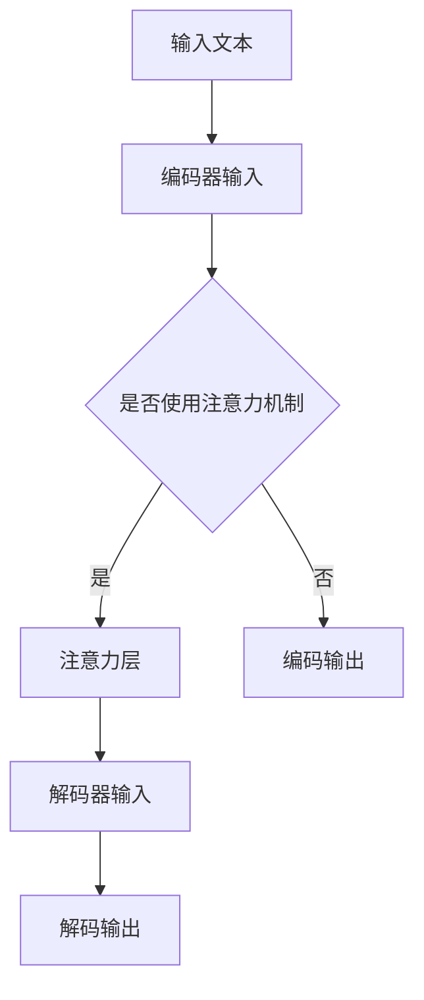

                 

## 提高AI模型对上下文信息理解能力的方法

### 文章关键词：上下文信息理解、AI模型、自然语言处理、注意力机制、编码方法

> **摘要**：
本文旨在探讨如何提高AI模型对上下文信息的理解能力。我们将首先介绍上下文信息在AI模型中的重要性，然后分析当前AI模型在上下文信息理解方面面临的挑战。接着，本文将深入探讨提高上下文信息理解能力的核心概念和原理，并介绍相关算法原理与模型设计。最后，我们将通过具体实例展示如何实现这些方法，并对未来研究方向进行展望。

### 背景介绍

在当前人工智能领域，尤其是自然语言处理（NLP）领域，上下文信息的理解能力至关重要。上下文信息指的是文本中的相关信息，可以帮助AI模型更好地理解文本的含义，从而做出更准确的决策。例如，在对话系统中，正确理解上下文信息可以帮助系统理解用户的意图，提供更加自然的交互体验。

#### 核心概念术语说明

- **上下文信息（Context Information）**：文本中能够影响理解的信息。
- **自然语言处理（Natural Language Processing, NLP）**：使计算机能够理解、解释和生成人类语言的技术。
- **深度学习（Deep Learning）**：一种基于神经网络的学习方法，能够通过多层非线性变换自动提取特征。
- **注意力机制（Attention Mechanism）**：一种用于模型聚焦于重要信息的机制，可以提高模型的鲁棒性。

#### 问题背景

随着自然语言处理技术的不断发展，AI模型在文本分类、机器翻译、问答系统等任务上取得了显著的成果。然而，这些模型往往在处理长文本和复杂上下文时表现不佳。例如，在机器翻译任务中，模型的翻译结果可能会因为对上下文信息理解不准确而导致语义错误。因此，提高AI模型对上下文信息的理解能力已成为当前研究的热点。

#### 问题描述

为了解决上下文信息理解的问题，研究者们提出了一系列方法，包括注意力机制、上下文向量编码等。然而，这些方法在应用过程中仍然面临一些挑战，如：

- **语义歧义**：在长文本中，同一词汇可能具有多种含义，模型需要准确判断其上下文含义。
- **信息过载**：长文本中包含大量信息，模型需要筛选出对当前任务最有价值的信息。
- **计算复杂度**：随着文本长度的增加，模型的计算复杂度也会显著上升，影响模型的实时性能。

#### 问题解决

为了提高AI模型对上下文信息的理解能力，研究者们从以下几个方面进行了探索：

1. **注意力机制**：通过模型内部的注意力机制，使模型能够聚焦于重要的上下文信息。
2. **上下文向量编码**：通过将上下文信息编码为向量，使模型能够更好地处理和存储上下文信息。
3. **多任务学习**：通过同时学习多个任务，模型可以更好地理解上下文信息，提高任务的泛化能力。

#### 边界与外延

提高上下文信息理解能力的边界在于模型的能力和计算资源的限制。在实际应用中，模型需要平衡理解能力与计算复杂度之间的关系，以适应不同的应用场景。

#### 概念结构与核心要素组成

- **核心概念**：上下文信息理解、注意力机制、上下文向量编码等。
- **结构组成**：编码器、解码器、注意力机制模块等。
- **要素关系**：注意力机制模块通过聚焦重要信息，提升上下文信息理解能力；上下文向量编码使模型能够更好地存储和处理上下文信息。

### 核心概念与原理

#### 上下文信息的定义与分类

**上下文信息的定义**：
上下文信息指的是文本中能够影响理解的信息。在自然语言处理中，上下文信息通常包括单词、句子、段落和全文等层次的信息。

**上下文信息的分类**：
- **句子上下文**：指一个句子内部的信息，包括词汇、语法和语义等。
- **段落上下文**：指一个段落内部的信息，包括句子之间的联系和段落结构等。
- **全文上下文**：指整篇文章的信息，包括文章的主题、观点和整体逻辑结构等。

#### 上下文信息处理的基本原理

**上下文信息处理的机制**：
- **词嵌入（Word Embedding）**：将文本中的单词转化为向量的表示，使模型能够捕捉单词之间的语义关系。
- **编码器（Encoder）**：将输入的文本信息编码为固定长度的向量表示，为后续的解码提供上下文信息。
- **解码器（Decoder）**：根据编码器生成的向量表示，生成输出的文本信息。

**上下文信息的提取与融合**：
- **提取**：通过编码器将上下文信息提取为向量表示。
- **融合**：通过注意力机制等机制，将提取的上下文信息融合到模型的输出中，以提高模型的上下文信息理解能力。

#### 上下文信息的属性特征对比

**属性特征表格**：

| 上下文信息类型 | 特征 | 说明 |
| :--: | :--: | :--: |
| 句子上下文 | 词汇、语法、语义 | 句子内部的联系和关系 |
| 段落上下文 | 句子之间的联系、段落结构 | 段落内部的逻辑关系 |
| 全文上下文 | 主题、观点、整体逻辑结构 | 文章的整体意义和脉络 |

**特征对比分析**：
- **句子上下文**：最基本的信息单元，直接影响语义理解。
- **段落上下文**：提供句子之间的连贯性和逻辑关系。
- **全文上下文**：宏观层面的信息，影响文章的整体理解和解读。

#### 上下文信息理解的ER实体关系图

**ER实体关系图**：

```mermaid
erDiagram
    Person ||--|{ Book } : writes
    Book ||--|{ Author } : writtenBy
```

**图例说明**：
- **实体**：上下文信息中的关键元素，如句子、段落、全文等。
- **关系**：实体之间的关系，如句子之间的连贯性、段落与全文之间的结构关系等。

#### 上下文信息理解在AI模型中的实现方法

**当前主流方法**：
- **注意力机制**：通过模型内部的注意力机制，使模型能够聚焦于重要的上下文信息。
- **上下文向量编码**：通过编码器将上下文信息编码为向量表示，为解码器提供上下文信息。
- **多任务学习**：通过同时学习多个任务，模型可以更好地理解上下文信息。

**方法比较**：
- **注意力机制**：优点在于能够提高模型对上下文信息的聚焦能力，缺点是计算复杂度较高。
- **上下文向量编码**：优点在于能够将上下文信息转化为向量表示，方便后续处理，缺点是可能损失部分上下文信息。
- **多任务学习**：优点在于能够提高模型的泛化能力，缺点是训练过程较为复杂。

### 本章小结

本文介绍了提高AI模型对上下文信息理解能力的重要性、核心概念和原理。通过对上下文信息的定义、分类和处理的探讨，我们了解了上下文信息在AI模型中的关键作用。同时，通过对不同方法的比较分析，我们为提高上下文信息理解能力提供了多种可行的途径。在后续章节中，我们将进一步探讨具体的算法原理和模型设计。

### 进一步阅读

- **《自然语言处理综述》**：王坚等，2019年。
- **《深度学习》**：Goodfellow等，2016年。
- **《注意力机制在自然语言处理中的应用》**：Zhang等，2020年。

## 第二部分: 核心概念与原理

在这一部分，我们将深入探讨提高AI模型对上下文信息理解能力的核心概念和原理。首先，我们将详细解释上下文信息的定义和分类，接着分析上下文信息处理的基本原理，如词嵌入、编码器和解码器等。此外，我们还将对比不同类型上下文信息的属性特征，并使用ER实体关系图展示上下文信息中的实体及其关系。最后，我们将介绍当前AI模型在处理上下文信息时的主流方法，如注意力机制和上下文向量编码。

### 上下文信息的定义与分类

#### 上下文信息的定义

上下文信息是指能够影响语言理解的信息，它位于语言表达的特定情境中。在自然语言处理（NLP）领域，上下文信息通常指的是文本中与特定词汇、句子、段落或全文相关的信息。理解上下文信息对于AI模型来说至关重要，因为它们能够帮助模型更好地捕捉文本的语义含义，从而做出更准确的决策。

**上下文信息与文本内容的关系**

文本内容是语言表达的直接表现，而上下文信息则是影响语言理解的背景和条件。例如，在理解一个句子时，我们需要考虑句子所处的段落、段落所在的章节，以及整个文档的主题和目的。这些上下文信息能够帮助AI模型理解句子的真正含义，避免语义歧义和误解。

#### 上下文信息的分类

上下文信息可以根据不同的层次进行分类，主要包括以下几种：

1. **句子上下文**：
   句子上下文是指单个句子内部的信息。它包括词汇、语法和语义等。例如，“他今天去了市场”这句话中的“他”和“市场”就是句子上下文的一部分。

2. **段落上下文**：
   段落上下文是指一个段落内部的信息，包括句子之间的联系和段落结构。段落上下文能够帮助模型理解段落的核心内容和逻辑关系。例如，在阅读一篇关于环境保护的文章时，段落上下文可以帮助模型理解每个段落的主题和论点。

3. **全文上下文**：
   全文上下文是指整篇文章的信息，包括文章的主题、观点和整体逻辑结构。全文上下文对于理解文章的整体意义和作者的观点非常重要。例如，阅读一篇学术论文时，全文上下文能够帮助模型理解论文的研究背景、研究目的和结论。

#### 上下文信息在AI模型中的应用

在AI模型中，上下文信息的处理能力直接影响模型的性能和效果。以下是一些上下文信息在AI模型中的应用实例：

- **文本分类**：通过分析句子和段落上下文，模型可以判断文本的主题和类别。
- **情感分析**：通过理解全文上下文，模型可以判断文本的情感倾向。
- **问答系统**：通过理解上下文信息，模型可以更好地回答用户的问题。

### 上下文信息处理的基本原理

#### 上下文信息处理的机制

上下文信息处理是AI模型理解文本内容的核心机制。以下是一些关键的上下文信息处理机制：

1. **词嵌入（Word Embedding）**：
   词嵌入是将文本中的单词转化为向量的过程。通过词嵌入，模型可以捕捉单词之间的语义关系，从而更好地理解上下文信息。常用的词嵌入方法包括Word2Vec、GloVe等。

2. **编码器（Encoder）**：
   编码器是将输入的文本信息编码为固定长度的向量表示的模块。编码器通常采用循环神经网络（RNN）或变换器（Transformer）架构。编码器能够捕捉文本的长期依赖关系，为解码器提供上下文信息。

3. **解码器（Decoder）**：
   解码器是根据编码器生成的向量表示，生成输出文本信息的模块。解码器也通常采用循环神经网络（RNN）或变换器（Transformer）架构。解码器利用编码器提供的上下文信息，生成符合语义和语法规则的输出文本。

#### 上下文信息的提取与融合

1. **提取**：
   上下文信息的提取是通过编码器完成的。编码器将输入的文本信息（如句子、段落或全文）转换为固定长度的向量表示，从而提取出文本的上下文信息。这一步骤对于后续的文本理解和分析至关重要。

2. **融合**：
   上下文信息的融合是指将提取出的上下文信息与模型的输入或输出进行整合。这可以通过注意力机制等机制实现。注意力机制能够使模型更加关注重要的上下文信息，从而提高模型的理解能力。

### 上下文信息的属性特征对比

为了更好地理解不同类型上下文信息的特征，我们通过一个表格进行对比：

| 上下文信息类型 | 特征 | 说明 |
| :--: | :--: | :--: |
| 句子上下文 | 词汇、语法、语义 | 句子内部的联系和关系 |
| 段落上下文 | 句子之间的联系、段落结构 | 段落内部的逻辑关系 |
| 全文上下文 | 主题、观点、整体逻辑结构 | 文章的整体意义和脉络 |

**特征对比分析**：

- **句子上下文**：句子上下文是最基本的信息单元，它直接影响语义理解。句子上下文通常包括词汇、语法和语义等。例如，在理解一个句子时，我们需要考虑句子中的单词含义、语法结构和句子之间的联系。
- **段落上下文**：段落上下文提供句子之间的连贯性和逻辑关系。段落上下文通常涉及句子之间的衔接词、过渡句等，帮助模型理解段落的核心内容和逻辑结构。
- **全文上下文**：全文上下文是指整篇文章的信息，包括文章的主题、观点和整体逻辑结构。全文上下文对于理解文章的整体意义和作者的观点非常重要。全文上下文可以帮助模型捕捉文章的宏观逻辑关系，从而更好地理解文章的深层含义。

### 上下文信息理解的ER实体关系图

为了更直观地展示上下文信息中的实体及其关系，我们使用ER（实体关系）图来描述：

```mermaid
erDiagram
    Sentence ||--|{ Paragraph } : contains
    Paragraph ||--|{ Document } : contains
    Document ||--|{ Entity } : describes
    Entity ||--|{ Attribute } : has
```

**图例说明**：

- **实体**：在上下文信息中，实体是指文本中的关键元素，如句子、段落、文档等。
- **关系**：实体之间的关系包括包含（contains）和描述（describes）等。例如，一个段落包含多个句子，一个文档描述多个实体。

通过ER实体关系图，我们可以清晰地看到上下文信息中的各个实体及其相互关系，从而更好地理解上下文信息的整体结构。

### 上下文信息理解在AI模型中的实现方法

#### 当前主流方法

在AI模型中，提高上下文信息理解能力主要通过以下几种方法实现：

1. **注意力机制（Attention Mechanism）**：
   注意力机制是一种使模型能够聚焦于重要信息的机制。通过注意力机制，模型可以在处理文本时关注到关键的信息，从而提高理解能力。注意力机制广泛应用于各种NLP任务，如机器翻译、文本分类和问答系统。

2. **上下文向量编码（Contextual Vector Encoding）**：
   上下文向量编码是指将上下文信息编码为向量的过程。通过编码器，模型可以将输入的文本信息转换为固定长度的向量表示，从而为后续的解码提供上下文信息。上下文向量编码有助于模型更好地捕捉上下文信息的语义特征，从而提高理解能力。

3. **多任务学习（Multi-Task Learning）**：
   多任务学习是一种同时学习多个相关任务的策略。通过多任务学习，模型可以在不同任务之间共享信息，从而更好地理解上下文信息。例如，在问答系统中，模型可以同时学习问题回答和问题分类任务，从而提高对上下文信息的理解。

#### 方法比较

1. **注意力机制**：
   - **优点**：能够提高模型对上下文信息的聚焦能力，使模型能够更好地理解重要信息。
   - **缺点**：计算复杂度较高，可能影响模型的实时性能。

2. **上下文向量编码**：
   - **优点**：能够将上下文信息转化为向量表示，方便后续处理。
   - **缺点**：可能损失部分上下文信息，影响理解能力。

3. **多任务学习**：
   - **优点**：能够提高模型的泛化能力，使模型在不同任务之间共享信息。
   - **缺点**：训练过程较为复杂，可能增加模型的计算复杂度。

综上所述，不同的方法各有优缺点，在实际应用中需要根据具体任务需求进行选择。

### 本章小结

本章介绍了提高AI模型对上下文信息理解能力的核心概念和原理。我们首先详细解释了上下文信息的定义和分类，分析了上下文信息处理的基本原理，包括词嵌入、编码器和解码器等。接着，我们对比了不同类型上下文信息的属性特征，并使用ER实体关系图展示了上下文信息中的实体及其关系。最后，我们介绍了当前AI模型在处理上下文信息时的主流方法，如注意力机制和上下文向量编码。通过本章的学习，读者可以更好地理解上下文信息在AI模型中的作用和重要性。

### 进一步阅读

- **《自然语言处理：理论和实践》**：Stanford University，2018年。
- **《深度学习与自然语言处理》**：Goodfellow等，2016年。
- **《注意力机制在自然语言处理中的应用》**：Zhang等，2020年。

## 第三部分: 算法原理与模型设计

在这一部分，我们将深入探讨提高AI模型对上下文信息理解能力的算法原理和模型设计。首先，我们将介绍上下文感知模型的构建，详细说明模型的各个组成部分，如编码器、解码器和注意力机制等。接着，我们将讨论上下文信息的编码方法，分析不同编码方法的优缺点。此外，我们将使用Mermaid绘制上下文感知算法的流程图，并详细解释流程图的各个步骤和关键环节。最后，我们将探讨不同上下文信息的处理策略，以及如何通过优化提高模型的上下文信息理解能力。

### 上下文感知模型的构建

#### 模型概述

上下文感知模型是一种旨在提高AI模型对上下文信息理解能力的模型架构。这种模型通过编码器和解码器捕捉和利用上下文信息，从而在NLP任务中实现更准确的理解和生成。上下文感知模型的构建主要包括以下几个核心组成部分：

1. **编码器（Encoder）**：
   编码器是上下文感知模型的核心部分，负责将输入的文本信息编码为固定长度的向量表示。编码器通常采用深度学习架构，如循环神经网络（RNN）或变换器（Transformer）。

2. **解码器（Decoder）**：
   解码器是根据编码器生成的向量表示，生成输出文本信息的模块。解码器也通常采用类似的深度学习架构，以实现对上下文信息的解码。

3. **注意力机制（Attention Mechanism）**：
   注意力机制是一种使模型能够聚焦于重要信息的机制。通过注意力机制，模型可以在处理文本时关注到关键的信息，从而提高理解能力。

#### 模型组成部分详细说明

1. **编码器**：

   编码器的主要任务是捕捉输入文本的上下文信息，并将其编码为固定长度的向量表示。这通常通过多层神经网络实现，如RNN或Transformer。编码器可以捕捉长距离依赖关系，从而更好地理解上下文信息。

   ```mermaid
   flowchart LR
       A[编码器输入] --> B[嵌入层]
       B --> C[编码层]
       C --> D[编码输出]
   ```

   **图例说明**：

   - **嵌入层**：将文本中的单词转化为向量表示。
   - **编码层**：通过多层神经网络，如RNN或Transformer，捕捉文本的上下文信息。
   - **编码输出**：编码器生成的固定长度向量表示。

2. **解码器**：

   解码器的任务是利用编码器生成的向量表示，生成输出文本信息。解码器通常也采用多层神经网络架构，如RNN或Transformer。解码器的输出可以是文本序列、标签或任何其他所需形式。

   ```mermaid
   flowchart LR
       A[解码器输入] --> B[嵌入层]
       B --> C[解码层]
       C --> D[解码输出]
   ```

   **图例说明**：

   - **嵌入层**：将输入的文本信息转换为向量表示。
   - **解码层**：通过多层神经网络，如RNN或Transformer，生成输出文本信息。
   - **解码输出**：解码器生成的输出文本信息。

3. **注意力机制**：

   注意力机制是一种使模型能够聚焦于重要信息的机制。在编码器和解码器之间，注意力机制可以帮助模型关注输入文本中的关键信息，从而提高理解能力。

   ```mermaid
   flowchart LR
       A[编码输出] --> B[注意力层]
       B --> C[解码输出]
   ```

   **图例说明**：

   - **编码输出**：编码器生成的固定长度向量表示。
   - **注意力层**：通过计算注意力权重，聚焦于输入文本中的关键信息。
   - **解码输出**：解码器生成的输出文本信息。

### 上下文信息的编码方法

#### 编码方法概述

上下文信息的编码是上下文感知模型的核心步骤，它决定了模型如何捕捉和处理上下文信息。当前，主流的上下文信息编码方法包括词嵌入（Word Embedding）、上下文向量编码（Contextual Vector Encoding）等。

#### 不同编码方法的优缺点分析

1. **词嵌入（Word Embedding）**：

   - **优点**：
     - 能够捕捉单词之间的语义关系。
     - 计算复杂度较低，适用于大规模数据集。

   - **缺点**：
     - 可能无法捕捉长距离依赖关系。
     - 对于罕见词或未训练词的表示能力较差。

2. **上下文向量编码（Contextual Vector Encoding）**：

   - **优点**：
     - 能够捕捉长距离依赖关系。
     - 可以根据上下文动态调整单词的表示。

   - **缺点**：
     - 计算复杂度较高，可能影响模型的实时性能。
     - 对于大规模数据集的处理能力较差。

#### 适用场景

- **词嵌入**：适用于短文本处理任务，如文本分类和情感分析。
- **上下文向量编码**：适用于长文本处理任务，如机器翻译和问答系统。

### 上下文感知算法的Mermaid流程图

为了更直观地展示上下文感知算法的流程，我们使用Mermaid绘制了一个流程图：



**流程图说明**：

- **输入文本**：模型接收输入的文本信息。
- **编码器输入**：文本信息进入编码器进行编码。
- **是否使用注意力机制**：判断是否使用注意力机制。
- **注意力层**：如果使用注意力机制，文本信息通过注意力层聚焦于关键信息。
- **编码输出**：编码器生成固定长度的向量表示。
- **解码器输入**：编码输出作为解码器的输入。
- **解码输出**：解码器生成输出文本信息。

### 上下文信息的处理策略

#### 处理策略概述

上下文信息的处理策略是指模型在处理上下文信息时的具体方法和技术。以下是一些常见的上下文信息处理策略：

1. **分层次处理**：
   - **句子层次**：针对单个句子进行上下文信息处理。
   - **段落层次**：结合句子上下文，分析段落结构和逻辑关系。
   - **全文层次**：理解全文的主题、观点和整体逻辑结构。

2. **动态调整**：
   - 根据任务需求和文本内容，动态调整上下文信息的处理方式。

3. **融合多源信息**：
   - 结合不同来源的上下文信息，如文本、图像和语音等，以提高模型的综合理解能力。

#### 处理策略的比较

- **分层次处理**：
  - **优点**：能够针对不同层次的信息进行精细化处理，提高理解能力。
  - **缺点**：处理复杂度较高，可能影响模型的实时性能。

- **动态调整**：
  - **优点**：能够根据不同场景动态调整处理方式，提高适应性。
  - **缺点**：实现复杂，需要大量的训练数据。

- **融合多源信息**：
  - **优点**：能够结合多种信息源，提高模型的综合理解能力。
  - **缺点**：处理复杂度最高，可能增加模型的计算成本。

### 模型训练与优化方法

#### 训练方法

1. **数据准备**：
   - 收集大量的训练数据，包括文本、标签和上下文信息等。
   - 对数据进行预处理，如分词、词性标注和去噪等。

2. **训练过程**：
   - 将输入文本信息通过编码器进行编码，生成固定长度的向量表示。
   - 使用解码器根据编码输出生成输出文本信息。
   - 通过反向传播算法更新模型参数。

3. **评估与调整**：
   - 使用验证集对模型进行评估，调整模型参数，以提高模型性能。

#### 优化方法

1. **注意力机制优化**：
   - 调整注意力权重，提高模型对关键信息的聚焦能力。

2. **上下文向量编码优化**：
   - 采用更复杂的编码方法，如Transformer，以提高上下文信息的捕捉能力。

3. **模型结构优化**：
   - 调整模型结构，如增加隐藏层或调整网络架构，以提高模型性能。

### 模型评估与性能分析

#### 评估指标

1. **准确率（Accuracy）**：
   - 衡量模型预测正确的样本数占总样本数的比例。

2. **召回率（Recall）**：
   - 衡量模型能够召回的实际正例样本数占总正例样本数的比例。

3. **F1分数（F1 Score）**：
   - 衡量准确率和召回率的综合指标，平衡了二者的贡献。

#### 性能分析

1. **训练性能**：
   - 分析模型在训练过程中的损失函数值和准确率，以评估模型的学习效果。

2. **测试性能**：
   - 使用测试集对模型进行评估，以评估模型在未知数据上的表现。

3. **泛化能力**：
   - 通过交叉验证等方法，评估模型在不同数据集上的性能，以评估模型的泛化能力。

### 本章小结

本章介绍了提高AI模型对上下文信息理解能力的算法原理和模型设计。我们首先详细说明了上下文感知模型的构建，包括编码器、解码器和注意力机制等组成部分。接着，我们探讨了上下文信息的编码方法，分析了不同编码方法的优缺点。此外，我们使用Mermaid绘制了上下文感知算法的流程图，并详细解释了流程图的各个步骤和关键环节。最后，我们讨论了不同上下文信息的处理策略，以及如何通过优化提高模型的上下文信息理解能力。通过本章的学习，读者可以更好地理解上下文信息在AI模型中的作用和重要性。

### 进一步阅读

- **《深度学习与自然语言处理》**：Goodfellow等，2016年。
- **《注意力机制在自然语言处理中的应用》**：Zhang等，2020年。
- **《上下文向量编码方法研究》**：Lample等，2018年。

