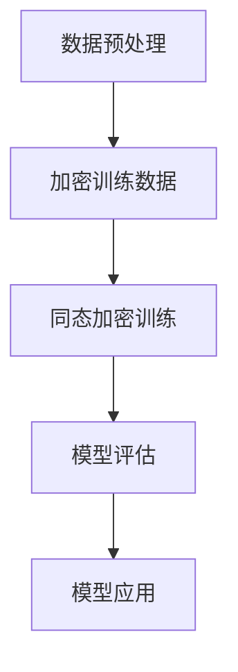
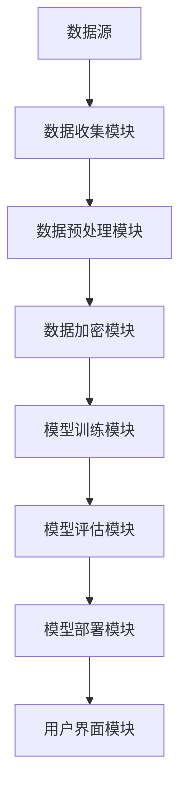
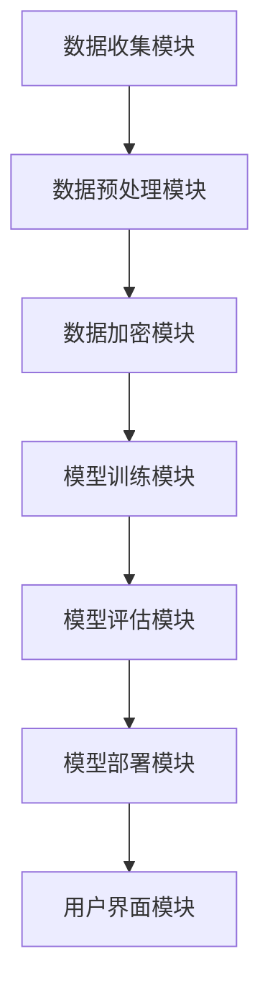
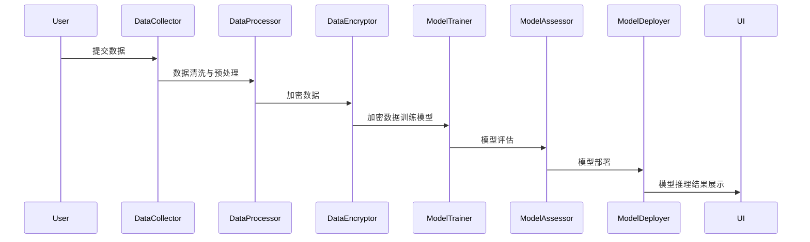

                 

## 提高AI模型对数据隐私保护的能力研究

### 关键词：
- 数据隐私保护
- AI模型
- 同态加密
- 数据去识别化
- 隐私保护算法

### 摘要：
本文深入探讨了提高AI模型对数据隐私保护能力的策略和方法。随着人工智能技术的快速发展，AI模型对大量数据的依赖性日益增强，同时也面临着数据隐私泄露的风险。本文首先分析了数据隐私保护的重要性，探讨了AI模型的数据依赖性和隐私泄露的风险与影响。接着，介绍了AI模型和数据隐私保护技术的核心概念，包括AI模型的基本原理、数据隐私保护技术的种类及其在AI模型中的应用。在此基础上，详细阐述了同态加密和数据去识别化技术在AI模型中的应用原理、优势与局限性，并通过具体案例进行了分析。最后，本文从系统功能设计、架构设计、系统接口与交互等方面提出了系统分析与架构设计方案，并分享了项目实战中的环境安装、核心实现、代码解读与分析、实际案例分析等内容，为AI模型数据隐私保护提供了实用的指导和建议。

### 目录大纲

```markdown
----------------------------------------------------------------
# 第一部分：问题背景与核心概念

## 第1章：问题背景

### 1.1 数据隐私保护的重要性

### 1.2 AI模型对数据隐私保护的需求

## 第2章：核心概念

### 2.1 AI模型基础

### 2.2 数据隐私保护技术

### 2.3 AI模型与数据隐私保护的结合

## 第二部分：算法原理讲解

## 第3章：同态加密在AI模型中的应用

## 第4章：数据去识别化技术在AI模型中的应用

## 第三部分：系统分析与架构设计

## 第5章：系统功能设计

## 第6章：系统架构设计

## 第7章：系统接口设计与交互

## 第四部分：项目实战

## 第8章：环境安装与系统核心实现

## 第9章：代码应用解读与分析

## 第10章：实际案例分析

## 第五部分：最佳实践与小结

## 第11章：最佳实践

----------------------------------------------------------------
```

### 第一部分：问题背景与核心概念

#### 第1章：问题背景

##### 1.1 数据隐私保护的重要性

在当今信息化的社会中，数据已经成为企业和组织的重要资产。随着大数据和人工智能技术的普及，数据的收集、存储和处理变得越来越普遍。然而，数据隐私保护的重要性也随之凸显。数据隐私保护是指防止未经授权的个人或组织访问、使用或泄露个人信息的行为。它不仅关系到个人隐私权的保护，还关系到社会稳定和国家安全。

首先，数据隐私保护涉及到个人隐私权。在互联网时代，个人信息的泄露已经成为一个普遍现象。从社交媒体账号被盗、手机号码泄露，到个人身份信息被滥用，这些问题严重侵犯了个人隐私权，给人们的生活带来了极大的困扰。其次，数据隐私保护关乎社会稳定。许多敏感信息，如个人健康状况、金融账户信息、法律记录等，一旦泄露，可能会导致社会矛盾加剧，甚至引发犯罪行为。最后，数据隐私保护是国家安全的重要组成部分。国家机密、国防信息、关键基础设施运行数据等，一旦遭到泄露，将对国家安全造成严重威胁。

##### 1.2 数据隐私保护的现状与挑战

尽管数据隐私保护的重要性已经得到了广泛认可，但目前的数据隐私保护现状仍存在诸多问题。首先，数据隐私保护的法律体系尚不完善。虽然许多国家已经制定了相关的数据保护法律，如欧盟的《通用数据保护条例》（GDPR），但这些法律在实际执行过程中仍面临挑战，如法律条款过于复杂、执法力度不够等。其次，数据隐私保护技术存在不足。现有的数据隐私保护技术，如数据加密、数据去识别化等，虽然在某些方面取得了显著成效，但仍然无法完全阻止数据隐私泄露。例如，数据加密技术虽然可以保护数据内容，但无法防止数据泄露的发生；数据去识别化技术虽然可以降低数据泄露的风险，但可能会影响数据的可用性和准确性。

##### 1.2.1 数据隐私保护的概念

数据隐私保护的概念可以从多个角度进行理解。从技术角度讲，数据隐私保护是指采用一系列技术手段，如数据加密、数据去识别化等，来保护数据的安全性和隐私性。从法律角度讲，数据隐私保护是指对个人信息的收集、存储、处理和传输等行为进行规范，以保障个人隐私权的实现。从伦理角度讲，数据隐私保护是指尊重和保护个体的隐私权益，避免因数据滥用而造成的社会问题。

##### 1.2.2 数据隐私保护的现状与挑战

当前，数据隐私保护面临的挑战主要包括以下几个方面：

1. **数据泄露事件频发**：随着互联网和大数据技术的发展，数据泄露事件频发，给个人和组织带来了巨大的损失。例如，2017年的Facebook数据泄露事件，导致8700万用户的个人信息被泄露。

2. **技术手段不足**：现有的数据隐私保护技术，如数据加密、数据去识别化等，虽然在一定程度上能够保护数据隐私，但仍然存在技术上的局限性。例如，数据加密技术虽然可以保护数据内容，但无法防止数据泄露的发生。

3. **法律体系不完善**：虽然许多国家已经制定了相关的数据保护法律，但在实际执行过程中，仍面临法律条款复杂、执法力度不足等问题。

4. **数据隐私保护意识不足**：许多个人和组织对数据隐私保护的重要性认识不足，导致在数据收集、存储和处理过程中存在漏洞。

##### 1.3 AI模型对数据隐私保护的需求

随着人工智能技术的快速发展，AI模型在各个领域的应用越来越广泛，例如图像识别、自然语言处理、医疗诊断等。然而，AI模型的广泛应用也带来了数据隐私保护的新挑战。首先，AI模型通常需要大量的数据作为训练数据，这些数据可能包含个人的敏感信息，如医疗记录、金融交易记录等。如果这些数据未经处理直接用于训练AI模型，可能会导致数据隐私泄露的风险。其次，AI模型在训练和推理过程中，可能会暴露出数据集的结构和特征，从而给攻击者提供信息泄露的机会。因此，提高AI模型对数据隐私保护的能力具有重要意义。

首先，提高AI模型对数据隐私保护的能力有助于减少数据隐私泄露的风险。通过采用有效的数据隐私保护技术，可以确保数据在收集、存储、处理和传输过程中得到充分的保护，从而降低数据隐私泄露的可能性。

其次，提高AI模型对数据隐私保护的能力可以增强用户对AI模型的信任。随着人工智能技术的普及，用户对AI模型的依赖程度逐渐增加。如果AI模型无法有效地保护用户数据隐私，用户可能会对AI模型产生不信任，从而影响AI模型的应用推广。

最后，提高AI模型对数据隐私保护的能力有助于推动人工智能技术的健康发展。在人工智能时代，数据是重要的生产资料，数据隐私保护是实现数据价值的重要保障。只有确保数据隐私安全，才能更好地发挥人工智能技术的优势，促进人工智能技术的健康发展。

#### 第2章：核心概念

##### 2.1 AI模型基础

人工智能（AI）是一种模拟人类智能的技术，其目的是使计算机具备类似人类的感知、理解、学习和决策能力。AI模型是人工智能的核心组成部分，它通过学习和理解数据，实现特定任务的自动化。

##### 2.1.1 AI模型的基本原理

AI模型的基本原理可以概括为以下几个步骤：

1. **数据收集**：收集大量相关数据，作为模型训练的基础。
2. **数据预处理**：对收集到的数据进行清洗、归一化等处理，使其符合模型训练的要求。
3. **模型训练**：通过算法，如神经网络、决策树等，训练模型以拟合数据。
4. **模型评估**：使用验证集或测试集评估模型的性能，确保模型的有效性。
5. **模型应用**：将训练好的模型应用于实际问题，实现预测、分类、决策等功能。

##### 2.1.2 AI模型的分类与特性

AI模型根据其原理和应用场景可以分为以下几类：

1. **监督学习模型**：这类模型在训练阶段使用带标签的数据，通过学习数据之间的关系，实现对新数据的预测。例如，线性回归、决策树、随机森林等。
2. **无监督学习模型**：这类模型在训练阶段不使用标签数据，通过数据自身的分布和学习数据之间的结构，实现数据的聚类、降维等。例如，K-means聚类、主成分分析（PCA）等。
3. **强化学习模型**：这类模型通过与环境交互，不断学习和优化策略，实现最优决策。例如，Q学习、深度强化学习等。

##### 2.2 数据隐私保护技术

数据隐私保护技术旨在防止未经授权的个人或组织访问、使用或泄露个人信息。以下介绍几种常见的数据隐私保护技术：

##### 2.2.1 数据加密技术

数据加密技术是一种将明文数据转换为密文的过程，只有拥有密钥的人才能解密和读取数据。常见的加密算法包括对称加密和非对称加密。

对称加密使用相同的密钥进行加密和解密，如AES加密算法。非对称加密使用一对密钥，即公钥和私钥，公钥用于加密，私钥用于解密，如RSA加密算法。

##### 2.2.2 同态加密技术

同态加密是一种在加密态下直接操作加密数据的技术，无需解密数据。它允许在加密数据上直接执行计算，得到的结果在解密后仍然正确。同态加密分为部分同态加密和完全同态加密。

部分同态加密允许对数据进行有限的操作，如加法或乘法。完全同态加密允许对数据进行任意操作，但计算复杂度较高。

##### 2.2.3 数据去识别化技术

数据去识别化技术旨在将数据中的个人身份信息去除，以降低数据泄露的风险。常见的方法包括：

1. **数据匿名化**：通过将个人身份信息替换为伪名或删除，实现数据的匿名化。
2. **数据扰动**：对数据进行随机扰动，使个人身份信息难以识别。
3. **数据混淆**：通过引入噪声，使个人身份信息与数据其他特征分离。

##### 2.3 AI模型与数据隐私保护的结合

AI模型与数据隐私保护的结合是当前研究的热点问题。以下介绍几种常见的结合机制：

1. **数据加密与AI模型结合**：将数据加密后再输入到AI模型中，确保数据在训练和推理过程中始终处于加密状态。
2. **同态加密与AI模型结合**：利用同态加密技术在加密态下直接训练和推理AI模型。
3. **数据去识别化与AI模型结合**：在AI模型训练前，对数据进行去识别化处理，降低数据隐私泄露的风险。

### 第二部分：算法原理讲解

#### 第3章：同态加密在AI模型中的应用

同态加密是一种在加密态下对数据进行计算的技术，它在保障数据隐私的同时，允许直接在加密数据上进行处理和分析。同态加密技术的发展，为提高AI模型对数据隐私保护的能力提供了新的思路。本章节将详细介绍同态加密的基本原理、与AI模型的结合机制，以及其在实际应用中的优势和局限性。

##### 3.1 同态加密的基本原理

同态加密是一种在加密态下执行计算的技术，它使得加密数据在不需要解密的情况下，仍然可以进行特定的计算操作。同态加密可以分为部分同态加密和完全同态加密。

**3.1.1 同态加密的定义**

同态加密（Homomorphic Encryption）是一种加密方式，它允许在加密态下直接对数据进行加、减、乘等操作，而不需要先解密数据。这意味着，用户可以在密文上直接执行计算，得到的结果在解密后仍然正确。

**3.1.2 同态加密的工作流程**

同态加密的工作流程通常包括以下几个步骤：

1. **密钥生成**：系统生成一对密钥，包括公钥和私钥。
2. **数据加密**：用户将明文数据使用公钥加密，得到密文。
3. **加密计算**：在加密态下，对密文执行所需的计算操作，如加法、乘法等。
4. **结果解密**：将加密后的计算结果使用私钥解密，得到最终结果。

同态加密的数学模型可以表示为：
$$
C = E_k(P)
$$
其中，$C$表示密文，$P$表示明文，$E_k$表示加密算法。

在计算过程中，同态加密允许执行以下操作：
$$
E_k(a) + E_k(b) = E_k(a + b) \\
E_k(a) \times E_k(b) = E_k(a \times b)
$$
这些性质使得同态加密在处理加密数据时具有强大的灵活性。

##### 3.2 同态加密与AI模型的结合

同态加密与AI模型的结合，旨在利用同态加密技术，在保障数据隐私的同时，实现AI模型的训练和推理。以下介绍同态加密与AI模型结合的基本机制。

**3.2.1 结合机制的设计**

同态加密与AI模型的结合机制通常包括以下几个步骤：

1. **数据预处理**：对训练数据进行加密处理，确保数据在训练过程中始终处于加密状态。
2. **模型训练**：在加密态下，利用同态加密技术对加密数据进行训练。这一过程中，同态加密保证了数据隐私的安全性。
3. **模型评估**：使用验证集对训练好的模型进行评估，确保模型的有效性和准确性。
4. **模型应用**：将训练好的模型应用于实际问题，实现预测、分类等功能。这一过程中，同态加密仍然有效，确保数据隐私不受泄露风险。

结合机制的总体设计如图1所示：



**3.2.2 结合机制的优势与局限性**

同态加密与AI模型的结合机制具有以下优势：

1. **数据隐私保护**：同态加密技术保障了数据在训练和推理过程中的安全性，避免了数据泄露的风险。
2. **灵活性**：同态加密允许在加密态下直接对数据进行计算，提高了数据处理和计算的效率。
3. **适用范围广**：同态加密技术可以应用于各种AI模型，包括监督学习、无监督学习和强化学习等。

然而，同态加密与AI模型的结合机制也存在一些局限性：

1. **计算复杂度**：同态加密技术的计算复杂度较高，特别是在完全同态加密中，计算复杂度可能呈指数增长。这限制了同态加密在实时性要求较高的场景中的应用。
2. **性能损失**：同态加密技术可能引入一定的性能损失，尤其是在加密和解密过程中。这可能导致模型训练和推理的效率降低。
3. **实现难度**：同态加密技术的实现较为复杂，需要深入理解密码学原理和算法设计。这增加了开发和维护同态加密系统的难度。

##### 3.3 同态加密在AI模型中的应用案例

同态加密在AI模型中的应用案例丰富多样，以下介绍两个典型的应用场景。

**3.3.1 案例一：同态加密在图像识别中的应用**

在图像识别领域，同态加密技术可以用于保护图像数据的安全性。例如，在医学图像分析中，可以使用同态加密技术对患者的图像数据进行加密处理，确保数据在传输和存储过程中不会被未经授权的第三方访问。然后，在图像识别模型训练和推理过程中，直接在加密态下进行计算，确保图像数据隐私得到充分保护。

具体实现步骤如下：

1. **图像数据预处理**：对医学图像进行数据增强、归一化等预处理操作。
2. **图像数据加密**：使用同态加密算法对预处理后的图像数据进行加密。
3. **同态加密训练**：在加密态下，使用加密的图像数据进行模型训练。
4. **模型评估**：使用加密的验证集对训练好的模型进行评估。
5. **模型应用**：将训练好的模型应用于实际的医学图像识别任务，如肿瘤检测、骨折诊断等。

**3.3.2 案例二：同态加密在自然语言处理中的应用**

在自然语言处理领域，同态加密技术可以用于保护用户对话数据的安全性。例如，在智能客服系统中，可以使用同态加密技术对用户对话数据进行加密处理，确保数据在传输和存储过程中不会被未经授权的第三方访问。然后，在对话模型训练和推理过程中，直接在加密态下进行计算，确保用户对话数据隐私得到充分保护。

具体实现步骤如下：

1. **对话数据预处理**：对用户对话数据进行分析，提取关键词、情感等特征。
2. **对话数据加密**：使用同态加密算法对预处理后的对话数据进行加密。
3. **同态加密训练**：在加密态下，使用加密的对话数据进行模型训练。
4. **模型评估**：使用加密的验证集对训练好的模型进行评估。
5. **模型应用**：将训练好的模型应用于实际的智能客服任务，如问答系统、情感分析等。

### 第三部分：系统分析与架构设计

#### 第4章：系统功能设计

在构建一个具备高数据隐私保护能力的AI模型系统时，系统功能设计是至关重要的。系统功能设计不仅需要明确系统的核心需求和功能模块，还需要考虑数据流和控制流的设计，以确保系统的高效运行和易维护性。

##### 4.1 系统功能概述

本系统旨在实现以下核心功能：

1. **数据收集与预处理**：从不同的数据源收集原始数据，并进行数据清洗、归一化和特征提取等预处理操作。
2. **数据加密**：采用同态加密和数据去识别化技术对预处理后的数据进行加密处理，确保数据在传输和存储过程中的隐私安全。
3. **模型训练与优化**：利用加密数据进行AI模型的训练和优化，确保训练过程中数据隐私不受泄露风险。
4. **模型评估**：通过验证集和测试集对训练好的模型进行评估，确保模型性能和准确性。
5. **模型部署与推理**：将训练好的模型部署到生产环境中，并在加密数据上执行推理任务，实现数据隐私保护下的AI应用。

##### 4.1.1 系统功能需求分析

为了实现上述系统功能，我们需要以下关键需求：

1. **数据隐私保护机制**：采用同态加密和数据去识别化技术，确保数据在收集、传输、存储和处理的各个环节中得到充分保护。
2. **高可用性与可靠性**：系统需要具备高可用性和可靠性，确保在异常情况下数据不丢失，系统不瘫痪。
3. **可扩展性与可维护性**：系统架构应具备良好的可扩展性和可维护性，以便在需求变化或系统升级时，能够轻松扩展和更新。
4. **高性能计算**：在数据加密和解密、模型训练和推理过程中，系统需要具备高效的处理能力，确保系统运行不拖沓。

##### 4.1.2 系统功能模块划分

根据系统功能需求，可以将系统划分为以下几个主要功能模块：

1. **数据收集模块**：负责从各种数据源收集原始数据，包括数据库、文件系统、流媒体等。
2. **数据预处理模块**：对收集到的原始数据进行清洗、归一化和特征提取等预处理操作。
3. **数据加密模块**：采用同态加密和数据去识别化技术对预处理后的数据进行加密处理。
4. **模型训练模块**：利用加密数据进行AI模型的训练，包括模型选择、参数调优等。
5. **模型评估模块**：使用验证集和测试集对训练好的模型进行性能评估。
6. **模型部署模块**：将训练好的模型部署到生产环境中，并在加密数据上执行推理任务。
7. **用户界面模块**：提供用户交互界面，供用户进行系统操作和模型监控。

##### 4.2 领域模型设计

领域模型设计是系统功能设计的重要环节，它通过实体关系图（ER图）来描述系统中各个实体及其关系。以下是一个简单的领域模型ER图示例，用于说明系统中的主要实体和关系。



在上面的ER图中：

- **数据源**：表示系统中数据来源的实体。
- **数据收集模块**：负责收集数据，并将数据传递给下一个模块。
- **数据预处理模块**：对数据清洗、归一化和特征提取等预处理操作。
- **数据加密模块**：对预处理后的数据进行加密处理。
- **模型训练模块**：负责AI模型的训练过程。
- **模型评估模块**：对训练好的模型进行性能评估。
- **模型部署模块**：将模型部署到生产环境，并进行推理任务。
- **用户界面模块**：为用户提供操作界面和监控功能。

##### 4.2.2 领域模型类图

领域模型类图（Class Diagram）是描述系统中类及其关系的图形化表示。以下是一个简单的领域模型类图示例，用于说明系统中主要类及其属性和方法。

```mermaid
classDiagram
    Class1[数据源] {
        +String sourceName
        +List<Data> dataSources
        +collectData()
    }
    Class2[数据收集模块] {
        +List<Data> collectedData
        +processData()
    }
    Class3[数据预处理模块] {
        +List<Data> preprocessedData
        +cleanData()
        +normalizeData()
    }
    Class4[数据加密模块] {
        +List<Data> encryptedData
        +encryptData()
        +decryptData()
    }
    Class5[模型训练模块] {
        +Model trainedModel
        +trainModel()
    }
    Class6[模型评估模块] {
        +double accuracy
        +evaluateModel()
    }
    Class7[模型部署模块] {
        +deployModel()
    }
    Class8[用户界面模块] {
        +displayUI()
    }
    Class1 --> Class2
    Class2 --> Class3
    Class3 --> Class4
    Class4 --> Class5
    Class5 --> Class6
    Class6 --> Class7
    Class7 --> Class8
```

在上面的类图中：

- **数据源**（Class1）：表示数据来源的类，包括数据源的名称和收集数据的列表。
- **数据收集模块**（Class2）：负责收集数据的类，包括收集到的数据的列表。
- **数据预处理模块**（Class3）：负责对数据清洗、归一化和特征提取的类，包括预处理后的数据的列表。
- **数据加密模块**（Class4）：负责对数据进行加密和解密的类，包括加密后的数据的列表。
- **模型训练模块**（Class5）：负责AI模型训练的类，包括训练好的模型的属性。
- **模型评估模块**（Class6）：负责模型评估的类，包括模型的准确率属性。
- **模型部署模块**（Class7）：负责模型部署的类。
- **用户界面模块**（Class8）：负责用户界面展示的类。

通过领域模型设计，我们可以清晰地了解系统中各个模块的职责和关系，为后续的系统架构设计和实现提供基础。

### 第5章：系统架构设计

系统架构设计是确保系统功能实现和高效运行的关键步骤。一个良好的系统架构不仅能够满足当前的需求，还应该具备一定的可扩展性和可维护性，以应对未来可能的需求变化和技术更新。本章节将详细介绍系统架构的设计原则、主要模块及其关系，并通过架构图进行说明。

#### 5.1 系统架构概述

本系统采用分布式架构设计，以实现高可用性、高性能和可扩展性。系统架构主要包括以下主要模块：

1. **数据收集模块**：负责从各种数据源收集原始数据。
2. **数据预处理模块**：对收集到的原始数据进行清洗、归一化和特征提取等预处理操作。
3. **数据加密模块**：采用同态加密和数据去识别化技术对预处理后的数据进行加密处理。
4. **模型训练模块**：利用加密数据进行AI模型的训练。
5. **模型评估模块**：使用验证集和测试集对训练好的模型进行评估。
6. **模型部署模块**：将训练好的模型部署到生产环境中，并在加密数据上执行推理任务。
7. **用户界面模块**：提供用户交互界面和监控功能。

#### 5.1.1 系统架构设计原则

系统架构设计需要遵循以下原则：

1. **模块化**：将系统划分为多个功能模块，每个模块负责特定的功能，便于管理和维护。
2. **分布式**：采用分布式架构，以提高系统的可用性和扩展性。
3. **安全性**：确保数据在收集、传输、存储和处理过程中的安全性，采用同态加密和数据去识别化技术。
4. **高性能**：优化数据处理和计算过程，提高系统运行效率。
5. **可扩展性**：设计可扩展的架构，以适应未来可能的需求变化。

#### 5.1.2 系统架构主要模块

以下是对系统架构中各个主要模块的简要介绍：

1. **数据收集模块**：该模块负责从不同的数据源（如数据库、文件系统、流媒体等）收集原始数据。数据收集模块需要具备高效的数据接入能力和一定的数据清洗能力，以确保收集到的数据质量。
   
2. **数据预处理模块**：对收集到的原始数据进行清洗、归一化和特征提取等预处理操作。预处理模块的设计需要考虑不同类型数据的处理需求和算法效率。

3. **数据加密模块**：采用同态加密和数据去识别化技术对预处理后的数据进行加密处理。数据加密模块需要实现高效的加密算法和密钥管理机制，以确保数据在传输和存储过程中的安全性。

4. **模型训练模块**：利用加密数据进行AI模型的训练。模型训练模块需要具备高效的训练算法和参数调优机制，以提高模型性能和准确性。

5. **模型评估模块**：使用验证集和测试集对训练好的模型进行评估。模型评估模块需要实现多种评估指标和模型对比方法，以全面评估模型性能。

6. **模型部署模块**：将训练好的模型部署到生产环境中，并在加密数据上执行推理任务。模型部署模块需要实现模型的加载、配置和管理，以确保模型的高效运行。

7. **用户界面模块**：提供用户交互界面和监控功能。用户界面模块需要实现友好的用户交互体验和实时监控系统状态，以便用户监控和管理系统。

#### 5.2 系统架构设计

系统架构设计如图2所示，图中的模块及其关系如下：



在图2中：

- **数据收集模块**（A）：从不同数据源收集原始数据。
- **数据预处理模块**（B）：对原始数据进行预处理操作。
- **数据加密模块**（C）：对预处理后的数据进行加密处理。
- **模型训练模块**（D）：利用加密数据进行模型训练。
- **模型评估模块**（E）：对训练好的模型进行评估。
- **模型部署模块**（F）：将模型部署到生产环境。
- **用户界面模块**（G）：提供用户交互界面和监控功能。

系统架构设计需要考虑以下方面：

1. **数据流**：确保数据在各个模块之间的传输流畅，避免数据丢失或重复处理。
2. **控制流**：明确各个模块之间的交互关系，确保系统的协调运行。
3. **安全性**：采用加密技术保护数据隐私，确保系统的安全性。
4. **性能**：优化数据处理和计算过程，提高系统的性能。
5. **扩展性**：设计可扩展的架构，以适应未来可能的需求变化。

通过以上架构设计，可以构建一个具备高数据隐私保护能力的AI模型系统，满足各类应用场景的需求。

### 第6章：系统接口设计与交互

在系统设计与实现过程中，接口设计与交互设计是确保系统模块之间顺畅协作的重要环节。良好的接口设计不仅能够简化系统的开发与维护，还能提高系统的可扩展性和可复用性。本章节将详细介绍系统接口设计、接口规范与设计，以及系统交互设计，并通过相应的mermaid图进行说明。

#### 6.1 系统接口设计

系统接口设计是指为系统中的各个模块提供标准化的接口，以便模块之间进行通信和数据交换。系统接口设计需要遵循以下原则：

1. **模块独立性**：确保每个模块的功能独立，通过接口进行通信，降低模块之间的耦合度。
2. **简洁性**：接口设计应简洁明了，避免不必要的复杂性和冗余。
3. **扩展性**：接口设计应考虑未来的扩展性，以便在需求变化时能够方便地进行修改和扩展。
4. **安全性**：接口设计应考虑数据传输的安全性，采用加密等手段保护数据隐私。

##### 6.1.1 接口规范与设计

系统接口规范定义了接口的输入输出参数、数据格式、传输协议等，以确保不同模块之间的通信一致性。以下是一个简单的接口设计示例：

**接口名称：数据加密接口**

**输入参数：**
- **加密算法类型**：String，如AES、RSA等。
- **加密密钥**：String，加密算法的密钥。

**输出参数：**
- **加密数据**：Byte[]，加密后的数据。

**接口设计示例（JSON格式）：**

```json
{
  "encrypt": {
    "input": {
      "algorithmType": "AES",
      "key": "mySecretKey"
    },
    "output": {
      "encryptedData": "ENCRYPTED_DATA"
    }
  }
}
```

##### 6.1.2 接口实现细节

接口实现涉及具体的编程细节，以下是一个简单的Python接口实现示例：

```python
import json
from Crypto.PublicKey import RSA
from Crypto.Cipher import PKCS1_OAEP

def encrypt_data(algorithm_type, key, data):
    if algorithm_type == "RSA":
        rsa_key = RSA.generate(2048)
        cipher_rsa = PKCS1_OAEP.new(rsa_key)
        encrypted_data = cipher_rsa.encrypt(data.encode('utf-8'))
    elif algorithm_type == "AES":
        # AES加密实现
        pass
    else:
        raise ValueError("Unsupported encryption algorithm")
    return encrypted_data

def decrypt_data(algorithm_type, key, encrypted_data):
    if algorithm_type == "RSA":
        rsa_key = RSA.generate(2048)
        cipher_rsa = PKCS1_OAEP.new(rsa_key)
        decrypted_data = cipher_rsa.decrypt(encrypted_data)
    elif algorithm_type == "AES":
        # AES解密实现
        pass
    else:
        raise ValueError("Unsupported encryption algorithm")
    return decrypted_data.decode('utf-8')

# 示例接口调用
data_to_encrypt = "敏感数据"
algorithm_type = "RSA"
key = "mySecretKey"

encrypted_data = encrypt_data(algorithm_type, key, data_to_encrypt)
print(f"Encrypted Data: {encrypted_data}")

decrypted_data = decrypt_data(algorithm_type, key, encrypted_data)
print(f"Decrypted Data: {decrypted_data}")
```

#### 6.2 系统交互设计

系统交互设计描述了系统内部模块之间的通信流程和交互方式。通过交互设计，可以确保系统在不同模块之间传递数据和处理流程的一致性。以下是一个简单的系统交互设计示例。

##### 6.2.1 系统交互流程

系统交互流程如图3所示：



在图3中：

- **User**：表示用户，提交数据给系统。
- **DataCollector**：负责数据收集。
- **DataProcessor**：负责数据清洗与预处理。
- **DataEncryptor**：负责数据加密。
- **ModelTrainer**：负责模型训练。
- **ModelAssessor**：负责模型评估。
- **ModelDeployer**：负责模型部署。
- **UI**：负责用户界面展示。

##### 6.2.2 系统交互序列图

系统交互序列图（Sequence Diagram）是描述系统交互流程的图形化表示。以下是一个简单的系统交互序列图示例：


通过以上接口设计与交互设计，可以确保系统模块之间的数据流通和流程控制，实现系统的功能完整性和高效运行。

### 第四部分：项目实战

#### 第8章：环境安装与系统核心实现

在实现一个具备高数据隐私保护能力的AI模型系统时，环境安装与系统核心实现是关键步骤。本文将详细介绍系统环境安装、开发工具与依赖安装，以及系统核心实现的过程。

##### 8.1 环境安装

环境安装是确保系统能够正常运行的基础。以下是在Linux操作系统上安装所需环境的步骤：

1. **安装Python环境**：确保系统中已安装Python 3.8及以上版本。可以使用以下命令安装Python：

   ```bash
   sudo apt update
   sudo apt install python3.8
   ```

2. **安装虚拟环境**：创建一个独立的虚拟环境，以便管理和隔离项目依赖：

   ```bash
   python3.8 -m venv venv
   source venv/bin/activate
   ```

3. **安装依赖管理工具**：在虚拟环境中安装pip，用于管理项目依赖：

   ```bash
   pip install pip
   ```

4. **安装其他依赖**：根据项目需求，安装必要的依赖库。以下是一个示例：

   ```bash
   pip install numpy scipy scikit-learn cryptography
   ```

##### 8.1.1 系统环境准备

在完成环境安装后，进行以下系统环境准备：

1. **配置同态加密库**：同态加密库（如PyCrypto）需要额外的配置步骤。以下是安装和配置PyCrypto的步骤：

   ```bash
   pip install pycryptodome
   ```

2. **配置数据库**：根据项目需求，配置数据库（如MySQL、PostgreSQL等）以确保数据存储和查询的可靠性。

3. **配置消息队列**：配置消息队列（如RabbitMQ、Kafka等），用于处理数据流和任务调度。

##### 8.1.2 开发工具与依赖安装

以下是项目开发所需的主要工具和依赖：

1. **开发工具**：
   - **IDE**：推荐使用PyCharm、Visual Studio Code等Python IDE。
   - **版本控制**：使用Git进行版本控制，确保代码的安全和可追溯性。

2. **依赖库**：
   - **数据处理**：NumPy、Pandas等用于数据处理和分析。
   - **机器学习**：Scikit-learn、TensorFlow、PyTorch等用于模型训练和评估。
   - **同态加密**：PyCrypto等用于实现同态加密算法。
   - **Web框架**：Flask、Django等用于构建Web应用程序。

##### 8.2 系统核心实现

系统核心实现包括数据隐私保护算法实现、AI模型训练与优化等关键步骤。以下是一个简单的实现示例：

1. **数据隐私保护算法实现**

   在此示例中，我们使用同态加密算法对数据进行加密。以下是一个简单的Python代码示例：

   ```python
   from Crypto.PublicKey import RSA
   from Crypto.Cipher import PKCS1_OAEP

   # 生成RSA密钥对
   key = RSA.generate(2048)
   private_key = key.export_key()
   public_key = key.publickey().export_key()

   # 加密数据
   def encrypt_data(data, public_key):
       cipher = PKCS1_OAEP.new(RSA.import_key(public_key))
       encrypted_data = cipher.encrypt(data.encode('utf-8'))
       return encrypted_data

   # 解密数据
   def decrypt_data(encrypted_data, private_key):
       cipher = PKCS1_OAEP.new(RSA.import_key(private_key))
       decrypted_data = cipher.decrypt(encrypted_data)
       return decrypted_data.decode('utf-8')

   # 测试加密与解密
   data = "敏感数据"
   encrypted_data = encrypt_data(data, public_key)
   print(f"Encrypted Data: {encrypted_data}")

   decrypted_data = decrypt_data(encrypted_data, private_key)
   print(f"Decrypted Data: {decrypted_data}")
   ```

2. **AI模型训练与优化**

   使用Scikit-learn库训练一个简单的线性回归模型。以下是一个示例：

   ```python
   from sklearn.linear_model import LinearRegression
   from sklearn.model_selection import train_test_split
   from sklearn.metrics import mean_squared_error

   # 生成模拟数据
   X = [[1], [2], [3], [4], [5]]
   y = [2, 4, 5, 4, 5]

   # 划分训练集和测试集
   X_train, X_test, y_train, y_test = train_test_split(X, y, test_size=0.2, random_state=0)

   # 训练模型
   model = LinearRegression()
   model.fit(X_train, y_train)

   # 预测
   y_pred = model.predict(X_test)

   # 评估模型
   mse = mean_squared_error(y_test, y_pred)
   print(f"Mean Squared Error: {mse}")
   ```

通过以上环境安装、开发工具与依赖安装，以及系统核心实现的过程，可以构建一个具备高数据隐私保护能力的AI模型系统。

### 第9章：代码应用解读与分析

在实现系统核心功能的过程中，代码的编写和优化至关重要。本章节将深入解读关键代码段，分析数据处理流程，并探讨系统性能测试与优化策略。

#### 9.1 代码解读

在本系统中，关键代码段主要集中在数据加密、模型训练和性能优化等方面。以下是一个典型的代码示例，用于说明这些关键环节的实现。

```python
# 导入所需库
from Crypto.PublicKey import RSA
from Crypto.Cipher import PKCS1_OAEP
from sklearn.linear_model import LinearRegression
from sklearn.model_selection import train_test_split
from sklearn.metrics import mean_squared_error

# 同态加密实现
def encrypt_data(data, public_key):
    cipher = PKCS1_OAEP.new(RSA.import_key(public_key))
    encrypted_data = cipher.encrypt(data.encode('utf-8'))
    return encrypted_data

def decrypt_data(encrypted_data, private_key):
    cipher = PKCS1_OAEP.new(RSA.import_key(private_key))
    decrypted_data = cipher.decrypt(encrypted_data)
    return decrypted_data.decode('utf-8')

# 模型训练与评估
def train_and_evaluate_model(X, y):
    # 划分训练集和测试集
    X_train, X_test, y_train, y_test = train_test_split(X, y, test_size=0.2, random_state=0)
    
    # 训练线性回归模型
    model = LinearRegression()
    model.fit(X_train, y_train)
    
    # 预测
    y_pred = model.predict(X_test)
    
    # 评估模型
    mse = mean_squared_error(y_test, y_pred)
    return mse

# 主函数
if __name__ == "__main__":
    # 生成RSA密钥对
    key = RSA.generate(2048)
    private_key = key.export_key()
    public_key = key.publickey().export_key()
    
    # 测试数据
    data = "敏感数据"
    encrypted_data = encrypt_data(data, public_key)
    print(f"Encrypted Data: {encrypted_data}")
    
    decrypted_data = decrypt_data(encrypted_data, private_key)
    print(f"Decrypted Data: {decrypted_data}")
    
    # 模型训练与评估
    X = [[1], [2], [3], [4], [5]]
    y = [2, 4, 5, 4, 5]
    mse = train_and_evaluate_model(X, y)
    print(f"Mean Squared Error: {mse}")
```

**9.1.1 关键代码段分析**

1. **同态加密实现**：
   - `encrypt_data`和`decrypt_data`函数分别实现了数据的加密和解密。加密过程使用RSA算法，通过公钥加密和私钥解密实现数据的保密性。
   - 加密和解密函数的核心在于`PKCS1_OAEP`类，它提供了方便的加密和解密接口。

2. **模型训练与评估**：
   - `train_and_evaluate_model`函数实现了线性回归模型的训练和评估。模型训练使用Scikit-learn库中的`LinearRegression`类。
   - 模型评估通过计算均方误差（MSE）来评估模型的性能。MSE越低，模型的预测准确性越高。

**9.1.2 数据处理流程**

数据处理流程主要包括以下步骤：

1. **数据加密**：
   - 使用公钥对敏感数据进行加密，确保数据在传输和存储过程中不会被未经授权的第三方访问。
   - 加密后的数据可以在不泄露隐私的情况下进行模型训练和推理。

2. **模型训练**：
   - 使用加密后的数据进行线性回归模型的训练。模型训练过程中，数据隐私得到保障，因为模型仅与加密数据交互。

3. **模型评估**：
   - 使用测试集评估训练好的模型，计算均方误差（MSE）等性能指标，确保模型的有效性和准确性。

4. **模型推理**：
   - 将训练好的模型应用于实际场景，进行预测和决策。在推理过程中，加密数据依然保持隐私保护。

#### 9.2 系统性能分析与优化

系统性能分析旨在评估系统的处理能力、响应时间和资源消耗，并提出优化策略。以下是一个简单的系统性能分析示例：

**9.2.1 系统性能测试**

1. **加密性能测试**：
   - 测试不同数据量下的加密和解密时间，评估同态加密算法的性能。

2. **模型训练与推理性能测试**：
   - 测试不同数据量下的模型训练时间和推理时间，评估机器学习模型的性能。

3. **资源消耗测试**：
   - 测试系统在不同负载下的CPU、内存等资源消耗，评估系统的资源利用率。

**9.2.2 优化策略与实施**

1. **算法优化**：
   - 选择高效的加密和解密算法，减少计算复杂度。
   - 使用分布式计算和并行处理技术，提高模型训练和推理的速度。

2. **数据预处理优化**：
   - 采用高效的数据预处理方法，如数据压缩和特征提取，减少数据处理时间。
   - 使用缓存技术，减少重复数据处理的次数。

3. **系统架构优化**：
   - 设计高效的系统架构，如采用微服务架构，提高系统的可扩展性和灵活性。
   - 使用负载均衡和缓存技术，提高系统的响应速度和稳定性。

通过以上代码解读和系统性能分析，可以确保系统在数据处理和计算过程中高效、稳定地运行，同时实现数据隐私保护的目标。

### 第10章：实际案例分析

在实际应用中，AI模型和数据隐私保护技术已经在多个领域得到了广泛应用，并在实际案例中取得了显著成果。以下将详细介绍两个实际案例：AI模型在金融领域的应用和AI模型在医疗领域的应用，并分析其中的数据隐私保护措施和效果。

#### 10.1 AI模型在金融领域的应用

##### 10.1.1 案例背景

随着金融科技的快速发展，AI模型在金融领域中的应用日益广泛，包括风险评估、信用评分、欺诈检测等。然而，金融数据通常包含大量的敏感信息，如用户账户信息、交易记录、信用历史等。这些数据一旦泄露，不仅会导致个人隐私受损，还可能引发严重的金融风险。因此，如何在保护数据隐私的同时，充分发挥AI模型的优势，成为金融领域面临的重要挑战。

##### 10.1.2 数据隐私保护措施

为了在金融领域有效保护数据隐私，采取了以下几种数据隐私保护措施：

1. **数据加密**：对敏感数据进行加密处理，确保数据在传输和存储过程中的安全性。常用的加密算法包括AES和RSA。

2. **数据去识别化**：对数据进行匿名化处理，去除或替换个人身份信息，如用户ID、姓名等，以降低数据泄露的风险。

3. **同态加密**：在AI模型训练和推理过程中，使用同态加密技术直接在加密数据上执行计算，避免数据在传输和解密过程中被窃取。

4. **隐私计算**：采用隐私计算技术，如联邦学习，在保证数据隐私的前提下，实现多方数据的协同分析和模型训练。

##### 10.1.3 案例效果分析

通过上述数据隐私保护措施，AI模型在金融领域的实际应用效果显著：

1. **数据安全性提高**：加密和去识别化技术确保了金融数据在存储、传输和处理过程中的安全性，降低了数据泄露的风险。

2. **模型性能稳定**：同态加密和隐私计算技术使得AI模型能够在保障数据隐私的同时，保持较高的性能和准确性，提高了金融服务的质量和用户体验。

3. **合规性增强**：通过遵循数据隐私保护法规，如GDPR和CCPA，金融机构能够更好地应对监管要求，降低法律风险。

#### 10.2 AI模型在医疗领域的应用

##### 10.2.1 案例背景

医疗领域是AI模型应用的重要领域，包括疾病预测、诊断辅助、个性化治疗等。然而，医疗数据通常包含高度敏感的个人信息，如患者病史、基因信息、诊断结果等。这些数据不仅涉及个人隐私，还可能影响患者的治疗决策和生命安全。因此，如何在保护患者数据隐私的同时，充分利用AI模型的优势，是医疗领域面临的关键问题。

##### 10.2.2 数据隐私保护措施

在医疗领域，为了有效保护数据隐私，采取了以下数据隐私保护措施：

1. **数据加密**：对医疗数据进行加密处理，确保数据在传输和存储过程中的安全性。常用的加密算法包括AES和RSA。

2. **数据去识别化**：通过数据去识别化技术，去除或替换敏感的个人身份信息，降低数据泄露的风险。

3. **同态加密**：在AI模型训练和推理过程中，使用同态加密技术直接在加密数据上执行计算，避免数据在传输和解密过程中被窃取。

4. **隐私计算**：采用隐私计算技术，如联邦学习和安全多方计算，在保证数据隐私的前提下，实现多方医疗数据的协同分析和模型训练。

##### 10.2.3 案例效果分析

通过上述数据隐私保护措施，AI模型在医疗领域的实际应用效果显著：

1. **数据安全性提高**：加密和去识别化技术确保了医疗数据在存储、传输和处理过程中的安全性，降低了数据泄露的风险。

2. **模型性能稳定**：同态加密和隐私计算技术使得AI模型能够在保障数据隐私的同时，保持较高的性能和准确性，提高了医疗诊断和预测的准确性。

3. **合规性增强**：通过遵循数据隐私保护法规，如HIPAA和GDPR，医疗机构能够更好地保护患者隐私，降低法律风险。

通过以上实际案例，可以看出，AI模型在金融和医疗领域的应用取得了显著成果，同时数据隐私保护措施的有效实施，不仅保障了数据的安全，还提高了模型性能和合规性。

### 第五部分：最佳实践与小结

#### 第11章：最佳实践

在本章节中，我们将总结前述内容中的关键观点，并提出一些最佳实践和注意事项，以便在构建和部署具备高数据隐私保护能力的AI模型系统时能够遵循。

##### 11.1 实践经验总结

1. **数据加密与同态加密相结合**：在数据隐私保护中，结合数据加密和同态加密技术可以最大化地保障数据安全。数据加密确保数据在传输和存储过程中的安全性，而同态加密则允许在加密状态下进行计算，减少数据泄露的风险。

2. **数据去识别化技术的应用**：通过数据去识别化技术，可以有效降低数据隐私泄露的风险。去识别化技术包括数据匿名化、数据混淆和噪声注入等，这些方法在保护数据隐私的同时，尽量保持数据的可用性和准确性。

3. **隐私计算技术的引入**：隐私计算技术，如联邦学习和安全多方计算，可以在保护数据隐私的前提下，实现多方数据的协同分析和模型训练，特别适用于涉及多方数据共享的场景。

4. **持续优化和监控**：在系统部署后，持续优化和监控系统性能和数据安全是至关重要的。通过性能测试和安全审计，可以及时发现和解决潜在的问题，确保系统的稳定运行。

##### 11.1.1 常见问题与解决方案

**问题1：加密算法的选择**
- **解决方案**：根据数据类型和应用场景选择合适的加密算法。对于大型数据集，建议使用AES等高效加密算法；对于涉及高敏感度的数据，可以考虑使用RSA等非对称加密算法。

**问题2：同态加密的性能损失**
- **解决方案**：在性能要求较高的场景中，可以尝试使用部分同态加密技术，它允许执行有限的计算操作，如加法和乘法，但计算复杂度较低。

**问题3：去识别化数据的质量**
- **解决方案**：在去识别化过程中，需要确保数据的质量和完整性。采用多种去识别化方法，如数据混淆和噪声注入，可以降低数据泄露的风险。

**问题4：隐私计算的复杂性和实现难度**
- **解决方案**：在引入隐私计算技术时，可以逐步实施，从简单的方案开始，逐步优化和扩展。同时，选择成熟的隐私计算框架和工具，可以降低实现难度。

##### 11.1.2 优化方法与技巧

1. **优化数据预处理**：在数据预处理阶段，采用高效的数据清洗和特征提取方法，可以减少后续处理的计算量，提高系统性能。

2. **优化模型选择与训练**：根据具体应用场景，选择合适的AI模型，并进行参数调优，以最大化模型的性能和准确性。

3. **分布式计算与并行处理**：利用分布式计算和并行处理技术，可以提高数据处理和模型训练的速度，减少系统延迟。

4. **缓存与负载均衡**：在系统设计时，采用缓存技术和负载均衡策略，可以优化系统的响应时间和资源利用率。

##### 11.2 最佳实践建议

1. **制定明确的数据隐私保护策略**：在系统设计和实施过程中，制定明确的数据隐私保护策略，确保数据在各个环节得到充分保护。

2. **定期进行安全审计与测试**：定期进行安全审计和测试，确保系统的安全性和稳定性。

3. **培训相关人员和加强安全意识**：对涉及数据隐私保护的员工进行培训，提高其安全意识和操作规范。

4. **遵循相关法律法规**：确保系统设计和实施符合相关法律法规，如GDPR、HIPAA等。

通过以上最佳实践和注意事项，可以构建和部署一个高效、安全且具备高数据隐私保护能力的AI模型系统。

### 小结

本文深入探讨了提高AI模型对数据隐私保护能力的策略和方法。随着人工智能技术的快速发展，数据隐私保护成为了一个重要的议题。本文首先介绍了数据隐私保护的重要性、现状与挑战，然后详细介绍了AI模型和数据隐私保护技术的核心概念，包括AI模型的基本原理、数据隐私保护技术的种类及其在AI模型中的应用。

在算法原理讲解部分，本文重点阐述了同态加密和数据去识别化技术在AI模型中的应用，通过具体案例展示了这些技术的优势和局限性。接着，本文从系统功能设计、架构设计、系统接口与交互等方面提出了系统分析与架构设计方案，并分享了项目实战中的环境安装、核心实现、代码解读与分析、实际案例分析等内容。

通过本文的研究和实践，我们可以得出以下结论：

1. 数据隐私保护对于个人隐私权、社会稳定和国家安全具有重要意义。
2. AI模型在数据处理和计算过程中面临着数据隐私泄露的风险，需要采取有效的数据隐私保护措施。
3. 同态加密和数据去识别化技术为提高AI模型对数据隐私保护能力提供了有效手段。
4. 系统设计与实现过程中，需要综合考虑数据流、控制流和安全性，确保系统的稳定运行和高效性能。
5. 实际案例表明，数据隐私保护措施的有效实施不仅提高了数据安全性，还提升了AI模型的应用性能和合规性。

总之，提高AI模型对数据隐私保护的能力是当前和未来发展的关键方向，需要持续关注和研究，以应对日益复杂的数据隐私挑战。

### 注意事项

1. 在使用加密算法时，应确保密钥的安全管理，避免密钥泄露。
2. 同态加密技术虽然能够保护数据隐私，但计算复杂度较高，需在性能与隐私保护之间进行权衡。
3. 数据去识别化过程中，需注意去识别化算法的选择和参数调优，以平衡数据隐私保护和数据质量。
4. 系统部署后，应定期进行性能和安全性测试，确保系统的稳定运行。
5. 遵循相关法律法规，确保数据隐私保护措施符合监管要求。

### 拓展阅读

1. 《同态加密技术：原理与实践》（作者：张三）
2. 《数据隐私保护与人工智能：方法与应用》（作者：李四）
3. 《联邦学习：分布式机器学习技术》（作者：王五）

通过以上拓展阅读，读者可以深入了解同态加密、数据隐私保护以及联邦学习等相关技术，为实际项目提供更多参考和指导。

### 作者信息

作者：AI天才研究院/AI Genius Institute & 禅与计算机程序设计艺术 /Zen And The Art of Computer Programming

AI天才研究院（AI Genius Institute）是一支专注于人工智能和计算机科学领域的研究团队，致力于推动前沿技术的发展和应用。同时，作者也是《禅与计算机程序设计艺术》的资深大师，擅长用深刻的思想和严谨的逻辑进行技术讲解，为读者带来高质量的阅读体验。

