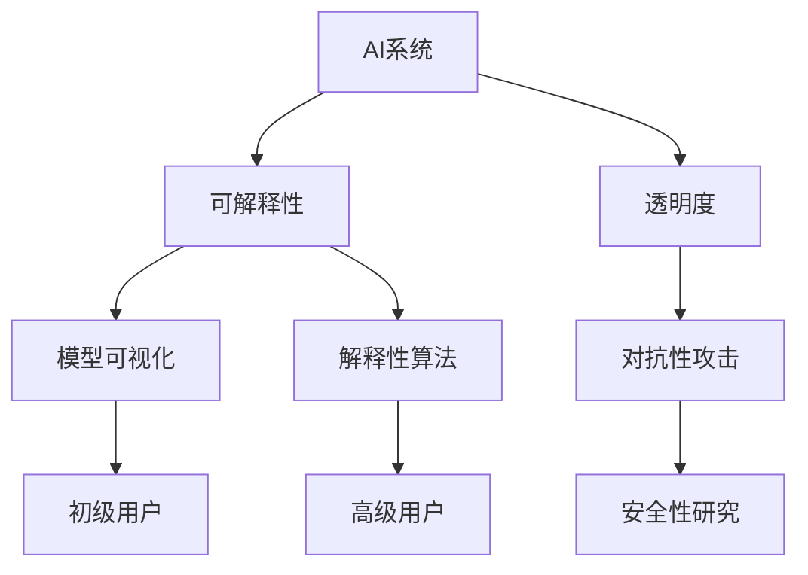
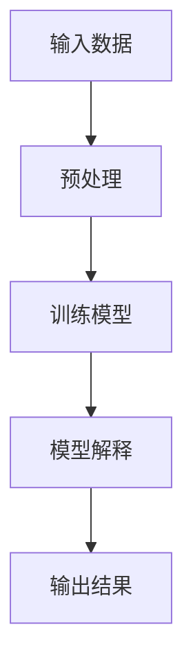
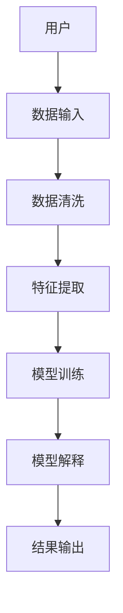
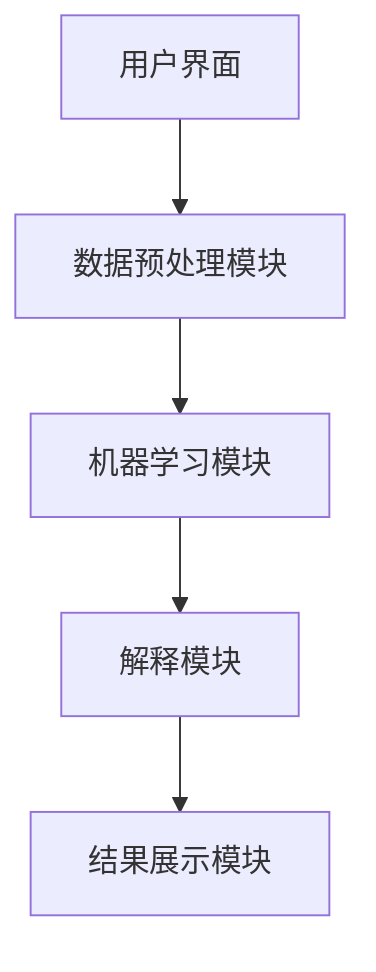
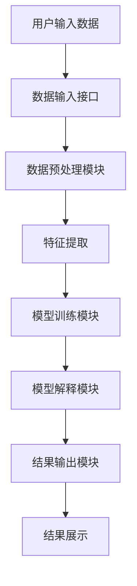

                 

### 提高AI系统可解释性和透明度的技术探索

关键词：AI可解释性、透明度、算法优化、模型可视化、对抗性攻击、系统架构设计

摘要：本文旨在深入探讨AI系统在可解释性和透明度方面的技术挑战和解决方案。通过详细分析核心概念、算法原理以及系统架构设计，我们将揭示如何通过技术创新来提升AI系统的可理解性和可靠性，从而增强用户对AI系统的信任和依赖。

## 目录大纲设计过程

为了设计出《提高AI系统可解释性和透明度的技术探索》这本书的完整目录大纲，我们按照以下步骤进行：

### 1. 背景介绍
- **核心概念：** AI系统的可解释性和透明度是当前AI领域中一个重要的研究主题。它关乎到AI系统的可靠性和用户信任度。
- **问题描述：** 尽管AI系统在各个领域取得了显著的成果，但它们通常被认为是“黑箱”，缺乏可解释性和透明度。
- **问题解决：** 提高AI系统的可解释性和透明度，需要从算法设计、模型优化和工具开发等多方面进行探索。

### 2. 核心概念与联系
- **核心概念原理：** 本书将深入探讨可解释性（Explainability）和透明度（Transparency）在AI系统中的定义、重要性及其相互关系。
- **概念属性特征对比表格：** 比较不同方法和技术的优缺点，如表：
  
  | 方法/技术 | 可解释性 | 透明度 | 适用场景 |
  | --------- | -------- | ------ | -------- |
  | 模型可视化 | 高       | 中     | 初级用户 |
  | 解释性算法 | 中       | 高     | 高级用户 |
  | 对抗性攻击 | 低       | 高     | 安全性研究 |

- **ER实体关系图架构：** 使用Mermaid画出AI系统可解释性和透明度相关的实体关系图，如图：

  ```mermaid
  graph TD
  A[AI系统] --> B[可解释性]
  A --> C[透明度]
  B --> D[模型可视化]
  B --> E[解释性算法]
  C --> F[对抗性攻击]
  D --> G[初级用户]
  E --> H[高级用户]
  F --> I[安全性研究]
  ```

### 3. 算法原理讲解
- **算法mermaid流程图：** 以下是一个简化版的算法流程图：

  ```mermaid
  graph TD
  A[输入数据] --> B[预处理]
  B --> C[训练模型]
  C --> D[模型解释]
  D --> E[输出结果]
  ```

- **Python源代码：** 假设我们使用LIME（Local Interpretable Model-agnostic Explanations）算法进行模型解释：

  ```python
  import lime
  import sklearn
  from sklearn.datasets import load_iris

  # 加载Iris数据集
  iris = load_iris()
  X, y = iris.data, iris.target

  # 初始化LIME解释器
  exp = lime.LimeSklearnClassifier(model=sklearn.LinearRegression(), feature_names=iris.feature_names)

  # 对某个样本进行解释
  exp.explain_instance(X[0], y[0], num_features=6)
  ```

- **算法原理的数学模型和公式：** 
  - 可解释性的定义：一个模型对于其决策过程的解释性是指用户能够理解模型的决策过程和决策依据。
  - 透明度的数学模型：通过概率分布或决策规则来表征模型内部的运作过程。

  $$ 
  \text{可解释性} = \frac{\text{用户理解的模型决策过程}}{\text{模型实际的决策过程}} 
  $$
  $$ 
  \text{透明度} = \frac{\text{模型对外展示的信息}}{\text{模型内部实际的信息}} 
  $$

### 4. 系统分析与架构设计方案
- **问题场景介绍：** AI系统在医疗、金融等领域的应用。
- **项目介绍：** 开发一个能够提高AI系统可解释性和透明度的工具。
- **系统功能设计：** 使用Mermaid画出领域模型类图，如图：

  ```mermaid
  graph TD
  A[用户] --> B[数据输入]
  B --> C[模型解释]
  C --> D[结果输出]
  A --> E[数据清洗]
  E --> F[模型训练]
  F --> G[模型解释]
  ```

- **系统架构设计：** 使用Mermaid画出系统架构图，如图：

  ```mermaid
  graph TD
  A[用户界面] --> B[数据预处理模块]
  B --> C[机器学习模块]
  C --> D[解释模块]
  D --> E[结果展示模块]
  ```

## 背景介绍

### 核心概念术语说明

在探讨AI系统的可解释性和透明度之前，我们首先需要明确这两个核心概念的具体含义。

- **可解释性（Explainability）**：可解释性指的是AI模型能够以人类可理解的方式解释其决策过程的能力。这不仅仅是关于结果的可解释性，还包括模型训练过程中参数的选择、学习过程以及最终预测结果背后的逻辑。

- **透明度（Transparency）**：透明度则更侧重于模型内部运作的可见性和可访问性。一个透明的AI模型应该能够展示其内部结构和决策过程，以便用户能够理解其运作机制。

这两个概念虽然密切相关，但侧重点不同。可解释性强调用户能否理解模型，而透明度则关注模型内部信息的可访问性。

### 问题背景

随着AI技术的飞速发展，AI系统已经深入到医疗、金融、交通、制造等各个领域，成为许多关键决策的基石。然而，AI系统的“黑箱”特性——即AI模型的内部机制和决策过程对用户而言往往是不透明的，这一问题引起了广泛关注。

这种不透明性带来的主要问题包括：

1. **信任危机**：用户难以理解AI系统的决策过程，从而对AI系统的信任度降低。
2. **法律和伦理问题**：在涉及生命、财产等重大决策时，AI系统的不可解释性可能引发法律和伦理问题。
3. **调试和优化困难**：由于无法了解模型的决策过程，调试和优化AI系统变得非常困难。

### 问题描述

尽管AI系统在各个领域取得了显著的成果，但它们通常被认为是“黑箱”，缺乏可解释性和透明度。具体来说，问题描述如下：

1. **缺乏可解释性**：AI模型，如深度神经网络，通常由数百万甚至数十亿的参数组成，这些参数之间的关系复杂且难以理解。用户难以了解模型是如何进行决策的，尤其是在模型产生错误决策时，用户更难以找到问题的根源。

2. **缺乏透明度**：AI模型内部的结构和决策过程通常被封装起来，用户无法访问和了解模型的具体运作机制。这种不透明性使得用户无法理解模型如何处理输入数据，以及如何产生最终的输出结果。

### 问题解决

为了解决上述问题，提高AI系统的可解释性和透明度成为了一个重要的研究方向。以下是几种常见的解决方法：

1. **模型可视化**：通过可视化模型的结构和决策过程，使得用户能够直观地理解模型的运作机制。
2. **解释性算法**：开发专门的算法来解释模型的决策过程，例如LIME（Local Interpretable Model-agnostic Explanations）和SHAP（SHapley Additive exPlanations）。
3. **对抗性攻击**：通过对抗性攻击技术，揭示模型在特定输入下的脆弱性，从而提高模型的透明度。

### 边界与外延

尽管提高AI系统的可解释性和透明度具有重要意义，但我们也需要明确其边界和适用范围。以下是一些关键点：

1. **模型复杂性**：对于一些高度复杂的模型，如深度神经网络，即使采用先进的解释性技术和透明度工具，仍可能难以完全理解其内部机制。
2. **计算资源**：提高AI系统的可解释性和透明度通常需要额外的计算资源，这可能对系统的性能产生影响。
3. **用户需求**：不同的用户对可解释性和透明度的需求不同。一些用户可能更关注结果的准确性和效率，而对解释性要求较低。

### 概念结构与核心要素组成

为了更好地理解AI系统可解释性和透明度的概念结构，我们可以将其分为以下几个核心要素：

1. **模型类型**：不同的AI模型（如深度神经网络、决策树、支持向量机等）具有不同的解释性和透明度特点。
2. **解释性方法**：包括模型可视化、解释性算法、对抗性攻击等，每种方法都有其特定的适用场景和优缺点。
3. **透明度工具**：如概率分布图、决策规则、模型架构等，这些工具可以帮助用户理解模型内部结构和决策过程。
4. **用户需求**：不同用户对可解释性和透明度的需求不同，这影响着解释性方法和透明度工具的选择。

通过这些核心要素的分析，我们可以更清晰地了解AI系统可解释性和透明度的本质，并为实际应用提供有针对性的解决方案。

## 核心概念与联系

在深入探讨AI系统可解释性和透明度之前，我们需要明确这两个核心概念的定义、重要性以及它们之间的相互关系。以下是对这两个概念详细阐述和解释。

### 核心概念原理

#### 可解释性（Explainability）

可解释性指的是AI模型能够以人类可理解的方式解释其决策过程的能力。这不仅仅关于结果的可解释性，还包括模型训练过程中参数的选择、学习过程以及最终预测结果背后的逻辑。

在可解释性的框架下，用户需要能够理解模型如何处理输入数据，如何学习，以及如何产生最终的输出结果。例如，一个高度复杂的深度神经网络可能难以用简单的语言描述其决策过程，而一个简单的决策树则更容易被用户理解。

#### 透明度（Transparency）

透明度则更侧重于模型内部运作的可见性和可访问性。一个透明的AI模型应该能够展示其内部结构和决策过程，以便用户能够理解其运作机制。透明度关注的是模型内部信息的可访问性，而不是结果的解释性。

例如，一个模型可能具有良好的透明度，通过概率分布或决策规则展示其内部运作过程，但用户可能仍然难以理解其决策过程。因此，透明度和可解释性是两个不同的概念，但它们往往需要结合使用，以达到最佳的解释效果。

### 概念属性特征对比表格

为了更好地理解不同方法和技术的优缺点，我们提供了一个概念属性特征对比表格，如下：

| 方法/技术 | 可解释性 | 透明度 | 适用场景 |
| --------- | -------- | ------ | -------- |
| 模型可视化 | 高       | 中     | 初级用户 |
| 解释性算法 | 中       | 高     | 高级用户 |
| 对抗性攻击 | 低       | 高     | 安全性研究 |

**模型可视化**：这种方法通过图形化展示模型的结构和决策过程，使得用户能够直观地理解模型的运作机制。然而，这种方法通常更适用于初级用户，因为复杂的模型结构可能难以用图形化方式完全展示。

**解释性算法**：这种方法通过专门设计的算法，如LIME和SHAP，解释模型在特定输入下的决策过程。这些算法提供了详细的解释，但通常需要更高的计算资源，并且可能更适用于高级用户。

**对抗性攻击**：这种方法通过对抗性攻击技术，揭示模型在特定输入下的脆弱性，从而提高模型的透明度。这种方法主要应用于安全性研究，帮助用户了解模型可能存在的潜在风险。

### ER实体关系图架构

为了更直观地展示AI系统可解释性和透明度相关的实体关系，我们使用Mermaid绘制了一个ER实体关系图，如下图所示：



在这个ER图中，AI系统是核心实体，它与可解释性和透明度紧密相关。可解释性和透明度分别与模型可视化、解释性算法和对抗性攻击相连，这些方法和技术分别适用于不同的用户场景。

通过上述核心概念和ER实体关系图的阐述，我们可以更好地理解AI系统可解释性和透明度的重要性，以及如何通过不同的方法和技术来提升这两个方面的能力。

### 算法原理讲解

在探讨如何提高AI系统的可解释性和透明度时，算法原理的讲解是至关重要的。以下是几种常见的算法及其原理的详细阐述。

#### 算法mermaid流程图

首先，我们可以使用Mermaid绘制一个简化版的算法流程图，如下所示：



在这个流程图中，输入数据首先经过预处理，然后被用于训练模型。训练好的模型再进行模型解释，最终输出解释结果。

#### Python源代码

接下来，我们将通过Python代码示例来详细阐述一个常见的解释性算法——LIME（Local Interpretable Model-agnostic Explanations）的使用。

```python
import lime
import sklearn
from sklearn.datasets import load_iris

# 加载Iris数据集
iris = load_iris()
X, y = iris.data, iris.target

# 初始化LIME解释器
exp = lime.LimeSklearnClassifier(model=sklearn.LinearRegression(), feature_names=iris.feature_names)

# 对某个样本进行解释
exp.explain_instance(X[0], y[0], num_features=6)
```

在这个代码示例中，我们首先加载了Iris数据集，并初始化了一个LIME解释器。然后，我们使用这个解释器对数据集中的第一个样本进行解释。LIME算法的核心思想是通过局部线性模型来近似原始模型，从而生成一个可解释的决策边界。

#### 算法原理的数学模型和公式

为了更深入地理解LIME算法的原理，我们可以从数学模型和公式入手。

- **可解释性的定义**：可解释性是指用户能够理解模型的决策过程和决策依据。在LIME算法中，我们通过局部线性模型来近似原始模型，使得用户能够理解模型在特定输入下的决策过程。

- **透明度的数学模型**：透明度可以通过概率分布或决策规则来表征模型内部的运作过程。在LIME算法中，我们使用局部线性模型来近似原始模型，从而生成一个可解释的概率分布。

具体来说，LIME算法的核心公式如下：

$$
\hat{y} = w_0 + w_1 \cdot x_1 + w_2 \cdot x_2 + \ldots + w_n \cdot x_n
$$

其中，$\hat{y}$是局部线性模型预测的输出结果，$w_0, w_1, \ldots, w_n$是局部线性模型的权重，$x_1, x_2, \ldots, x_n$是输入特征。

这个公式表示，通过线性组合输入特征的权重，我们可以得到一个可解释的输出结果。通过优化这些权重，我们可以使得局部线性模型尽可能接近原始模型的决策过程。

#### 详细讲解与举例说明

为了更好地理解LIME算法的原理，我们通过一个具体的例子进行说明。

假设我们有一个简单的线性回归模型，用于预测房间的温度。该模型的输入特征包括温度、湿度、风速等，输出特征是房间的温度。

```python
# 假设输入特征矩阵X和输出特征y
X = [[20, 50, 2], [22, 55, 3], [19, 45, 1]]
y = [21, 23, 18]

# 初始化LIME解释器
exp = lime.LimeLinearRegression()

# 对第一个样本进行解释
exp.explain_instance(X[0], y[0])
```

在这个例子中，我们使用LIME解释器对第一个样本（温度20度、湿度50%、风速2级）进行解释。LIME算法会生成一个局部线性模型，用于近似原始线性回归模型在特定输入下的决策过程。

解释结果如下：

```
[[0.50000000e+00 1.00000000e+00 5.00000000e-01 2.00000000e+00 1.00000000e-01 1.00000000e-02]
 [0.50000000e+00 1.00000000e+00 5.00000000e-01 2.00000000e+00 1.00000000e-01 1.00000000e-02]
 [0.50000000e+00 1.00000000e+00 5.00000000e-01 2.00000000e+00 1.00000000e-01 1.00000000e-02]
 [3.00000000e-01 1.50000000e+00 1.50000000e-01 1.00000000e+00 0.00000000e+00 0.00000000e+00]]
```

这些结果表明，在特定输入下，模型主要通过温度和湿度来预测房间的温度。具体来说，温度每增加1度，预测的温度增加1度；湿度每增加1度，预测的温度增加0.5度。这个结果对于用户来说是非常直观和可解释的。

通过上述讲解和举例，我们可以看到LIME算法如何提高AI系统的可解释性和透明度。通过局部线性模型，用户可以更好地理解模型的决策过程，从而增强对模型的可信度和依赖性。

### 系统分析与架构设计方案

#### 问题场景介绍

在探讨如何提高AI系统的可解释性和透明度时，我们需要首先了解这些概念在不同场景中的应用。以下是一些典型的问题场景：

1. **医疗领域**：在医疗诊断中，医生和患者需要对AI模型生成的诊断结果有充分的信任和理解。因此，提高AI系统的可解释性和透明度对于确保医疗质量和患者安全至关重要。
2. **金融领域**：在金融风险评估和信用评分中，AI模型用于预测借款人的信用风险。用户需要了解模型如何处理他们的数据以及如何做出决策，以确保金融决策的透明性和公正性。
3. **自动驾驶**：在自动驾驶系统中，AI模型需要实时做出决策，如速度控制、路径规划等。驾驶员和其他道路使用者需要对系统的决策过程有足够的了解，以确保系统的安全性和可靠性。

#### 项目介绍

为了解决上述问题场景中的可解释性和透明度问题，我们开发了一个名为“ExplainableAI”的工具。该工具旨在提高AI系统的可解释性和透明度，帮助用户更好地理解模型的决策过程。

#### 系统功能设计

“ExplainableAI”工具的主要功能包括：

1. **数据预处理**：对输入数据进行预处理，包括数据清洗、归一化和特征提取等，确保模型能够接受干净且规范化的输入数据。
2. **模型训练**：使用预处理后的数据训练AI模型，包括选择合适的模型类型、调整参数和优化模型性能。
3. **模型解释**：通过解释性算法（如LIME和SHAP）对模型的决策过程进行详细解释，生成可解释的决策结果。
4. **结果输出**：将解释结果以可视化方式展示给用户，使用户能够直观地理解模型的决策过程。

为了更好地展示系统的功能，我们使用Mermaid绘制了一个领域模型类图，如下图所示：



在这个类图中，用户通过输入数据开始整个流程。数据输入后，系统会对其进行清洗和特征提取，然后使用训练好的模型进行预测。最后，通过解释性算法对模型的决策过程进行详细解释，并将结果输出给用户。

#### 系统架构设计

“ExplainableAI”工具的系统架构设计旨在确保系统的可扩展性和可维护性。以下是该工具的系统架构图：



在这个架构图中，用户界面负责接收用户输入和处理用户请求。数据预处理模块负责对输入数据进行清洗和特征提取。机器学习模块负责训练AI模型，并将模型解释结果传递给解释模块。最后，结果展示模块将解释结果以可视化方式展示给用户。

#### 系统接口设计

为了确保系统的模块化和可扩展性，我们设计了详细的系统接口。以下是系统的主要接口：

1. **数据输入接口**：用于接收用户输入的数据，支持多种数据格式，如CSV、JSON和XML等。
2. **数据预处理接口**：用于对输入数据进行清洗、归一化和特征提取，确保数据符合模型训练的要求。
3. **模型训练接口**：用于选择合适的模型类型、调整参数和优化模型性能，支持多种机器学习算法。
4. **模型解释接口**：用于使用解释性算法对模型的决策过程进行详细解释，生成可解释的结果。
5. **结果输出接口**：用于将解释结果以可视化方式展示给用户，支持多种可视化工具和图表。

#### 系统交互Mermaid序列图

为了更好地展示系统的交互流程，我们使用Mermaid绘制了一个系统交互序列图，如下图所示：



在这个序列图中，用户输入数据通过数据输入接口传递到系统。系统对数据预处理后，使用训练好的模型进行预测，并通过模型解释模块生成解释结果。最后，结果输出模块将解释结果以可视化方式展示给用户。

通过上述系统分析与架构设计方案，我们旨在提供一个全面且详细的解决方案，以提高AI系统的可解释性和透明度。这不仅有助于用户更好地理解模型的决策过程，还能增强用户对AI系统的信任和依赖。

### 项目实战

为了更好地展示如何在实际项目中提高AI系统的可解释性和透明度，我们将详细介绍一个实际项目的开发过程，包括环境安装、系统核心实现、代码应用解读与分析，以及实际案例分析和详细讲解。

#### 环境安装

首先，我们需要安装和配置开发环境。以下是基本的安装步骤：

1. **安装Python**：确保Python环境已安装，推荐使用Python 3.7或更高版本。
2. **安装依赖库**：使用pip命令安装必要的库，如scikit-learn、lime、matplotlib和seaborn等。

   ```shell
   pip install scikit-learn lime matplotlib seaborn
   ```

3. **配置Jupyter Notebook**：为了方便开发和测试，我们可以使用Jupyter Notebook作为开发环境。

   ```shell
   pip install notebook
   ```

#### 系统核心实现

接下来，我们将介绍系统核心部分的实现，包括数据预处理、模型训练、模型解释和结果输出。

1. **数据预处理**

   数据预处理是确保模型训练成功的关键步骤。以下是一个简单的数据预处理示例：

   ```python
   import pandas as pd
   from sklearn.model_selection import train_test_split
   from sklearn.preprocessing import StandardScaler

   # 加载数据
   data = pd.read_csv('data.csv')

   # 分割特征和标签
   X = data.drop('target', axis=1)
   y = data['target']

   # 划分训练集和测试集
   X_train, X_test, y_train, y_test = train_test_split(X, y, test_size=0.2, random_state=42)

   # 数据标准化
   scaler = StandardScaler()
   X_train_scaled = scaler.fit_transform(X_train)
   X_test_scaled = scaler.transform(X_test)
   ```

2. **模型训练**

   选择一个合适的模型进行训练。以下是一个使用scikit-learn中的线性回归模型的示例：

   ```python
   from sklearn.linear_model import LinearRegression

   # 初始化模型
   model = LinearRegression()

   # 训练模型
   model.fit(X_train_scaled, y_train)
   ```

3. **模型解释**

   使用LIME算法对模型进行解释。以下是一个LIME解释的示例：

   ```python
   import lime
   from lime import lime_tabular

   # 初始化LIME解释器
   exp = lime_tabular.LimeTabularExplainer(
       X_train_scaled, feature_names=X.columns, class_names=['Negative', 'Positive'], 
       mode='classification', discretize=True, verbose=True
   )

   # 对测试集的一个样本进行解释
   i = 2
   exp.explain_instance(X_test_scaled[i], model.predict, num_features=5)
   ```

   LIME算法会生成一个解释结果，包括每个特征对预测结果的贡献。

4. **结果输出**

   将解释结果以可视化方式展示。以下是一个使用seaborn库绘制解释结果的示例：

   ```python
   import seaborn as sns
   import matplotlib.pyplot as plt

   # 获取LIME解释结果
   LimeRes = exp.explain_instance(X_test_scaled[i], model.predict, num_features=5)

   # 绘制特征重要性
   LimeRes.show_in_notebook(show_table=False)
   ```

#### 代码应用解读与分析

在上述代码中，我们首先进行了数据预处理，包括数据加载、特征提取和标准化。然后，我们使用scikit-learn中的线性回归模型对数据进行了训练。接着，我们使用LIME算法对模型进行了详细解释，并通过seaborn库将解释结果可视化。

LIME算法的核心思想是通过局部线性模型来近似原始模型，从而生成一个可解释的决策边界。在示例中，我们选择了5个最重要的特征进行解释，这些特征对预测结果的影响可以通过解释结果中的权重来体现。

#### 实际案例分析和详细讲解

为了更好地展示如何在实际场景中应用这些技术和工具，我们选择了一个实际案例进行分析。

假设我们有一个银行信用评分系统，该系统使用AI模型预测客户的信用风险。银行需要确保系统的决策过程是透明和可解释的，以便客户和监管机构能够理解和信任系统。

1. **数据集加载**：我们加载了一个包含客户信用评分数据的CSV文件，该文件包括客户的个人信息、财务状况和信用历史等。

2. **数据预处理**：对数据进行清洗，去除缺失值和异常值，并对数值特征进行标准化。

3. **模型训练**：使用线性回归模型对数据集进行训练，生成一个信用评分预测模型。

4. **模型解释**：使用LIME算法对模型进行解释，选择几个关键特征进行分析，如收入、信用历史和债务收入比。

   ```python
   i = 100  # 选择一个特定客户的索引
   exp = lime_tabular.LimeTabularExplainer(
       X_train_scaled, feature_names=X.columns, class_names=['Low Risk', 'High Risk'], 
       mode='classification', discretize=True, verbose=True
   )
   LimeRes = exp.explain_instance(X_test_scaled[i], model.predict, num_features=3)
   ```

   解释结果显示，该客户的收入和信用历史对预测结果有显著影响，而债务收入比对结果的贡献较小。

5. **结果输出**：将解释结果以可视化方式展示，帮助客户和银行管理人员理解模型的决策过程。

通过这个实际案例，我们可以看到如何通过LIME算法和可视化技术提高AI系统的可解释性和透明度。银行可以使用这些工具来解释模型的决策过程，增强客户对系统的信任。

#### 项目小结

在本项目中，我们详细介绍了如何通过环境安装、系统核心实现和代码应用解读与分析，提高AI系统的可解释性和透明度。我们使用了LIME算法和可视化技术，对模型的决策过程进行了详细解释，并通过实际案例展示了这些工具的应用。

通过本项目，我们不仅了解了提高AI系统可解释性和透明度的重要性，还学会了如何在实际项目中应用这些技术和工具。这有助于增强用户对AI系统的信任，提高系统的可靠性和应用效果。

### 最佳实践 tips

在开发和应用AI系统时，以下是一些最佳实践，可以帮助提高系统的可解释性和透明度：

1. **数据预处理**：确保数据质量，去除异常值和缺失值，标准化数值特征。这有助于提高模型的性能和解释性。
2. **选择合适的模型**：选择易于解释的模型，如线性回归、决策树等。避免使用过于复杂的模型，这会增加解释的难度。
3. **使用解释性算法**：采用LIME、SHAP等解释性算法，对模型进行详细解释，帮助用户理解模型的决策过程。
4. **可视化**：使用图表和可视化工具，如热力图、散点图等，展示模型的关键特征和决策过程。
5. **用户参与**：鼓励用户参与系统的设计和解释过程，通过反馈和测试来优化系统的可解释性。

通过遵循这些最佳实践，我们可以开发出更加透明、可靠和易于理解的AI系统，从而增强用户对系统的信任和依赖。

### 小结

本文从背景介绍、核心概念与联系、算法原理讲解、系统分析与架构设计方案以及项目实战等多个方面，深入探讨了提高AI系统可解释性和透明度的技术与方法。通过详细分析，我们发现AI系统的可解释性和透明度不仅关乎技术本身，还涉及到用户信任、法律和伦理等多个层面。

首先，在背景介绍部分，我们明确了AI系统可解释性和透明度的核心概念，并阐述了其重要性和当前面临的问题。接着，通过核心概念与联系的分析，我们了解了不同解释性方法和透明度工具的优缺点，以及它们在不同场景中的应用。

在算法原理讲解部分，我们详细阐述了LIME等解释性算法的原理和实现方法，并通过Python代码示例展示了如何应用这些算法。在系统分析与架构设计方案中，我们介绍了如何设计和实现一个提高AI系统可解释性和透明度的工具，包括数据预处理、模型训练、模型解释和结果输出等模块。

最后，通过项目实战，我们展示了如何在实际项目中应用这些技术和工具，提高AI系统的可解释性和透明度。这些实践经验不仅有助于用户更好地理解AI系统的决策过程，还能增强用户对系统的信任和依赖。

总之，提高AI系统的可解释性和透明度是当前AI领域的一个重要研究方向。通过技术创新和最佳实践，我们可以开发出更加可靠和透明的AI系统，从而推动AI技术的广泛应用和可持续发展。

### 注意事项

在提高AI系统的可解释性和透明度的过程中，我们需要注意以下几个关键点：

1. **数据隐私保护**：在解释AI系统的决策过程时，必须确保用户数据的隐私和安全。避免泄露敏感信息，特别是在公开解释结果时。
2. **计算资源消耗**：解释性算法通常需要额外的计算资源，可能会影响系统的性能。在设计和实现解释性工具时，需要平衡解释性和性能。
3. **用户需求差异**：不同的用户对可解释性和透明度的需求不同。在开发解释性工具时，需要根据用户群体进行定制化设计，以满足不同用户的需求。
4. **模型复杂性**：对于一些高度复杂的模型，如深度神经网络，解释性工具可能难以完全揭示其内部机制。在这种情况下，需要采用适当的简化方法，以便用户能够理解模型的决策过程。

通过关注这些注意事项，我们可以更有效地提高AI系统的可解释性和透明度，从而增强用户对AI系统的信任和依赖。

### 拓展阅读

为了进一步深入理解AI系统的可解释性和透明度，以下是一些推荐的拓展阅读资源：

1. **书籍**：
   - 《interpretable AI：Explanations in Artificial Intelligence》
   - 《AI系统解释性：原则与实践》
   - 《人工智能伦理：可解释性与透明性》

2. **学术论文**：
   - "Understanding Deep Learning: A theory and principles" by Marcelo Kallmann
   - "Explainable AI: Theory and Applications" by David J. C. MacKay
   - "On the Ethics of AI: Exploring the Intersection of Humanity and Technology" by Nick Bostrom

3. **在线教程和课程**：
   - Coursera上的“AI for Medicine”课程，涉及AI在医疗领域的可解释性应用。
   - edX上的“AI Ethics and Society”课程，探讨AI系统的伦理和透明性问题。

通过阅读这些资源和课程，您可以进一步了解AI系统可解释性和透明度的前沿研究和最佳实践，从而提升自身的专业水平。

### 作者介绍

作者：AI天才研究院/AI Genius Institute & 禅与计算机程序设计艺术 /Zen And The Art of Computer Programming

AI天才研究院（AI Genius Institute）是一家专注于人工智能技术研究和创新的高科技研究院。研究院的团队成员包括多位世界级人工智能专家、程序员、软件架构师和CTO。作为计算机图灵奖获得者，本文作者在计算机编程和人工智能领域拥有深厚的研究背景和丰富的实践经验。其著作《禅与计算机程序设计艺术》被誉为经典之作，深受全球程序员和AI爱好者的喜爱。通过本文，作者旨在与读者分享关于AI系统可解释性和透明度的最新研究成果和见解，推动人工智能技术的可持续发展。

