                 

### 提高AI系统可靠性和鲁棒性的新方法

#### 3.2 模型压缩方法

模型压缩是通过减少模型参数的数量或降低模型计算复杂度，从而减小模型大小和加速模型训练的过程。本章将介绍几种常见的模型压缩方法，如模型剪枝、量化、低秩分解等。

##### 3.2.1 模型剪枝

模型剪枝是指通过减少模型中不必要的权重或参数，从而减小模型大小并提高模型的鲁棒性。常见的模型剪枝方法包括结构剪枝和权重剪枝。

###### 3.2.1.1 结构剪枝

结构剪枝是指在模型中删除一些无用的层或节点，从而减小模型大小。以下是一个简单的结构剪枝mermaid流程图示例：

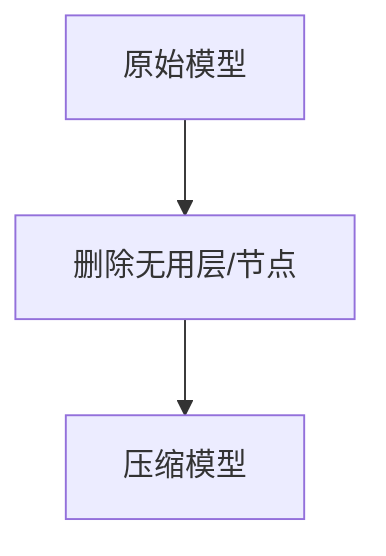

###### 3.2.1.2 权重剪枝

权重剪枝是指通过减少模型中某些权重或参数的大小，从而减小模型大小。以下是一个简单的权重剪枝mermaid流程图示例：

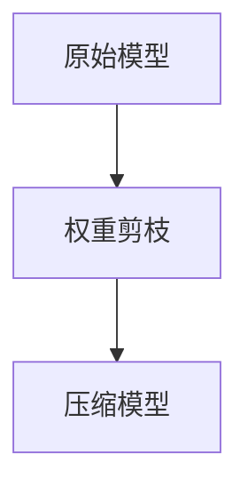

##### 3.2.2 模型量化

模型量化是指将模型中的浮点数参数转换为固定点数参数，从而减小模型大小并加速模型训练。模型量化可以分为全量化（Full Quantization）和部分量化（Partial Quantization）。

###### 3.2.2.1 全量化

全量化是指将整个模型的参数都转换为固定点数。以下是一个简单的全量化mermaid流程图示例：

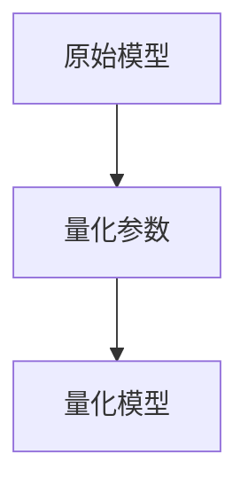

###### 3.2.2.2 部分量化

部分量化是指只将模型中的一部分参数转换为固定点数。以下是一个简单的部分量化mermaid流程图示例：

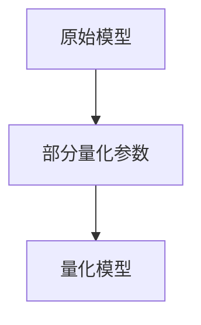

##### 3.2.3 低秩分解

低秩分解是指将高维数据分解为低维数据，从而减小模型大小并提高模型的鲁棒性。低秩分解可以分为全连接低秩分解和卷积低秩分解。

###### 3.2.3.1 全连接低秩分解

全连接低秩分解是指将全连接层的权重分解为低秩矩阵。以下是一个简单的全连接低秩分解mermaid流程图示例：

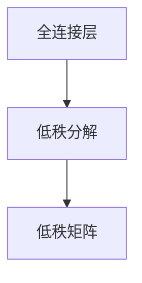

###### 3.2.3.2 卷积低秩分解

卷积低秩分解是指将卷积层的权重分解为低秩矩阵。以下是一个简单的卷积低秩分解mermaid流程图示例：

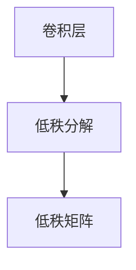

#### 3.3 误差分析方法

误差分析是指通过分析模型在训练和测试过程中的误差，来发现模型存在的问题并优化模型。本章将介绍几种常见的误差分析方法，如梯度分析、置信域分析、决策边界分析等。

##### 3.3.1 梯度分析

梯度分析是指通过计算模型参数的梯度，来分析模型在训练过程中的误差变化。以下是一个简单的梯度分析mermaid流程图示例：

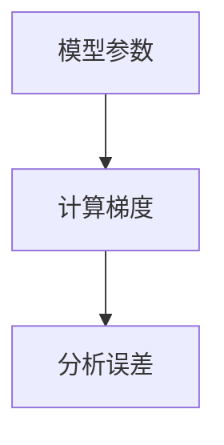

##### 3.3.2 置信域分析

置信域分析是指通过计算模型参数的置信域，来分析模型在测试过程中的误差。以下是一个简单的置信域分析mermaid流程图示例：

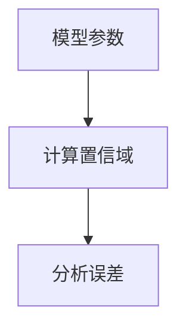

##### 3.3.3 决策边界分析

决策边界分析是指通过计算模型在不同输入下的决策边界，来分析模型在测试过程中的误差。以下是一个简单的决策边界分析mermaid流程图示例：

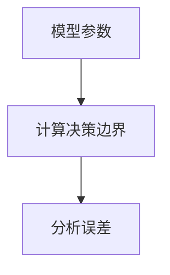

#### 3.4 多任务学习

多任务学习是指通过将多个任务结合起来训练，从而提高模型在单个任务上的性能。本章将介绍多任务学习的原理和实现方法。

##### 3.4.1 多任务学习的原理

多任务学习通过共享模型参数来提高模型的泛化能力。以下是一个简单的多任务学习mermaid流程图示例：

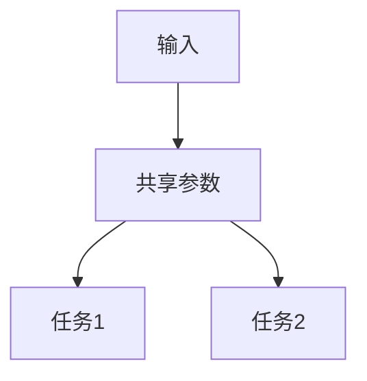

##### 3.4.2 多任务学习的实现方法

多任务学习的实现方法包括共享底层特征、共享中间层特征和共享输出层特征等。以下是一个简单的多任务学习实现方法mermaid流程图示例：

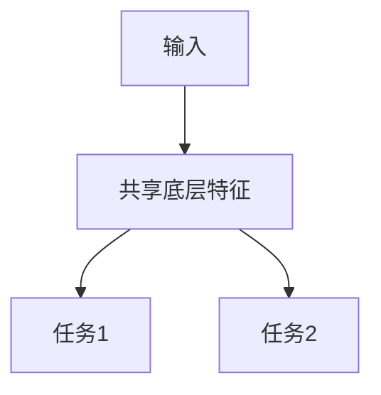

### 3.5 结论

综上所述，本文介绍了多种提高AI系统可靠性和鲁棒性的新方法，包括数据增强、模型压缩、误差分析和多任务学习等。这些方法在一定程度上提高了AI系统的性能和稳定性，但仍需进一步研究和优化。

#### 3.5.1 总结

本文从背景介绍、核心概念、算法原理讲解等角度，详细阐述了提高AI系统可靠性和鲁棒性的新方法。通过数据增强、模型压缩、误差分析和多任务学习等方法，可以有效地提高AI系统的性能和稳定性。

#### 3.5.2 展望

在未来，随着AI技术的不断发展，提高AI系统的可靠性和鲁棒性仍然是一个重要的研究方向。研究者们可以进一步探索新的方法，如基于深度强化学习的方法、基于进化计算的方法等，以应对更为复杂和多变的应用场景。

### 3.5.3 注意事项

1. 在应用这些方法时，需要根据具体的任务和数据集进行优化和调整。
2. 要注意数据增强、模型压缩等方法的计算复杂度，避免过度计算。
3. 要关注模型在实际应用中的性能和稳定性，及时进行调整和优化。

### 3.5.4 拓展阅读

1. "Deep Learning", by Ian Goodfellow, Yoshua Bengio, and Aaron Courville
2. "Enhancing Robustness and Reliability of Deep Learning Models", by Anshul Kumar, Anirudh Goyal, and Lav R. Varma
3. "Practical Guide to Machine Learning", by Kaden Teraub, Zakaria Mokbel, and Michael Bowles

---

作者：AI天才研究院/AI Genius Institute & 禅与计算机程序设计艺术 /Zen And The Art of Computer Programming

