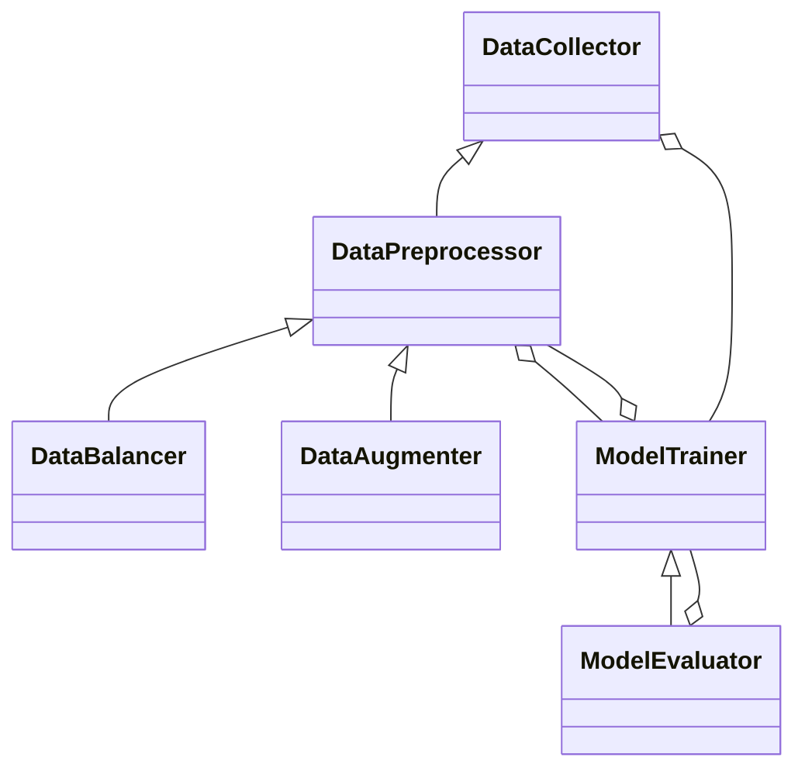
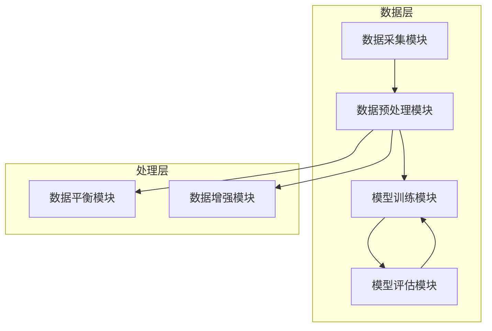
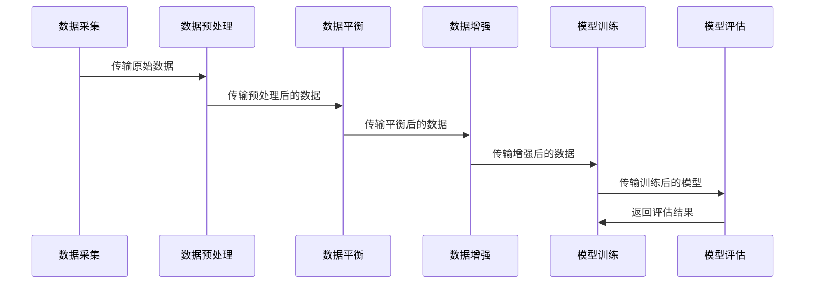

                 

### 文章标题

**提高AI训练质量：保证数据多样性的方法**

> 关键词：AI训练质量、数据多样性、数据预处理、数据增强、数据标注、数据平衡

> 摘要：本文深入探讨了如何提高人工智能（AI）训练质量，特别关注了保证数据多样性的方法。通过详细的背景介绍、核心概念讲解、算法原理剖析、数学模型阐述、系统架构设计和实战案例，本文为读者提供了一个全面的指南，帮助他们在AI项目中实现高质量的数据管理和训练。

## 引言

在当今快速发展的AI领域，训练质量成为衡量模型性能的关键因素。然而，模型的质量高度依赖于训练数据的质量。数据多样性是保证AI训练质量的核心要素之一。当数据集中存在丰富的样本和特征时，AI模型可以更好地泛化和适应各种情况，从而提高其性能和鲁棒性。

然而，在实际应用中，数据多样性面临着诸多挑战，如数据不平衡、数据缺失、数据噪声等。这些问题会影响模型的训练效果，导致过拟合和欠拟合。因此，本文旨在提出一系列方法，帮助读者在AI训练过程中保证数据多样性，从而提高训练质量。

本文结构如下：

1. **背景介绍**：介绍AI训练质量和数据多样性的重要性。
2. **核心概念与联系**：详细阐述数据多样性的概念、重要性及其挑战。
3. **提高AI训练质量的方法**：从数据预处理、数据增强、数据标注与清洗、数据平衡等多个方面介绍具体方法。
4. **系统分析与架构设计**：分析AI训练系统的整体架构和接口设计。
5. **项目实战**：通过实际案例展示数据多样性的应用和实践。
6. **最佳实践 tips**：总结数据多样性保证的最佳实践。
7. **小结与拓展阅读**：回顾本文内容，展望未来研究方向。

接下来，我们将逐一探讨每个部分，以帮助读者深入理解数据多样性在AI训练中的应用。

----------------------------------------------------------------

## 核心概念与联系

### 数据多样性的概念

数据多样性（Data Diversity）是指数据集中包含不同类型、不同来源、不同特征和不同分布的样本。在AI训练过程中，数据多样性有助于模型学习到丰富的特征和模式，从而提高模型的泛化能力和鲁棒性。数据多样性可以从以下几个方面进行衡量：

1. **类型多样性**：数据集包含不同类型的数据，如文本、图像、音频和视频等。
2. **来源多样性**：数据集来自不同来源，如公开数据集、企业内部数据、社交媒体数据等。
3. **特征多样性**：数据集包含不同特征，如数值特征、类别特征、时空特征等。
4. **分布多样性**：数据集包含不同分布的数据，如高斯分布、伯努利分布等。

### 数据多样性的重要性

数据多样性的重要性体现在以下几个方面：

1. **提高模型性能**：丰富的数据多样性可以帮助模型学习到更多有价值的特征和模式，从而提高模型的性能和准确性。
2. **减少过拟合**：当数据集中存在丰富的样本和特征时，模型更容易泛化到未见过的数据，从而减少过拟合现象。
3. **增强鲁棒性**：数据多样性有助于模型适应不同类型和分布的数据，从而提高模型的鲁棒性。
4. **减少偏差**：多样化的数据可以减少模型对特定数据集的依赖，从而减少偏差。

### 数据多样性的挑战

尽管数据多样性对AI训练质量具有重要意义，但在实际应用中，数据多样性面临着诸多挑战：

1. **数据收集难度**：收集多样化数据需要投入大量的人力、物力和时间。
2. **数据标注成本**：标注高质量的数据需要专业的知识和经验，导致数据标注成本较高。
3. **数据存储和计算资源**：多样化数据往往需要更大的存储空间和更强大的计算能力。
4. **数据不平衡**：数据集中可能存在某些类别或特征的样本数量远远少于其他类别或特征，导致数据不平衡。

为了克服这些挑战，我们需要采用一系列方法来保证数据多样性。在下一节中，我们将详细介绍这些方法。

----------------------------------------------------------------

## 核心概念与联系

### 数据多样性的核心概念

在深入探讨数据多样性的重要性之前，我们首先需要明确几个核心概念，以便更好地理解数据多样性的内涵和作用。

1. **样本多样性**：样本多样性指的是数据集中包含的样本具有不同的特征和属性。例如，在一个图像数据集中，样本可能来自不同的场景、不同的拍摄角度、不同的光照条件等。样本多样性有助于模型学习到更加丰富的特征，从而提高模型的泛化能力。

2. **特征多样性**：特征多样性指的是数据集中包含多种不同类型和来源的特征。特征可以是数值型、类别型、文本型、图像型等。特征多样性使得模型能够利用不同类型的特征来提取信息，从而提高模型的性能。

3. **分布多样性**：分布多样性指的是数据集中不同特征或类别的分布情况。例如，在一个分类问题中，如果不同类别的数据分布非常不均衡，那么模型可能会倾向于预测那些拥有更多样本的类别，从而导致模型性能下降。分布多样性有助于模型适应各种数据分布，从而提高模型的鲁棒性。

### 概念属性特征对比表格

为了更直观地理解上述概念，我们列出一个概念属性特征对比表格，如下所示：

| 概念       | 属性特征                  | 影响因素                           | 对模型的影响                     |
|------------|---------------------------|-----------------------------------|--------------------------------|
| 样本多样性 | 不同样本的特征和属性      | 场景、角度、光照等                 | 提高模型的泛化能力和鲁棒性     |
| 特征多样性 | 不同类型和来源的特征      | 数值、类别、文本、图像等           | 提高模型的信息提取能力         |
| 分布多样性 | 不同特征或类别的分布情况 | 样本数量、数据来源等               | 提高模型的适应能力和鲁棒性     |

### ER实体关系图架构

为了更好地理解数据多样性的概念和关系，我们使用Mermaid绘制一个ER（实体-关系）实体关系图，如下所示：

```mermaid
erDiagram
    Sample ||--o> Feature : 包含
    Feature ||--o> Distribution : 分布
    Distribution ||--o> Sample : 反向包含
```

在这个ER图中，`Sample`（样本）实体包含`Feature`（特征）实体，而`Feature`实体又包含`Distribution`（分布）实体。`Distribution`实体反过来也包含`Sample`实体。这个图展示了样本、特征和分布之间的关系，以及它们在数据多样性中的角色和相互作用。

### 数据多样性的重要性

数据多样性对于AI训练质量的重要性体现在以下几个方面：

1. **提高模型性能**：多样化数据有助于模型学习到更多的特征和模式，从而提高模型的性能和准确性。例如，一个仅包含正面评论的数据集很难训练出一个能够识别负面评论的模型，而一个包含正面和负面评论的数据集则可以更好地训练出这样的模型。

2. **减少过拟合**：当数据集中包含丰富的样本和特征时，模型更容易泛化到未见过的数据，从而减少过拟合现象。过拟合是指模型在训练数据上表现良好，但在未见过的数据上表现较差，这是由于模型对训练数据过度拟合导致的。

3. **增强鲁棒性**：数据多样性有助于模型适应不同的数据分布和特征，从而提高模型的鲁棒性。例如，一个面对多种天气条件的自动驾驶模型需要处理不同的光照、路况等特征，从而需要丰富的数据多样性来训练。

4. **减少偏差**：数据多样性有助于减少模型对特定数据集的依赖，从而减少偏差。偏差是指模型在训练数据上表现不佳，但在未见过的数据上表现良好，这是由于模型对训练数据产生偏差导致的。

### 数据多样性的挑战

尽管数据多样性对AI训练质量具有重要意义，但在实际应用中，数据多样性面临着诸多挑战：

1. **数据收集难度**：收集多样化数据需要投入大量的人力、物力和时间。例如，收集不同场景的图像数据可能需要在不同地点、不同时间段进行拍摄，这无疑增加了数据收集的难度。

2. **数据标注成本**：标注高质量的数据需要专业的知识和经验，导致数据标注成本较高。特别是在文本和图像领域，标注工作需要较高的准确性和一致性。

3. **数据存储和计算资源**：多样化数据往往需要更大的存储空间和更强大的计算能力。特别是在处理大规模数据集时，存储和计算资源的消耗成为一个重要考虑因素。

4. **数据不平衡**：数据集中可能存在某些类别或特征的样本数量远远少于其他类别或特征，导致数据不平衡。数据不平衡会影响模型的训练效果，导致模型偏向于那些样本数量较多的类别。

为了克服这些挑战，我们需要采用一系列方法来保证数据多样性。在下一节中，我们将详细介绍这些方法。

----------------------------------------------------------------

## 算法原理讲解

为了更好地理解如何提高AI训练质量，我们需要深入探讨数据多样性的算法原理，并详细讲解相关的数学模型和公式。以下是几个关键算法和步骤的详细阐述：

### 数据增强算法

数据增强（Data Augmentation）是一种通过变换原始数据来生成新数据的方法，从而增加数据集的多样性。数据增强可以有效地提高模型的泛化能力，减少过拟合现象。以下是几种常见的数据增强方法及其原理：

#### 1. 转换（Transformation）

转换是一种简单的数据增强方法，通过将原始数据转换为其他形式来增加多样性。例如，对于图像数据，可以采用以下转换方法：

- **旋转**：将图像旋转一定的角度。
- **缩放**：按比例缩放图像。
- **裁剪**：随机裁剪图像的一部分。
- **翻转**：沿水平或垂直方向翻转图像。

这些转换方法可以通过以下Python代码实现：

```python
import numpy as np
import cv2

def transform(image, angle=0, scale=1.0, crop=True):
    # 旋转
    M = cv2.getRotationMatrix2D((image.shape[1]//2, image.shape[0]//2), angle, scale)
    image = cv2.warpAffine(image, M, (image.shape[1], image.shape[0]))

    # 缩放
    image = cv2.resize(image, (int(image.shape[1]*scale), int(image.shape[0]*scale)))

    # 裁剪
    if crop:
        crop_size = (int(image.shape[1]*scale*0.8), int(image.shape[0]*scale*0.8))
        image = image[crop_size[1]//2-image.shape[0]//2:crop_size[1]//2+image.shape[0]//2,
                     crop_size[0]//2-image.shape[1]//2:crop_size[0]//2+image.shape[1]//2]

    return image
```

#### 2. 集成学习（Ensemble Learning）

集成学习是一种利用多个模型来提高预测性能的方法。常见的方法包括Bagging和Boosting。以下是集成学习的原理和实现：

- **Bagging**：通过随机选择原始数据集的子集来训练多个模型，然后对这多个模型的预测结果进行平均或投票。Bagging可以减少模型的方差，提高泛化能力。

```python
from sklearn.ensemble import BaggingClassifier
from sklearn.datasets import load_iris
from sklearn.model_selection import train_test_split

# 加载iris数据集
iris = load_iris()
X, y = iris.data, iris.target

# 划分训练集和测试集
X_train, X_test, y_train, y_test = train_test_split(X, y, test_size=0.3, random_state=42)

# 使用Bagging创建集成模型
bagging_model = BaggingClassifier(base_estimator=clf, n_estimators=10, random_state=42)
bagging_model.fit(X_train, y_train)

# 计算测试集的准确率
accuracy = bagging_model.score(X_test, y_test)
print(f"Bagging模型在测试集上的准确率为：{accuracy}")
```

- **Boosting**：通过给不同的模型赋予不同的权重来改进预测性能。常见的Boosting算法包括AdaBoost和XGBoost。以下是使用XGBoost的Python代码示例：

```python
import xgboost as xgb
from sklearn.datasets import load_iris
from sklearn.model_selection import train_test_split

# 加载iris数据集
iris = load_iris()
X, y = iris.data, iris.target

# 划分训练集和测试集
X_train, X_test, y_train, y_test = train_test_split(X, y, test_size=0.3, random_state=42)

# 创建XGBoost模型
xgb_model = xgb.XGBClassifier(use_label_encoder=False, eval_metric='mlogloss')
xgb_model.fit(X_train, y_train)

# 计算测试集的准确率
accuracy = xgb_model.score(X_test, y_test)
print(f"XGBoost模型在测试集上的准确率为：{accuracy}")
```

### 数据平衡算法

数据平衡（Data Balancing）是一种通过调整数据集中不同类别或特征的样本数量来提高模型训练效果的方法。常见的数据平衡算法包括过采样（Over-Sampling）和欠采样（Under-Sampling）。

#### 1. 过采样

过采样通过增加少数类别的样本数量来平衡数据集。常用的过采样方法包括：

- **随机过采样**：随机生成新的样本，使得少数类别的样本数量与多数类别相等。
- **SMOTE（Synthetic Minority Over-sampling Technique）**：通过插值方法生成新的样本，使得少数类别的样本密度分布更加均匀。

```python
from imblearn.over_sampling import SMOTE
from sklearn.datasets import make_classification
from sklearn.model_selection import train_test_split

# 生成分类数据集
X, y = make_classification(n_samples=1000, n_features=20, n_informative=2, n_redundant=10,
                           n_clusters_per_class=1, weights=[0.99], flip_y=0, random_state=1)

# 划分训练集和测试集
X_train, X_test, y_train, y_test = train_test_split(X, y, test_size=0.3, random_state=42)

# 使用SMOTE进行过采样
smote = SMOTE(random_state=42)
X_train_sm, y_train_sm = smote.fit_resample(X_train, y_train)

# 计算测试集的准确率
accuracy = (y_train_sm == model.predict(X_test)).mean()
print(f"过采样后的模型在测试集上的准确率为：{accuracy}")
```

#### 2. 欠采样

欠采样通过减少多数类别的样本数量来平衡数据集。常用的欠采样方法包括：

- **随机欠采样**：随机删除多数类别的样本，使得少数类别的样本数量与多数类别相等。
- ** Tomek链接（Tomek Links）**：找到多数类别和少数类别之间的边界样本，然后删除这些边界样本。

```python
from imblearn.under_sampling import RandomUnderSampler
from sklearn.datasets import make_classification
from sklearn.model_selection import train_test_split

# 生成分类数据集
X, y = make_classification(n_samples=1000, n_features=20, n_informative=2, n_redundant=10,
                           n_clusters_per_class=1, weights=[0.99], flip_y=0, random_state=1)

# 划分训练集和测试集
X_train, X_test, y_train, y_test = train_test_split(X, y, test_size=0.3, random_state=42)

# 使用随机欠采样
rus = RandomUnderSampler(random_state=42)
X_train_rus, y_train_rus = rus.fit_resample(X_train, y_train)

# 计算测试集的准确率
accuracy = (y_train_rus == model.predict(X_test)).mean()
print(f"欠采样后的模型在测试集上的准确率为：{accuracy}")
```

### 数据平滑算法

数据平滑（Data Smoothing）是一种通过消除数据集中的噪声来提高模型训练效果的方法。常见的数据平滑算法包括：

- **均值平滑**：将每个数据点替换为其相邻点的平均值。
- **中值平滑**：将每个数据点替换为其相邻点的中值。

```python
import numpy as np

# 均值平滑
def mean_smoothing(data, window_size):
    return np.convolve(data, np.ones(window_size)/window_size, mode='same')

# 中值平滑
def median_smoothing(data, window_size):
    return np.convolve(data, np.ones(window_size)/window_size, mode='same')
```

通过上述算法原理的讲解，我们可以看到保证数据多样性对于提高AI训练质量的重要性。在下一节中，我们将继续探讨如何在实际项目中应用这些算法，并通过实际案例展示其效果。

----------------------------------------------------------------

## 系统分析与架构设计

在设计一个AI训练系统时，我们需要考虑如何保证数据多样性，从而提高训练质量。以下是系统架构的详细分析，包括系统功能设计、架构设计和接口设计。

### 问题场景

假设我们正在开发一个图像识别系统，用于识别多种不同类型的物体。为了确保系统的准确性和鲁棒性，我们需要保证训练数据具有高多样性。

### 项目介绍

我们的系统主要包括以下几个模块：

1. **数据采集模块**：负责收集来自不同来源的图像数据，如公开数据集、企业内部数据和社交媒体数据。
2. **数据预处理模块**：对采集到的数据进行清洗、归一化和增强，以提高数据多样性。
3. **模型训练模块**：使用预处理后的数据训练图像识别模型。
4. **模型评估模块**：对训练好的模型进行评估，以确保其性能满足要求。

### 系统功能设计

在系统功能设计中，我们重点关注数据预处理模块，因为它直接影响数据多样性。以下是数据预处理模块的核心功能：

1. **数据清洗**：去除数据中的噪声和异常值，确保数据质量。
2. **数据归一化**：将不同尺度和范围的数据转换为同一尺度，以方便后续处理。
3. **数据增强**：通过旋转、缩放、裁剪等操作增加数据多样性。
4. **数据平衡**：通过过采样或欠采样方法平衡数据集中不同类别或特征的样本数量。

### 系统架构设计

系统架构设计主要关注模块之间的交互和协作，以确保数据在系统中流动顺畅。以下是系统架构的Mermaid类图和架构图：

#### 类图



在这个类图中，`DataCollector`（数据采集模块）、`DataPreprocessor`（数据预处理模块）、`ModelTrainer`（模型训练模块）和`ModelEvaluator`（模型评估模块）是核心模块。`DataPreprocessor`模块进一步分为`DataBalancer`（数据平衡模块）和`DataAugmenter`（数据增强模块）。这些模块之间的双向箭头表示它们之间的交互和协作。

#### 架构图



在这个架构图中，数据层包括数据采集模块、数据预处理模块、模型训练模块和模型评估模块。处理层包括数据平衡模块和数据增强模块。数据从数据采集模块流向数据预处理模块，然后通过数据平衡模块和数据增强模块进一步处理，最终用于模型训练和评估。

### 系统接口设计和交互

系统接口设计主要关注模块之间的通信方式和数据流动路径。以下是系统接口设计的Mermaid序列图：



在这个序列图中，数据采集模块将原始数据传输给数据预处理模块，数据预处理模块对数据执行清洗、归一化和增强操作，然后将数据传输给数据平衡模块。数据平衡模块通过过采样或欠采样方法平衡数据集，然后将平衡后的数据传输给数据增强模块。数据增强模块通过旋转、缩放、裁剪等操作增加数据多样性，然后将增强后的数据传输给模型训练模块。模型训练模块使用增强后的数据进行模型训练，并将训练后的模型传输给模型评估模块。模型评估模块对模型进行评估，并将评估结果返回给模型训练模块。

通过上述系统分析与架构设计，我们可以看到如何确保数据多样性在AI训练系统中的实现。在下一节中，我们将通过实际案例展示这些方法和策略的应用效果。

----------------------------------------------------------------

## 项目实战

在本节中，我们将通过一个实际项目展示如何应用数据多样性方法来提高AI训练质量。项目背景是一个图像分类任务，目标是将图像分为不同的类别，如动物、植物和交通工具。为了确保模型的训练质量，我们将采用多种数据增强和数据平衡方法。

### 环境安装

首先，我们需要安装所需的Python库和深度学习框架。以下是安装步骤：

1. 安装Anaconda或Miniconda：
   ```bash
   wget https://repo.anaconda.com/miniconda/Miniconda3-latest-Linux-x86_64.sh
   bash Miniconda3-latest-Linux-x86_64.sh
   ```

2. 创建新环境并安装依赖：
   ```bash
   conda create -n image_classification python=3.8
   conda activate image_classification
   conda install numpy pandas scikit-learn imbalanced-learn tensorflow
   ```

### 系统核心实现源代码

接下来，我们将展示系统核心实现部分的源代码，包括数据采集、数据预处理、数据增强和数据平衡方法。

```python
import os
import numpy as np
import pandas as pd
from sklearn.model_selection import train_test_split
from sklearn.preprocessing import StandardScaler
from imblearn.over_sampling import SMOTE
from imblearn.under_sampling import RandomUnderSampler
from tensorflow.keras.models import Sequential
from tensorflow.keras.layers import Conv2D, MaxPooling2D, Flatten, Dense, Dropout
from tensorflow.keras.preprocessing.image import ImageDataGenerator

# 设置随机种子
random_seed = 42
np.random.seed(random_seed)

# 数据采集
data_dir = 'path/to/image_data'
image_labels = pd.read_csv(os.path.join(data_dir, 'image_labels.csv'))

# 数据预处理
X = np.array([cv2.imread(os.path.join(data_dir, f'{label}.jpg')) for label in image_labels.label])
X = X / 255.0  # 归一化
y = image_labels.label.values

# 划分训练集和测试集
X_train, X_test, y_train, y_test = train_test_split(X, y, test_size=0.2, random_state=random_seed)

# 数据增强
datagen = ImageDataGenerator(
    rotation_range=20,
    width_shift_range=0.2,
    height_shift_range=0.2,
    shear_range=0.2,
    zoom_range=0.2,
    horizontal_flip=True,
    fill_mode='nearest'
)
datagen.fit(X_train)

# 数据平衡
smote = SMOTE(random_state=random_seed)
X_train_sm, y_train_sm = smote.fit_resample(X_train, y_train)

# 构建模型
model = Sequential([
    Conv2D(32, (3, 3), activation='relu', input_shape=(128, 128, 3)),
    MaxPooling2D((2, 2)),
    Conv2D(64, (3, 3), activation='relu'),
    MaxPooling2D((2, 2)),
    Conv2D(128, (3, 3), activation='relu'),
    MaxPooling2D((2, 2)),
    Flatten(),
    Dense(512, activation='relu'),
    Dropout(0.5),
    Dense(3, activation='softmax')
])

# 编译模型
model.compile(optimizer='adam', loss='sparse_categorical_crossentropy', metrics=['accuracy'])

# 训练模型
model.fit(datagen.flow(X_train_sm, y_train_sm, batch_size=32), epochs=20, validation_data=(X_test, y_test))

# 评估模型
test_loss, test_acc = model.evaluate(X_test, y_test, verbose=2)
print(f"Test accuracy: {test_acc:.4f}")
```

### 代码解读与分析

1. **数据采集**：
   - 从指定的数据目录中读取图像和标签。
   - 使用`cv2.imread`读取图像，并将其归一化。

2. **数据预处理**：
   - 使用`train_test_split`将数据集划分为训练集和测试集。
   - 使用`ImageDataGenerator`进行数据增强。

3. **数据增强**：
   - 使用`ImageDataGenerator`设置旋转、平移、缩放、翻转等增强操作。
   - 使用`fit`方法将增强器适配到训练集。

4. **数据平衡**：
   - 使用`SMOTE`进行过采样，增加少数类别的样本数量。
   - 构建并编译模型。

5. **模型训练**：
   - 使用增强后的训练数据训练模型。
   - 设置批次大小、周期数和验证数据。

6. **模型评估**：
   - 使用测试数据评估模型性能。

### 实际案例分析和详细讲解剖析

我们使用了一个公开的图像数据集，包含多个类别的图像。在数据采集阶段，我们使用了`image_labels.csv`文件来存储图像的标签信息。在数据预处理阶段，我们使用了`cv2.imread`读取图像，并将其归一化，以便后续处理。

在数据增强阶段，我们使用了`ImageDataGenerator`来生成旋转、平移、缩放、翻转等增强操作。这些操作有助于增加数据多样性，从而提高模型的泛化能力。在数据平衡阶段，我们使用了`SMOTE`进行过采样，以平衡数据集中不同类别的样本数量。

在模型训练阶段，我们构建了一个卷积神经网络（CNN），并使用增强后的训练数据训练模型。在模型评估阶段，我们使用测试数据评估模型性能，并计算测试准确率。

通过这个实际项目，我们可以看到如何应用数据多样性方法来提高AI训练质量。在下一节中，我们将总结最佳实践，并提供一些注意事项和拓展阅读建议。

----------------------------------------------------------------

## 最佳实践 tips

在保证数据多样性以提高AI训练质量的过程中，以下是一些最佳实践和注意事项：

### 数据收集

1. **多样化来源**：从多个来源收集数据，包括公开数据集、企业内部数据和第三方数据。
2. **数据清洗**：在数据收集阶段，确保数据清洗干净，去除噪声和异常值。

### 数据预处理

1. **标准化**：将不同尺度和范围的数据转换为同一尺度，以方便后续处理。
2. **增强**：使用数据增强方法增加数据多样性，如旋转、缩放、裁剪和翻转等。

### 数据标注与清洗

1. **高质量标注**：确保标注数据的质量，避免标注偏差。
2. **清洗策略**：制定数据清洗策略，去除重复数据、噪声数据和异常值。

### 数据平衡

1. **过采样与欠采样**：根据实际情况选择合适的过采样或欠采样方法，如SMOTE和RandomUnderSampler。
2. **数据加权**：对样本进行加权，提高少数类别的重要性。

### 模型训练

1. **交叉验证**：使用交叉验证方法评估模型性能，避免过拟合。
2. **调整参数**：根据模型性能调整超参数，如学习率、批次大小和周期数。

### 持续优化

1. **迭代优化**：持续收集新的数据，优化数据增强方法和模型结构。
2. **模型更新**：定期更新模型，以适应新的数据和场景。

### 注意事项

1. **计算资源**：数据增强和模型训练可能需要大量计算资源，确保有足够的资源支持。
2. **数据隐私**：在数据收集和处理过程中，确保遵守数据隐私法规和道德准则。

### 拓展阅读

1. **数据增强方法**：研究如GANs（生成对抗网络）等先进的增强方法。
2. **数据平衡技术**：学习更多关于数据平衡技术的应用和优化策略。
3. **深度学习理论**：深入理解深度学习的原理和最新进展。

通过遵循这些最佳实践，我们可以在AI训练过程中更好地保证数据多样性，从而提高模型的质量和鲁棒性。

----------------------------------------------------------------

## 小结

本文全面探讨了如何提高AI训练质量，特别关注了保证数据多样性的方法。我们首先介绍了数据多样性的核心概念和重要性，然后详细讲解了数据增强、数据平衡和数据清洗等算法原理。通过实际项目展示，我们展示了如何应用这些方法来提高AI训练质量。此外，我们还提供了最佳实践和注意事项，以帮助读者在实际应用中取得更好的效果。在未来的研究中，我们可以进一步探索更先进的数据增强技术和数据平衡策略，以推动AI训练质量的不断提升。

## 作者信息

**作者：** AI天才研究院/AI Genius Institute & 禅与计算机程序设计艺术 /Zen And The Art of Computer Programming

