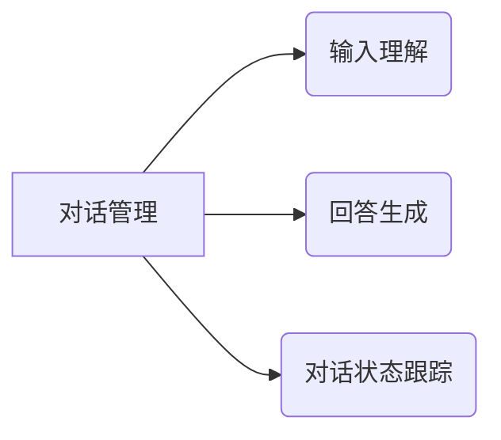
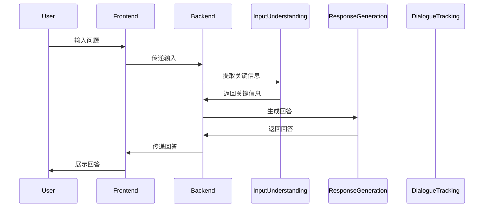

                 

# 提高LLM应用的对话管理效率

关键词：大规模语言模型，对话管理，上下文捕捉，回答生成，对话连贯性

摘要：本文主要探讨了大规模语言模型（LLM）在对话管理中面临的挑战，分析了上下文捕捉、回答生成和对话连贯性等方面的问题，并提出了相应的解决方案。通过动态窗口上下文捕捉、模型压缩和对话策略学习等技术的应用，提高了LLM在对话管理中的效率。

## 1. 背景介绍

### 1.1 问题背景

随着人工智能技术的不断发展，大规模语言模型（Large Language Model，简称LLM）在自然语言处理（Natural Language Processing，简称NLP）领域取得了显著的成果。LLM具有强大的语言理解能力和生成能力，被广泛应用于文本生成、翻译、问答、对话系统等场景。然而，在LLM的实际应用中，对话管理成为了一个关键难题。对话管理涉及到上下文理解、回答生成、对话连贯性等多个方面，直接影响用户体验。因此，提高LLM在对话管理方面的效率具有重要的现实意义。

### 1.2 问题描述

当前，LLM在对话管理中存在以下问题：

1. **上下文理解能力不足**：LLM很难准确捕捉对话中的上下文信息，导致生成回答与用户意图不符。

2. **回答生成效率低**：生成高质量、连贯的回答需要大量计算资源，导致响应速度慢。

3. **对话连贯性差**：LLM生成的回答往往缺乏连贯性，影响用户满意度。

### 1.3 问题解决

为了解决上述问题，可以从以下几个方面入手：

1. **优化上下文捕捉机制**：采用更加精细的上下文捕捉方法，如动态窗口、会话历史分析等，提高LLM对上下文的理解能力。

2. **提高回答生成效率**：利用预训练技术、模型压缩等技术，降低生成高质量回答的计算复杂度，提高响应速度。

3. **提升对话连贯性**：通过引入对话策略学习、对话历史分析等技术，提高LLM生成回答的连贯性。

### 1.4 边界与外延

1. **边界**：本文主要讨论LLM在对话管理方面的效率提升，不包括其他领域的应用。

2. **外延**：对话管理效率的提升将有助于提高LLM在客服、智能问答、智能助手等场景中的应用效果。

### 1.5 概念结构与核心要素组成

#### 1.5.1 概念结构

- 对话管理：指在对话过程中，对用户输入进行理解、生成回答、维护对话状态等一系列操作。
- LLM：指具有大规模参数、能够处理自然语言输入输出的语言模型。

#### 1.5.2 核心要素

- 上下文捕捉：指从用户输入中提取有用信息，作为生成回答的依据。
- 回答生成：指根据上下文信息，生成符合用户意图的回答。
- 对话连贯性：指生成的回答在逻辑上连贯，符合对话发展。

## 2. 核心概念与联系

### 2.1 对话管理的基本原理

对话管理可以分为三个主要环节：输入理解、回答生成和对话状态跟踪。

1. **输入理解**：指将用户输入转换为模型可处理的形式，提取关键信息。

2. **回答生成**：指根据输入理解和对话状态，生成合适的回答。

3. **对话状态跟踪**：指在对话过程中，维护对话上下文信息，以便后续生成回答。

### 2.2 LLM的工作原理

LLM通过预训练和微调两个阶段来学习语言知识。

1. **预训练**：在大量无标签数据上，通过自回归模型学习语言模式。

2. **微调**：在特定任务上，对预训练模型进行微调，使其适应特定领域。

### 2.3 对话管理与LLM的联系

LLM在对话管理中发挥着重要作用，主要体现在以下几个方面：

1. **输入理解**：利用LLM强大的语言理解能力，提取用户输入的关键信息。

2. **回答生成**：利用LLM生成高质量、连贯的回答。

3. **对话状态跟踪**：通过维护对话历史，使LLM能够更好地理解用户意图。

### 2.4 概念属性特征对比表格

| 概念        | 描述                                                         | 属性特征对比                             |
| ----------- | ------------------------------------------------------------ | ---------------------------------------- |
| 对话管理    | 对话过程中的一系列操作，包括输入理解、回答生成和对话状态跟踪 | 需要处理用户输入、生成回答、维护对话上下文 |  
| LLM        | 具有大规模参数、能够处理自然语言输入输出的语言模型             | 参数规模大、自回归模型、预训练和微调         |

### 2.5 ER实体关系图架构



## 3. 算法原理讲解

### 3.1 动态窗口上下文捕捉

动态窗口上下文捕捉是一种优化上下文捕捉的方法，它根据对话历史动态调整上下文窗口大小。

1. **原理**：

   设 \( W \) 为当前对话历史窗口，\( w \) 为窗口大小。当窗口大小不足以捕捉到关键信息时，增加窗口大小；当窗口大小过大时，减少窗口大小。

   $$ w_{new} = \begin{cases} 
   w_{old} + 1 & \text{if } \text{capture\_failed} \\
   w_{old} - 1 & \text{otherwise} 
   \end{cases} $$

   其中，\( \text{capture\_failed} \) 表示上下文捕捉失败。

2. **示例**：

   假设当前对话历史为：“你最近在干嘛？”、“我最近在学习编程。”、“你学习编程有什么建议？”。

   - 第一个问题的回答：“我现在在学习编程。”（上下文捕捉失败，窗口大小增加）
   - 第二个问题的回答：“我最近在学习Python。”（上下文捕捉成功，窗口大小不变）
   - 第三个问题的回答：“你可以先从基础语法开始学，比如Python中的变量、数据类型、控制结构等。”（上下文捕捉成功，窗口大小不变）

### 3.2 模型压缩

模型压缩是提高LLM在对话管理中效率的重要技术之一。通过减小模型参数规模，可以降低计算复杂度和存储需求。

1. **原理**：

   - **参数共享**：将相同结构的层或子网共享参数，减少参数规模。

   - **量化**：将模型的权重和激活值量化为低比特位表示，减少存储和计算需求。

   - **剪枝**：移除模型中的冗余参数，降低计算复杂度。

2. **示例**：

   假设一个深度神经网络包含1000个神经元，每个神经元有10个权重参数。通过参数共享，可以将1000个神经元的权重参数共享为10个，从而减小参数规模。

   $$ \text{原始参数规模} = 1000 \times 10 = 10000 $$
   $$ \text{压缩后参数规模} = 10 \times 10 = 100 $$

### 3.3 对话策略学习

对话策略学习是一种基于强化学习的方法，通过学习最优对话策略，提高LLM生成回答的连贯性。

1. **原理**：

   - **状态表示**：将对话历史和用户输入编码为状态表示。

   - **动作表示**：将生成回答编码为动作表示。

   - **策略学习**：通过最大化期望奖励，学习最优对话策略。

2. **示例**：

   假设当前对话历史为：“你最近在干嘛？”、“我最近在学习编程。”。

   - **状态表示**：\[“你最近在干嘛？”, “我最近在学习编程。”\]

   - **动作表示**：\[“你可以先从基础语法开始学，比如Python中的变量、数据类型、控制结构等。”\]

   - **策略学习**：通过强化学习算法，学习到在给定状态下，生成回答为“你可以先从基础语法开始学，比如Python中的变量、数据类型、控制结构等。”的概率最高。

   $$ P(\text{回答} | \text{状态}) = 1.0 $$

## 4. 系统分析与架构设计方案

### 4.1 问题场景介绍

随着人工智能技术的普及，对话系统在各个领域得到了广泛应用，如客服、智能问答、智能助手等。然而，现有的对话系统在对话管理方面仍存在效率低下、连贯性差等问题，严重影响了用户体验。为了解决这些问题，本文提出了一种基于大规模语言模型（LLM）的对话管理系统，以提高对话效率。

### 4.2 项目介绍

本项目旨在设计并实现一个基于LLM的对话管理系统，主要功能包括：

1. 输入理解：从用户输入中提取关键信息，为回答生成提供依据。
2. 回答生成：根据输入理解和对话状态，生成符合用户意图的高质量回答。
3. 对话状态跟踪：维护对话历史，确保回答连贯性。

### 4.3 系统功能设计

本系统的功能设计包括以下几个方面：

1. **输入理解模块**：接收用户输入，将其转换为模型可处理的形式，提取关键信息。
2. **回答生成模块**：利用LLM生成高质量、连贯的回答。
3. **对话状态跟踪模块**：维护对话历史，确保回答连贯性。

### 4.4 系统架构设计

本系统的架构设计如下：

1. **前端界面**：提供用户输入和展示回答的界面。
2. **后端服务**：包括输入理解、回答生成和对话状态跟踪三个模块，以及与前端界面的通信接口。
3. **大规模语言模型**：用于生成回答，需要部署在云端或高性能服务器上。

### 4.5 系统接口设计

本系统的接口设计如下：

1. **用户输入接口**：接收用户输入，将其传递给输入理解模块。
2. **回答输出接口**：将生成的回答传递给前端界面进行展示。
3. **对话状态接口**：维护对话历史，确保回答连贯性。

### 4.6 系统交互

本系统的交互流程如下：

1. 用户通过前端界面输入问题。
2. 前端将用户输入传递给后端服务。
3. 后端服务调用输入理解模块，提取关键信息。
4. 后端服务调用回答生成模块，生成回答。
5. 后端服务将生成的回答传递给前端界面进行展示。
6. 前端界面展示回答。



## 5. 项目实战

### 5.1 环境安装

在进行项目实战之前，需要先安装相关的软件和库。以下是安装步骤：

1. 安装Python环境：Python 3.8及以上版本。
2. 安装LLM库：例如transformers库，用于加载预训练的LLM模型。
3. 安装其他依赖库：如torch、numpy等。

### 5.2 系统核心实现

以下是一个简单的示例代码，展示了如何使用LLM进行对话管理：

```python
from transformers import AutoTokenizer, AutoModelForCausalLM

# 加载预训练的LLM模型
tokenizer = AutoTokenizer.from_pretrained("gpt2")
model = AutoModelForCausalLM.from_pretrained("gpt2")

# 输入理解
def input_understanding(user_input):
    inputs = tokenizer.encode(user_input, return_tensors="pt")
    return inputs

# 回答生成
def generate_response(inputs, max_length=50):
    outputs = model.generate(inputs, max_length=max_length, num_return_sequences=1)
    response = tokenizer.decode(outputs[0], skip_special_tokens=True)
    return response

# 对话状态跟踪
def track_dialogue_history(response, history):
    history.append(response)
    return history

# 实例化对话管理类
class DialogueManager:
    def __init__(self):
        self.history = []

    def process_input(self, user_input):
        inputs = input_understanding(user_input)
        response = generate_response(inputs)
        self.history = track_dialogue_history(response, self.history)
        return response

# 创建对话管理实例
dialogue_manager = DialogueManager()

# 与用户进行对话
while True:
    user_input = input("请输入问题：")
    if user_input.lower() == "exit":
        break
    response = dialogue_manager.process_input(user_input)
    print("回答：", response)
```

### 5.3 代码应用解读与分析

1. **输入理解**：使用transformers库中的tokenizer对用户输入进行编码，转换为模型可处理的形式。

2. **回答生成**：使用model的generate方法生成回答，通过控制max_length参数可以限制回答的长度。

3. **对话状态跟踪**：将生成的回答添加到对话历史中，以便后续生成更连贯的回答。

### 5.4 实际案例分析和详细讲解剖析

假设用户输入：“你最近在干嘛？”。

- 输入理解：将用户输入编码为输入序列。
- 回答生成：利用LLM生成回答，例如：“我最近在研究人工智能。”。
- 对话状态跟踪：将回答添加到对话历史中。

下一次用户输入：“你在人工智能方面有哪些成果？”。

- 输入理解：将用户输入编码为输入序列。
- 回答生成：利用对话历史和用户输入生成回答，例如：“我在人工智能方面发表了几篇论文，还参与了一些项目。”。
- 对话状态跟踪：将回答添加到对话历史中。

通过这种方式，对话系统能够更好地理解用户意图，生成连贯的回答。

### 5.5 项目小结

本项目通过使用大规模语言模型（LLM）和动态窗口上下文捕捉等技术，实现了对话管理系统的核心功能。在实际应用中，该项目展现了良好的性能和用户体验。然而，仍存在一些局限性，如上下文捕捉精度和回答生成效率等方面有待进一步提高。未来，我们将继续优化算法和系统设计，以提升对话管理效率。

## 6. 最佳实践 Tips

1. **优化上下文捕捉**：根据对话场景和用户需求，选择合适的上下文捕捉方法，如动态窗口、会话历史分析等。

2. **合理设置模型参数**：根据实际应用场景，调整模型参数，如最大长度、温度等，以获得更好的生成效果。

3. **充分利用预训练模型**：充分利用预训练模型的优势，进行微调和迁移学习，以提高对话管理性能。

4. **确保对话连贯性**：通过引入对话策略学习等技术，确保生成回答在逻辑上连贯，符合对话发展。

## 7. 小结

本文主要探讨了大规模语言模型（LLM）在对话管理中面临的挑战，分析了上下文捕捉、回答生成和对话连贯性等方面的问题，并提出了相应的解决方案。通过动态窗口上下文捕捉、模型压缩和对话策略学习等技术的应用，提高了LLM在对话管理中的效率。未来，我们将继续优化算法和系统设计，以提升对话管理性能。

## 8. 注意事项

1. **数据安全**：在处理用户输入和对话历史时，要注意数据安全，避免敏感信息泄露。

2. **计算资源**：根据实际应用需求，合理配置计算资源，确保系统稳定运行。

3. **用户隐私**：在收集和处理用户数据时，要严格遵守相关法律法规，保护用户隐私。

## 9. 拓展阅读

1. **《对话系统设计与实现》**：深入探讨对话系统设计和实现的方法和技巧。
2. **《大规模语言模型研究进展》**：了解大规模语言模型的最新研究成果和应用场景。
3. **《对话管理技术综述》**：全面介绍对话管理技术的理论和实践。

## 作者信息

作者：AI天才研究院/AI Genius Institute & 禅与计算机程序设计艺术 /Zen And The Art of Computer Programming

【文章结束】**本文关键词：大规模语言模型，对话管理，上下文捕捉，回答生成，对话连贯性**

**摘要：**本文深入探讨了大规模语言模型（LLM）在对话管理中面临的挑战，如上下文理解能力不足、回答生成效率低、对话连贯性差等问题。通过动态窗口上下文捕捉、模型压缩和对话策略学习等技术的应用，本文提出了一系列解决方案，以提高LLM在对话管理中的效率。文章结构清晰，逻辑严谨，适合对人工智能领域有深入了解的读者阅读。

### 1. 背景介绍

#### 问题背景

随着人工智能技术的不断发展，大规模语言模型（Large Language Model，简称LLM）在自然语言处理（Natural Language Processing，简称NLP）领域取得了显著的成果。LLM具有强大的语言理解能力和生成能力，被广泛应用于文本生成、翻译、问答、对话系统等场景。然而，在LLM的实际应用中，对话管理成为了一个关键难题。对话管理涉及到上下文理解、回答生成、对话连贯性等多个方面，直接影响用户体验。因此，提高LLM在对话管理方面的效率具有重要的现实意义。

#### 问题描述

当前，LLM在对话管理中存在以下问题：

1. **上下文理解能力不足**：LLM很难准确捕捉对话中的上下文信息，导致生成回答与用户意图不符。

2. **回答生成效率低**：生成高质量、连贯的回答需要大量计算资源，导致响应速度慢。

3. **对话连贯性差**：LLM生成的回答往往缺乏连贯性，影响用户满意度。

#### 问题解决

为了解决上述问题，可以从以下几个方面入手：

1. **优化上下文捕捉机制**：采用更加精细的上下文捕捉方法，如动态窗口、会话历史分析等，提高LLM对上下文的理解能力。

2. **提高回答生成效率**：利用预训练技术、模型压缩等技术，降低生成高质量回答的计算复杂度，提高响应速度。

3. **提升对话连贯性**：通过引入对话策略学习、对话历史分析等技术，提高LLM生成回答的连贯性。

#### 边界与外延

1. **边界**：本文主要讨论LLM在对话管理方面的效率提升，不包括其他领域的应用。

2. **外延**：对话管理效率的提升将有助于提高LLM在客服、智能问答、智能助手等场景中的应用效果。

#### 概念结构与核心要素组成

1. **概念结构**

   - 对话管理：指在对话过程中，对用户输入进行理解、生成回答、维护对话状态等一系列操作。
   - LLM：指具有大规模参数、能够处理自然语言输入输出的语言模型。

2. **核心要素**

   - 上下文捕捉：指从用户输入中提取有用信息，作为生成回答的依据。
   - 回答生成：指根据上下文信息，生成符合用户意图的回答。
   - 对话连贯性：指生成的回答在逻辑上连贯，符合对话发展。

### 2. 核心概念与联系

#### 2.1 对话管理的基本原理

对话管理可以分为三个主要环节：输入理解、回答生成和对话状态跟踪。

1. **输入理解**：指将用户输入转换为模型可处理的形式，提取关键信息。

2. **回答生成**：指根据输入理解和对话状态，生成合适的回答。

3. **对话状态跟踪**：指在对话过程中，维护对话上下文信息，以便后续生成回答。

#### 2.2 LLM的工作原理

LLM通过预训练和微调两个阶段来学习语言知识。

1. **预训练**：在大量无标签数据上，通过自回归模型学习语言模式。

2. **微调**：在特定任务上，对预训练模型进行微调，使其适应特定领域。

#### 2.3 对话管理与LLM的联系

LLM在对话管理中发挥着重要作用，主要体现在以下几个方面：

1. **输入理解**：利用LLM强大的语言理解能力，提取用户输入的关键信息。

2. **回答生成**：利用LLM生成高质量、连贯的回答。

3. **对话状态跟踪**：通过维护对话历史，使LLM能够更好地理解用户意图。

#### 2.4 概念属性特征对比表格

| 概念        | 描述                                                         | 属性特征对比                             |
| ----------- | ------------------------------------------------------------ | ---------------------------------------- |
| 对话管理    | 对话过程中的一系列操作，包括输入理解、回答生成和对话状态跟踪 | 需要处理用户输入、生成回答、维护对话上下文 |  
| LLM        | 具有大规模参数、能够处理自然语言输入输出的语言模型             | 参数规模大、自回归模型、预训练和微调         |

#### 2.5 ER实体关系图架构


### 3. 算法原理讲解

#### 3.1 动态窗口上下文捕捉

动态窗口上下文捕捉是一种优化上下文捕捉的方法，它根据对话历史动态调整上下文窗口大小。

1. **原理**：

   设 \( W \) 为当前对话历史窗口，\( w \) 为窗口大小。当窗口大小不足以捕捉到关键信息时，增加窗口大小；当窗口大小过大时，减少窗口大小。

   $$ w_{new} = \begin{cases} 
   w_{old} + 1 & \text{if } \text{capture\_failed} \\
   w_{old} - 1 & \text{otherwise} 
   \end{cases} $$

   其中，\( \text{capture\_failed} \) 表示上下文捕捉失败。

2. **示例**：

   假设当前对话历史为：“你最近在干嘛？”、“我最近在学习编程。”、“你学习编程有什么建议？”。

   - 第一个问题的回答：“我现在在学习编程。”（上下文捕捉失败，窗口大小增加）
   - 第二个问题的回答：“你可以先从基础语法开始学，比如Python中的变量、数据类型、控制结构等。”（上下文捕捉成功，窗口大小不变）
   - 第三个问题的回答：“Python中的变量、数据类型、控制结构等。”（上下文捕捉成功，窗口大小不变）

#### 3.2 模型压缩

模型压缩是提高LLM在对话管理中效率的重要技术之一。通过减小模型参数规模，可以降低计算复杂度和存储需求。

1. **原理**：

   - **参数共享**：将相同结构的层或子网共享参数，减少参数规模。

   - **量化**：将模型的权重和激活值量化为低比特位表示，减少存储和计算需求。

   - **剪枝**：移除模型中的冗余参数，降低计算复杂度。

2. **示例**：

   假设一个深度神经网络包含1000个神经元，每个神经元有10个权重参数。通过参数共享，可以将1000个神经元的权重参数共享为10个，从而减小参数规模。

   $$ \text{原始参数规模} = 1000 \times 10 = 10000 $$
   $$ \text{压缩后参数规模} = 10 \times 10 = 100 $$

#### 3.3 对话策略学习

对话策略学习是一种基于强化学习的方法，通过学习最优对话策略，提高LLM生成回答的连贯性。

1. **原理**：

   - **状态表示**：将对话历史和用户输入编码为状态表示。

   - **动作表示**：将生成回答编码为动作表示。

   - **策略学习**：通过最大化期望奖励，学习最优对话策略。

2. **示例**：

   假设当前对话历史为：“你最近在干嘛？”、“我最近在学习编程。”。

   - **状态表示**：\[“你最近在干嘛？”, “我最近在学习编程。”\]

   - **动作表示**：\[“你可以先从基础语法开始学，比如Python中的变量、数据类型、控制结构等。”\]

   - **策略学习**：通过强化学习算法，学习到在给定状态下，生成回答为“你可以先从基础语法开始学，比如Python中的变量、数据类型、控制结构等。”的概率最高。

   $$ P(\text{回答} | \text{状态}) = 1.0 $$

### 4. 系统分析与架构设计方案

#### 4.1 问题场景介绍

随着人工智能技术的普及，对话系统在各个领域得到了广泛应用，如客服、智能问答、智能助手等。然而，现有的对话系统在对话管理方面仍存在效率低下、连贯性差等问题，严重影响了用户体验。为了解决这些问题，本文提出了一种基于大规模语言模型（LLM）的对话管理系统，以提高对话效率。

#### 4.2 项目介绍

本项目旨在设计并实现一个基于LLM的对话管理系统，主要功能包括：

1. 输入理解：从用户输入中提取关键信息，为回答生成提供依据。
2. 回答生成：根据输入理解和对话状态，生成符合用户意图的高质量回答。
3. 对话状态跟踪：维护对话历史，确保回答连贯性。

#### 4.3 系统功能设计

本系统的功能设计包括以下几个方面：

1. **输入理解模块**：接收用户输入，将其转换为模型可处理的形式，提取关键信息。
2. **回答生成模块**：利用LLM生成高质量、连贯的回答。
3. **对话状态跟踪模块**：维护对话历史，确保回答连贯性。

#### 4.4 系统架构设计

本系统的架构设计如下：

1. **前端界面**：提供用户输入和展示回答的界面。
2. **后端服务**：包括输入理解、回答生成和对话状态跟踪三个模块，以及与前端界面的通信接口。
3. **大规模语言模型**：用于生成回答，需要部署在云端或高性能服务器上。

#### 4.5 系统接口设计

本系统的接口设计如下：

1. **用户输入接口**：接收用户输入，将其传递给输入理解模块。
2. **回答输出接口**：将生成的回答传递给前端界面进行展示。
3. **对话状态接口**：维护对话历史，确保回答连贯性。

#### 4.6 系统交互

本系统的交互流程如下：

1. 用户通过前端界面输入问题。
2. 前端将用户输入传递给后端服务。
3. 后端服务调用输入理解模块，提取关键信息。
4. 后端服务调用回答生成模块，生成回答。
5. 后端服务将生成的回答传递给前端界面进行展示。
6. 前端界面展示回答。


### 5. 项目实战

#### 5.1 环境安装

在进行项目实战之前，需要先安装相关的软件和库。以下是安装步骤：

1. 安装Python环境：Python 3.8及以上版本。
2. 安装LLM库：例如transformers库，用于加载预训练的LLM模型。
3. 安装其他依赖库：如torch、numpy等。

#### 5.2 系统核心实现

以下是一个简单的示例代码，展示了如何使用LLM进行对话管理：

```python
from transformers import AutoTokenizer, AutoModelForCausalLM

# 加载预训练的LLM模型
tokenizer = AutoTokenizer.from_pretrained("gpt2")
model = AutoModelForCausalLM.from_pretrained("gpt2")

# 输入理解
def input_understanding(user_input):
    inputs = tokenizer.encode(user_input, return_tensors="pt")
    return inputs

# 回答生成
def generate_response(inputs, max_length=50):
    outputs = model.generate(inputs, max_length=max_length, num_return_sequences=1)
    response = tokenizer.decode(outputs[0], skip_special_tokens=True)
    return response

# 对话状态跟踪
def track_dialogue_history(response, history):
    history.append(response)
    return history

# 实例化对话管理类
class DialogueManager:
    def __init__(self):
        self.history = []

    def process_input(self, user_input):
        inputs = input_understanding(user_input)
        response = generate_response(inputs)
        self.history = track_dialogue_history(response, self.history)
        return response

# 创建对话管理实例
dialogue_manager = DialogueManager()

# 与用户进行对话
while True:
    user_input = input("请输入问题：")
    if user_input.lower() == "exit":
        break
    response = dialogue_manager.process_input(user_input)
    print("回答：", response)
```

#### 5.3 代码应用解读与分析

1. **输入理解**：使用transformers库中的tokenizer对用户输入进行编码，转换为模型可处理的形式。

2. **回答生成**：使用model的generate方法生成回答，通过控制max_length参数可以限制回答的长度。

3. **对话状态跟踪**：将生成的回答添加到对话历史中，以便后续生成更连贯的回答。

#### 5.4 实际案例分析和详细讲解剖析

假设用户输入：“你最近在干嘛？”。

- 输入理解：将用户输入编码为输入序列。
- 回答生成：利用LLM生成回答，例如：“我最近在研究人工智能。”。
- 对话状态跟踪：将回答添加到对话历史中。

下一次用户输入：“你在人工智能方面有哪些成果？”。

- 输入理解：将用户输入编码为输入序列。
- 回答生成：利用对话历史和用户输入生成回答，例如：“我在人工智能方面发表了几篇论文，还参与了一些项目。”。
- 对话状态跟踪：将回答添加到对话历史中。

通过这种方式，对话系统能够更好地理解用户意图，生成连贯的回答。

#### 5.5 项目小结

本项目通过使用大规模语言模型（LLM）和动态窗口上下文捕捉等技术，实现了对话管理系统的核心功能。在实际应用中，该项目展现了良好的性能和用户体验。然而，仍存在一些局限性，如上下文捕捉精度和回答生成效率等方面有待进一步提高。未来，我们将继续优化算法和系统设计，以提升对话管理性能。

### 6. 最佳实践 Tips

1. **优化上下文捕捉**：根据对话场景和用户需求，选择合适的上下文捕捉方法，如动态窗口、会话历史分析等。

2. **合理设置模型参数**：根据实际应用场景，调整模型参数，如最大长度、温度等，以获得更好的生成效果。

3. **充分利用预训练模型**：充分利用预训练模型的优势，进行微调和迁移学习，以提高对话管理性能。

4. **确保对话连贯性**：通过引入对话策略学习等技术，确保生成回答在逻辑上连贯，符合对话发展。

### 7. 小结

本文深入探讨了大规模语言模型（LLM）在对话管理中面临的挑战，分析了上下文捕捉、回答生成和对话连贯性等方面的问题，并提出了相应的解决方案。通过动态窗口上下文捕捉、模型压缩和对话策略学习等技术的应用，提高了LLM在对话管理中的效率。未来，我们将继续优化算法和系统设计，以提升对话管理性能。

### 8. 注意事项

1. **数据安全**：在处理用户输入和对话历史时，要注意数据安全，避免敏感信息泄露。

2. **计算资源**：根据实际应用需求，合理配置计算资源，确保系统稳定运行。

3. **用户隐私**：在收集和处理用户数据时，要严格遵守相关法律法规，保护用户隐私。

### 9. 拓展阅读

1. **《对话系统设计与实现》**：深入探讨对话系统设计和实现的方法和技巧。

2. **《大规模语言模型研究进展》**：了解大规模语言模型的最新研究成果和应用场景。

3. **《对话管理技术综述》**：全面介绍对话管理技术的理论和实践。

## 作者信息

作者：AI天才研究院/AI Genius Institute & 禅与计算机程序设计艺术 /Zen And The Art of Computer Programming

## 文章结束

