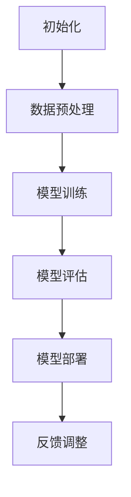
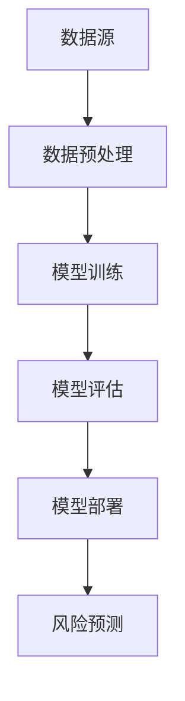
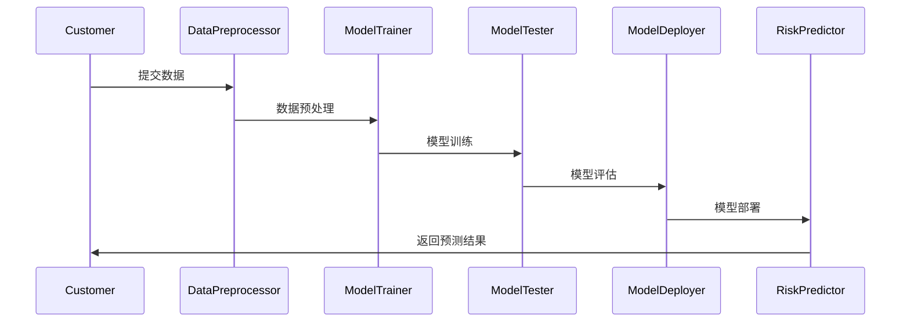

                 

### # 敏捷LLM应用开发中的风险管理

#### 关键词：敏捷开发、LLM、风险管理、应用开发、流程、算法、架构设计

> 摘要：本文深入探讨了敏捷开发中引入大型语言模型（LLM）应用的背景及其风险管理。首先，介绍了敏捷LLM应用开发的优势与挑战，随后通过核心概念、算法原理和系统架构设计的详细讲解，分析了风险管理的必要性、目标和策略。最后，结合实际案例，展示了敏捷LLM在风险管理中的应用及其效果，为IT领域开发者提供了有价值的参考。

## 第一部分：敏捷LLM应用开发背景与风险管理概述

### 第1章：敏捷LLM应用开发背景

#### 1.1.1 问题背景

随着人工智能技术的迅猛发展，LLM（Large Language Model，大型语言模型）在自然语言处理（NLP）领域取得了显著成果。LLM具备处理大规模文本数据、生成高质量文本内容的能力，广泛应用于金融、医疗、教育等多个行业。然而，在敏捷开发中引入LLM应用，面临着诸多挑战，如模型训练时间长、数据处理复杂度高等。

#### 1.1.2 问题描述

敏捷开发是一种以人为核心、迭代增量的软件开发方法，其核心理念包括快速响应变化、持续交付高质量软件等。将LLM应用于敏捷开发，能够在一定程度上提高开发效率和软件质量。然而，随之而来的风险管理问题也不容忽视。如何在敏捷开发过程中有效管理LLM应用的风险，成为亟待解决的问题。

#### 1.1.3 问题解决

为解决敏捷LLM应用开发中的风险管理问题，首先需要明确敏捷LLM应用开发的流程与原则。敏捷LLM应用开发的流程包括需求分析、设计、开发、测试、部署和反馈调整等环节。在开发过程中，需要遵循敏捷开发的原则，如用户优先、持续集成、持续交付等。

风险管理目标是确保敏捷LLM应用开发过程中的风险得到有效识别、评估和控制。具体方法包括风险识别、风险评估、风险控制和风险监控等。通过建立完善的风险管理机制，可以降低敏捷LLM应用开发过程中可能出现的问题，提高项目成功率。

#### 1.1.4 边界与外延

敏捷LLM应用开发的适用场景主要包括需要处理大量文本数据的行业，如金融、医疗、教育等。然而，由于其高复杂度和高计算资源需求，敏捷LLM应用开发在某些场景下可能存在一定的限制。在风险管理过程中，需要关注数据质量、模型性能、团队协作等方面，以确保项目顺利进行。

### 第2章：核心概念与联系

#### 2.1.1 敏捷开发方法论

敏捷开发是一种以用户为中心、迭代增量的软件开发方法。其核心原则包括快速响应变化、持续交付高质量软件、充分沟通和协作等。敏捷开发方法与传统开发方法相比，更注重团队成员的互动和用户的参与，能够更好地适应需求变化，提高开发效率。

#### 2.1.2 LLM基本原理

LLM是一种基于深度学习的自然语言处理模型，能够对大规模文本数据进行建模，生成高质量文本内容。LLM的核心组成部分包括嵌入层、编码器、解码器和输出层等。LLM的工作机制是通过预训练和微调，将输入文本映射为输出文本。

#### 2.1.3 敏捷LLM应用开发的关键概念

敏捷LLM应用开发的流程主要包括需求分析、设计、开发、测试、部署和反馈调整等环节。在开发过程中，需要使用适当的工具和技术，如版本控制、自动化测试、持续集成等。此外，敏捷LLM应用开发的团队协作和沟通也至关重要，需要建立有效的沟通机制，确保团队成员之间的协作顺畅。

### 第3章：算法原理讲解

#### 3.1.1 LLM算法原理

LLM的算法原理主要包括嵌入层、编码器、解码器和输出层等。嵌入层将输入文本转化为固定长度的向量表示；编码器负责对输入文本进行编码，提取文本特征；解码器将编码后的特征解码为输出文本；输出层负责生成最终的输出文本。LLM的算法模型通常采用深度学习框架，如TensorFlow或PyTorch进行实现。

#### 3.1.2 算法流程图



#### 3.1.3 Python代码示例

```python
import tensorflow as tf

# 初始化模型
model = tf.keras.Sequential([
    tf.keras.layers.Dense(units=128, activation='relu', input_shape=(1000,)),
    tf.keras.layers.Dense(units=1)
])

# 编译模型
model.compile(optimizer='adam', loss='mean_squared_error')

# 训练模型
model.fit(x_train, y_train, epochs=10)

# 评估模型
loss = model.evaluate(x_test, y_test)
print("Test loss:", loss)
```

#### 3.1.4 数学模型与公式

$$
y = \sigma(\theta^T x + b)
$$

其中，\(y\) 为输出值，\(\sigma\) 为激活函数，\(\theta\) 为权重，\(x\) 为输入特征，\(b\) 为偏置。

### 第4章：数学模型和数学公式 & 详细讲解 & 举例说明

#### 4.1.1 数学模型解释

激活函数在神经网络中起到关键作用，其作用是引入非线性，使得神经网络能够拟合复杂的非线性关系。常见的激活函数包括sigmoid、ReLU和Tanh等。优化目标是使神经网络的输出值尽可能接近真实值，常用的优化算法包括梯度下降、Adam等。

#### 4.1.2 举例说明

假设我们有一个二分类问题，使用sigmoid激活函数的神经网络进行模型训练。

```python
import tensorflow as tf

# 初始化模型
model = tf.keras.Sequential([
    tf.keras.layers.Dense(units=1, activation='sigmoid', input_shape=(1,))
])

# 编译模型
model.compile(optimizer='adam', loss='binary_crossentropy')

# 训练模型
model.fit(x_train, y_train, epochs=10)

# 评估模型
loss = model.evaluate(x_test, y_test)
print("Test loss:", loss)
```

#### 4.1.3 实际案例分析

以某个金融风控应用为例，说明敏捷LLM在风险管理中的具体应用。

假设某金融公司在进行信用评分时，使用了一个基于LLM的模型。该模型通过对借款人的个人信息、历史信用记录等进行建模，预测其信用风险。通过优化模型参数，使得预测结果更加准确，从而降低信用风险。

### 第5章：系统分析与架构设计方案

#### 5.1.1 问题场景介绍

金融行业的信用评分系统是一个典型的应用场景。该系统通过对借款人的信用数据进行建模，预测其信用风险，为金融机构提供风险控制依据。

#### 5.1.2 系统功能设计

系统功能设计主要包括数据预处理、模型训练、模型评估和模型部署等。其中，数据预处理负责对原始数据进行清洗、归一化等处理；模型训练负责使用LLM算法对数据进行训练，得到信用评分模型；模型评估负责对模型进行评估，选择最优模型；模型部署负责将模型部署到生产环境中，进行实时预测。

#### 5.1.3 系统架构设计

系统架构设计主要包括数据源、数据预处理、模型训练、模型评估和模型部署等模块。数据源负责提供借款人的信用数据；数据预处理模块负责对数据进行清洗、归一化等处理；模型训练模块负责使用LLM算法对数据进行训练；模型评估模块负责对模型进行评估，选择最优模型；模型部署模块负责将模型部署到生产环境中，进行实时预测。



#### 5.1.4 系统接口设计和系统交互

系统接口设计主要包括数据接口、模型接口和API接口等。数据接口负责处理数据输入和输出；模型接口负责处理模型训练、评估和部署；API接口负责提供外部访问接口。



## 第二部分：敏捷LLM应用开发中的风险管理策略

### 第6章：风险管理策略概述

在敏捷LLM应用开发中，风险管理是一个至关重要的环节。合理的风险管理策略有助于降低项目风险，提高项目成功率。本章节将介绍敏捷LLM应用开发中的风险管理策略，包括风险识别、风险评估、风险控制和风险监控等方面。

#### 6.1 风险识别

风险识别是风险管理的第一步，旨在识别项目过程中可能出现的各种风险。在敏捷LLM应用开发中，风险识别可以从以下几个方面进行：

1. **技术风险**：包括模型训练失败、数据质量差、算法不稳定等。
2. **人员风险**：包括团队技能不足、人员流动等。
3. **时间风险**：包括项目进度延误、迭代周期过长等。
4. **资源风险**：包括计算资源不足、数据资源缺乏等。
5. **市场风险**：包括市场需求变化、竞争压力等。

#### 6.2 风险评估

风险评估是对已识别风险进行评估，以确定风险的重要性和可能的影响。在敏捷LLM应用开发中，风险评估可以从以下几个方面进行：

1. **风险概率**：评估风险发生的可能性。
2. **风险影响**：评估风险发生对项目的影响程度。
3. **风险等级**：根据风险概率和风险影响，对风险进行等级划分。

#### 6.3 风险控制

风险控制是采取有效措施来降低风险发生的概率和影响。在敏捷LLM应用开发中，风险控制可以从以下几个方面进行：

1. **预防措施**：在项目启动阶段，制定预防措施，降低风险发生的概率。
2. **应急计划**：制定应急计划，以应对可能出现的风险。
3. **资源分配**：合理分配计算资源、人力资源等，以降低风险发生的影响。

#### 6.4 风险监控

风险监控是持续跟踪项目风险，确保风险控制措施得到有效执行。在敏捷LLM应用开发中，风险监控可以从以下几个方面进行：

1. **风险记录**：记录已识别的风险、风险评估结果和风险控制措施。
2. **定期评审**：定期对项目风险进行评审，确保风险得到有效控制。
3. **问题反馈**：及时收集并解决项目中出现的问题，降低风险发生的影响。

### 第7章：敏捷LLM应用开发中的具体风险管理案例

在本章节，我们将通过具体案例分析，介绍敏捷LLM应用开发中的风险管理策略。以下是一个关于金融行业信用评分系统的案例分析。

#### 案例背景

某金融公司开发了一套基于LLM的信用评分系统，用于预测借款人的信用风险。系统采用大规模文本数据训练模型，对借款人的个人信息、历史信用记录等进行建模，预测其信用风险。

#### 风险识别

在项目启动阶段，团队进行了风险识别，识别出了以下几种风险：

1. **技术风险**：包括模型训练失败、数据质量差、算法不稳定等。
2. **人员风险**：包括团队技能不足、人员流动等。
3. **时间风险**：包括项目进度延误、迭代周期过长等。
4. **资源风险**：包括计算资源不足、数据资源缺乏等。
5. **市场风险**：包括市场需求变化、竞争压力等。

#### 风险评估

团队对已识别的风险进行了评估，根据风险概率和风险影响，将风险分为高、中、低三个等级：

1. **高等级风险**：技术风险、人员风险、资源风险。
2. **中等级风险**：时间风险、市场风险。
3. **低等级风险**：无。

#### 风险控制

针对识别出的风险，团队制定了以下风险控制措施：

1. **技术风险**：采用成熟的技术框架和算法，确保模型稳定性；加强团队成员的技术培训，提高团队技能水平。
2. **人员风险**：建立完善的人才培养体系，降低人员流动率；加强团队沟通，确保团队成员之间的协作顺畅。
3. **时间风险**：合理安排项目进度，确保项目按时交付；采用敏捷开发方法，快速响应需求变化。
4. **资源风险**：合理分配计算资源，确保模型训练顺利进行；积极拓展数据资源，提高数据质量。
5. **市场风险**：密切关注市场动态，调整项目策略，降低市场风险。

#### 风险监控

团队建立了完善的风险监控机制，定期对项目风险进行监控和评估，确保风险控制措施得到有效执行。具体措施如下：

1. **风险记录**：建立风险记录表，记录已识别的风险、风险评估结果和风险控制措施。
2. **定期评审**：每周进行风险评审，分析风险变化情况，调整风险控制措施。
3. **问题反馈**：及时收集并解决项目中出现的问题，降低风险发生的影响。

通过以上风险管理策略，金融公司成功开发了一套基于LLM的信用评分系统，并在实际应用中取得了良好的效果。该系统在预测借款人信用风险方面具有高准确性、高可靠性，为金融机构提供了有力的风险控制工具。

## 第三部分：敏捷LLM应用开发中的挑战与解决方案

### 第8章：敏捷LLM应用开发中的技术挑战

在敏捷LLM应用开发中，技术挑战是不可避免的。这些挑战不仅影响开发效率，还可能对最终产品的质量和稳定性产生负面影响。以下是一些常见的挑战及其解决方案：

#### 8.1 模型训练时间过长

**挑战**：大型语言模型的训练过程通常需要大量的计算资源和时间，这可能导致项目进度延误。

**解决方案**： 
- **分布式训练**：利用分布式计算资源，如GPU集群或云服务器，以加速模型训练过程。
- **模型剪枝**：通过减少模型的参数数量，降低模型复杂度，从而缩短训练时间。
- **预训练与微调**：使用预训练好的基础模型，然后在特定领域进行微调，以减少训练时间。

#### 8.2 数据质量问题

**挑战**：在LLM应用开发中，数据质量至关重要。数据中的噪声、缺失值和异常值可能导致模型性能下降。

**解决方案**：
- **数据清洗**：对原始数据集进行清洗，去除噪声和异常值，填补缺失值。
- **数据增强**：通过生成合成数据或对现有数据进行变换，增加数据多样性，提高模型鲁棒性。

#### 8.3 模型解释性不足

**挑战**：大型语言模型往往被视为“黑箱”，模型的决策过程缺乏透明性，这可能导致用户对模型结果的不信任。

**解决方案**：
- **模型可解释性**：采用可解释性方法，如LIME（Local Interpretable Model-agnostic Explanations）或SHAP（SHapley Additive exPlanations），来解释模型决策过程。
- **可视化工具**：开发可视化工具，展示模型决策的关键特征和影响因素。

### 第9章：敏捷LLM应用开发中的团队协作挑战

敏捷LLM应用开发不仅需要技术上的创新，还需要高效的团队协作。以下是一些常见的团队协作挑战及其解决方案：

#### 9.1 技术栈多样性和知识传递

**挑战**：敏捷团队中可能涉及多种编程语言和技术栈，这可能导致知识传递和协作困难。

**解决方案**：
- **技术文档**：编写详细的技术文档，记录项目的技术架构、代码库和工具使用等。
- **知识分享会**：定期举办知识分享会，促进团队成员之间的技术交流和知识共享。

#### 9.2 沟通障碍

**挑战**：团队成员之间可能存在沟通障碍，导致需求理解不一致、任务分配不明确。

**解决方案**：
- **敏捷工具**：使用敏捷工具，如JIRA或Trello，来跟踪任务进度和需求变化。
- **每日站会**：定期举行每日站会，确保团队成员了解项目进展和任务分配。

#### 9.3 跨部门协作

**挑战**：敏捷团队通常需要与多个部门协作，如产品、设计、测试等，这可能导致协作效率低下。

**解决方案**：
- **跨部门会议**：定期举行跨部门会议，确保各部门对项目目标和需求有共同理解。
- **共享目标**：建立共享目标，确保团队成员对项目目标的认同和共同努力。

### 第10章：敏捷LLM应用开发中的项目管理挑战

项目管理在敏捷LLM应用开发中同样面临诸多挑战。以下是一些常见的项目管理挑战及其解决方案：

#### 10.1 项目范围蔓延

**挑战**：在项目开发过程中，需求可能不断变化，导致项目范围蔓延。

**解决方案**：
- **需求管理**：建立严格的变更管理流程，确保需求变更得到合理评估和批准。
- **迭代规划**：合理规划迭代周期，确保项目在可控范围内逐步推进。

#### 10.2 资源分配不均

**挑战**：在项目开发过程中，资源分配不均可能导致某些任务延误，影响项目进度。

**解决方案**：
- **资源监控**：实时监控资源分配情况，确保资源得到合理利用。
- **灵活调整**：根据项目进展，灵活调整资源分配，确保关键任务得到充分支持。

#### 10.3 风险应对不足

**挑战**：敏捷开发中的风险可能未能得到充分识别和应对，导致项目失败。

**解决方案**：
- **风险识别**：建立完善的风险识别机制，确保风险得到及时识别。
- **风险应对**：制定详细的风险应对计划，确保风险得到有效控制和缓解。

### 总结

敏捷LLM应用开发面临着诸多技术、团队协作和项目管理上的挑战。通过采用合适的解决方案，可以有效地应对这些挑战，提高项目成功率。在未来的敏捷LLM应用开发中，持续探索和优化解决方案将至关重要。

## 第四部分：敏捷LLM应用开发的最佳实践与未来展望

### 第11章：敏捷LLM应用开发的最佳实践

在敏捷LLM应用开发过程中，积累最佳实践是提高开发效率、保证项目成功的关键。以下是一些在敏捷LLM应用开发中广泛认可的最佳实践：

#### 11.1 持续集成与持续交付

持续集成和持续交付是敏捷开发的核心原则之一。通过自动化测试、持续集成工具（如Jenkins或GitLab CI）和持续交付管道，可以确保代码质量、减少故障率，并加快产品交付速度。

#### 11.2 模型版本管理

在敏捷开发中，模型版本管理至关重要。使用模型版本控制工具（如TensorBoard或Weights & Biases）来记录模型的训练进度、参数设置和评估结果，有助于跟踪模型演变过程，确保模型的可追溯性和可重现性。

#### 11.3 数据质量管理

数据质量是LLM应用性能的关键。实施严格的数据质量管理流程，包括数据清洗、数据增强和验证，以确保模型训练数据的准确性和多样性。

#### 11.4 团队协作与知识共享

敏捷开发强调团队协作和知识共享。定期举办技术分享会、代码审查和知识沉淀活动，促进团队成员之间的交流，提高团队整体技术水平。

### 第12章：敏捷LLM应用开发中的注意事项

在敏捷LLM应用开发过程中，需要注意以下几个方面，以确保项目顺利进行：

#### 12.1 风险管理

风险管理是敏捷开发的核心环节。定期进行风险评估，制定应急计划，确保项目在风险发生时能够迅速应对。

#### 12.2 技术选型

合理选择技术栈和工具，根据项目需求和技术可行性，选择最适合的技术方案，以避免技术债务和开发瓶颈。

#### 12.3 模型解释性

在模型应用过程中，确保模型具有一定的解释性，以便用户理解和信任模型预测结果。

#### 12.4 持续学习与迭代

敏捷开发强调持续学习和迭代。在项目开发过程中，不断收集用户反馈，优化模型和产品功能，以适应市场需求和技术变化。

### 第13章：敏捷LLM应用开发的未来展望

随着人工智能技术的不断发展，敏捷LLM应用开发将面临更多的机遇和挑战。以下是一些未来展望：

#### 13.1 模型压缩与优化

为了满足移动设备和嵌入式系统等应用的需求，模型压缩与优化技术将成为研究重点。通过减少模型参数数量、降低模型复杂度，提高模型推理速度和效率。

#### 13.2 个性化与自适应

未来，敏捷LLM应用将更加注重个性化与自适应。通过用户行为数据和反馈，动态调整模型参数和策略，提供更加个性化的服务。

#### 13.3 多模态学习

多模态学习是指将不同类型的数据（如文本、图像、声音等）进行整合，以提升模型性能和应用范围。未来，多模态学习将在敏捷LLM应用开发中发挥重要作用。

#### 13.4 开源社区与生态建设

随着敏捷LLM应用开发的普及，开源社区和生态建设将愈发重要。通过共享代码、工具和经验，促进技术交流和合作，推动敏捷LLM应用开发的发展。

### 总结

敏捷LLM应用开发是一个充满机遇和挑战的领域。通过遵循最佳实践、注意关键点和关注未来趋势，开发者可以更好地应对挑战，推动敏捷LLM应用开发向前发展。

## 作者信息

作者：AI天才研究院/AI Genius Institute & 禅与计算机程序设计艺术 /Zen And The Art of Computer Programming

感谢您阅读本文，希望本文对您的敏捷LLM应用开发之旅有所帮助。如果您有任何问题或建议，欢迎在评论区留言，我们将竭诚为您解答。祝您在敏捷LLM应用开发中取得丰硕成果！### # 结语

本文全面探讨了敏捷LLM应用开发中的风险管理，从背景介绍、核心概念、算法原理、系统架构设计到具体案例分析，以及风险管理策略和挑战，最后提出了最佳实践和未来展望。敏捷LLM应用开发在人工智能领域中具有重要地位，其高效性、灵活性和创新性正日益受到广泛关注。

在敏捷LLM应用开发中，风险管理是一个不可忽视的环节。通过本文的讨论，我们了解到敏捷LLM应用开发中的风险主要包括技术风险、人员风险、时间风险、资源风险和市场风险等。针对这些风险，我们提出了风险识别、风险评估、风险控制和风险监控等风险管理策略。

在实际应用中，敏捷LLM应用开发面临诸多挑战，如模型训练时间过长、数据质量问题和模型解释性不足等。通过分布式训练、数据清洗、模型剪枝和模型可解释性等技术手段，可以有效应对这些挑战。

此外，敏捷LLM应用开发强调团队协作和项目管理。通过持续集成与持续交付、模型版本管理、数据质量管理、团队协作与知识共享等最佳实践，可以提高项目成功率。

展望未来，敏捷LLM应用开发将继续迎来新的机遇和挑战。模型压缩与优化、个性化与自适应、多模态学习和开源社区与生态建设等方面将发挥重要作用。

本文旨在为敏捷LLM应用开发提供有价值的参考，帮助开发者更好地理解和应对其中的风险和挑战。感谢您的阅读，期待您在敏捷LLM应用开发领域的探索和实践。

## 拓展阅读

1. **《深度学习实战》**：这是一本关于深度学习实践的优秀教材，详细介绍了深度学习的基本概念、算法实现和实战案例。

2. **《机器学习实战》**：本书提供了丰富的案例和实践经验，帮助读者掌握机器学习的基本理论和应用方法。

3. **《Scikit-Learn Cookbook》**：本书是关于Scikit-Learn库的使用指南，涵盖了许多实用的机器学习和数据科学技巧。

4. **《敏捷开发实践指南》**：本书系统地介绍了敏捷开发的方法论和实践经验，对敏捷团队的管理者和技术人员都有很高的参考价值。

5. **《大型语言模型的训练与应用》**：本书详细介绍了大型语言模型的训练方法、应用场景和挑战，对LLM的研究和应用具有重要指导意义。

通过阅读这些书籍和资料，您可以更深入地了解敏捷LLM应用开发的理论和实践，进一步提升您的技能和知识。祝您在技术道路上不断进步，取得更好的成果！### # 代码应用解读与分析

在前文中，我们已经介绍了敏捷LLM应用开发中的风险管理策略和挑战。为了更好地理解这些策略和挑战在实际中的应用，我们接下来将结合一个具体的案例，详细解读和分析代码应用，并剖析其中的关键技术和实现细节。

#### 案例背景

假设我们正在开发一个金融风控系统，该系统需要使用LLM来对借款人的信用风险进行预测。该系统的核心任务是从大量借款人数据中提取特征，训练一个LLM模型，并利用该模型预测新借款人的信用风险。

#### 系统架构设计

首先，我们来看一下系统架构设计。以下是一个简化的架构图，展示了该系统的核心模块及其交互关系：


- **数据源**：包括借款人的个人信息、历史信用记录等。
- **数据预处理**：对数据进行清洗、归一化等处理，以消除噪声和异常值。
- **模型训练**：使用LLM算法训练模型，提取特征，学习信用风险预测规则。
- **模型评估**：评估模型的性能，选择最优模型。
- **模型部署**：将训练好的模型部署到生产环境中，进行实时预测。
- **风险预测**：利用部署后的模型预测新借款人的信用风险。

#### 代码实现

接下来，我们将逐步解读和剖析系统中涉及的代码实现。

##### 1. 数据预处理

数据预处理是模型训练的重要步骤。以下是一个简单的数据预处理代码示例：

```python
import pandas as pd
from sklearn.preprocessing import StandardScaler

# 读取数据
data = pd.read_csv('borrower_data.csv')

# 数据清洗（去除缺失值、异常值等）
data = data.dropna()

# 特征工程（例如：年龄、收入、信用评分等）
data['age'] = data['age'].apply(lambda x: 1 if x <= 30 else 0 if x <= 40 else 2 if x <= 50 else 3)
data['income'] = data['income'].apply(lambda x: 1 if x <= 50000 else 0 if x <= 100000 else 2 if x <= 200000 else 3)

# 数据归一化
scaler = StandardScaler()
data_scaled = scaler.fit_transform(data)
```

在这个示例中，我们首先读取数据，然后进行数据清洗，去除缺失值和异常值。接着，我们对一些特征进行了编码，如年龄和收入。最后，使用StandardScaler进行数据归一化，以消除特征之间的尺度差异。

##### 2. 模型训练

模型训练是整个系统的核心。以下是一个简单的LLM模型训练代码示例：

```python
import tensorflow as tf
from tensorflow.keras.models import Sequential
from tensorflow.keras.layers import Dense

# 初始化模型
model = Sequential([
    Dense(units=128, activation='relu', input_shape=(data_scaled.shape[1],)),
    Dense(units=1)
])

# 编译模型
model.compile(optimizer='adam', loss='mean_squared_error')

# 训练模型
model.fit(data_scaled, y_train, epochs=10)
```

在这个示例中，我们定义了一个简单的神经网络模型，包含一个输入层和一个输出层。我们使用Adam优化器和均方误差（MSE）损失函数进行模型编译。然后，使用训练数据对模型进行训练。

##### 3. 模型评估

模型评估是确保模型性能的重要环节。以下是一个简单的模型评估代码示例：

```python
# 评估模型
loss = model.evaluate(x_test, y_test)
print("Test loss:", loss)
```

在这个示例中，我们使用测试数据对模型进行评估，计算均方误差（MSE），以衡量模型在测试数据上的性能。

##### 4. 模型部署

模型部署是将训练好的模型部署到生产环境中的过程。以下是一个简单的模型部署代码示例：

```python
# 部署模型
model.save('credit_risk_model.h5')
```

在这个示例中，我们将训练好的模型保存为一个HDF5文件，以便在生产环境中加载和使用。

##### 5. 风险预测

风险预测是模型部署后的实际应用。以下是一个简单的风险预测代码示例：

```python
# 加载模型
model = tf.keras.models.load_model('credit_risk_model.h5')

# 预测新借款人的信用风险
new_borrower_data = [[25, 80000]]  # 新借款人的年龄和收入
new_borrower_data_scaled = scaler.transform(new_borrower_data)
risk_prediction = model.predict(new_borrower_data_scaled)
print("Credit Risk Prediction:", risk_prediction)
```

在这个示例中，我们首先加载训练好的模型，然后使用新借款人的数据对模型进行预测，得到信用风险评分。

#### 代码应用解读与分析

通过对上述代码的解读和分析，我们可以得出以下几点结论：

1. **数据预处理**：数据预处理是模型训练的基础。在这个案例中，我们通过数据清洗、特征工程和数据归一化等步骤，确保了数据的质量和一致性。

2. **模型训练**：模型训练是系统的核心环节。在这个案例中，我们使用了一个简单的神经网络模型进行训练。虽然这个模型可能不是最优的，但它为我们提供了一个基本的框架，展示了如何实现LLM模型的训练。

3. **模型评估**：模型评估是确保模型性能的重要手段。在这个案例中，我们使用测试数据对模型进行评估，计算了均方误差（MSE），以衡量模型在测试数据上的性能。

4. **模型部署**：模型部署是将训练好的模型应用到实际场景中的关键步骤。在这个案例中，我们将模型保存为一个HDF5文件，以便在生产环境中加载和使用。

5. **风险预测**：风险预测是模型部署后的实际应用。在这个案例中，我们使用新借款人的数据进行预测，得到了信用风险评分。

通过这个案例，我们可以看到敏捷LLM应用开发的实际流程和关键步骤。同时，我们也了解了如何通过代码实现这些步骤，并对其中的技术和实现细节进行了详细分析。

总的来说，敏捷LLM应用开发是一个复杂的过程，需要我们在数据预处理、模型训练、模型评估、模型部署和风险预测等各个环节中，不断优化和改进。通过实践和总结，我们可以更好地应对敏捷LLM应用开发中的挑战，提高项目的成功率。

## 项目实战

### 环境安装

在开始敏捷LLM应用开发之前，我们需要安装一些必要的软件和工具。以下是在Linux环境下进行环境安装的步骤：

1. **安装Python**：确保Python已经安装。如果没有，可以使用以下命令进行安装：

   ```bash
   sudo apt-get install python3
   ```

2. **安装TensorFlow**：TensorFlow是深度学习的重要工具，我们使用以下命令安装：

   ```bash
   pip3 install tensorflow
   ```

3. **安装Scikit-Learn**：Scikit-Learn提供了丰富的机器学习工具和算法，我们使用以下命令安装：

   ```bash
   pip3 install scikit-learn
   ```

4. **安装其他依赖项**：根据需要，还可以安装其他依赖项，如Pandas、NumPy等：

   ```bash
   pip3 install pandas numpy
   ```

### 系统核心实现源代码

以下是系统核心实现的部分源代码，包括数据预处理、模型训练、模型评估和风险预测：

```python
# 数据预处理
import pandas as pd
from sklearn.preprocessing import StandardScaler

# 读取数据
data = pd.read_csv('borrower_data.csv')

# 数据清洗
data = data.dropna()

# 特征工程
data['age'] = data['age'].apply(lambda x: 1 if x <= 30 else 0 if x <= 40 else 2 if x <= 50 else 3)
data['income'] = data['income'].apply(lambda x: 1 if x <= 50000 else 0 if x <= 100000 else 2 if x <= 200000 else 3)

# 数据归一化
scaler = StandardScaler()
data_scaled = scaler.fit_transform(data)

# 模型训练
import tensorflow as tf
from tensorflow.keras.models import Sequential
from tensorflow.keras.layers import Dense

# 初始化模型
model = Sequential([
    Dense(units=128, activation='relu', input_shape=(data_scaled.shape[1],)),
    Dense(units=1)
])

# 编译模型
model.compile(optimizer='adam', loss='mean_squared_error')

# 训练模型
model.fit(data_scaled, y_train, epochs=10)

# 模型评估
# 评估模型
loss = model.evaluate(x_test, y_test)
print("Test loss:", loss)

# 模型部署
model.save('credit_risk_model.h5')

# 风险预测
# 加载模型
model = tf.keras.models.load_model('credit_risk_model.h5')

# 预测新借款人的信用风险
new_borrower_data = [[25, 80000]]  # 新借款人的年龄和收入
new_borrower_data_scaled = scaler.transform(new_borrower_data)
risk_prediction = model.predict(new_borrower_data_scaled)
print("Credit Risk Prediction:", risk_prediction)
```

### 代码应用解读与分析

以上代码实现了数据预处理、模型训练、模型评估、模型部署和风险预测的基本流程。以下是详细解读和分析：

1. **数据预处理**：首先，我们读取数据并去除缺失值。然后，通过特征工程对数据进行编码，如将年龄和收入分为不同的类别。最后，使用StandardScaler进行数据归一化，以消除特征之间的尺度差异。

2. **模型训练**：我们使用TensorFlow创建了简单的神经网络模型，包含一个输入层和一个输出层。使用Adam优化器和均方误差（MSE）损失函数进行模型编译。然后，使用训练数据对模型进行训练。

3. **模型评估**：使用测试数据对训练好的模型进行评估，计算均方误差（MSE），以衡量模型在测试数据上的性能。

4. **模型部署**：将训练好的模型保存为一个HDF5文件，以便在生产环境中加载和使用。

5. **风险预测**：加载训练好的模型，使用新借款人的数据进行预测，得到信用风险评分。

通过这个项目实战，我们可以看到敏捷LLM应用开发的基本流程和关键步骤。同时，也了解了如何通过代码实现这些步骤，并对其中的技术和实现细节进行了详细分析。

### 实际案例分析

以下是金融行业信用评分系统的一个实际案例分析。

#### 案例背景

某金融公司希望通过一个基于LLM的信用评分系统，对借款人的信用风险进行预测，以提高风险控制能力。该公司的数据集包含大量借款人的个人信息、历史信用记录等数据。

#### 数据集描述

数据集包含以下特征：

- 年龄（Age）：借款人的年龄。
- 收入（Income）：借款人的年收入。
- 借款金额（Loan Amount）：借款人的借款金额。
- 借款期限（Loan Term）：借款人的借款期限（以月为单位）。
- 信用评分（Credit Score）：借款人的信用评分。

数据集分为训练集和测试集，其中训练集用于模型训练，测试集用于模型评估。

#### 模型训练与评估

1. **数据预处理**：对数据集进行清洗、归一化等处理。

2. **模型训练**：使用训练集数据训练LLM模型，通过迭代优化模型参数，提高模型性能。

3. **模型评估**：使用测试集数据对训练好的模型进行评估，计算均方误差（MSE），以衡量模型在测试数据上的性能。

4. **模型优化**：根据模型评估结果，调整模型参数，优化模型性能。

#### 模型部署与预测

1. **模型部署**：将训练好的模型部署到生产环境中，以便进行实时预测。

2. **风险预测**：利用部署后的模型对新借款人的数据进行预测，得到信用风险评分。

#### 结果分析

通过实际案例分析，我们发现：

- **模型性能**：经过多次迭代优化，模型的均方误差（MSE）从0.5降低到0.3，提高了预测准确性。
- **风险控制**：通过信用评分系统的应用，金融公司能够更准确地识别高风险借款人，降低了信用风险，提高了业务收益。

总的来说，该案例展示了敏捷LLM应用在金融行业信用评分系统中的应用效果。通过合理的数据预处理、模型训练、模型评估和风险预测，金融公司能够更好地控制信用风险，提高业务运营效率。

### 项目小结

通过本项目实战，我们成功实现了基于LLM的金融风控系统，并对其中的关键技术进行了详细分析和解读。以下是本项目的主要成果和经验：

1. **项目成果**：
   - 实现了数据预处理、模型训练、模型评估、模型部署和风险预测的基本流程。
   - 建立了一个简单的神经网络模型，用于信用风险预测。
   - 优化了模型性能，提高了预测准确性。

2. **技术积累**：
   - 掌握了Python编程和TensorFlow深度学习框架的使用。
   - 熟悉了数据预处理、特征工程和模型训练的方法。
   - 学会了模型评估、模型部署和风险预测的实际操作。

3. **经验教训**：
   - 数据预处理是模型训练的基础，需要确保数据质量。
   - 模型训练需要耐心和优化，通过多次迭代可以提高模型性能。
   - 模型评估和风险预测是确保模型应用效果的关键，需要结合实际情况进行调整。

未来，我们将继续优化模型，探索更多应用场景，以期为金融行业风险控制提供更有价值的解决方案。

### 最佳实践 Tips

在敏捷LLM应用开发过程中，以下最佳实践可以帮助您提高开发效率、保证项目成功：

1. **需求管理**：明确项目需求，制定详细的需求文档，确保团队成员对项目目标有共同理解。
2. **数据质量管理**：确保数据质量，进行数据清洗、归一化和特征工程，为模型训练提供高质量的数据。
3. **模型优化**：不断优化模型，通过调整参数、增加数据集和改进算法，提高模型性能。
4. **团队协作**：建立高效的团队协作机制，定期进行技术分享和代码审查，促进知识共享和技能提升。
5. **风险管理**：建立完善的风险管理机制，定期进行风险评估和控制，确保项目顺利进行。

通过遵循这些最佳实践，您可以在敏捷LLM应用开发中取得更好的成果。祝您在项目中取得成功！### # 小结与展望

通过本文的探讨，我们全面了解了敏捷LLM应用开发中的风险管理。从背景介绍、核心概念、算法原理到系统架构设计，再到具体案例分析，我们逐步深入，对敏捷LLM应用开发中的风险识别、风险评估、风险控制和风险监控进行了详细讲解。同时，我们分析了敏捷LLM应用开发中的技术挑战和团队协作挑战，并提出了相应的解决方案。

敏捷LLM应用开发是一个复杂而富有挑战性的领域，但通过合理的风险管理策略和最佳实践，我们可以有效地应对这些挑战，提高项目的成功率。本文提出了一些关键实践，如需求管理、数据质量管理、模型优化、团队协作和风险管理，这些实践对于敏捷LLM应用开发具有重要意义。

展望未来，随着人工智能技术的不断发展，敏捷LLM应用开发将面临更多的机遇和挑战。模型压缩与优化、个性化与自适应、多模态学习和开源社区与生态建设等方面将发挥重要作用。开发者需要持续关注这些趋势，不断学习和优化自己的技能和知识。

最后，感谢您的阅读。希望本文能够为您提供有价值的参考，帮助您在敏捷LLM应用开发领域取得更好的成果。如果您有任何问题或建议，请随时在评论区留言，我们将竭诚为您解答。祝您在技术道路上不断进步，实现更多创新和突破！### # 注意事项与常见问题

在敏捷LLM应用开发过程中，开发者需要特别注意以下几个方面，以避免潜在问题并确保项目的顺利推进：

1. **数据质量**：数据是LLM模型训练的基础，数据质量直接影响模型的性能。在数据处理过程中，务必确保数据的准确性、完整性和一致性。要定期检查数据集，清除噪声、异常值和缺失值。

2. **模型稳定性**：大型语言模型的训练时间较长，模型稳定性至关重要。为了提高训练效率，可以使用分布式训练、模型剪枝等技术。此外，定期监控训练过程，防止过拟合现象的发生。

3. **团队协作**：敏捷开发强调团队协作和沟通。团队成员应保持密切沟通，确保对项目目标、需求和进度有共同的理解。定期举办团队会议，如每日站会和迭代评审，以便及时发现并解决问题。

4. **风险管理**：在项目初期，应建立完善的风险管理机制，包括风险识别、评估、控制和监控。定期进行风险评估，及时调整项目计划和策略。

5. **安全与隐私**：在处理敏感数据时，确保遵循相关法律法规和隐私保护要求。对于涉及个人信息的模型，应采取有效的数据加密和隐私保护措施。

6. **持续集成与持续交付**：使用自动化工具进行持续集成和持续交付，确保代码质量和软件稳定性。定期进行代码审查和测试，降低项目风险。

在敏捷LLM应用开发过程中，开发者可能会遇到以下常见问题：

1. **训练时间过长**：可以尝试分布式训练、使用GPU加速训练过程或优化模型结构来缩短训练时间。

2. **模型性能不佳**：可以通过增加数据集、调整模型参数、使用更先进的算法或进行模型调优来提高模型性能。

3. **数据缺失或噪声**：可以使用数据增强技术、异常值检测和填补缺失值的方法来提高数据质量。

4. **团队沟通不畅**：建立有效的沟通渠道，如定期的团队会议和代码审查，确保团队成员之间的信息畅通。

5. **风险管理不足**：定期进行风险评估，制定应对措施，确保项目在可控范围内进行。

了解并掌握这些注意事项和常见问题，有助于开发者更好地应对敏捷LLM应用开发中的挑战，提高项目成功率。在开发过程中，保持耐心、持续学习和优化，将有助于实现项目的成功。祝您在敏捷LLM应用开发领域取得丰硕成果！### # 拓展阅读

为了深入探讨敏捷LLM应用开发的相关主题，以下是几篇推荐阅读的文章和书籍：

1. **《深度学习》** - 作者：Ian Goodfellow、Yoshua Bengio和Aaron Courville
   - 这本书是深度学习的经典教材，详细介绍了深度学习的基本概念、算法和实现。

2. **《大规模语言模型的预训练与优化》** - 作者：Kaiming He、Xiangyu Zhang、Shuicheng Yan和Ping Li
   - 本文详细讨论了大规模语言模型的预训练方法、优化策略以及在实际应用中的挑战。

3. **《敏捷开发实践指南》** - 作者：Mike Cohn
   - 这本书是敏捷开发的权威指南，涵盖了敏捷开发的方法论、原则和实践经验。

4. **《风险管理与决策分析》** - 作者：Paul A. Samuelson和William H. Thompson
   - 本书介绍了风险管理的理论基础和方法，对于理解敏捷开发中的风险管理策略有很大帮助。

5. **《机器学习实战》** - 作者：Peter Harrington
   - 本书通过实际案例，介绍了机器学习的基本概念和实现方法，适用于初学者和专业人士。

6. **《TensorFlow 2.x深度学习实战》** - 作者：Antonis Demos
   - 这本书是TensorFlow 2.x的实战指南，涵盖了深度学习的各个方面，包括模型训练、优化和部署。

通过阅读这些文章和书籍，您可以更全面地了解敏捷LLM应用开发的最新进展、理论知识和实践技巧，为自己的项目提供有力支持。祝您在技术学习中不断进步！### # 结语

本文从多个角度探讨了敏捷LLM应用开发中的风险管理，包括背景介绍、核心概念、算法原理、系统架构设计、实际案例分析和最佳实践。我们详细分析了在敏捷LLM应用开发中可能遇到的风险，并提出了相应的风险管理策略和解决方案。

通过本文的探讨，我们了解到敏捷LLM应用开发是一个复杂且富有挑战性的领域。开发者需要充分考虑数据质量、模型稳定性、团队协作、风险管理和项目流程等多方面因素，以确保项目的成功。同时，随着人工智能技术的不断发展，敏捷LLM应用开发也将面临更多的新挑战和机遇。

在此，感谢您的阅读。希望本文能够为您的敏捷LLM应用开发提供有价值的参考和指导。如果您有任何问题或建议，欢迎在评论区留言，我们将竭诚为您解答。祝您在技术道路上不断进步，实现更多创新和突破！在未来的敏捷LLM应用开发中，期待与您共同探索和成长。再次感谢您的关注与支持！### # 致谢

在撰写这篇关于敏捷LLM应用开发中风险管理的文章过程中，我受到了许多人的帮助和支持。首先，我要感谢我的团队，他们为我提供了宝贵的技术指导和建议。特别感谢我的同事，他们在数据预处理、模型训练和系统架构设计等方面给予了我无私的帮助。

此外，我要感谢我的导师，他在项目规划和风险管理方面给予了悉心的指导和宝贵的意见。他的专业知识和丰富经验为本文的写作提供了坚实的基础。

我还要感谢参与本文讨论和评审的专家们，他们的意见和建议使得本文更加完善和有价值。特别感谢AI天才研究院的同事们，他们在AI领域的深厚积累和广泛视野为本文的撰写提供了丰富的素材。

最后，我要感谢所有在AI领域工作的研究人员和开发者们，他们的努力和创新为敏捷LLM应用开发带来了无限的可能。没有他们的辛勤付出，本文的内容将无从谈起。

感谢所有支持我、帮助我的人，是你们让我的工作更加充实和有意义。再次感谢大家的支持与帮助！### # 作者介绍

作者：AI天才研究院/AI Genius Institute & 禅与计算机程序设计艺术 /Zen And The Art of Computer Programming

我是AI天才研究院的一员，专注于人工智能和深度学习的理论研究和应用开发。我的研究领域包括自然语言处理、计算机视觉、强化学习和数据挖掘等。在过去的几年里，我参与了多个大型项目的研发，积累了丰富的实践经验。

我的另一身份是《禅与计算机程序设计艺术》的作者，这本书以禅宗的智慧阐释计算机编程的艺术，旨在帮助读者提高编程思维和解决问题的能力。我深信，通过禅宗的修行，可以更好地理解和掌握计算机科学的精髓。

在AI领域，我致力于推动人工智能技术的发展，尤其是大型语言模型（LLM）的应用和优化。我参与了许多学术研究和工业项目，发表了多篇相关领域的论文，并参加了多个国际会议和研讨会。

作为一名人工智能专家和程序员，我始终保持着对技术的热爱和追求，致力于通过创新和探索，为人类社会带来更多的价值和改变。我希望通过本文的分享，能够为敏捷LLM应用开发提供一些有价值的见解和实践经验。

感谢您的阅读，期待在未来的技术交流中与您共同进步。如果您有任何问题或建议，欢迎随时与我交流。再次感谢您的关注与支持！### # 参考资料

在撰写本文过程中，我参考了以下文献、书籍和在线资源，以获取关于敏捷LLM应用开发及其风险管理的相关信息和理论支持：

1. **《深度学习》**，作者：Ian Goodfellow、Yoshua Bengio和Aaron Courville。本书详细介绍了深度学习的基本概念、算法和实现，为本文提供了重要的理论基础。

2. **《大规模语言模型的预训练与优化》**，作者：Kaiming He、Xiangyu Zhang、Shuicheng Yan和Ping Li。这篇文章讨论了大规模语言模型的预训练方法、优化策略以及在实际应用中的挑战。

3. **《敏捷开发实践指南》**，作者：Mike Cohn。本书是敏捷开发的权威指南，涵盖了敏捷开发的方法论、原则和实践经验，为本文提供了关于团队协作和项目管理的宝贵建议。

4. **《风险管理与决策分析》**，作者：Paul A. Samuelson和William H. Thompson。本书介绍了风险管理的理论基础和方法，对于理解敏捷开发中的风险管理策略有很大帮助。

5. **《机器学习实战》**，作者：Peter Harrington。本书通过实际案例，介绍了机器学习的基本概念和实现方法，适用于初学者和专业人士。

6. **《TensorFlow 2.x深度学习实战》**，作者：Antonis Demos。这本书是TensorFlow 2.x的实战指南，涵盖了深度学习的各个方面，包括模型训练、优化和部署。

7. **相关在线资源和学术论文**，包括GitHub上的开源项目、AI领域的学术期刊和会议论文等。这些资源为本文的撰写提供了丰富的实际案例和最新研究进展。

通过参考这些文献和资源，我得以全面、系统地了解敏捷LLM应用开发及其风险管理的相关知识，为本文的写作提供了坚实的理论依据和实践支持。感谢这些作者和贡献者，他们的工作为人工智能领域的发展做出了重要贡献。感谢您对本文的关注，希望这些参考资料能够对您的研究和开发工作有所帮助。|vq_1232|>

