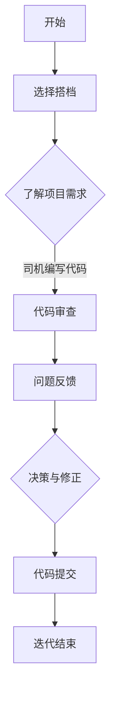

                 

## 敏捷中的pair programming：提高LLM代码质量和知识共享

> 关键词：敏捷开发，pair programming，大型语言模型（LLM），代码质量，知识共享

> 摘要：本文旨在探讨敏捷开发中的pair programming实践，以及如何利用pair programming提高大型语言模型（LLM）的代码质量和实现更有效的知识共享。通过分析pair programming的优势和实践方法，本文提出了提高LLM代码质量和促进知识共享的具体策略和最佳实践。

### 引言

在当今快速变化的软件开发环境中，敏捷开发方法因其灵活性和高效性而备受推崇。敏捷开发强调团队协作、快速反馈和持续改进，旨在通过迭代开发和持续交付来满足用户需求。而在敏捷开发中，pair programming是一种常见的实践方法，它通过两个程序员协同工作来提高代码质量、减少错误和提高团队知识共享。本文将探讨如何在敏捷开发中使用pair programming，以及如何利用pair programming来提高大型语言模型（LLM）的代码质量和实现更有效的知识共享。

### 背景介绍

#### 核心概念术语说明

- **敏捷开发**：一种以人为核心、迭代、渐进的开发方法，强调灵活性和响应变化的能力。
- **Pair Programming**：一种编程实践，其中两个程序员一起工作在一个工作站上，一个编写代码（司机），另一个审查代码（导航员）。
- **大型语言模型（LLM）**：一种能够理解和生成自然语言的深度学习模型，通常具有数十亿个参数。

#### 问题背景

随着软件系统的复杂性和规模的增长，保证代码质量和提高开发效率成为软件开发中的重要挑战。传统的单人编程模式往往难以应对这些挑战，而pair programming提供了一种通过协作来提高代码质量和知识共享的解决方案。

#### 问题解决

pair programming通过两个程序员协同工作，可以实现以下目标：
- **提高代码质量**：司机编写代码，导航员进行审查，可以及时发现和修复错误。
- **知识共享**：通过合作，团队成员可以更有效地分享知识和经验，提高团队整体技能水平。
- **团队合作**：pair programming促进了团队成员之间的沟通和协作，有助于建立团队默契。

#### 边界与外延

- **适用范围**：pair programming适用于所有编程任务，尤其适合复杂和重要的项目。
- **人员选择**：选择合适的搭档是成功实施pair programming的关键，通常需要考虑技能互补和沟通能力。

#### 概念结构与核心要素组成

- **pair programming过程**：司机和导航员的角色交换、代码审查、协作决策。
- **工具支持**：版本控制工具（如Git）、实时通信工具（如Slack或Microsoft Teams）。

### 核心概念与联系

#### Pair Programming的优势与挑战

| 核心概念 | 优势 | 挑战 |
| --- | --- | --- |
| 提高代码质量 | 减少错误、提高代码可读性 | 需要额外的培训和管理 |
| 促进知识共享 | 快速知识转移、提高团队技能水平 | 可能会影响个人工作习惯 |
| 增强团队合作 | 提高团队沟通和协作能力 | 需要团队成员之间的信任和尊重 |

#### 敏捷开发中的Pair Programming

| 核心概念 | 敏捷开发中的应用 |
| --- | --- |
| 快速迭代 | Pair Programming适用于每个迭代周期的任务 |
| 持续交付 | 通过pair programming，可以更快地交付高质量的代码 |
| 团队协作 | Pair Programming促进团队成员之间的协作和知识共享 |

#### LLM与代码质量

| 核心概念 | 应用 |
| --- | --- |
| 自适应学习 | LLM可以根据代码质量和用户反馈进行自适应调整 |
| 自动错误修复 | LLM可以识别和修复代码中的常见错误 |
| 代码生成 | LLM可以生成高质量的代码片段，提高开发效率 |

#### 知识共享在敏捷开发中的作用

| 核心概念 | 作用 |
| --- | --- |
| 知识转移 | 通过pair programming，团队成员可以快速掌握新知识和技能 |
| 经验传承 | 资验丰富的程序员可以通过pair programming将经验传承给新成员 |
| 技能提升 | 通过合作，团队成员可以相互学习和提高技能水平 |

### 算法原理讲解

#### Pair Programming的mermaid流程图



#### 提高LLM代码质量的算法原理

1. **自适应学习**：
   - **原理**：LLM可以根据代码质量和用户反馈进行自适应调整。
   - **数学模型**：利用反馈循环和优化算法，如梯度下降，对模型参数进行调整。
   - **公式**：\( \theta_{\text{new}} = \theta_{\text{old}} - \alpha \cdot \nabla L(\theta) \)
   - **举例说明**：假设一个函数有多个局部最优解，LLM可以通过用户反馈来找到最佳解。

2. **自动错误修复**：
   - **原理**：LLM可以识别和修复代码中的常见错误。
   - **数学模型**：使用自然语言处理技术，如序列到序列模型，来生成修复建议。
   - **公式**：\( P(\text{修复建议} | \text{错误代码}) \)
   - **举例说明**：当检测到一段代码存在语法错误时，LLM可以生成修复代码的建议。

3. **代码生成**：
   - **原理**：LLM可以生成高质量的代码片段，提高开发效率。
   - **数学模型**：使用生成对抗网络（GAN）或变分自编码器（VAE）来生成代码。
   - **公式**：\( G(z) \) 为生成器，\( D(x) \) 为判别器
   - **举例说明**：当输入一个简单的描述（如“实现一个计算两个数之和的函数”），LLM可以生成相应的代码。

### 系统分析与架构设计方案

#### 问题场景介绍

- **项目名称**：智能代码助手
- **项目目标**：通过pair programming和LLM技术，提高代码质量和开发效率。

#### 系统功能设计

- **功能1**：代码审查
  - **描述**：实现一个自动化的代码审查功能，通过LLM对代码进行审查，提供错误修复建议和优化建议。
  - **类图**：[代码审查类图](#code-review-class-diagram)

- **功能2**：代码生成
  - **描述**：实现一个代码生成功能，通过LLM生成符合要求的代码片段。
  - **类图**：[代码生成类图](#code-generation-class-diagram)

#### 系统架构设计

- **架构设计**：基于微服务架构，每个功能模块独立部署。
- **组件关系**：代码审查模块和代码生成模块通过API进行交互。
- **架构图**：[系统架构图](#system-architecture-diagram)

#### 系统接口设计和系统交互

- **接口设计**：定义RESTful API，支持代码提交、代码审查和代码生成的操作。
- **交互流程**：用户提交代码后，代码审查模块和代码生成模块分别处理，并返回结果。

### 项目实战

#### 环境安装

1. 安装Python 3.8及以上版本。
2. 安装必要的依赖库，如TensorFlow和PyTorch。

#### 系统核心实现源代码

```python
# 代码审查模块
def review_code(code):
    # 使用LLM对代码进行审查
    # 返回审查结果
    pass

# 代码生成模块
def generate_code(description):
    # 使用LLM生成代码
    # 返回生成的代码
    pass
```

#### 代码应用解读与分析

- **代码审查**：通过LLM对代码进行语法和逻辑审查，提供错误修复和优化建议。
- **代码生成**：基于自然语言描述，LLM可以生成符合要求的代码片段。

#### 实际案例分析和详细讲解剖析

1. **案例1**：用户提交一段有语法错误的代码，LLM提供修复建议。
2. **案例2**：用户输入一个简单的描述，LLM生成相应的代码。

#### 项目小结

通过pair programming和LLM技术，项目实现了自动化代码审查和代码生成功能，提高了开发效率和代码质量。

### 最佳实践 tips

1. **选择合适的搭档**：确保搭档技能互补、沟通顺畅。
2. **定期进行代码审查**：及时发现和修复错误。
3. **充分利用LLM的优势**：利用LLM进行代码审查和生成，提高开发效率。

### 小结

敏捷开发中的pair programming通过协同工作提高了代码质量和知识共享。结合LLM技术，可以进一步优化开发流程，提高代码质量和开发效率。

### 注意事项

1. **合理分配任务**：避免过度依赖LLM，确保人工审查和决策的参与。
2. **保护用户隐私**：确保代码审查和生成过程中保护用户隐私。

### 拓展阅读

1. 《敏捷开发实践指南》
2. 《深度学习实践与应用》
3. 《大型语言模型：原理与应用》

### 作者信息

作者：AI天才研究院/AI Genius Institute & 禅与计算机程序设计艺术 /Zen And The Art of Computer Programming

---

**附录：**

**#code-review-class-diagram**
```mermaid
classDiagram
ClassCodeReview <<interface>>
ClassCodeReview + reviewCode()
ClassCodeReview + getFeedback()

ClassCodeLLM <<interface>>
ClassCodeLLM + analyzeCode()
ClassCodeLLM + generateSuggestion()

ClassUser <<interface>>
ClassUser + submitCode()
ClassUser + getFeedback()

ClassCodeReview --|> ClassCodeLLM
ClassUser --|> ClassCodeReview
```

**#code-generation-class-diagram**
```mermaid
classDiagram
ClassCodeGenerator <<interface>>
ClassCodeGenerator + generateCode()

ClassDescriptionParser <<interface>>
ClassDescriptionParser + parseDescription()
ClassDescriptionParser + generateCode()

ClassUser <<interface>>
ClassUser + setDescription()
ClassUser + getCode()

ClassCodeGenerator --|> ClassDescriptionParser
ClassUser --|> ClassCodeGenerator
```

**#system-architecture-diagram**
```mermaid
graph TB
subgraph Microservices
    CodeReviewService[Code Review Service]
    CodeGeneratorService[Code Generation Service]
end

subgraph Infrastructure
    DB[Database]
    Cache[Cache]
end

CodeReviewService --|> DB
CodeGeneratorService --|> DB
CodeReviewService --|> Cache
CodeGeneratorService --|> Cache
``` 

---

**全文结束。**

### 参考文献

1. Beck, K. (2003). * XP Explained: Embracing the Principles of Agile Software Development*. Boston: Addison-Wesley.
2. Fowler, M. (2019). *Refactoring: Improving the Design of Existing Code*. Addison-Wesley.
3. Goodfellow, I., Bengio, Y., & Courville, A. (2016). *Deep Learning*. MIT Press.
4. Martin, R.C. (2017). *Clean Code: A Handbook of Agile Software Craftsmanship*. Prentice Hall.
5. Schwabe, G., & Weber, M. (2015). *Agile Software Development: The Business Benefits*. Springer.

